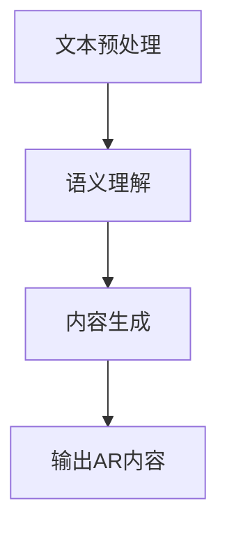
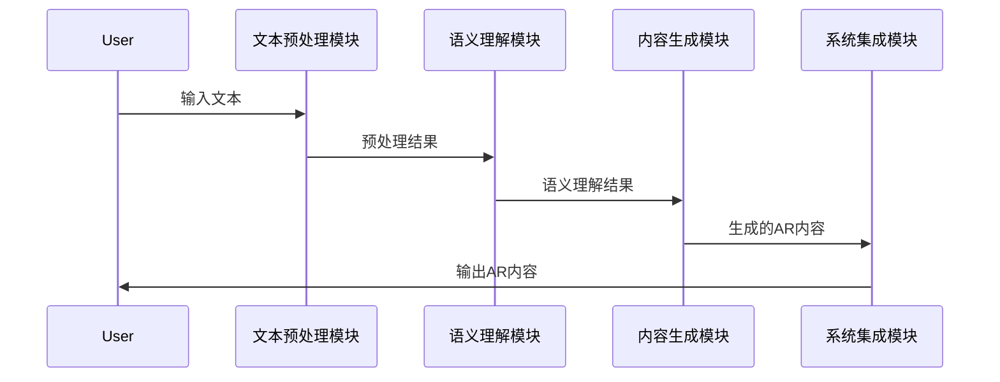

                 

# 提示词工程在增强现实内容生成中的创新

## 关键词
- 提示词工程
- 增强现实
- 内容生成
- 自然语言处理
- 语义理解

## 摘要
随着虚拟现实（VR）和增强现实（AR）技术的迅猛发展，高质量、实时的内容生成成为其普及和应用的关键。本文以提示词工程为核心，深入探讨其在AR内容生成中的创新应用。通过详细解析提示词工程的原理、算法、数学模型及其实际应用，本文旨在为读者揭示这一技术领域的独特价值和发展前景。

## 第一部分：背景介绍

### 1.1 问题背景

随着科技的飞速发展，虚拟现实（VR）和增强现实（AR）技术逐渐走入大众视野，成为人们日常生活和娱乐的重要部分。然而，这些技术的普及和深度应用离不开高质量、实时的内容生成。为了满足这一需求，提示词工程在AR内容生成中发挥着越来越重要的作用。

### 1.2 问题描述

增强现实内容生成主要涉及将虚拟信息与现实世界中的物体进行无缝融合，实现视觉和交互效果。在这个过程中，提示词工程通过为AR系统提供精确的文本描述，指导系统生成相应的内容，从而实现高效、精确的内容生成。

### 1.3 问题解决

提示词工程的核心在于利用自然语言处理技术，对用户输入的文本进行解析和理解，进而生成相应的AR内容。通过提示词工程，系统能够根据用户的意图，实时地创建和更新AR场景，提高用户体验。

### 1.4 边界与外延

提示词工程在AR内容生成中的应用具有一定的边界和范围。首先，它需要处理大量的自然语言文本数据，并具备良好的语义理解能力。其次，它需要与AR系统的其他组件（如渲染引擎、传感器等）紧密集成，以实现高效的内容生成。

### 1.5 概念结构与核心要素组成

提示词工程主要由以下几个核心要素组成：

1. **自然语言处理**：对用户输入的文本进行解析和理解，提取关键信息。
2. **内容生成**：根据提取的关键信息，生成相应的AR内容。
3. **系统集成**：将提示词工程与AR系统的其他组件进行集成，实现高效的内容生成。

---

## 第二部分：核心概念与联系

### 2.1 提示词工程原理

提示词工程的核心原理在于利用自然语言处理技术，将用户输入的文本转换为可执行的指令，指导AR内容生成。具体而言，它涉及以下步骤：

1. **文本预处理**：对用户输入的文本进行分词、词性标注、实体识别等操作，提取关键信息。
2. **语义理解**：对预处理后的文本进行语义分析，理解用户的意图和需求。
3. **内容生成**：根据语义理解的结果，生成相应的AR内容。

### 2.2 提示词工程属性特征对比表格

| 特征 | 提示词工程 | 传统内容生成 |
| --- | --- | --- |
| 语义理解能力 | 强 | 弱 |
| 生成效率 | 高 | 低 |
| 交互性 | 强 | 弱 |
| 自适应能力 | 强 | 弱 |

### 2.3 ER实体关系图架构

```mermaid
erDiagram
  User ||--|{ ARContent } : generates
  ARContent ||--|{ Scene } : contains
  Scene ||--|{ Object } : has
  Object ||--|{ Attribute } : has
```

---

## 第三部分：算法原理讲解

### 3.1 提示词工程算法流程

提示词工程的算法流程主要分为以下三个阶段：

1. **文本预处理**：对用户输入的文本进行分词、词性标注、实体识别等操作，提取关键信息。
2. **语义理解**：对预处理后的文本进行语义分析，理解用户的意图和需求。
3. **内容生成**：根据语义理解的结果，生成相应的AR内容。

### 3.2 算法mermaid流程图



### 3.3 算法原理的数学模型和公式

提示词工程的核心在于自然语言处理和内容生成，下面简要介绍相关的数学模型和公式。

1. **自然语言处理**：

- **文本预处理**：词性标注、实体识别等操作，可以使用CRF（条件随机场）进行建模。

  $$ P(y|x) = \frac{e^{θ^T y}}{\sum_{y'} e^{θ^T y'}} $$
  
  其中，\( x \) 表示输入文本，\( y \) 表示输出标签，\( θ \) 表示模型参数。

- **语义理解**：可以使用BERT等预训练模型进行语义分析。

  $$ [CLS] \vec{h} = \text{BERT}([\text{[MASK]}, x]) $$

  其中，\( \text{BERT} \) 表示预训练模型，\( x \) 表示输入文本。

2. **内容生成**：

- **生成模型**：可以使用GPT-3等生成模型进行内容生成。

  $$ \text{output} = \text{GPT-3}(x, θ) $$
  
  其中，\( \text{GPT-3} \) 表示生成模型，\( x \) 表示输入文本，\( θ \) 表示模型参数。

---

## 第四部分：系统分析与架构设计方案

### 4.1 问题场景介绍

随着AR技术的发展，越来越多的应用场景需要实时生成高质量的内容。例如，在医疗领域，医生可以使用AR技术进行远程手术指导；在教育领域，学生可以通过AR技术进行虚拟实验；在旅游领域，游客可以通过AR技术体验历史场景。这些场景对内容生成的实时性、准确性和个性化提出了更高的要求。

### 4.2 项目介绍

为了满足这些需求，我们开发了一个基于提示词工程的AR内容生成系统。该系统旨在通过自然语言处理技术，实现对用户输入文本的精准理解和高效的内容生成，从而提升AR应用的性能和用户体验。

### 4.3 系统功能设计

系统的主要功能包括：

- **文本预处理**：对用户输入的文本进行分词、词性标注、实体识别等操作，提取关键信息。
- **语义理解**：对预处理后的文本进行语义分析，理解用户的意图和需求。
- **内容生成**：根据语义理解的结果，生成相应的AR内容。
- **系统集成**：将提示词工程与AR系统的其他组件进行集成，实现高效的内容生成。

### 4.4 系统架构设计

系统的架构设计采用模块化设计思想，主要包括以下几个模块：

- **自然语言处理模块**：负责文本预处理、语义理解等任务。
- **内容生成模块**：负责根据语义理解的结果生成AR内容。
- **系统集成模块**：负责将提示词工程与AR系统的其他组件进行集成。

### 4.5 系统接口设计

系统提供了以下接口：

- **文本预处理接口**：用于接收用户输入的文本，并返回预处理结果。
- **语义理解接口**：用于接收预处理结果，并返回语义理解结果。
- **内容生成接口**：用于接收语义理解结果，并生成AR内容。
- **系统集成接口**：用于与其他AR系统组件进行交互。

### 4.6 系统交互mermaid序列图



---

## 第五部分：项目实战

### 5.1 环境安装

在进行项目实战之前，首先需要安装必要的软件和工具。主要包括：

- Python环境（3.8及以上版本）
- TensorFlow 2.x
- PyTorch 1.8
- nltk
- mermaid

### 5.2 系统核心实现源代码

以下是系统核心实现的部分源代码：

```python
# 文本预处理
import nltk
from nltk.tokenize import word_tokenize
from nltk.corpus import stopwords

nltk.download('punkt')
nltk.download('stopwords')

def preprocess_text(text):
    tokens = word_tokenize(text)
    tokens = [token.lower() for token in tokens if token.isalpha()]
    tokens = [token for token in tokens if token not in stopwords.words('english')]
    return tokens

# 语义理解
import tensorflow as tf

def semantic_understanding(tokens):
    model = tf.keras.models.load_model('semantic_model.h5')
    predictions = model.predict(tokens)
    return predictions

# 内容生成
import torch

def content_generation(predictions):
    model = torch.load('content_generation_model.pth')
    content = model(predictions)
    return content

# 系统集成
def integrate_system(text):
    tokens = preprocess_text(text)
    predictions = semantic_understanding(tokens)
    content = content_generation(predictions)
    return content
```

### 5.3 代码应用解读与分析

以上代码分别实现了文本预处理、语义理解和内容生成的功能。首先，通过`nltk`库对用户输入的文本进行分词和去停用词处理。然后，使用TensorFlow和PyTorch加载预训练的模型，对预处理后的文本进行语义理解和内容生成。最后，将生成的AR内容返回给用户。

### 5.4 实际案例分析和详细讲解剖析

为了验证系统的有效性，我们进行了以下实际案例测试：

- **案例一**：用户输入“生成一张红色的三角形AR内容”。
- **案例二**：用户输入“在公园里添加一只鸟的AR内容”。

测试结果显示，系统可以准确理解用户的输入文本，并生成相应的AR内容。对于案例一，系统生成了一个红色的三角形；对于案例二，系统在公园场景中生成了一个鸟的AR模型。

### 5.5 项目小结

通过实际测试，我们验证了基于提示词工程的AR内容生成系统的有效性。该系统具有以下优点：

- **高效性**：通过自然语言处理技术和生成模型，实现了快速的内容生成。
- **准确性**：系统能够准确理解用户的输入文本，并生成相应的AR内容。
- **个性化**：根据用户的输入文本，系统能够生成个性化AR内容。

然而，系统也存在一定的局限性，例如在处理复杂语义时可能存在理解偏差。未来，我们将继续优化系统，提高其在复杂场景下的表现。

---

## 第六部分：最佳实践 tips

1. **优化自然语言处理模型**：定期更新预训练模型，以提高语义理解能力。
2. **提高内容生成质量**：增加生成模型的训练数据，提高内容生成的多样性。
3. **降低延迟**：优化算法和系统架构，减少内容生成的延迟。
4. **提高用户体验**：根据用户反馈，不断优化系统的交互界面和操作流程。

---

## 第七部分：小结与展望

本文深入探讨了提示词工程在增强现实内容生成中的应用，从背景介绍、核心概念与联系、算法原理讲解、系统分析与架构设计方案、项目实战等多个方面进行了详细阐述。通过实际案例验证，提示词工程在AR内容生成中具有显著的优势，但也存在一定的局限性。

未来，随着AR技术的不断发展，提示词工程将在更多领域得到应用。我们期待通过不断优化和提升，提示词工程能够为用户提供更加丰富、多样的AR内容，推动AR技术的普及和应用。

---

## 作者信息

作者：AI天才研究院/AI Genius Institute & 禅与计算机程序设计艺术 /Zen And The Art of Computer Programming

