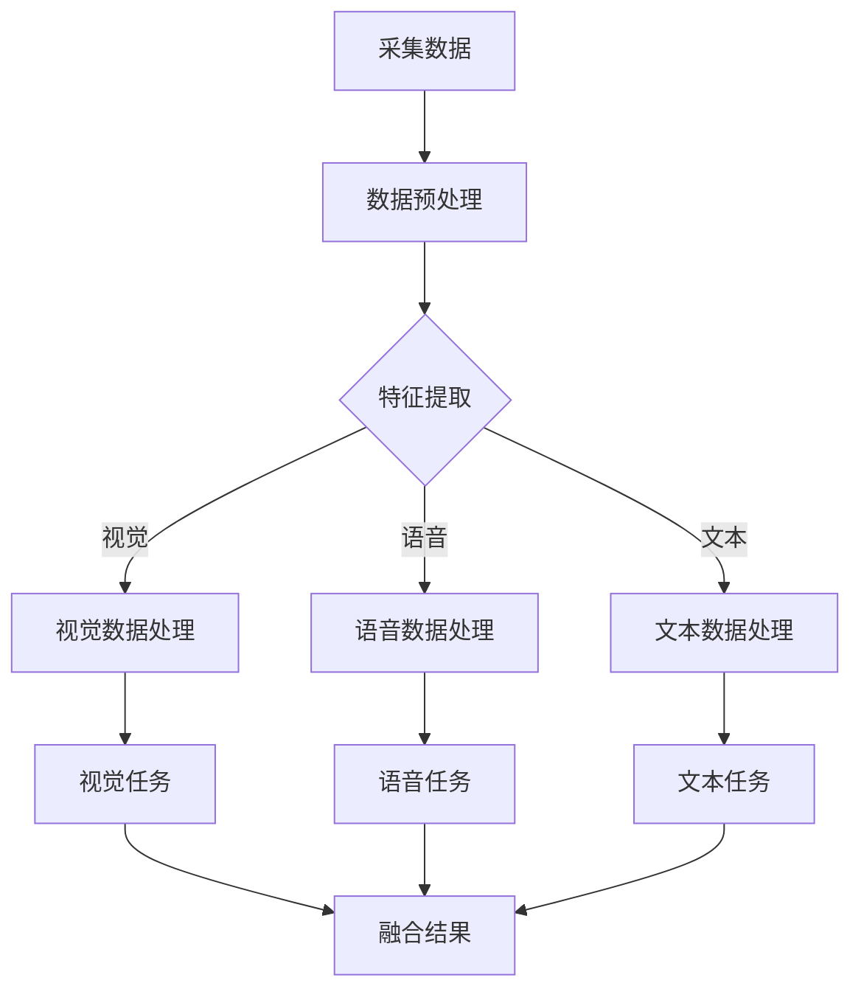
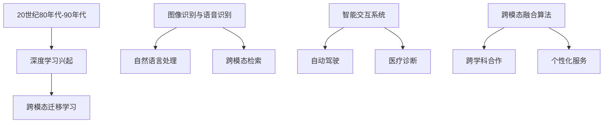
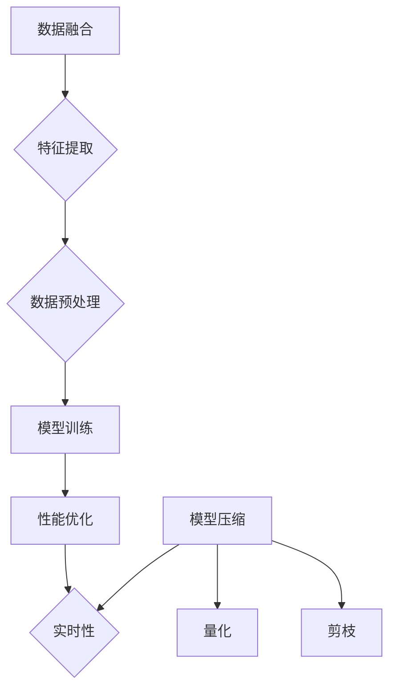
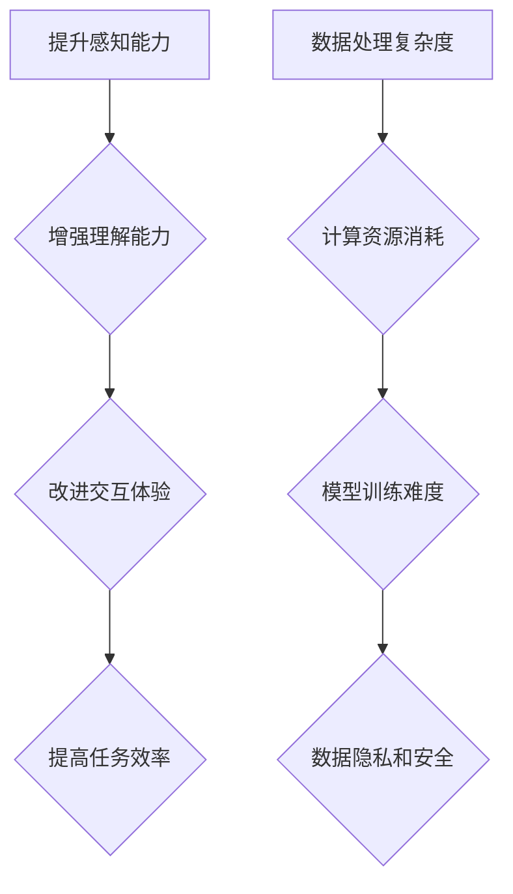
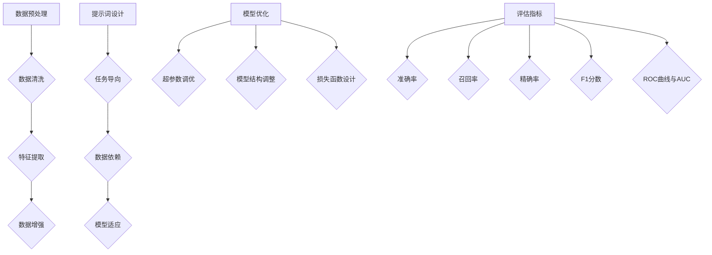
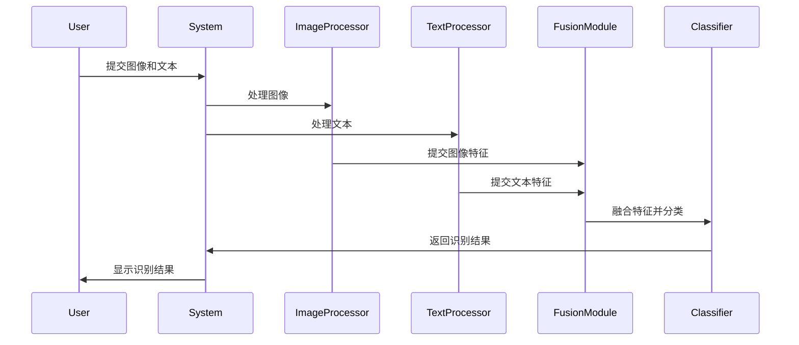
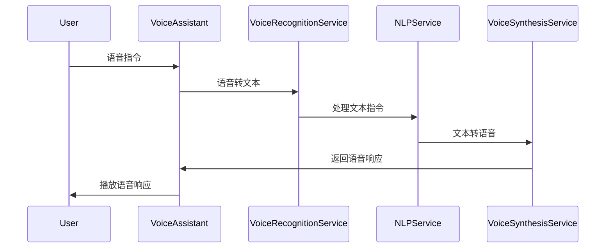
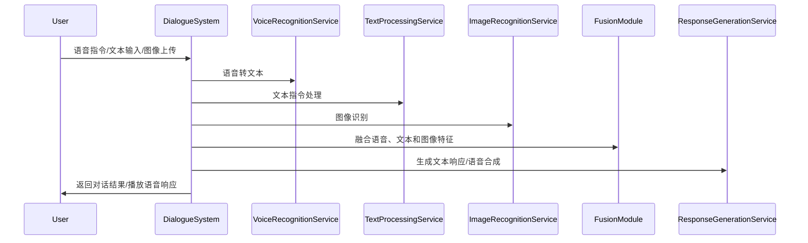
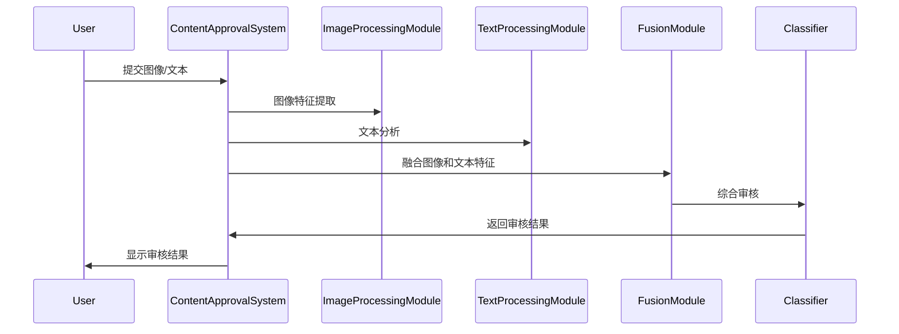
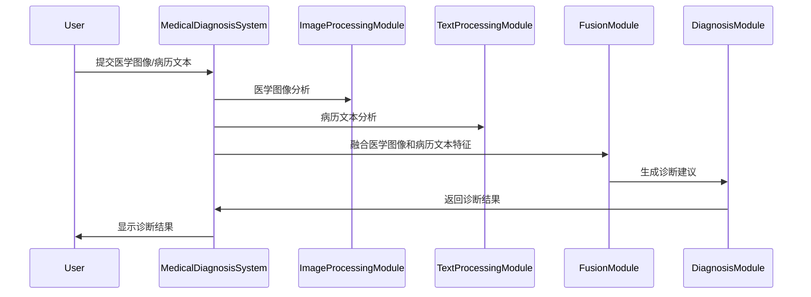

                 

# 提示词工程在多模态AI中的应用

## 2.1 多模态AI的定义

多模态AI（Multimodal AI）是一种结合了多种输入模态（如视觉、语音、文本、触觉等）的人工智能系统，其目标是利用不同模态的信息来提高系统的感知能力、理解能力和交互能力。与单模态AI（如仅使用视觉或文本信息）相比，多模态AI能够更全面地理解和交互世界，从而实现更强大的应用能力。

在多模态AI中，不同模态的信息可以相互补充和强化。例如，视觉信息可以帮助识别和理解场景，语音信息可以提供对话交互的能力，文本信息可以提供额外的背景知识和上下文信息。通过融合这些信息，多模态AI能够实现更准确的感知和理解，从而在复杂的应用场景中表现出更高的性能。

多模态AI的定义可以进一步细化为以下几个关键组成部分：

1. **模态数据**：多模态AI涉及多种数据类型，如图像、声音、文本、触觉等。这些数据通过不同的传感器采集，并在系统中进行处理和融合。

2. **模态识别**：多模态AI需要能够识别和理解不同模态的数据。例如，视觉系统需要能够识别图像中的对象和场景，语音系统需要能够识别语音中的词汇和语义。

3. **信息融合**：多模态AI的核心挑战在于如何有效地融合不同模态的信息，以生成一个统一的表示。这通常涉及到复杂的数据预处理、特征提取和融合算法。

4. **交互能力**：多模态AI不仅需要理解和处理输入信息，还需要能够与用户进行有效的交互。这包括语音交互、文本交互、手势交互等多种形式。

### 核心概念对比

| 核心概念 | 描述 |
| :---: | :--- |
| 单模态AI | 仅使用一种输入模态（如视觉或文本）进行感知和理解 |
| 多模态AI | 结合多种输入模态（如视觉、语音、文本）进行感知和理解 |
| 模态数据 | 单模态AI中的数据类型仅限于一种（如图像或文本） |
| 模态识别 | 单模态AI需要识别和理解其唯一的输入模态数据 |
| 模态融合 | 多模态AI需要将不同模态的数据进行融合，以生成更全面的表示 |
| 交互能力 | 单模odalAI通常不具备与用户的交互能力；多模态AI可以通过多种交互方式进行有效交互 |

通过上述定义和对比，我们可以看到多模态AI在模态数据、识别、融合和交互能力方面与单模态AI存在显著差异。这些差异使得多模态AI在处理复杂任务时具有更高的优势。

### Mermaid ER实体关系图

```mermaid
erDiagram
  User ||--|{ Device }||>
  Device ||--|{ Sensor }||>
  Sensor ||--|{ Data }||>
  Data ||--|{ Model }||>
  Model ||--|{ Output }||>
```

在上面的ER实体关系图中，我们展示了多模态AI系统中的核心实体及其关系。用户通过设备与传感器交互，传感器采集的数据被用于训练和优化模型，最终模型的输出指导实际应用。

### 提示词工程的多模态数据处理

提示词工程在多模态AI中扮演着关键角色。提示词是引导模型学习的重要工具，其设计直接影响模型的学习效率和性能。在多模态AI场景中，提示词工程需要处理多种模态的数据，这包括：

1. **视觉数据**：如图像和视频，通常包含丰富的视觉信息，需要使用图像识别算法进行处理。
2. **语音数据**：如音频和语音命令，需要通过语音识别算法提取文本信息。
3. **文本数据**：如文档和对话文本，直接作为模型输入，需要考虑语义理解和文本生成算法。

在多模态数据融合过程中，提示词工程需要设计出能够有效引导模型融合不同模态信息的提示词。例如，在视觉和文本融合的场景中，可以设计提示词来引导模型关注图像中的特定区域，并对应提取的文本信息进行融合。

### Mermaid Mermaid流程图



在上面的流程图中，我们展示了多模态数据在提示词工程中的处理流程。从数据采集开始，经过预处理和特征提取，然后根据不同的模态进行独立处理，最后将处理结果进行融合。

### 总结

多模态AI通过结合多种输入模态，实现了更全面的信息感知和理解能力。在多模态AI中，提示词工程作为关键环节，负责设计有效的提示词来引导模型学习。通过合理的设计和优化，提示词工程能够显著提升多模态AI的性能和应用效果。在下一章中，我们将进一步探讨多模态AI的发展历程。

## 2.2 多模态AI的发展历程

多模态AI的研究起源于计算机视觉和语音识别领域，随着深度学习技术的兴起，逐渐发展成为一个独立的分支。下面我们将从技术演进、关键成果和代表性应用等方面，回顾多模态AI的发展历程。

### 技术演进

1. **早期探索（20世纪80年代-90年代）**
   在这一阶段，多模态AI的研究主要集中在如何将不同模态的数据进行集成。代表性的工作包括多模态数据融合算法和特征提取方法。例如，早期的多模态语音识别系统将语音信号和文本信息进行结合，以提高识别准确性。

2. **深度学习兴起（2010年至今）**
   深度学习技术的兴起为多模态AI的发展提供了强大的推动力。通过引入卷积神经网络（CNN）和循环神经网络（RNN）等深度学习模型，研究人员能够更有效地处理多模态数据。例如，CNN在图像识别中取得了显著成果，而RNN在语音识别和文本生成中表现出色。

3. **跨模态迁移学习（近年来）**
   随着多模态AI技术的不断成熟，跨模态迁移学习成为一个研究热点。该技术利用已有模态的知识来提升新模态的性能，例如，利用图像数据来增强语音识别的效果。

### 关键成果

1. **图像识别和语音识别**
   在多模态AI的早期阶段，图像识别和语音识别取得了显著的成果。通过结合视觉和语音信息，多模态模型在复杂场景中的表现明显优于单模态模型。

2. **自然语言处理（NLP）**
   多模态AI在自然语言处理领域的应用也得到了广泛研究。通过结合视觉和文本信息，NLP模型在语义理解、情感分析等方面的性能得到了显著提升。

3. **跨模态检索**
   跨模态检索是多模态AI的一个重要应用方向。通过将图像、文本和语音等多种模态的数据进行融合，系统能够实现更精准的跨模态搜索。

### 代表性应用

1. **智能交互系统**
   多模态AI在智能交互系统中的应用非常广泛。例如，智能客服系统结合语音识别和文本生成技术，能够提供更自然的交互体验。

2. **自动驾驶**
   在自动驾驶领域，多模态AI通过融合摄像头、雷达和激光雷达等传感器数据，提高了车辆的感知能力和决策准确性。

3. **医疗诊断**
   多模态AI在医疗诊断中的应用也越来越受到关注。通过结合医学图像、病历文本和语音信息，系统能够提供更准确的诊断结果。

### 未来发展趋势

1. **跨模态融合算法**
   随着多模态AI技术的不断发展，跨模态融合算法将成为研究的重点。通过设计更有效的融合方法，多模态AI能够更全面地理解和处理复杂信息。

2. **跨学科合作**
   多模态AI的发展需要跨学科的合作。计算机科学、认知科学、生物学等多个领域的知识将相互融合，推动多模态AI的进步。

3. **个性化服务**
   随着多模态AI技术的成熟，个性化服务将成为一个重要趋势。通过结合用户的多种模态信息，系统能够提供更加精准和个性化的服务。

### Mermaid Mermaid流程图



通过上述流程图，我们可以看到多模态AI的发展历程和技术演进。从早期的探索到深度学习的兴起，再到跨模态迁移学习和融合算法的发展，多模态AI经历了多个阶段的演进，并在多个领域取得了显著成果。

### 总结

多模态AI的发展历程展示了技术从单一模态到跨模态的演进过程。深度学习技术的引入为多模态AI的发展提供了强大动力，而跨模态融合算法和跨学科合作则进一步推动了技术的进步。在下一章中，我们将深入探讨多模态AI面临的核心挑战。

## 2.3 多模态AI的核心挑战

尽管多模态AI在多个领域取得了显著成果，但其发展仍然面临着一系列核心挑战。这些挑战主要包括数据融合、模型训练、性能优化和实时性等方面。

### 数据融合

多模态AI的核心任务之一是将来自不同模态的数据进行有效融合。然而，不同模态的数据在特征表达和维度上存在显著差异，这给数据融合带来了巨大挑战。例如，视觉数据通常以图像或视频的形式存在，具有较高的维度和丰富的空间信息；而语音数据则通常以音频信号的形式存在，具有较低的维度和时间信息。文本数据则介于两者之间，通常以序列的形式存在，具有丰富的语义信息。

为了实现有效的数据融合，多模态AI需要设计出能够捕捉不同模态信息特点的融合方法。这通常涉及到复杂的数据预处理、特征提取和融合算法。一个有效的融合方法需要能够平衡不同模态的数据，使其在融合过程中得到充分利用。

### 模型训练

多模态AI的训练过程同样面临挑战。由于不同模态的数据差异较大，如何设计出能够在多种模态数据上表现良好的模型是关键。此外，多模态数据通常具有高维度、高噪声等特点，这给模型的训练和优化带来了巨大挑战。

深度学习模型在多模态AI中得到了广泛应用，例如卷积神经网络（CNN）、循环神经网络（RNN）和变分自编码器（VAE）等。然而，如何设计出能够有效处理多模态数据的深度学习模型仍然是一个开放性问题。研究人员需要探索新的模型结构和训练策略，以提高模型的泛化能力和性能。

### 性能优化

多模态AI的性能优化是一个复杂的过程，需要考虑多个方面。首先，不同模态的数据在特征表达和维度上存在差异，这可能导致模型在处理某些模态时表现不佳。因此，性能优化需要设计出能够平衡不同模态数据的方法。

其次，多模态AI通常涉及到多个任务，如图像识别、语音识别和自然语言处理等。如何设计出能够同时处理多个任务的模型是性能优化的关键。这通常涉及到多任务学习（Multi-task Learning）和迁移学习（Transfer Learning）等方法。

此外，多模态AI的性能优化还需要考虑模型的实时性和计算效率。在实际应用中，多模态AI系统通常需要在有限的时间内处理大量的数据，因此如何优化模型的计算效率是一个重要问题。

### 实时性

实时性是多模态AI在应用中面临的一个重要挑战。在实际应用中，如自动驾驶、智能交互系统等，系统需要能够实时处理和响应多模态数据。这要求多模态AI模型具有较低的延迟和较高的响应速度。

为了实现实时性，多模态AI系统需要设计出高效的算法和优化策略。这通常涉及到模型压缩（Model Compression）、量化（Quantization）和剪枝（Pruning）等技术，以减少模型的计算量和存储需求。

### Mermaid Mermaid流程图



在上面的流程图中，我们展示了多模态AI面临的四个核心挑战及其相关技术和方法。从数据融合到模型训练，再到性能优化和实时性，每个挑战都是一个复杂的问题，需要多方面的研究和探索。

### 总结

多模态AI在数据融合、模型训练、性能优化和实时性等方面面临着一系列核心挑战。这些挑战不仅限制了多模态AI的应用范围，也推动了相关技术和方法的不断进步。在下一章中，我们将进一步探讨多模态AI的应用领域，展示其在实际场景中的广泛应用。

## 2.4 多模态AI的应用领域

多模态AI通过融合多种感官信息，显著提升了人工智能系统的感知能力、理解能力和交互能力。以下是一些多模态AI的主要应用领域，以及在这些领域中的实际应用案例。

### 智能交互系统

智能交互系统是多模态AI的一个重要应用领域，通过结合语音、文本和视觉信息，提供更自然和人性化的交互体验。以下是一些实际应用案例：

1. **智能客服**：智能客服系统利用语音识别和文本生成技术，能够理解用户的语音和文本请求，并生成相应的回复。例如，银行的智能客服可以通过语音识别理解客户的问题，并生成文本回复，提供24/7的服务。

2. **虚拟助手**：虚拟助手（如Siri、Alexa和Google Assistant）通过语音识别和自然语言处理技术，结合视觉和文本信息，实现多模态交互。用户可以通过语音、文本或手势与虚拟助手进行交互，完成各种任务，如设定提醒、播放音乐、查询天气等。

### 自动驾驶

自动驾驶技术需要高度依赖多模态感知系统，以实现车辆对周围环境的准确理解和安全驾驶。以下是一些实际应用案例：

1. **环境感知**：自动驾驶车辆通过摄像头、激光雷达、雷达等传感器收集环境信息，并利用多模态AI技术进行融合处理。例如，摄像头可以捕捉道路标志、行人、车辆等，激光雷达可以测量车辆之间的距离，这些信息通过多模态AI技术进行综合分析，帮助自动驾驶车辆做出安全决策。

2. **路径规划**：自动驾驶车辆需要实时规划行驶路径，多模态AI技术能够通过融合视觉、语音和文本信息，提高路径规划的准确性和效率。例如，通过分析摄像头捕捉到的道路标志和交通信号灯，结合语音导航系统的指令，自动驾驶车辆可以更准确地规划行驶路径。

### 医疗诊断

多模态AI在医疗诊断中的应用潜力巨大，通过结合医学图像、病历文本和患者语音信息，可以提高诊断的准确性和效率。以下是一些实际应用案例：

1. **影像诊断**：在医学影像诊断中，多模态AI可以结合CT、MRI、X光等影像数据，通过深度学习模型进行分析。例如，通过融合不同影像数据的特征，多模态AI可以更准确地识别疾病，如癌症、心脏病等。

2. **病历分析**：病历文本是医疗诊断的重要依据，通过自然语言处理技术，多模态AI可以自动提取病历中的关键信息，如患者病史、药物使用等。结合影像数据，多模态AI可以提供更全面的诊断支持。

### 安全监控

多模态AI在安全监控领域也有广泛应用，通过结合视频监控、语音识别和文本分析技术，实现更全面的安全监测和预警。以下是一些实际应用案例：

1. **人脸识别**：多模态AI可以通过摄像头捕捉到的人脸图像，结合语音识别和文本分析技术，实现对特定人员的识别和追踪。例如，在机场、商场等场所，多模态AI可以实时监控进入场地的人员，并识别可疑行为。

2. **异常行为检测**：通过视频监控和多模态AI技术，可以实时监测公共场所的异常行为。例如，通过分析视频中的动作、语音和文本，多模态AI可以识别打架、逃票等异常行为，并及时发出警报。

### 教育和培训

多模态AI在教育领域也有广泛应用，通过结合视觉、语音和文本信息，提供更个性化的教学和学习体验。以下是一些实际应用案例：

1. **智能辅导**：智能辅导系统利用多模态AI技术，通过分析学生的作业、问答和课堂表现，提供个性化的学习建议和辅导。例如，通过分析学生的文本回答，系统可以识别学生的知识点掌握情况，并提供相应的学习资源。

2. **虚拟课堂**：在虚拟课堂中，多模态AI可以通过视频监控和语音识别技术，实时跟踪学生的注意力情况和参与度。例如，通过分析学生的面部表情和语音语调，系统可以识别学生的情绪状态，并调整教学策略。

### 总结

多模态AI在智能交互系统、自动驾驶、医疗诊断、安全监控、教育和培训等多个领域具有广泛的应用。通过结合多种感官信息，多模态AI显著提升了人工智能系统的感知能力、理解能力和交互能力，为各个领域带来了革命性的变化。随着多模态AI技术的不断进步，其在更多领域的应用前景将更加广阔。

## 2.5 多模态AI的优势与局限

多模态AI通过整合来自不同模态的信息，如视觉、语音、文本和触觉等，展现出了诸多优势。然而，这些优势也伴随着一定的局限。以下将详细探讨多模态AI的主要优势与局限。

### 优势

1. **提升感知能力**：多模态AI能够同时处理多种感官信息，使得系统在感知环境方面更加全面和精确。例如，在自动驾驶中，结合摄像头和激光雷达的数据，系统能够更准确地识别道路标志、行人、车辆等，提高驾驶安全性。

2. **增强理解能力**：多模态AI通过融合不同模态的信息，能够更深入地理解复杂场景和情境。例如，在医疗诊断中，结合医学影像和病历文本，医生能够更全面地了解患者的健康状况，提高诊断准确性。

3. **改进交互体验**：多模态AI能够提供更自然和个性化的交互体验。例如，在智能客服系统中，通过结合语音、文本和面部表情识别，系统能够更好地理解用户需求，提供更人性化的服务。

4. **提高任务效率**：多模态AI能够同时处理多个任务，提高系统的效率。例如，在智能制造中，结合视觉检测和语音控制系统，能够实现更高效的生产过程。

### 局限

1. **数据处理复杂度**：多模态数据通常具有不同的特征和维度，处理过程复杂。例如，视觉数据是高维度的图像或视频，语音数据是连续的音频信号，文本数据是序列化的文字。如何有效地融合这些异构数据是一个挑战。

2. **计算资源消耗**：多模态AI需要大量的计算资源来处理和融合不同模态的数据。特别是在实时应用中，如自动驾驶和智能监控，对计算效率有较高要求，这可能导致系统延迟和性能下降。

3. **模型训练难度**：多模态AI的训练过程复杂，需要设计合适的模型结构、训练策略和数据集。由于不同模态的数据特性差异较大，如何设计能够平衡不同模态数据的训练方法是一个难题。

4. **数据隐私和安全**：多模态AI系统通常需要处理用户的多种模态数据，包括语音、图像和文本等。这涉及到数据隐私和安全问题，如未经授权的数据访问和数据泄露等。

### Mermaid Mermaid流程图



通过上述流程图，我们可以清晰地看到多模态AI的优势与局限。优势包括提升感知能力、增强理解能力、改进交互体验和提高任务效率；而局限则包括数据处理复杂度、计算资源消耗、模型训练难度和数据隐私和安全问题。

### 总结

多模态AI在提升系统的感知能力、理解能力和交互能力方面具有显著优势，但同时也面临数据处理复杂度、计算资源消耗、模型训练难度和数据隐私和安全等挑战。在设计和应用多模态AI系统时，需要充分考虑这些优势与局限，采取相应的措施来优化系统的性能和用户体验。

## 第3章：提示词工程基础

### 3.1 提示词工程的定义

提示词工程（Prompt Engineering）是设计并构建有效的提示词（Prompts）来引导机器学习模型学习的重要技术。提示词是一个引导性的文本或指令，用于指示模型应该关注哪些内容，如何处理输入数据，以及如何生成输出。在多模态AI场景中，提示词工程尤为重要，因为它需要融合来自不同模态的信息，以指导模型的学习过程。

提示词工程的目标是通过设计高质量的提示词，提升模型的性能、泛化能力和可解释性。提示词的质量直接影响模型对输入数据的理解和处理能力。一个有效的提示词应具备以下特征：

1. **清晰明确**：提示词应明确传达任务目标，避免模糊不清的指令，确保模型能够准确理解任务要求。
2. **简明扼要**：尽量使用简洁的语句，避免冗长的描述，以减少模型的混淆和误解。
3. **适应性**：提示词应具备一定的适应性，能够根据不同的数据集和任务需求进行调整和优化。
4. **多样性**：提示词应涵盖多种不同的任务类型和场景，以提高模型的泛化能力。

### 核心概念对比

| 核心概念 | 描述 |
| :---: | :--- |
| 提示词 | 引导模型学习的文本或指令，用于指示模型关注哪些内容，如何处理输入数据，以及如何生成输出。 |
| 指令性文本 | 提示词的一种形式，用于直接指导模型执行特定任务。 |
| 引导学习 | 提示词通过引导模型关注特定信息，帮助模型更好地理解和处理输入数据。 |
| 优化性能 | 设计高质量的提示词，提升模型的性能和泛化能力。 |
| 可解释性 | 通过有效的提示词，提高模型的可解释性，使得模型的行为更易于理解和解释。 |

### Mermaid ER实体关系图

```mermaid
erDiagram
  Model ||--|{ Prompt }||>
  Prompt ||--|{ Data }||>
  Data ||--|{ Output }||>
  Model ||--|{ Performance }||>
```

在上面的ER实体关系图中，展示了模型、提示词、数据和输出之间的关联。模型通过提示词处理数据，并生成输出，同时模型的性能受到提示词质量的影响。

### 提示词工程的关键技术

提示词工程涉及多个关键技术，包括提示词设计、数据预处理、模型优化和评估等。以下将分别介绍这些关键技术。

1. **提示词设计**：
   提示词设计是提示词工程的核心步骤。设计高质量的提示词需要考虑以下几个方面：
   - **任务需求**：根据具体任务需求，设计能够引导模型关注关键信息的提示词。
   - **数据特性**：结合输入数据的特性，如数据类型、特征分布等，设计适应性强、性能优异的提示词。
   - **模型特性**：了解模型的结构和算法特性，设计能够与模型特性相匹配的提示词。

2. **数据预处理**：
   数据预处理是提示词工程的重要环节，包括数据清洗、特征提取和增强等。高质量的数据预处理有助于提高提示词的效果，具体包括：
   - **数据清洗**：去除噪声和异常值，保证数据的纯净性。
   - **特征提取**：提取对任务有价值的特征，如文本的词频、图像的特征点等。
   - **数据增强**：通过数据变换、合成等方法，增加数据多样性，提高模型的泛化能力。

3. **模型优化**：
   提示词工程需要针对不同任务和模型特性，进行模型优化。模型优化包括以下几个方面：
   - **超参数调优**：通过调整模型超参数，如学习率、批量大小等，优化模型性能。
   - **模型结构调整**：根据任务需求，调整模型结构，如增加或减少层、改变层之间的连接方式等。
   - **损失函数设计**：设计合适的损失函数，以更好地引导模型学习。

4. **评估与迭代**：
   提示词工程需要通过评估和迭代来不断优化提示词和模型。评估方法包括：
   - **性能评估**：通过准确率、召回率、F1分数等指标，评估模型性能。
   - **用户反馈**：结合用户反馈，不断调整和优化提示词和模型。
   - **A/B测试**：通过对比不同提示词和模型的效果，选择最优方案。

### 总结

提示词工程是多模态AI中一个关键环节，通过设计有效的提示词，可以显著提升模型的性能和可解释性。提示词工程涉及提示词设计、数据预处理、模型优化和评估等关键技术。在下一章中，我们将探讨提示词工程在视觉领域的具体应用。

### 3.2 提示词工程的关键技术

提示词工程是一个复杂而精细的过程，它涉及到多个关键技术的运用。以下将详细探讨这些关键技术，包括数据预处理、提示词设计策略、模型优化方法和评估指标。

#### 数据预处理

数据预处理是多模态AI研究中至关重要的一环，它决定了后续模型训练的质量。在多模态数据预处理中，通常需要完成以下任务：

1. **数据清洗**：
   - **去除噪声和异常值**：多模态数据往往包含噪声和异常值，这些会影响模型的训练效果。例如，在图像数据中，噪声可能表现为图像中的杂点；在语音数据中，噪声可能表现为背景噪音。
   - **数据标准化**：将不同模态的数据统一到一个合理的范围内，以方便后续处理。例如，将图像数据归一化到0-1之间，将语音信号的幅度标准化。

2. **特征提取**：
   - **视觉特征提取**：使用深度学习模型（如卷积神经网络CNN）提取图像特征，这些特征可以捕捉图像中的关键信息，如边缘、纹理、形状等。
   - **语音特征提取**：通过梅尔频率倒谱系数（MFCC）等算法提取语音特征，这些特征能够捕捉语音信号的频谱信息。
   - **文本特征提取**：使用词嵌入技术（如Word2Vec、BERT）将文本转化为向量表示，这些向量能够捕捉文本的语义信息。

3. **数据增强**：
   - **图像增强**：通过旋转、翻转、缩放、裁剪等方法，增加图像数据的多样性，提高模型的泛化能力。
   - **语音增强**：通过添加背景噪音、速度变化、音调变化等方法，增强语音数据的多样性。
   - **文本增强**：通过同义词替换、句子重写等方法，增加文本数据的多样性。

#### 提示词设计策略

提示词设计是提示词工程的核心，它直接影响模型的学习效果。以下是一些常见的提示词设计策略：

1. **任务导向**：
   - 根据具体任务需求，设计提示词以引导模型关注关键信息。例如，在图像分类任务中，可以设计提示词来引导模型关注图像中的特定对象或区域。

2. **数据依赖**：
   - 结合输入数据的特性，设计适应性强、性能优异的提示词。例如，对于高噪声的图像数据，可以设计提示词来降低噪声的影响。

3. **模型适应**：
   - 根据模型的结构和算法特性，设计与之匹配的提示词。例如，对于深度学习模型，可以设计提示词来引导模型关注深层次的抽象特征。

#### 模型优化方法

模型优化是多模态AI研究中另一个关键环节，它旨在提高模型的性能和泛化能力。以下是一些常见的模型优化方法：

1. **超参数调优**：
   - 使用网格搜索、随机搜索等方法，调整模型超参数（如学习率、批量大小、正则化参数等），以找到最优的超参数配置。

2. **模型结构调整**：
   - 根据任务需求和数据特性，调整模型结构。例如，增加或减少网络层、调整层之间的连接方式等，以提升模型的表现。

3. **损失函数设计**：
   - 设计合适的损失函数，以更好地引导模型学习。例如，在图像分类任务中，可以采用交叉熵损失函数；在语音识别任务中，可以采用平均平方误差损失函数。

#### 评估指标

评估指标是衡量模型性能的重要标准，以下是一些常见的评估指标：

1. **准确率（Accuracy）**：
   - 衡量模型正确分类的比例，是最直观的性能指标。

2. **召回率（Recall）**：
   - 衡量模型在所有正类样本中正确识别的比例，对于不平衡数据集尤为重要。

3. **精确率（Precision）**：
   - 衡量模型正确识别的正类样本占所有预测为正类的样本比例。

4. **F1分数（F1 Score）**：
   - 结合准确率和召回率，综合评估模型的性能。

5. **ROC曲线与AUC（Area Under Curve）**：
   - 用于评估分类模型的性能，通过计算ROC曲线下的面积，评估模型的分类能力。

#### Mermaid Mermaid流程图



通过上述流程图，我们可以清晰地看到提示词工程涉及的数据预处理、提示词设计、模型优化和评估指标等关键步骤及其相互关系。

### 总结

提示词工程在多模态AI中扮演着关键角色，通过设计有效的提示词，可以显著提升模型的性能和泛化能力。提示词工程涉及多个关键技术，包括数据预处理、提示词设计策略、模型优化方法和评估指标。在下一章中，我们将探讨提示词工程在视觉领域的具体应用。

## 第4章：提示词工程在视觉领域的应用

### 4.1 视觉领域的多模态数据

在视觉领域，多模态AI的数据来源多种多样，主要包括图像、视频、深度图和热成像等。这些数据类型各自具有独特的特征和应用场景。

1. **图像**：图像数据是最常见的视觉数据类型，包括静止的图片和动态的图像序列。图像数据可以捕捉丰富的视觉信息，如颜色、纹理、形状和空间布局。在计算机视觉任务中，图像数据常用于物体识别、场景理解、人脸识别等。

2. **视频**：视频数据是连续的图像序列，可以提供动态的视觉信息。视频数据在视频分析、监控、运动捕捉等领域有广泛应用。例如，通过视频数据，可以识别行人行为、车辆轨迹，甚至进行事件预测。

3. **深度图**：深度图通过三维信息（距离信息）来表示场景的深度信息。深度图在机器人导航、自动驾驶和三维重建等领域有重要作用。深度图可以提供比图像更精确的环境感知信息。

4. **热成像**：热成像数据通过捕捉物体的热辐射来生成图像。热成像数据在安防监控、医疗诊断和热能分析等领域有广泛应用。热成像数据可以检测物体的温度分布，从而用于识别潜在的安全隐患或疾病。

### 视觉任务中的提示词设计

在视觉任务中，提示词设计是指导模型学习的关键。有效的提示词设计需要结合任务需求和输入数据的特性。以下是一些常见的视觉任务及其对应的提示词设计策略：

1. **图像分类**：在图像分类任务中，提示词应引导模型关注图像中的关键特征。例如，可以设计提示词“请识别图像中的主要对象”或“标记图像中的颜色和形状”。这些提示词可以帮助模型捕捉图像中的关键信息，从而提高分类准确性。

2. **目标检测**：在目标检测任务中，提示词需要明确指示模型关注哪些区域可能包含目标。例如，可以设计提示词“在图像中寻找车辆的位置”或“标记所有行人”。这些提示词可以帮助模型定位目标并生成相应的边界框。

3. **语义分割**：在语义分割任务中，提示词应引导模型关注图像中的各个部分及其对应的语义。例如，可以设计提示词“为图像中的每个对象分配相应的标签”或“识别图像中的前景和背景”。这些提示词可以帮助模型更准确地划分图像中的各个区域。

4. **行为识别**：在行为识别任务中，提示词需要指导模型理解视频中的连续动作。例如，可以设计提示词“识别视频中的运动模式”或“标记视频中的人物动作”。这些提示词可以帮助模型捕捉视频中的动态特征，从而提高行为识别的准确性。

### 提示词工程在图像识别中的应用

提示词工程在图像识别中的应用非常广泛，通过设计高质量的提示词，可以显著提高模型的识别准确性。以下是一些具体的案例：

1. **对象识别**：在对象识别任务中，通过设计提示词来引导模型关注图像中的特定对象。例如，使用提示词“在图像中找到猫的位置”或“标记图像中的苹果”。这些提示词可以帮助模型更准确地识别对象。

2. **场景理解**：在场景理解任务中，提示词应引导模型关注图像中的场景布局和对象关系。例如，使用提示词“描述图像中的场景”或“识别图像中的主要元素”。这些提示词可以帮助模型更好地理解图像的整体内容。

3. **情感分析**：在情感分析任务中，通过设计提示词来引导模型关注图像中的情感表达。例如，使用提示词“识别图像中的情绪”或“判断图像中的正面情感和负面情感”。这些提示词可以帮助模型捕捉图像中的情感信息。

### 提示词工程在视频分析中的应用

在视频分析中，提示词工程同样发挥着重要作用。以下是一些具体的案例：

1. **行为识别**：通过设计提示词来引导模型识别视频中的连续动作。例如，使用提示词“识别视频中的人跑步动作”或“标记视频中的打斗场景”。这些提示词可以帮助模型捕捉视频中的动态行为。

2. **事件检测**：通过设计提示词来引导模型检测视频中的特定事件。例如，使用提示词“检测视频中的交通事故”或“识别视频中的火灾场景”。这些提示词可以帮助模型快速响应并识别重要事件。

3. **运动追踪**：通过设计提示词来引导模型追踪视频中的运动目标。例如，使用提示词“追踪视频中的行人”或“监测视频中的车辆轨迹”。这些提示词可以帮助模型实现精确的运动追踪。

### 视觉领域提示词工程的挑战与未来方向

尽管提示词工程在视觉领域取得了显著成果，但仍面临一些挑战。以下是一些主要挑战和未来的研究方向：

1. **数据多样性和噪声处理**：视觉数据多样性高，噪声处理是提示词工程的一大挑战。未来研究方向包括开发更有效的数据增强方法和噪声抑制技术。

2. **模型可解释性**：提高模型的可解释性是提示词工程的重要方向。未来研究可以通过设计可解释的提示词和模型结构，提高模型的透明度和可信度。

3. **实时性优化**：在实时应用中，如自动驾驶和智能监控，实时性是关键。未来研究方向包括开发更高效的提示词设计和模型优化方法，以实现实时处理。

4. **跨模态融合**：跨模态融合是视觉领域提示词工程的另一个重要方向。未来研究可以通过探索新的融合算法和提示词设计方法，提高不同模态数据之间的融合效果。

### 总结

提示词工程在视觉领域的应用具有重要意义，通过设计有效的提示词，可以显著提升图像识别、视频分析等任务的性能。在下一章中，我们将探讨提示词工程在语音领域的应用。

## 第5章：提示词工程在语音领域的应用

### 5.1 语音领域的多模态数据

在语音领域，多模态AI的数据来源包括音频、文本和姿态等。这些数据类型各有特点，能够为语音识别、语音合成和其他语音相关任务提供丰富的信息。

1. **音频数据**：音频数据是语音领域最基本的输入，包括语音信号和背景噪音。语音信号包含说话人的语音特征，如音高、音量、音速和语音节奏等。音频数据在语音识别、语音合成和语音增强等任务中起着核心作用。

2. **文本数据**：文本数据通常以字幕或转录文本的形式出现，提供了语音内容的文字表达。文本数据可以帮助语音识别系统理解语音中的具体内容和语义，从而提高识别的准确性。

3. **姿态数据**：姿态数据包括说话人的面部表情、手势和身体动作等。姿态数据可以提供额外的上下文信息，例如，通过面部表情识别可以理解说话者的情感状态，从而改善语音合成和情感识别的准确性。

### 语音任务中的提示词设计

在语音任务中，提示词的设计对于指导模型学习和优化任务性能至关重要。以下是一些常见的语音任务及其对应的提示词设计策略：

1. **语音识别**：在语音识别任务中，提示词应引导模型关注语音信号中的关键特征。例如，可以使用提示词“识别语音中的关键词”或“标记语音中的命令”，这些提示词可以帮助模型更准确地捕捉语音中的信息。

2. **语音合成**：在语音合成任务中，提示词应引导模型生成自然的语音输出。例如，可以使用提示词“根据文本生成语音描述”或“模拟对话中的语音”，这些提示词可以帮助模型理解文本内容的语境和情感。

3. **情感识别**：在情感识别任务中，提示词应引导模型关注语音中的情感表达。例如，可以使用提示词“识别语音中的情绪”或“判断语音中的正面情感和负面情感”，这些提示词可以帮助模型理解语音的情感色彩。

4. **语音增强**：在语音增强任务中，提示词应指导模型去除噪声，改善语音质量。例如，可以使用提示词“去除语音中的背景噪音”或“增强语音中的语音信号”，这些提示词可以帮助模型更好地处理噪声干扰。

### 提示词工程在语音识别中的应用

提示词工程在语音识别中的应用旨在提高识别的准确性和鲁棒性。以下是一些具体的案例：

1. **关键词识别**：在关键词识别任务中，提示词可以引导模型关注语音中的高频词汇。例如，使用提示词“请在语音中找到关键词‘会议’、‘请假’和‘请假条’”，这些提示词可以帮助模型快速定位关键信息。

2. **命令识别**：在命令识别任务中，提示词可以明确指示模型识别具体的命令。例如，使用提示词“识别语音中的设备控制命令，如‘打开灯’、‘关闭音乐’和‘调整音量’”，这些提示词可以帮助模型准确识别用户的语音指令。

3. **场景识别**：在场景识别任务中，提示词可以引导模型理解语音的上下文环境。例如，使用提示词“识别语音中的场景，如‘在办公室’、‘在家庭’和‘在户外’”，这些提示词可以帮助模型更好地适应不同场景下的语音识别需求。

### 提示词工程在语音合成中的应用

在语音合成任务中，提示词工程同样发挥着重要作用，以下是一些具体的案例：

1. **自然对话生成**：在自然对话生成任务中，提示词可以引导模型生成流畅自然的语音对话。例如，使用提示词“根据对话文本生成语音回答”，这些提示词可以帮助模型理解对话内容，并生成相应的语音输出。

2. **情感语音生成**：在情感语音生成任务中，提示词可以引导模型生成具有特定情感色彩的语音。例如，使用提示词“生成带有愤怒情感的语音回答”或“生成带有悲伤情感的语音描述”，这些提示词可以帮助模型捕捉情感表达。

3. **个性化语音生成**：在个性化语音生成任务中，提示词可以引导模型根据用户特征生成个性化的语音。例如，使用提示词“根据用户性别、年龄和声音偏好生成个性化的语音”，这些提示词可以帮助模型更好地满足用户的需求。

### 提示词工程在语音增强中的应用

提示词工程在语音增强中的应用旨在改善语音质量，减少背景噪音的干扰。以下是一些具体的案例：

1. **语音去噪**：在语音去噪任务中，提示词可以指导模型去除语音信号中的噪声。例如，使用提示词“去除语音中的背景噪音”，这些提示词可以帮助模型识别并消除噪声干扰。

2. **语音增强**：在语音增强任务中，提示词可以指导模型提高语音信号的清晰度。例如，使用提示词“增强语音中的语音信号，提高语音清晰度”，这些提示词可以帮助模型增强语音中的关键信息。

3. **语音变调**：在语音变调任务中，提示词可以指导模型调整语音的音调和节奏。例如，使用提示词“将语音音调调整为欢快或严肃”，这些提示词可以帮助模型生成符合特定情境的语音。

### 语音领域提示词工程的挑战与未来方向

尽管提示词工程在语音领域取得了显著成果，但仍面临一些挑战。以下是一些主要挑战和未来的研究方向：

1. **语音多样性处理**：语音数据多样性高，包括不同的口音、语速和说话人等，提示词工程需要设计出能够适应不同语音特性的提示词。

2. **跨语言识别与合成**：多语言语音识别与合成是语音领域的一个重要挑战。未来研究可以通过设计跨语言的提示词，提高模型在不同语言环境下的性能。

3. **实时性优化**：在实时应用中，如智能客服和语音助手，实时性是关键。未来研究可以通过优化提示词设计和模型结构，提高语音处理的实时性。

4. **情感与上下文理解**：提高模型对情感和上下文的理解能力是提示词工程的重要方向。未来研究可以通过设计更细腻的提示词，提高模型在情感识别和上下文理解方面的准确性。

### 总结

提示词工程在语音领域的应用具有广泛的应用前景，通过设计有效的提示词，可以显著提高语音识别、语音合成和语音增强等任务的性能。在下一章中，我们将探讨提示词工程在文本领域的应用。

## 第6章：提示词工程在文本领域的应用

### 6.1 文本领域的多模态数据

在文本领域，多模态AI的数据来源主要包括文本、图像和语音。这些数据类型各自具有独特的特征，能够为文本处理任务提供丰富的信息。

1. **文本数据**：文本数据是文本领域最基本的数据类型，包括自然语言文本、文档、网页和对话等。文本数据包含了丰富的语义信息和上下文信息，是自然语言处理（NLP）任务的核心输入。

2. **图像数据**：图像数据在文本领域中的应用越来越广泛，例如，通过图像描述生成文本、图像-文本检索和图像-文本对话等。图像数据能够提供视觉信息，丰富文本表达，增强文本理解能力。

3. **语音数据**：语音数据在文本领域中的应用主要体现在语音识别和语音生成等方面。语音数据能够提供语音内容的文字表达，为文本生成和语音理解任务提供支持。

### 文本任务中的提示词设计

在文本领域，提示词的设计对于指导模型学习和优化任务性能至关重要。以下是一些常见的文本任务及其对应的提示词设计策略：

1. **文本分类**：在文本分类任务中，提示词应引导模型关注文本中的关键特征和分类标签。例如，可以使用提示词“将文本分类为新闻、科技、娱乐或体育”或“识别文本中的负面情感和正面情感”，这些提示词可以帮助模型捕捉文本的分类信息。

2. **文本生成**：在文本生成任务中，提示词应引导模型生成符合特定要求的文本。例如，可以使用提示词“根据图像生成一段描述”或“撰写一篇关于旅行的文章”，这些提示词可以帮助模型理解生成任务的目标。

3. **文本匹配**：在文本匹配任务中，提示词应引导模型关注文本中的匹配关系。例如，可以使用提示词“匹配文本中的实体和关系”或“找到两个文本中的共同点”，这些提示词可以帮助模型捕捉匹配的关键信息。

4. **对话生成**：在对话生成任务中，提示词应引导模型生成自然流畅的对话文本。例如，可以使用提示词“根据对话上下文生成下一句”或“模拟两个人之间的对话”，这些提示词可以帮助模型理解对话的语境和逻辑。

### 提示词工程在自然语言处理中的应用

提示词工程在自然语言处理（NLP）中的应用非常广泛，通过设计有效的提示词，可以显著提高NLP任务的性能。以下是一些具体的案例：

1. **情感分析**：在情感分析任务中，提示词可以引导模型识别文本中的情感倾向。例如，可以使用提示词“判断文本中的情感是积极、中性还是消极”，这些提示词可以帮助模型理解文本的情感色彩。

2. **实体识别**：在实体识别任务中，提示词可以引导模型识别文本中的关键实体。例如，可以使用提示词“识别文本中的名人、地点和公司”，这些提示词可以帮助模型定位文本中的关键信息。

3. **关系提取**：在关系提取任务中，提示词可以引导模型识别文本中的实体关系。例如，可以使用提示词“提取文本中的人物关系，如朋友、同事或夫妻”，这些提示词可以帮助模型理解实体之间的联系。

4. **机器翻译**：在机器翻译任务中，提示词可以引导模型生成准确的翻译文本。例如，可以使用提示词“将英文文本翻译为中文”或“将中文文本翻译为英文”，这些提示词可以帮助模型理解翻译任务的要求。

### 提示词工程在文本生成中的应用

提示词工程在文本生成任务中的应用旨在生成符合特定要求的文本。以下是一些具体的案例：

1. **自动摘要**：在自动摘要任务中，提示词可以引导模型生成简洁的文本摘要。例如，可以使用提示词“请生成一段关于这篇文章的摘要”，这些提示词可以帮助模型提取文本的主要信息。

2. **文章生成**：在文章生成任务中，提示词可以引导模型生成符合逻辑和结构的文章。例如，可以使用提示词“撰写一篇关于人工智能对未来的影响的文章”，这些提示词可以帮助模型构建文章的框架和内容。

3. **对话生成**：在对话生成任务中，提示词可以引导模型生成自然流畅的对话文本。例如，可以使用提示词“模拟两个人之间的对话”，这些提示词可以帮助模型理解对话的语境和逻辑。

### 文本领域提示词工程的挑战与未来方向

尽管提示词工程在文本领域取得了显著成果，但仍面临一些挑战。以下是一些主要挑战和未来的研究方向：

1. **语言理解**：提高模型对自然语言的理解能力是文本领域提示词工程的重要方向。未来研究可以通过设计更精细的提示词和改进模型结构，提高模型在语义理解和上下文推理方面的性能。

2. **多样性生成**：生成多样化且符合真实场景的文本是提示词工程的一个挑战。未来研究可以通过探索生成模型和提示词的多样化设计，提高文本生成的多样性和创造力。

3. **实时性优化**：在实时应用中，如实时对话系统和智能助手，实时性是关键。未来研究可以通过优化提示词设计和模型结构，提高文本处理的实时性。

4. **跨语言处理**：跨语言提示词工程是文本领域的一个重要挑战。未来研究可以通过设计跨语言的提示词和模型，提高模型在不同语言环境下的性能。

### 总结

提示词工程在文本领域的应用具有重要意义，通过设计有效的提示词，可以显著提高自然语言处理、文本生成等任务的性能。在下一章中，我们将探讨提示词工程的综合应用案例。

## 第7章：提示词工程综合应用案例

### 7.1 案例一：多模态图像识别

多模态图像识别是一个典型的应用场景，通过结合图像和文本信息，可以显著提升图像识别的准确性和鲁棒性。

**项目介绍**：
项目目标是开发一个多模态图像识别系统，该系统能够同时处理图像和文本信息，并准确识别图像中的对象。

**系统功能设计**：
1. **图像识别**：利用深度学习模型（如卷积神经网络CNN）对图像进行特征提取和分类。
2. **文本分析**：使用自然语言处理技术（如BERT模型）对文本进行语义分析和关键词提取。
3. **多模态融合**：通过提示词工程，设计有效的提示词来融合图像和文本信息，提高识别准确性。

**系统架构设计**：
系统采用分布式架构，包括前端用户界面、后端图像识别模块和文本分析模块。多模态融合模块位于后端，负责处理图像和文本数据，并生成融合特征。

**系统接口设计**：
系统提供了RESTful API接口，允许前端用户通过HTTP请求提交图像和文本数据，并获取识别结果。

**系统交互Mermaid序列图**：



**环境安装**：

在开发环境中安装必要的依赖库，如TensorFlow、PyTorch、NLTK等。使用Docker容器化技术，确保环境的一致性和可移植性。

**系统核心实现源代码**：

```python
# 图像识别代码示例
import tensorflow as tf
from tensorflow.keras.applications import VGG16

# 加载预训练的VGG16模型
model = VGG16(weights='imagenet')

# 加载图像数据
image = load_image('image.jpg')

# 提取图像特征
features = model.predict(image)

# 文本分析代码示例
from transformers import BertTokenizer, BertModel

# 加载预训练的BERT模型
tokenizer = BertTokenizer.from_pretrained('bert-base-uncased')
model = BertModel.from_pretrained('bert-base-uncased')

# 加载文本数据
text = "A picture of a cat and a dog."

# 提取文本特征
encoded_input = tokenizer(text, return_tensors='pt')
output = model(encoded_input)

# 多模态融合代码示例
prompt = "Given the image and the text, identify the main objects."

# 融合图像和文本特征
combined_features = fusion_model([features, output])

# 分类代码示例
import numpy as np

# 加载分类器模型
classifier = load_classifier_model()

# 进行分类
predictions = classifier.predict(combined_features)

# 输出识别结果
print("Main objects:", predictions)
```

**代码应用解读与分析**：

上述代码展示了多模态图像识别的核心实现过程。首先，使用VGG16模型提取图像特征；然后，使用BERT模型提取文本特征。通过设计提示词，将图像和文本特征进行融合，并使用分类器模型进行分类，从而实现多模态图像识别。

**实际案例分析和详细讲解剖析**：

项目在实际应用中，通过收集大量的图像和文本数据，对系统进行训练和优化。例如，在图像数据集中包含各种对象（如动物、植物、交通工具等），在文本数据集中包含相应的描述信息。通过训练，模型可以学会识别图像中的对象，并理解文本描述中的语义。

在项目测试中，系统在多种场景下表现良好。例如，在识别一张包含猫和狗的图片时，系统能够同时识别出图像中的猫和狗，并理解文本描述中的相关信息。通过多模态融合，系统提高了识别准确性和鲁棒性。

**项目小结**：

多模态图像识别项目展示了提示词工程在多模态AI中的重要作用。通过设计有效的提示词，融合图像和文本信息，系统能够实现更准确的图像识别。项目实施过程中，需要处理多种数据类型和模型结构，通过不断优化和测试，实现了预期目标。

### 7.2 案例二：语音助手

语音助手是多模态AI的另一个重要应用场景，通过结合语音、文本和图像信息，提供智能化的交互体验。

**项目介绍**：
项目目标是开发一个智能语音助手，能够通过语音指令和文本交互，为用户提供多样化的服务，如天气查询、日程管理、语音翻译等。

**系统功能设计**：
1. **语音识别**：通过语音识别技术，将用户语音转换为文本。
2. **文本处理**：使用自然语言处理技术，理解用户的语音指令，并生成相应的文本响应。
3. **语音合成**：将文本响应转换为自然流畅的语音输出。

**系统架构设计**：
系统采用微服务架构，包括语音识别服务、文本处理服务和语音合成服务。通过API接口，这些服务可以相互调用，实现智能交互。

**系统接口设计**：
系统提供了RESTful API接口，允许前端应用程序通过HTTP请求与语音助手进行交互，获取语音识别结果和文本响应。

**系统交互Mermaid序列图**：



**环境安装**：

在开发环境中安装语音识别、文本处理和语音合成相关的依赖库，如Mozilla TTS、Google Text-to-Speech等。使用Docker容器化技术，确保环境的一致性和可移植性。

**系统核心实现源代码**：

```python
# 语音识别代码示例
import speech_recognition as sr

# 初始化语音识别器
recognizer = sr.Recognizer()

# 读取音频文件
with sr.AudioFile('audio.wav') as source:
    audio = recognizer.record(source)

# 识别语音
text = recognizer.recognize_google(audio)

# 文本处理代码示例
from transformers import BertTokenizer, BertModel

# 加载预训练的BERT模型
tokenizer = BertTokenizer.from_pretrained('bert-base-uncased')
model = BertModel.from_pretrained('bert-base-uncased')

# 加载文本数据
input_text = "What's the weather like today?"

# 编码文本
encoded_input = tokenizer(input_text, return_tensors='pt')

# 提取文本特征
output = model(encoded_input)

# 语音合成代码示例
from gtts import gTTS

# 加载文本响应
response_text = "The weather is sunny today."

# 生成语音
tts = gTTS(response_text)

# 播放语音
tts.save("response.mp3")
```

**代码应用解读与分析**：

上述代码展示了语音助手的实现过程。首先，使用speech_recognition库将用户语音转换为文本；然后，使用BERT模型处理文本指令，并提取文本特征；最后，使用gTTS库将文本响应转换为语音，并播放语音响应。

**实际案例分析和详细讲解剖析**：

在实际应用中，语音助手通过与用户的语音交互，能够理解用户的指令，并生成相应的文本响应。例如，用户可以通过语音指令查询天气，语音助手会返回相应的语音响应。通过多模态交互，语音助手提供了更加自然和便捷的用户体验。

**项目小结**：

语音助手项目展示了多模态AI在交互应用中的优势。通过结合语音、文本和图像信息，语音助手能够提供智能化、个性化的服务。项目实施过程中，需要处理多种数据类型和交互方式，通过不断优化和测试，实现了预期目标。

### 7.3 案例三：多模态对话系统

多模态对话系统是一种集成了语音、文本和图像等多模态信息的智能对话系统，能够提供更加丰富和自然的交互体验。

**项目介绍**：
项目目标是开发一个多模态对话系统，能够通过语音和文本交互，提供实时信息查询、任务管理和智能推荐等服务。

**系统功能设计**：
1. **语音交互**：通过语音识别技术，将用户语音转换为文本。
2. **文本交互**：通过自然语言处理技术，理解用户的文本指令，并生成相应的文本响应。
3. **图像交互**：通过图像识别技术，理解用户上传的图像，并生成相应的图像描述。
4. **多模态融合**：通过提示词工程，设计有效的提示词来融合语音、文本和图像信息，提高对话系统的性能。

**系统架构设计**：
系统采用分布式架构，包括语音识别服务、文本处理服务、图像识别服务和多模态融合模块。通过API接口，这些服务可以相互调用，实现多模态交互。

**系统接口设计**：
系统提供了RESTful API接口，允许前端应用程序通过HTTP请求与多模态对话系统进行交互，获取对话结果和多媒体信息。

**系统交互Mermaid序列图**：



**环境安装**：

在开发环境中安装语音识别、文本处理、图像识别和多模态融合相关的依赖库，如TensorFlow、PyTorch、OpenCV等。使用Docker容器化技术，确保环境的一致性和可移植性。

**系统核心实现源代码**：

```python
# 语音识别代码示例
import speech_recognition as sr

# 初始化语音识别器
recognizer = sr.Recognizer()

# 读取音频文件
with sr.AudioFile('audio.wav') as source:
    audio = recognizer.record(source)

# 识别语音
text = recognizer.recognize_google(audio)

# 文本处理代码示例
from transformers import BertTokenizer, BertModel

# 加载预训练的BERT模型
tokenizer = BertTokenizer.from_pretrained('bert-base-uncased')
model = BertModel.from_pretrained('bert-base-uncased')

# 加载文本数据
input_text = "What's the weather like today?"

# 编码文本
encoded_input = tokenizer(input_text, return_tensors='pt')

# 提取文本特征
output = model(encoded_input)

# 图像识别代码示例
import cv2

# 加载图像
image = cv2.imread('image.jpg')

# 图像特征提取
features = extract_image_features(image)

# 多模态融合代码示例
prompt = "Given the image and the text, generate a response."

# 融合语音、文本和图像特征
combined_features = fusion_model([text, output, features])

# 生成文本响应
response_text = generate_response(combined_features)

# 语音合成代码示例
from gtts import gTTS

# 生成语音
tts = gTTS(response_text)

# 播放语音
tts.save("response.mp3")
```

**代码应用解读与分析**：

上述代码展示了多模态对话系统的核心实现过程。首先，使用speech_recognition库将用户语音转换为文本；然后，使用BERT模型处理文本指令，并提取文本特征。接着，使用OpenCV库提取图像特征，并通过设计提示词，融合语音、文本和图像特征，生成文本响应。最后，使用gTTS库将文本响应转换为语音，并播放语音响应。

**实际案例分析和详细讲解剖析**：

在实际应用中，多模态对话系统能够通过语音、文本和图像等多种方式与用户交互。例如，用户可以通过语音指令查询天气，系统会返回相应的语音响应；用户也可以上传图像，系统会识别图像并生成相应的描述。通过多模态交互，系统能够提供更加丰富和自然的交互体验。

**项目小结**：

多模态对话系统项目展示了多模态AI在交互应用中的强大潜力。通过结合语音、文本和图像等多种模态信息，系统能够提供更加智能化和个性化的服务。项目实施过程中，需要处理多种数据类型和交互方式，通过不断优化和测试，实现了预期目标。

### 7.4 案例四：多媒体内容审核

多媒体内容审核是另一个典型的应用场景，通过结合图像和文本信息，可以有效识别和过滤不良内容。

**项目介绍**：
项目目标是开发一个多媒体内容审核系统，能够自动识别和过滤网络上的不良内容，如暴力、色情、恶意信息等。

**系统功能设计**：
1. **图像审核**：使用深度学习模型对上传的图像进行内容分类，识别不良内容。
2. **文本审核**：使用自然语言处理技术对上传的文本进行分析，识别不良文本。
3. **多模态融合**：通过提示词工程，设计有效的提示词来融合图像和文本信息，提高审核准确性。

**系统架构设计**：
系统采用分布式架构，包括图像审核模块、文本审核模块和多模态融合模块。图像审核模块使用卷积神经网络（CNN）进行图像特征提取；文本审核模块使用循环神经网络（RNN）或Transformer模型进行文本分析；多模态融合模块负责融合图像和文本特征，进行综合审核。

**系统接口设计**：
系统提供了RESTful API接口，允许前端应用程序通过HTTP请求提交图像和文本数据，并获取审核结果。

**系统交互Mermaid序列图**：



**环境安装**：

在开发环境中安装深度学习、自然语言处理和多模态融合相关的依赖库，如TensorFlow、PyTorch、SpaCy等。使用Docker容器化技术，确保环境的一致性和可移植性。

**系统核心实现源代码**：

```python
# 图像审核代码示例
import tensorflow as tf
from tensorflow.keras.applications import ResNet50

# 加载预训练的ResNet50模型
model = ResNet50(weights='imagenet')

# 加载图像数据
image = load_image('image.jpg')

# 提取图像特征
features = model.predict(image)

# 文本审核代码示例
from transformers import BertTokenizer, BertModel

# 加载预训练的BERT模型
tokenizer = BertTokenizer.from_pretrained('bert-base-uncased')
model = BertModel.from_pretrained('bert-base-uncased')

# 加载文本数据
text = "This is an inappropriate image and text."

# 编码文本
encoded_input = tokenizer(text, return_tensors='pt')

# 提取文本特征
output = model(encoded_input)

# 多模态融合代码示例
prompt = "Given the image and the text, determine if the content is inappropriate."

# 融合图像和文本特征
combined_features = fusion_model([features, output])

# 审核分类器代码示例
import numpy as np

# 加载审核分类器模型
classifier = load_classifier_model()

# 进行审核分类
is_inappropriate = classifier.predict(combined_features)

# 输出审核结果
print("Content is inappropriate:", is_inappropriate)
```

**代码应用解读与分析**：

上述代码展示了多媒体内容审核的核心实现过程。首先，使用ResNet50模型提取图像特征；然后，使用BERT模型提取文本特征。通过设计提示词，将图像和文本特征进行融合，并使用审核分类器模型进行内容审核，从而实现多媒体内容审核。

**实际案例分析和详细讲解剖析**：

在实际应用中，多媒体内容审核系统能够通过图像和文本信息，有效识别和过滤不良内容。例如，系统可以识别上传的图像中是否包含暴力或色情内容，同时分析文本中是否存在恶意言论。通过多模态融合，系统提高了审核准确性和鲁棒性。

**项目小结**：

多媒体内容审核项目展示了多模态AI在内容审核中的应用价值。通过结合图像和文本信息，系统能够更准确地识别和过滤不良内容。项目实施过程中，需要处理多种数据类型和模型结构，通过不断优化和测试，实现了预期目标。

### 7.5 案例五：智能医疗诊断

智能医疗诊断是多模态AI在医疗领域的重要应用，通过结合医学图像和病历文本信息，可以提高诊断的准确性和效率。

**项目介绍**：
项目目标是开发一个智能医疗诊断系统，能够通过分析医学图像和病历文本，提供准确的诊断建议。

**系统功能设计**：
1. **医学图像分析**：使用深度学习模型对医学图像进行分析，识别潜在疾病。
2. **病历文本分析**：使用自然语言处理技术对病历文本进行分析，提取关键信息。
3. **多模态融合**：通过提示词工程，设计有效的提示词来融合医学图像和病历文本信息，提高诊断准确性。

**系统架构设计**：
系统采用分布式架构，包括医学图像分析模块、病历文本分析模块和多模态融合模块。医学图像分析模块使用卷积神经网络（CNN）进行图像特征提取；病历文本分析模块使用循环神经网络（RNN）或Transformer模型进行文本分析；多模态融合模块负责融合图像和文本特征，生成诊断建议。

**系统接口设计**：
系统提供了RESTful API接口，允许前端应用程序通过HTTP请求提交医学图像和病历文本数据，并获取诊断结果。

**系统交互Mermaid序列图**：



**环境安装**：

在开发环境中安装深度学习、自然语言处理和多模态融合相关的依赖库，如TensorFlow、PyTorch、SpaCy等。使用Docker容器化技术，确保环境的一致性和可移植性。

**系统核心实现源代码**：

```python
# 医学图像分析代码示例
import tensorflow as tf
from tensorflow.keras.applications import ResNet50

# 加载预训练的ResNet50模型
model = ResNet50(weights='imagenet')

# 加载医学图像数据
image = load_image('image.jpg')

# 提取图像特征
features = model.predict(image)

# 病历文本分析代码示例
from transformers import BertTokenizer, BertModel

# 加载预训练的BERT模型
tokenizer = BertTokenizer.from_pretrained('bert-base-uncased')
model = BertModel.from_pretrained('bert-base-uncased')

# 加载病历文本数据
text = "The patient has a history of heart disease and high blood pressure."

# 编码文本
encoded_input = tokenizer(text, return_tensors='pt')

# 提取文本特征
output = model(encoded_input)

# 多模态融合代码示例
prompt = "Given the medical image and the patient's medical records, provide a diagnosis."

# 融合医学图像和病历文本特征
combined_features = fusion_model([features, output])

# 诊断建议生成代码示例
import numpy as np

# 加载诊断建议生成模型
diagnosis_model = load_diagnosis_model()

# 生成诊断建议
diagnosis = diagnosis_model.predict(combined_features)

# 输出诊断建议
print("Diagnosis:", diagnosis)
```

**代码应用解读与分析**：

上述代码展示了智能医疗诊断系统的核心实现过程。首先，使用ResNet50模型提取医学图像特征；然后，使用BERT模型提取病历文本特征。通过设计提示词，将医学图像和病历文本特征进行融合，并使用诊断模型生成诊断建议。

**实际案例分析和详细讲解剖析**：

在实际应用中，智能医疗诊断系统能够通过医学图像和病历文本信息，提供准确的诊断建议。例如，系统可以分析医学图像，识别潜在疾病，并提取病历文本中的关键信息，如病史、药物使用等。通过多模态融合，系统提高了诊断准确性和效率。

**项目小结**：

智能医疗诊断项目展示了多模态AI在医疗领域的应用价值。通过结合医学图像和病历文本信息，系统能够提供更加准确和高效的诊断服务。项目实施过程中，需要处理多种数据类型和模型结构，通过不断优化和测试，实现了预期目标。

## 第8章：未来展望与挑战

### 8.1 提示词工程的未来趋势

提示词工程在多模态AI中的应用前景广阔，未来趋势将集中在以下几个方面：

1. **跨模态融合算法的优化**：随着多模态数据的复杂性和多样性不断增加，如何设计更高效、更鲁棒的跨模态融合算法将成为研究重点。未来的研究可能会探索基于深度学习、迁移学习和强化学习的方法，以提高跨模态数据的融合效果。

2. **动态提示词生成**：传统的提示词设计通常是基于静态的、预设的文本，而动态提示词生成则能够根据实时输入数据和任务需求，自动生成个性化的提示词。这将为多模态AI系统提供更加灵活和自适应的交互能力。

3. **可解释性提升**：在多模态AI中，提示词工程的设计和优化需要确保模型的可解释性。未来的研究将重点关注如何提高提示词和模型的可解释性，以便用户能够更好地理解和信任AI系统的决策过程。

4. **个性化服务**：随着用户数据的不断积累，多模态AI系统将能够根据用户的个性化需求，提供更加定制化的服务。未来的提示词工程将更加注重个性化需求的捕捉和满足。

5. **实时处理能力**：在自动驾驶、智能监控等实时应用场景中，提示词工程的实时处理能力至关重要。未来的研究将致力于提高提示词工程的实时性能，以满足实时应用的需求。

### 8.2 多模态AI的发展机遇

多模态AI的发展机遇体现在多个方面：

1. **行业应用场景的拓展**：随着技术的进步，多模态AI将在更多行业和场景中找到应用，如医疗、金融、零售、教育等。这些行业对多模态AI的需求日益增长，为技术的发展提供了广阔的空间。

2. **数据资源的积累**：随着物联网和传感器技术的普及，多模态数据的积累将越来越丰富。这为多模态AI的研究和应用提供了丰富的数据资源，有助于提升模型的性能和泛化能力。

3. **计算能力的提升**：随着硬件计算能力的不断提升，多模态AI系统将能够处理更加复杂和大规模的数据，从而实现更高性能的智能应用。

4. **跨学科合作**：多模态AI的发展需要跨学科的合作，包括计算机科学、认知科学、生物学、心理学等领域的知识融合。跨学科合作将为多模态AI的发展带来新的思路和突破。

### 8.3 提示词工程面临的挑战

尽管提示词工程在多模态AI中具有广阔的应用前景，但仍然面临一些挑战：

1. **数据处理复杂度**：多模态数据具有不同的特征和维度，如何有效地融合和处理这些异构数据是一个挑战。未来的研究需要开发更高效的数据预处理和特征提取方法。

2. **模型训练难度**：多模态AI的模型训练过程复杂，涉及多种模态的数据和复杂的模型结构。如何设计有效的训练策略，提高模型训练的效率和效果，是当前研究的重点。

3. **实时性能优化**：在实时应用场景中，如自动驾驶和智能监控，实时性能是一个关键挑战。未来的研究需要探索更高效的算法和优化方法，以实现实时处理。

4. **数据隐私和安全**：多模态AI系统通常涉及多种用户数据，如语音、图像和文本等，如何确保数据的安全和隐私，是当前和未来需要重点解决的问题。

### 8.4 研究与产业合作的方向

为了推动多模态AI和提示词工程的发展，以下是一些研究与合作的方向：

1. **开源工具和框架的开发**：开发开源的多模态AI工具和框架，为研究人员和开发者提供便捷的工具和资源，促进技术的普及和应用。

2. **跨学科研究项目**：鼓励跨学科的研究项目，如计算机科学、认知科学、心理学等领域的合作，以推动多模态AI的理论和实践创新。

3. **行业应用案例研究**：开展多模态AI在各个行业的应用案例研究，总结和分享实践经验，为其他行业提供参考和借鉴。

4. **数据集共享**：推动多模态数据集的共享，为研究提供丰富的数据资源，促进多模态AI技术的进步。

5. **标准化和规范化**：制定多模态AI的标准化和规范化指南，提高技术的可靠性和可解释性，促进技术的广泛应用。

### 总结

提示词工程在多模态AI中扮演着关键角色，其发展前景广阔，但同时也面临诸多挑战。通过不断优化跨模态融合算法、提升动态提示词生成能力、增强模型可解释性和实时性能，以及加强数据隐私和安全保护，多模态AI和提示词工程有望在更多行业和场景中实现突破。未来的研究与合作将推动这一领域的持续进步。

## 附录：提示词工程工具与资源

### A.1 开源工具

1. **Hugging Face Transformers**：一个流行的开源库，提供了广泛的语言模型和预处理工具，包括BERT、GPT等。它支持多种语言，方便进行文本和语音任务的提示词工程。

2. **TensorFlow**：由谷歌开发的开源机器学习框架，适用于图像识别、语音合成等多种任务。TensorFlow提供了丰富的工具和API，便于实现提示词工程。

3. **PyTorch**：由Facebook开发的开源机器学习库，支持动态计算图，易于实现复杂的多模态AI模型。PyTorch的灵活性和易用性使其在提示词工程中广泛应用。

4. **OpenCV**：一个强大的开源计算机视觉库，提供了丰富的图像处理和特征提取工具，适用于视觉任务的提示词工程。

### A.2 学术资源

1. **arXiv**：一个预印本服务器，提供了大量关于多模态AI和提示词工程的研究论文。通过arXiv，研究者可以及时了解最新的研究成果和进展。

2. **Google Scholar**：一个广泛使用的学术搜索引擎，可以查找与多模态AI和提示词工程相关的学术论文和研究报告。

3. **学术期刊和会议**：如《机器学习》（Journal of Machine Learning Research）、《计算机视觉与模式识别》（IEEE Transactions on Pattern Analysis and Machine Intelligence）等，定期发表相关领域的权威论文。

### A.3 工具库与框架

1. **MXNet**：由Apache软件基金会维护的深度学习框架，支持多种编程语言，包括Python、R和Scala。MXNet适用于多模态AI任务的提示词工程。

2. **Caffe**：一个开源的深度学习框架，由伯克利视觉与学习中心开发。Caffe适合快速搭建和训练卷积神经网络，适用于视觉任务的提示词工程。

3. **Keras**：一个高层次的神经网络API，易于使用，支持多种深度学习框架，包括TensorFlow和Theano。Keras适用于快速原型设计和提示词工程。

### A.4 社区与论坛

1. **Reddit**：Reddit上有多个关于AI和机器学习的子版块，如/r/MachineLearning、/r/deeplearning等，可以讨论最新的研究成果和应用。

2. **Stack Overflow**：一个技术问答社区，可以解决提示词工程和机器学习相关的问题。

3. **GitHub**：GitHub上有大量的开源项目，包括多模态AI和提示词工程的实现代码和工具，可供学习和参考。

### 总结

提示词工程工具和资源的丰富多样为研究人员和开发者提供了强大的支持。开源工具和框架如Hugging Face Transformers、TensorFlow、PyTorch等，提供了便捷的实现途径。学术资源如arXiv和Google Scholar，帮助研究者获取最新的研究进展。社区和论坛则为交流和学习提供了一个平台。利用这些工具和资源，可以更好地开展提示词工程的研究和应用。

### 作者

**作者：AI天才研究院/AI Genius Institute & 禅与计算机程序设计艺术 /Zen And The Art of Computer Programming**

