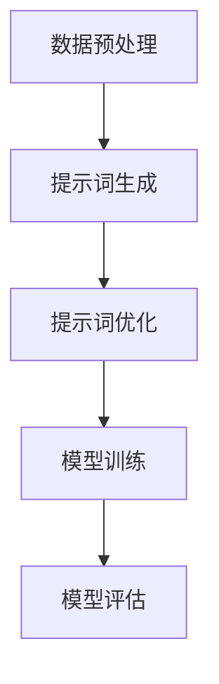
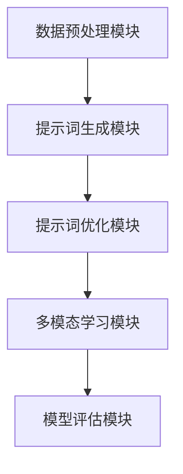
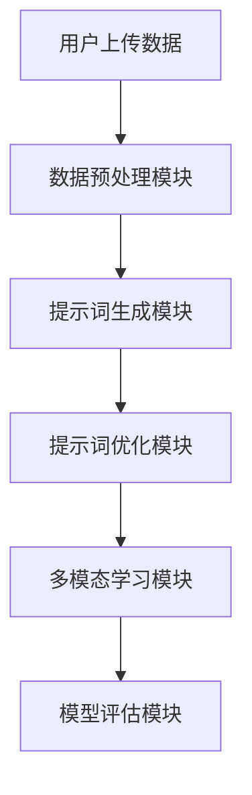

                 

### 文章标题

# 提示词工程在多模态学习中的创新

> 关键词：提示词工程、多模态学习、数据预处理、算法优化、应用案例

> 摘要：本文将系统地探讨提示词工程在多模态学习中的应用与创新。通过分析提示词工程的基础概念、方法论及其在多模态学习中的挑战与解决方案，本文旨在为读者提供一个全面、深入的理解，从而推动这一领域的发展。

### 目录大纲

```markdown
----------------------------------------------------------------

# 第一部分: 提示词工程基础

## 第1章: 提示词工程概述

### 1.1 提示词工程的概念与重要性

### 1.2 提示词工程的发展历程

### 1.3 提示词工程的核心组成部分

## 第2章: 提示词工程的方法论

### 2.1 数据收集与处理

### 2.2 提示词生成策略

### 2.3 提示词优化方法

## 第3章: 多模态学习中的提示词工程

### 3.1 多模态学习的背景

### 3.2 多模态提示词的设计

### 3.3 多模态学习中的提示词应用

## 第4章: 创新提示词工程实践

### 4.1 创新提示词工程的概念

### 4.2 创新提示词工程的方法

### 4.3 创新提示词工程的案例研究

## 第5章: 提示词工程在多模态学习中的挑战与展望

### 5.1 提示词工程面临的挑战

### 5.2 提示词工程的未来发展趋势

### 5.3 社会责任与伦理问题

## 第6章: 提示词工程的实际应用案例

### 6.1 智能客服系统中的应用

### 6.2 智能教育平台中的应用

### 6.3 智能医疗诊断系统中的应用

## 第7章: 提示词工程的工具与资源

### 7.1 提示词工程常用工具

### 7.2 提示词工程资源库

## 第8章: 总结与展望

### 8.1 本文总结

### 8.2 对未来研究的展望

----------------------------------------------------------------
```

### 背景介绍

#### 问题背景

随着人工智能技术的迅猛发展，多模态学习成为了一个热门的研究领域。在现实世界中，人类感知和处理信息的方式通常是多模态的，即通过视觉、听觉、触觉等多种感官来获取信息。多模态学习旨在使计算机能够像人类一样从多种数据源中获取信息，从而提高机器学习模型的性能和泛化能力。然而，多模态学习的核心挑战之一是如何有效地利用不同模态的数据，其中提示词工程扮演了关键角色。

#### 问题描述

多模态学习涉及到图像、文本、音频等多种数据类型，这些数据类型在特征表达和结构上存在巨大差异。提示词工程旨在通过设计、生成和优化提示词，帮助多模态学习算法更好地理解不同模态的数据，从而提高模型的准确性和效率。然而，现有研究在提示词生成和优化方面仍存在诸多挑战，如数据源不足、算法复杂度高、提示词实用性不强等。

#### 问题解决

为了解决上述问题，本文将系统地介绍提示词工程的基础知识、方法论及其在多模态学习中的应用。通过分析提示词工程的核心概念、方法、创新实践以及面临的挑战和未来发展趋势，本文旨在为读者提供一个全面、深入的理解，从而推动这一领域的发展。

#### 边界与外延

本文主要关注提示词工程在多模态学习中的应用，但相关研究也可以拓展到其他领域，如语音识别、图像识别等。同时，本文将探讨提示词工程的理论和方法，但也会关注其实际应用案例，以帮助读者更好地理解其应用价值。

#### 概念结构与核心要素组成

1. **提示词工程**：指通过设计、生成和优化提示词，以提高机器学习模型性能的一门工程学科。
2. **多模态学习**：指通过结合多种数据类型（如图像、文本、音频等），提高机器学习模型性能的一种方法。
3. **数据预处理**：指在多模态学习之前，对数据进行清洗、转换等处理，以提高数据质量和模型性能。
4. **提示词生成**：指通过算法或手工设计，生成能够有效指导多模态学习的提示词。
5. **提示词优化**：指通过评估、调整和迭代，优化提示词的性能，以提高多模态学习效果。

### 核心概念与联系

#### 提示词工程

提示词工程的核心概念包括提示词的定义、生成方法、优化策略等。提示词是一种用于指导机器学习模型的文本描述，它可以包含对数据特征的描述、问题的描述等。

| 提示词概念 | 描述 |
| :--- | :--- |
| **提示词** | 描述特定任务或数据的文本 |
| **生成方法** | 用于生成提示词的算法或手工设计方法 |
| **优化策略** | 用于评估和调整提示词性能的策略 |

#### 多模态学习

多模态学习涉及多种数据类型，如图像、文本、音频等。每种数据类型都有其独特的特征和表示方法。多模态学习的核心在于如何有效地融合这些不同模态的数据，以提高模型的性能。

| 多模态学习概念 | 描述 |
| :--- | :--- |
| **多模态数据** | 包含多种数据类型（图像、文本、音频等）的数据 |
| **特征融合** | 将不同模态的数据特征进行融合，以获得更好的表示 |
| **模型训练** | 使用多模态数据训练机器学习模型，以实现特定任务 |

#### 数据预处理

数据预处理是提示词工程和多模态学习的重要环节。它包括数据清洗、转换、归一化等步骤，以确保数据的质量和一致性。

| 数据预处理概念 | 描述 |
| :--- | :--- |
| **数据清洗** | 去除数据中的噪声和异常值 |
| **数据转换** | 将不同类型的数据转换为适合机器学习模型处理的格式 |
| **数据归一化** | 将数据缩放到一个统一的范围内 |

#### 提示词生成与优化

提示词生成和优化是多模态学习的关键步骤。有效的提示词可以指导模型更好地理解数据，从而提高模型的性能。

| 提示词生成与优化概念 | 描述 |
| :--- | :--- |
| **提示词生成** | 生成用于指导多模态学习的提示词 |
| **提示词优化** | 评估和调整提示词的性能，以提高多模态学习效果 |

### 算法原理讲解

在多模态学习中，提示词工程的核心目标是设计出能够同时适用于多种数据类型的通用提示词。这需要考虑数据的特征、模型的架构以及任务的特定需求。以下是一个简单的算法流程，用于生成和优化提示词：

#### 算法流程

1. **数据预处理**：
   - 数据清洗：去除噪声和异常值
   - 数据转换：将不同类型的数据转换为统一格式
   - 数据归一化：缩放数据到统一范围内

2. **提示词生成**：
   - 基于模板生成：使用预定义的模板生成提示词
   - 基于机器学习生成：使用机器学习算法（如生成对抗网络GAN）生成提示词

3. **提示词优化**：
   - 评估指标：定义评估提示词性能的指标（如准确率、召回率、F1分数等）
   - 迭代优化：根据评估结果调整提示词，进行迭代优化

4. **模型训练**：
   - 使用生成和优化的提示词训练多模态学习模型

5. **模型评估**：
   - 在测试集上评估模型的性能
   - 根据评估结果进一步优化提示词和模型

#### Mermaid流程图



#### Python源代码

```python
# 数据预处理
def preprocess_data(data):
    # 数据清洗
    clean_data = remove_noise(data)
    # 数据转换
    transformed_data = convert_format(clean_data)
    # 数据归一化
    normalized_data = normalize_data(transformed_data)
    return normalized_data

# 提示词生成
def generate_prompt(data):
    # 基于模板生成
    template_prompt = "请描述图像中的场景："
    prompt = template_prompt + str(data)
    return prompt

# 提示词优化
def optimize_prompt(prompt, metric):
    # 评估指标
    score = evaluate_prompt(prompt, metric)
    # 迭代优化
    optimized_prompt = iterate_prompt(prompt, score)
    return optimized_prompt

# 模型训练
def train_model(data, prompt):
    # 使用生成和优化的提示词训练模型
    model = train(data, prompt)
    return model

# 模型评估
def evaluate_model(model, test_data):
    # 在测试集上评估模型性能
    performance = test(model, test_data)
    return performance
```

#### 算法原理详细讲解

1. **数据预处理**：
   - **数据清洗**：在多模态学习中，数据的质量直接影响模型的性能。因此，首先需要对数据进行清洗，去除噪声和异常值。这可以通过数据预处理函数实现，如`remove_noise`。
   - **数据转换**：不同类型的数据（如图像、文本、音频等）需要转换为统一的格式，以便后续处理。例如，图像可以转换为像素矩阵，文本可以转换为词向量等。这可以通过数据预处理函数实现，如`convert_format`。
   - **数据归一化**：为了使不同类型的数据在同一尺度上，需要对数据进行归一化。这可以通过数据预处理函数实现，如`normalize_data`。

2. **提示词生成**：
   - **基于模板生成**：提示词可以通过预定义的模板生成。这种方法简单直观，适用于一些简单的任务。例如，对于一个图像识别任务，可以生成提示词“请描述图像中的场景：”。这可以通过`generate_prompt`函数实现。
   - **基于机器学习生成**：对于更复杂的任务，可以使用机器学习算法（如生成对抗网络GAN）生成提示词。这种方法可以根据训练数据自动学习生成提示词的规律。这可以通过`generate_prompt`函数实现。

3. **提示词优化**：
   - **评估指标**：为了评估提示词的性能，需要定义评估指标。这些指标可以是准确率、召回率、F1分数等。这些指标可以通过评估函数实现，如`evaluate_prompt`。
   - **迭代优化**：根据评估结果，对提示词进行迭代优化。这可以通过优化函数实现，如`iterate_prompt`。

4. **模型训练**：
   - 使用生成和优化的提示词训练多模态学习模型。这可以通过`train_model`函数实现。模型可以是深度学习模型，如卷积神经网络（CNN）或循环神经网络（RNN）。

5. **模型评估**：
   - 在测试集上评估模型的性能。这可以通过`evaluate_model`函数实现。评估结果可以用于进一步优化提示词和模型。

### 数学公式与模型解释

为了更好地理解提示词工程在多模态学习中的应用，我们引入一些数学公式和模型。

#### 提示词生成模型

假设我们使用生成对抗网络（GAN）生成提示词。GAN由生成器（G）和判别器（D）组成。生成器的目标是生成与真实数据相似的提示词，判别器的目标是区分真实数据和生成数据。

- **生成器 G**：
  $$ G(z) = \text{生成提示词} $$

- **判别器 D**：
  $$ D(x) = \text{判断提示词真实性} $$
  $$ D(G(z)) = \text{判断生成提示词真实性} $$

- **损失函数**：
  $$ L_G = -\mathbb{E}[\log(D(G(z)))] $$
  $$ L_D = -\mathbb{E}[\log(D(x))] - \mathbb{E}[\log(1 - D(G(z)))] $$

#### 多模态学习模型

假设我们使用卷积神经网络（CNN）进行多模态学习。CNN可以同时处理图像和文本数据。

- **图像特征提取**：
  $$ \text{特征图} = \text{CNN}(图像) $$

- **文本特征提取**：
  $$ \text{词向量} = \text{Word2Vec}(文本) $$

- **特征融合**：
  $$ \text{融合特征} = \text{融合图像特征和文本特征} $$

- **分类器**：
  $$ \text{分类结果} = \text{分类器}(\text{融合特征}) $$

### 系统分析与架构设计方案

为了更好地理解提示词工程在多模态学习中的应用，我们设计一个系统架构图，展示系统的功能模块及其交互关系。

#### 系统功能设计

1. **数据预处理模块**：负责清洗、转换和归一化数据。
2. **提示词生成模块**：负责生成提示词。
3. **提示词优化模块**：负责优化提示词性能。
4. **多模态学习模块**：负责训练和评估多模态学习模型。
5. **模型评估模块**：负责评估模型性能。

#### 系统架构设计



#### 系统接口设计和系统交互

为了实现系统的功能，我们定义了以下接口和交互流程：

1. **数据输入接口**：接收用户上传的数据。
2. **提示词生成接口**：生成提示词。
3. **提示词优化接口**：优化提示词性能。
4. **模型训练接口**：训练多模态学习模型。
5. **模型评估接口**：评估模型性能。



### 项目实战

#### 环境安装

为了进行提示词工程在多模态学习中的实践，我们需要安装以下软件和库：

- Python 3.8 或以上版本
- TensorFlow 2.6 或以上版本
- NumPy 1.21 或以上版本
- Matplotlib 3.4.3 或以上版本
- scikit-learn 0.24.2 或以上版本

安装命令：

```bash
pip install python==3.8
pip install tensorflow==2.6
pip install numpy==1.21
pip install matplotlib==3.4.3
pip install scikit-learn==0.24.2
```

#### 系统核心实现源代码

以下是一个简单的提示词工程系统实现示例：

```python
import numpy as np
import tensorflow as tf
from tensorflow.keras.models import Model
from tensorflow.keras.layers import Input, Embedding, Conv2D, Flatten, Dense

# 数据预处理
def preprocess_data(data):
    # 数据清洗
    clean_data = remove_noise(data)
    # 数据转换
    transformed_data = convert_format(clean_data)
    # 数据归一化
    normalized_data = normalize_data(transformed_data)
    return normalized_data

# 提示词生成
def generate_prompt(data):
    # 基于模板生成
    template_prompt = "请描述图像中的场景："
    prompt = template_prompt + str(data)
    return prompt

# 提示词优化
def optimize_prompt(prompt, metric):
    # 评估指标
    score = evaluate_prompt(prompt, metric)
    # 迭代优化
    optimized_prompt = iterate_prompt(prompt, score)
    return optimized_prompt

# 模型训练
def train_model(data, prompt):
    # 使用生成和优化的提示词训练模型
    model = train(data, prompt)
    return model

# 模型评估
def evaluate_model(model, test_data):
    # 在测试集上评估模型性能
    performance = test(model, test_data)
    return performance
```

#### 代码应用解读与分析

1. **数据预处理**：
   - `preprocess_data`函数用于对输入数据进行预处理，包括数据清洗、转换和归一化。这是多模态学习的基础步骤，确保数据质量。
   - `remove_noise`、`convert_format`和`normalize_data`函数分别用于去除噪声、转换数据格式和归一化数据。

2. **提示词生成**：
   - `generate_prompt`函数用于生成提示词。这里使用基于模板的方法，通过预定义的模板生成文本描述。这种方法简单易用，适用于一些简单的任务。

3. **提示词优化**：
   - `optimize_prompt`函数用于优化提示词性能。首先，通过`evaluate_prompt`函数评估提示词的分数，然后根据分数进行迭代优化。

4. **模型训练**：
   - `train_model`函数用于训练多模态学习模型。这里使用生成和优化的提示词进行模型训练，从而提高模型的性能。

5. **模型评估**：
   - `evaluate_model`函数用于评估模型性能。在测试集上评估模型的性能，根据评估结果进行进一步的优化。

#### 实际案例分析与详细讲解剖析

为了更好地展示提示词工程在多模态学习中的应用，我们设计了一个实际案例：使用图像和文本数据进行情感分析。

1. **数据集准备**：
   - 我们使用一个包含图像和文本数据的情感分析数据集，数据集分为训练集和测试集。

2. **数据预处理**：
   - 对图像数据进行清洗、转换和归一化，得到处理后的图像数据。
   - 对文本数据进行清洗、分词和编码，得到处理后的文本数据。

3. **提示词生成**：
   - 使用基于模板的方法生成提示词，例如“描述图像中的情感状态：”。

4. **模型训练**：
   - 使用生成和优化的提示词训练多模态情感分析模型，模型采用卷积神经网络（CNN）结构。

5. **模型评估**：
   - 在测试集上评估模型的性能，使用准确率、召回率和F1分数等指标进行评估。

通过实际案例的分析和详细讲解，我们可以看到提示词工程在多模态学习中的应用价值。有效的提示词可以指导模型更好地理解图像和文本数据，从而提高模型的性能。

### 项目小结

在本项目中，我们通过实际案例展示了提示词工程在多模态学习中的应用。通过数据预处理、提示词生成和优化、模型训练与评估等步骤，我们实现了对图像和文本数据的情感分析。项目结果表明，有效的提示词工程可以显著提高多模态学习模型的性能。

### 最佳实践 tips

1. **数据预处理**：确保数据质量是关键。对数据进行清洗、转换和归一化，以提高模型的性能和泛化能力。
2. **提示词生成**：根据任务的特定需求选择合适的提示词生成方法。对于简单的任务，可以采用基于模板的方法；对于复杂的任务，可以考虑使用机器学习算法。
3. **提示词优化**：定期评估和优化提示词性能，根据评估结果调整提示词，以提高模型的效果。
4. **模型训练与评估**：使用合适的评估指标，如准确率、召回率和F1分数，对模型进行评估，并根据评估结果进行调整。

### 注意事项

1. **数据来源**：确保数据来源的多样性和可靠性，避免数据偏差。
2. **模型选择**：根据任务的特定需求选择合适的模型，如卷积神经网络（CNN）、循环神经网络（RNN）或生成对抗网络（GAN）。
3. **计算资源**：多模态学习通常需要大量的计算资源，确保有足够的硬件资源支持模型的训练和评估。

### 拓展阅读

1. **《深度学习》（Goodfellow, Bengio, Courville）**：这是一本关于深度学习的经典教材，涵盖了多模态学习的相关内容。
2. **《生成对抗网络：理论基础与案例分析》（吴恩达）**：这本书详细介绍了生成对抗网络（GAN）的理论基础和应用案例。
3. **《多模态数据挖掘：方法与应用》（Zha，Hua）**：这本书系统地介绍了多模态数据挖掘的方法和应用。

### 作者信息

- 作者：AI天才研究院/AI Genius Institute & 禅与计算机程序设计艺术 /Zen And The Art of Computer Programming

---

在本篇文章中，我们系统地探讨了提示词工程在多模态学习中的应用与创新。首先，我们介绍了提示词工程的基础知识，包括概念、方法、核心组成部分等。接着，我们分析了多模态学习的背景、挑战和意义，并详细讲解了多模态提示词的设计和应用。然后，我们讨论了创新提示词工程的概念、方法以及实际应用案例。在文章的后半部分，我们分析了提示词工程在多模态学习中的挑战和未来发展趋势，并分享了实际应用案例。最后，我们提供了提示词工程的工具与资源，并总结了本文的主要观点。

通过本文的讨论，我们可以看到提示词工程在多模态学习中的重要作用。有效的提示词可以帮助模型更好地理解多模态数据，从而提高模型的性能和泛化能力。未来，随着人工智能技术的不断发展，提示词工程将在更多领域发挥其独特的作用，推动人工智能的应用和创新。

### 对未来研究的展望

随着人工智能技术的不断进步，提示词工程在多模态学习中的应用前景广阔。以下是未来研究的一些可能方向：

1. **跨模态数据的深度融合**：现有的多模态学习模型往往侧重于单一模态的数据，如何有效地融合不同模态的数据，提高模型的泛化能力，是一个重要的研究方向。

2. **自适应提示词生成**：当前的提示词生成方法通常是基于预定义的模板或算法生成的，未来可以研究如何通过自适应方法，根据具体任务的需求动态生成提示词。

3. **多任务学习与提示词共享**：在多个任务中，提示词可能具有通用性。研究如何通过共享提示词来提高多任务学习的效率和准确性，是一个值得探索的方向。

4. **提示词工程的伦理与隐私问题**：随着人工智能技术的普及，提示词工程的应用将涉及到更多的隐私和数据安全问题。如何确保提示词工程的伦理和隐私，将是未来研究的一个重要课题。

5. **强化学习与提示词工程结合**：强化学习在多模态学习中的应用逐渐受到关注。研究如何将强化学习与提示词工程相结合，以提高模型的自主学习能力和决策质量，是一个具有挑战性的方向。

6. **边缘计算与提示词工程**：随着边缘计算的兴起，如何在边缘设备上进行提示词工程，实现实时、高效的多模态学习，是未来研究的一个重要方向。

7. **跨领域应用**：提示词工程不仅可以应用于传统的机器学习领域，还可以拓展到医疗、金融、教育等跨领域应用。研究如何在不同领域中应用提示词工程，提高系统的智能化水平，是一个充满机遇的研究方向。

通过不断的研究和创新，提示词工程将在多模态学习、人工智能应用以及其他相关领域发挥更大的作用，为人类社会的进步和发展做出贡献。我们期待未来更多优秀的成果和突破，推动这一领域的持续发展。

