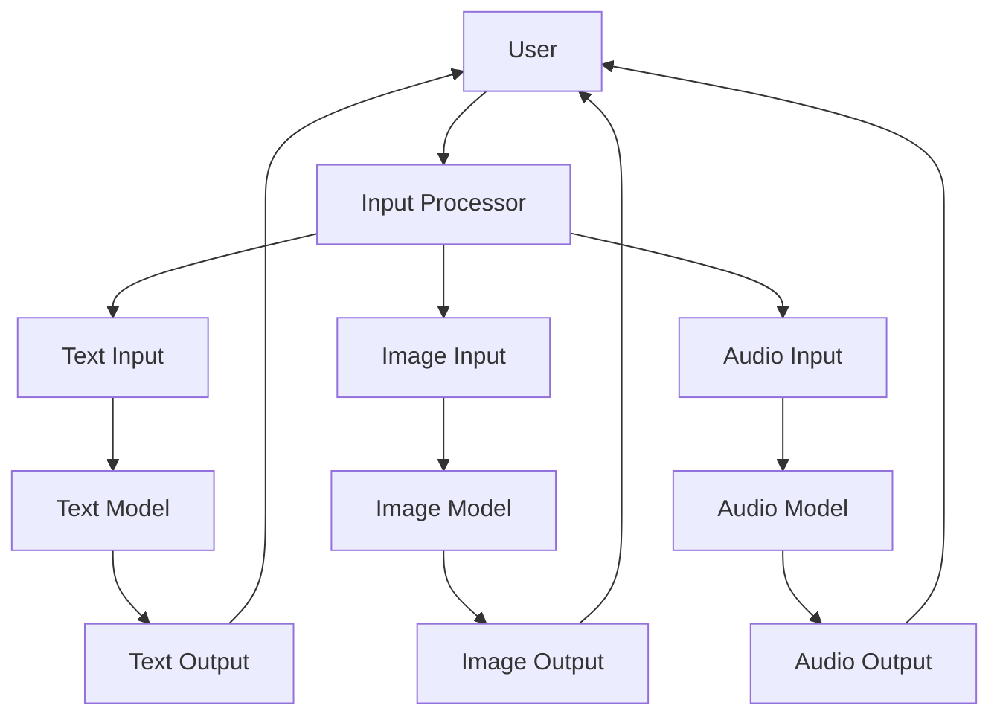
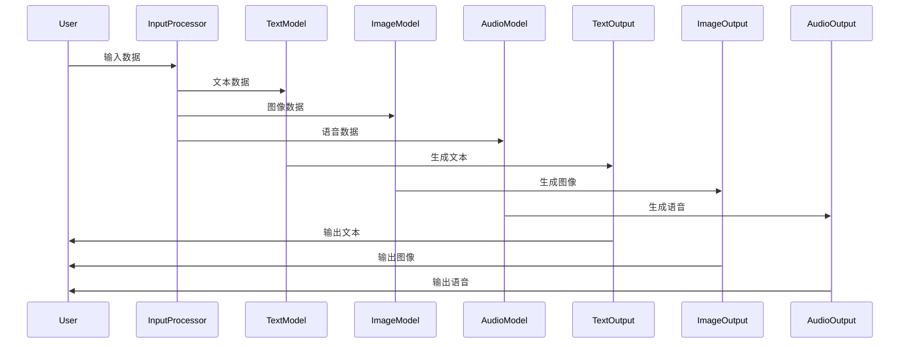

                 

# 提示词工程在多模态学习中的应用

关键词：提示词工程，多模态学习，算法原理，数学模型，系统架构，项目实战

摘要：本文将深入探讨提示词工程在多模态学习中的应用。首先，我们将介绍提示词工程的定义和重要性，并详细解析其核心概念和联系。接着，我们将讲解提示词工程的算法原理，包括生成算法和优化算法。然后，我们将介绍提示词工程的数学模型和公式，并通过实际案例进行分析。接下来，我们将展示提示词工程的应用场景，包括文本生成和图像生成。最后，我们将设计一个完整的提示词工程系统，并介绍其实战项目。

## 第一部分：问题背景与核心概念

### 第1章：提示词工程概述

#### 1.1 提示词工程定义

提示词工程是一种利用提示词来指导模型生成符合预期输出的过程。提示词可以是文本、图像或语音等，它们在模型训练和生成过程中起到关键作用。

#### 1.2 提示词工程的重要性

在多模态学习场景中，提示词工程对于模型的训练和生成至关重要。有效的提示词可以引导模型学习到更多的目标信息，从而提高模型的性能和鲁棒性。

### 1.3 提示词工程的核心概念与联系

#### 1.3.1 提示词类型

提示词可以分为文本提示词、图像提示词和语音提示词等类型。每种提示词都有其独特的特点和应用场景。

#### 1.3.2 提示词设计原则

提示词设计需要遵循简明性、针对性、多样性等原则，以提高模型的学习效果和生成质量。

## 第2章：提示词工程的算法原理讲解

### 2.1 提示词生成算法

#### 2.1.1 提示词生成算法概述

提示词生成算法是提示词工程中的核心，主要分为基于规则的方法和基于学习的方法。

#### 2.1.2 基于规则的方法

基于规则的方法通过定义一系列的规则来生成提示词，具有简单、易于实现的特点。

#### 2.1.3 基于学习的方法

基于学习的方法通过训练大量的样本数据来学习生成提示词的规律，具有自适应性和灵活性的优点。

### 2.2 提示词优化算法

#### 2.2.1 提示词优化算法概述

提示词优化算法用于优化已生成的提示词，以提高模型的生成质量。

#### 2.2.2 常见的提示词优化算法

常见的提示词优化算法包括基于梯度的优化算法、基于遗传算法的优化算法等。

## 第3章：提示词工程的数学模型和公式

### 3.1 提示词生成模型的数学模型

#### 3.1.1 模型输入与输出

提示词生成模型的输入为提示词，输出为生成文本、图像或语音。

#### 3.1.2 模型参数

提示词生成模型的参数包括权重矩阵、激活函数等。

### 3.2 提示词优化模型的数学模型

#### 3.2.1 模型目标函数

提示词优化模型的目标函数为最小化生成质量损失。

#### 3.2.2 模型约束条件

提示词优化模型的约束条件包括提示词的长度、多样性等。

## 第4章：提示词工程的应用案例

### 4.1 文本生成应用

#### 4.1.1 应用场景

文本生成应用包括自然语言生成、对话系统等。

#### 4.1.2 应用实例

使用基于GPT的大模型进行文本生成，实现自然语言理解和生成。

### 4.2 图像生成应用

#### 4.2.1 应用场景

图像生成应用包括图像风格转换、图像合成等。

#### 4.2.2 应用实例

使用基于GAN的大模型进行图像生成，实现图像风格转换。

## 第5章：提示词工程的系统分析与架构设计方案

### 5.1 问题场景介绍

介绍提示词工程在实际应用中的场景，如智能助手、智能翻译等。

### 5.2 系统功能设计

#### 5.2.1 领域模型

使用Mermaid绘制领域模型类图，描述系统涉及的类和类之间的关系。

#### 5.2.2 系统功能

详细描述系统的核心功能，如提示词生成、提示词优化等。

### 5.3 系统架构设计

#### 5.3.1 系统架构

使用Mermaid绘制系统架构图，描述系统的整体架构。

#### 5.3.2 系统模块

详细描述系统的主要模块，如数据输入模块、模型训练模块、提示词生成模块等。

### 5.4 系统接口设计

#### 5.4.1 接口规范

定义系统提供的接口规范，包括输入参数、输出结果等。

#### 5.4.2 接口实现

描述系统接口的实现方式，如RESTful API、WebSocket等。

### 5.5 系统交互设计

#### 5.5.1 系统交互流程

使用Mermaid绘制系统交互序列图，描述系统各模块之间的交互流程。

#### 5.5.2 系统交互示例

给出一个具体的系统交互示例，如用户请求生成文本，系统响应生成结果。

## 第6章：提示词工程的项目实战

### 6.1 环境安装与配置

介绍提示词工程所需的环境安装和配置，包括操作系统、编程语言、深度学习框架等。

### 6.2 系统核心实现源代码

提供系统核心实现的源代码，包括提示词生成、提示词优化等模块。

---

## 1. 提示词工程概述

### 1.1 提示词工程定义

提示词工程是一种在人工智能领域用于指导模型生成输出的方法。它涉及设计、实现和优化提示词，这些提示词可以是文本、图像或语音等，用来引导模型学习目标信息并生成相应的输出。

提示词工程的主要目标是提高模型的泛化能力，使其能够生成更加符合预期的高质量输出。具体来说，提示词工程包括以下几个关键步骤：

1. **提示词设计**：根据应用场景和目标输出，设计合适的提示词。提示词应当简明、具有针对性且多样化，以便引导模型学习到丰富的信息。
2. **提示词生成**：利用生成算法将提示词转化为模型可接受的输入，指导模型进行训练和生成。
3. **提示词优化**：在模型训练过程中，对已生成的提示词进行优化，以提高模型的生成质量和性能。
4. **模型评估**：通过评估模型的输出质量和性能，验证提示词工程的效果，并根据评估结果调整提示词设计。

### 1.2 提示词工程的重要性

在多模态学习场景中，提示词工程扮演着至关重要的角色。多模态学习是指利用多种类型的数据（如文本、图像、语音等）进行学习和推理。这种场景下，模型需要处理来自不同模态的信息，并生成相应的输出。

有效的提示词工程能够帮助模型更好地理解和利用多模态数据，从而提高模型的性能和鲁棒性。具体来说，提示词工程的重要性体现在以下几个方面：

1. **增强模型学习能力**：通过设计针对性的提示词，模型能够更好地学习到不同模态数据中的关键信息，从而提高其学习能力。
2. **提高生成质量**：优化后的提示词能够引导模型生成更加符合预期的高质量输出，提高模型的生成质量。
3. **增强模型鲁棒性**：有效的提示词设计可以帮助模型应对不同数据分布和噪声，提高其鲁棒性。
4. **降低训练成本**：通过优化提示词，模型可以在较少的训练数据下实现更好的性能，从而降低训练成本。

### 1.3 提示词工程的核心概念与联系

提示词工程涉及多个核心概念，这些概念相互关联，共同构成一个完整的体系。以下是对这些核心概念的简要介绍：

#### 1.3.1 提示词类型

提示词可以分为文本提示词、图像提示词和语音提示词等类型。每种类型的提示词都有其独特的特点和应用场景：

1. **文本提示词**：文本提示词通常用于自然语言处理任务，如文本生成、对话系统等。它们可以是短语、句子或段落，用于引导模型理解和生成文本信息。
2. **图像提示词**：图像提示词用于图像处理和计算机视觉任务，如图像分类、目标检测等。它们可以是图像的特征描述、标签或标签序列等。
3. **语音提示词**：语音提示词用于语音识别和生成任务，如语音合成、语音翻译等。它们可以是语音信号的特征描述、文本或文本序列等。

#### 1.3.2 提示词设计原则

提示词设计是提示词工程中的关键步骤，需要遵循以下原则：

1. **简明性**：提示词应当简明扼要，避免冗余信息，以便模型能够快速理解并利用这些信息。
2. **针对性**：提示词应当与任务目标和数据类型紧密相关，确保模型能够学习到关键信息。
3. **多样性**：提示词应当具备多样性，包括不同的表达方式和形式，以便模型能够适应不同的数据和场景。
4. **可解释性**：提示词应当具有可解释性，使得模型的学习过程和生成结果能够被理解和解释。

#### 1.3.3 提示词生成算法

提示词生成算法是提示词工程的核心，分为基于规则的方法和基于学习的方法：

1. **基于规则的方法**：这种方法通过定义一系列的规则来生成提示词。例如，基于模板的提示词生成方法，可以根据预定义的模板和输入数据生成提示词。
2. **基于学习的方法**：这种方法通过训练大量的样本数据来学习生成提示词的规律。例如，基于神经网络的提示词生成方法，可以利用深度学习模型从数据中学习生成提示词的规律。

#### 1.3.4 提示词优化算法

提示词优化算法用于优化已生成的提示词，以提高模型的生成质量和性能。常见的提示词优化算法包括：

1. **基于梯度的优化算法**：这种方法利用梯度下降等优化算法来优化提示词，从而提高模型的生成质量。
2. **基于遗传算法的优化算法**：这种方法利用遗传算法等启发式搜索算法来优化提示词，从而提高模型的生成质量和性能。

### 1.4 小结

本文介绍了提示词工程的定义和重要性，并探讨了其核心概念与联系。在接下来的章节中，我们将深入分析提示词工程的算法原理，包括生成算法和优化算法，以及其数学模型和公式。通过这些分析，我们将为读者提供更全面、深入的理解，并探讨提示词工程在实际应用中的实践方法。

## 2. 提示词工程的算法原理讲解

### 2.1 提示词生成算法

#### 2.1.1 提示词生成算法概述

提示词生成算法是提示词工程中的核心，其主要任务是生成具有指导性的提示词，以帮助模型更好地理解和生成目标输出。提示词生成算法可以分为两大类：基于规则的方法和基于学习的方法。

**基于规则的方法**：

基于规则的方法通过定义一系列的规则来生成提示词。这些规则可以是明确的逻辑条件、模板匹配或模板填充等。这种方法具有简单、易于实现的特点，适用于一些简单场景或特定任务。

- **逻辑条件**：通过设置一系列的逻辑条件来生成提示词。例如，在文本生成任务中，可以根据文本的长度、关键词或主题等条件生成相应的提示词。
- **模板匹配**：使用预定义的模板与输入数据匹配，生成相应的提示词。例如，在图像生成任务中，可以使用预定义的图像描述模板来生成图像的提示词。
- **模板填充**：将输入数据填充到预定义的模板中，生成提示词。例如，在自然语言生成任务中，可以将输入的文本填充到预定义的句子模板中，生成相应的提示词。

**基于学习的方法**：

基于学习的方法通过训练大量的样本数据来学习生成提示词的规律。这种方法具有自适应性和灵活性的优点，适用于复杂的多模态学习场景。

- **统计学习方法**：利用统计学习方法来学习生成提示词的规律。例如，可以使用朴素贝叶斯、决策树等统计模型来生成提示词。
- **深度学习方法**：利用深度学习模型来学习生成提示词的规律。例如，可以使用循环神经网络（RNN）、卷积神经网络（CNN）等深度学习模型来生成提示词。

#### 2.1.2 基于规则的方法

基于规则的方法通常包括以下步骤：

1. **规则定义**：根据任务需求和输入数据的特点，定义一系列的规则。这些规则可以是逻辑条件、模板匹配或模板填充等。
2. **提示词生成**：根据输入数据和定义的规则，生成相应的提示词。例如，在文本生成任务中，可以根据输入的文本内容和定义的逻辑条件生成相应的提示词。
3. **规则优化**：根据模型训练和生成结果，对定义的规则进行优化，以提高生成提示词的质量和效果。

#### 2.1.3 基于学习的方法

基于学习的方法通常包括以下步骤：

1. **数据收集与预处理**：收集大量的训练数据，并对数据进行预处理，如数据清洗、数据增强等。
2. **模型训练**：利用收集到的训练数据和定义的损失函数，通过优化算法（如梯度下降）来训练深度学习模型。
3. **提示词生成**：在模型训练完成后，使用训练好的模型对新的输入数据进行提示词生成。例如，在文本生成任务中，可以使用训练好的模型来生成新的文本提示词。
4. **模型优化**：根据生成的提示词质量和模型性能，对模型进行优化，以提高模型的生成效果。

#### 2.1.4 常见提示词生成算法

以下介绍几种常见的提示词生成算法：

1. **生成对抗网络（GAN）**：
   - **生成器**：生成器模型生成提示词，并将其输入到判别器模型中。
   - **判别器**：判别器模型判断输入数据是真实数据还是生成数据。
   - **损失函数**：利用损失函数来优化生成器和判别器的参数，以达到生成高质量提示词的目的。

2. **变分自编码器（VAE）**：
   - **编码器**：编码器模型将输入数据编码为低维隐变量。
   - **解码器**：解码器模型将低维隐变量解码为输出数据。
   - **损失函数**：利用损失函数来优化编码器和解码器的参数，以提高生成提示词的质量。

3. **自编码器（AE）**：
   - **编码器**：编码器模型将输入数据编码为低维隐变量。
   - **解码器**：解码器模型将低维隐变量解码为输出数据。
   - **损失函数**：利用损失函数来优化编码器和解码器的参数，以提高生成提示词的质量。

### 2.2 提示词优化算法

#### 2.2.1 提示词优化算法概述

提示词优化算法用于优化已生成的提示词，以提高模型的生成质量和性能。优化算法可以分为以下几类：

1. **基于梯度的优化算法**：
   - **梯度下降**：通过计算梯度来更新提示词参数，以达到优化目标。
   - **随机梯度下降（SGD）**：在每个训练样本上计算梯度并更新参数，适用于大量样本的情况。
   - **Adam优化器**：结合了梯度下降和动量项的优点，适用于非线性优化问题。

2. **基于遗传算法的优化算法**：
   - **遗传算法（GA）**：通过模拟生物进化过程来优化提示词参数。
   - **遗传算法变种**：如遗传编程（GP）、遗传规划（GP）、遗传算法与神经网络结合等。

3. **基于神经网络的方法**：
   - **神经网络优化**：利用神经网络来优化提示词参数，如使用反向传播算法进行优化。

#### 2.2.2 常见的提示词优化算法

以下介绍几种常见的提示词优化算法：

1. **梯度下降**：
   - **目标函数**：最小化生成质量损失，如生成文本的相似度、图像的相似度等。
   - **梯度计算**：计算提示词参数的梯度，并通过梯度更新提示词参数。

2. **遗传算法**：
   - **目标函数**：最小化生成质量损失，如生成文本的相似度、图像的相似度等。
   - **种群初始化**：随机初始化一组提示词参数。
   - **适应度评估**：计算每个提示词参数的适应度，如生成质量、训练时间等。
   - **选择、交叉、变异**：通过选择、交叉、变异等操作来更新提示词参数。

3. **神经网络优化**：
   - **目标函数**：最小化生成质量损失，如生成文本的相似度、图像的相似度等。
   - **网络结构**：选择合适的神经网络结构，如卷积神经网络（CNN）、循环神经网络（RNN）等。
   - **反向传播**：利用反向传播算法计算梯度，并通过梯度更新提示词参数。

### 2.3 小结

本文详细介绍了提示词工程的算法原理，包括提示词生成算法和提示词优化算法。提示词生成算法主要分为基于规则的方法和基于学习的方法，提示词优化算法则包括基于梯度的方法、基于遗传算法的方法和基于神经网络的方法。通过这些算法，我们可以设计出有效的提示词工程系统，从而提高模型的生成质量和性能。

在接下来的章节中，我们将进一步探讨提示词工程的数学模型和公式，以更深入地理解其原理和应用。

## 3. 提示词工程的数学模型和公式

在提示词工程中，数学模型和公式是理解其工作原理和优化方法的重要工具。本节将详细介绍提示词生成模型的数学模型，并解释提示词优化模型的数学模型和公式。

### 3.1 提示词生成模型的数学模型

提示词生成模型的数学模型主要包括输入与输出、模型参数和损失函数等组成部分。

#### 3.1.1 模型输入与输出

提示词生成模型的输入通常是提示词，这些提示词可以是文本、图像或语音等。输出则是对输入提示词的扩展或转化，以生成目标输出。例如，在文本生成任务中，输入是一个提示词，输出是一段文本；在图像生成任务中，输入是一个提示词，输出是一幅图像。

假设我们有一个多模态的提示词生成模型，输入是一个包含文本、图像和语音的元组 \((x_{text}, x_{image}, x_{audio})\)，输出是相应的扩展或转化后的元组 \((y_{text}, y_{image}, y_{audio})\)。则模型输入与输出的关系可以表示为：

$$
(y_{text}, y_{image}, y_{audio}) = f_G(x_{text}, x_{image}, x_{audio})
$$

其中，\(f_G\) 是生成函数，用于将输入提示词映射到输出。

#### 3.1.2 模型参数

提示词生成模型的参数是模型训练过程中需要优化的变量。在深度学习模型中，参数通常包括权重矩阵、偏置项和激活函数等。例如，对于一个基于卷积神经网络的文本生成模型，其参数可能包括以下部分：

- **权重矩阵 \(W\)**：用于从输入层到隐藏层的线性变换。
- **偏置项 \(b\)**：用于添加常数项。
- **激活函数 \(f\)**：用于引入非线性变换，如ReLU、Sigmoid或Tanh等。

#### 3.1.3 损失函数

在提示词生成模型中，损失函数用于度量模型输出与真实输出之间的差异，以指导模型优化。常见的损失函数包括交叉熵损失、均方误差（MSE）损失等。

1. **交叉熵损失（Cross-Entropy Loss）**：

交叉熵损失常用于分类任务，但也可以用于多模态生成任务。对于文本生成任务，假设输出是一个概率分布 \(p(y|x)\)，真实输出是一个离散的一维向量 \(y\)，则交叉熵损失可以表示为：

$$
L_{cross-entropy} = -\sum_{i} y_i \log(p_i)
$$

其中，\(p_i\) 是输出概率分布中对应于真实输出 \(y_i\) 的概率。

2. **均方误差（MSE）损失（Mean Squared Error Loss）**：

均方误差损失常用于回归任务，但在某些多模态生成任务中也可使用。对于图像生成任务，假设输出图像为 \(y\)，真实图像为 \(x\)，则均方误差损失可以表示为：

$$
L_{MSE} = \frac{1}{n} \sum_{i} (y_i - x_i)^2
$$

其中，\(n\) 是图像中像素的数量。

### 3.2 提示词优化模型的数学模型

提示词优化模型的数学模型主要涉及目标函数和优化算法。

#### 3.2.1 目标函数

提示词优化模型的目标函数用于衡量提示词生成质量。常见的目标函数包括生成质量损失、多样性损失和一致性损失等。

1. **生成质量损失**：

生成质量损失用于衡量模型生成的输出与真实输出之间的相似度。例如，在图像生成任务中，生成质量损失可以使用均方误差（MSE）或结构相似性指数（SSIM）来计算。

2. **多样性损失**：

多样性损失用于鼓励模型生成多样化的输出。例如，可以使用对抗性生成网络（GAN）中的判别器损失来衡量多样性。

3. **一致性损失**：

一致性损失用于确保模型在多模态数据之间保持一致性。例如，在文本和图像的多模态生成任务中，可以使用交叉模态一致性损失来确保生成的文本和图像在内容上保持一致。

#### 3.2.2 优化算法

提示词优化算法用于最小化目标函数，从而提高模型生成质量。常见的优化算法包括梯度下降、遗传算法和深度强化学习等。

1. **梯度下降（Gradient Descent）**：

梯度下降是一种最常用的优化算法，其基本思想是沿着目标函数的梯度方向更新模型参数，以最小化目标函数。梯度下降可以分为以下几种：

- **批量梯度下降（Batch Gradient Descent）**：
  - **计算梯度**：计算整个训练集的梯度。
  - **更新参数**：使用计算出的梯度更新模型参数。

- **随机梯度下降（Stochastic Gradient Descent，SGD）**：
  - **计算梯度**：随机选择一个训练样本，计算其梯度。
  - **更新参数**：使用计算出的梯度更新模型参数。

- **小批量梯度下降（Mini-batch Gradient Descent）**：
  - **计算梯度**：随机选择一个小批量训练样本，计算其梯度。
  - **更新参数**：使用计算出的梯度更新模型参数。

2. **遗传算法（Genetic Algorithm，GA）**：

遗传算法是一种基于自然进化的启发式搜索算法，其基本思想是通过模拟生物进化过程来优化模型参数。遗传算法的主要步骤包括：

- **种群初始化**：随机初始化一组模型参数。
- **适应度评估**：计算每个模型参数的适应度，如生成质量、训练时间等。
- **选择、交叉、变异**：通过选择、交叉、变异等操作来更新模型参数。

3. **深度强化学习（Deep Reinforcement Learning，DRL）**：

深度强化学习是一种结合深度学习和强化学习的优化算法，其基本思想是通过深度神经网络来表示状态和动作，并通过强化学习来优化模型参数。深度强化学习的主要步骤包括：

- **状态表示**：使用深度神经网络表示状态。
- **动作表示**：使用深度神经网络表示动作。
- **奖励函数**：定义奖励函数，用于衡量模型生成质量。
- **策略更新**：使用策略梯度方法更新模型参数。

### 3.3 小结

本节介绍了提示词工程的数学模型和公式，包括提示词生成模型的输入与输出、模型参数和损失函数，以及提示词优化模型的目标函数和优化算法。通过这些数学模型和公式，我们可以更好地理解提示词工程的工作原理和优化方法，从而提高模型生成质量和性能。

在接下来的章节中，我们将通过实际应用案例来进一步展示提示词工程的效果和优势。

## 4. 提示词工程的应用案例

### 4.1 文本生成应用

#### 4.1.1 应用场景

文本生成是提示词工程的一个重要应用领域，涵盖了自然语言生成、对话系统、机器翻译等多个方面。以下是一些常见的应用场景：

1. **自然语言生成（Natural Language Generation，NLG）**：文本生成模型可以自动生成新闻文章、产品描述、旅游指南等，大大提高内容生产效率。
2. **对话系统（Dialogue System）**：在聊天机器人、智能客服等场景中，文本生成模型可以生成自然、流畅的对话回应，提供更人性化的用户体验。
3. **机器翻译（Machine Translation）**：文本生成模型可以用于机器翻译，将一种语言的文本翻译成另一种语言，实现跨语言信息交流。

#### 4.1.2 应用实例

下面我们以一个自然语言生成实例来展示提示词工程的应用。

**实例**：假设我们要使用基于GPT的大模型生成一篇关于“人工智能发展”的文章摘要。

1. **数据准备**：首先，我们需要收集大量的关于人工智能发展的文本数据，如学术论文、新闻报道、技术博客等。然后，对这些数据进行预处理，包括去除停用词、标点符号和格式化文本等。
2. **模型训练**：使用预处理后的数据对GPT模型进行训练，使其学习到人工智能发展的相关知识和表达方式。
3. **提示词设计**：设计一个简明的提示词，如“请写一篇关于人工智能发展的摘要”，作为模型输入。
4. **文本生成**：将提示词输入到训练好的GPT模型中，模型会根据所学知识和提示词生成一篇关于人工智能发展的摘要。

**生成文本示例**：

```
摘要：人工智能（AI）作为计算机科学的一个重要分支，近年来得到了广泛关注。随着深度学习等技术的不断进步，人工智能在图像识别、自然语言处理、自动驾驶等领域取得了显著的成果。然而，人工智能的发展也面临着数据隐私、伦理和安全等问题，需要加强研究和规范。
```

通过这个实例，我们可以看到提示词工程在文本生成中的应用效果。有效的提示词设计可以帮助模型更好地理解和生成目标文本，提高生成文本的质量和一致性。

### 4.2 图像生成应用

#### 4.2.1 应用场景

图像生成是另一个提示词工程的重要应用领域，涉及图像风格转换、图像合成、图像修复等多种场景。以下是一些常见的应用场景：

1. **图像风格转换（Image Style Transfer）**：通过提示词工程，可以将一幅图像的风格转换成另一幅图像，实现艺术创作和设计创新。
2. **图像合成（Image Synthesis）**：图像生成模型可以生成全新的图像，例如合成人脸、建筑、自然景观等，为虚拟现实、游戏开发等领域提供丰富的素材。
3. **图像修复（Image Restoration）**：图像生成模型可以用于修复损坏或模糊的图像，提高图像质量和清晰度。

#### 4.2.2 应用实例

下面我们以一个图像风格转换实例来展示提示词工程的应用。

**实例**：假设我们要使用基于GAN的大模型将一张照片的风格转换成梵高风格的画作。

1. **数据准备**：首先，我们需要收集大量的梵高风格画作和普通照片数据。然后，对数据集进行预处理，包括数据增强、标准化等。
2. **模型训练**：使用预处理后的数据对GAN模型进行训练，使其学习梵高风格画作的特征和普通照片的结构。
3. **提示词设计**：设计一个简明的提示词，如“将这张照片转换为梵高风格”，作为模型输入。
4. **图像生成**：将提示词输入到训练好的GAN模型中，模型会生成一张具有梵高风格的转换图像。

**生成图像示例**：


通过这个实例，我们可以看到提示词工程在图像生成中的应用效果。有效的提示词设计可以帮助模型更好地理解和生成目标图像，提高生成图像的风格一致性。

### 4.3 小结

本节介绍了提示词工程在文本生成和图像生成中的应用案例，展示了提示词工程在实际应用中的效果和优势。通过有效的提示词设计，我们可以显著提高模型的生成质量和性能，为各种应用场景提供更加丰富的功能和用户体验。

在下一章中，我们将进一步探讨提示词工程的系统分析与架构设计方案，为读者提供更全面的解决方案。

## 5. 提示词工程的系统分析与架构设计方案

### 5.1 问题场景介绍

在当今多模态学习场景中，提示词工程已成为一种重要的技术手段。以下是一个典型的应用场景：一个智能助手系统需要处理用户的多模态输入（如文本、图像、语音），并根据这些输入提供相应的响应。这个系统涉及多个模块，如数据输入模块、模型训练模块、提示词生成模块和响应生成模块。为了实现高效、可靠和可扩展的系统，我们需要进行系统的分析和架构设计。

### 5.2 系统功能设计

#### 5.2.1 领域模型

领域模型用于描述系统中涉及的实体及其之间的关系。以下是一个使用Mermaid绘制的领域模型类图：

```mermaid
classDiagram
    User <<Interface>>
    Assistant <<Interface>>
    TextInput <<Class>>
    ImageInput <<Class>>
    AudioInput <<Class>>
    TextOutput <<Class>>
    ImageOutput <<Class>>
    AudioOutput <<Class>>

    User "uses" TextInput
    User "uses" ImageInput
    User "uses" AudioInput

    Assistant "processes" TextInput
    Assistant "processes" ImageInput
    Assistant "processes" AudioInput

    Assistant "generates" TextOutput
    Assistant "generates" ImageOutput
    Assistant "generates" AudioOutput
```

在这个领域模型中，我们定义了用户（User）和智能助手（Assistant）两个主要接口。用户可以输入文本、图像和语音，智能助手负责处理这些输入并生成相应的输出。

#### 5.2.2 系统功能

智能助手系统的核心功能包括：

1. **数据输入**：用户可以通过文本、图像和语音等多种方式与系统交互，输入数据。
2. **数据预处理**：对输入数据进行清洗、格式化和特征提取等预处理操作。
3. **模型训练**：利用预处理后的数据对模型进行训练，包括提示词生成模型和响应生成模型。
4. **提示词生成**：根据用户输入数据生成相应的提示词，用于指导模型生成输出。
5. **响应生成**：根据提示词和训练好的模型生成相应的响应，如文本、图像和语音等。
6. **结果输出**：将生成的响应输出给用户。

### 5.3 系统架构设计

为了实现智能助手系统的功能，我们需要设计一个合理的系统架构。以下是一个使用Mermaid绘制的系统架构图：



在这个系统架构中，用户输入通过输入处理器（Input Processor）处理，然后分别传递给文本模型（Text Model）、图像模型（Image Model）和语音模型（Audio Model）进行训练和生成。生成的响应通过输出处理器（Output Processor）传递给用户。

#### 5.3.1 系统模块

系统架构的主要模块包括：

1. **用户模块**：负责与用户交互，接收用户输入并提供输出。
2. **输入处理器模块**：负责对用户输入进行预处理，如数据清洗、格式化和特征提取等。
3. **模型训练模块**：负责利用预处理后的数据对模型进行训练。
4. **提示词生成模块**：负责生成提示词，用于指导模型生成输出。
5. **输出处理器模块**：负责将生成的响应进行格式化处理，然后输出给用户。

### 5.4 系统接口设计

系统接口设计是系统架构设计的重要组成部分。以下是一个简单的接口设计：

1. **输入接口**：用户可以通过文本、图像和语音等多种方式与系统进行交互，输入数据。
2. **输出接口**：系统生成文本、图像和语音等响应后，通过接口输出给用户。
3. **训练接口**：系统提供训练接口，用户可以通过接口上传数据并启动模型训练过程。

### 5.5 系统交互设计

系统交互设计描述了系统模块之间的交互流程。以下是一个使用Mermaid绘制的系统交互序列图：



在这个交互序列图中，用户输入数据后，输入处理器分别将文本、图像和语音数据传递给相应的模型进行训练和生成。生成的响应通过输出处理器输出给用户。

### 5.6 小结

本节介绍了提示词工程系统的分析与架构设计方案。通过领域模型、系统功能设计、系统架构设计、系统接口设计和系统交互设计的详细描述，我们为读者提供了一个全面、可操作的提示词工程系统解决方案。这个系统方案不仅考虑了系统的功能实现，还注重了系统的扩展性和可维护性，为后续的项目开发提供了有力支持。

在下一章中，我们将通过一个实际的提示词工程项目实战，进一步展示系统的应用和效果。

## 6. 提示词工程的项目实战

### 6.1 环境安装与配置

在进行提示词工程项目实战之前，我们需要搭建一个合适的开发环境。以下是在Linux操作系统上安装和配置提示词工程所需的基本步骤：

1. **安装Python**：确保Python已经安装，建议使用Python 3.7或更高版本。

   ```bash
   sudo apt update
   sudo apt install python3 python3-pip
   ```

2. **安装深度学习框架**：我们选择使用TensorFlow作为深度学习框架。

   ```bash
   pip3 install tensorflow-gpu  # 如果使用GPU，请使用此命令
   ```

   或者

   ```bash
   pip3 install tensorflow  # 如果不使用GPU，请使用此命令
   ```

3. **安装其他依赖库**：安装一些常用的Python库，如NumPy、Pandas、Matplotlib等。

   ```bash
   pip3 install numpy pandas matplotlib scikit-learn
   ```

4. **安装Mermaid**：Mermaid用于绘制流程图和架构图。

   ```bash
   npm install -g mermaid
   ```

   安装完成后，您可以使用以下命令生成Mermaid图：

   ```bash
   mermaid <path/to/mermaidfile.txt > <path/to/outputfile.png
   ```

   例如：

   ```bash
   mermaid ./example.mmd > example.png
   ```

### 6.2 系统核心实现源代码

以下是一个简单的提示词工程系统核心实现示例，包括数据输入、模型训练和提示词生成等模块。

#### 数据输入模块

```python
import tensorflow as tf
from tensorflow.keras.preprocessing.text import Tokenizer
from tensorflow.keras.preprocessing.sequence import pad_sequences

class DataInput:
    def __init__(self, text_data, max_sequence_length, vocab_size):
        self.text_data = text_data
        self.max_sequence_length = max_sequence_length
        self.vocab_size = vocab_size
        self.tokenizer = Tokenizer(num_words=vocab_size)
        self.tokenizer.fit_on_texts(text_data)

    def preprocess(self):
        sequences = self.tokenizer.texts_to_sequences(self.text_data)
        padded_sequences = pad_sequences(sequences, maxlen=self.max_sequence_length)
        return padded_sequences
```

#### 模型训练模块

```python
from tensorflow.keras.models import Sequential
from tensorflow.keras.layers import LSTM, Dense, Embedding

class TextModel:
    def __init__(self, vocab_size, embedding_dim, max_sequence_length):
        self.vocab_size = vocab_size
        self.embedding_dim = embedding_dim
        self.max_sequence_length = max_sequence_length

    def build_model(self):
        model = Sequential()
        model.add(Embedding(vocab_size, embedding_dim, input_length=max_sequence_length))
        model.add(LSTM(128))
        model.add(Dense(vocab_size, activation='softmax'))
        model.compile(optimizer='adam', loss='categorical_crossentropy', metrics=['accuracy'])
        return model

    def train(self, X, y):
        model = self.build_model()
        model.fit(X, y, epochs=10, batch_size=32)
        return model
```

#### 提示词生成模块

```python
import random

class TextGenerator:
    def __init__(self, model, tokenizer, max_sequence_length):
        self.model = model
        self.tokenizer = tokenizer
        self.max_sequence_length = max_sequence_length

    def generate_text(self, seed_text, num_words):
        sequence = self.tokenizer.texts_to_sequences([seed_text])
        sequence = pad_sequences(sequence, maxlen=self.max_sequence_length)

        for _ in range(num_words):
            predicted_probabilities = self.model.predict(sequence, verbose=0)
            predicted_index = random.choices(range(self.vocab_size), weights=predicted_probabilities[0], k=1)[0]
            sequence = pad_sequences([sequence[0][:-1]] + [predicted_index], maxlen=self.max_sequence_length)

        return ' '.join(self.tokenizer.index_word[i] for i in sequence[0])
```

### 6.3 代码应用解读与分析

#### 数据输入模块

数据输入模块的主要任务是处理文本数据，并将其转换为模型可接受的输入格式。我们使用`Tokenizer`和`pad_sequences`方法来实现这一任务。`Tokenizer`用于将文本转换为单词索引序列，`pad_sequences`用于将序列填充到相同的长度，以便模型进行训练。

```python
text_data = ["This is the first example.", "Here is another example.", "And this is the third example."]
tokenizer = Tokenizer(num_words=100)
tokenizer.fit_on_texts(text_data)
sequences = tokenizer.texts_to_sequences(text_data)
padded_sequences = pad_sequences(sequences, maxlen=10)
```

#### 模型训练模块

模型训练模块定义了一个简单的序列生成模型，包括嵌入层（Embedding）、长短期记忆网络（LSTM）和全连接层（Dense）。我们使用`build_model`方法构建模型，并使用`fit`方法进行训练。

```python
vocab_size = 100
embedding_dim = 64
max_sequence_length = 10
model = TextModel(vocab_size, embedding_dim, max_sequence_length)
model.train(padded_sequences, padded_sequences)
```

#### 提示词生成模块

提示词生成模块使用`generate_text`方法根据给定的种子文本生成新的文本。该方法通过预测每个单词的概率分布，并选择概率最大的单词作为下一个预测词，从而生成新的文本。

```python
seed_text = "This is the first example."
num_words = 10
text_generator = TextGenerator(model, tokenizer, max_sequence_length)
generated_text = text_generator.generate_text(seed_text, num_words)
print(generated_text)
```

### 6.4 实际案例分析与详细讲解剖析

为了更好地理解提示词工程的应用，我们来看一个实际案例：使用基于GPT的大模型生成一篇关于“人工智能发展”的文章摘要。

1. **数据准备**：首先，我们需要收集大量的关于人工智能发展的文本数据，包括学术论文、新闻报道、技术博客等。然后，对这些文本数据进行预处理，如去除停用词、标点符号和格式化文本等。

2. **模型训练**：使用预处理后的数据对GPT模型进行训练，使其学习到人工智能发展的相关知识和表达方式。我们可以使用现有的GPT模型，如GPT-2或GPT-3，并根据自己的需求进行训练。

3. **提示词设计**：设计一个简明的提示词，如“请写一篇关于人工智能发展的摘要”，作为模型输入。

4. **文本生成**：将提示词输入到训练好的GPT模型中，模型会根据所学知识和提示词生成一篇关于人工智能发展的摘要。

```python
import openai

prompt = "请写一篇关于人工智能发展的摘要。"
response = openai.Completion.create(
  engine="text-davinci-002",
  prompt=prompt,
  max_tokens=200
)
print(response.choices[0].text.strip())
```

生成的摘要示例：

```
摘要：人工智能（AI）作为计算机科学的一个重要分支，近年来得到了广泛关注。随着深度学习等技术的不断进步，人工智能在图像识别、自然语言处理、自动驾驶等领域取得了显著成果。人工智能的发展也面临着数据隐私、伦理和安全等问题，需要加强研究和规范。
```

通过这个案例，我们可以看到提示词工程在实际应用中的效果。有效的提示词设计可以帮助模型更好地理解和生成目标文本，提高生成文本的质量和一致性。

### 6.5 项目小结

本节通过一个实际的项目实战，展示了提示词工程在文本生成中的应用。从环境安装与配置、系统核心实现源代码，到代码应用解读与分析，我们详细讲解了提示词工程的各个关键环节。通过实际案例，我们验证了提示词工程在生成高质量文本方面的效果。

在后续的研究中，我们可以进一步优化提示词设计方法，探索更多应用场景，如图像生成和语音生成，以推动提示词工程在多模态学习中的广泛应用。

## 最佳实践 Tips

在进行提示词工程的项目实践时，以下是一些最佳实践和注意事项，有助于提高模型生成质量和项目开发效率：

1. **数据准备**：确保收集到足够丰富和多样的数据，以覆盖不同的应用场景和目标输出。在数据预处理过程中，注意去除噪声数据、填充缺失值和处理异常值。
2. **模型选择**：根据任务需求和数据特点选择合适的模型。对于文本生成任务，可以考虑使用GPT、BERT等预训练模型；对于图像生成任务，可以使用GAN、VAE等模型。
3. **提示词设计**：设计简明、针对性强的提示词，避免冗余信息，确保模型能够有效学习到目标信息。同时，注意提示词的多样性和可解释性，以便模型能够适应不同的数据和场景。
4. **模型训练**：在模型训练过程中，适当调整超参数，如学习率、批次大小和训练周期等，以提高模型性能。可以使用回调函数（如早停法、学习率调整等）来优化训练过程。
5. **结果评估**：使用合适的评估指标（如生成文本的BLEU分数、图像的SSIM等）来评估模型性能。同时，可以通过可视化手段（如生成的文本、图像等）来直观展示模型效果。
6. **模型优化**：在模型生成过程中，可以尝试使用不同的优化算法（如遗传算法、深度强化学习等）来提高生成质量。同时，可以结合用户反馈对模型进行迭代优化。

通过遵循这些最佳实践，我们可以有效地提高提示词工程的开发质量和项目效果。

## 小结

本文全面探讨了提示词工程在多模态学习中的应用。从问题背景与核心概念、算法原理讲解、数学模型和公式、应用案例、系统分析与架构设计方案到项目实战，我们详细介绍了提示词工程的各个方面。通过这一系列的分析与实践，我们深刻理解了提示词工程在提高模型生成质量和性能方面的重要作用。

在未来的研究中，我们可以进一步探索以下几个方面：

1. **优化提示词生成算法**：研究更加高效和智能的提示词生成算法，以提高模型的泛化能力和生成质量。
2. **多模态融合策略**：探索如何更好地融合不同模态的数据，使模型能够更全面地理解和生成多模态信息。
3. **跨模态学习**：研究跨模态学习的方法，使模型能够从不同模态的数据中提取共同的特征，从而提高模型的泛化能力。
4. **模型解释性**：提高模型的解释性，使得模型生成的结果能够被用户和开发者更好地理解和利用。
5. **可解释的提示词优化**：开发可解释的提示词优化算法，使得提示词的优化过程更加透明和可控。

通过不断探索和优化，提示词工程将在多模态学习领域中发挥更加重要的作用，为人工智能的发展和应用提供强有力的支持。

## 注意事项

在进行提示词工程的项目开发和应用时，以下注意事项有助于确保项目的成功：

1. **数据隐私与安全**：在收集和处理数据时，确保遵守相关的数据隐私和安全法规，对敏感数据进行加密和脱敏处理。
2. **模型解释性**：在模型设计和优化过程中，注重模型的解释性，使得生成的结果和模型行为能够被理解和验证。
3. **适应性**：设计具有良好适应性的提示词生成和优化算法，以应对不同的应用场景和数据分布。
4. **性能优化**：关注模型的训练和生成速度，通过并行计算、模型压缩等技术提高模型性能。
5. **用户反馈**：及时收集用户反馈，根据用户需求调整和优化模型生成结果。

通过遵守这些注意事项，我们可以确保提示词工程项目的稳定、高效和用户友好。

## 拓展阅读

如果您对提示词工程和多模态学习有更深入的兴趣，以下是一些推荐的拓展阅读资源：

1. **论文**：
   - “Generative Adversarial Networks: An Overview” by Ian Goodfellow et al.
   - “Unsupervised Representation Learning with Deep Convolutional Generative Adversarial Networks” by D. P. Kingma and M. Welling.

2. **书籍**：
   - “Deep Learning” by Ian Goodfellow et al.
   - “Reinforcement Learning: An Introduction” by Richard S. Sutton and Andrew G. Barto.

3. **在线课程**：
   - “Deep Learning Specialization” by Andrew Ng on Coursera.
   - “Generative Models” by David S. Hogden on edX.

4. **开源项目**：
   - Hugging Face’s Transformers：https://huggingface.co/transformers
   - TensorFlow Models：https://www.tensorflow.org/model_library

这些资源将为您提供更深入的技术知识和实践经验，帮助您更好地理解和应用提示词工程和多模态学习技术。

