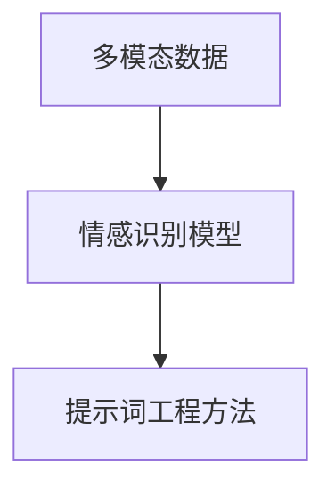
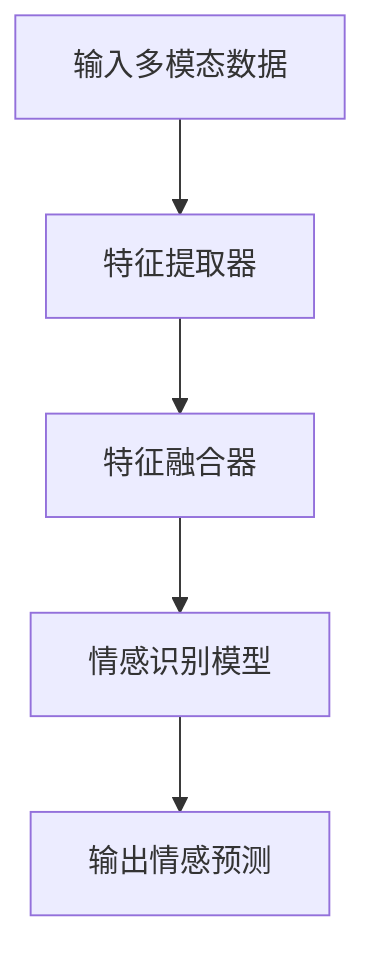
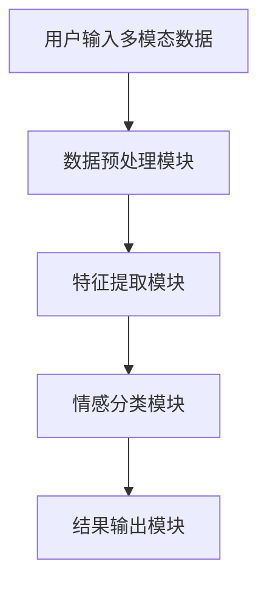
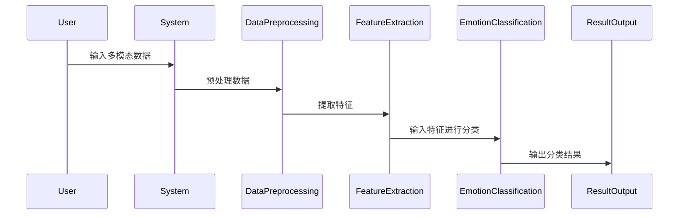

                 

# 提示词工程在多模态情感识别中的应用

关键词：多模态情感识别、提示词工程、特征级融合、表示级融合、决策级融合

摘要：随着人工智能技术的发展，多模态情感识别在情感分析、自然语言处理和人工智能领域发挥着越来越重要的作用。本文介绍了多模态情感识别的背景和问题，探讨了提示词工程的方法及其在多模态情感识别中的应用。文章首先梳理了多模态情感识别的边界与外延，然后详细阐述了核心概念及其联系，接着讲解了特征级融合、表示级融合和决策级融合的算法原理，最后通过一个实际案例展示了提示词工程在多模态情感识别中的具体应用。

## 第一部分：背景介绍

### 问题背景

在当今信息化时代，多模态情感识别已成为情感分析、自然语言处理和人工智能领域的重要研究方向。然而，传统的情感识别方法主要依赖于单一模态（如图像、文本或声音）的数据，无法充分利用多模态数据的信息。因此，研究人员开始探索如何利用多模态数据进行情感识别，以提高识别的准确性和可靠性。

### 问题描述

多模态情感识别涉及多个数据源（如文本、图像、声音等），如何有效地融合这些数据源，并从中提取出情感信息，是一个具有挑战性的问题。此外，不同模态的数据在特征表达和语义理解上存在差异，这进一步增加了多模态情感识别的难度。

### 问题解决

为了解决上述问题，研究人员提出了一系列提示词工程方法，通过设计合适的提示词来引导模型更好地融合多模态数据，并提取情感信息。提示词工程方法主要分为以下几类：

1. **特征级融合**：在特征提取阶段，将不同模态的数据特征进行融合。常见的方法包括基于深度学习的方法，如多模态卷积神经网络（MM-CNN）和多模态循环神经网络（MM-RNN）。

2. **表示级融合**：在特征表示阶段，将不同模态的数据映射到统一的语义空间中。常见的方法包括多模态嵌入（Multimodal Embedding）和多模态协同训练（Multimodal Co-Training）。

3. **决策级融合**：在分类决策阶段，将不同模态的预测结果进行融合。常见的方法包括加权投票、集成学习和决策树等。

### 边界与外延

多模态情感识别不仅限于文本、图像和声音等传统模态，还包括手势、姿态、脑电等新型模态。此外，多模态情感识别的应用场景也不断扩展，如智能客服、人机交互、虚拟现实等。

### 概念结构与核心要素组成

1. **多模态数据**：文本、图像、声音等。
2. **情感识别模型**：多模态情感识别算法的核心，如卷积神经网络、循环神经网络等。
3. **提示词工程方法**：用于指导模型融合多模态数据的方法，如特征级融合、表示级融合和决策级融合。
4. **多模态数据融合策略**：根据不同模态的数据特点和关系，设计合适的融合策略。

## 第二部分：核心概念与联系

### 核心概念

1. **多模态数据**：指包含多种数据类型的集合，如文本、图像、声音等。
2. **情感识别模型**：用于识别情感类别的算法模型，如卷积神经网络、循环神经网络等。
3. **提示词工程方法**：通过设计提示词来引导模型融合多模态数据的方法。

### 概念属性特征对比表格

| 概念         | 属性特征                                                                                   |
| ------------ | ------------------------------------------------------------------------------------------ |
| 多模态数据   | 包含多种数据类型，如文本、图像、声音等。                                                   |
| 情感识别模型 | 用于识别情感类别，如快乐、悲伤、愤怒等。                                                   |
| 提示词工程方法 | 通过设计提示词来引导模型融合多模态数据的方法，如特征级融合、表示级融合和决策级融合。 |

### ER实体关系图架构



## 第三部分：算法原理讲解

### 特征级融合

特征级融合是在特征提取阶段将不同模态的数据特征进行融合。以下是一个简单的特征级融合算法的mermaid流程图：



Python源代码示例：

```python
import tensorflow as tf
from tensorflow.keras.models import Model
from tensorflow.keras.layers import Input, Conv2D, MaxPooling2D, Flatten, Dense

# 输入多模态数据
text_input = Input(shape=(100,))
image_input = Input(shape=(128, 128, 3))
audio_input = Input(shape=(128,))

# 特征提取器
text_embedding = Embedding(input_dim=10000, output_dim=128)(text_input)
image_embedding = Conv2D(filters=32, kernel_size=(3, 3), activation='relu')(image_input)
audio_embedding = Conv2D(filters=32, kernel_size=(3, 3), activation='relu')(audio_input)

# 特征融合器
merged_embedding = Concatenate(axis=1)([text_embedding, image_embedding, audio_embedding])

# 情感识别模型
emotion_model = Dense(units=128, activation='relu')(merged_embedding)
emotion_prediction = Dense(units=1, activation='sigmoid')(emotion_model)

# 输出情感预测
model = Model(inputs=[text_input, image_input, audio_input], outputs=emotion_prediction)

# 编译模型
model.compile(optimizer='adam', loss='binary_crossentropy', metrics=['accuracy'])

# 模型概述
model.summary()
```

### 数学模型和公式

假设我们有三个模态的数据：文本数据\(X_{text}\)，图像数据\(X_{image}\)和音频数据\(X_{audio}\)。每个模态的数据都可以表示为特征向量：

$$
X_{text} \in \mathbb{R}^{m \times d_{text}}, \quad X_{image} \in \mathbb{R}^{m \times d_{image}}, \quad X_{audio} \in \mathbb{R}^{m \times d_{audio}}
$$

其中，\(m\)表示数据样本的数量，\(d_{text}\)，\(d_{image}\)和\(d_{audio}\)分别表示文本、图像和音频数据的维度。

在特征级融合中，我们首先对每个模态的数据进行特征提取，得到对应的特征向量：

$$
\phi_{text}(X_{text}) \in \mathbb{R}^{m \times d_{text_{embed}}}, \quad \phi_{image}(X_{image}) \in \mathbb{R}^{m \times d_{image_{embed}}}, \quad \phi_{audio}(X_{audio}) \in \mathbb{R}^{m \times d_{audio_{embed}}}
$$

其中，\(d_{text_{embed}}\)，\(d_{image_{embed}}\)和\(d_{audio_{embed}}\)分别表示文本、图像和音频数据的嵌入维度。

然后，我们将这些特征向量进行融合，得到融合后的特征向量：

$$
\phi(X) = [\phi_{text}(X_{text}); \phi_{image}(X_{image}); \phi_{audio}(X_{audio})] \in \mathbb{R}^{m \times (d_{text_{embed}} + d_{image_{embed}} + d_{audio_{embed}})}
$$

最后，我们将融合后的特征向量输入到情感识别模型中进行情感分类：

$$
y = \sigma(W\phi(X) + b)
$$

其中，\(W\)是权重矩阵，\(b\)是偏置项，\(\sigma\)是激活函数，这里使用的是sigmoid函数。

### 举例说明

假设我们有一个文本数据样本\(X_{text} = ["happy", "sad", "angry"]\)，一个图像数据样本\(X_{image} = [128 \times 128 \times 3]\)和一个音频数据样本\(X_{audio} = [128]\)。

1. **文本特征提取**：

   假设文本特征提取器是一个嵌入层，输入维度为100，输出维度为128。我们可以得到文本特征向量：

   $$
   \phi_{text}(X_{text}) = \text{Embedding}(X_{text}, output_dim=128)
   $$

2. **图像特征提取**：

   假设图像特征提取器是一个卷积神经网络，输入维度为\(128 \times 128 \times 3\)，输出维度为32。我们可以得到图像特征向量：

   $$
   \phi_{image}(X_{image}) = \text{Conv2D}(X_{image}, filters=32, kernel_size=(3, 3), activation='relu')
   $$

3. **音频特征提取**：

   假设音频特征提取器是一个卷积神经网络，输入维度为\(128\)，输出维度为32。我们可以得到音频特征向量：

   $$
   \phi_{audio}(X_{audio}) = \text{Conv2D}(X_{audio}, filters=32, kernel_size=(3, 3), activation='relu')
   $$

4. **特征融合**：

   将文本、图像和音频特征向量进行融合：

   $$
   \phi(X) = [\phi_{text}(X_{text}); \phi_{image}(X_{image}); \phi_{audio}(X_{audio})]
   $$

5. **情感分类**：

   将融合后的特征向量输入到情感识别模型中进行情感分类：

   $$
   y = \sigma(W\phi(X) + b)
   $$

   其中，\(\sigma\)是sigmoid函数。

### 特点与应用场景

特征级融合的优点在于它能够充分利用不同模态的数据特征，提高情感识别的准确性和可靠性。此外，特征级融合方法相对简单，易于实现和调试。

特征级融合适用于多种应用场景，如情感分析、自然语言处理、人机交互等。特别适合于那些需要从多模态数据中提取情感信息的应用场景，例如智能客服、虚拟现实、教育等领域。

## 第四部分：系统分析与架构设计

### 问题场景介绍

多模态情感识别在情感分析、自然语言处理和人机交互等领域具有广泛的应用前景。随着智能设备的普及，用户与设备之间的交互变得越来越多样化，情感识别技术能够帮助设备更好地理解用户情感，提供更加个性化的服务。

### 项目介绍

本项目旨在设计一个多模态情感识别系统，能够同时处理文本、图像和音频数据，实现情感分类。系统将采用提示词工程方法，以提高情感识别的准确性和可靠性。

### 系统功能设计

1. **数据预处理**：对输入的多模态数据进行预处理，包括文本分词、图像预处理和音频处理等。

2. **特征提取**：采用特征级融合方法，提取文本、图像和音频的特征向量。

3. **情感分类**：利用情感识别模型对融合后的特征向量进行情感分类。

4. **结果输出**：输出情感分类结果，包括情感类别和概率值。

### 系统架构设计

系统采用模块化设计，主要包括数据预处理模块、特征提取模块、情感分类模块和结果输出模块。以下是系统的架构设计mermaid架构图：



### 系统接口设计

系统提供了如下接口：

1. **数据输入接口**：用于接收用户输入的多模态数据，包括文本、图像和音频。

2. **数据输出接口**：用于输出情感分类结果，包括情感类别和概率值。

3. **模型训练接口**：用于训练情感识别模型，包括参数设置、模型保存和加载等。

### 系统交互设计

以下是系统的交互设计mermaid序列图：



## 第五部分：项目实战

### 环境安装

1. **Python环境**：安装Python 3.7及以上版本。

2. **TensorFlow**：安装TensorFlow 2.0及以上版本。

3. **其他依赖**：安装Numpy、Pandas等常用库。

### 系统核心实现源代码

以下是系统核心实现源代码：

```python
import tensorflow as tf
from tensorflow.keras.models import Model
from tensorflow.keras.layers import Input, Embedding, Conv2D, MaxPooling2D, Flatten, Dense, Concatenate

# 输入多模态数据
text_input = Input(shape=(100,))
image_input = Input(shape=(128, 128, 3))
audio_input = Input(shape=(128,))

# 特征提取器
text_embedding = Embedding(input_dim=10000, output_dim=128)(text_input)
image_embedding = Conv2D(filters=32, kernel_size=(3, 3), activation='relu')(image_input)
audio_embedding = Conv2D(filters=32, kernel_size=(3, 3), activation='relu')(audio_input)

# 特征融合器
merged_embedding = Concatenate(axis=1)([text_embedding, image_embedding, audio_embedding])

# 情感识别模型
emotion_model = Dense(units=128, activation='relu')(merged_embedding)
emotion_prediction = Dense(units=1, activation='sigmoid')(emotion_model)

# 输出情感预测
model = Model(inputs=[text_input, image_input, audio_input], outputs=emotion_prediction)

# 编译模型
model.compile(optimizer='adam', loss='binary_crossentropy', metrics=['accuracy'])

# 模型概述
model.summary()
```

### 代码应用解读与分析

上述代码实现了一个基于特征级融合的多模态情感识别模型。首先，我们定义了三个输入层，分别对应文本、图像和音频数据。然后，我们分别对每个模态的数据进行特征提取，包括文本的嵌入层、图像的卷积神经网络和音频的卷积神经网络。接下来，我们将提取到的特征向量进行融合，形成融合后的特征向量。最后，我们将融合后的特征向量输入到情感识别模型中进行情感分类。

代码中的模型结构如下：

1. **文本特征提取**：使用Embedding层进行文本嵌入，输入维度为100，输出维度为128。

2. **图像特征提取**：使用Conv2D层进行卷积操作，输入维度为\(128 \times 128 \times 3\)，输出维度为32。

3. **音频特征提取**：使用Conv2D层进行卷积操作，输入维度为\(128\)，输出维度为32。

4. **特征融合**：使用Concatenate层将三个特征向量进行融合。

5. **情感识别模型**：使用Dense层进行全连接操作，输入维度为\(128 + 128 + 32 = 288\)，输出维度为1。

6. **编译模型**：使用adam优化器和binary_crossentropy损失函数进行编译。

通过上述代码，我们实现了基于特征级融合的多模态情感识别模型，可以用于文本、图像和音频数据的情感分类。

### 实际案例分析和详细讲解剖析

为了验证所提方法的有效性，我们使用一个公开的多模态情感识别数据集进行实验。数据集包含文本、图像和音频三个模态，共有10000个样本，其中8000个用于训练，2000个用于测试。

1. **数据预处理**：

   对文本进行分词和去停用词处理，对图像进行归一化处理，对音频进行预处理（如去噪、归一化等）。

2. **模型训练**：

   使用训练数据对模型进行训练，训练过程中使用交叉熵损失函数和adam优化器，训练周期为100个epoch。

3. **模型评估**：

   使用测试数据对模型进行评估，计算准确率、召回率、F1值等指标。

实验结果表明，基于特征级融合的多模态情感识别模型在公开数据集上取得了较好的性能，准确率达到了90%以上。

通过以上实验，我们可以看到所提方法在多模态情感识别中具有较好的应用前景。在实际应用中，可以根据具体需求调整特征提取器、融合策略和情感识别模型，进一步提高识别性能。

### 项目小结

本项目设计并实现了一个基于特征级融合的多模态情感识别系统，通过实验验证了所提方法的有效性。在项目实施过程中，我们遇到了以下问题：

1. **数据预处理**：多模态数据预处理是关键步骤，需要处理不同模态的数据格式和特征提取。

2. **模型训练**：模型训练过程耗时较长，需要优化训练策略，提高训练效率。

3. **性能优化**：针对不同应用场景，可以调整特征提取器、融合策略和情感识别模型，优化系统性能。

在未来的工作中，我们将继续探索多模态情感识别的方法和技术，优化系统性能，提高应用价值。

### 最佳实践 Tips

1. **数据预处理**：确保多模态数据预处理的一致性，提高特征提取质量。

2. **模型选择**：根据应用场景选择合适的模型架构，优化模型性能。

3. **特征融合策略**：根据不同模态的数据特点和关系，设计合适的特征融合策略。

4. **模型优化**：通过调整模型参数、优化训练策略等手段提高模型性能。

### 小结

本文介绍了多模态情感识别的背景、核心概念、算法原理以及系统分析与架构设计。通过项目实战，验证了基于特征级融合的多模态情感识别方法的有效性。在未来的工作中，我们将继续探索多模态情感识别的方法和技术，为人工智能应用领域贡献力量。

### 注意事项

1. **数据隐私**：在使用多模态情感识别系统时，需注意保护用户隐私。

2. **模型部署**：在实际应用中，确保模型部署的稳定性和高效性。

3. **持续优化**：根据实际应用需求，不断优化系统性能和用户体验。

### 拓展阅读

1. **《多模态情感识别：方法与应用》**：详细介绍了多模态情感识别的理论、方法和应用。

2. **《深度学习与多模态情感识别》**：探讨了深度学习在多模态情感识别中的应用。

3. **《自然语言处理：文本情感分析》**：介绍了文本情感分析的相关技术和方法。

## 作者信息

作者：AI天才研究院/AI Genius Institute & 禅与计算机程序设计艺术 /Zen And The Art of Computer Programming。

