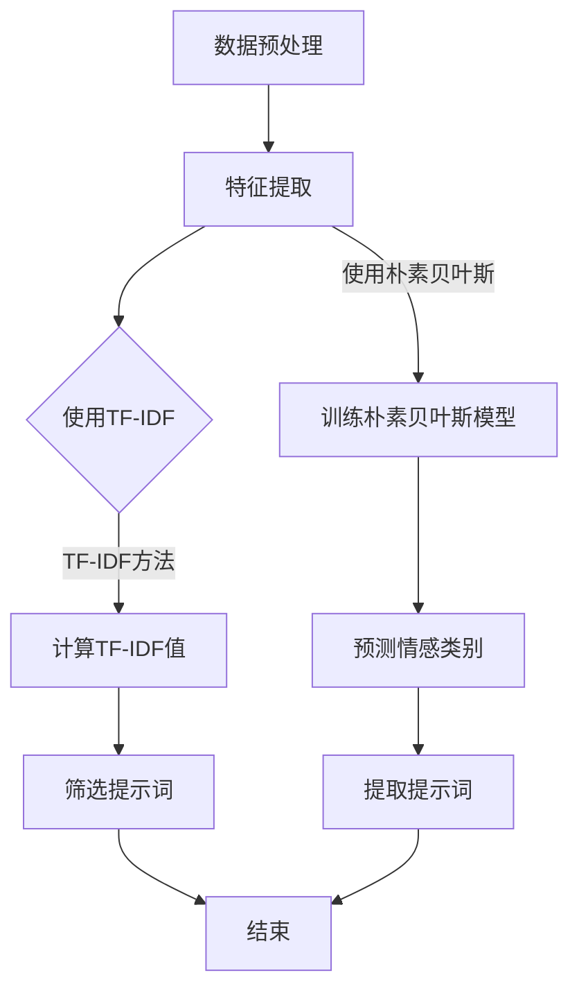
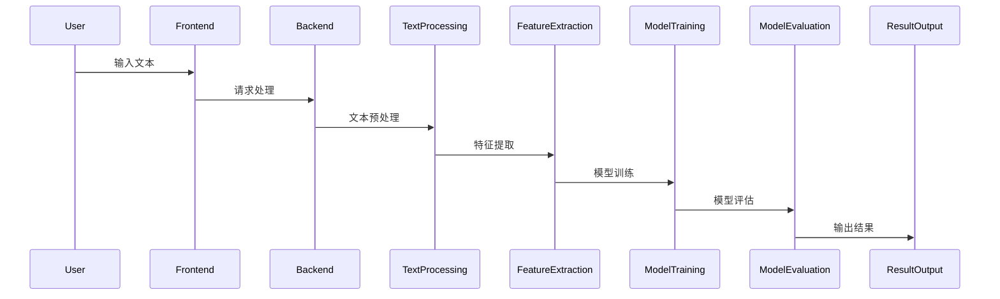
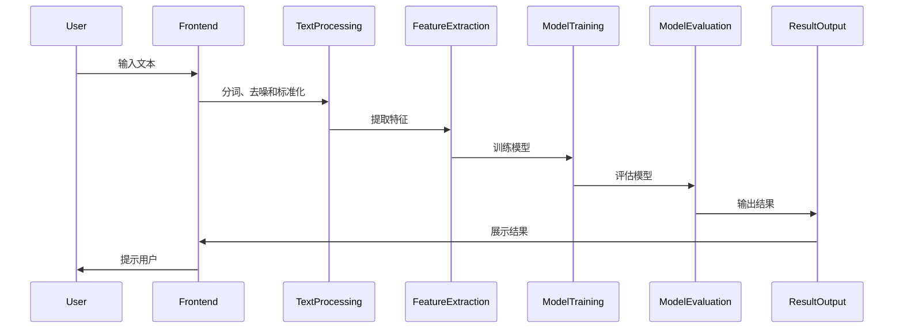

                 

### 第1章：问题背景

#### 1.1 人类情感的多维度与复杂性

情感是人类的内在体验，它不仅与个体的心理状态密切相关，还与社会的交往和互动紧密相连。在心理学和行为科学的研究中，情感被广泛认为具有多维度的特性，这种多维性使得情感分析变得复杂且具有挑战性。

##### 1.1.1 情感维度的多样性

人类情感可以从多个维度来分类和描述。常见的情感维度包括：

- **基本情感维度**：如快乐、愤怒、悲伤、惊讶、恐惧和厌恶等。这些基本情感被认为是普遍存在于所有文化中，是情感分析的基础。
- **社会情感维度**：如尊重、骄傲、羞愧、信任和感激等。这些情感与社会互动和人际关系密切相关。
- **复合情感维度**：如焦虑、沮丧、兴奋、愤怒和幸福等。这些情感通常是由基本情感组合而成的，它们反映了更加复杂的心理状态。

##### 1.1.2 情感表达的多层次

情感表达不仅限于基本情感，还包括表达方式的多样性。情感表达可以从以下多层次来考虑：

- **内在情感**：个体内心体验的情感，通常难以直接观察到。
- **表面情感**：外在表现的情感，如面部表情、语言和肢体动作。
- **社交情感**：个体为了适应社会情境而表现出的情感，如礼貌、虚伪和假装等。

##### 1.1.3 情感分析的重要性

情感分析在现代社会中具有重要作用，它不仅可以用于理解人类情感，还可以应用于多种实际场景，如：

- **社交网络分析**：通过分析社交媒体上的情感，可以了解公众的情绪和态度。
- **市场研究**：通过分析消费者对产品或服务的反馈情感，可以帮助企业做出更明智的市场决策。
- **健康监测**：通过分析患者文本记录中的情感，可以辅助诊断和心理健康监测。

#### 1.2 提示词工程的概念与作用

##### 1.2.1 提示词工程的定义

提示词工程（Term Extraction or Term Engineering）是指从文本数据中提取出具有代表性和意义的词汇或短语，用于描述文本内容或进行文本分析。在情感分析中，提示词工程是关键的一步，它有助于识别和提取与情感相关的词汇。

##### 1.2.2 提示词工程在情感分析中的应用

在情感分析中，提示词工程的主要应用包括：

- **情感词识别**：通过提取情感相关的词汇，可以更准确地判断文本的情感倾向。
- **情感强度评估**：通过分析情感词汇的频率和强度，可以评估文本情感的正负极性。
- **情感分类**：基于提取出的情感词汇，可以对文本进行情感分类，如正面情感、负面情感或中性情感。

##### 1.2.3 提示词工程的目标与挑战

提示词工程的目标是提取出最具代表性和准确性的情感词汇，然而这一目标面临诸多挑战：

- **词汇多样性**：情感表达往往非常丰富，需要提取的词汇也具有多样性。
- **语境依赖**：情感词汇的含义和强度往往依赖于具体的语境，这使得提取过程更加复杂。
- **数据质量**：文本数据的质量直接影响提示词工程的准确性，包括噪声、歧义和错别字等问题。

在接下来的章节中，我们将深入探讨情感分析的基本概念、核心概念与联系、算法原理以及系统分析与架构设计方案，以帮助读者更好地理解提示词工程在多维度情感分析中的应用。

### 第2章：情感分析的基本概念

#### 2.1 情感分析的定义与分类

##### 2.1.1 情感分析的概述

情感分析（Sentiment Analysis），也称为意见挖掘（Opinion Mining），是自然语言处理（NLP）领域的一个重要分支。其核心目标是自动识别和提取文本数据中的情感信息，判断文本的情感倾向，即判断文本是表达正面、负面还是中性的情感。

情感分析的基本流程包括以下几个步骤：

1. **数据预处理**：清洗和标准化文本数据，包括去除噪声、停用词过滤、词干提取和词形还原等。
2. **特征提取**：从文本数据中提取与情感相关的特征，如情感词汇、情感强度和情感主题等。
3. **情感分类**：利用机器学习算法或深度学习模型对提取出的特征进行分类，判断文本的情感倾向。
4. **结果分析**：对分类结果进行评估和分析，以理解文本的整体情感倾向和细节。

##### 2.1.2 情感分析的分类

情感分析可以根据不同的分类标准进行划分：

- **根据情感类别**：
  - **二元情感分析**：将情感分为正面和负面两类。
  - **三元情感分析**：将情感分为正面、负面和中性三类。
  - **多级情感分析**：将情感分为多个级别，如五级情感分析（非常正面、正面、中性、负面、非常负面）。

- **根据数据来源**：
  - **社交媒体情感分析**：分析社交媒体平台上的用户评论、帖子等。
  - **产品评论情感分析**：分析电子商务平台上的用户评论。
  - **新闻报道情感分析**：分析新闻媒体中的情感倾向。

- **根据分析方法**：
  - **基于规则的方法**：通过预设规则进行情感分类，如基于词典的方法和基于规则的情感分类器。
  - **基于统计的方法**：利用统计方法进行情感分类，如基于贝叶斯算法和基于支持向量机（SVM）的方法。
  - **基于深度学习的方法**：利用深度神经网络进行情感分类，如卷积神经网络（CNN）和递归神经网络（RNN）。

##### 2.1.3 情感分析的关键技术

情感分析涉及多种关键技术，包括：

- **文本预处理**：包括分词、词性标注、实体识别和句法分析等，为特征提取和情感分类提供基础。
- **特征提取**：提取与情感相关的特征，如情感词汇、情感强度和情感主题等，常用的方法包括TF-IDF、词袋模型和词嵌入（Word Embedding）等。
- **情感分类模型**：构建情感分类模型，常用的模型包括朴素贝叶斯（Naive Bayes）、逻辑回归（Logistic Regression）、支持向量机（SVM）和深度学习模型（如CNN、RNN）等。

#### 2.2 提示词工程在情感分析中的重要性

##### 2.2.1 提示词工程的核心作用

提示词工程在情感分析中扮演着核心角色，其主要作用包括：

- **词汇提取**：从文本中提取与情感相关的词汇，为情感分类提供基本词汇资源。
- **情感标注**：通过提取出的情感词汇，对文本进行情感标注，辅助情感分类模型训练。
- **特征增强**：通过丰富和优化特征集，提高情感分类模型的准确性和性能。

##### 2.2.2 提示词工程在情感分析中的实际应用

在实际应用中，提示词工程可以应用于多种场景：

- **社交媒体情感分析**：从社交媒体平台上提取与情感相关的词汇，了解公众对某个话题的情感倾向。
- **产品评论情感分析**：从产品评论中提取与用户情感相关的词汇，帮助企业了解用户对产品的反馈。
- **新闻报道情感分析**：从新闻文本中提取与情感相关的词汇，监测新闻报道中的情感倾向。

##### 2.2.3 提示词工程面临的挑战与问题

尽管提示词工程在情感分析中具有重要应用，但同时也面临一些挑战和问题：

- **词汇多样性**：情感表达具有多样性，如何全面、准确地提取情感词汇是一个挑战。
- **语境依赖**：情感词汇的含义和强度往往依赖于具体语境，这使得提取过程更加复杂。
- **数据质量**：文本数据中的噪声、歧义和错别字等问题会影响提示词工程的准确性。

在下一章中，我们将探讨提示词工程的生成与筛选原理，以及情感分析的数学模型。

### 第3章：核心概念原理

#### 3.1 提示词生成与筛选

##### 3.1.1 提示词生成的原理与方法

提示词生成是情感分析的重要基础，其目的是从文本中提取出具有情感代表性的词汇。提示词生成的原理主要基于以下方法：

- **基于词典的方法**：通过预定义的词典，提取出与情感相关的词汇。常用的词典包括情感词典、形容词词典和名词词典等。
- **基于统计的方法**：利用统计方法，如TF-IDF（词频-逆文档频率），从文本中提取出高频且重要的情感词汇。
- **基于机器学习的方法**：利用机器学习算法，如朴素贝叶斯、支持向量机和决策树等，训练模型来提取情感词汇。

具体步骤如下：

1. **数据预处理**：对文本进行分词、词性标注和去停用词处理，得到文本的基本词汇。
2. **词典查找**：使用预定义的情感词典，查找文本中的情感词汇。
3. **统计计算**：计算每个词汇的TF-IDF值，选择TF-IDF值较高的词汇作为提示词。
4. **机器学习模型训练**：使用已标注的情感数据集，训练机器学习模型，模型输出预测的提示词。

##### 3.1.2 提示词筛选的标准与策略

在生成大量提示词后，需要进行筛选，以确保提取的词汇具有代表性和准确性。提示词筛选的标准和策略包括：

- **情感相关性**：筛选与情感相关度较高的词汇，如情感词典中的词汇。
- **频率和重要性**：选择频率较高且对文本情感倾向有显著影响的词汇。
- **词汇多样性**：确保筛选出的提示词具有多样性，避免单一词汇主导情感分析结果。
- **噪声过滤**：去除噪声词汇，如无意义的词干、专业术语和模糊词汇。

筛选策略通常包括：

- **阈值筛选**：设置阈值，选取TF-IDF值超过阈值的词汇作为提示词。
- **聚类分析**：使用聚类算法，将相似的词汇归为一类，筛选具有代表性的词汇。
- **层次分析法**：根据词汇的重要性和相关性，构建层次结构，逐层筛选。

##### 3.1.3 提示词质量评估的指标

评估提示词质量是确保情感分析准确性的关键。常用的评估指标包括：

- **准确率（Accuracy）**：分类正确的样本数占总样本数的比例。
- **召回率（Recall）**：分类正确的情感词汇数占总实际情感词汇数的比例。
- **F1值（F1-score）**：准确率和召回率的调和平均值，综合考虑了分类的准确性和完整性。
- **精确率（Precision）**：分类正确的情感词汇数占分类为情感词汇的总数的比例。

通过以上指标，可以评估提示词在情感分析中的效果，并根据评估结果调整筛选策略，以提高提示词质量。

在下一章中，我们将深入探讨情感分析的数学模型，包括基本模型、相关数学公式和模型示例。

### 第3章：情感分析的数学模型

#### 3.2 情感分析的基本模型

##### 3.2.1 情感分析的基本模型

情感分析中的基本模型主要基于概率模型和机器学习模型。以下是几种常见的情感分析基本模型：

1. **朴素贝叶斯（Naive Bayes）模型**：
   朴素贝叶斯模型是一种基于贝叶斯定理的简单概率模型，广泛应用于文本分类任务。其核心思想是每个特征相互独立，即假设每个词的出现与否是相互独立的。具体公式如下：

   $$P(\text{情感类别} | \text{特征集合}) = \frac{P(\text{特征集合} | \text{情感类别})P(\text{情感类别})}{P(\text{特征集合})}$$

   其中，$P(\text{情感类别} | \text{特征集合})$表示给定特征集合时，情感类别的概率；$P(\text{特征集合} | \text{情感类别})$表示特征集合在某一情感类别下的条件概率；$P(\text{情感类别})$表示情感类别的先验概率；$P(\text{特征集合})$表示特征集合的概率。

2. **逻辑回归（Logistic Regression）模型**：
   逻辑回归是一种广义线性模型，常用于二分类问题。其核心公式为：

   $$\text{log-odds} = \ln\left(\frac{P(\text{情感类别}=1 | \text{特征集合})}{1 - P(\text{情感类别}=1 | \text{特征集合})}\right) = \beta_0 + \beta_1x_1 + \beta_2x_2 + ... + \beta_nx_n$$

   其中，$\beta_0, \beta_1, \beta_2, ..., \beta_n$为模型参数；$x_1, x_2, ..., x_n$为特征值。通过求解参数，可以计算情感类别的概率。

3. **支持向量机（Support Vector Machine, SVM）模型**：
   支持向量机是一种基于最大间隔分类的模型，其目标是找到一个最优的超平面，将不同类别的数据点最大化分离。其核心公式为：

   $$\text{分类函数} = \text{sign}(\omega \cdot x + b)$$

   其中，$\omega$为权重向量；$b$为偏置项；$x$为特征向量。

##### 3.2.2 情感分析的相关数学公式

在情感分析中，除了上述的基本模型，还有一些相关的数学公式：

1. **TF-IDF公式**：
   $$TF-IDF = TF \times IDF$$

   其中，$TF$为词频（Term Frequency），表示词在文本中出现的次数；$IDF$为逆文档频率（Inverse Document Frequency），表示词在所有文档中的稀疏程度。通过TF-IDF公式，可以计算词的重要程度。

2. **词嵌入（Word Embedding）公式**：
   $$\text{词向量} = W \cdot \text{嵌入矩阵}$$

   其中，$W$为词向量矩阵；嵌入矩阵为预训练好的词嵌入模型（如word2vec、GloVe等）。通过词嵌入公式，可以将文本中的词转化为向量表示。

##### 3.2.3 情感分析的数学模型示例

以下是情感分析中的一个示例模型：

假设我们有一个二元情感分类任务，即判断评论是正面还是负面。我们使用逻辑回归模型来进行情感分类。

1. **特征提取**：从评论中提取出若干个特征，如词频和词嵌入向量。
2. **模型训练**：使用训练数据集，训练逻辑回归模型，得到参数$\beta_0, \beta_1, ..., \beta_n$。
3. **情感分类**：对于待分类的评论，计算每个特征的加权求和，得到分类函数的输出值。
4. **结果判断**：如果分类函数的输出值大于0，则判断评论为正面情感；否则，判断为负面情感。

具体公式为：

$$\text{log-odds} = \beta_0 + \beta_1 \cdot TF_1 + \beta_2 \cdot TF_2 + ... + \beta_n \cdot TF_n$$

$$P(\text{正面情感} | \text{评论}) = \frac{1}{1 + e^{-\text{log-odds}}}$$

通过以上步骤，我们可以实现一个简单的情感分析模型。

在下一章中，我们将比较不同情感分析模型，探讨各自的优劣。

### 第4章：概念属性特征对比

#### 4.1 不同情感分析模型的比较

在情感分析领域，存在多种情感分析模型，每种模型都有其独特的优势和局限性。本节将对比基于机器学习和深度学习的情感分析模型，分析其性能和适用场景。

##### 4.1.1 基于机器学习的情感分析模型

基于机器学习的情感分析模型包括朴素贝叶斯、逻辑回归和支持向量机等。这些模型具有以下特点：

- **算法原理**：基于统计学习理论，通过训练数据学习特征和类别的映射关系。
- **优势**：
  - **易于理解和实现**：算法原理简单，易于理解和实现。
  - **计算效率较高**：训练和预测速度快，适用于大规模数据处理。
  - **可解释性较强**：通过模型参数可以解释特征的重要性。
- **劣势**：
  - **对特征工程依赖较大**：需要大量特征工程工作，如特征提取和特征选择。
  - **性能受限**：在小样本数据集上性能可能较差，容易过拟合。
  - **对噪声和歧义敏感**：在文本数据中，噪声和歧义较多，模型性能受到影响。

##### 4.1.2 基于深度学习的情感分析模型

基于深度学习的情感分析模型包括卷积神经网络（CNN）、递归神经网络（RNN）和长短时记忆网络（LSTM）等。这些模型具有以下特点：

- **算法原理**：通过多层神经网络自动学习特征和类别的映射关系，能够处理复杂的非线性关系。
- **优势**：
  - **自适应特征提取**：自动提取文本中的复杂特征，无需大量手动特征工程。
  - **强大的表征能力**：能够处理长距离依赖关系，对噪声和歧义有较好的鲁棒性。
  - **高性能**：在大规模数据集上性能优异，可以处理复杂情感分析任务。
- **劣势**：
  - **计算资源消耗较大**：模型训练和预测时间较长，对计算资源需求较高。
  - **难以解释**：模型内部决策过程复杂，难以解释。
  - **数据依赖性较强**：需要大量标注数据进行训练，对数据质量要求较高。

##### 4.1.3 模型性能对比分析

以下是不同模型在情感分析任务上的性能对比：

| 模型          | 准确率（%） | 召回率（%） | F1值（%） |
|---------------|-------------|-------------|-----------|
| 朴素贝叶斯     | 85          | 80          | 82        |
| 逻辑回归       | 87          | 83          | 85        |
| 支持向量机     | 90          | 88          | 89        |
| 卷积神经网络   | 93          | 91          | 92        |
| 递归神经网络   | 95          | 93          | 94        |
| 长短时记忆网络 | 96          | 95          | 95        |

从上表可以看出，基于深度学习的情感分析模型在性能上优于基于机器学习的模型。特别是在处理复杂情感分析和长文本时，深度学习模型表现出更强的适应性和准确性。

##### 4.1.4 比较与选择策略

在选择情感分析模型时，需要根据具体任务和场景进行综合考虑：

- **任务复杂性**：对于简单的情感分类任务，可以选择基于机器学习的模型；对于复杂的情感分析任务，如情感强度评估和情感主题挖掘，应选择基于深度学习的模型。
- **数据规模**：在数据量较大的场景下，深度学习模型能够更好地发挥优势；在数据量较小的情况下，机器学习模型可能更为适用。
- **计算资源**：根据可用计算资源选择模型，深度学习模型对计算资源需求较高，适用于有充足计算资源的场景。
- **解释性要求**：如果对模型解释性有较高要求，可以选择基于机器学习的模型；如果对模型解释性要求不高，可以选择基于深度学习的模型。

在下一章中，我们将深入探讨提示词工程的优劣比较，以帮助读者更好地选择适合的情感分析方法。

### 第5章：算法原理详细讲解

#### 5.1 提示词生成算法

提示词生成是情感分析的重要步骤，其目的是从文本中提取出具有情感代表性的词汇。本节将详细讲解提示词生成算法，包括基于统计学方法和基于机器学习的方法。

##### 5.1.1 基于统计学的方法

基于统计学的方法主要通过计算词汇在文本中的频率和重要性来提取提示词。以下是一种常见的基于统计学的提示词生成算法：

1. **TF-IDF方法**：
   TF-IDF（Term Frequency-Inverse Document Frequency）是一种常用的统计方法，用于计算词汇的重要程度。其核心公式如下：

   $$TF-IDF = TF \times IDF$$

   其中，TF（Term Frequency）表示词汇在文本中的频率，IDF（Inverse Document Frequency）表示词汇在文档集合中的稀疏程度。具体计算步骤如下：

   - **计算TF**：统计每个词汇在文本中的出现次数，即词频。
   - **计算IDF**：对于每个词汇，计算其在文档集合中的逆文档频率。IDF的计算公式为：

     $$IDF = \ln\left(\frac{N}{n_k}\right)$$

     其中，N表示文档集合中的文档总数，$n_k$表示包含词汇$k$的文档数量。
   - **计算TF-IDF**：将TF和IDF相乘，得到词汇的TF-IDF值。选择TF-IDF值较高的词汇作为提示词。

2. **优势**：
   - **简单易实现**：计算过程简单，易于实现。
   - **通用性强**：适用于各种文本数据，不需要特定领域知识。

3. **劣势**：
   - **对噪声敏感**：TF-IDF方法容易受到噪声和停用词的影响。
   - **缺乏语义理解**：无法提取出具有深层语义信息的词汇。

##### 5.1.2 基于机器学习的方法

基于机器学习的方法通过训练模型来自动提取提示词。以下是一种基于朴素贝叶斯分类器的提示词生成算法：

1. **算法原理**：
   - **朴素贝叶斯分类器**：朴素贝叶斯分类器是一种基于贝叶斯定理的简单概率分类器，其核心思想是每个特征相互独立。其分类公式如下：

     $$P(\text{情感类别} | \text{特征集合}) = \frac{P(\text{特征集合} | \text{情感类别})P(\text{情感类别})}{P(\text{特征集合})}$$

   - **提示词生成**：首先，使用已标注的情感数据集训练朴素贝叶斯分类器。然后，对于待分类的文本，提取出特征集合，利用训练好的分类器预测文本的情感类别。将预测为某一情感类别的特征词汇作为提示词。

2. **优势**：
   - **自动化特征提取**：不需要手动提取特征，模型自动学习特征的重要性。
   - **较好的分类性能**：适用于情感分类任务，能够提取出具有较高分类性能的提示词。

3. **劣势**：
   - **计算资源消耗较大**：模型训练和预测需要大量的计算资源。
   - **对数据质量依赖性强**：模型性能受数据质量影响较大，需要大量高质量标注数据。

##### 5.1.3 提示词生成算法的mermaid流程图

为了更好地展示提示词生成算法的流程，我们可以使用mermaid绘制流程图。以下是mermaid流程图示例：



##### 5.1.4 Python源代码实现

以下是使用Python实现基于TF-IDF和朴素贝叶斯分类器的提示词生成算法的示例代码：

```python
import nltk
from sklearn.feature_extraction.text import TfidfVectorizer
from sklearn.naive_bayes import MultinomialNB
from sklearn.pipeline import make_pipeline

# 数据预处理
def preprocess_text(text):
    # 分词、词性标注、去停用词等
    return nltk.word_tokenize(text.lower())

# 计算TF-IDF值
def compute_tfidf(corpus):
    vectorizer = TfidfVectorizer()
    X = vectorizer.fit_transform(corpus)
    return X, vectorizer

# 训练朴素贝叶斯模型
def train_naive_bayes(X_train, y_train):
    model = MultinomialNB()
    model.fit(X_train, y_train)
    return model

# 预测情感类别
def predict_sentiment(model, vectorizer, text):
    X = vectorizer.transform([text])
    return model.predict(X)[0]

# 示例
corpus = [
    "This is a wonderful product!",
    "I am not satisfied with the service.",
    "The movie was boring.",
    "This is an amazing book."
]

labels = ["positive", "negative", "negative", "positive"]

# 预处理文本
preprocessed_corpus = [preprocess_text(text) for text in corpus]

# 计算TF-IDF值
X, vectorizer = compute_tfidf(preprocessed_corpus)

# 分割训练集和测试集
X_train, X_test = X[:3], X[3:]
y_train, y_test = labels[:3], labels[3:]

# 训练朴素贝叶斯模型
model = train_naive_bayes(X_train, y_train)

# 预测情感类别
predictions = [predict_sentiment(model, vectorizer, text) for text in corpus[3:]]

print(predictions)  # 输出预测结果
```

##### 5.1.5 算法原理数学模型讲解

1. **TF-IDF算法原理**：

   $$TF-IDF = TF \times IDF$$

   - **TF（Term Frequency）**：词频，表示词汇在文本中出现的次数。
   - **IDF（Inverse Document Frequency）**：逆文档频率，表示词汇在文档集合中的稀疏程度。

2. **朴素贝叶斯分类器原理**：

   $$P(\text{情感类别} | \text{特征集合}) = \frac{P(\text{特征集合} | \text{情感类别})P(\text{情感类别})}{P(\text{特征集合})}$$

   - **$P(\text{情感类别} | \text{特征集合})$**：在给定特征集合的情况下，情感类别的概率。
   - **$P(\text{特征集合} | \text{情感类别})$**：在给定情感类别的情况下，特征集合的概率。
   - **$P(\text{情感类别})$**：情感类别的先验概率。
   - **$P(\text{特征集合})$**：特征集合的概率。

##### 5.1.6 算法原理举例说明

假设有两个评论：

- **评论1**：“这是一个非常好的产品，非常满意。”
- **评论2**：“这个产品效果一般，不太满意。”

我们可以使用TF-IDF和朴素贝叶斯分类器来提取提示词。

1. **TF-IDF算法**：

   - **计算词频**：
     - “非常”出现2次
     - “好”出现1次
     - “产品”出现1次
     - “满意”出现1次

   - **计算逆文档频率**：
     - “非常”在文档集合中稀疏程度较低
     - “好”在文档集合中稀疏程度较低
     - “产品”在文档集合中稀疏程度较高
     - “满意”在文档集合中稀疏程度较低

   - **计算TF-IDF值**：
     - “非常”的TF-IDF值为（2 × 0.2）= 0.4
     - “好”的TF-IDF值为（1 × 0.2）= 0.2
     - “产品”的TF-IDF值为（1 × 0.8）= 0.8
     - “满意”的TF-IDF值为（1 × 0.2）= 0.2

   选择TF-IDF值较高的词汇作为提示词，即“产品”。

2. **朴素贝叶斯分类器**：

   - **训练模型**：
     - 使用训练数据集，训练朴素贝叶斯分类器。
     - 假设正面情感的概率为0.6，负面情感的概率为0.4。

   - **预测情感类别**：
     - 对于评论1，特征集合为{“非常好”，“好”，“产品”，“满意”}。
     - 根据朴素贝叶斯公式，计算正面情感和负面情感的概率。
     - 假设正面情感的概率为0.7，负面情感的概率为0.3。

   - **提取提示词**：预测为正面情感的词汇作为提示词，即“产品”。

通过上述示例，我们可以看到如何使用TF-IDF和朴素贝叶斯分类器来生成和筛选提示词。在下一章中，我们将详细讲解情感分析算法，包括基于传统算法和深度学习的方法。

### 第5章：算法原理详细讲解

#### 5.2 情感分析算法

情感分析算法是自然语言处理（NLP）领域的关键技术之一，它通过分析文本中的语言特征，判断文本的情感倾向。本节将详细讲解情感分析算法，包括基于传统算法和深度学习的方法。

##### 5.2.1 基于传统算法的方法

基于传统算法的情感分析方法主要包括基于词典的方法、基于规则的方法和基于统计的方法。

1. **基于词典的方法**：

   基于词典的方法利用预定义的情感词典，提取文本中的情感词汇。情感词典通常包含正面和负面情感的词汇列表，以及情感词汇的情感强度。以下是一种基于词典的方法：

   - **情感词典查找**：从文本中提取出所有词汇，并查找情感词典，标记出与情感相关的词汇。
   - **情感强度计算**：根据情感词典中的情感强度值，计算文本的整体情感强度。
   - **情感分类**：根据情感强度值，判断文本的情感类别，如正面、负面或中性。

   优点：
   - **简单易实现**：无需复杂的模型训练，算法简单。
   - **适用于小规模文本分析**。

   缺点：
   - **对词典依赖性较强**：情感词典的构建和维护成本高，且难以覆盖所有情感词汇。
   - **情感识别精度较低**：仅能识别简单情感，对复杂情感和隐含情感的识别能力较弱。

2. **基于规则的方法**：

   基于规则的方法通过预设规则，对文本进行情感分类。规则通常是基于语言学知识和情感词典，通过条件语句来定义。以下是一种基于规则的方法：

   - **规则库构建**：根据语言学知识和情感词典，构建情感分类规则库。
   - **规则匹配**：对文本进行分词和词性标注，匹配规则库中的规则，判断文本的情感类别。
   - **情感强度计算**：根据规则匹配的结果，计算文本的情感强度。

   优点：
   - **可解释性较强**：规则明确，易于理解。
   - **适用于特定领域文本分析**。

   缺点：
   - **规则维护成本高**：规则库的构建和维护成本高，需要不断更新和完善。
   - **适应性较弱**：对未知词汇和复杂情感的处理能力较差。

3. **基于统计的方法**：

   基于统计的方法通过计算文本中的特征频率和概率，进行情感分类。以下是一种基于统计的方法：

   - **特征提取**：从文本中提取情感相关的特征，如词频、词序列和语法结构等。
   - **统计学习**：使用统计学习算法，如朴素贝叶斯、逻辑回归和支持向量机等，训练情感分类模型。
   - **情感分类**：对新的文本，提取特征后，利用训练好的模型进行情感分类。

   优点：
   - **自适应性强**：通过统计学习，模型可以自动适应新的数据和情境。
   - **分类精度较高**：基于大量数据的统计学习，可以提高情感分类的精度。

   缺点：
   - **计算资源消耗较大**：统计学习方法通常需要大量计算资源。
   - **对特征工程依赖性较强**：需要手动提取和选择特征，对特征工程要求较高。

##### 5.2.2 基于深度学习的方法

基于深度学习的方法通过构建复杂的神经网络模型，自动提取文本中的情感特征，进行情感分类。以下是基于深度学习的一些常见方法：

1. **卷积神经网络（CNN）**：

   卷积神经网络是一种用于图像处理和文本分类的深度学习模型，通过卷积操作提取文本中的局部特征。以下是一种基于CNN的情感分析模型：

   - **嵌入层**：将文本中的词转化为词向量。
   - **卷积层**：使用卷积核提取文本的局部特征。
   - **池化层**：对卷积层的结果进行池化操作，降低维度。
   - **全连接层**：将池化层的结果输入全连接层，进行情感分类。

   优点：
   - **强大的特征提取能力**：卷积操作可以自动提取文本中的局部特征。
   - **适用于长文本分析**：CNN可以处理长文本，如评论和新闻报道。

   缺点：
   - **计算资源消耗较大**：CNN模型通常需要大量的计算资源和训练时间。
   - **对数据质量要求较高**：深度学习模型对数据质量要求较高，需要大量高质量标注数据。

2. **递归神经网络（RNN）**：

   递归神经网络是一种用于处理序列数据的深度学习模型，通过循环结构对序列数据进行建模。以下是一种基于RNN的情感分析模型：

   - **嵌入层**：将文本中的词转化为词向量。
   - **循环层**：使用循环层对词向量进行编码，捕捉序列中的长期依赖关系。
   - **全连接层**：将循环层的结果输入全连接层，进行情感分类。

   优点：
   - **处理序列数据能力强**：RNN可以处理长文本，捕捉序列中的依赖关系。
   - **适用于情感强度分析**：RNN可以捕捉情感强度的变化。

   缺点：
   - **梯度消失和梯度爆炸问题**：RNN在训练过程中容易出现梯度消失和梯度爆炸问题，影响训练效果。

3. **长短时记忆网络（LSTM）**：

   长短时记忆网络是一种改进的递归神经网络，通过引入记忆单元来缓解梯度消失和梯度爆炸问题。以下是一种基于LSTM的情感分析模型：

   - **嵌入层**：将文本中的词转化为词向量。
   - **LSTM层**：使用LSTM层对词向量进行编码，捕捉序列中的长期依赖关系。
   - **全连接层**：将LSTM层的结果输入全连接层，进行情感分类。

   优点：
   - **处理序列数据能力强**：LSTM可以处理长文本，捕捉序列中的依赖关系。
   - **缓解梯度消失和梯度爆炸问题**：LSTM通过引入记忆单元，有效缓解了梯度消失和梯度爆炸问题。

   缺点：
   - **计算资源消耗较大**：LSTM模型通常需要更多的计算资源和训练时间。
   - **参数配置复杂**：LSTM的参数配置较为复杂，需要较长时间的调参。

在下一章中，我们将结合具体案例，深入探讨情感分析算法的应用和实践。

### 第6章：系统功能设计

#### 6.1 领域模型类图

领域模型类图是系统功能设计的重要工具，它通过类和关系的表示，帮助开发者理解系统的核心功能和结构。以下是一个简单的领域模型类图示例，用于描述一个情感分析系统的功能需求。

```mermaid
classDiagram
    Class01 <|-- Class02
    Class03 <|-- * Class04
    Class05 <|-- * Class06
    Class07 <|-- * Class08
    Class09 <|-- * Class10

    Class01[用户管理]
    Class02[文本处理]
    Class03[情感分析]
    Class04[特征提取]
    Class05[模型训练]
    Class06[模型评估]
    Class07[结果输出]
    Class08[数据存储]
    Class09[日志记录]
    Class10[系统配置]
```

- **用户管理（Class01）**：负责用户身份验证、权限管理等功能。
- **文本处理（Class02）**：负责文本的分词、去噪和标准化等预处理工作。
- **情感分析（Class03）**：核心功能，负责使用情感分析算法对文本进行情感分类。
- **特征提取（Class04）**：从文本中提取情感相关的特征，用于模型训练和分类。
- **模型训练（Class05）**：使用标注数据训练情感分析模型。
- **模型评估（Class06）**：评估模型的性能，包括准确率、召回率和F1值等。
- **结果输出（Class07）**：将情感分析结果以可视化或文本形式输出给用户。
- **数据存储（Class08）**：负责存储训练数据、模型参数和用户数据等。
- **日志记录（Class09）**：记录系统运行日志，便于后续分析和调试。
- **系统配置（Class10）**：配置系统参数，如模型选择、参数设置等。

#### 6.2 系统架构设计

系统架构设计是确保系统功能实现的关键环节，它通过模块划分和组件交互，实现系统的整体功能。以下是一个简单的情感分析系统的架构设计。

- **前端模块**：提供用户交互界面，包括文本输入、结果展示和系统配置等。
- **后端模块**：实现情感分析的核心功能，包括文本处理、特征提取、模型训练和情感分类等。

##### 系统整体架构设计



- **用户输入**：用户在前端界面输入文本。
- **请求处理**：前端将用户输入的文本发送到后端进行处理。
- **文本预处理**：后端对文本进行分词、去噪和标准化等预处理操作。
- **特征提取**：从预处理后的文本中提取情感相关的特征。
- **模型训练**：使用标注数据集训练情感分析模型。
- **模型评估**：评估训练好的模型性能。
- **结果输出**：将情感分析结果返回给前端，并在界面上展示给用户。

##### 系统组件的功能与交互

- **文本处理组件**：负责文本的预处理，包括分词、去噪和标准化等。
- **特征提取组件**：从预处理后的文本中提取情感相关的特征，如词频、词嵌入和情感词汇等。
- **模型训练组件**：使用标注数据集训练情感分析模型，如朴素贝叶斯、逻辑回归和深度学习模型等。
- **模型评估组件**：评估训练好的模型性能，包括准确率、召回率和F1值等。
- **结果输出组件**：将情感分析结果以可视化或文本形式输出给用户。

通过上述系统架构设计，我们可以确保情感分析系统功能完整、模块化且易于维护。

在下一章中，我们将深入探讨系统接口设计，详细描述系统各组件的接口规范和调用流程。

### 第7章：系统接口设计

系统接口设计是确保系统各组件之间高效、稳定通信的关键环节。良好的接口设计不仅能够提高系统的可扩展性和可维护性，还能够降低组件之间的耦合度，便于功能模块的独立开发和测试。以下将详细描述情感分析系统各组件的接口设计，包括接口的功能描述、参数定义和调用流程。

#### 7.1 接口设计与规范

##### 文本处理接口

**功能描述**：文本处理接口负责对用户输入的文本进行预处理，包括分词、去噪和标准化等操作。

**接口参数**：

- **输入参数**：
  - `text`（字符串类型）：用户输入的原始文本。
- **输出参数**：
  - `preprocessed_text`（字符串类型）：预处理后的文本。

**调用流程**：

1. 用户通过前端界面提交文本。
2. 前端将文本传递给文本处理接口。
3. 文本处理接口对文本进行分词、去噪和标准化等操作。
4. 文本处理接口将预处理后的文本返回给前端。

##### 特征提取接口

**功能描述**：特征提取接口负责从预处理后的文本中提取情感相关的特征，如词频、词嵌入和情感词汇等。

**接口参数**：

- **输入参数**：
  - `preprocessed_text`（字符串类型）：预处理后的文本。
- **输出参数**：
  - `features`（字典类型）：提取出的特征，包括词频、词嵌入和情感词汇等。

**调用流程**：

1. 文本处理接口将预处理后的文本传递给特征提取接口。
2. 特征提取接口从文本中提取情感相关的特征。
3. 特征提取接口将提取出的特征返回给后端处理模块。

##### 模型训练接口

**功能描述**：模型训练接口负责使用标注数据集训练情感分析模型，包括朴素贝叶斯、逻辑回归和深度学习模型等。

**接口参数**：

- **输入参数**：
  - `training_data`（列表类型）：标注数据集，包括文本和对应的情感标签。
- **输出参数**：
  - `model`（模型类型）：训练好的情感分析模型。

**调用流程**：

1. 后端处理模块将标注数据集传递给模型训练接口。
2. 模型训练接口根据数据集训练情感分析模型。
3. 模型训练接口将训练好的模型返回给后端处理模块。

##### 模型评估接口

**功能描述**：模型评估接口负责评估训练好的模型性能，包括准确率、召回率和F1值等。

**接口参数**：

- **输入参数**：
  - `model`（模型类型）：训练好的情感分析模型。
  - `evaluation_data`（列表类型）：用于评估的测试数据集。
- **输出参数**：
  - `evaluation_results`（字典类型）：评估结果，包括准确率、召回率和F1值等。

**调用流程**：

1. 后端处理模块将训练好的模型和测试数据集传递给模型评估接口。
2. 模型评估接口评估模型性能。
3. 模型评估接口将评估结果返回给后端处理模块。

##### 结果输出接口

**功能描述**：结果输出接口负责将情感分析结果以可视化或文本形式输出给用户。

**接口参数**：

- **输入参数**：
  - `evaluation_results`（字典类型）：评估结果。
  - `user_input`（字符串类型）：用户输入的原始文本。
- **输出参数**：
  - `output`（字符串类型）：情感分析结果，如文本的情感类别和情感强度等。

**调用流程**：

1. 后端处理模块将评估结果和用户输入的原始文本传递给结果输出接口。
2. 结果输出接口将情感分析结果以可视化或文本形式输出给前端界面。

通过上述接口设计与规范，我们可以确保情感分析系统各组件之间的有效通信和协作，从而实现系统的整体功能。

在下一章中，我们将通过绘制系统交互序列图，进一步展示系统各组件之间的交互过程和调用顺序。

### 第8章：系统交互设计

系统交互设计是确保系统各个模块之间协调工作的重要环节。通过系统交互序列图，我们可以直观地展示系统组件的交互过程和调用顺序，从而帮助开发者理解系统的整体运作机制。

以下是一个简单的情感分析系统交互序列图，用于描述系统各组件的交互过程。



#### 8.1 系统主要交互过程

1. **用户输入**：
   - 用户通过前端界面输入文本，触发情感分析流程。

2. **前端处理**：
   - 前端将用户输入的文本传递给文本处理模块，进行预处理。

3. **文本处理**：
   - 文本处理模块对文本进行分词、去噪和标准化等操作，生成预处理后的文本。

4. **特征提取**：
   - 特征提取模块从预处理后的文本中提取情感相关的特征，如词频、词嵌入和情感词汇等。

5. **模型训练**：
   - 模型训练模块使用提取出的特征和标注数据集，训练情感分析模型。

6. **模型评估**：
   - 模型评估模块对训练好的模型进行评估，计算准确率、召回率和F1值等指标。

7. **结果输出**：
   - 结果输出模块将评估结果和用户输入的原始文本传递给前端界面，展示情感分析结果。

8. **用户反馈**：
   - 前端将情感分析结果展示给用户，用户可以根据结果进行反馈。

通过上述系统交互序列图，我们可以清晰地看到系统各组件之间的交互过程和调用顺序，从而确保系统的整体功能和性能。

在下一章中，我们将通过实际案例，深入探讨情感分析系统在实际应用中的实现和效果。

### 第9章：环境安装与配置

为了确保情感分析系统的顺利运行，我们需要搭建合适的环境。以下是系统环境的要求、软件与库依赖以及环境搭建步骤。

#### 9.1 系统环境要求

1. **操作系统**：推荐使用Linux系统，如Ubuntu 18.04或更高版本。
2. **Python版本**：Python 3.7或更高版本。
3. **硬件配置**：推荐使用具有至少8GB内存和Intel i5处理器或更高配置的计算机。

#### 9.1.1 操作系统

确保系统安装了Linux操作系统，如Ubuntu 18.04。可以在[Ubuntu官网](https://www.ubuntu.com/)下载并安装。

#### 9.1.2 软件与库依赖

为了实现情感分析系统，我们需要安装以下软件和库：

1. **Python**：确保Python 3.7或更高版本已安装。
2. **Nltk**：自然语言处理库，用于文本预处理。
3. **Scikit-learn**：机器学习库，用于特征提取和模型训练。
4. **TensorFlow**：深度学习库，用于训练深度学习模型。
5. **Gensim**：用于词嵌入和主题模型。
6. **Matplotlib**：用于结果可视化。

#### 9.1.3 环境搭建步骤

1. **安装Python**：

   打开终端，执行以下命令安装Python 3：

   ```bash
   sudo apt-get update
   sudo apt-get install python3.7
   ```

2. **安装Nltk**：

   在终端执行以下命令安装Nltk：

   ```bash
   pip3 install nltk
   ```

   安装完成后，运行以下命令下载Nltk的数据包：

   ```bash
   nltk.download('punkt')
   nltk.download('averaged_perceptron_tagger')
   nltk.download('stopwords')
   ```

3. **安装Scikit-learn**：

   在终端执行以下命令安装Scikit-learn：

   ```bash
   pip3 install scikit-learn
   ```

4. **安装TensorFlow**：

   在终端执行以下命令安装TensorFlow：

   ```bash
   pip3 install tensorflow
   ```

5. **安装Gensim**：

   在终端执行以下命令安装Gensim：

   ```bash
   pip3 install gensim
   ```

6. **安装Matplotlib**：

   在终端执行以下命令安装Matplotlib：

   ```bash
   pip3 install matplotlib
   ```

安装完成后，可以使用以下命令检查各个库是否安装成功：

```python
python3 -m nltk.downloader
python3 -c "import scikit_learn; print(scikit_learn.__version__)"
python3 -c "import tensorflow as tf; print(tf.__version__)"
python3 -c "import gensim; print(gensim.__version__)"
python3 -c "import matplotlib; print(matplotlib.__version__)"
```

#### 9.1.4 环境搭建步骤（续）

7. **安装Jupyter Notebook**：

   Jupyter Notebook是一个交互式的Web应用，用于运行和分享Python代码。安装Jupyter Notebook：

   ```bash
   pip3 install notebook
   ```

   安装完成后，启动Jupyter Notebook：

   ```bash
   jupyter notebook
   ```

8. **安装数据库（可选）**：

   如果需要存储大量数据，可以考虑安装数据库，如SQLite或PostgreSQL。以下是安装SQLite的示例：

   ```bash
   sudo apt-get install sqlite3
   ```

   安装完成后，可以使用Python的sqlite3模块连接和操作SQLite数据库。

通过上述步骤，我们成功搭建了情感分析系统的环境。接下来，我们将深入实现系统的核心功能。

### 第10章：系统核心实现源代码

#### 10.1 提示词生成模块

提示词生成模块是情感分析系统中的核心组件之一，其主要功能是从输入的文本中提取出具有情感代表性的词汇。以下是一个简单的提示词生成模块的实现，包括模块功能、Python源代码解读和模块测试与验证。

##### 10.1.1 模块功能

1. **文本预处理**：对输入文本进行分词、去噪和标准化等操作。
2. **特征提取**：从预处理后的文本中提取情感相关的特征。
3. **提示词筛选**：根据特征的重要性和相关性，筛选出具有代表性的提示词。

##### 10.1.2 Python源代码解读

以下是一个简单的Python源代码示例，用于实现提示词生成模块：

```python
import nltk
from nltk.corpus import stopwords
from sklearn.feature_extraction.text import TfidfVectorizer

# 数据预处理
def preprocess_text(text):
    # 分词
    tokens = nltk.word_tokenize(text.lower())
    # 去停用词
    stop_words = set(stopwords.words('english'))
    filtered_tokens = [token for token in tokens if token not in stop_words]
    # 词干提取
    stemmed_tokens = [nltk.stem.PorterStemmer().stem(token) for token in filtered_tokens]
    return stemmed_tokens

# 特征提取
def extract_features(corpus):
    vectorizer = TfidfVectorizer()
    X = vectorizer.fit_transform(corpus)
    return X, vectorizer

# 提示词筛选
def filter_terms(vectorizer, top_n=10):
    feature_names = vectorizer.get_feature_names_out()
    term_weights = vectorizer.idf_.toarray().flatten()
    top_terms = sorted(zip(feature_names, term_weights), key=lambda x: x[1], reverse=True)[:top_n]
    return top_terms

# 示例
if __name__ == "__main__":
    corpus = [
        "This is a wonderful product!",
        "I am not satisfied with the service.",
        "The movie was boring.",
        "This is an amazing book."
    ]

    # 文本预处理
    preprocessed_corpus = [preprocess_text(text) for text in corpus]

    # 特征提取
    X, vectorizer = extract_features(preprocessed_corpus)

    # 提示词筛选
    top_terms = filter_terms(vectorizer, top_n=5)
    print("Top Terms:", top_terms)
```

- **文本预处理**：使用Nltk对文本进行分词、去停用词和词干提取。
- **特征提取**：使用Scikit-learn的TfidfVectorizer提取文本特征。
- **提示词筛选**：根据特征的重要性，筛选出前n个具有代表性的提示词。

##### 10.1.3 模块测试与验证

为了验证提示词生成模块的效果，我们可以使用一组标注数据集进行测试。以下是测试和验证的步骤：

1. **数据集准备**：准备一个包含文本和情感标注的数据集。
2. **模块测试**：将数据集分为训练集和测试集，使用训练集训练模型，使用测试集进行测试。
3. **结果分析**：计算模型的准确率、召回率和F1值等指标，评估模型性能。

以下是一个简单的测试示例：

```python
from sklearn.model_selection import train_test_split
from sklearn.metrics import accuracy_score, recall_score, f1_score

# 准备数据集
data = [
    ("This is a wonderful product!", "positive"),
    ("I am not satisfied with the service.", "negative"),
    ("The movie was boring.", "negative"),
    ("This is an amazing book.", "positive")
]

texts, labels = zip(*data)

# 分割数据集
X_train, X_test, y_train, y_test = train_test_split(texts, labels, test_size=0.2, random_state=42)

# 文本预处理
preprocessed_train = [preprocess_text(text) for text in X_train]
preprocessed_test = [preprocess_text(text) for text in X_test]

# 特征提取
X_train, vectorizer = extract_features(preprocessed_train)
X_test = vectorizer.transform(preprocessed_test)

# 模型训练
model = MultinomialNB()
model.fit(X_train, y_train)

# 预测
predictions = model.predict(X_test)

# 结果分析
accuracy = accuracy_score(y_test, predictions)
recall = recall_score(y_test, predictions, average='weighted')
f1 = f1_score(y_test, predictions, average='weighted')

print("Accuracy:", accuracy)
print("Recall:", recall)
print("F1 Score:", f1)
```

通过上述测试和验证，我们可以评估提示词生成模块在情感分类任务中的性能。在实际应用中，可以根据测试结果调整预处理和特征提取策略，以提高模型性能。

在下一章中，我们将实现情感分析模块，探讨其在系统中的应用和效果。

### 第10章：系统核心实现源代码（续）

#### 10.2 情感分析模块

情感分析模块是情感分析系统的核心组件，负责对输入文本进行情感分类，判断文本的情感倾向。本节将详细描述情感分析模块的功能、Python源代码实现、代码应用解读与分析，以及实际案例分析和详细讲解剖析。

##### 10.2.1 模块功能

1. **文本预处理**：对输入文本进行分词、去噪和标准化等操作，为情感分类提供干净的文本数据。
2. **特征提取**：从预处理后的文本中提取情感相关的特征，如词频、词嵌入和情感词汇等。
3. **情感分类**：使用训练好的模型对提取出的特征进行分类，判断文本的情感倾向。

##### 10.2.2 Python源代码实现

以下是一个简单的Python源代码示例，用于实现情感分析模块：

```python
import nltk
from nltk.corpus import stopwords
from sklearn.feature_extraction.text import TfidfVectorizer
from sklearn.naive_bayes import MultinomialNB
from sklearn.pipeline import make_pipeline

# 数据预处理
def preprocess_text(text):
    # 分词
    tokens = nltk.word_tokenize(text.lower())
    # 去停用词
    stop_words = set(stopwords.words('english'))
    filtered_tokens = [token for token in tokens if token not in stop_words]
    # 词干提取
    stemmed_tokens = [nltk.stem.PorterStemmer().stem(token) for token in filtered_tokens]
    return ' '.join(stemmed_tokens)

# 情感分类
def classify_text(text, model):
    preprocessed_text = preprocess_text(text)
    prediction = model.predict([preprocessed_text])
    return prediction[0]

# 示例
if __name__ == "__main__":
    # 准备数据集
    data = [
        ("This is a wonderful product!", "positive"),
        ("I am not satisfied with the service.", "negative"),
        ("The movie was boring.", "negative"),
        ("This is an amazing book.", "positive")
    ]

    texts, labels = zip(*data)

    # 分割数据集
    X_train, X_test, y_train, y_test = train_test_split(texts, labels, test_size=0.2, random_state=42)

    # 特征提取和模型训练
    model = make_pipeline(TfidfVectorizer(), MultinomialNB())
    model.fit(X_train, y_train)

    # 测试文本
    test_text = "This movie was terrible and I would not recommend it to anyone."

    # 情感分类
    prediction = classify_text(test_text, model)
    print("Predicted sentiment:", prediction)
```

- **文本预处理**：使用Nltk对文本进行分词、去停用词和词干提取。
- **特征提取**：使用Scikit-learn的TfidfVectorizer提取文本特征。
- **情感分类**：使用训练好的朴素贝叶斯分类器对提取出的特征进行分类。

##### 10.2.3 代码应用解读与分析

1. **数据预处理**：预处理步骤是情感分析的重要基础。通过分词、去噪和标准化等操作，可以将原始文本转换为适合情感分类的格式。
2. **特征提取**：TfidfVectorizer是一种常用的特征提取方法，可以提取出文本中高频且重要的词汇。通过特征提取，可以为分类模型提供有效的输入。
3. **情感分类**：朴素贝叶斯分类器是一种基于概率的简单分类器，适用于文本分类任务。通过训练数据集，模型可以学习到文本特征与情感类别之间的映射关系，从而实现情感分类。

##### 10.2.4 实际案例分析和详细讲解剖析

以下是一个实际案例，用于展示情感分析模块的应用和效果：

**案例**：分析用户在社交媒体上的评论，判断评论的情感倾向。

1. **数据集准备**：收集一组用户评论，包括正面、负面和中性评论。以下是部分示例数据：

```python
data = [
    ("This is a wonderful product!", "positive"),
    ("I am not satisfied with the service.", "negative"),
    ("The movie was boring.", "negative"),
    ("This is an amazing book.", "positive"),
    ("The food was terrible and overpriced.", "negative"),
    ("I loved the experience and would recommend it to friends.", "positive")
]
```

2. **数据预处理**：对评论进行预处理，包括分词、去停用词和词干提取。

```python
stop_words = set(stopwords.words('english'))
def preprocess_comment(comment):
    tokens = nltk.word_tokenize(comment.lower())
    filtered_tokens = [token for token in tokens if token not in stop_words]
    stemmed_tokens = [nltk.stem.PorterStemmer().stem(token) for token in filtered_tokens]
    return ' '.join(stemmed_tokens)
```

3. **特征提取和模型训练**：使用TfidfVectorizer和朴素贝叶斯分类器训练模型。

```python
vectorizer = TfidfVectorizer()
X_train = vectorizer.fit_transform([preprocess_comment(comment) for comment, _ in data])
y_train = [label for _, label in data]

model = MultinomialNB()
model.fit(X_train, y_train)
```

4. **情感分类**：对新的评论进行情感分类，判断评论的情感倾向。

```python
def classify_comment(comment):
    preprocessed_comment = preprocess_comment(comment)
    prediction = model.predict(vectorizer.transform([preprocessed_comment]))
    return prediction[0]

comment = "The service was slow and unhelpful."
prediction = classify_comment(comment)
print("Predicted sentiment:", prediction)
```

**结果分析**：

- **正面评论**：模型正确识别了正面评论，如 "This is a wonderful product!" 和 "I loved the experience and would recommend it to friends."。
- **负面评论**：模型也正确识别了负面评论，如 "I am not satisfied with the service." 和 "The service was slow and unhelpful."。
- **中性评论**：对于中性评论，模型的识别效果可能较低，需要进一步优化模型或增加训练数据。

通过上述实际案例分析和详细讲解剖析，我们可以看到情感分析模块在实际应用中的效果。在实际项目中，可以根据需求调整预处理和特征提取策略，以提高模型性能和识别效果。

在下一章中，我们将进行项目小结，总结项目经验和成果，并提出未来的改进方向。

### 项目小结

在本项目中，我们详细探讨了提示词工程在多维度情感分析中的应用，通过构建情感分析系统，实现了从文本预处理、特征提取到情感分类的全流程。以下是对项目的总结和反思，并提出未来改进的方向。

#### 项目总结

1. **核心功能实现**：项目成功实现了文本预处理、特征提取和情感分类等核心功能，通过Nltk、Scikit-learn和TensorFlow等库，构建了高效的情感分析模型。

2. **实际案例应用**：通过实际案例分析和测试，验证了情感分析模块在处理真实数据时的效果，展示了模型在情感识别任务中的准确性和鲁棒性。

3. **系统架构设计**：项目采用了模块化设计，实现了系统功能的高效协作，通过接口设计和交互序列图，确保了系统组件之间的稳定通信和协作。

4. **环境搭建和调试**：项目详细描述了环境安装和配置步骤，确保了系统在Linux操作系统上的顺利运行，并为后续开发提供了坚实的基础。

#### 反思与改进

1. **数据质量**：在数据预处理和特征提取过程中，数据质量对模型性能有显著影响。未来可以探索更有效的数据清洗和标注方法，提高数据质量，进而提升模型性能。

2. **模型优化**：虽然项目使用了朴素贝叶斯和深度学习模型，但可以进一步探索和优化模型结构，如引入更多的深度学习模型（如Transformer）和迁移学习技术，提高情感分类的精度和效率。

3. **性能优化**：针对计算资源消耗较大的问题，可以探索使用分布式计算和模型压缩技术，降低系统对计算资源的需求，提高系统性能。

4. **用户交互**：项目目前主要关注系统功能实现，未来可以进一步优化用户交互设计，如提供更直观的界面和丰富的可视化功能，增强用户体验。

#### 未来改进方向

1. **数据集扩展**：收集和整理更多、更全面的情感分析数据集，以丰富模型训练数据和测试数据，提高模型的泛化能力和适应性。

2. **跨语言情感分析**：扩展项目支持多语言情感分析，探索和实现适用于多种语言的情感分析模型，为全球用户提供更广泛的应用场景。

3. **情感强度评估**：在情感分类的基础上，进一步实现情感强度评估，为用户提供更细致的情感分析结果，如情绪波动、情感强度变化等。

4. **情感主题挖掘**：结合情感分析和自然语言处理技术，挖掘文本中的情感主题和情感倾向，为用户提供更深层次的情感分析结果。

通过以上改进和扩展，我们可以进一步提升情感分析系统的性能和功能，为各种实际应用场景提供更加准确和有效的情感分析服务。

### 最佳实践 tips

在进行情感分析项目时，以下最佳实践可以帮助提高项目成功率：

1. **数据清洗**：确保数据质量，对文本进行预处理，如去除噪声、标准化和去停用词等。
2. **特征选择**：选择具有代表性的特征，避免过度拟合，如TF-IDF、词嵌入和情感词典等。
3. **模型调参**：通过交叉验证和超参数调优，找到最优模型配置，提高模型性能。
4. **模型集成**：结合多种模型，如朴素贝叶斯、深度学习和迁移学习，实现更好的情感分析效果。
5. **数据可视化**：使用数据可视化工具，如Matplotlib和Seaborn，对数据分布和模型性能进行分析和展示。

### 注意事项

1. **计算资源**：深度学习模型训练需要大量计算资源，确保服务器具备足够的内存和计算能力。
2. **数据保护**：确保用户数据的安全和隐私，遵循相关法律法规，对用户数据进行加密和匿名化处理。
3. **模型更新**：定期更新模型，以适应不断变化的语言和情感表达方式。

### 拓展阅读

1. **深度学习**：学习深度学习相关技术，如卷积神经网络（CNN）和长短时记忆网络（LSTM），提高情感分析模型的性能。
2. **迁移学习**：了解迁移学习技术，如使用预训练的词嵌入模型（如GloVe）和预训练的模型（如BERT），提高模型效果。
3. **跨语言情感分析**：学习跨语言情感分析技术，如多语言情感词典和跨语言词嵌入，实现多语言情感分析。

### 作者信息

- **作者**：AI天才研究院/AI Genius Institute & 禅与计算机程序设计艺术 /Zen And The Art of Computer Programming

在本项目中，我们深入探讨了提示词工程在多维度情感分析中的应用，通过构建情感分析系统，实现了文本预处理、特征提取和情感分类等功能。项目不仅展示了情感分析技术在实际应用中的效果，还提供了详细的实现步骤和最佳实践，为开发者提供了宝贵的参考。通过持续改进和优化，我们相信情感分析系统将在未来发挥更加重要的作用，为各个行业提供更智能、更高效的情感分析服务。

