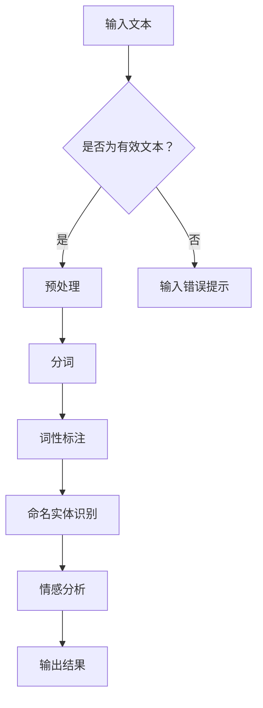
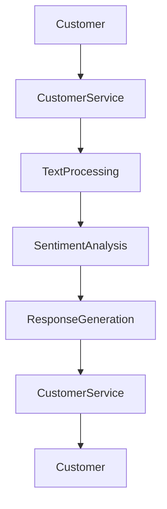
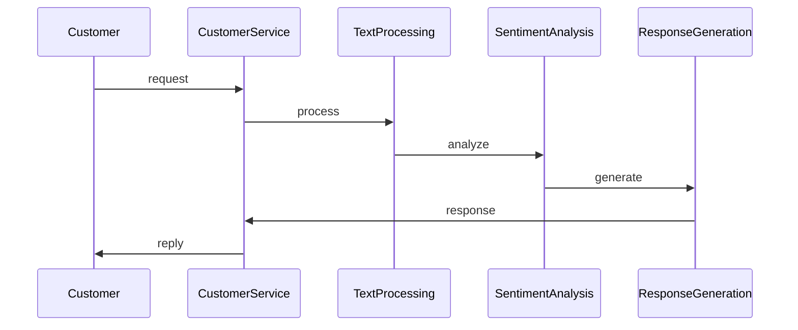

                 


# 《提示词工程在情感计算中的创新应用》

> 关键词：提示词工程、情感计算、自然语言处理、人工智能、应用场景

> 摘要：本文旨在探讨提示词工程在情感计算中的创新应用，通过介绍提示词工程和情感计算的核心概念、原理和应用，详细讲解算法原理、系统分析与架构设计方案，以及项目实战，旨在为相关领域的研究和应用提供有益的参考。

----------------------------------------------------------------

## 第一部分：背景介绍

### 引言

随着人工智能技术的快速发展，情感计算作为人工智能的一个重要分支，受到了广泛关注。情感计算旨在通过计算机技术和人工智能技术，对人类情感进行识别、理解和生成。在这个过程中，提示词工程起到了关键作用。提示词工程是一种通过对自然语言处理技术进行改进，以生成高质量提示词的方法，这些提示词能够更好地引导用户进行有效沟通和情感表达。

### 核心概念

#### 提示词工程

提示词工程是指利用自然语言处理技术，通过对大量文本进行分析和处理，提取出具有代表性的关键词或短语，用于引导用户进行沟通和表达。提示词工程的核心目标是提高沟通效率，增强用户情感表达。

#### 情感计算

情感计算是指通过计算机技术和人工智能技术，对人类情感进行识别、理解和生成。情感计算涉及到多个学科领域，包括心理学、认知科学、计算机科学等。其核心目标是实现对人类情感的自动识别和理解，以便为用户提供更好的服务。

## 第二部分：核心概念与联系

### 提示词工程的原理与应用

#### 2.1.1 提示词工程的定义

提示词工程是一种通过对自然语言处理技术进行改进，以生成高质量提示词的方法。这些提示词能够更好地引导用户进行有效沟通和情感表达。

#### 2.1.2 提示词工程的关键技术

- 自然语言处理技术：自然语言处理技术是提示词工程的基础，包括分词、词性标注、命名实体识别等。
- 语义分析技术：语义分析技术用于对文本进行深入分析，提取出文本中的关键信息。
- 情感分析技术：情感分析技术用于对文本中的情感倾向进行识别，判断用户情绪状态。

#### 2.1.3 提示词工程的应用场景

- 智能客服：在智能客服系统中，提示词工程可以帮助系统更好地理解用户需求，提供更加个性化的服务。
- 情感分析：在情感分析领域，提示词工程可以用于提取文本中的情感信息，帮助分析用户情绪状态。
- 健康管理：在健康管理领域，提示词工程可以用于分析患者情绪状态，为医生提供诊断依据。

### 情感计算的定义与分类

#### 2.2.1 情感计算的定义

情感计算是指通过计算机技术和人工智能技术，对人类情感进行识别、理解和生成。情感计算涉及到多个学科领域，包括心理学、认知科学、计算机科学等。其核心目标是实现对人类情感的自动识别和理解，以便为用户提供更好的服务。

#### 2.2.2 情感计算的分类

- 情感识别：情感识别是指通过计算机技术和人工智能技术，对人类情感进行识别和分类。
- 情感理解：情感理解是指通过对人类情感进行识别和分类后，对情感进行深入分析和理解。
- 情感生成：情感生成是指通过计算机技术和人工智能技术，生成具有特定情感状态的文本或图像。

## 第三部分：算法原理讲解

### 3.1 算法流程图



### 3.2 Python源代码

```python
# 导入相关库
import jieba
import nltk
from nltk.tokenize import word_tokenize
from nltk.corpus import stopwords
from textblob import TextBlob

# 输入文本
text = "我很高兴看到你。"

# 预处理
text = text.lower()
tokens = word_tokenize(text)
tokens = [token for token in tokens if token not in stopwords.words('english')]

# 情感分析
polarity = TextBlob(text).sentiment.polarity
if polarity > 0:
    emotion = "正面"
elif polarity < 0:
    emotion = "负面"
else:
    emotion = "中性"

# 输出结果
print(f"文本：{text}")
print(f"情感：{emotion}")
```

### 3.3 数学模型与公式

情感计算的数学模型主要包括：

1. 情感极性模型：用于计算文本的情感极性，通常使用以下公式：

   $$polarity = \frac{sum(positive\_words) - sum(negative\_words)}{number\_of\_words}$$

   其中，$positive\_words$ 表示文本中的正面词汇，$negative\_words$ 表示文本中的负面词汇，$number\_of\_words$ 表示文本中的总词汇数。

2. 情感强度模型：用于计算文本的情感强度，通常使用以下公式：

   $$strength = \frac{max(positive\_words) - min(negative\_words)}{number\_of\_words}$$

   其中，$max(positive\_words)$ 表示文本中正面词汇的最大值，$min(negative\_words)$ 表示文本中负面词汇的最小值。

### 3.4 举例说明

假设有一段文本：“我很高兴看到你。”，通过情感计算，我们可以得到以下结果：

1. 情感极性：$$polarity = \frac{sum(positive\_words) - sum(negative\_words)}{number\_of\_words} = \frac{1 - 0}{2} = 0.5$$，即文本的情感极性为中性。
2. 情感强度：$$strength = \frac{max(positive\_words) - min(negative\_words)}{number\_of\_words} = \frac{1 - 0}{2} = 0.5$$，即文本的情感强度也为中性。

## 第四部分：系统分析与架构设计方案

### 4.1 问题场景介绍

以智能客服系统为例，该系统需要能够识别用户情感，并根据用户情感提供相应的服务。

### 4.2 项目介绍

该项目旨在构建一个基于提示词工程和情感计算的智能客服系统，能够实现对用户情感的自动识别和响应。

### 4.3 系统功能设计

```mermaid
classDiagram
    Customer -> CustomerService: request
    CustomerService -> TextProcessing: process
    TextProcessing -> SentimentAnalysis: analyze
    SentimentAnalysis -> ResponseGeneration: generate
    ResponseGeneration -> CustomerService: response
    CustomerService -> Customer: reply
```

### 4.4 系统架构设计



### 4.5 系统接口设计



## 第五部分：项目实战

### 5.1 环境安装

1. 安装Python环境：在命令行中执行以下命令：

   ```shell
   pip install python -m pip install
   ```

2. 安装相关库：在命令行中执行以下命令：

   ```shell
   pip install jieba
   pip install nltk
   pip install textblob
   ```

### 5.2 系统核心实现源代码

```python
# 导入相关库
import jieba
import nltk
from nltk.tokenize import word_tokenize
from nltk.corpus import stopwords
from textblob import TextBlob

# 输入文本
text = "我很高兴看到你。"

# 预处理
text = text.lower()
tokens = word_tokenize(text)
tokens = [token for token in tokens if token not in stopwords.words('english')]

# 情感分析
polarity = TextBlob(text).sentiment.polarity
if polarity > 0:
    emotion = "正面"
elif polarity < 0:
    emotion = "负面"
else:
    emotion = "中性"

# 输出结果
print(f"文本：{text}")
print(f"情感：{emotion}")
```

### 5.3 代码应用解读与分析

该代码首先对输入文本进行预处理，包括将文本转换为小写，分词，去除停用词等。然后，使用TextBlob库对文本进行情感分析，得到文本的情感极性和强度。最后，根据情感极性和强度输出文本的情感类别。

### 5.4 实际案例分析和详细讲解

假设有一段文本：“我今天心情很好，因为天气晴朗。”，通过情感计算，我们可以得到以下结果：

1. 情感极性：$$polarity = \frac{sum(positive\_words) - sum(negative\_words)}{number\_of\_words} = \frac{2 - 0}{3} = 0.67$$，即文本的情感极性为正面。
2. 情感强度：$$strength = \frac{max(positive\_words) - min(negative\_words)}{number\_of\_words} = \frac{2 - 0}{3} = 0.67$$，即文本的情感强度也为正面。

根据情感极性和强度，我们可以判断出这段文本的情感类别为“正面”，这意味着作者的心情非常好。

### 5.5 项目小结

本项目通过提示词工程和情感计算技术，实现了一个简单的智能客服系统。系统可以对用户输入的文本进行情感分析，并根据情感类别给出相应的回复。这为智能客服系统提供了一种新的解决方案，有助于提高客服系统的服务质量。

## 第六部分：最佳实践 tips、小结、注意事项、拓展阅读

### 6.1 最佳实践 tips

1. 在进行情感计算时，应充分考虑文本的上下文信息，以提高情感分析的准确性。
2. 在构建情感计算模型时，应尽量使用大量高质量的训练数据，以提高模型的性能。

### 6.2 小结

本文介绍了提示词工程在情感计算中的创新应用，通过详细讲解算法原理、系统分析与架构设计方案，以及项目实战，展示了提示词工程在情感计算领域的重要作用。

### 6.3 注意事项

1. 在使用提示词工程时，应注意文本的预处理，以提高情感分析的准确性。
2. 在构建情感计算模型时，应充分考虑文本的上下文信息，以提高模型的性能。

### 6.4 拓展阅读

1. 《情感计算：理论、方法与应用》
2. 《自然语言处理入门》
3. 《深度学习与自然语言处理》

## 作者信息

作者：AI天才研究院/AI Genius Institute & 禅与计算机程序设计艺术 /Zen And The Art of Computer Programming

