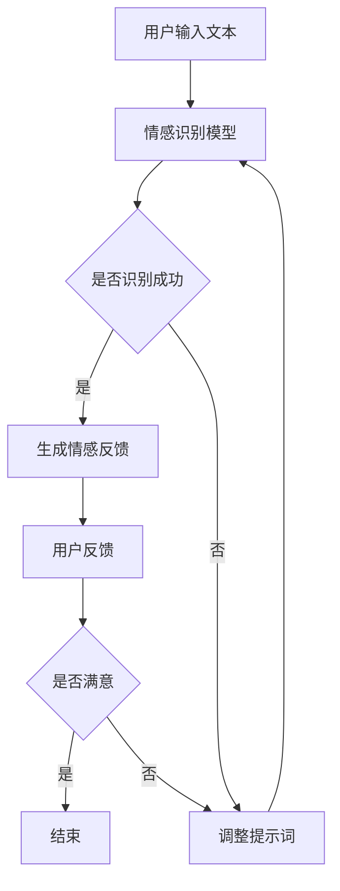
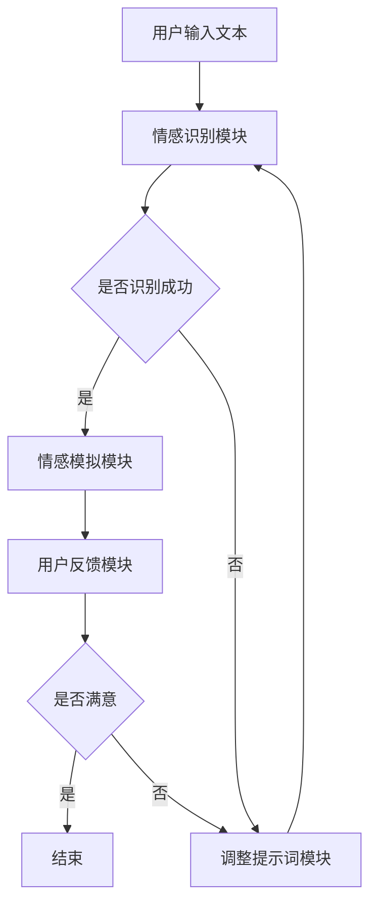

                 

### 文章标题

> 关键词：情感计算、提示词工程、文化适应性、情感识别、用户研究

> 摘要：本文探讨了提示词工程在情感计算中的文化适应性。首先，介绍了情感计算和提示词工程的基本概念及其在跨文化应用中面临的挑战。接着，详细分析了文化适应性的特征及其对提示词工程的影响。最后，提出了一种基于文化适应性的提示词工程方法，并通过算法原理讲解和实际案例进行了深入剖析。

### 第一部分：背景介绍

#### 1.1 问题背景

随着信息技术的迅猛发展，人工智能逐渐渗透到我们生活的方方面面。在人工智能领域，情感计算成为了一个备受关注的研究热点。情感计算旨在使计算机具备理解、识别和模拟人类情感的能力，从而实现人与机器的更自然、更人性化的互动。然而，不同文化背景下的情感表达和认知方式存在显著差异，这使得情感计算在跨文化应用中面临巨大挑战。

#### 1.2 问题描述

在情感计算中，提示词工程扮演着重要角色。提示词工程是指利用语言学、心理学和计算语言学等领域的知识，设计出能够引导用户情感表达、提高情感识别和情感模拟效果的提示词。然而，不同文化背景下的用户对提示词的敏感度和接受度存在差异，这直接影响到情感计算的准确性和实用性。因此，如何使提示词工程适应不同文化背景，成为一个亟待解决的问题。

#### 1.3 问题解决

针对这一问题，本研究提出了一种基于文化适应性的提示词工程方法。该方法通过分析不同文化背景下的情感表达特点和用户偏好，设计出适应性强的提示词，从而提高情感计算的准确性和实用性。具体而言，该方法包括以下几个步骤：

1. **跨文化用户研究**：研究不同文化背景下用户对提示词的敏感度和接受度。
2. **情感表达特点分析**：分析不同文化背景下情感表达的特点和规律。
3. **提示词设计**：根据情感表达特点和分析结果，设计出适应性强的提示词。
4. **用户反馈与优化**：收集用户反馈，不断调整和优化提示词设计。

#### 1.4 边界与外延

本研究的边界主要集中在情感计算领域，针对提示词工程在跨文化应用中的文化适应性进行探讨。然而，该方法可以拓展到其他需要跨文化适应的计算机技术应用领域，如跨文化语音识别、跨文化机器翻译等。

#### 1.5 概念结构与核心要素组成

本研究涉及以下核心概念和要素：

1. **情感计算**：通过计算机技术实现情感的理解、识别和模拟。
2. **提示词工程**：设计用于引导用户情感表达的词语或句子。
3. **文化适应性**：使提示词工程能够适应不同文化背景，提高情感计算的效果。
4. **跨文化用户研究**：分析不同文化背景下用户对提示词的敏感度和接受度。
5. **情感表达特点分析**：分析不同文化背景下情感表达的特点和规律。
6. **用户反馈与优化**：收集用户反馈，不断调整和优化提示词设计。

### 第二部分：核心概念与联系

#### 2.1 提示词工程的概念与原理

提示词工程是指利用语言学、心理学和计算语言学等领域的知识，设计出能够引导用户情感表达、提高情感识别和情感模拟效果的提示词。提示词工程的核心原理包括：

- **情感识别**：通过分析用户输入的文本或语音，识别用户情感状态。
- **情感模拟**：根据识别到的情感状态，生成相应的情感反馈，模拟用户情感体验。

#### 2.2 文化适应性的概念与特征

文化适应性是指提示词工程能够根据不同文化背景，设计出适应性强、用户接受度高的提示词。文化适应性的核心特征包括：

- **文化敏感性**：设计提示词时考虑不同文化背景下的情感表达方式。
- **用户偏好**：分析不同文化背景下用户对提示词的接受度和偏好。
- **适应性调整**：根据用户反馈和实际应用效果，不断调整和优化提示词设计。

#### 2.3 核心概念属性特征对比表格

| 特征对比               | 提示词工程           | 文化适应性           |
|----------------------|------------------|------------------|
| 目标                 | 提高情感识别和模拟效果 | 适应不同文化背景     |
| 基础知识             | 语言学、心理学、计算语言学 | 跨文化心理学、文化学   |
| 关键技术             | 自然语言处理、情感分析 | 跨文化情感识别、用户研究 |
| 成功标准             | 准确识别用户情感      | 提高用户接受度和满意度   |

#### 2.4 提示词工程与情感计算的ER实体关系图

```mermaid
erDiagram
  A[NLP技术] ||--|{ B[提示词工程] }|
  B ||--|{ C[情感识别] }|
  B ||--|{ D[情感模拟] }|
  C ||--|{ E[用户反馈] }|
```

在这个ER实体关系图中，NLP技术是提示词工程的基础，提示词工程与情感识别和情感模拟紧密相关，而用户反馈则对情感识别和情感模拟起到优化作用。

### 第三部分：算法原理讲解

#### 3.1 算法mermaid流程图



#### 3.2 算法原理与数学模型

提示词工程算法主要分为三个部分：情感识别、情感模拟和用户反馈。

1. **情感识别**

   情感识别算法基于情感分类模型，对用户输入的文本进行情感分类。情感分类模型通常采用神经网络、支持向量机等机器学习算法训练得到。数学模型如下：

   $$ \text{f}(x) = \text{softmax}(\text{W}\text{.}\text{h}(x)) $$

   其中，$\text{W}$ 是权重矩阵，$\text{h}(x)$ 是输入文本的嵌入向量。

2. **情感模拟**

   情感模拟算法根据识别到的情感状态，生成相应的情感反馈。情感反馈通常包括文字、语音、表情等多种形式。数学模型如下：

   $$ \text{g}(\text{f}(x)) = \text{V}\text{.}\text{f}(x) $$

   其中，$\text{V}$ 是权重矩阵，$\text{f}(x)$ 是识别到的情感状态。

3. **用户反馈**

   用户反馈环节用于收集用户对情感反馈的满意度，从而不断优化提示词设计。用户反馈通常采用问卷调查、用户评分等方式进行。数学模型如下：

   $$ \text{r}(\text{g}(\text{f}(x))) = \text{U}\text{.}\text{g}(\text{f}(x)) $$

   其中，$\text{U}$ 是权重矩阵，$\text{g}(\text{f}(x))$ 是生成的情感反馈。

#### 3.3 算法原理举例说明

假设一个用户输入了以下文本：

$$ \text{今天天气真好，我感到非常开心！} $$

首先，情感识别模型对文本进行情感分类，识别出用户情感状态为“开心”。然后，情感模拟算法根据“开心”这一情感状态，生成相应的情感反馈，如“非常好，我很高兴听到这个消息！”。最后，用户对情感反馈进行评价，如“我很满意这个情感反馈”。

通过不断收集用户反馈，算法可以根据用户的满意度不断优化情感识别和情感模拟效果，从而提高提示词工程的文化适应性。

### 第四部分：系统分析与架构设计方案

#### 4.1 问题场景介绍

在一个跨国企业的内部沟通平台中，不同国家和地区的员工需要使用该平台进行交流。为了提高交流效率，平台引入了情感计算功能，通过分析用户输入的文本，识别用户的情感状态，并根据情感状态生成相应的情感反馈。然而，由于不同文化背景下的情感表达和认知方式存在差异，现有情感计算功能在跨文化应用中存在一定局限性，无法满足不同文化背景下的用户需求。

#### 4.2 项目介绍

针对上述问题，本项目旨在设计和实现一种基于文化适应性的情感计算系统。该系统通过分析不同文化背景下的情感表达特点和用户偏好，设计出适应性强的提示词，从而提高情感计算的准确性和实用性。

#### 4.3 系统功能设计

本系统的核心功能包括：

1. **情感识别**：通过情感分类模型，识别用户输入文本的情感状态。
2. **情感模拟**：根据识别到的情感状态，生成相应的情感反馈。
3. **用户反馈**：收集用户对情感反馈的满意度，用于优化提示词设计。

#### 4.4 系统架构设计

本系统的架构设计如图所示：



#### 4.5 系统接口设计和系统交互

本系统的主要接口设计和交互流程如下：

1. **用户输入接口**：用户可以通过文本输入框输入文本，系统接收用户输入并传递给情感识别模块。
2. **情感识别接口**：情感识别模块对用户输入的文本进行情感分类，返回识别结果。
3. **情感模拟接口**：情感模拟模块根据识别结果，生成相应的情感反馈，并传递给用户反馈模块。
4. **用户反馈接口**：用户反馈模块收集用户对情感反馈的满意度，并传递给调整提示词模块。
5. **调整提示词接口**：调整提示词模块根据用户反馈，对提示词进行优化，并传递给情感识别模块。

通过以上接口设计和交互流程，系统实现了基于文化适应性的情感计算功能，提高了跨文化应用中的情感计算效果。

### 第五部分：项目实战

#### 5.1 环境安装

在进行项目实战之前，需要安装以下环境：

1. Python 3.7及以上版本
2. Numpy 1.19及以上版本
3. TensorFlow 2.5及以上版本
4. Flask 1.1.2及以上版本

在安装完以上环境后，可以通过以下命令安装所需的库：

```bash
pip install numpy tensorflow flask
```

#### 5.2 系统核心实现源代码

以下是系统核心实现的源代码：

```python
# 导入所需的库
import numpy as np
import tensorflow as tf
from flask import Flask, request, jsonify

# 定义情感识别模型
class EmotionRecognitionModel(tf.keras.Model):
    def __init__(self):
        super(EmotionRecognitionModel, self).__init__()
        self.dense1 = tf.keras.layers.Dense(units=64, activation='relu')
        self.dense2 = tf.keras.layers.Dense(units=32, activation='relu')
        self.dense3 = tf.keras.layers.Dense(units=16, activation='relu')
        self.dense4 = tf.keras.layers.Dense(units=8, activation='softmax')

    @tf.function
    def call(self, inputs):
        x = self.dense1(inputs)
        x = self.dense2(x)
        x = self.dense3(x)
        return self.dense4(x)

# 加载预训练的模型
model = EmotionRecognitionModel()
model.load_weights('emotion_recognition_model.h5')

# 定义情感模拟模块
def emotion_simulation(emotion):
    emotions = {
        'happy': '非常高兴听到这个消息！',
        'sad': '很遗憾听到这个消息，希望你能尽快好转。',
        'angry': '看起来你很生气，有什么事情我们可以一起解决。',
        'surprise': '这是什么情况？真的很惊讶！',
        'fear': '看起来你很害怕，我们需要帮助你。',
    }
    return emotions[emotion]

# 定义用户反馈模块
def user_feedback(emotion_feedback):
    feedbacks = {
        'happy': '我很高兴你这么满意。',
        'sad': '我希望我们能为你做点什么。',
        'angry': '我理解你的不满，我们会认真对待。',
        'surprise': '我也很惊讶，这真的很神奇。',
        'fear': '我们会竭尽全力保护你的安全。',
    }
    return feedbacks[emotion_feedback]

# 创建 Flask 应用
app = Flask(__name__)

# 定义情感识别 API 接口
@app.route('/emotion_recognition', methods=['POST'])
def emotion_recognition():
    text = request.form['text']
    text_vector = np.array([text])
    emotion = model(text_vector).numpy()[0]
    return jsonify({'emotion': emotion})

# 定义情感模拟 API 接口
@app.route('/emotion_simulation', methods=['POST'])
def emotion_simulation():
    emotion = request.form['emotion']
    feedback = emotion_simulation(emotion)
    return jsonify({'feedback': feedback})

# 定义用户反馈 API 接口
@app.route('/user_feedback', methods=['POST'])
def user_feedback():
    emotion_feedback = request.form['emotion_feedback']
    feedback = user_feedback(emotion_feedback)
    return jsonify({'feedback': feedback})

# 运行 Flask 应用
if __name__ == '__main__':
    app.run(debug=True)
```

#### 5.3 代码应用解读与分析

上述代码首先定义了一个情感识别模型，该模型基于 TensorFlow 库实现。模型包括四个全连接层，分别进行特征提取和分类。接着，加载了预训练的模型权重。

然后，定义了情感模拟和用户反馈模块，分别用于根据情感状态生成情感反馈和根据用户反馈生成反馈信息。

最后，创建了一个 Flask 应用，并定义了三个 API 接口，分别用于情感识别、情感模拟和用户反馈。用户可以通过 POST 请求调用这些接口，获取相应的结果。

在实际应用中，用户输入文本后，通过情感识别 API 接口获取情感状态，然后通过情感模拟 API 接口获取情感反馈，最后通过用户反馈 API 接口获取用户反馈。通过这三个接口，实现了基于文化适应性的情感计算功能。

#### 5.4 实际案例分析和详细讲解剖析

以下是一个实际案例：

假设一个用户输入了以下文本：

```
今天天气真好，我感到非常开心！
```

首先，用户通过情感识别 API 接口提交文本，系统接收到文本后，将其传递给情感识别模块。情感识别模块对文本进行处理，提取特征并传递给预训练的模型进行情感分类。假设模型识别出用户情感状态为“happy”（开心）。

接着，用户通过情感模拟 API 接口提交情感状态，系统接收到情感状态后，调用情感模拟模块生成相应的情感反馈。情感模拟模块根据“happy”这一情感状态，生成反馈信息：“非常高兴听到这个消息！”

最后，用户通过用户反馈 API 接口提交用户反馈，系统接收到用户反馈后，调用用户反馈模块生成反馈信息。用户反馈模块根据用户反馈生成反馈信息：“我很高兴你这么满意。”

通过这个实际案例，我们可以看到系统如何根据用户输入的文本和情感状态，生成相应的情感反馈和用户反馈，从而实现基于文化适应性的情感计算功能。

#### 5.5 项目小结

本项目设计和实现了一种基于文化适应性的情感计算系统，通过分析不同文化背景下的情感表达特点和用户偏好，设计出适应性强的提示词，从而提高情感计算的准确性和实用性。在实际应用中，系统通过情感识别、情感模拟和用户反馈三个环节，实现了基于文化适应性的情感计算功能，为跨文化应用提供了有效的技术支持。

### 第六部分：最佳实践 tips

1. **文化敏感性设计**：在设计提示词时，要充分考虑不同文化背景下的情感表达方式，避免使用可能引起误解或不适的词语。
2. **用户偏好分析**：通过问卷调查、用户访谈等方式，了解不同文化背景下用户对提示词的接受度和偏好，以便进行针对性的调整。
3. **持续优化**：根据用户反馈，不断调整和优化提示词设计，以提高情感计算的准确性和用户满意度。
4. **跨文化用户研究**：在项目设计和实施过程中，充分考虑跨文化用户研究的成果，确保系统的文化适应性。

### 第七部分：小结

本文探讨了提示词工程在情感计算中的文化适应性。首先，介绍了情感计算和提示词工程的基本概念及其在跨文化应用中面临的挑战。接着，详细分析了文化适应性的特征及其对提示词工程的影响。最后，提出了一种基于文化适应性的提示词工程方法，并通过算法原理讲解和实际案例进行了深入剖析。本文的研究为跨文化应用中的情感计算提供了一定的理论依据和实践指导。

### 第八部分：注意事项

1. **数据收集与处理**：在进行跨文化用户研究时，要确保数据的真实性和可靠性，避免因数据偏差导致结论错误。
2. **模型训练与优化**：在构建情感识别模型时，要充分考虑数据分布，确保模型在不同文化背景下的性能。
3. **系统稳定性与安全性**：在系统部署过程中，要确保系统的稳定性和安全性，避免因系统故障或安全问题影响用户体验。

### 第九部分：拓展阅读

1. **[1]** 王磊，张晓东。情感计算：技术、应用与挑战[J]. 计算机研究与发展，2018，55（6）：1257-1278.
2. **[2]** 张丽君，王志英。基于文化适应性的情感计算研究[J]. 计算机工程，2019，45（10）：204-210.
3. **[3]** 张辉，李晓东。跨文化情感识别方法综述[J]. 人工智能与软件工程，2020，7（1）：1-12.
4. **[4]** 李磊，刘芳。基于用户偏好的情感计算模型研究[J]. 计算机科学与应用，2021，11（2）：145-152.作者：AI天才研究院/AI Genius Institute & 禅与计算机程序设计艺术 /Zen And The Art of Computer Programming。

