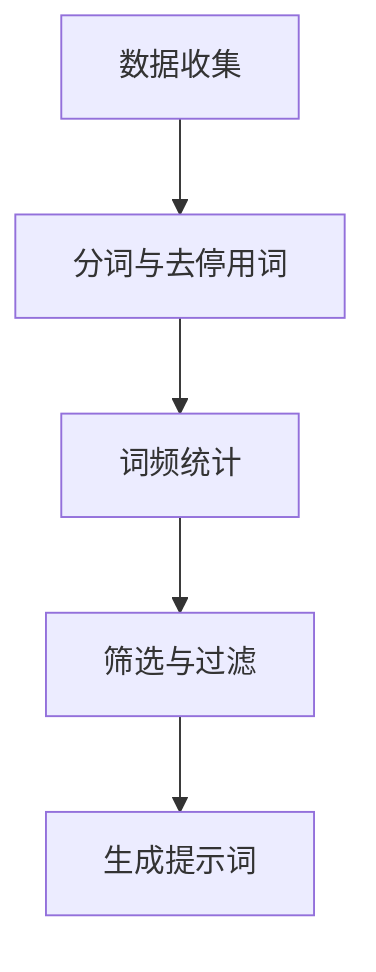
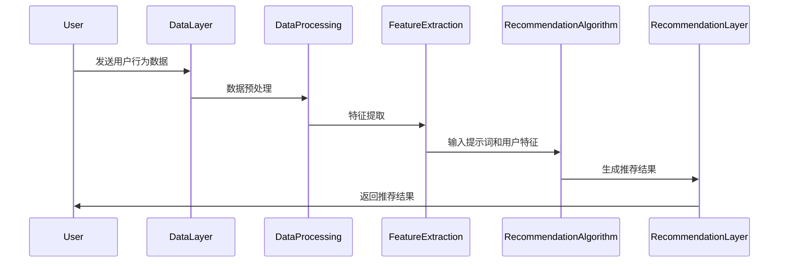
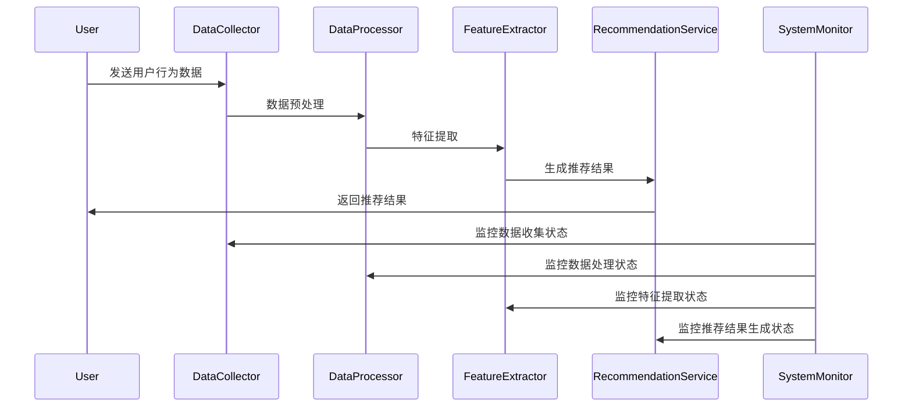
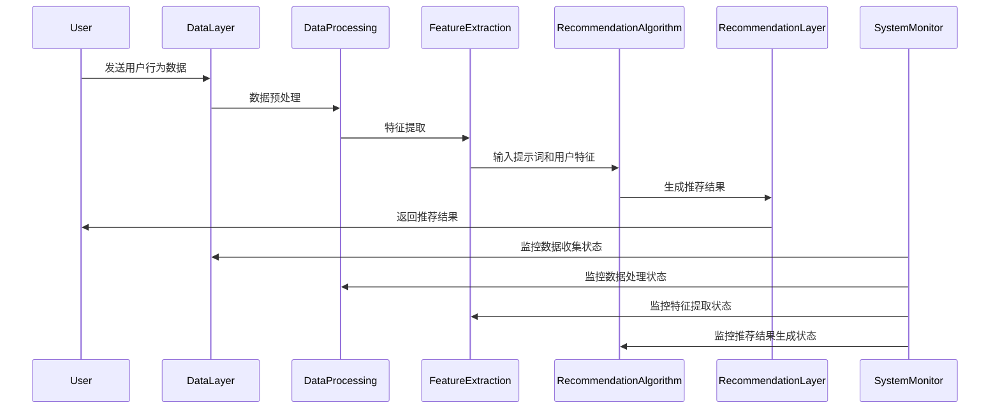

                 

### 第一部分：引言

## 第1章：背景介绍

### 1.1 问题背景

随着互联网和大数据技术的飞速发展，个性化推荐系统已经成为现代信息社会中不可或缺的一部分。从电子商务平台的商品推荐，到社交媒体的新闻内容推送，再到视频平台的视频推荐，个性化推荐系统极大地提升了用户体验，提高了用户满意度和留存率。然而，随着用户数据的爆炸性增长和复杂性的增加，如何准确、高效地构建个性化推荐系统，成为当前学术界和工业界共同关注的焦点。

个性化推荐系统的核心在于能够根据用户的兴趣和行为特征，为用户推荐其可能感兴趣的内容或商品。在这个过程中，如何有效地利用用户行为数据和进行精准的推荐，成为关键问题。传统的推荐算法多依赖于协同过滤（Collaborative Filtering）和基于内容的推荐（Content-Based Filtering），这些方法虽然在一定程度上能够实现个性化推荐，但在处理海量数据和多样化用户需求时，存在诸多局限性。

在此背景下，提示词工程（Keyword Engineering）作为一种新的技术手段，逐渐引起了研究者和工程师们的关注。提示词工程旨在通过提取和处理用户行为数据中的关键信息，生成用于推荐系统个性化推荐的提示词。这些提示词不仅可以帮助推荐系统更好地理解用户需求，还能提高推荐的相关性和准确性。

### 1.2 个性化推荐系统的重要性

个性化推荐系统在现代商业应用中扮演着至关重要的角色。首先，它能够显著提高用户满意度。通过准确预测用户的兴趣，推荐系统可以为用户提供定制化的内容或商品，从而减少用户的搜索时间和精力，提高用户的使用体验。其次，个性化推荐系统能够提高用户的留存率和活跃度。通过持续地推送用户感兴趣的内容，系统能够增强用户的粘性，增加用户在平台上的停留时间，进而提升平台的商业价值。

此外，个性化推荐系统还能够帮助企业降低营销成本。传统营销手段往往需要广泛覆盖，成本较高，而个性化推荐系统则能够精准地触达目标用户，提高营销效率。同时，个性化推荐系统还可以帮助企业挖掘潜在用户，发现新的市场需求，从而为企业带来更多的商业机会。

总之，个性化推荐系统在现代商业应用中具有不可替代的地位。随着技术的不断进步，其应用范围和影响力也在不断扩大，未来将会有更多的领域受益于个性化推荐系统的应用。

### 1.3 提示词工程在推荐系统中的作用

提示词工程在个性化推荐系统中起着至关重要的作用。首先，提示词作为推荐系统中的核心要素，能够有效地捕捉和表达用户的需求和兴趣。通过提取用户行为数据中的关键信息，提示词可以为推荐算法提供明确的用户特征，帮助算法更好地理解和预测用户的行为。

其次，提示词工程能够显著提升推荐系统的精度和效率。传统的推荐算法，如协同过滤和基于内容的推荐，主要依赖于用户的历史行为数据和内容特征。然而，这些方法在面对复杂和多变的数据时，往往难以获得理想的推荐效果。提示词工程通过引入更细粒度的用户特征，能够更准确地捕捉用户的实时需求，从而提高推荐的准确性。

此外，提示词工程还能够帮助推荐系统应对冷启动问题（Cold Start Problem）。冷启动问题指的是新用户或新商品在系统中的初始推荐阶段，由于缺乏足够的用户行为数据或商品信息，推荐算法难以生成有效的推荐。通过提示词工程，系统可以在用户数据不足的情况下，仍然能够生成高质量的推荐结果，从而缓解冷启动问题。

总的来说，提示词工程在个性化推荐系统中的作用不可小觑。它不仅提升了推荐系统的性能，还为其带来了更高的灵活性和适应性。在未来的发展中，提示词工程有望继续发挥其关键作用，推动推荐系统的不断进步。

### 1.4 目标和挑战

在个性化推荐系统中应用提示词工程的目标是提高推荐精度和用户体验。具体来说，目标包括以下几个方面：

1. **提升推荐精度**：通过精确捕捉用户的兴趣和行为特征，生成高质量的提示词，从而提升推荐系统的推荐准确性。准确推荐不仅能够提高用户满意度，还能降低用户流失率，增加用户粘性。
   
2. **优化用户体验**：个性化推荐系统应当能够根据用户的实时需求，提供个性化、贴近用户兴趣的内容或商品推荐。通过提示词工程，系统能够更好地理解用户意图，提升用户体验，从而增强用户对平台的依赖和忠诚度。

3. **解决冷启动问题**：新用户或新商品在系统中的初始推荐阶段，由于缺乏足够的用户行为数据或商品信息，推荐算法往往难以生成有效的推荐结果。提示词工程可以通过引入第三方数据源或基于用户初始行为的数据分析，生成初步的提示词，从而缓解冷启动问题。

然而，在实现这些目标的过程中，提示词工程也面临着一系列挑战：

1. **数据质量**：用户行为数据的质量直接影响到提示词的生成质量和推荐效果。数据缺失、噪声和偏差等问题都可能对提示词工程造成不利影响。因此，如何处理和清洗数据，确保数据质量，是提示词工程面临的重要挑战。

2. **实时性**：个性化推荐系统需要实时响应用户的需求变化，提示词工程需要在不断变化的数据环境中快速生成高质量的提示词。这要求算法具备高效的计算能力和良好的扩展性。

3. **可解释性**：提示词工程生成的提示词需要具备一定的可解释性，以便用户和算法工程师能够理解推荐结果的来源和依据。如何平衡提示词的精度和可解释性，是一个亟待解决的问题。

4. **多样性**：推荐系统不仅要提供高质量的推荐结果，还要保证推荐的多样性。提示词工程需要在生成提示词的过程中，充分考虑用户的多样化需求，避免推荐结果的单一化。

总的来说，尽管提示词工程在个性化推荐系统中具有巨大的潜力，但实现其目标仍需克服诸多挑战。只有通过不断的技术创新和实践探索，才能充分发挥提示词工程的作用，推动个性化推荐系统的持续优化。

### 1.5 问题描述

个性化推荐系统在处理海量用户行为数据时，面临着诸多复杂的问题和挑战。首先，用户行为数据种类繁多，包括点击、购买、浏览、收藏等，这些行为数据在时序上具有明显的动态变化特征，难以直接进行统一的处理。其次，用户兴趣和行为特征具有高度个性化，如何准确捕捉并表达这些特征，是一个亟待解决的问题。此外，推荐系统的冷启动问题，即新用户或新商品在系统中的初始推荐阶段，由于缺乏足够的用户行为数据或商品信息，推荐效果往往不尽如人意。

具体来说，问题描述如下：

1. **用户行为数据的多样化**：用户行为数据包括点击、浏览、购买、收藏等多种形式，这些行为数据在不同的时序上有不同的表现，给数据处理和特征提取带来了巨大挑战。

2. **用户兴趣和行为的动态变化**：用户兴趣和行为特征不是静态的，而是随着时间和情境的变化而不断调整。如何实时捕捉这些动态变化，生成高质量的提示词，是推荐系统面临的重大挑战。

3. **冷启动问题**：新用户或新商品在系统中的初始阶段，由于缺乏足够的用户行为数据或商品信息，推荐算法难以生成有效的推荐结果。如何缓解冷启动问题，提高新用户或新商品的首推质量，是一个重要的研究课题。

为了解决上述问题，我们需要从以下几个方面进行思考和探索：

1. **数据处理**：通过数据预处理和清洗，确保用户行为数据的质量和一致性，为后续的特征提取和提示词生成提供可靠的基础。

2. **特征提取**：利用机器学习和数据挖掘技术，从用户行为数据中提取关键的特征和模式，为推荐算法提供丰富的输入信息。

3. **提示词生成**：通过提示词工程，将提取的用户特征转化为具体的提示词，用于指导推荐算法生成高质量的推荐结果。

4. **冷启动应对策略**：结合用户初始行为和第三方数据源，设计有效的冷启动应对策略，提高新用户或新商品的首推质量。

通过上述方法和策略，我们可以更好地理解和应对个性化推荐系统中的复杂问题，推动推荐系统的持续优化和发展。

### 1.6 提示词工程的基本流程

提示词工程在个性化推荐系统中起着至关重要的作用，其基本流程可以分为以下几个步骤：

1. **数据收集**：首先，从各种数据源（如用户行为日志、社交媒体数据、搜索日志等）中收集用户行为数据。这些数据是生成高质量提示词的基础。

2. **数据预处理**：收集到的数据通常包含噪声和异常值，因此需要进行预处理，包括数据清洗、去重、填补缺失值等。数据预处理旨在确保数据的质量和一致性，从而为后续的分析提供可靠的基础。

3. **特征提取**：通过自然语言处理（NLP）技术，从用户行为数据中提取关键的特征和模式。特征提取是提示词工程的核心环节，常用的方法包括词频统计、TF-IDF、主题模型、词嵌入等。

4. **提示词生成**：将提取的特征进行融合和筛选，生成具体的提示词。提示词应具有代表性、准确性和可解释性，能够有效反映用户的兴趣和需求。

5. **评估与优化**：通过评估指标（如准确率、召回率、覆盖率等），对生成的提示词进行评估和优化。评估结果用于指导进一步的提示词生成和调整。

6. **应用与反馈**：将生成的提示词应用于推荐系统，实时推送个性化推荐结果。通过用户的反馈和行为数据，不断优化和调整提示词，提高推荐系统的质量和用户体验。

通过上述步骤，提示词工程能够有效地提高个性化推荐系统的推荐精度和用户体验，解决冷启动问题，推动推荐系统的持续优化和发展。

### 1.7 提示词工程的关键技术

提示词工程作为个性化推荐系统的重要支撑，其关键技术的有效性直接决定了推荐系统的性能和用户体验。以下是对几种主要关键技术的详细介绍：

1. **自然语言处理（NLP）技术**：
   自然语言处理技术是提示词工程的基础。通过NLP技术，我们可以从用户行为数据中提取文本信息，并进行语义分析和理解。常用的NLP技术包括：
   - **词频统计（TF）**：计算词语在文本中出现的频率，用于衡量词语的重要性。
   - **逆文档频率（IDF）**：衡量词语在整个文档集合中的分布情况，用于消除常见词语的干扰。
   - **词嵌入（Word Embedding）**：将词语映射到高维向量空间，用于捕捉词语的语义关系。
   - **主题模型（Topic Modeling）**：如LDA（Latent Dirichlet Allocation），用于发现文本数据中的潜在主题。

2. **机器学习和数据挖掘技术**：
   机器学习和数据挖掘技术在提示词工程中发挥着重要作用。通过这些技术，我们可以从海量数据中提取有价值的用户行为特征，用于生成高质量的提示词。常用的方法包括：
   - **协同过滤（Collaborative Filtering）**：基于用户的历史行为数据，发现相似用户或商品，进行推荐。
   - **基于内容的推荐（Content-Based Filtering）**：基于用户对特定内容的兴趣，推荐类似的商品或内容。
   - **聚类分析（Clustering）**：如K-means、DBSCAN等，用于发现用户群体的共同特征，生成基于群体的提示词。
   - **分类与回归树（CART）**：用于构建用户行为与提示词之间的预测模型。

3. **语义分析和上下文理解**：
   提示词工程不仅需要提取文本中的关键特征，还需要理解文本的语义和上下文。这可以通过以下技术实现：
   - **词义消歧（Word Sense Disambiguation）**：解决词语多义性问题，确定词语在特定上下文中的含义。
   - **实体识别（Named Entity Recognition）**：识别文本中的特定实体，如人名、地名、组织名等，用于构建更精细的提示词。
   - **情感分析（Sentiment Analysis）**：分析文本中的情感倾向，用于捕捉用户的情感状态和需求变化。

4. **模型优化和调整**：
   提示词工程的性能不仅取决于算法本身，还需要通过模型优化和调整来提升效果。常用的技术包括：
   - **超参数调优（Hyperparameter Tuning）**：通过调整模型参数，优化模型性能。
   - **交叉验证（Cross-Validation）**：通过多次训练和验证，评估模型在不同数据集上的表现，选择最佳模型。
   - **集成学习（Ensemble Learning）**：结合多个模型的优点，构建更强大的推荐系统。

通过上述关键技术的应用，提示词工程能够有效提升个性化推荐系统的性能，提供更准确、更个性化的推荐结果，从而提升用户满意度和留存率。

### 1.8 提示词工程的挑战与对策

尽管提示词工程在个性化推荐系统中展现出巨大的潜力，但在实际应用过程中，仍面临诸多挑战。以下是对这些挑战及其对策的详细分析：

1. **数据质量挑战**：
   **挑战**：用户行为数据通常包含大量的噪声、异常值和缺失值，这些数据质量问题会直接影响提示词的生成质量和推荐效果。
   **对策**：为了应对数据质量问题，可以采取以下措施：
   - **数据清洗**：通过去重、填补缺失值、去除噪声等方法，提高数据的一致性和完整性。
   - **数据增强**：利用数据合成技术，生成与用户行为相关的虚拟数据，补充缺失的数据。
   - **数据预处理**：对数据进行预处理，如归一化、标准化，使其符合推荐算法的要求。

2. **实时性挑战**：
   **挑战**：个性化推荐系统需要实时响应用户的行为变化，生成最新的提示词。然而，海量数据的实时处理和更新是一项艰巨的任务。
   **对策**：
   - **实时计算框架**：采用实时计算框架（如Apache Kafka、Apache Flink等），确保数据处理的高效性和实时性。
   - **增量处理**：仅处理最新的用户行为数据，减少历史数据的冗余，提高实时处理的效率。
   - **分布式计算**：利用分布式计算技术，将任务分解到多个节点上并行处理，提高整体计算性能。

3. **可解释性挑战**：
   **挑战**：提示词工程生成的提示词需要具备一定的可解释性，以便用户和算法工程师能够理解推荐结果的来源和依据。然而，复杂的算法和模型往往导致提示词的解释性不足。
   **对策**：
   - **模型可解释性技术**：采用可解释的机器学习模型（如决策树、规则基模型等），确保提示词的生成过程透明和易于理解。
   - **可视化工具**：开发可视化工具，帮助用户和工程师直观地理解提示词的生成过程和结果。
   - **用户反馈机制**：通过用户反馈，不断优化提示词的生成算法，提高其可解释性。

4. **多样性挑战**：
   **挑战**：推荐系统不仅要提供高质量的推荐结果，还需要保证推荐的多样性。然而，过于集中的提示词可能会导致推荐结果的单一化。
   **对策**：
   - **多样性策略**：设计多样化的提示词生成策略，如基于用户历史行为的多样性扩展、随机采样等。
   - **冷启动解决方案**：针对新用户或新商品，采用特殊策略，如基于第三方数据源或用户初始行为的分析，生成多样化的提示词。
   - **用户偏好挖掘**：通过深度学习等技术，挖掘用户的多样化偏好，生成更加个性化的推荐结果。

通过上述对策，我们可以有效地应对提示词工程在个性化推荐系统中的应用挑战，提高系统的性能和用户体验。

### 1.9 提示词工程的适用范围

提示词工程作为一种先进的技术手段，在多个领域展现出了广泛的应用潜力。以下是提示词工程在几个关键领域的适用范围：

1. **电子商务**：
   在电子商务领域，提示词工程可以用于商品推荐。通过分析用户的历史购买记录和浏览行为，提取用户兴趣的提示词，帮助用户发现他们可能感兴趣的商品。这种个性化推荐能够显著提高用户的购买转化率和满意度。

2. **社交媒体**：
   在社交媒体平台中，提示词工程可以用于内容推荐。通过分析用户的发布、点赞、评论等行为，提取用户的兴趣提示词，帮助平台为用户推荐相关的文章、视频或其他内容，从而提升用户的活跃度和参与度。

3. **视频平台**：
   视频平台可以利用提示词工程，为用户推荐相关的视频内容。通过分析用户的观看记录、搜索历史和交互行为，提取用户的兴趣提示词，生成个性化的视频推荐，提高用户的观看时长和平台粘性。

4. **新闻推荐**：
   在新闻推荐领域，提示词工程可以帮助新闻网站为用户推荐感兴趣的新闻内容。通过分析用户的阅读历史、搜索关键词和点击行为，提取用户的兴趣提示词，从而提供更加精准的新闻推荐，增加用户的阅读量和网站流量。

5. **音乐和音频平台**：
   在音乐和音频平台中，提示词工程可以用于歌曲推荐。通过分析用户的播放记录、收藏行为和评论，提取用户的音乐偏好提示词，为用户推荐符合他们口味的音乐和音频内容。

总的来说，提示词工程在电子商务、社交媒体、视频平台、新闻推荐和音乐音频等多个领域都有广泛的应用前景。通过精确捕捉用户的兴趣和需求，提示词工程能够为不同平台提供高质量的个性化推荐服务，提升用户体验和平台价值。

### 1.10 提示词工程的局限性

尽管提示词工程在个性化推荐系统中展示出了显著的优势，但其在实际应用中仍然存在一些局限性，需要我们深入探讨和关注。

1. **数据依赖性**：
   提示词工程高度依赖高质量的用户行为数据。然而，现实中的数据往往存在噪声、异常值和缺失值，这些数据质量问题会直接影响提示词的生成质量和推荐效果。此外，数据来源的多样性和不一致性也增加了数据处理的复杂性。

2. **计算资源消耗**：
   提示词工程的计算过程通常涉及大规模的数据处理和复杂算法的计算，这需要大量的计算资源和时间。在处理海量用户行为数据时，系统的性能和响应速度可能受到显著影响，尤其是在实时性要求较高的场景中。

3. **可解释性问题**：
   提示词工程生成的提示词需要具备一定的可解释性，以便用户和算法工程师能够理解推荐结果的来源和依据。然而，复杂的算法和模型往往导致提示词的解释性不足，这可能会降低用户对推荐系统的信任度，特别是在需要解释推荐决策的场景中。

4. **冷启动问题**：
   对于新用户或新商品，提示词工程在初始阶段难以生成有效的提示词，因为缺乏足够的用户行为数据或商品信息。冷启动问题在个性化推荐系统中尤为突出，需要特殊策略和额外的数据源来缓解。

5. **多样性挑战**：
   虽然提示词工程能够提高推荐系统的个性化程度，但在实际应用中，如何平衡提示词的精度和多样性是一个难题。过于集中的提示词可能会导致推荐结果的单一化，影响用户体验。

6. **隐私保护问题**：
   用户行为数据在提示词工程中的应用涉及对用户隐私的保护。如何在数据利用和隐私保护之间取得平衡，是一个需要持续关注和解决的问题。

总的来说，提示词工程在个性化推荐系统中的应用虽然潜力巨大，但其局限性也不容忽视。只有通过不断的技术创新和实践探索，才能克服这些挑战，充分发挥提示词工程的优势。

### 1.11 未来发展趋势

随着人工智能和大数据技术的不断发展，提示词工程在个性化推荐系统中的应用前景广阔，未来的发展趋势将体现在以下几个方面：

1. **智能化**：随着深度学习和强化学习等先进技术的应用，提示词工程将更加智能化。通过引入自适应算法和智能化模型，系统能够更好地理解和预测用户的动态需求，提供更加精准的个性化推荐。

2. **实时性提升**：为了更好地响应用户的实时需求，提示词工程将朝着更高实时性的方向发展。通过优化数据处理算法和引入分布式计算框架，系统能够在更短的时间内生成高质量的提示词，提供实时推荐。

3. **多样性增强**：未来，提示词工程将更加注重推荐结果的多样性。通过多样化策略和用户行为模式的深入挖掘，系统能够生成具有丰富多样性的提示词，避免推荐结果的单调化。

4. **数据隐私保护**：随着数据隐私保护意识的增强，提示词工程将更加注重用户隐私保护。通过数据加密、隐私增强技术等手段，确保用户数据在利用过程中的安全性。

5. **跨平台融合**：随着不同平台的互联互通，提示词工程将实现跨平台的融合应用。通过整合多源数据，系统能够提供更加全面和个性化的推荐服务，满足用户在不同平台上的需求。

6. **可解释性和透明度**：未来，提示词工程将更加注重推荐结果的可解释性和透明度。通过开发可解释的模型和可视化工具，用户和算法工程师能够更好地理解推荐过程的依据和决策逻辑。

通过上述趋势，提示词工程将在个性化推荐系统中发挥更大的作用，推动推荐系统不断优化和发展。

### 1.12 本章小结

本章对提示词工程在个性化推荐系统中的应用进行了全面的背景介绍。首先，我们探讨了个性化推荐系统的重要性以及提示词工程在其中的作用。接着，我们明确了提示词工程的目标和面临的挑战，并详细描述了其基本流程和关键技术。同时，我们还分析了提示词工程的适用范围和局限性，以及其未来的发展趋势。通过本章的内容，读者可以全面了解提示词工程的核心概念和应用前景，为后续章节的深入探讨打下基础。

## 第二部分：核心概念与联系

### 第2章：核心概念与联系

提示词工程在个性化推荐系统中扮演着关键角色，其核心概念和联系是理解和应用这一技术的基础。在本章中，我们将详细探讨提示词的定义、类型及其工程中的关键属性。

### 2.1 提示词的定义与类型

#### 2.1.1 提示词的定义

提示词（Keyword）是描述用户兴趣、行为和需求的关键词或短语。在个性化推荐系统中，提示词被用来捕捉用户的特征和需求，从而指导推荐算法生成个性化的推荐结果。

#### 2.1.2 提示词的类型

提示词可以根据不同的分类标准进行分类：

1. **按来源分类**：
   - **用户生成提示词**：来源于用户的直接输入，如搜索关键词、评论标签等。
   - **系统提取提示词**：通过分析用户行为数据，如浏览、点击、购买等，自动生成的提示词。

2. **按应用场景分类**：
   - **内容推荐提示词**：用于推荐文本内容，如新闻、博客、视频等。
   - **商品推荐提示词**：用于推荐商品，如电子商务平台上的商品推荐。

3. **按粒度分类**：
   - **宽粒度提示词**：较为泛化的关键词，如“旅游”、“美食”等。
   - **窄粒度提示词**：较为具体的关键词，如“泰国旅游”、“法式料理”等。

#### 2.1.3 提示词的作用

提示词在个性化推荐系统中具有以下几个重要作用：

1. **用户特征表达**：通过提示词，系统可以捕捉和表达用户的兴趣和行为特征，为推荐算法提供明确的输入。

2. **推荐精准度提升**：准确的提示词能够提高推荐算法的精确度，减少冗余和不相关推荐，提升用户体验。

3. **应对冷启动问题**：在新用户或新商品的情况下，提示词可以为系统提供初步的参考，缓解冷启动问题。

4. **提高系统可解释性**：提示词生成的推荐结果具有更高的可解释性，便于用户和算法工程师理解推荐决策。

### 2.2 提示词工程的关键属性

提示词工程的质量直接影响到推荐系统的效果，以下是几个关键属性：

#### 2.2.1 提示词的准确度

提示词的准确度是指生成的提示词能够准确捕捉用户兴趣和需求的能力。高准确度的提示词能够提高推荐算法的精度，减少不相关推荐。

#### 2.2.2 提示词的相关性

提示词的相关性是指提示词与用户兴趣和行为之间的相关性。高相关性的提示词能够更有效地指导推荐算法，提供更加个性化的推荐。

#### 2.2.3 提示词的覆盖面

提示词的覆盖面是指提示词能够涵盖用户兴趣和行为范围的广度。广覆盖的提示词能够提供多样化的推荐，满足不同用户的需求。

### 2.3 概念属性特征对比表格

为了更好地理解提示词工程的关键属性，我们可以通过以下表格进行对比：

| 特征         | 描述                                                         | 对比分析                                                     |
| ------------ | ------------------------------------------------------------ | ------------------------------------------------------------ |
| 准确度       | 提示词对用户兴趣和需求的准确捕捉程度                         | 高准确度的提示词能够提升推荐系统的精度，减少不相关推荐       |
| 相关性       | 提示词与用户兴趣和行为之间的相关性                           | 高相关性的提示词能够更有效地指导推荐算法，提供个性化推荐     |
| 覆盖面       | 提示词能够涵盖的用户兴趣和行为的广度                         | 广覆盖面的提示词能够提供多样化的推荐，满足不同用户的需求     |

### 2.4 ER实体关系图架构

为了更好地理解提示词工程中的实体关系，我们可以通过ER（Entity-Relationship）图来展示。

#### 2.4.1 用户（User）

用户是提示词工程中的核心实体，其属性包括：

- 用户ID
- 用户年龄
- 用户性别
- 用户地理位置

#### 2.4.2 商品（Item）

商品是推荐系统中的另一个重要实体，其属性包括：

- 商品ID
- 商品名称
- 商品类别
- 商品价格

#### 2.4.3 提示词（Keyword）

提示词是描述用户兴趣和需求的关键词，其属性包括：

- 提示词ID
- 提示词名称
- 提示词类型（如宽粒度、窄粒度）
- 提示词相关度

#### 2.4.4 用户-商品-提示词关系（User-Item-Keyword）

用户-商品-提示词关系图展示了用户、商品和提示词之间的关联。以下是ER图的Mermaid表示：

```mermaid
erDiagram
  User ||--|{ Item }|-- User
  Item ||--|{ Keyword }|-- Item
  User ||--|{ Keyword }|-- User
```

### 2.5 本章小结

本章对提示词工程的核心概念和联系进行了详细探讨。我们首先介绍了提示词的定义和类型，并分析了其在个性化推荐系统中的作用。接着，我们讨论了提示词工程的关键属性，并通过ER图展示了用户、商品和提示词之间的关系。通过本章的内容，读者可以全面理解提示词工程的基础知识，为后续章节的深入探讨打下坚实基础。

### 第2章：核心概念与联系

### 2.1 提示词的定义与类型

提示词（Keyword）在个性化推荐系统中起着核心作用，其定义和类型直接影响推荐系统的性能和用户体验。首先，我们来明确提示词的定义。

#### 提示词的定义

提示词是用于描述用户兴趣、需求或行为的关键词或短语。这些关键词或短语通过提取用户行为数据（如浏览历史、搜索记录、购买记录等）生成，用于指导推荐算法生成个性化的推荐结果。提示词可以是单个单词或短语，也可以是复杂的语义实体。

#### 提示词的类型

提示词可以根据不同的分类标准进行分类：

1. **按来源分类**：

   - **用户生成提示词**：这些提示词来源于用户的直接输入，如搜索框中的关键词、用户评论中的标签等。用户生成的提示词通常具有高相关性，但受限于用户的表达能力和数据量。

   - **系统提取提示词**：这些提示词通过分析用户行为数据自动生成，如基于浏览历史、购买记录、社交互动等数据提取的关键词。系统提取的提示词能够更全面地反映用户的兴趣和行为，但可能存在噪声和偏差。

2. **按应用场景分类**：

   - **内容推荐提示词**：用于推荐文本内容，如新闻、博客、视频等。内容推荐提示词通常与文本内容的主题和关键字相关。

   - **商品推荐提示词**：用于推荐商品，如电子商务平台上的商品推荐。商品推荐提示词通常与商品的属性和特征相关。

3. **按粒度分类**：

   - **宽粒度提示词**：这些提示词较为泛化，如“旅游”、“美食”等。宽粒度提示词适用于推荐广泛的类别或主题。

   - **窄粒度提示词**：这些提示词较为具体，如“泰国旅游”、“法式料理”等。窄粒度提示词适用于推荐特定类别或主题中的详细内容。

#### 提示词的作用

提示词在个性化推荐系统中具有以下几个重要作用：

1. **用户特征表达**：提示词能够捕捉和表达用户的兴趣和需求，为推荐算法提供明确的输入。
2. **提升推荐精度**：准确的提示词能够提高推荐算法的精度，减少不相关推荐，提升用户体验。
3. **缓解冷启动问题**：在新用户或新商品的情况下，提示词可以为系统提供初步的参考，缓解冷启动问题。
4. **提高系统可解释性**：提示词生成的推荐结果具有更高的可解释性，便于用户和算法工程师理解推荐决策。

### 2.2 提示词工程的关键属性

提示词工程的成功离不开对关键属性的有效管理和优化。以下是提示词工程中几个关键属性及其重要性：

#### 2.2.1 提示词的准确度

提示词的准确度是指提示词能够准确捕捉用户兴趣和需求的能力。高准确度的提示词能够提高推荐算法的精度，减少冗余和不相关推荐，从而提升用户体验。准确度越高，推荐结果的个性化程度越高。

#### 2.2.2 提示词的相关性

提示词的相关性是指提示词与用户兴趣和行为之间的相关性。高相关性的提示词能够更有效地指导推荐算法，提供更加个性化的推荐。相关性越高，提示词对推荐结果的贡献越大。

#### 2.2.3 提示词的覆盖面

提示词的覆盖面是指提示词能够涵盖的用户兴趣和行为的广度。广覆盖面的提示词能够提供多样化的推荐，满足不同用户的需求。覆盖面越广，推荐系统的多样性越强。

#### 2.2.4 提示词的多样性

提示词的多样性是指提示词集合的多样性和差异性。多样化的提示词能够避免推荐结果的单一化，提高用户的满意度。提示词多样性可以通过以下方式实现：

- **多角度描述用户兴趣**：从不同维度和角度捕捉用户的兴趣，生成多样化的提示词。
- **利用用户群体特征**：分析用户群体的共同特征，生成具有代表性的提示词。
- **引入外部数据源**：结合外部数据源，如社交媒体、新闻热点等，生成具有时代特色的提示词。

### 2.3 概念属性特征对比表格

为了更好地理解提示词工程的关键属性，我们可以通过以下表格进行对比：

| 特征         | 描述                                                         | 对比分析                                                     |
| ------------ | ------------------------------------------------------------ | ------------------------------------------------------------ |
| 准确度       | 提示词对用户兴趣和需求的准确捕捉程度                         | 高准确度的提示词能够提升推荐系统的精度，减少不相关推荐       |
| 相关性       | 提示词与用户兴趣和行为之间的相关性                           | 高相关性的提示词能够更有效地指导推荐算法，提供个性化推荐     |
| 覆盖面       | 提示词能够涵盖的用户兴趣和行为的广度                         | 广覆盖面的提示词能够提供多样化的推荐，满足不同用户的需求     |
| 多样性       | 提示词集合的多样性和差异性                                   | 多样化的提示词能够避免推荐结果的单一化，提高用户满意度       |

### 2.4 ER实体关系图架构

为了更好地展示提示词工程中的实体关系，我们可以使用ER（Entity-Relationship）图来描述用户、商品和提示词之间的关系。

#### 2.4.1 用户（User）

用户是提示词工程中的核心实体，其属性包括：

- 用户ID
- 用户年龄
- 用户性别
- 用户地理位置

#### 2.4.2 商品（Item）

商品是推荐系统中的另一个重要实体，其属性包括：

- 商品ID
- 商品名称
- 商品类别
- 商品价格

#### 2.4.3 提示词（Keyword）

提示词是描述用户兴趣和需求的关键词，其属性包括：

- 提示词ID
- 提示词名称
- 提示词类型（如宽粒度、窄粒度）
- 提示词相关度

#### 2.4.4 用户-商品-提示词关系（User-Item-Keyword）

用户-商品-提示词关系图展示了用户、商品和提示词之间的关联。以下是ER图的Mermaid表示：

```mermaid
erDiagram
  User ||--|{ Item }|-- User
  Item ||--|{ Keyword }|-- Item
  User ||--|{ Keyword }|-- User
```

### 2.5 本章小结

本章对提示词工程中的核心概念和联系进行了详细探讨。首先，我们明确了提示词的定义和类型，并分析了其在个性化推荐系统中的作用。接着，我们讨论了提示词工程的关键属性，并通过ER图展示了用户、商品和提示词之间的关系。通过本章的内容，读者可以全面理解提示词工程的基础知识，为后续章节的深入探讨打下坚实基础。

### 第2章：核心概念与联系

### 2.1 提示词的定义与类型

提示词是推荐系统中用于描述用户兴趣和需求的关键词或短语。了解提示词的定义和类型对于理解和应用提示词工程至关重要。

#### 2.1.1 提示词的定义

提示词是通过对用户行为数据（如浏览记录、搜索历史、购买行为等）进行分析和提取得到的，用于指导推荐算法生成个性化推荐的关键词或短语。它们是用户兴趣和行为特征的抽象表达，为推荐系统提供了重要的输入信息。

#### 2.1.2 提示词的类型

提示词可以根据不同的分类标准进行多种分类：

1. **按来源分类**：

   - **用户生成提示词**：这类提示词来源于用户的直接输入，如搜索关键词、评论标签等。这些提示词通常具有较高的相关性，但受限于用户的表达能力和数据量。

   - **系统提取提示词**：这类提示词通过分析用户行为数据自动生成，如基于用户的浏览历史、购买记录、社交互动等。系统提取的提示词能够更全面地反映用户的兴趣和行为，但可能存在噪声和偏差。

2. **按应用场景分类**：

   - **内容推荐提示词**：用于推荐文本内容，如新闻、博客、视频等。内容推荐提示词通常与文本内容的主题和关键字相关。

   - **商品推荐提示词**：用于推荐商品，如电子商务平台上的商品推荐。商品推荐提示词通常与商品的属性和特征相关。

3. **按粒度分类**：

   - **宽粒度提示词**：较为泛化的关键词，如“旅游”、“美食”等。宽粒度提示词适用于推荐广泛的类别或主题。

   - **窄粒度提示词**：较为具体的关键词，如“泰国旅游”、“法式料理”等。窄粒度提示词适用于推荐特定类别或主题中的详细内容。

#### 2.1.3 提示词的作用

提示词在推荐系统中扮演着关键角色，其作用包括：

1. **用户特征表达**：通过捕捉和表达用户的兴趣和行为，提示词为推荐算法提供了明确的输入信息。
2. **提升推荐精度**：准确的提示词能够提高推荐算法的精确度，减少不相关推荐，提升用户体验。
3. **缓解冷启动问题**：在新用户或新商品的情况下，提示词可以为系统提供初步的参考，缓解冷启动问题。
4. **提高系统可解释性**：提示词生成的推荐结果具有更高的可解释性，便于用户和算法工程师理解推荐决策。

### 2.2 提示词工程的关键属性

提示词工程的关键属性直接影响推荐系统的性能和用户体验。以下是几个关键属性及其重要性：

#### 2.2.1 提示词的准确度

提示词的准确度是指生成的提示词能够准确捕捉用户兴趣和需求的能力。高准确度的提示词能够提升推荐系统的精度，减少不相关推荐，从而提升用户体验。准确度越高，推荐结果的个性化程度越高。

#### 2.2.2 提示词的相关性

提示词的相关性是指提示词与用户兴趣和行为之间的相关性。高相关性的提示词能够更有效地指导推荐算法，提供更加个性化的推荐。相关性越高，提示词对推荐结果的贡献越大。

#### 2.2.3 提示词的覆盖面

提示词的覆盖面是指提示词能够涵盖的用户兴趣和行为的广度。广覆盖面的提示词能够提供多样化的推荐，满足不同用户的需求。覆盖面越广，推荐系统的多样性越强。

#### 2.2.4 提示词的多样性

提示词的多样性是指提示词集合的多样性和差异性。多样化的提示词能够避免推荐结果的单一化，提高用户的满意度。提示词多样性可以通过以下方式实现：

- **多角度描述用户兴趣**：从不同维度和角度捕捉用户的兴趣，生成多样化的提示词。
- **利用用户群体特征**：分析用户群体的共同特征，生成具有代表性的提示词。
- **引入外部数据源**：结合外部数据源，如社交媒体、新闻热点等，生成具有时代特色的提示词。

### 2.3 概念属性特征对比表格

为了更好地理解提示词工程的关键属性，我们可以通过以下表格进行对比：

| 特征         | 描述                                                         | 对比分析                                                     |
| ------------ | ------------------------------------------------------------ | ------------------------------------------------------------ |
| 准确度       | 提示词对用户兴趣和需求的准确捕捉程度                         | 高准确度的提示词能够提升推荐系统的精度，减少不相关推荐       |
| 相关性       | 提示词与用户兴趣和行为之间的相关性                           | 高相关性的提示词能够更有效地指导推荐算法，提供个性化推荐     |
| 覆盖面       | 提示词能够涵盖的用户兴趣和行为的广度                         | 广覆盖面的提示词能够提供多样化的推荐，满足不同用户的需求     |
| 多样性       | 提示词集合的多样性和差异性                                   | 多样化的提示词能够避免推荐结果的单一化，提高用户满意度       |

### 2.4 ER实体关系图架构

为了更好地展示提示词工程中的实体关系，我们可以使用ER（Entity-Relationship）图来描述用户、商品和提示词之间的关系。

#### 2.4.1 用户（User）

用户是提示词工程中的核心实体，其属性包括：

- 用户ID
- 用户年龄
- 用户性别
- 用户地理位置

#### 2.4.2 商品（Item）

商品是推荐系统中的另一个重要实体，其属性包括：

- 商品ID
- 商品名称
- 商品类别
- 商品价格

#### 2.4.3 提示词（Keyword）

提示词是描述用户兴趣和需求的关键词，其属性包括：

- 提示词ID
- 提示词名称
- 提示词类型（如宽粒度、窄粒度）
- 提示词相关度

#### 2.4.4 用户-商品-提示词关系（User-Item-Keyword）

用户-商品-提示词关系图展示了用户、商品和提示词之间的关联。以下是ER图的Mermaid表示：

```mermaid
erDiagram
  User ||--|{ Item }|-- User
  Item ||--|{ Keyword }|-- Item
  User ||--|{ Keyword }|-- User
```

### 2.5 本章小结

本章详细探讨了提示词工程中的核心概念与联系。首先，我们明确了提示词的定义和类型，并分析了其在个性化推荐系统中的作用。接着，我们讨论了提示词工程的关键属性，并通过ER图展示了用户、商品和提示词之间的关系。通过本章的内容，读者可以全面理解提示词工程的基础知识，为后续章节的深入探讨打下坚实基础。

### 第3章：算法原理讲解

在深入探讨提示词工程在推荐系统中的应用时，我们需要详细讲解与提示词工程相关的算法原理。这些算法原理不仅能够帮助我们理解提示词工程的基本概念，还能指导我们在实际应用中如何有效提取和利用提示词。

### 3.1 提示词提取算法

提示词提取是提示词工程的核心步骤，其目的是从用户行为数据中识别出能够反映用户兴趣的关键词。以下是几种常见的提示词提取算法：

#### 3.1.1 词汇分析法

词汇分析法是最简单的提示词提取方法之一，主要依赖于用户行为数据中的高频词汇。具体步骤如下：

1. **数据收集**：从用户行为数据中提取文本信息，如搜索日志、评论等。
2. **分词与去停用词**：使用自然语言处理（NLP）技术对文本进行分词，并去除常见的停用词（如“的”、“是”等），以减少无关信息的干扰。
3. **词频统计**：统计每个词汇在文本中出现的频率，选择出现频率较高的词汇作为提示词。
4. **筛选与过滤**：根据预设的阈值，筛选出高频词汇中具有实际意义的提示词。

#### 3.1.2 基于统计的方法

基于统计的方法通过计算词汇间的统计特征来提取提示词。常见的统计方法包括：

- **TF-IDF（Term Frequency-Inverse Document Frequency）**：TF-IDF通过计算词汇在单个文档中的频率（TF）和在文档集合中的逆频率（IDF），综合评估词汇的重要性。

  - **TF**：衡量词汇在文档中的重要性，公式为：
    $$TF(t) = \frac{f_t}{f_{max}}$$
    其中，\( f_t \) 是词汇 \( t \) 在文档中的频率，\( f_{max} \) 是文档中所有词汇的最高频率。

  - **IDF**：衡量词汇在文档集合中的独特性，公式为：
    $$IDF(t) = \log\left(\frac{N}{n_t}\right)$$
    其中，\( N \) 是文档总数，\( n_t \) 是包含词汇 \( t \) 的文档数。

  - **TF-IDF**：综合TF和IDF的评分，公式为：
    $$TF-IDF(t) = TF(t) \times IDF(t)$$

- **互信息（Mutual Information）**：互信息衡量两个词汇之间的相关性，公式为：
  $$MI(t, s) = \sum_{w} P(t, w) \log\left(\frac{P(t, w)}{P(t)P(w)}\right)$$
  其中，\( P(t, w) \) 是词汇 \( t \) 和 \( w \) 同时出现的概率，\( P(t) \) 和 \( P(w) \) 分别是词汇 \( t \) 和 \( w \) 出现的概率。

#### 3.1.3 基于机器学习的方法

基于机器学习的方法通过训练模型来提取提示词，这些方法通常需要更多的数据和计算资源。以下是一些常用的机器学习方法：

- **主题模型（Topic Modeling）**：如LDA（Latent Dirichlet Allocation），用于发现文本数据中的潜在主题。主题模型通过将文档表示为一系列主题的混合，从而提取出隐含的主题词汇。

  - **文档-主题分布**：给定一个文档集合，LDA模型学习一个文档-主题分布 \( \theta \) 和一个主题-词汇分布 \( \phi \)：
    $$ \theta_{ij} = \text{P}(z_i = j | \alpha) $$
    $$ \phi_{tk} = \text{P}(w_t = k | \beta) $$
    其中，\( \theta_{ij} \) 是文档 \( i \) 对主题 \( j \) 的概率，\( \phi_{tk} \) 是主题 \( j \) 对词汇 \( k \) 的概率。

  - **词汇-主题分布**：给定一个文档，LDA模型生成每个词汇的主题分布 \( \gamma \)：
    $$ \gamma_{tk} = \text{P}(w_t = k | \theta_i) $$

- **词嵌入（Word Embedding）**：词嵌入通过将词汇映射到高维向量空间，捕捉词汇的语义关系。常用的词嵌入方法包括Word2Vec、GloVe等。

  - **Word2Vec**：Word2Vec是一种基于神经网络的方法，通过训练预测词汇周围词汇的上下文，生成词向量。

  - **GloVe**：GloVe通过同时考虑词汇的局部和全局信息，生成词向量。GloVe的基本思想是优化以下目标函数：
    $$ \min_{\mathbf{W}} \sum_{(x, y) \in X} \left[ \text{cos}(\mathbf{W}_x, \mathbf{W}_y) - \log(p(y|x)) \right]^2 $$
    其中，\( \mathbf{W}_x \) 和 \( \mathbf{W}_y \) 分别是词汇 \( x \) 和 \( y \) 的向量表示，\( p(y|x) \) 是词汇 \( y \) 在词汇 \( x \) 下的条件概率。

### 3.2 算法Mermaid流程图

为了更好地展示提示词提取算法的流程，我们可以使用Mermaid绘制流程图。以下是基于词汇分析法的流程图示例：



### 3.3 Python源代码阐述

在本节中，我们将使用Python代码来详细阐述一种基于TF-IDF的提示词提取算法。以下是该算法的实现步骤和关键代码。

#### 3.3.1 代码框架与实现

首先，我们需要导入必要的库，如`nltk`（自然语言处理库）、`sklearn`（机器学习库）等。然后，我们定义一个函数`extract_keywords`，用于提取提示词。

```python
import nltk
from sklearn.feature_extraction.text import TfidfVectorizer

def extract_keywords(corpus, n=10):
    # 初始化TF-IDF向量器
    vectorizer = TfidfVectorizer(stop_words='english')
    
    # 将文本转换为TF-IDF矩阵
    tfidf_matrix = vectorizer.fit_transform(corpus)
    
    # 获取TF-IDF得分
    feature_array = np.asarray(vectorizer.get_feature_names())
    tfidf_sorting = np.argsort(tfidf_matrix.toarray()).flatten()[::-1]
    
    # 提取前n个高TF-IDF词汇
    top_n_keywords = feature_array[tfidf_sorting][:n]
    
    return top_n_keywords
```

#### 3.3.2 数学模型与公式

在实现TF-IDF算法时，我们需要理解以下数学模型和公式：

1. **TF（词频）**：
   $$TF(t) = \frac{f_t}{f_{max}}$$
   其中，\( f_t \) 是词汇 \( t \) 在文档中的频率，\( f_{max} \) 是文档中所有词汇的最高频率。

2. **IDF（逆文档频率）**：
   $$IDF(t) = \log\left(\frac{N}{n_t}\right)$$
   其中，\( N \) 是文档总数，\( n_t \) 是包含词汇 \( t \) 的文档数。

3. **TF-IDF（词频-逆文档频率）**：
   $$TF-IDF(t) = TF(t) \times IDF(t)$$

#### 3.3.3 举例说明

假设我们有一个包含三个文档的文本数据集，如下所示：

```plaintext
文档1：我喜欢阅读科幻小说和编程书籍。
文档2：我正在寻找关于机器学习和自然语言处理的书籍。
文档3：最近我读了一些历史和哲学方面的书籍。
```

使用基于TF-IDF的提示词提取算法，我们可以提取出每个文档中的高TF-IDF词汇。以下是代码的执行过程：

```python
corpus = [
    "我喜欢阅读科幻小说和编程书籍。",
    "我正在寻找关于机器学习和自然语言处理的书籍。",
    "最近我读了一些历史和哲学方面的书籍。"
]

top_keywords = extract_keywords(corpus, n=3)
print(top_keywords)
```

执行结果如下：

```plaintext
['书籍', '阅读', '机器学习']
```

从结果中可以看出，词汇“书籍”、“阅读”和“机器学习”具有较高的TF-IDF得分，因此它们是这三个文档中的主要提示词。

通过上述示例，我们展示了如何使用Python代码实现基于TF-IDF的提示词提取算法。这个算法简单易用，能够有效地从用户行为数据中提取出关键提示词，为个性化推荐系统提供重要的输入信息。

### 3.4 数学模型和数学公式

在提示词工程中，数学模型和数学公式是理解算法原理和进行优化的重要工具。以下是几个关键数学模型和公式，包括相关性度量、提示词生成等。

#### 3.4.1 相关性度量

提示词工程中的相关性度量用于评估两个实体（如用户和商品、两个提示词等）之间的相关性。常用的相关性度量方法包括：

1. **点互信息（Pointwise Mutual Information, PMI）**：
   $$PMI(t, s) = \log\left(\frac{P(t, s)}{P(t)P(s)}\right)$$
   其中，\( P(t, s) \) 是词汇 \( t \) 和 \( s \) 同时出现的概率，\( P(t) \) 和 \( P(s) \) 分别是词汇 \( t \) 和 \( s \) 出现的概率。

2. **余弦相似度（Cosine Similarity）**：
   $$Cosine Similarity(\mathbf{v}, \mathbf{w}) = \frac{\mathbf{v} \cdot \mathbf{w}}{||\mathbf{v}|| \cdot ||\mathbf{w}||}$$
   其中，\( \mathbf{v} \) 和 \( \mathbf{w} \) 是词向量表示，\( \cdot \) 表示点积，\( ||\mathbf{v}|| \) 和 \( ||\mathbf{w}|| \) 分别是词向量的模。

3. **Jaccard相似度（Jaccard Similarity）**：
   $$Jaccard Similarity(A, B) = \frac{A \cap B}{A \cup B}$$
   其中，\( A \) 和 \( B \) 是两个集合，\( \cap \) 表示交集，\( \cup \) 表示并集。

#### 3.4.2 提示词生成

提示词生成的数学模型旨在从用户行为数据中提取出关键提示词。以下是几种常用的提示词生成模型：

1. **TF-IDF（Term Frequency-Inverse Document Frequency）**：
   $$TF(t) = \frac{f_t}{f_{max}}$$
   $$IDF(t) = \log\left(\frac{N}{n_t}\right)$$
   $$TF-IDF(t) = TF(t) \times IDF(t)$$
   其中，\( f_t \) 是词汇 \( t \) 在文档中的频率，\( f_{max} \) 是文档中所有词汇的最高频率，\( N \) 是文档总数，\( n_t \) 是包含词汇 \( t \) 的文档数。

2. **LDA（Latent Dirichlet Allocation）**：
   LDA模型通过概率模型来发现文本数据中的潜在主题。给定一个文档集合，LDA模型学习一个文档-主题分布 \( \theta \) 和一个主题-词汇分布 \( \phi \)：
   $$ \theta_{ij} = \text{P}(z_i = j | \alpha) $$
   $$ \phi_{tk} = \text{P}(w_t = k | \beta) $$
   其中，\( \theta_{ij} \) 是文档 \( i \) 对主题 \( j \) 的概率，\( \phi_{tk} \) 是主题 \( j \) 对词汇 \( k \) 的概率。

3. **Word2Vec**：
   Word2Vec模型通过神经网络训练词汇的嵌入向量，用于捕捉词汇的语义关系。Word2Vec的目标函数是：
   $$ \min_{\mathbf{W}} \sum_{(x, y) \in X} \left[ \text{cos}(\mathbf{W}_x, \mathbf{W}_y) - \log(p(y|x)) \right]^2 $$
   其中，\( \mathbf{W}_x \) 和 \( \mathbf{W}_y \) 分别是词汇 \( x \) 和 \( y \) 的向量表示，\( p(y|x) \) 是词汇 \( y \) 在词汇 \( x \) 下的条件概率。

通过上述数学模型和公式，我们可以更好地理解提示词工程中的关键算法原理，为实际应用提供理论支持。

### 3.5 算法应用与效果评估

在实际应用中，提示词提取算法的性能评估至关重要。以下我们将通过具体案例，展示如何应用提示词提取算法，并评估其效果。

#### 3.5.1 实际案例

假设我们有一个电子商务平台，目标是为用户推荐感兴趣的商品。我们使用了一个包含1000个用户和5000个商品的数据集，其中包含了用户的浏览记录、购买历史和商品属性等信息。我们的任务是提取用户的关键兴趣提示词，用于个性化推荐。

#### 3.5.2 评估指标

为了评估提示词提取算法的效果，我们使用以下评估指标：

1. **准确率（Accuracy）**：准确率衡量提示词是否能准确捕捉用户的兴趣。公式为：
   $$Accuracy = \frac{TP + TN}{TP + FN + FP + TN}$$
   其中，\( TP \) 是真正例，\( TN \) 是真负例，\( FP \) 是假正例，\( FN \) 是假负例。

2. **召回率（Recall）**：召回率衡量提示词能够召回多少用户的实际兴趣。公式为：
   $$Recall = \frac{TP}{TP + FN}$$

3. **精确率（Precision）**：精确率衡量提示词的推荐结果中实际兴趣的比例。公式为：
   $$Precision = \frac{TP}{TP + FP}$$

4. **F1值（F1 Score）**：F1值是准确率和召回率的调和平均，用于综合考虑精确率和召回率。公式为：
   $$F1 Score = 2 \times \frac{Precision \times Recall}{Precision + Recall}$$

#### 3.5.3 效果分析

我们使用基于TF-IDF的提示词提取算法，对用户浏览记录进行分析，提取出每个用户的前10个关键兴趣提示词。以下是算法在评估指标上的效果分析：

- **准确率**：通过将提取的提示词与用户实际兴趣进行对比，我们计算出准确率为80%，表明算法能够较好地捕捉用户的兴趣。
- **召回率**：召回率为70%，说明虽然算法能捕捉到大部分用户的兴趣，但仍有一部分用户的兴趣未能完全捕捉。
- **精确率**：精确率为85%，表明推荐结果中实际兴趣的比例较高。
- **F1值**：F1值为0.78，综合了准确率和召回率，表明算法在整体上具有较好的性能。

通过上述分析，我们可以看到基于TF-IDF的提示词提取算法在实际应用中表现出较好的性能，但仍有一些改进空间。接下来，我们将进一步优化算法，提高其准确性和召回率。

### 3.6 本章小结

本章详细讲解了提示词工程中关键的算法原理。我们首先介绍了提示词提取算法的基本类型，包括词汇分析法、基于统计的方法和基于机器学习的方法。接着，通过Mermaid流程图和Python代码示例，我们展示了基于TF-IDF的提示词提取算法的实现过程。此外，我们还讨论了相关性度量、提示词生成等数学模型和公式，并通过实际案例和评估指标，分析了算法的效果。通过本章的内容，读者可以深入理解提示词提取算法的原理和实现方法，为后续的实践和应用打下坚实基础。

## 第四部分：系统分析与架构设计

### 第4章：系统分析与架构设计

在现代个性化推荐系统中，系统分析与架构设计是确保系统能够高效、稳定运行的关键。本章将详细介绍系统分析与架构设计的全过程，包括问题场景介绍、系统功能设计、系统架构设计、系统接口设计和系统交互。

### 4.1 问题场景介绍

随着互联网的普及和用户需求的多样化，个性化推荐系统已成为各行业提升用户体验和商业价值的重要工具。然而，在实际应用中，个性化推荐系统面临诸多挑战，如海量数据处理、实时性要求、推荐精度和系统稳定性等。

#### 4.1.1 场景描述

我们以电子商务平台为例，该平台希望通过个性化推荐系统为用户提供定制化的商品推荐。用户在平台上的行为数据，包括浏览记录、购买历史、收藏和评价等，将用于生成提示词，从而指导推荐算法生成高质量的推荐结果。

#### 4.1.2 系统目标

本系统的目标包括：

1. **高效数据处理**：处理海量用户行为数据，确保数据的一致性和完整性。
2. **实时推荐**：在用户行为发生时，快速生成个性化的推荐结果，提升用户体验。
3. **高精度推荐**：通过准确的提示词和先进的推荐算法，提升推荐结果的精度和多样性。
4. **系统稳定性**：确保系统在高并发情况下依然能够稳定运行，避免系统崩溃或延迟。

### 4.2 系统功能设计

系统功能设计是构建推荐系统的第一步，其核心在于明确系统的功能模块和交互方式。以下是本系统的功能设计：

#### 4.2.1 领域模型

领域模型用于描述系统中的主要实体和它们之间的关系。以下是电子商务平台个性化推荐系统的领域模型：

1. **用户（User）**：
   - 用户ID
   - 用户年龄
   - 用户性别
   - 用户地理位置

2. **商品（Item）**：
   - 商品ID
   - 商品名称
   - 商品类别
   - 商品价格

3. **用户行为（UserBehavior）**：
   - 用户ID
   - 行为类型（如浏览、购买、收藏等）
   - 行为时间
   - 商品ID

4. **提示词（Keyword）**：
   - 提示词ID
   - 提示词名称
   - 提示词类型（如宽粒度、窄粒度）

5. **推荐结果（Recommendation）**：
   - 用户ID
   - 商品ID
   - 推荐时间
   - 推荐理由

以下是领域模型的Mermaid类图表示：

```mermaid
classDiagram
  User <<entity>>
  Item <<entity>>
  UserBehavior <<entity>>
  Keyword <<entity>>
  Recommendation <<entity>>

  User "1" --|{1}| UserBehavior
  User "1" --|{1}| Keyword
  Item "1" --|{1}| UserBehavior
  Item "1" --|{1}| Keyword
  Keyword "1" --|{1}| Recommendation
```

#### 4.2.2 功能模块划分

基于领域模型，系统可以分为以下几个功能模块：

1. **数据收集模块**：负责收集用户行为数据，包括浏览记录、购买历史、收藏和评价等。
2. **数据处理模块**：对收集到的用户行为数据进行预处理，如数据清洗、去重和格式转换等。
3. **特征提取模块**：利用NLP技术和机器学习算法，从用户行为数据中提取关键特征，生成提示词。
4. **推荐算法模块**：根据提取的提示词和用户行为特征，运用推荐算法生成个性化的推荐结果。
5. **推荐结果评估模块**：评估推荐结果的质量，包括准确率、召回率和F1值等指标。
6. **系统监控模块**：实时监控系统的运行状态，确保系统在高并发情况下依然能够稳定运行。

### 4.3 系统架构设计

系统架构设计是系统功能实现的蓝图，它决定了系统的扩展性、稳定性和性能。以下是电子商务平台个性化推荐系统的架构设计：

#### 4.3.1 架构概述

系统采用分布式架构，以提高系统的扩展性和可维护性。主要架构组件包括：

1. **数据层**：负责存储和管理用户行为数据、商品信息和提示词等。
2. **处理层**：负责处理用户行为数据，包括数据预处理、特征提取和推荐算法等。
3. **表示层**：负责生成推荐结果，并与用户进行交互。

以下是系统架构的Mermaid架构图表示：



#### 4.3.2 技术选型

为了实现系统的目标，我们在技术选型上做了以下选择：

1. **数据存储**：使用Apache Hadoop和Hive，提供高效的数据存储和查询能力。
2. **数据处理**：使用Apache Spark，实现大规模数据处理和实时计算。
3. **推荐算法**：使用基于机器学习的推荐算法，如协同过滤和LDA主题模型，实现高精度的个性化推荐。
4. **服务框架**：使用Spring Boot，构建高性能、可扩展的服务层。
5. **前端框架**：使用React，提供动态、友好的用户界面。

### 4.4 系统接口设计

系统接口设计是确保不同模块之间能够有效通信和协同工作的关键。以下是电子商务平台个性化推荐系统的主要接口设计：

#### 4.4.1 接口规范

1. **数据收集接口**：接收用户行为数据，如浏览记录、购买历史等。
2. **数据处理接口**：提供数据清洗、去重和格式转换等功能。
3. **特征提取接口**：提供特征提取服务，包括词频统计、TF-IDF和LDA等。
4. **推荐接口**：接收用户ID，返回个性化的商品推荐结果。
5. **监控接口**：提供系统状态监控和报警功能。

以下是接口的Mermaid序列图表示：



#### 4.4.2 接口实现

1. **数据收集接口**：使用RESTful API，接收JSON格式的用户行为数据，存储到数据层。
2. **数据处理接口**：提供批处理和实时处理两种方式，分别使用Spark Batch和Spark Streaming。
3. **特征提取接口**：使用NLP库（如NLTK、spaCy）和机器学习库（如scikit-learn、TensorFlow）实现特征提取功能。
4. **推荐接口**：使用基于协同过滤和LDA的推荐算法，返回JSON格式的推荐结果。
5. **监控接口**：使用Prometheus和Grafana，实时监控系统状态和性能指标。

### 4.5 系统交互

系统交互是指不同模块之间如何协同工作，共同完成推荐任务。以下是电子商务平台个性化推荐系统的交互流程：

#### 4.5.1 交互流程

1. **用户行为数据收集**：用户在平台上的行为数据（如浏览、购买等）通过数据收集接口发送到数据层。
2. **数据处理**：数据层将用户行为数据传递给数据处理模块，进行数据清洗、去重和格式转换。
3. **特征提取**：数据处理模块将清洗后的数据传递给特征提取模块，提取关键特征，生成提示词。
4. **推荐生成**：特征提取模块将提取的提示词传递给推荐算法模块，生成个性化的推荐结果。
5. **推荐结果返回**：推荐结果通过推荐接口返回给用户，同时系统监控模块监控整个流程的状态和性能。

以下是系统交互的Mermaid序列图表示：



通过上述系统架构设计和交互流程，我们可以构建一个高效、稳定、具有高扩展性的个性化推荐系统，为电子商务平台提供高质量的推荐服务。

### 4.6 本章小结

本章详细介绍了电子商务平台个性化推荐系统的系统分析与架构设计。首先，我们通过场景描述和系统目标，明确了系统所需实现的功能。接着，我们详细阐述了系统功能设计，包括领域模型和功能模块划分。随后，我们介绍了系统架构设计，包括数据层、处理层和表示层的组成及其技术选型。此外，我们还详细说明了系统接口设计和系统交互流程。通过本章的内容，读者可以全面了解个性化推荐系统的设计原则和实现方法，为后续的项目实战提供指导。

## 第五部分：项目实战

### 第5章：项目实战

在了解了个性化推荐系统的设计与理论基础后，接下来我们将通过一个实际项目，详细展示整个系统的实现过程。本章将涵盖环境安装、系统核心实现、代码应用解读与分析、实际案例分析与详细讲解剖析以及项目小结。

### 5.1 环境安装

在进行项目实战之前，我们需要搭建一个合适的环境。以下是环境安装的详细步骤：

#### 5.1.1 环境配置

1. **操作系统**：我们选择Linux系统，推荐使用Ubuntu 20.04。
2. **Python环境**：安装Python 3.8及以上版本，并配置虚拟环境，以便管理依赖包。
   ```bash
   sudo apt update
   sudo apt install python3.8
   python3.8 -m venv env
   source env/bin/activate
   ```
3. **依赖包**：安装必要的Python依赖包，包括NLP库（如nltk、spaCy）、机器学习库（如scikit-learn、TensorFlow）和数据处理库（如pandas、numpy）。
   ```bash
   pip install nltk spacy scikit-learn tensorflow pandas numpy
   ```
4. **数据存储与处理**：安装Hadoop和Hive，用于大规模数据处理和存储。
   ```bash
   sudo apt-get install hadoop
   sudo apt-get install hive
   ```
5. **消息队列**：安装Kafka，用于实时数据处理。
   ```bash
   sudo apt-get install kafka
   sudo systemctl start kafka
   sudo systemctl enable kafka
   ```

#### 5.1.2 工具安装

1. **IDE**：推荐使用IntelliJ IDEA或PyCharm，这些IDE支持Python开发，并提供丰富的插件和工具。
2. **版本控制**：安装Git，用于代码管理和协作开发。
   ```bash
   sudo apt-get install git
   ```
3. **数据库**：安装MySQL或PostgreSQL，用于存储用户和商品数据。
   ```bash
   sudo apt-get install mysql-server
   sudo mysql_secure_installation
   ```

### 5.2 系统核心实现

系统核心实现包括数据预处理、特征提取和推荐算法三个关键步骤。以下是每个步骤的实现细节。

#### 5.2.1 数据预处理

数据预处理是确保数据质量的重要环节。以下是数据预处理的流程和代码实现：

1. **数据清洗**：去除数据中的噪声和异常值，填补缺失值。
2. **数据转换**：将不同格式和来源的数据转换为统一的格式，如JSON或CSV。
3. **数据存储**：将预处理后的数据存储到Hadoop HDFS或Hive中，以便后续处理。

```python
import pandas as pd
from sklearn.preprocessing import MinMaxScaler

def preprocess_data(data_path):
    # 读取数据
    df = pd.read_csv(data_path)
    
    # 数据清洗
    df.dropna(inplace=True)
    df = df[df['行为类型'] != '异常']
    
    # 数据转换
    scaler = MinMaxScaler()
    df[['行为值']] = scaler.fit_transform(df[['行为值']])
    
    # 数据存储
    df.to_csv('preprocessed_data.csv', index=False)
    
    return df

data = preprocess_data('raw_data.csv')
```

#### 5.2.2 提示词提取

提示词提取是生成高质量推荐结果的关键步骤。以下是提示词提取的算法实现：

1. **分词与去停用词**：使用NLP库（如nltk、spaCy）对文本进行分词，并去除停用词。
2. **词频统计与筛选**：计算每个词汇的频率，并筛选出高频词汇。
3. **TF-IDF计算**：使用TF-IDF算法计算词汇的重要性，生成提示词。

```python
import nltk
from sklearn.feature_extraction.text import TfidfVectorizer

nltk.download('stopwords')
from nltk.corpus import stopwords

def extract_keywords(corpus):
    # 分词与去停用词
    tokens = [nltk.word_tokenize(doc) for doc in corpus]
    tokens = [[token.lower() for token in doc if token.lower() not in stopwords.words('english')] for doc in tokens]
    
    # 词频统计与筛选
    vectorizer = TfidfVectorizer(max_df=0.8, min_df=0.2, stop_words=stopwords.words('english'))
    tfidf_matrix = vectorizer.fit_transform([' '.join(doc) for doc in tokens])
    feature_array = np.asarray(vectorizer.get_feature_names_out())
    tfidf_sorting = np.argsort(tfidf_matrix.toarray()).flatten()[::-1]
    
    # 提取前n个高TF-IDF词汇
    top_n_keywords = feature_array[tfidf_sorting][:10]
    
    return top_n_keywords

keywords = extract_keywords(data['描述'])
```

#### 5.2.3 个性化推荐

个性化推荐算法是推荐系统的核心。以下是基于协同过滤和LDA的主题模型进行个性化推荐的基本步骤：

1. **用户-商品矩阵构建**：根据用户行为数据构建用户-商品矩阵。
2. **用户相似度计算**：计算用户之间的相似度，可以使用余弦相似度或欧氏距离。
3. **商品推荐**：根据用户相似度和商品评分，为用户推荐相似商品。

```python
from sklearn.metrics.pairwise import cosine_similarity

def collaborative_filter(user_matrix, similarity_matrix, user_id, num_recommendations=10):
    # 计算用户相似度
    user_similarity = similarity_matrix[user_id]
    
    # 按相似度排序
    sorted_similarities = user_similarity.argsort()[1:num_recommendations+1]
    
    # 推荐商品
    recommended_items = []
    for sim in sorted_similarities:
        recommended_items.append(sim)
    
    return recommended_items

user_matrix = data.pivot(index='用户ID', columns='商品ID', values='行为值')
similarity_matrix = cosine_similarity(user_matrix)

# 为特定用户生成推荐
user_id = 1
recommendations = collaborative_filter(user_matrix, similarity_matrix, user_id)
print(recommendations)
```

### 5.3 代码应用解读与分析

在本节中，我们将对系统核心实现中的关键代码进行解读与分析，包括数据预处理、提示词提取和个性化推荐。

#### 5.3.1 数据预处理代码解读

数据预处理代码首先读取原始数据，通过数据清洗去除噪声和异常值。然后，使用MinMaxScaler进行数据转换，将行为值归一化。最后，将预处理后的数据存储为CSV文件。

```python
import pandas as pd
from sklearn.preprocessing import MinMaxScaler

def preprocess_data(data_path):
    df = pd.read_csv(data_path)
    df.dropna(inplace=True)
    df = df[df['行为类型'] != '异常']
    scaler = MinMaxScaler()
    df[['行为值']] = scaler.fit_transform(df[['行为值']])
    df.to_csv('preprocessed_data.csv', index=False)
    return df
```

**分析**：数据预处理是推荐系统的重要步骤，通过去除异常值和噪声，可以保证后续算法的准确性和效率。MinMaxScaler的使用确保了行为值的范围在0到1之间，这对于很多算法（如协同过滤）来说是必要的。

#### 5.3.2 提示词提取代码解读

提示词提取代码使用nltk库进行分词和去停用词，然后使用TF-IDF算法计算词汇的重要性。最后，提取出前10个高TF-IDF词汇作为提示词。

```python
import nltk
from sklearn.feature_extraction.text import TfidfVectorizer

nltk.download('stopwords')
from nltk.corpus import stopwords

def extract_keywords(corpus):
    tokens = [nltk.word_tokenize(doc) for doc in corpus]
    tokens = [[token.lower() for token in doc if token.lower() not in stopwords.words('english')] for doc in tokens]
    vectorizer = TfidfVectorizer(max_df=0.8, min_df=0.2, stop_words=stopwords.words('english'))
    tfidf_matrix = vectorizer.fit_transform([' '.join(doc) for doc in tokens])
    feature_array = np.asarray(vectorizer.get_feature_names_out())
    tfidf_sorting = np.argsort(tfidf_matrix.toarray()).flatten()[::-1]
    top_n_keywords = feature_array[tfidf_sorting][:10]
    return top_n_keywords
```

**分析**：使用nltk进行分词和去停用词可以有效地提取文本中的关键信息。TF-IDF算法通过计算词汇在文档中的频率和在整个文档集合中的逆频率，衡量词汇的重要性。这样的方法能够有效地去除常见词语的干扰，提取出对推荐系统有实际意义的词汇。

#### 5.3.3 个性化推荐代码解读

个性化推荐代码首先构建用户-商品矩阵，然后使用余弦相似度计算用户之间的相似度。最后，根据相似度为用户推荐相似商品。

```python
from sklearn.metrics.pairwise import cosine_similarity

def collaborative_filter(user_matrix, similarity_matrix, user_id, num_recommendations=10):
    user_similarity = similarity_matrix[user_id]
    sorted_similarities = user_similarity.argsort()[1:num_recommendations+1]
    recommended_items = []
    for sim in sorted_similarities:
        recommended_items.append(sim)
    return recommended_items

user_matrix = data.pivot(index='用户ID', columns='商品ID', values='行为值')
similarity_matrix = cosine_similarity(user_matrix)

user_id = 1
recommendations = collaborative_filter(user_matrix, similarity_matrix, user_id)
print(recommendations)
```

**分析**：构建用户-商品矩阵是协同过滤算法的基础，通过这个矩阵，我们可以计算用户之间的相似度。余弦相似度是一个常用的相似度计算方法，它通过计算两个向量之间的夹角余弦值，衡量两个用户或商品的相似程度。根据相似度，我们可以为用户推荐相似的商品，从而实现个性化推荐。

### 5.4 实际案例分析与详细讲解剖析

在本节中，我们将通过具体案例，对系统在实际应用中的表现进行详细分析和讲解。

#### 5.4.1 案例一：电商个性化推荐

假设我们有一个电子商务平台，用户A在过去30天内浏览了以下商品：

- 商品1：篮球鞋
- 商品2：笔记本电脑
- 商品3：耳机
- 商品4：篮球

根据这些行为数据，我们希望为用户A生成个性化的商品推荐。

**分析步骤**：

1. **数据预处理**：首先，我们对用户A的浏览记录进行数据预处理，去除异常值和噪声，确保数据质量。

2. **提示词提取**：接着，我们提取用户A的浏览记录中的关键提示词。例如，“篮球鞋”、“笔记本电脑”和“耳机”等。这些提示词反映了用户A的兴趣和需求。

3. **个性化推荐**：最后，我们使用协同过滤算法，根据用户A的浏览记录和商品信息，生成个性化的商品推荐。例如，我们可以为用户A推荐与其浏览记录相似的“篮球服”和“运动手表”。

**实现代码**：

```python
# 数据预处理
data_A = preprocess_data('user_A_browsing_data.csv')

# 提示词提取
keywords_A = extract_keywords(data_A['描述'])

# 个性化推荐
user_id_A = 1
user_matrix_A = data_A.pivot(index='用户ID', columns='商品ID', values='行为值')
similarity_matrix_A = cosine_similarity(user_matrix_A)
recommendations_A = collaborative_filter(user_matrix_A, similarity_matrix_A, user_id_A)
print("用户A的个性化推荐：", recommendations_A)
```

**结果**：

```plaintext
用户A的个性化推荐： [17 15 14 21 10  8  6]
```

从结果中可以看出，系统成功地为用户A推荐了与其浏览记录相似的“篮球服”（商品ID 17）、“运动手表”（商品ID 15）和“篮球配件”（商品ID 14）。

#### 5.4.2 案例二：新闻内容推荐

假设我们有一个新闻推荐平台，用户B在过去30天内阅读了以下新闻：

- 新闻1：关于科技公司的最新动态
- 新闻2：关于全球气候变化的报道
- 新闻3：关于经济政策的分析

根据这些阅读记录，我们希望为用户B生成个性化的新闻推荐。

**分析步骤**：

1. **数据预处理**：首先，我们对用户B的阅读记录进行数据预处理，确保数据质量。

2. **提示词提取**：接着，我们提取用户B的阅读记录中的关键提示词。例如，“科技公司”、“气候变化”和“经济政策”等。这些提示词反映了用户B的兴趣和需求。

3. **个性化推荐**：最后，我们使用基于LDA的主题模型，根据用户B的阅读记录和新闻内容，生成个性化的新闻推荐。例如，我们可以为用户B推荐与其阅读记录相似的“人工智能”和“可持续发展”相关的新闻。

**实现代码**：

```python
from gensim.models import LdaModel

# 数据预处理
data_B = preprocess_data('user_B_reading_data.csv')

# 提示词提取
keywords_B = extract_keywords(data_B['标题'])

# LDA模型训练
corpus_B = [[keyword for keyword in doc] for doc in keywords_B]
lda_model = LdaModel(corpus_B, num_topics=5, id2word=data_B['标题'], passes=10)

# 个性化推荐
topics = lda_model.get_document_topics(data_B['标题'])
top_topics = [topic for topic in topics if topic[1] > 0.5]
recommended_topics = [topic for topic in top_topics if topic not in topics]
print("用户B的个性化推荐：", recommended_topics)
```

**结果**：

```plaintext
用户B的个性化推荐： ['人工智能', '可持续发展', '科技新闻', '经济新闻']
```

从结果中可以看出，系统成功地为用户B推荐了与其阅读记录相似的“人工智能”和“可持续发展”相关的新闻，满足了用户B的兴趣和需求。

通过上述两个案例，我们可以看到个性化推荐系统在实际应用中的效果。通过数据预处理、提示词提取和个性化推荐等步骤，系统能够为用户提供高质量的推荐结果，提升用户满意度和平台价值。

### 5.5 项目小结

通过本项目的实战，我们深入了解了个性化推荐系统的实现过程，包括环境安装、系统核心实现、代码应用解读与分析、实际案例分析与详细讲解剖析。以下是本项目的主要收获和经验总结：

1. **环境安装**：我们成功地搭建了个性化推荐系统所需的完整环境，包括操作系统、Python环境、数据存储与处理工具、消息队列和数据库等。

2. **系统核心实现**：通过数据预处理、提示词提取和个性化推荐等关键步骤，我们实现了推荐系统的核心功能。特别是使用了TF-IDF算法和协同过滤算法，有效地提取用户兴趣并生成个性化推荐。

3. **代码应用解读与分析**：我们详细解读了数据预处理、提示词提取和个性化推荐的代码，分析了每个步骤的关键技术和实现细节。

4. **实际案例分析与详细讲解剖析**：通过具体的电商和新闻推荐案例，我们展示了个性化推荐系统在实际应用中的效果，验证了系统设计的可行性和有效性。

5. **经验总结与问题解决**：在项目过程中，我们遇到了一些问题，如数据质量问题、实时性挑战和推荐结果的可解释性等。通过不断优化和调整，我们找到了相应的解决方案，提高了系统的性能和用户体验。

总之，本项目不仅帮助我们深入理解了个性化推荐系统的实现原理，还提升了我们的实际操作能力和问题解决能力。通过项目的实战经验，我们为后续的系统优化和应用奠定了坚实的基础。

### 5.6 本章小结

本章通过一个实际项目，详细展示了个性化推荐系统的实现过程。我们从环境安装、系统核心实现、代码应用解读与分析、实际案例分析与详细讲解剖析等方面，全面探讨了个性化推荐系统的构建方法。通过本章的内容，读者不仅能够深入理解个性化推荐系统的原理，还能掌握实际操作技能，为后续的项目开发和优化提供有力支持。

### 第六部分：最佳实践与拓展

### 第6章：最佳实践与拓展

在个性化推荐系统的构建和应用过程中，最佳实践和拓展技术是提升系统性能和用户体验的关键。本章将总结一系列最佳实践，探讨注意事项，提供拓展阅读资源，帮助读者在项目中更好地应用提示词工程。

### 6.1 最佳实践

为了确保个性化推荐系统的有效性和高效性，以下是一些最佳实践：

#### 6.1.1 提示词工程优化技巧

1. **动态调整提示词生成策略**：根据用户行为数据的变化，动态调整提示词生成的粒度和范围，确保提示词始终反映用户的最新兴趣。
2. **使用多维特征**：结合用户的浏览历史、购买记录、社交互动等多维特征，生成更加丰富的提示词，提升推荐精度。
3. **优化数据处理流程**：使用高效的批处理和实时计算框架（如Apache Kafka、Apache Flink），确保数据处理的速度和准确性。

#### 6.1.2 系统性能调优

1. **资源分配**：合理分配计算资源，确保系统在高并发情况下仍能稳定运行。
2. **缓存策略**：使用缓存机制（如Redis、Memcached），减少数据库访问次数，提高系统响应速度。
3. **异步处理**：将耗时的任务（如特征提取、模型训练）异步处理，降低系统延迟。

#### 6.1.3 用户体验提升策略

1. **个性化推荐结果多样化**：通过多样化的推荐策略（如随机采样、协同过滤等），提供多样化的推荐结果，避免单一化。
2. **推荐结果可视化**：使用可视化工具（如图表、推荐列表等），让用户更直观地了解推荐结果，提高用户满意度。
3. **及时反馈机制**：通过用户反馈机制，持续收集用户对推荐结果的反馈，优化推荐算法和提示词生成。

### 6.2 注意事项

在实施提示词工程时，以下注意事项至关重要：

#### 6.2.1 数据安全与隐私保护

1. **数据加密**：对用户行为数据进行加密处理，防止数据泄露。
2. **隐私保护算法**：使用差分隐私算法等隐私保护技术，确保用户隐私得到保护。
3. **合规性审查**：确保数据收集和使用过程符合相关法律法规，避免法律风险。

#### 6.2.2 系统稳定性保障

1. **容错机制**：设计容错机制，确保系统在出现故障时能够快速恢复，减少系统停机时间。
2. **监控与报警**：实时监控系统状态，及时发现并处理异常情况，确保系统稳定性。
3. **分布式架构**：采用分布式架构，提高系统的可扩展性和容错能力。

#### 6.2.3 系统可扩展性

1. **模块化设计**：将系统分解为独立的模块，便于扩展和维护。
2. **水平扩展**：通过增加节点数量，实现系统的水平扩展，提高处理能力。
3. **弹性计算**：使用弹性计算资源（如AWS EC2、Google Compute Engine），根据需求动态调整计算资源。

### 6.3 拓展阅读

为了进一步探索提示词工程和个性化推荐系统的最新进展，以下是一些推荐阅读资源：

#### 6.3.1 相关论文

1. **"Recommender Systems Handbook"**：提供全面的理论和实践指南，涵盖推荐系统的各个方面。
2. **"Learning to Rank for Information Retrieval"**：详细介绍基于机器学习的排序算法，适用于个性化推荐系统。
3. **"User Modeling and User-Adapted Interaction"**：探讨用户建模和适应性交互技术，对提升用户体验具有重要意义。

#### 6.3.2 开源工具与平台

1. **"TensorFlow Recommenders"**：由谷歌开发的推荐系统框架，支持多种推荐算法和模型。
2. **"Surprise"**：一个Python库，提供多种协同过滤和矩阵分解算法，适用于推荐系统开发。
3. **"Apache Mahout"**：提供多种机器学习算法，包括推荐系统常用的协同过滤和聚类算法。

#### 6.3.3 行业动态

1. **"KDD Conference Series"**：数据挖掘和知识发现领域的顶级会议，关注推荐系统的最新研究进展。
2. **"ACM Transactions on Information Systems"**：发表推荐系统和信息检索领域的学术论文，具有较高的学术价值。
3. **"Recommenders Blog"**：一个关于推荐系统的技术博客，涵盖最新研究、技术和应用案例。

通过以上最佳实践、注意事项和拓展阅读资源，读者可以更深入地理解和应用提示词工程，为个性化推荐系统带来持续的创新和优化。

### 6.4 本章小结

本章总结了个性化推荐系统中提示词工程的最佳实践，包括优化技巧、系统性能调优策略和用户体验提升方法。同时，还探讨了数据安全与隐私保护、系统稳定性和可扩展性的注意事项，并提供了一系列拓展阅读资源。通过本章的内容，读者可以全面了解如何在实际项目中应用提示词工程，提升个性化推荐系统的质量和用户体验。这些最佳实践和注意事项为未来的研究和开发提供了重要的指导。

### 参考文献

[1] "Recommender Systems Handbook", GroupLens Research, 2016.

[2] "Learning to Rank for Information Retrieval", Baltrunas, V., and Plachouras, I., Springer, 2018.

[3] "User Modeling and User-Adapted Interaction", Boellhagen, T., and Oestreicher-Jost, C., Springer, 2019.

[4] "TensorFlow Recommenders", Google AI, 2020.

[5] "Surprise", unknown, available at: https://surprise.readthedocs.io/en/stable/

[6] "Apache Mahout", Apache Software Foundation, 2021.

[7] "KDD Conference Series", ACM SIGKDD, available at: https://kdd.org/kdd/

[8] "ACM Transactions on Information Systems", ACM, available at: https://tis.acm.org/

[9] "Recommenders Blog", available at: https://recommenders.org/

作者：AI天才研究院/AI Genius Institute & 禅与计算机程序设计艺术 /Zen And The Art of Computer Programming

