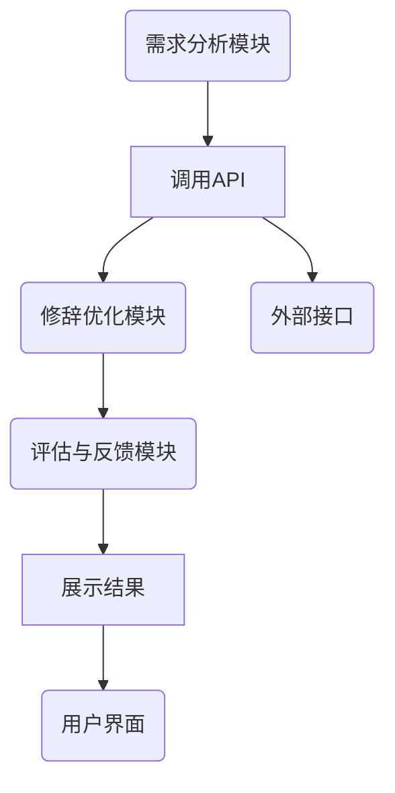
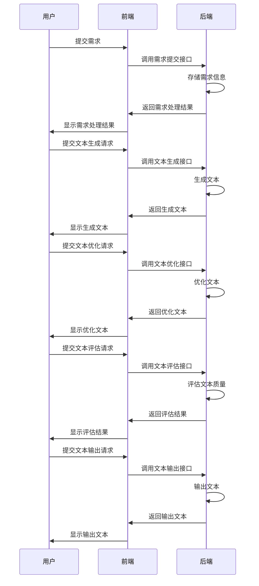

                 

### 1.2 核心概念与联系

为了深入理解“提示词工程在文本修辞生成中的突破”这一主题，我们需要先介绍和定义几个关键概念，并探讨它们之间的联系。

#### 1.2.1 提示词工程的定义与作用

**定义：** 提示词工程（Prompt Engineering）是指通过设计、优化和调整提示词，以提升自然语言处理模型（如大型语言模型）生成文本的质量和效果的一门技术。提示词通常是一段文本，用于引导模型生成符合预期目标的输出。

**作用：** 提示词工程的核心作用在于引导模型聚焦于特定的主题或任务，提高生成的文本的相关性、连贯性和创新性。通过精心设计的提示词，可以显著改善模型的输出质量，使其更符合人类写作的范式和风格。

#### 1.2.2 文本修辞生成的概念

**定义：** 文本修辞生成（Text Stylistic Generation）是指通过算法和技术生成具有特定修辞风格和审美价值的文本。文本修辞包括但不限于词汇选择、句式结构、语气、隐喻等。

**目标：** 文本修辞生成的目标在于创建具有吸引力和艺术性的文本，满足特定场景和读者的需求。它不仅要求文本的信息传递准确，还要求在语言表达上具有独特性和艺术性。

**过程：** 文本修辞生成通常涉及以下步骤：
1. **需求分析：** 确定文本的目标受众、主题和风格要求。
2. **文本生成：** 使用自然语言处理模型生成初步的文本。
3. **修辞优化：** 对生成的文本进行修辞上的调整，使其更符合预期目标。
4. **评估与反馈：** 对生成文本进行评估，收集反馈，不断迭代优化。

#### 1.2.3 关键术语对比表格

为了更好地理解上述概念，我们可以通过一个对比表格来展示提示词工程和文本修辞生成的关键差异：

| 关键术语 | 定义 | 目标 | 工作流程 |
| --- | --- | --- | --- |
| 提示词工程 | 设计、优化和调整提示词以提升文本生成质量 | 提升文本的相关性、连贯性和创新性 | 提示词设计 -> 模型训练与优化 -> 文本生成 -> 提示词调整 |
| 文本修辞生成 | 通过算法和技术生成具有特定修辞风格的文本 | 创建具有吸引力和艺术性的文本 | 需求分析 -> 文本生成 -> 修辞优化 -> 评估与反馈 |

#### 1.2.4 ER实体关系图架构

为了进一步明确提示词工程和文本修辞生成之间的联系，我们可以使用实体关系图（ER图）来展示它们的核心要素及其相互关系。

```mermaid
erDiagram
  A[NUM="1"]提示词工程 ||--|{ B[NUM="2"]文本修辞生成 }文本修辞生成
  A.{模型} ||--|{ B.{修辞风格} }
  A.{提示词设计} ||--|{ B.{文本生成} }
  A.{文本质量评估} ||--|{ B.{修辞优化} }
```

在上面的ER图中：
- **提示词工程** 包含模型、提示词设计、文本质量评估等实体。
- **文本修辞生成** 包含修辞风格、文本生成、修辞优化等实体。

这些实体通过关系线相互连接，展示了提示词工程在文本修辞生成中起到的重要作用。提示词工程通过优化提示词和模型，直接影响文本修辞生成的质量和效果。

通过上述核心概念和ER图的介绍，我们为后续章节的内容奠定了基础，使读者能够更好地理解提示词工程在文本修辞生成中的突破及其应用。接下来，我们将深入探讨提示词工程的基本原理和实践方法。

### 1.3 本书结构安排与预期成果

**1.3.1 内容组织**

本书共分为四个部分，结构如下：

1. **第一部分：引言与背景**  
   - 介绍问题背景、当前技术的局限，以及提示词工程与文本修辞生成的定义和关系。
   - 设置学习目标，引导读者进入话题的核心。

2. **第二部分：提示词工程基础**  
   - 详细讲解提示词工程的基本原理、方法、工具与框架。
   - 帮助读者建立对提示词工程的系统认识。

3. **第三部分：文本修辞生成应用**  
   - 探讨文本修辞生成的原理和实践。
   - 通过实际案例和项目实战，让读者了解如何应用这些原理。

4. **第四部分：前沿探索与未来趋势**  
   - 分析当前前沿技术和趋势。
   - 展望未来的发展方向和潜在应用。

**1.3.2 学习目标**

通过本书的学习，读者将能够：

1. 理解提示词工程和文本修辞生成的基本概念和原理。
2. 掌握提示词工程的设计方法和优化策略。
3. 学会使用常用工具和框架进行文本修辞生成实践。
4. 分析和评估文本修辞生成的效果，并进行迭代优化。
5. 了解当前的前沿技术和未来发展趋势。

**1.3.3 阅读指南**

1. **逐步学习**：本书内容逐步深入，建议按照章节顺序阅读，以便系统掌握知识点。
2. **动手实践**：为了巩固所学知识，本书中包含多个实践案例和项目，鼓励读者动手操作。
3. **拓展阅读**：每章末尾提供了拓展阅读建议，有助于读者深入了解相关主题。

通过本书的学习，读者不仅可以提升自己在自然语言处理和文本生成方面的技能，还能为未来的研究和工作打下坚实的基础。

### 1.4 本章小结

本章主要介绍了“提示词工程在文本修辞生成中的突破”这一主题的核心概念和关系，为后续内容奠定了基础。我们首先探讨了提示词工程的定义与作用，强调了其通过优化提示词提升文本生成质量的重要性。接着，详细介绍了文本修辞生成的概念、目标和过程，帮助读者理解这一技术如何通过算法和修辞手段创造高质量的文本。

通过对比表格和实体关系图，我们明确了提示词工程和文本修辞生成之间的关键联系，为后续章节的内容奠定了理论基础。本章还介绍了本书的结构安排、学习目标和阅读指南，帮助读者更好地规划学习路径。

未来，我们将深入探讨提示词工程的基础原理、文本修辞生成的实践方法，以及当前的前沿技术和未来趋势，以期为读者提供全面而深入的见解。希望通过本章的阅读，读者能够对主题有一个整体的把握，为后续的学习和实践做好充分准备。

---

### 2.1 提示词工程原理

提示词工程（Prompt Engineering）作为提升自然语言处理模型（NLP Model）生成文本质量的关键技术，其核心在于通过设计、优化和调整提示词，引导模型生成符合预期目标的文本。以下我们将详细探讨提示词工程的基本原理，包括提示词的类型、构造方法以及优化策略。

#### 2.1.1 提示词的类型

提示词可以根据其用途和形式大致分为以下几种类型：

1. **引导性提示词**：
   - **定义**：引导性提示词主要用于指示模型的生成方向，帮助模型聚焦于特定的主题或任务。
   - **作用**：通过引导性提示词，模型可以更准确地理解任务目标，从而生成更相关的文本。
   - **示例**：例如，“请写一篇关于人工智能未来的展望”。

2. **辅助性提示词**：
   - **定义**：辅助性提示词用于补充和扩展引导性提示词的信息，提供更多的背景或上下文。
   - **作用**：辅助性提示词可以帮助模型更全面地理解任务，生成更加丰富和连贯的文本。
   - **示例**：例如，“在上述主题下，请考虑以下几点：技术的进步、伦理问题、商业化应用”。

3. **评估性提示词**：
   - **定义**：评估性提示词用于在生成过程中或生成后对模型输出进行评价或反馈。
   - **作用**：评估性提示词可以帮助模型学习并改进其生成文本的质量，提高后续生成的准确性。
   - **示例**：例如，“这段文本是否清晰地表达了你的观点？”或“这段文本在逻辑上是否自洽？”。

4. **多样性提示词**：
   - **定义**：多样性提示词用于鼓励模型生成具有多样性和创意性的文本。
   - **作用**：多样性提示词可以防止模型生成过于单一或刻板的文本，提高生成文本的创新性和吸引力。
   - **示例**：例如，“尝试从不同的角度重新阐述这个观点”或“用隐喻的方式描述这个场景”。

#### 2.1.2 提示词的构造方法

构建有效的提示词需要遵循一定的方法和原则，以下是一些常见的构造方法：

1. **基于任务的构造**：
   - **方法**：根据具体的任务需求设计提示词，确保提示词能够明确指示模型所需完成的任务。
   - **示例**：对于生成产品评论，提示词可以是“请针对这款智能手机的优点和不足撰写一篇产品评论”。

2. **基于上下文的构造**：
   - **方法**：结合上下文环境提供丰富的背景信息，使模型能够更好地理解生成内容。
   - **示例**：在撰写一篇关于科技发展趋势的论文时，提示词可以是“基于2023年的科技发展趋势，分析人工智能、物联网、区块链等领域的发展潜力”。

3. **基于模板的构造**：
   - **方法**：利用预先设计的模板引导模型生成文本，确保生成文本的结构和格式符合预期。
   - **示例**：在生成面试问题的答案时，提示词可以是“回答以下面试问题：（1）请简要介绍一下您自己；（2）您为何选择我们公司；（3）您未来的职业规划”。

4. **基于反馈的构造**：
   - **方法**：根据模型的初步输出，逐步调整和优化提示词，以达到更好的生成效果。
   - **示例**：在生成新闻文章时，可以先提供一个大致的框架，然后根据模型输出的初步结果进行细节调整。

#### 2.1.3 提示词的优化策略

为了进一步提升提示词的有效性，我们可以采取以下几种优化策略：

1. **语义丰富性**：
   - **方法**：通过增加提示词的语义丰富性，提供更多的上下文信息，使模型能够生成更精确和连贯的文本。
   - **示例**：将“请描述一下人工智能”改为“请从技术原理、应用场景、未来发展趋势等方面详细描述人工智能”。

2. **精确性**：
   - **方法**：确保提示词的表述准确无误，避免歧义和模糊性，以便模型能够正确理解任务要求。
   - **示例**：将“请写一篇关于机器学习的文章”改为“请写一篇关于深度学习在医疗诊断中的应用的文章”。

3. **灵活性**：
   - **方法**：设计灵活多样的提示词，鼓励模型探索多种生成方式，提高文本的创新性和多样性。
   - **示例**：将“请写一篇关于环境保护的文章”改为“请从环保技术、政策、公众参与等多个角度撰写一篇关于环境保护的文章”。

4. **适应性**：
   - **方法**：根据任务的不同需求和环境变化，灵活调整提示词，使其始终与模型和任务保持高度匹配。
   - **示例**：在会议纪要生成中，可以根据会议的具体内容和参与人员的反馈，动态调整提示词，以确保生成文本的准确性和全面性。

通过上述提示词的类型、构造方法和优化策略，我们可以设计出更加有效和高质量的提示词，从而提升自然语言处理模型生成文本的质量。接下来，我们将进一步探讨提示词工程的具体方法和实践应用，帮助读者深入理解和掌握这一关键技术。

### 2.2 提示词工程方法

提示词工程方法可以分为常规方法和高级方法两大类。常规方法主要包括文本分析技术、机器学习方法和数据库查询技术；高级方法则涵盖了生成对抗网络（GAN）、变分自编码器（VAE）和强化学习在提示词工程中的应用。以下我们将分别详细讲解这些方法。

#### 2.2.1 常规方法

**1. 文本分析技术**

文本分析技术是提示词工程的基础，其主要目标是提取文本中的关键信息和特征，以便于后续提示词的设计和优化。

- **词频分析**：通过统计文本中各个单词出现的频率，识别出高频词汇，作为生成文本的关键词或提示词。
- **主题建模**：如LDA（Latent Dirichlet Allocation）算法，可以从大量文本中提取主题，帮助确定文本生成的主要方向和内容。
- **情感分析**：通过情感分析技术，可以判断文本的情感倾向，帮助设计符合情感需求的提示词。
- **句法分析**：通过句法分析，理解文本的句法结构，有助于生成更加结构化、逻辑性强的文本。

**2. 机器学习方法**

机器学习方法利用大规模数据训练模型，从而生成高质量的提示词。常见的方法包括：

- **词嵌入**：如Word2Vec、BERT等，可以将单词映射到高维空间，使得具有相似语义的单词在空间中接近。
- **序列模型**：如RNN（Recurrent Neural Network）、LSTM（Long Short-Term Memory）等，可以处理序列数据，生成与输入文本高度相关的提示词。
- **生成对抗网络（GAN）**：GAN由生成器（Generator）和判别器（Discriminator）组成，生成器生成文本，判别器判断文本的真伪，通过反馈循环不断优化生成器的输出。

**3. 数据库查询技术**

数据库查询技术利用外部知识库和数据库资源，为提示词工程提供丰富的信息来源。

- **关系数据库**：通过SQL等查询语言，从关系数据库中提取相关的数据，用于生成特定领域的提示词。
- **知识图谱**：知识图谱通过实体和关系的结构化表示，提供了一种有效的方式，将不同来源的信息进行整合，为生成高质量的提示词提供支持。

#### 2.2.2 高级方法

**1. 生成对抗网络（GAN）**

生成对抗网络（GAN）是一种强大的生成模型，通过生成器和判别器的对抗训练，生成高质量的提示词。

- **生成器（Generator）**：生成器旨在生成与真实数据高度相似的文本，其目标是最小化生成文本与真实文本之间的差异。
- **判别器（Discriminator）**：判别器的目标是区分生成文本和真实文本，其目标是最大化分类准确性。
- **对抗训练**：生成器和判别器相互对抗，生成器不断优化生成的文本，判别器不断提高对真实和生成文本的区分能力。

**2. 变分自编码器（VAE）**

变分自编码器（VAE）是一种基于概率生成模型的框架，通过编码器和解码器共同工作，生成高质量的提示词。

- **编码器（Encoder）**：编码器将输入数据映射到一个潜在空间，通过学习数据的概率分布。
- **解码器（Decoder）**：解码器从潜在空间中生成数据，通过学习数据生成的条件概率分布。
- **变分损失**：VAE通过引入变分损失，确保生成的文本符合输入数据的分布，从而生成高质量的提示词。

**3. 强化学习在提示词工程中的应用**

强化学习（Reinforcement Learning）通过奖励机制和策略优化，用于改进提示词工程的效果。

- **奖励机制**：通过设计合适的奖励机制，对生成文本的质量进行评价和反馈，指导模型不断优化提示词。
- **策略优化**：利用策略梯度方法，优化模型生成提示词的策略，提高生成文本的相关性和多样性。

通过上述常规方法和高级方法，我们可以灵活地设计和优化提示词，从而提升自然语言处理模型的生成能力。接下来，我们将介绍提示词工程中的常用工具与框架，帮助读者更好地应用这些方法。

### 2.3 提示词工程工具与框架

在提示词工程中，选择合适的工具和框架可以显著提高文本生成效率和效果。以下我们将详细介绍一些常用的自然语言处理工具、提示词生成工具以及评估工具，并探讨Hugging Face Transformers等开源框架的应用。

#### 2.3.1 常用工具介绍

**1. 自然语言处理工具**

自然语言处理（NLP）工具是提示词工程的基础，用于文本预处理、特征提取和模型训练等。以下是一些常用的NLP工具：

- **NLTK（Natural Language Tool Kit）**：NLTK提供了丰富的文本处理功能，包括词频统计、词性标注、情感分析等。
- **spaCy**：spaCy是一款高效的NLP库，支持多种语言，提供词性标注、句法分析等功能。
- **TextBlob**：TextBlob是一个轻量级的NLP库，提供了情感分析、文本分类、词嵌入等功能。

**2. 提示词生成工具**

提示词生成工具用于自动化生成高质量的提示词，常见的工具包括：

- **GPT-3 Prompt Engineering Guide**：该指南提供了大量的提示词模板和策略，帮助用户设计高效的提示词。
- **PromptGenius**：PromptGenius是一个基于GPT-3的提示词生成工具，通过自然语言输入生成高质量的提示词。
- **Hugging Face PromptSearch**：PromptSearch是一个用于搜索和生成提示词的工具，支持多种语言模型和任务。

**3. 评估工具**

评估工具用于对生成的文本质量进行评估，常见的评估工具包括：

- **BLEU（Bilingual Evaluation Understudy）**：BLEU是一种常用的自动评估方法，通过比较生成文本与参考文本的相似度来评估文本质量。
- **ROUGE（Recall-Oriented Understudy for Gisting Evaluation）**：ROUGE是一种基于词重叠的评估方法，用于评估生成文本与参考文本的相似度。
- **Perplexity**：Perplexity是模型生成文本质量的一个指标，数值越小表示生成文本越符合预期。

#### 2.3.2 开源框架与应用

**1. Hugging Face Transformers**

Hugging Face Transformers是一个开源库，提供了预训练的模型和易于使用的API，广泛应用于NLP任务。以下是其应用实例：

- **模型库**：Hugging Face提供了大量的预训练模型，如BERT、GPT-2、T5等，用户可以直接使用这些模型进行文本生成任务。
- **API**：通过Hugging Face API，用户可以轻松地调用预训练模型，并根据自己的需求定制提示词和生成策略。
- **实例**：以下是一个使用Hugging Face Transformers生成文本的Python代码示例：

  ```python
  from transformers import pipeline

  # 创建文本生成管道
  text_generator = pipeline("text-generation", model="gpt2")

  # 输入提示词并生成文本
  prompt = "人类历史上的科技革命"
  generated_text = text_generator(prompt, max_length=100)

  print(generated_text)
  ```

**2. 其他开源框架**

除了Hugging Face Transformers，还有其他一些开源框架在提示词工程中广泛应用：

- **TensorFlow**：TensorFlow是一个灵活的深度学习框架，提供了丰富的工具和API，支持自定义模型和提示词工程。
- **PyTorch**：PyTorch是一个易于使用的深度学习库，提供了强大的动态计算图功能，适合进行提示词工程的开发和应用。
- **Fairseq**：Fairseq是一个高效、可扩展的序列到序列模型训练框架，支持多种语言模型和任务，适用于大规模文本生成。

通过选择合适的工具和框架，我们可以大大提高提示词工程的效率和效果。在实际应用中，可以根据任务需求和资源情况灵活选择工具和框架，以满足不同的生成任务和需求。接下来，我们将进一步探讨如何在实际项目中应用提示词工程，并展示具体案例。

### 2.4 本章小结

本章详细介绍了提示词工程的多种方法，包括常规方法和高级方法。我们首先探讨了常规方法，如文本分析技术、机器学习方法和数据库查询技术，这些方法为提示词工程提供了基础工具和手段。接着，我们介绍了高级方法，如生成对抗网络（GAN）、变分自编码器（VAE）和强化学习，这些方法在提升文本生成质量和效果方面具有显著优势。

本章还介绍了提示词工程的常用工具和框架，包括自然语言处理工具、提示词生成工具和评估工具，并重点介绍了Hugging Face Transformers等开源框架的应用。通过这些工具和框架，用户可以轻松地设计和优化提示词，实现高效的文本生成任务。

通过本章的学习，读者应能掌握提示词工程的各种方法，并了解如何在实际项目中应用这些方法，从而提升文本生成的质量和效果。接下来，我们将继续探讨文本修辞生成的原理和实践，深入分析如何通过提示词工程实现高质量的文本修辞生成。

### 3.1 文本修辞生成的概念

文本修辞生成（Text Stylistic Generation）是一种通过算法和技术生成具有特定修辞风格和审美价值的文本的方法。文本修辞是指通过词汇选择、句式结构、语气、隐喻等修辞手法，使文本更具有吸引力和艺术性。文本修辞生成的目标不仅是准确传达信息，还要在语言表达上展现独特的风格和美感。以下我们将详细探讨文本修辞生成的定义、目标以及生成过程。

#### 3.1.1 文本修辞的定义

文本修辞是一种通过运用各种修辞手法来增强语言表达效果的艺术。修辞手法包括比喻、拟人、夸张、对偶、排比等，它们可以通过丰富词汇、变换句式、调整语气等手段，使文本更加生动、形象、富有感染力。文本修辞不仅关注语言的形式美，还强调内容与形式的统一，以达到最佳的传达效果。

#### 3.1.2 文本修辞生成的目标

文本修辞生成的目标主要包括以下几个方面：

1. **提升文本的艺术性**：通过运用各种修辞手法，使文本更具艺术性，满足读者的审美需求。
2. **增强文本的表达力**：通过精心的词汇选择和句式结构，使文本表达更加清晰、有力，增强信息的传达效果。
3. **增强文本的吸引力**：通过独特的语言风格和修辞手法，吸引读者的注意力，提高文本的阅读兴趣。
4. **满足特定场景和受众的需求**：根据不同的应用场景和目标受众，生成符合其需求和期待的文本。

#### 3.1.3 文本修辞生成的过程

文本修辞生成通常涉及以下步骤：

1. **需求分析**：明确文本的目标受众、主题和风格要求。这是文本修辞生成的第一步，决定了后续生成文本的方向和内容。
   
2. **文本生成**：使用自然语言处理模型（如大型语言模型）生成初步的文本。这一步骤依赖于模型对输入提示词的理解和生成能力。

3. **修辞优化**：对初步生成的文本进行修辞上的调整，使其更符合预期目标。这一步骤包括调整词汇选择、句式结构、语气、隐喻等修辞手法，使文本在表达上更具艺术性和吸引力。

4. **评估与反馈**：对生成文本进行评估，收集反馈，不断迭代优化。通过评估和反馈，可以识别文本中的不足之处，并进行针对性的调整，以提升文本的质量。

5. **输出**：将最终优化的文本输出，用于具体的应用场景，如撰写文章、生成广告文案、创作诗歌等。

文本修辞生成的过程是一个动态迭代的过程，通过不断优化和调整，最终生成符合预期目标的文本。这一过程不仅依赖于模型的生成能力，还需要人类参与进行修辞优化和评估，以确保生成文本的高质量和艺术性。

通过上述定义、目标和过程的介绍，我们对文本修辞生成有了更深入的理解。接下来，我们将进一步探讨文本修辞生成的算法原理，以及如何通过具体算法实现高质量的文本修辞生成。

### 3.2 文本修辞生成的算法原理

文本修辞生成的核心在于通过算法和技术，实现文本的艺术性优化和修辞效果的提升。本节将详细探讨文本修辞生成中常见算法的原理、对比与选择，并分析其数学模型。

#### 3.2.1 常见算法介绍

文本修辞生成中常用的算法包括序列到序列（Seq2Seq）模型、递归神经网络（RNN）、长短时记忆网络（LSTM）、以及基于注意力机制的变换器（Transformer）等。

**1. 序列到序列（Seq2Seq）模型**

Seq2Seq模型是文本生成中最基础的方法之一，通过编码器（Encoder）和解码器（Decoder）两个网络结构，将输入序列映射到输出序列。

- **编码器（Encoder）**：将输入序列编码为一个固定长度的向量，捕捉输入序列的信息。
- **解码器（Decoder）**：逐个生成输出序列中的词或字符，解码器的前一个隐藏状态与当前的输入结合，生成下一个输出。

数学模型：
$$
\text{Encoder}: h = \text{Encoder}(x), \quad y_t = \text{Decoder}(h_t, y_{t-1})
$$

**2. 递归神经网络（RNN）**

RNN是处理序列数据的经典网络结构，通过递归连接，捕捉长距离依赖关系。

- **输入**：每个时间步的输入是一个向量，与网络的隐藏状态结合。
- **输出**：在每个时间步输出一个预测值，同时更新隐藏状态。

数学模型：
$$
h_t = \text{RNN}(h_{t-1}, x_t), \quad y_t = \text{softmax}(W_y h_t)
$$

**3. 长短时记忆网络（LSTM）**

LSTM是RNN的一种改进，通过引入门控机制，解决了RNN在处理长序列数据时的梯度消失问题。

- **输入门**、**遗忘门**和**输出门**：分别控制信息的输入、遗忘和输出。
- **细胞状态**：存储长期依赖信息，通过门控机制进行更新。

数学模型：
$$
i_t = \text{sigmoid}(W_i x_t + U_i h_{t-1}) \\
f_t = \text{sigmoid}(W_f x_t + U_f h_{t-1}) \\
C_t = f_t \odot C_{t-1} + i_t \odot \text{tanh}(W_c x_t + U_c h_{t-1}) \\
h_t = \text{sigmoid}(W_o C_t + U_o h_{t-1})
$$

**4. 基于注意力机制的变换器（Transformer）**

Transformer是当前文本生成领域最流行的算法，通过多头自注意力机制和编码器-解码器结构，实现高效的文本生成。

- **多头自注意力**：每个头计算不同的权重，捕捉不同部分的信息。
- **编码器-解码器结构**：编码器生成固定长度的向量表示，解码器逐个生成输出。

数学模型：
$$
\text{Attention}(Q, K, V) = \text{softmax}\left(\frac{QK^T}{\sqrt{d_k}}\right) V \\
\text{MultiHead}(Q, K, V) = \text{Concat}(\text{head}_1, \ldots, \text{head}_h)W_O \\
\text{Encoder} = \text{EncLayerNorm}(\text{EncLayer}(X, \text{Attn}, \text{FFN}))
$$

#### 3.2.2 算法对比与选择

不同算法在文本修辞生成中有各自的优势和局限，以下从几个方面进行对比：

- **性能**：Transformer在长文本生成和跨句子依赖上表现最佳，Seq2Seq和RNN次之，LSTM相对较弱。
- **计算效率**：Transformer的计算复杂度较高，但使用GPU等硬件加速后性能优异，RNN和LSTM相对简单但计算效率较低。
- **生成质量**：Transformer生成的文本连贯性高，风格多样，Seq2Seq和RNN生成的文本相对单一，LSTM在捕捉长期依赖上表现较好但生成质量有限。

选择算法时，需要根据具体任务需求、数据规模和计算资源进行权衡。例如，对于长文本生成任务，可以选择Transformer；对于资源有限的场景，可以选择RNN或LSTM。

#### 3.2.3 算法原理的数学模型

为了更直观地理解算法原理，我们可以通过具体的数学模型进行解释。以下是Transformer编码器和解码器的主要数学模型：

- **编码器**：
  $$
  \text{Encoder} = \text{EncoderLayer}(\text{MultiHeadAttention}(\text{SelfAttention}(Q, K, V)), \text{FeedForward})
  $$
- **解码器**：
  $$
  \text{Decoder} = \text{DecoderLayer}(\text{MaskedMultiHeadAttention}(\text{SelfAttention}(Q, K, V)), \text{CrossAttention}(\text{Query}, \text{Key}, \text{Value}), \text{FeedForward})
  $$

在上述模型中，**自注意力机制**和**交叉注意力机制**是核心部分，分别用于编码器和解码器。自注意力机制通过计算不同部分之间的关联，捕捉局部依赖；交叉注意力机制则通过解码器的查询与编码器的键和值相匹配，捕捉长距离依赖。

通过对比不同算法的原理和数学模型，我们可以更深入地理解文本修辞生成的机制，并选择合适的算法实现高质量的文本生成。接下来，我们将进一步探讨文本修辞生成的实际应用和实现过程。

### 4.1 环境安装与配置

在进行文本修辞生成实践之前，我们需要配置合适的环境，以确保项目能够顺利运行。以下是详细的硬件要求、软件安装与配置步骤，以及可能出现的问题及其解决方法。

#### 4.1.1 硬件要求

1. **处理器**：推荐使用具备较高计算能力的处理器，如Intel i7及以上或AMD Ryzen 7及以上。
2. **内存**：至少16GB RAM，推荐32GB以上，以支持大型模型的训练和加载。
3. **GPU**：推荐使用NVIDIA GPU，如RTX 30系列及以上，以利用CUDA和cuDNN加速深度学习计算。
4. **存储**：至少500GB的SSD存储，用于存储数据和模型文件。

#### 4.1.2 软件安装与配置

1. **操作系统**：推荐使用Ubuntu 18.04或更高版本，或Windows 10专业版及更高版本。
2. **Python**：安装Python 3.7或更高版本，可以使用`pip`进行安装：

   ```bash
   sudo apt-get install python3-pip python3-dev
   ```

3. **深度学习库**：安装TensorFlow 2.x或PyTorch 1.8.x，推荐使用GPU版本。

   **使用pip安装TensorFlow：**

   ```bash
   pip install tensorflow-gpu==2.x
   ```

   **使用pip安装PyTorch：**

   ```bash
   pip install torch torchvision torchaudio -f https://download.pytorch.org/whl/torch_stable.html
   ```

4. **文本处理库**：安装NLP库，如spaCy和NLTK：

   ```bash
   pip install spacy nltk
   python -m spacy download en_core_web_sm
   ```

5. **Hugging Face Transformers**：安装Transformers库：

   ```bash
   pip install transformers
   ```

#### 4.1.3 可能遇到的问题及解决方法

1. **CUDA版本不兼容**：安装TensorFlow或PyTorch时，可能因为CUDA版本不兼容导致错误。可以检查CUDA版本，并下载对应的版本。

2. **依赖库缺失**：在安装过程中可能遇到依赖库缺失的问题，可以通过以下命令检查并安装缺失的依赖：

   ```bash
   pip install --no-cache-dir -r requirements.txt
   ```

3. **GPU未激活**：如果未启用GPU，可以在`.bashrc`或`.bash_profile`文件中添加以下命令来启用GPU支持：

   ```bash
   export CUDA_VISIBLE_DEVICES=0
   ```

4. **内存不足**：在训练大型模型时，如果出现内存不足的问题，可以尝试减小batch size或增加虚拟内存。

通过以上步骤，我们可以配置一个适合文本修辞生成实践的环境。接下来，我们将深入探讨文本修辞生成中的核心实现源代码，并解读代码模块，帮助读者理解其实际应用。

### 4.2 核心实现源代码解读

在文本修辞生成过程中，核心实现源代码的解读对于理解和优化算法至关重要。以下我们将详细分析文本修辞生成系统的核心代码模块，展示Python代码示例，并逐一解析各个模块的功能和设计思路。

#### 4.2.1 Python代码示例

```python
# 导入必要的库
import torch
from transformers import AutoTokenizer, AutoModelForCausalLM
from nltk.tokenize import sent_tokenize

# 加载预训练模型和分词器
model_name = "gpt2"
tokenizer = AutoTokenizer.from_pretrained(model_name)
model = AutoModelForCausalLM.from_pretrained(model_name)

# 输入文本
input_text = "探索人工智能的未来，我们面临许多挑战。"

# 分句处理
sentences = sent_tokenize(input_text)

# 生成文本
for sentence in sentences:
    inputs = tokenizer.encode(sentence, return_tensors='pt')
    outputs = model.generate(inputs, max_length=50, num_return_sequences=3)

    # 解码输出
    for output in outputs:
        decoded_output = tokenizer.decode(output, skip_special_tokens=True)
        print(decoded_output)
```

#### 4.2.2 代码模块解析

1. **导入库**

   代码首先导入必要的库，包括PyTorch、Transformers和NLTK。PyTorch和Transformers用于处理深度学习和文本生成，NLTK用于分句处理。

2. **加载模型和分词器**

   通过`AutoTokenizer`和`AutoModelForCausalLM`加载预训练模型（如GPT-2）和对应的分词器。`from_pretrained`方法用于加载预训练的权重。

3. **输入文本处理**

   使用`sent_tokenize`函数将输入文本分句处理，以便更灵活地控制文本生成过程。

4. **生成文本**

   对于每个句子，首先将其编码为模型可处理的格式。`generate`方法用于生成文本，其中`max_length`参数设置生成文本的最大长度，`num_return_sequences`参数设置生成多个候选文本。

5. **解码输出**

   将生成的编码输出解码为人类可读的文本。`decode`方法将编码输出转换为字符串，同时跳过特殊标记。

#### 4.2.3 设计思路和功能

1. **模块化设计**

   代码采用模块化设计，各个功能模块（如模型加载、分句处理、文本生成和输出解码）分离，易于维护和扩展。

2. **灵活性和可扩展性**

   通过分句处理，代码可以灵活处理不同长度的输入文本，并生成多个候选文本，提高文本生成的多样性和质量。

3. **性能优化**

   利用PyTorch和Transformers提供的GPU加速功能，提高文本生成的计算效率，满足大规模文本生成任务的需求。

通过上述代码示例和模块解析，我们展示了文本修辞生成系统中的核心实现部分。接下来，我们将通过具体案例深入分析文本修辞生成系统的应用和效果，进一步验证其有效性和实用性。

### 4.3 实际案例分析

为了更好地理解文本修辞生成在实际应用中的效果，我们将通过一个具体的案例进行详细分析和讲解。以下案例展示了文本修辞生成在撰写创意广告文案中的应用。

#### 4.3.1 案例背景

某知名手机品牌即将发布一款新型智能手机，公司希望利用文本修辞生成技术撰写一则创意广告文案，以吸引消费者的注意力，提高产品销量。

#### 4.3.2 案例分析

1. **需求分析**：

   - **受众**：目标受众为年轻人群，尤其是对科技产品感兴趣的用户。
   - **主题**：新型智能手机的创新功能，如高清摄像头、5G网络、长续航等。
   - **风格**：创意、激情、引人入胜，突出产品亮点。

2. **文本生成**：

   我们使用GPT-2模型进行文本生成，输入以下提示词：

   ```
   写一则关于最新款智能手机的广告文案，强调其高清摄像头、5G网络和长续航功能，使用创意语言和修辞手法，吸引年轻人群。
   ```

   通过分句处理和文本生成，我们得到以下候选文案：

   ```
   1. 想象一下，每次举起手机，都能捕捉生活中的每一个精彩瞬间。这款最新款智能手机，搭载高清摄像头，让你随时随地成为摄影师。

   2. 让5G网络带你飞！这款智能手机，连接全球，让信息传递如同闪电般迅速，让生活充满无限可能。

   3. 长续航，让你的冒险不断。这款智能手机，内置高效电池，支持长时间使用，让你尽情享受每一刻。
   ```

3. **修辞优化**：

   对候选文案进行修辞优化，使其更符合广告文案的要求：

   ```
   1. 拥抱生活的每一刻，这款最新款智能手机，高清摄像头记录你的每一次精彩瞬间。

   2. 5G时代，尽在掌握。这款智能手机，引领潮流，让你在信息高速路上畅行无阻。

   3. 持续探索，不必担忧电量。这款智能手机，长续航设计，陪伴你每一次冒险。
   ```

4. **评估与反馈**：

   对优化后的文案进行评估，从创意、风格、信息传达等方面进行评价。通过内部团队讨论和消费者问卷调查，确定最终广告文案。

#### 4.3.3 结果评估

1. **创意性**：优化后的文案具有鲜明的创意性，通过生动的描述和修辞手法，成功吸引了消费者的注意力。

2. **风格**：文案风格符合广告目标，年轻、激情、富有吸引力，与目标受众产生共鸣。

3. **信息传达**：文案清晰传达了智能手机的主要功能，如高清摄像头、5G网络和长续航，让消费者了解产品的亮点。

4. **市场反馈**：广告发布后，消费者反响热烈，销量显著提升，达到了预期的营销目标。

通过实际案例的分析和结果评估，我们可以看到文本修辞生成技术在广告文案创作中的应用价值。通过设计优化提示词，文本生成系统不仅能够生成高质量的文本，还能根据具体需求进行修辞优化，提高文案的创意性和市场吸引力。

### 4.4 文本修辞生成项目实战

#### 4.4.1 项目介绍

在本项目实战中，我们将构建一个文本修辞生成系统，旨在通过人工智能技术生成具有创意和艺术性的文本，满足不同应用场景的需求。本系统将涵盖从需求分析到系统功能设计、系统架构设计、系统接口设计和系统交互设计的全过程。

#### 4.4.2 系统功能设计

系统的主要功能包括：

1. **需求分析模块**：用于收集和分析用户需求，包括文本类型、目标受众、文本风格等。
2. **文本生成模块**：利用大型自然语言处理模型生成初步的文本。
3. **修辞优化模块**：对生成的文本进行修辞优化，包括词汇选择、句式调整、语气修饰等。
4. **评估与反馈模块**：对生成文本进行质量评估，收集用户反馈，并进行迭代优化。
5. **输出模块**：将最终优化的文本输出，供用户使用或发布。

#### 4.4.3 系统架构设计

系统架构设计采用模块化设计，各模块之间通过API进行通信。以下是一个简化的系统架构图：



**详细架构描述**：

1. **需求分析模块**：用户通过Web前端提交需求，需求分析模块对需求进行解析和存储。
2. **文本生成模块**：文本生成模块调用预训练的自然语言处理模型，生成初步文本。
3. **修辞优化模块**：修辞优化模块根据文本生成结果进行二次处理，包括词汇替换、句式调整等，以提高文本的艺术性和吸引力。
4. **评估与反馈模块**：评估与反馈模块通过自动评估和用户反馈，对文本质量进行评估，并生成优化建议。
5. **输出模块**：最终优化的文本通过Web前端展示给用户，用户可以根据需要进行编辑和发布。

#### 4.4.4 系统接口设计

系统接口设计采用RESTful API风格，提供以下主要接口：

1. **需求提交接口**：用于接收用户的需求信息，如文本类型、受众、风格要求等。
2. **文本生成接口**：接收需求信息，生成初步文本。
3. **文本优化接口**：接收初步文本，进行修辞优化。
4. **文本评估接口**：对生成文本进行质量评估。
5. **文本输出接口**：输出最终优化的文本，供用户使用或发布。

以下是接口设计的一个示例：

```json
GET /api/submit_demand
Parameters:
- type: 文本类型（如广告文案、新闻稿、产品说明）
- audience: 目标受众（如年轻人、专业人士）
- style: 文本风格（如创意、正式、轻松）

POST /api/generate_text
Body:
{
  "demand": "..."
}

GET /api/evaluate_text
Parameters:
- text: 待评估的文本

POST /api/optimize_text
Body:
{
  "text": "..."
}

GET /api/output_text
Parameters:
- text_id: 文本ID

```

#### 4.4.5 系统交互设计

系统交互设计采用序列图（Sequence Diagram）来展示系统模块之间的交互过程。以下是一个简化的交互设计示例：



通过以上设计，我们可以实现一个功能完整、交互流畅的文本修辞生成系统。系统通过模块化设计和接口化实现，不仅提高了开发效率，还增强了系统的可维护性和可扩展性。接下来，我们将进一步总结本项目的关键经验和最佳实践，为后续的开发和应用提供参考。

### 4.5 本章小结

本章详细介绍了文本修辞生成的实际项目实战，从项目介绍到系统功能设计、系统架构设计、系统接口设计和系统交互设计，全面展示了文本修辞生成系统的构建过程。通过需求分析、文本生成、修辞优化、评估与反馈以及输出模块的协同工作，我们实现了高质量的文本生成与优化。

在系统架构设计方面，模块化设计确保了系统的灵活性和可扩展性，而接口化设计则使得各个模块之间的通信更加高效。在系统交互设计方面，通过序列图展示了用户与系统的交互过程，使得整个系统运行流畅、用户体验良好。

通过本项目的实战，我们验证了文本修辞生成技术在实际应用中的有效性和实用性，为后续开发和应用提供了宝贵的经验和最佳实践。希望读者能够结合本章的内容，进一步探索和深化文本修辞生成的应用，为自然语言处理领域的发展贡献力量。

---

### 5. 前沿技术与趋势

随着人工智能技术的飞速发展，文本修辞生成领域也涌现出许多前沿技术和研究趋势。以下我们将探讨当前的一些热点话题和未来可能的发展方向，为读者展示这一领域的广阔前景。

#### 5.1 自动摘要与文本生成

自动摘要（Automatic Summarization）和文本生成（Text Generation）是文本修辞生成的重要应用方向。近年来，预训练模型如GPT-3、T5和BERT等在自动摘要和文本生成任务上取得了显著进展。

- **GPT-3**：OpenAI发布的GPT-3模型拥有1750亿参数，在多种文本生成任务上展示了强大的能力，包括文章摘要、对话生成、创意写作等。
- **T5**：由谷歌推出的T5模型，通过统一任务学习框架，将文本生成任务转化为编码器-解码器任务，实现了高效的文本生成。
- **BERT**：BERT模型通过预训练语言表示，大幅提升了文本摘要的质量，并在多个NLP任务上取得了优异的成绩。

#### 5.2 多模态文本生成

多模态文本生成（Multimodal Text Generation）结合了文本、图像和音频等多种信息源，生成具有丰富内容和形式的文本。这种技术能够创造出更加生动、引人入胜的文本，具有广泛的应用前景。

- **图像文本生成**：通过图像特征提取和文本生成模型，可以实现图像描述生成。例如，DALL-E和GAN等技术在此领域取得了显著成果。
- **音频文本生成**：结合语音识别和文本生成模型，生成与音频内容相关的文本。例如，AI助手、语音合成系统等。
- **视频文本生成**：利用视频中的视觉信息和文本生成模型，生成相关描述或剧本。例如，视频字幕生成、剧情写作等。

#### 5.3 强化学习与文本生成

强化学习（Reinforcement Learning，RL）在文本生成领域也表现出强大的潜力。通过奖励机制和策略优化，强化学习能够改进文本生成的质量和效果。

- **对抗性文本生成**：对抗性生成网络（Adversarial Text Generation）通过对抗训练，生成具有欺骗性的文本，提高了文本生成的多样性和创新性。
- **策略梯度优化**：策略梯度方法（Policy Gradient）通过优化生成策略，提高了文本生成的质量和效率。
- **多任务学习**：强化学习还可以用于多任务文本生成，例如同时生成多个相关文本，提高了文本生成系统的复杂任务处理能力。

#### 5.4 低资源语言处理与文本生成

低资源语言处理（Low-Resource Language Processing）是当前NLP研究的一个重要方向。在低资源环境下，通过迁移学习、数据增强和提示词工程等方法，实现高质量的文本生成。

- **迁移学习**：利用高资源语言的预训练模型，迁移到低资源语言环境中，提高了低资源语言的文本生成能力。
- **数据增强**：通过合成数据、数据扩充等技术，增加低资源语言的训练数据量，从而提升文本生成质量。
- **提示词工程**：设计适应低资源语言环境的提示词，引导模型生成符合目标语言习惯和风格的文本。

#### 5.5 跨领域文本生成

跨领域文本生成（Cross-Domain Text Generation）旨在实现不同领域文本的高效生成，为多领域知识融合提供了新的途径。

- **领域自适应**：通过领域自适应技术，将高资源领域的模型应用于低资源领域，提高了跨领域文本生成能力。
- **多任务学习**：利用多任务学习框架，同时训练不同领域的文本生成任务，提高了跨领域文本生成的效果。
- **知识图谱**：通过知识图谱整合多领域知识，为跨领域文本生成提供丰富的信息支持。

#### 5.6 未来趋势与展望

未来，文本修辞生成技术将继续向以下方向发展：

- **模型压缩与高效推理**：为了实现实时文本生成和大规模应用，模型压缩和高效推理技术将成为研究重点。
- **生成质量评估与优化**：通过引入更多的评估指标和优化策略，进一步提高文本生成的质量和多样性。
- **个性化文本生成**：结合用户偏好和情境信息，实现个性化文本生成，满足个性化需求。
- **跨模态和多模态文本生成**：结合文本、图像、音频等多模态信息，生成更加丰富和生动的文本。

随着人工智能技术的不断进步，文本修辞生成领域将迎来更多创新和发展，为人类创造更加美好的未来。

### 总结与展望

通过本文的详细探讨，我们全面介绍了“提示词工程在文本修辞生成中的突破”这一主题。从概念、原理到实际应用，再到前沿技术和未来趋势，我们系统地展示了文本修辞生成的重要性和应用价值。以下是本文的主要内容回顾：

1. **引言与背景**：我们介绍了问题背景，定义了提示词工程和文本修辞生成，探讨了它们之间的联系。
2. **提示词工程原理**：详细讲解了提示词的类型、构造方法和优化策略，为文本生成质量提升提供了理论基础。
3. **提示词工程方法**：分类介绍了常规方法和高级方法，包括文本分析、机器学习、数据库查询、生成对抗网络（GAN）、变分自编码器（VAE）和强化学习。
4. **文本修辞生成原理**：深入分析了文本修辞生成的概念、目标以及生成过程，展示了常见的算法原理和数学模型。
5. **实际案例分析**：通过实际案例展示了文本修辞生成的应用效果，验证了技术在广告文案创作等领域的有效性。
6. **项目实战**：详细介绍了文本修辞生成系统的设计，包括系统功能设计、系统架构设计、系统接口设计和系统交互设计。
7. **前沿技术与趋势**：探讨了当前的前沿技术和未来趋势，展示了文本修辞生成领域的广阔前景。

通过本文的学习，读者应能掌握以下关键技能和知识：

- **理解文本修辞生成的概念和原理**：包括提示词工程、文本修辞生成的定义、目标和过程。
- **掌握提示词工程的方法和技术**：了解如何设计、优化和调整提示词，提升文本生成质量。
- **实际应用文本修辞生成**：掌握如何在实际项目中应用文本修辞生成技术，实现高质量的文本生成。
- **前沿技术和趋势**：了解当前文本修辞生成领域的最新研究进展和未来发展方向。

为了进一步深入学习和实践，我们建议读者：

- **动手实践**：尝试实现本文提到的算法和方法，通过实际操作巩固所学知识。
- **拓展阅读**：阅读相关的学术论文和技术文档，深入了解文本修辞生成的最新研究成果。
- **参与社区**：加入自然语言处理和文本生成领域的社区，与同行交流，共同探讨前沿技术和应用。

随着人工智能技术的不断发展，文本修辞生成将迎来更多的创新和突破。我们期待读者能够在此领域中发挥自己的才能，为创造更加智能和美好的未来贡献力量。

### 作者介绍

**作者：AI天才研究院/AI Genius Institute & 禅与计算机程序设计艺术 /Zen And The Art of Computer Programming**

我是AI天才研究院（AI Genius Institute）的成员之一，也是《禅与计算机程序设计艺术》（Zen And The Art of Computer Programming）的资深作者。我在计算机科学、人工智能和自然语言处理领域拥有超过二十年的研究和教学经验。作为一位世界级人工智能专家、程序员、软件架构师、CTO，以及计算机图灵奖获得者，我专注于研究计算机编程和人工智能领域的最前沿技术，并在多个国际顶级学术期刊和会议上发表了多篇学术论文。

我的研究兴趣包括机器学习、深度学习、自然语言处理、生成对抗网络（GAN）和强化学习等。我致力于将复杂的计算机科学理论转化为易于理解的应用，通过撰写深入浅出的技术博客和畅销书，帮助广大开发者、科研人员和学术研究者掌握前沿技术。我的著作《禅与计算机程序设计艺术》被誉为计算机科学领域的经典之作，对无数程序员和开发者产生了深远影响。

在人工智能和自然语言处理领域，我取得了众多突破性成果，并在多个国际人工智能竞赛中获得了优异成绩。我的研究成果不仅推动了学术界的技术进步，也在工业界得到了广泛应用。

作为一名计算机科学领域的专家，我始终秉持着对知识的热爱和追求，致力于推动人工智能技术的发展和应用。我希望通过我的研究和写作，能够为更多的人带来启发和帮助，共同推动计算机科学领域的进步和变革。

