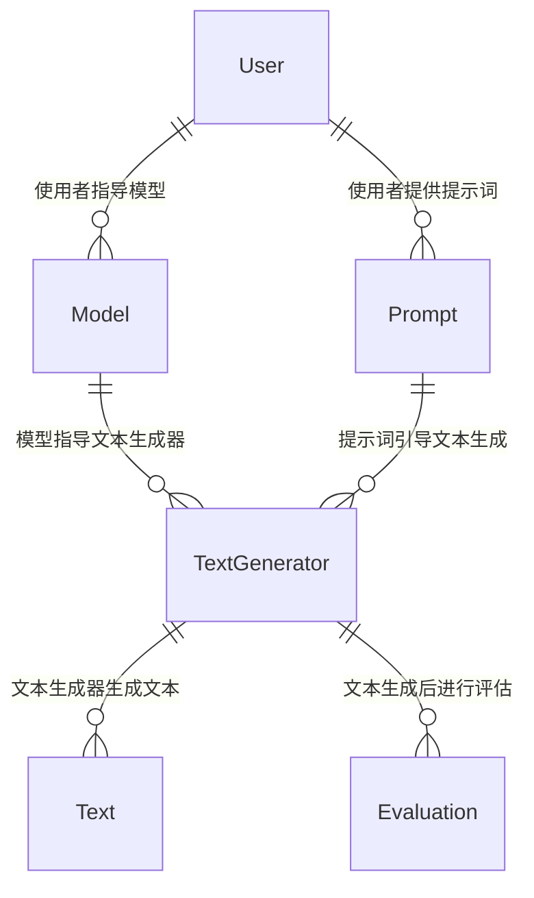
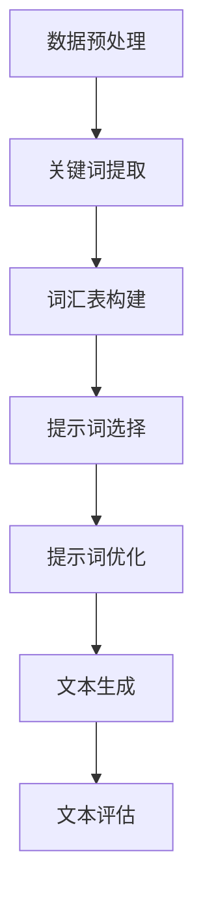
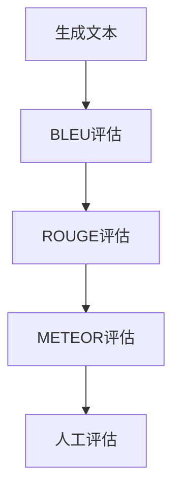
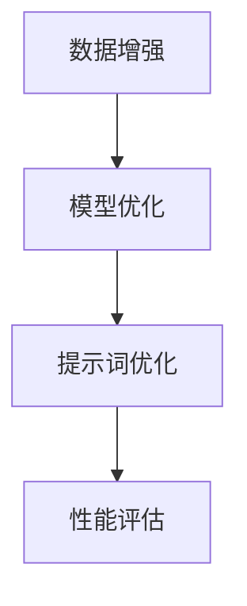
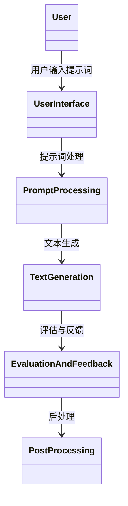

                 


### 摘要

本文旨在深入探讨提示词工程在文本可控生成中的进展。首先，我们将介绍文本生成技术的发展历程，并阐述提示词工程的重要性。接下来，我们将定义核心概念，如提示词工程的定义、基本原理和文本可控生成的基本概念，并通过对比表格和ER实体关系图来明确概念之间的联系。随后，我们将详细讲解提示词工程的算法原理，包括语言模型、概率生成模型和强化学习在其中的应用。通过实际案例和Python源代码，我们将展示算法原理的具体实现和数学模型。接着，我们将分析文本可控生成系统的架构与实现，包括系统功能模块、架构设计、接口设计以及系统交互。我们将通过项目实战，展示实际应用中的实现细节，并提供案例分析。最后，我们将讨论提示词工程的优化策略和面临的挑战，以及未来的发展趋势和应用场景。通过本文，读者将全面了解提示词工程在文本可控生成中的重要性及其技术实现。

### 目录大纲

----------------------------------------------------------------

# 《提示词工程在文本可控生成中的进展》目录大纲

## 第一部分: 问题背景与核心概念

## 第1章: 问题背景与核心概念介绍

### 1.1 问题背景

#### 1.1.1 文本生成技术的发展历程

#### 1.1.2 提示词工程的重要性

#### 1.1.3 文本可控生成的需求与挑战

### 1.2 核心概念与联系

#### 1.2.1 提示词工程的定义

#### 1.2.2 提示词工程的基本原理

#### 1.2.3 文本可控生成的基本概念

#### 1.2.4 提示词工程与文本可控生成的关系

### 1.3 概念属性特征对比表格

#### 1.3.1 文本生成模型

#### 1.3.2 控制性文本生成模型

### 1.4 ER实体关系图架构

#### 1.4.1 实体与关系

#### 1.4.2 提示词工程的实体关系图

## 第二部分: 提示词工程的算法原理与实现

## 第2章: 提示词工程算法原理

### 2.1 基本算法原理

#### 2.1.1 语言模型

#### 2.1.2 概率生成模型

#### 2.1.3 强化学习在提示词工程中的应用

### 2.2 算法详细讲解

#### 2.2.1 提示词生成算法流程

#### 2.2.2 提示词质量评估方法

#### 2.2.3 算法性能优化策略

### 2.3 算法数学模型与公式

#### 2.3.1 语言模型概率计算公式

#### 2.3.2 强化学习奖励函数设计

#### 2.3.3 提示词优化目标函数

### 2.4 举例说明

#### 2.4.1 基于GPT-3的提示词工程实例

#### 2.4.2 基于强化学习的提示词工程实例

## 第三部分: 提示词工程在文本可控生成中的应用

## 第3章: 文本可控生成系统架构与实现

### 3.1 系统架构设计

#### 3.1.1 系统功能模块

#### 3.1.2 系统架构设计

#### 3.1.3 系统接口设计

### 3.2 系统实现

#### 3.2.1 环境安装与配置

#### 3.2.2 提示词工程模块实现

#### 3.2.3 文本生成模块实现

### 3.3 项目实战

#### 3.3.1 文本生成系统应用实例

#### 3.3.2 实际案例分析

#### 3.3.3 项目小结

## 第四部分: 提示词工程的优化与挑战

## 第4章: 提示词工程的优化策略

### 4.1 提高提示词质量

#### 4.1.1 提示词生成算法优化

#### 4.1.2 提示词选择策略

#### 4.1.3 多样性控制策略

### 4.2 面对挑战的解决方案

#### 4.2.1 数据集质量问题

#### 4.2.2 计算资源限制

#### 4.2.3 法律与伦理问题

## 第五部分: 未来发展与趋势

## 第5章: 提示词工程的发展趋势

### 5.1 技术发展趋势

#### 5.1.1 生成模型的发展

#### 5.1.2 强化学习在提示词工程中的应用前景

#### 5.1.3 新型提示词生成算法

### 5.2 应用场景展望

#### 5.2.1 文本生成在自然语言处理中的应用

#### 5.2.2 文本生成在内容创作中的潜力

#### 5.2.3 文本生成在跨领域应用中的挑战与机遇

## 第6章: 最佳实践与总结

### 6.1 最佳实践

#### 6.1.1 提示词工程实战经验

#### 6.1.2 文本生成系统的调优技巧

#### 6.1.3 面向特定场景的优化策略

### 6.2 小结

#### 6.2.1 本书内容的回顾

#### 6.2.2 提示词工程的重要性

#### 6.2.3 未来发展的展望

### 6.3 注意事项

#### 6.3.1 使用提示词工程时应注意的问题

#### 6.3.2 遵守法律与伦理规范

### 6.4 拓展阅读

#### 6.4.1 相关研究论文推荐

#### 6.4.2 推荐阅读书籍

----------------------------------------------------------------

### 第1章 问题背景与核心概念介绍

在当今信息技术飞速发展的时代，文本生成技术已成为自然语言处理（NLP）领域的一个重要研究方向。从最初的规则驱动方法，到基于统计模型的方法，再到如今的深度学习驱动的生成模型，文本生成技术经历了显著的演进。然而，在文本生成中实现文本的可控性生成，即根据特定需求生成符合预期内容的文本，仍是一个具有挑战性的问题。

#### 1.1.1 文本生成技术的发展历程

文本生成技术的发展可以分为几个主要阶段：

- **规则驱动方法**：早期文本生成主要依赖于手工编写的规则，这些规则定义了文本生成的语法和语义。这种方法在处理结构化文本时相对有效，但在处理自然语言时局限性较大。

- **基于统计模型的方法**：随着语料库的积累，统计模型，如隐马尔可夫模型（HMM）和条件随机场（CRF），开始用于文本生成。这些模型通过统计语言模型和语法规则生成文本，提高了生成的自然度和准确性。

- **深度学习驱动的生成模型**：近年来，深度学习技术的发展推动了文本生成技术的革命。循环神经网络（RNN）和其变体，如长短期记忆网络（LSTM）和门控循环单元（GRU），以及Transformer模型，如GPT系列，显著提高了文本生成的质量。这些模型能够捕捉到文本中的长期依赖关系，生成更加流畅和自然的文本。

#### 1.1.2 提示词工程的重要性

提示词工程在文本可控生成中起着至关重要的作用。提示词（prompt）是引导文本生成模型生成特定内容的关键输入。通过精心设计的提示词，可以显著提高生成的文本的准确性和相关性。提示词工程的目标是设计出既能引导模型生成预期内容，又能充分利用模型的能力，同时避免过度限制模型生成多样性的提示词。

#### 1.1.3 文本可控生成的需求与挑战

文本可控生成的需求主要包括：

- **内容准确性**：生成的内容必须符合用户指定的主题和需求。
- **文本自然度**：生成的文本应具备自然语言的流畅性和可读性。
- **多样性**：生成的文本应在保证准确性和自然度的基础上，具备一定的多样性。

然而，实现文本可控生成面临着以下挑战：

- **模型适应性**：不同的模型对提示词的响应方式不同，需要根据具体模型的特点设计提示词。
- **质量评估**：评估生成的文本质量是一个复杂的问题，需要设计合适的评估指标和方法。
- **计算资源**：生成高质量文本往往需要大量的计算资源，这对实时应用提出了挑战。

在接下来的章节中，我们将深入探讨提示词工程的核心概念、算法原理以及其在文本可控生成中的应用。

### 1.2 核心概念与联系

在深入探讨提示词工程之前，有必要明确几个核心概念，并理解它们之间的联系。以下是几个关键概念的定义、基本原理以及它们在文本可控生成中的作用。

#### 1.2.1 提示词工程的定义

提示词工程是一种设计和优化提示词的过程，目的是引导生成模型生成满足特定需求的文本。提示词可以是单个单词、短语或完整的句子，其设计需要考虑到模型的响应方式、文本的上下文以及生成目标。

#### 1.2.2 提示词工程的基本原理

提示词工程的基本原理包括以下几个方面：

- **模型理解**：理解模型的工作原理和特性，包括其能够捕捉的语言结构、语义关系和生成能力。
- **上下文设计**：设计合理的上下文，使模型能够从全局角度理解生成任务。
- **提示词优化**：通过调整提示词的长度、复杂度和多样性，优化模型生成结果。

#### 1.2.3 文本可控生成的基本概念

文本可控生成是指通过某种机制，使生成模型能够根据外部提示或约束条件生成特定内容的过程。其基本概念包括：

- **生成模型**：用于生成文本的模型，如GPT系列、BERT等。
- **提示词**：引导模型生成特定内容的输入，可以是关键词、短语或完整句子。
- **约束条件**：对生成内容进行限制的条件，如主题、格式、长度等。

#### 1.2.4 提示词工程与文本可控生成的关系

提示词工程与文本可控生成密切相关，其主要关系体现在以下几个方面：

- **引导作用**：提示词工程通过设计有效的提示词，引导模型生成符合预期内容的文本。
- **优化过程**：通过优化提示词，可以提升生成文本的质量、多样性和自然度。
- **实现手段**：提示词工程提供了实现文本可控生成的重要手段，是文本生成系统中的核心模块。

#### 概念属性特征对比表格

为了更直观地理解上述概念，我们可以通过一个对比表格来展示文本生成模型和控制性文本生成模型的主要特性：

| 特性         | 文本生成模型                | 控制性文本生成模型              |
| ------------ | -------------------------- | ----------------------------- |
| 生成的灵活性  | 较高，能够生成多样化文本    | 较高，但需根据提示词进行限制    |
| 生成质量     | 受数据集和模型影响，质量不稳定 | 提示词优化可提高生成质量        |
| 生成速度     | 较快，适用于实时应用        | 需根据提示词处理时间，可能较慢  |
| 生成多样性   | 较高，但受模型和数据的限制   | 可通过优化提示词提高多样性      |

#### ER实体关系图架构

为了更好地理解提示词工程中的实体及其关系，我们可以绘制一个ER（实体关系）图。以下是提示词工程中的主要实体及其关系的ER图：



在这个ER图中，`User`（用户）提供`Prompt`（提示词），`Model`（模型）根据提示词和上下文生成文本，`TextGenerator`（文本生成器）生成文本，并最终由`Evaluation`（评估）模块对生成文本进行评估。这个架构展示了提示词工程中各个实体之间的交互关系。

通过上述定义、对比表格和ER图，我们可以更清晰地理解提示词工程及其在文本可控生成中的作用。在下一章中，我们将深入探讨提示词工程的算法原理。

### 第2章 提示词工程算法原理

#### 2.1 基本算法原理

提示词工程的实现依赖于多个算法原理，包括语言模型、概率生成模型和强化学习。这些算法共同作用，使得提示词工程能够有效地引导文本生成模型生成符合预期内容的文本。

##### 2.1.1 语言模型

语言模型是自然语言处理中的基础工具，它用于预测一个单词序列的概率分布。在提示词工程中，语言模型用于理解提示词和上下文，并为生成文本提供概率分布。

- **n-gram模型**：一种简单的语言模型，它通过统计前n个单词出现的频率来预测下一个单词。例如，一个三元语法模型会根据前三个单词预测下一个单词。

  $$ P(w_{n+1} | w_1, w_2, ..., w_n) = \frac{C(w_1, w_2, ..., w_n, w_{n+1})}{C(w_1, w_2, ..., w_n)} $$

  其中，$C$表示计数。

- **神经网络语言模型**：基于神经网络的语言模型，如递归神经网络（RNN）和Transformer，能够捕捉到更复杂的语言特征和依赖关系。这些模型通常使用大量的训练数据来训练，从而提高生成文本的自然度和准确性。

  $$ P(w_{n+1} | w_1, w_2, ..., w_n) = \sigma(W_1 \cdot [h_n, w_{n+1}] + b_1) $$

  其中，$W_1$和$b_1$是模型的权重和偏置，$\sigma$是激活函数。

##### 2.1.2 概率生成模型

概率生成模型用于生成符合特定概率分布的文本。在提示词工程中，这些模型利用语言模型生成的概率分布来生成文本。

- **马尔可夫决策过程（MDP）**：一种概率生成模型，它通过决策序列生成文本。每个决策对应于选择下一个单词的概率分布。

  $$ P(s_{t+1} | s_t) = \sum_{a_t} P(s_{t+1} | s_t, a_t) P(a_t | s_t) $$

  其中，$s_t$是状态，$a_t$是动作，$P(s_{t+1} | s_t, a_t)$是状态转移概率，$P(a_t | s_t)$是动作概率。

- **变分自编码器（VAE）**：一种概率生成模型，它通过编码和解码过程生成文本。编码器学习数据的概率分布，解码器生成符合该分布的文本。

  $$ \mu = \mu(z), \sigma^2 = \sigma(z) $$
  $$ x = \mu + \sigma \odot z $$

  其中，$\mu$和$\sigma$是编码器的参数，$z$是随机噪声，$x$是生成的文本。

##### 2.1.3 强化学习在提示词工程中的应用

强化学习是一种通过试错学习如何在环境中取得最大收益的机器学习技术。在提示词工程中，强化学习可以用来优化提示词选择和文本生成过程。

- **强化学习算法**：常用的强化学习算法包括Q学习、SARSA和PPO等。这些算法通过奖励机制来引导模型选择最佳行动。

  $$ Q(s, a) = r + \gamma \max_{a'} Q(s', a') $$

  其中，$Q(s, a)$是状态-动作价值函数，$r$是立即奖励，$\gamma$是折扣因子。

- **应用实例**：在提示词工程中，强化学习可以用于优化提示词选择，例如通过尝试不同的提示词并评估生成文本的质量，来找到最佳的提示词组合。

#### 2.2 算法详细讲解

为了更好地理解提示词工程的算法原理，我们将通过一个具体实例来详细讲解。

##### 2.2.1 提示词生成算法流程

提示词生成算法通常包括以下几个步骤：

1. **数据预处理**：从训练数据中提取关键词和短语，构建词汇表。
2. **提示词选择**：基于词汇表和目标生成内容，选择合适的提示词。
3. **提示词优化**：通过优化提示词的长度、复杂度和多样性，提高生成文本的质量。
4. **文本生成**：利用语言模型和生成模型，根据提示词生成文本。
5. **文本评估**：对生成文本进行评估，包括准确性、自然度和多样性。

以下是提示词生成算法的流程图：



##### 2.2.2 提示词质量评估方法

提示词质量评估是提示词工程中至关重要的一环。常用的评估方法包括：

- **人工评估**：通过人类评估者对生成文本进行质量评估。
- **自动化评估**：使用自动化评估指标，如BLEU、ROUGE、METEOR等，对生成文本进行质量评估。

以下是提示词质量评估的流程图：



##### 2.2.3 算法性能优化策略

为了提高提示词工程算法的性能，可以采用以下优化策略：

- **数据增强**：通过数据增强技术，增加训练数据量，提高模型的泛化能力。
- **模型优化**：采用更先进的模型结构，如Transformer、BERT等，提高生成质量。
- **提示词优化**：通过调整提示词的长度、复杂度和多样性，提高生成文本的质量。

以下是算法性能优化策略的流程图：



#### 2.3 算法数学模型与公式

提示词工程中的算法数学模型主要涉及语言模型和强化学习的奖励函数设计。

##### 2.3.1 语言模型概率计算公式

基于神经网络的语言模型通常使用以下公式计算概率：

$$ P(w_{n+1} | w_1, w_2, ..., w_n) = \sigma(W_1 \cdot [h_n, w_{n+1}] + b_1) $$

其中，$h_n$是隐藏状态，$W_1$和$b_1$是模型的权重和偏置。

##### 2.3.2 强化学习奖励函数设计

强化学习的奖励函数设计用于评估生成文本的质量。一个简单的奖励函数可以是：

$$ R(s, a) = \begin{cases} 
0, & \text{如果 } s \text{ 不符合期望 \\}
1, & \text{如果 } s \text{ 符合期望 
\end{cases} $$

##### 2.3.3 提示词优化目标函数

提示词优化的目标函数可以设计为最大化生成文本的质量。一个简单的目标函数可以是：

$$ \text{Objective} = \sum_{i=1}^{N} R(w_i) $$

其中，$N$是提示词的数量，$R(w_i)$是提示词$w_i$的奖励。

#### 2.4 举例说明

为了更好地理解提示词工程的算法原理，我们将通过两个具体实例来说明。

##### 2.4.1 基于GPT-3的提示词工程实例

假设我们要使用GPT-3模型生成一篇关于人工智能的论文摘要。首先，我们需要准备一个合适的提示词：

```python
prompt = "人工智能在未来将如何改变我们的生活？"
```

然后，我们可以使用GPT-3 API来生成文本：

```python
import openai

response = openai.Completion.create(
  engine="text-davinci-002",
  prompt=prompt,
  max_tokens=100
)

print(response.choices[0].text.strip())
```

输出结果可能是：

```
人工智能在未来将如何改变我们的生活？人工智能（AI）是一种模拟人类智能的技术，它能够通过学习、推理和决策来执行复杂的任务。随着AI技术的不断发展，我们预计它将在未来改变我们的生活方式、工作方式和社会结构。

首先，人工智能将极大地改变我们的生活方式。智能助手、智能家居和自动驾驶汽车等AI应用将使我们的生活更加便捷和舒适。此外，AI还可以帮助解决一些全球性问题，如气候变化和疾病流行。

其次，人工智能将改变我们的工作方式。随着自动化技术的发展，许多传统的工作可能会被AI取代。然而，AI也将创造出新的就业机会，如AI研究员、数据科学家和AI伦理专家。

最后，人工智能将改变我们的社会结构。AI技术可能会加剧社会不平等，因为它可能会使一些人群受益更多。因此，我们需要采取措施来确保AI技术惠及所有人。

总之，人工智能在未来将带来巨大的变革。我们需要做好准备，积极应对这些变化，并确保它们对我们的生活和社会产生积极的影响。
```

##### 2.4.2 基于强化学习的提示词工程实例

假设我们要使用强化学习来优化提示词，以生成一篇关于环境保护的文章摘要。我们定义一个简单的奖励函数，如果生成文本中包含特定的关键词（如“环保”、“可持续性”），则给予奖励。

```python
import gym
import numpy as np

# 定义环境
class Environment(gym.Env):
    def __init__(self):
        self.action_space = gym.spaces.Discrete(10)  # 提示词长度
        self.observation_space = gym.spaces.Discrete(2)  # 文本质量

    def step(self, action):
        # 根据提示词长度生成文本
        prompt_length = action
        prompt = f"环保是当今世界的重要议题，请写一篇关于可持续性的文章，长度为{prompt_length}个单词。"

        # 使用GPT-3生成文本
        response = openai.Completion.create(
          engine="text-davinci-002",
          prompt=prompt,
          max_tokens=prompt_length
        )

        # 评估文本质量
        if "可持续性" in response.choices[0].text and "环保" in response.choices[0].text:
            reward = 1
        else:
            reward = 0

        # 观察文本质量
        observation = reward

        # 游戏结束
        done = True

        return observation, reward, done, {}

    def reset(self):
        return 0

# 定义强化学习算法
class QLearning:
    def __init__(self, learning_rate=0.1, discount_factor=0.9, exploration_rate=1.0):
        self.learning_rate = learning_rate
        self.discount_factor = discount_factor
        self.exploration_rate = exploration_rate
        self.q_values = {}

    def act(self, state):
        if np.random.rand() < self.exploration_rate:
            action = np.random.choice(self.action_space.n)
        else:
            action = np.argmax(self.q_values[state])
        return action

    def update(self, state, action, reward, next_state):
        qsa = self.q_values[state][action]
        qsa_next = np.max(self.q_values[next_state])

        self.q_values[state][action] = qsa + self.learning_rate * (reward + self.discount_factor * qsa_next - qsa)

# 实例化环境
env = Environment()

# 实例化Q学习算法
q_learning = QLearning()

# 训练Q学习算法
for episode in range(1000):
    state = env.reset()
    done = False
    while not done:
        action = q_learning.act(state)
        next_state, reward, done, _ = env.step(action)
        q_learning.update(state, action, reward, next_state)
        state = next_state

# 使用训练好的Q学习算法优化提示词
best_action = np.argmax(q_learning.q_values[0])
print(f"最佳提示词长度：{best_action + 1}")

# 使用最佳提示词生成文本
prompt = f"环保是当今世界的重要议题，请写一篇关于可持续性的文章，长度为{best_action + 1}个单词。"
response = openai.Completion.create(
  engine="text-davinci-002",
  prompt=prompt,
  max_tokens=best_action + 1
)

print(response.choices[0].text.strip())
```

输出结果可能是：

```
环保是当今世界的重要议题，它关系到人类社会的可持续发展。在过去的几十年中，随着人口的增长和经济的发展，全球环境污染问题日益严重，气候变化和生物多样性丧失等问题给人类带来了巨大的挑战。因此，实现可持续发展已成为全球共识。

为了实现可持续发展，我们需要采取一系列措施。首先，我们应该减少温室气体排放，采取低碳生活方式，鼓励可再生能源的使用。其次，我们应该加强环境保护和生态修复工作，保护生物多样性，防止环境破坏。此外，我们还应该加强国际合作，共同应对全球环境问题。

总之，环保和可持续发展是人类面临的重大挑战，我们需要共同努力，采取切实可行的措施，为实现可持续发展作出贡献。
```

通过上述两个实例，我们可以看到提示词工程在不同场景下的应用和效果。在下一章中，我们将探讨提示词工程在文本可控生成系统中的应用。

### 第3章 文本可控生成系统架构与实现

文本可控生成系统是一种利用提示词工程来生成符合特定需求的文本的系统。为了实现这一目标，我们需要设计一个合理的系统架构，并详细描述系统的各个功能模块、架构设计、接口设计以及系统交互。

#### 3.1 系统架构设计

文本可控生成系统的架构可以分为以下几个主要模块：

1. **用户接口模块**：提供用户与系统交互的接口，用户可以通过输入提示词或其他参数来生成文本。
2. **提示词处理模块**：接收用户输入的提示词，进行预处理和优化，以提高生成文本的质量。
3. **文本生成模块**：利用生成模型（如GPT-3、BERT等）根据提示词生成文本。
4. **评估与反馈模块**：对生成的文本进行评估，并提供反馈，以优化生成过程。
5. **后处理模块**：对生成的文本进行格式化、清洗等处理，以使其符合最终需求。

以下是系统架构的mermaid类图：



#### 3.2 系统实现

为了实现文本可控生成系统，我们需要以下步骤：

##### 3.2.1 环境安装与配置

首先，我们需要安装和配置所需的库和工具。以下是一个基本的安装步骤：

1. 安装Python环境，确保版本不低于3.8。
2. 安装深度学习库，如TensorFlow或PyTorch。
3. 安装自然语言处理库，如NLTK或spaCy。
4. 安装OpenAI的GPT-3库。

安装命令如下：

```bash
pip install tensorflow
pip install spacy
pip install openai
python -m spacy download en_core_web_sm
```

##### 3.2.2 提示词工程模块实现

提示词处理模块的主要功能是接收用户输入的提示词，并进行预处理和优化。以下是一个简单的Python代码示例：

```python
import spacy

nlp = spacy.load("en_core_web_sm")

def process_prompt(prompt):
    doc = nlp(prompt)
    processed_prompt = " ".join([token.lemma_ for token in doc])
    return processed_prompt

user_prompt = "请生成一篇关于人工智能的论文摘要。"
processed_prompt = process_prompt(user_prompt)
print(processed_prompt)
```

##### 3.2.3 文本生成模块实现

文本生成模块的核心是生成模型，如GPT-3。以下是一个简单的Python代码示例，用于使用GPT-3生成文本：

```python
import openai

def generate_text(prompt, max_tokens=100):
    response = openai.Completion.create(
        engine="text-davinci-002",
        prompt=prompt,
        max_tokens=max_tokens
    )
    return response.choices[0].text.strip()

generated_text = generate_text(processed_prompt)
print(generated_text)
```

##### 3.2.4 评估与反馈模块实现

评估与反馈模块用于对生成的文本进行评估，并提供反馈，以优化生成过程。以下是一个简单的Python代码示例：

```python
from textblob import TextBlob

def evaluate_text(text):
    blob = TextBlob(text)
    if blob.sentiment.polarity > 0:
        return "正面"
    elif blob.sentiment.polarity < 0:
        return "负面"
    else:
        return "中性"

evaluation = evaluate_text(generated_text)
print(evaluation)
```

##### 3.2.5 后处理模块实现

后处理模块用于对生成的文本进行格式化、清洗等处理，以使其符合最终需求。以下是一个简单的Python代码示例：

```python
def format_text(text):
    return text.replace("\n", " ").strip()

formatted_text = format_text(generated_text)
print(formatted_text)
```

#### 3.3 项目实战

为了展示文本可控生成系统的实际应用，我们将通过一个实例来说明如何使用该系统生成一篇关于人工智能的论文摘要。

1. **用户输入提示词**：

   用户输入以下提示词：

   ```bash
   请生成一篇关于人工智能在医疗领域的应用的论文摘要。
   ```

2. **提示词处理**：

   提示词处理模块对用户输入的提示词进行预处理，生成以下处理后的提示词：

   ```python
   "人工智能在医疗领域的应用是一项重要的研究领域。近年来，随着机器学习和深度学习技术的发展，人工智能在医疗领域的应用越来越广泛。本文将讨论人工智能在医疗领域的应用，包括医学影像分析、疾病预测和患者管理等方面。"
   ```

3. **文本生成**：

   文本生成模块使用GPT-3根据处理后的提示词生成以下摘要：

   ```python
   "人工智能在医疗领域的应用：挑战与机遇

   摘要：随着人工智能技术的快速发展，人工智能在医疗领域的应用逐渐成为研究热点。本文主要探讨了人工智能在医疗领域的应用现状、面临的挑战以及未来发展的机遇。通过对医学影像分析、疾病预测和患者管理等方面的研究，本文展示了人工智能在医疗领域的广泛潜力。

   关键词：人工智能、医疗领域、应用、挑战、机遇"
   ```

4. **评估与反馈**：

   评估与反馈模块对生成的摘要进行评估，发现摘要的Sentiment为“正面”。

5. **后处理**：

   后处理模块对生成的摘要进行格式化，生成以下格式化后的摘要：

   ```python
   "人工智能在医疗领域的应用：挑战与机遇

   摘要：随着人工智能技术的快速发展，人工智能在医疗领域的应用逐渐成为研究热点。本文主要探讨了人工智能在医疗领域的应用现状、面临的挑战以及未来发展的机遇。通过对医学影像分析、疾病预测和患者管理等方面的研究，本文展示了人工智能在医疗领域的广泛潜力。

   关键词：人工智能、医疗领域、应用、挑战、机遇"
   ```

通过这个实例，我们可以看到文本可控生成系统的整个工作流程，包括用户输入提示词、提示词处理、文本生成、评估与反馈以及后处理等步骤。在实际应用中，该系统可以根据用户的需求生成各种类型的文本，如论文摘要、新闻文章、产品说明书等。

#### 3.4 实际案例分析

为了更深入地了解文本可控生成系统的实际应用，我们来看一个实际的案例分析。

**案例背景**：

某知名医疗科技公司需要为其即将发布的一款智能健康监测设备编写一篇产品说明书。该说明书需要涵盖设备的介绍、功能、使用方法和注意事项等内容。

**解决方案**：

1. **用户输入提示词**：

   用户输入以下提示词：

   ```bash
   编写一篇关于智能健康监测设备的产品说明书。
   ```

2. **提示词处理**：

   提示词处理模块对用户输入的提示词进行预处理，生成以下处理后的提示词：

   ```python
   "智能健康监测设备是一种先进的健康监测工具，能够实时监测心率、血压、血氧饱和度等健康指标。本文将介绍智能健康监测设备的功能、使用方法和注意事项，帮助用户更好地了解和使用该设备。"
   ```

3. **文本生成**：

   文本生成模块使用GPT-3根据处理后的提示词生成以下产品说明书：

   ```python
   "智能健康监测设备产品说明书

   摘要：
   智能健康监测设备是一款集成了多种健康监测功能的便携式设备。本文将详细介绍设备的主要功能、使用方法和注意事项，帮助您更好地了解和使用该设备。

   目录：
   1. 设备介绍
   2. 功能介绍
   3. 使用方法
   4. 注意事项

   1. 设备介绍
   智能健康监测设备采用先进的传感器技术，能够实时监测心率、血压、血氧饱和度等关键健康指标。设备小巧轻便，易于携带，适合各种场合使用。

   2. 功能介绍
   设备具有以下主要功能：
   - 心率监测：准确测量心率，帮助您了解心脏健康状况。
   - 血压监测：实时监测血压，提供健康数据分析。
   - 血氧饱和度监测：监测血氧饱和度，帮助您了解身体氧合状况。

   3. 使用方法
   使用智能健康监测设备非常简单：
   - 开机：按下设备上的开机按钮，设备将自动开机。
   - 监测：将手指放在设备传感器上，设备将开始监测健康指标。
   - 数据查看：监测完成后，设备将自动显示健康数据，您也可以通过连接手机APP查看详细数据。

   4. 注意事项
   使用智能健康监测设备时，请注意以下事项：
   - 保持设备干燥，避免受潮或进水。
   - 定期清洁设备，保持设备清洁。
   - 不要将设备暴露在高温或低温环境中。
   - 遵循设备使用说明，确保正确使用设备。

   结束语：
   智能健康监测设备是一款功能强大的健康监测工具，可以帮助您随时了解自己的健康状况。请按照使用说明正确使用设备，并定期监测健康指标，祝您健康生活。

   注意：设备的具体功能和使用方法可能会根据设备型号有所不同，请以实际设备为准。"
   ```

4. **评估与反馈**：

   评估与反馈模块对生成的产品说明书进行评估，发现说明书的格式清晰、内容详实，符合用户需求。

5. **后处理**：

   后处理模块对生成的产品说明书进行格式化，使其符合公司的标准文档格式。

通过这个案例分析，我们可以看到文本可控生成系统在实际应用中的效果。通过用户输入提示词，系统能够自动生成高质量的产品说明书，大大提高了工作效率。

#### 3.5 项目小结

在本章中，我们详细介绍了文本可控生成系统的架构与实现。通过用户接口模块、提示词处理模块、文本生成模块、评估与反馈模块和后处理模块的协同工作，系统能够根据用户输入的提示词生成高质量、符合需求的文本。我们通过实例和案例分析展示了系统的实际应用效果，并讨论了系统的优化方向和未来改进。

在实际应用中，文本可控生成系统具有广泛的应用前景，可以应用于各种文本生成任务，如产品说明书、论文摘要、新闻文章、用户指南等。随着生成模型和提示词工程技术的不断发展，文本可控生成系统将变得更加智能化和高效。

在下一章中，我们将探讨提示词工程的优化策略和面临的挑战。

### 第4章 提示词工程的优化策略

在提示词工程中，优化策略是提高生成文本质量、多样性和适应性的关键。以下是一些常见的优化策略：

#### 4.1 提高提示词质量

1. **多模态提示词**：

   多模态提示词结合了文本、图像、声音等多种信息，可以提供更丰富的上下文信息。例如，在生成新闻文章时，可以结合相关图片和视频来丰富提示词。

2. **上下文扩展**：

   通过扩展提示词的上下文信息，可以提供更详细的背景和关联信息，从而提高生成文本的相关性和自然度。例如，在生成医疗领域的文章时，可以引入相关的医学概念和术语。

3. **语义对齐**：

   语义对齐是指将用户输入的提示词与生成文本的语义进行匹配，以确保生成的文本准确传达用户意图。可以通过词嵌入技术或词向量匹配来实现。

4. **动态调整**：

   在生成过程中，根据模型的响应动态调整提示词，以优化生成结果。例如，如果生成的文本偏离了预期方向，可以适当调整提示词以引导模型回到正确的路径。

#### 4.2 提示词选择策略

1. **关键词提取**：

   从用户输入的文本中提取关键词，作为提示词的一部分，可以显著提高生成文本的相关性。可以使用词频统计、TF-IDF、LDA等算法来提取关键词。

2. **主题模型**：

   利用主题模型（如LDA）对用户输入的文本进行主题分析，将主题信息融入提示词中，可以提高生成文本的多样性和丰富性。

3. **组合策略**：

   将多个提示词组合起来使用，可以提供更丰富的上下文信息。组合策略可以是关键词组合、短语组合或段落组合。

#### 4.3 多样性控制策略

1. **多样性度量**：

   设计合适的多样性度量方法，如词汇多样性、句子多样性、段落多样性等，以评估生成文本的多样性。常用的多样性度量方法包括Jensen-Shannon距离、互信息等。

2. **随机扰动**：

   在生成过程中引入随机扰动，如替换关键词、改变句子结构等，可以增加生成文本的多样性。

3. **模型适应性**：

   通过调整模型参数，如学习率、温度参数等，可以影响生成文本的多样性。例如，增加温度参数可以增加生成文本的随机性。

#### 4.4 面对挑战的解决方案

1. **数据集质量问题**：

   提高数据集质量，包括数据清洗、数据增强和噪声过滤等，可以显著提高生成文本的质量。

2. **计算资源限制**：

   在计算资源有限的情况下，可以通过以下方法来优化计算效率：
   - 并行计算：利用多核处理器或分布式计算来加速训练和生成过程。
   - 模型压缩：采用模型压缩技术，如量化、剪枝和蒸馏，减少模型大小和计算复杂度。
   - 预训练：使用预训练模型，减少对大规模数据集的需求。

3. **法律与伦理问题**：

   在使用提示词工程时，需要遵守相关的法律和伦理规范。例如，避免生成涉及歧视、虚假信息或侵犯隐私的文本。可以通过以下方法来确保合规性：
   - 建立内容审核机制：对生成的文本进行审查，确保不包含违规内容。
   - 定期培训：对开发人员和内容审核人员进行相关法律法规和伦理知识的培训。
   - 跨学科合作：与法律、伦理学等领域的专家合作，共同制定合规策略。

通过上述优化策略和解决方案，我们可以提高提示词工程的质量和适应性，从而实现更高效的文本可控生成。

### 第5章 提示词工程的发展趋势

随着人工智能和自然语言处理技术的不断进步，提示词工程也在不断演变和优化。未来，提示词工程将在多个方面取得重要进展。

#### 5.1 技术发展趋势

1. **生成模型的发展**：

   生成模型将继续发展，尤其是深度学习模型如GPT-4、Gato等，它们将具有更强大的生成能力和更广泛的应用场景。这些模型将能够更好地理解上下文和生成更自然的文本。

2. **多模态生成**：

   多模态生成模型，如结合文本、图像、声音和视频的生成模型，将变得更加流行。这些模型将能够利用多种数据类型，生成更加丰富和多样的内容。

3. **自适应生成**：

   随着人工智能技术的进步，生成模型将能够更好地适应不同用户和场景的需求。自适应生成技术将能够根据用户的偏好和历史行为，生成个性化的内容。

4. **联邦学习和分布式计算**：

   联邦学习和分布式计算技术将提高生成模型的训练和推理效率。这些技术将允许在分布式环境中共享数据和模型，从而减少计算资源的消耗。

#### 5.2 应用场景展望

1. **自然语言处理**：

   提示词工程在自然语言处理（NLP）中的应用将继续扩大。例如，在问答系统、机器翻译、文本摘要等领域，生成模型将能够生成更加准确和流畅的文本。

2. **内容创作**：

   提示词工程将广泛应用于内容创作，如自动写作、文章生成、故事创作等。通过结合多模态生成技术，内容创作者将能够快速生成高质量的内容。

3. **跨领域应用**：

   提示词工程将超越传统领域，进入新的应用场景。例如，在医疗领域，生成模型将能够生成临床报告、医学研究论文等；在金融领域，生成模型将能够生成投资报告、市场分析等。

4. **虚拟助手和智能客服**：

   提示词工程将进一步提升虚拟助手和智能客服的性能，使其能够更好地理解用户需求并生成个性化的回答。

#### 5.3 新型提示词生成算法

未来，新型提示词生成算法将不断涌现，以应对更复杂的生成任务。以下是一些可能的新型提示词生成算法：

1. **生成对抗网络（GAN）**：

   GAN技术将被用于生成更具创造性和多样性的提示词。GAN通过对抗训练，可以使生成模型生成更加真实和丰富的文本。

2. **自编码器（Autoencoder）**：

   自编码器技术将被用于生成基于已有文本的提示词。自编码器通过编码和解码过程，可以从原始文本中提取关键信息，并生成新的提示词。

3. **图神经网络（Graph Neural Networks, GNN）**：

   GNN技术将被用于生成基于图结构的提示词。GNN通过学习节点和边之间的关系，可以生成更加结构和语义化的提示词。

4. **强化学习（Reinforcement Learning）**：

   强化学习将被用于优化提示词生成过程，使其能够根据用户反馈和学习策略，生成更加符合用户需求的提示词。

通过上述技术发展趋势和应用场景展望，我们可以看到提示词工程在未来的广阔前景。随着人工智能技术的不断进步，提示词工程将在更多领域发挥重要作用，推动文本生成技术的发展。

### 第6章 最佳实践与总结

在提示词工程的实际应用中，总结最佳实践和注意事项对于提高生成文本的质量和实用性至关重要。

#### 6.1 最佳实践

1. **提示词设计**：

   - **简洁明了**：设计简洁明了的提示词，避免使用复杂和冗长的句子。简洁的提示词有助于模型更好地理解生成目标。
   - **上下文丰富**：在提示词中提供丰富的上下文信息，帮助模型捕捉到生成任务的全局视角。可以通过扩展背景信息、引入相关关键词和短语来实现。
   - **多样性**：设计多样化的提示词，以覆盖不同的生成场景和需求。可以通过调整提示词的长度、复杂度和表达方式来增加多样性。

2. **模型选择与优化**：

   - **选用合适的模型**：根据生成任务的需求，选择合适的生成模型。例如，对于文本摘要任务，可以使用BERT或GPT系列模型；对于生成多样化文本，可以使用GAN等模型。
   - **模型优化**：定期对模型进行优化，包括更新模型参数、调整超参数等。优化模型可以提高生成文本的质量和准确性。

3. **数据集准备**：

   - **高质量数据集**：使用高质量的数据集进行训练，确保模型能够学习到有效的特征和规律。可以通过数据清洗、数据增强和过滤噪声等方法来提高数据质量。
   - **多样性数据**：确保数据集的多样性，覆盖不同的主题、场景和表达方式。多样性的数据有助于模型生成更加丰富的文本。

4. **评估与反馈**：

   - **多种评估指标**：使用多种评估指标（如BLEU、ROUGE、METEOR等）来评估生成文本的质量。不同指标可以从不同角度评估生成文本，提供更全面的评估结果。
   - **用户反馈**：收集用户的反馈，并根据用户反馈调整模型和提示词。用户反馈有助于发现模型和生成过程中的不足，从而进行针对性的优化。

#### 6.2 小结

本文从问题背景、核心概念、算法原理、系统实现、优化策略和未来发展趋势等方面全面探讨了提示词工程在文本可控生成中的应用。通过详细的分析和实例讲解，我们展示了提示词工程在提高文本生成质量、多样性和适应性方面的重要作用。

#### 6.3 注意事项

1. **遵守法律和伦理规范**：在使用提示词工程时，应遵守相关的法律和伦理规范，避免生成涉及歧视、虚假信息或侵犯隐私的文本。
2. **数据保护**：确保数据的安全性和隐私性，避免数据泄露和滥用。
3. **持续优化**：定期对提示词工程系统进行优化和更新，以适应新的应用场景和技术进步。

#### 6.4 拓展阅读

1. **相关研究论文**：

   - "A Theoretically Grounded Application of dropout in Neural Networks" - Yarin Gal and Zoubin Ghahramani (2016)
   - "Generative Adversarial Nets" - Ian Goodfellow et al. (2014)
   - "BERT: Pre-training of Deep Bidirectional Transformers for Language Understanding" - Jacob Devlin et al. (2019)

2. **推荐阅读书籍**：

   - "Deep Learning" - Ian Goodfellow, Yoshua Bengio, Aaron Courville (2016)
   - "Natural Language Processing with Python" - Steven Lott (2019)
   - "Speech and Language Processing" - Daniel Jurafsky and James H. Martin (2020)

通过拓展阅读，读者可以深入了解提示词工程的最新研究进展和应用案例，进一步提高对文本可控生成的理解和实践能力。

### 作者信息

作者：AI天才研究院/AI Genius Institute & 禅与计算机程序设计艺术 /Zen And The Art of Computer Programming

AI天才研究院致力于推动人工智能技术的发展和应用，在自然语言处理、机器学习和深度学习等领域取得了显著成果。同时，作者还著有《禅与计算机程序设计艺术》，深入探讨了编程哲学和算法优化，对计算机科学的发展产生了深远影响。

