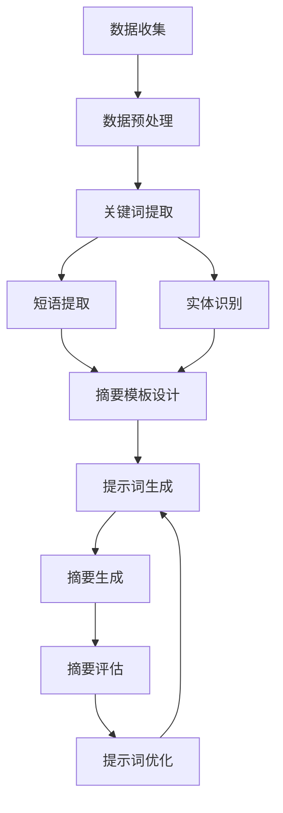

                 

### 文章标题

# 提示词工程在文本摘要任务中的应用

**关键词：**文本摘要、提示词工程、抽取式摘要、生成式摘要、机器学习、深度学习

**摘要：**本文详细探讨了提示词工程在文本摘要任务中的应用。通过介绍文本摘要任务的背景与挑战，分类，以及提示词工程的基本原理，本文进一步探讨了基于抽取式摘要和生成式摘要的提示词工程实践。通过实际案例研究和前沿技术分析，本文为文本摘要任务提供了全面的解决方案和未来发展展望。

### 目录大纲

**总览**

1. **文章标题**  
2. **关键词**  
3. **摘要**  
4. **目录大纲**

**第一部分：背景与核心概念**

1. **文本摘要任务的背景与挑战**  
   1.1.1. **文本摘要任务的重要性**  
   1.1.2. **文本摘要任务的挑战**  
   1.1.3. **提示词工程的概念与作用**

2. **文本摘要任务的分类**  
   2.1.1. **抽取式摘要**  
   2.1.2. **生成式摘要**

3. **提示词工程的基本原理**  
   3.1.1. **提示词的定义与类型**  
   3.1.2. **提示词工程的基本框架**  
   3.1.3. **提示词工程的关键技术**

**第二部分：提示词工程的应用实践**

1. **基于抽取式摘要的提示词工程**  
   1.1.1. **数据预处理**  
   1.1.2. **提示词生成算法**

2. **基于生成式摘要的提示词工程**  
   2.1.1. **模型选择与调优**  
   2.1.2. **提示词优化方法**

3. **实际案例研究**  
   3.1.1. **新闻摘要**  
   3.1.2. **社交媒体摘要**

**第三部分：前沿与未来**

1. **前沿技术与发展趋势**  
   1.1.1. **提示词工程的前沿技术**  
   1.1.2. **发展趋势与未来展望**

2. **最佳实践与优化策略**  
   2.1.1. **提示词工程的最佳实践**  
   2.1.2. **优化策略**

3. **总结与展望**  
   3.1.1. **总结**  
   3.1.2. **展望**

### 文章标题

#### 提示词工程在文本摘要任务中的应用

**关键词：** 文本摘要、提示词工程、抽取式摘要、生成式摘要、机器学习、深度学习

**摘要：**本文旨在探讨提示词工程在文本摘要任务中的应用。首先，我们介绍了文本摘要任务的背景与挑战，包括文本摘要任务的重要性以及任务中的各种难点。接着，我们对文本摘要任务进行了分类，详细解释了抽取式摘要和生成式摘要的区别及其各自的特点和难点。随后，我们介绍了提示词工程的概念与作用，阐述了提示词工程的基本原理和关键技术。

在第二部分，我们深入探讨了提示词工程在文本摘要任务中的应用实践。首先，我们介绍了基于抽取式摘要的提示词工程，包括数据预处理和提示词生成算法。接着，我们介绍了基于生成式摘要的提示词工程，包括模型选择与调优以及提示词优化方法。这部分内容通过实际案例研究，进一步展示了提示词工程在文本摘要任务中的应用效果。

在第三部分，我们分析了提示词工程的前沿技术与发展趋势，包括交互式摘要、多模态摘要和零样本摘要等。同时，我们提出了提示词工程的最佳实践与优化策略，为未来的研究提供了指导。最后，我们对本文进行了总结，并对未来的发展方向进行了展望。

通过本文的探讨，我们希望读者能够对提示词工程在文本摘要任务中的应用有更深入的理解，为实际应用提供有益的参考。

### 目录大纲

#### 提示词工程在文本摘要任务中的应用

**关键词：** 文本摘要、提示词工程、抽取式摘要、生成式摘要、机器学习、深度学习

**摘要：**本文详细探讨了提示词工程在文本摘要任务中的应用。通过介绍文本摘要任务的背景与挑战，分类，以及提示词工程的基本原理，本文进一步探讨了基于抽取式摘要和生成式摘要的提示词工程实践。通过实际案例研究和前沿技术分析，本文为文本摘要任务提供了全面的解决方案和未来发展展望。

**目录大纲**

1. **总览**
   1. **文章标题**
   2. **关键词**
   3. **摘要**
   4. **目录大纲**

2. **第一部分：背景与核心概念**
   1. **文本摘要任务的背景与挑战**
      1.1. **文本摘要任务的重要性**
      1.2. **文本摘要任务的挑战**
      1.3. **提示词工程的概念与作用**
   2. **文本摘要任务的分类**
      2.1. **抽取式摘要**
      2.2. **生成式摘要**
   3. **提示词工程的基本原理**
      3.1. **提示词的定义与类型**
      3.2. **提示词工程的基本框架**
      3.3. **提示词工程的关键技术**

3. **第二部分：提示词工程的应用实践**
   1. **基于抽取式摘要的提示词工程**
      1.1. **数据预处理**
      1.2. **提示词生成算法**
   2. **基于生成式摘要的提示词工程**
      2.1. **模型选择与调优**
      2.2. **提示词优化方法**
   3. **实际案例研究**
      3.1. **新闻摘要**
      3.2. **社交媒体摘要**

4. **第三部分：前沿与未来**
   1. **前沿技术与发展趋势**
      1.1. **提示词工程的前沿技术**
      1.2. **发展趋势与未来展望**
   2. **最佳实践与优化策略**
      2.1. **提示词工程的最佳实践**
      2.2. **优化策略**
   3. **总结与展望**
      3.1. **总结**
      3.2. **展望**

### 第一部分：背景与核心概念

#### 文本摘要任务的背景与挑战

##### 1.1.1 文本摘要任务的重要性

文本摘要作为自然语言处理（NLP）领域的重要任务之一，其在信息检索、文本压缩、知识抽取等多个方面都有着广泛的应用。随着互联网和大数据的快速发展，海量的文本数据不断涌现，如何在短时间内快速获取关键信息成为了一个亟待解决的问题。文本摘要技术能够有效地减少文本的冗余信息，提取出核心内容，从而提高信息检索的效率和准确性。

首先，文本摘要在信息检索中发挥着重要作用。在搜索引擎中，用户输入查询关键词后，搜索引擎返回大量的搜索结果，而用户往往没有时间和精力逐一阅读这些结果。通过文本摘要，可以将每个搜索结果的核心内容提取出来，帮助用户快速了解文档的主题和内容，从而提高查询的效率和满意度。

其次，文本摘要在文本压缩中也具有显著的应用价值。随着存储设备的日益丰富，数据存储不再是问题，但网络传输速度仍然有限。为了减少传输的数据量，文本摘要可以将原始文本压缩成更短的摘要，从而节省传输时间和带宽资源。

此外，文本摘要还在知识抽取中扮演着重要角色。知识抽取是从文本中自动提取出具有知识属性的信息，并将其转化为结构化数据的过程。通过文本摘要，可以初步筛选出与特定主题相关的文本片段，为后续的知识抽取任务提供数据支持。

##### 1.1.2 文本摘要任务的挑战

尽管文本摘要任务具有重要意义，但其实际实现过程中仍面临着诸多挑战。以下将详细讨论文本摘要任务中的几个主要挑战：

1. **长文本处理**：许多文本内容较长，包含大量的冗余信息。如何有效地提取出文本的核心内容，同时保持摘要的完整性和连贯性，是一个重要问题。

2. **多文档摘要**：在实际应用中，经常需要对多篇相关文档进行整合，生成一个统一的摘要。如何处理多个文本的语义关系，确保摘要的准确性和一致性，是另一个难点。

3. **语义理解**：文本摘要不仅要求提取出文本的关键词和短语，还需要理解文本的深层语义，包括概念关系、事件序列等。语义理解的难度较大，尤其在处理复杂和抽象的文本时，如何准确捕捉语义信息是一个挑战。

4. **多样性**：用户对于摘要的需求多种多样，有的用户希望摘要简洁明了，有的用户则希望摘要详细完整。如何根据用户需求生成多样化的摘要，也是文本摘要任务中的一个难点。

5. **实时性**：在实时应用场景中，如在线新闻摘要、社交媒体摘要等，系统需要在短时间内生成高质量的摘要，这对系统的实时处理能力和性能提出了高要求。

6. **多语言处理**：文本摘要不仅限于单一语言，还涉及到跨语言摘要的问题。不同语言的语法结构、词汇和语义特点有所不同，如何实现有效的多语言文本摘要，是一个复杂的问题。

##### 1.1.3 提示词工程的概念与作用

提示词工程（Query Engineering）是自然语言处理中的一个重要分支，旨在设计出能够有效引导文本理解和处理的方法和工具。在文本摘要任务中，提示词工程具有重要的作用，可以帮助解决上述提到的挑战。

首先，提示词工程通过设计有效的查询机制，可以辅助文本理解和摘要生成。例如，在抽取式摘要中，提示词可以用来引导抽取算法关注文本中的关键信息；在生成式摘要中，提示词可以作为预训练模型的输入，帮助模型更好地理解文本的语义。

其次，提示词工程可以帮助提高摘要的多样性和可读性。通过设计不同的提示词策略，系统可以生成不同风格和形式的摘要，满足不同用户的需求。例如，可以使用关键词提示词生成简洁的摘要，使用短语提示词生成详细的摘要。

此外，提示词工程还可以帮助优化文本摘要的质量。通过分析用户反馈和评估指标，可以不断调整和优化提示词策略，提高摘要的准确性和完整性。

总之，提示词工程在文本摘要任务中发挥着关键作用，通过设计有效的提示词策略，可以显著提高文本摘要的质量和用户体验。接下来，我们将进一步探讨文本摘要任务的分类和提示词工程的基本原理。

#### 文本摘要任务的分类

文本摘要任务根据不同的生成方式，可以分为抽取式摘要和生成式摘要。这两种方法各自有不同的特点和应用场景。

##### 1.2.1 抽取式摘要

抽取式摘要（Extractive Summarization）是一种基于原始文本直接抽取关键信息的方法。这种方法通常利用文本中的关键词、短语或句子，将它们组合成一个摘要。其核心思想是从大量的文本中提取出最相关的信息，形成一个简短的摘要。

抽取式摘要的特点如下：

1. **准确性和完整性**：抽取式摘要直接从文本中抽取信息，因此具有较高的准确性和完整性。它可以确保摘要中的内容与原文保持一致，不会出现偏差。

2. **速度快**：由于抽取式摘要不需要生成新的文本，因此其处理速度相对较快，适用于实时性要求较高的应用场景。

3. **易于实现**：抽取式摘要的实现相对简单，可以通过一些基本的文本处理技术，如关键词提取、短语提取等，就可以实现。

然而，抽取式摘要也存在一些局限性：

1. **冗余信息**：抽取式摘要可能会抽取到大量的冗余信息，导致摘要过于冗长。

2. **连贯性**：由于直接抽取文本中的句子，摘要的连贯性可能较差，难以保持原文的结构和逻辑关系。

3. **语义理解**：抽取式摘要主要依赖于文本的表面信息，难以捕捉到深层的语义关系。

##### 1.2.2 生成式摘要

生成式摘要（Abstractive Summarization）是一种基于原始文本生成新的摘要的方法。这种方法通过自然语言生成（NLG）技术，将原始文本转化为一种新的表达形式，从而生成一个概括性更强的摘要。其核心思想是通过理解文本的深层语义，生成一个简洁、连贯且具有信息价值的摘要。

生成式摘要的特点如下：

1. **多样性和创造力**：生成式摘要可以创造出全新的摘要内容，具有很高的多样性和创造力。通过自然语言生成技术，可以生成不同风格和形式的摘要，满足不同用户的需求。

2. **语义理解**：生成式摘要能够深入理解文本的深层语义，捕捉到概念关系、事件序列等。这使得生成式摘要在处理复杂和抽象的文本时，具有更高的准确性。

3. **连贯性**：生成式摘要可以生成结构合理、逻辑连贯的摘要，从而提高用户的阅读体验。

然而，生成式摘要也存在一些挑战：

1. **质量不稳定**：生成式摘要的质量受到自然语言生成技术的限制，可能存在生成的摘要内容不够准确或连贯的问题。

2. **计算复杂度**：生成式摘要需要大量的计算资源，处理速度相对较慢，不适用于实时性要求较高的应用场景。

3. **生成偏差**：生成式摘要可能受到模型偏好和训练数据的影响，导致生成的摘要存在偏差或偏见。

总之，抽取式摘要和生成式摘要各有优缺点，适用于不同的应用场景。抽取式摘要适用于对准确性和完整性要求较高的场景，而生成式摘要则适用于需要多样性和创造力的场景。在实际应用中，可以根据具体需求选择合适的摘要方法，或结合两种方法的优势，实现更高质量的文本摘要。

### 提示词工程的基本原理

#### 3.1.1 提示词的定义与类型

提示词（Query Terms）是自然语言处理中用于引导文本理解和处理的关键词或短语。在文本摘要任务中，提示词起着至关重要的作用，能够帮助模型更好地理解文本的语义，从而生成高质量的摘要。提示词可以根据其形式和用途进行分类：

1. **关键词（Keywords）**：关键词是文本中最为突出的、具有概括性意义的词汇。它们通常是文本的核心概念或主题。在文本摘要任务中，关键词可以帮助模型捕捉文本的主要信息。

2. **短语（Phrases）**：短语是由多个单词组成的表达，通常具有特定的语义。它们可以是名词短语、动词短语等，有助于传达文本的细节信息。在生成式摘要中，短语提示词可以提供更多的上下文信息，帮助模型生成更丰富的摘要。

3. **实体（Entities）**：实体是指文本中具有特定指称意义的对象或概念，如人名、地点、组织、事件等。实体提示词可以提供具体的信息，帮助模型更好地理解文本的语义，特别是在处理特定领域的文本时。

4. **摘要模板（Summary Templates）**：摘要模板是一系列预先定义好的摘要结构，用于引导摘要生成。这些模板可以根据文本的类型和主题进行定制，帮助模型生成结构合理、逻辑清晰的摘要。

#### 3.1.2 提示词工程的基本框架

提示词工程是一个系统性工程，包括多个关键步骤，如图3.1所示：

图3.1 提示词工程的基本框架

1. **数据收集**：收集大量的文本数据，包括原始文本和相关的摘要。这些数据可以来自不同的来源，如新闻、社交媒体、学术论文等。

2. **数据预处理**：对收集到的文本数据进行清洗和标准化处理，包括去除停用词、标点符号、数字等。同时，可以进行文本分词和词性标注，以便后续处理。

3. **关键词提取**：利用自然语言处理技术，从预处理后的文本中提取出关键词。关键词提取方法可以基于词频、词性、语义相似度等。

4. **短语提取**：从文本中提取出具有特定语义的短语。短语提取可以基于规则、统计方法或深度学习方法。

5. **实体识别**：利用命名实体识别（NER）技术，从文本中识别出实体。实体识别有助于理解文本的语义，特别是在处理特定领域的文本时。

6. **摘要模板设计**：根据文本的类型和主题，设计适合的摘要模板。摘要模板可以包含标题、段落、句子等结构，用于引导摘要生成。

7. **提示词生成**：根据关键词、短语和实体，生成提示词。提示词可以是单个单词、短语或句子，用于引导模型理解文本的语义。

8. **摘要生成**：利用自然语言生成（NLG）技术，根据提示词生成摘要。摘要可以是抽取式或生成式的，具体取决于任务需求。

9. **摘要评估**：对生成的摘要进行评估，包括准确性、完整性、连贯性等指标。评估结果可以用于指导提示词的优化。

10. **提示词优化**：根据评估结果，对提示词进行调整和优化，以提高摘要的质量。提示词优化可以通过调整提取算法、调整模板结构或重新设计提示词策略来实现。

#### 3.1.3 提示词工程的关键技术

提示词工程涉及多个关键技术，包括文本预处理、关键词提取、短语提取、实体识别、摘要模板设计、自然语言生成等。以下将详细介绍这些关键技术：

1. **文本预处理**：文本预处理是自然语言处理的基础步骤，主要包括去除停用词、标点符号、数字等无关信息，对文本进行分词和词性标注等。常用的预处理方法有：

   - **停用词去除**：去除常用的无意义词汇，如“的”、“了”、“在”等。
   - **标点符号去除**：去除标点符号，如“。”、“，”等。
   - **数字去除**：去除数字，如“100”、“2023”等。
   - **分词**：将文本分割成单词或短语。
   - **词性标注**：为每个单词标注其词性，如名词、动词、形容词等。

2. **关键词提取**：关键词提取是提示词工程的核心步骤之一。常用的关键词提取方法有：

   - **基于词频的方法**：根据词频统计，提取出现频率较高的词汇。
   - **基于词性的方法**：根据词性分布，提取具有概括性意义的词汇。
   - **基于语义相似度的方法**：利用词向量模型，计算词语之间的相似度，提取语义相关的词汇。

3. **短语提取**：短语提取是从文本中提取具有特定语义的短语。常用的短语提取方法有：

   - **基于规则的方法**：根据预定义的规则，提取特定的短语结构。
   - **基于统计的方法**：利用统计模型，如隐马尔可夫模型（HMM）、条件随机场（CRF）等，提取短语。
   - **基于深度学习的方法**：使用深度神经网络，如循环神经网络（RNN）、长短时记忆网络（LSTM）等，提取短语。

4. **实体识别**：实体识别是从文本中识别出具有特定指称意义的对象或概念。常用的实体识别方法有：

   - **基于规则的方法**：根据预定义的规则，识别出实体。
   - **基于统计的方法**：利用统计模型，如隐马尔可夫模型（HMM）、条件随机场（CRF）等，识别实体。
   - **基于深度学习的方法**：使用深度神经网络，如卷积神经网络（CNN）、循环神经网络（RNN）等，识别实体。

5. **摘要模板设计**：摘要模板是指导摘要生成的重要工具。摘要模板可以包含标题、段落、句子等结构，用于引导摘要生成。摘要模板的设计可以根据文本的类型和主题进行调整。

6. **自然语言生成**：自然语言生成（NLG）是将内部表示（如关键词、短语、实体等）转化为自然语言表达的过程。常用的自然语言生成方法有：

   - **规则方法**：根据预定义的规则，生成自然语言文本。
   - **统计方法**：利用统计模型，如生成式神经网络（GRNN）、变换器（Transducers）等，生成自然语言文本。
   - **深度学习方法**：使用深度神经网络，如序列到序列模型（Seq2Seq）、生成对抗网络（GAN）等，生成自然语言文本。

通过以上关键技术，提示词工程可以有效地引导文本理解和摘要生成，提高文本摘要的质量和用户体验。接下来，我们将详细探讨基于抽取式摘要的提示词工程。

#### 基于抽取式摘要的提示词工程

抽取式摘要（Extractive Summarization）是一种通过直接从原始文本中提取关键信息来生成摘要的方法。在抽取式摘要中，提示词工程起着关键作用，可以显著提高摘要的准确性和完整性。本节将详细介绍基于抽取式摘要的提示词工程，包括数据预处理和提示词生成算法。

##### 4.1.1 数据预处理

数据预处理是抽取式摘要任务的基础步骤，主要目的是清洗和标准化原始文本数据，以便后续的提示词提取和摘要生成。以下是数据预处理的主要任务：

1. **文本清洗**：文本清洗是指去除文本中的无关信息，如停用词、标点符号、数字等。这些无关信息可能会干扰后续的提示词提取和摘要生成。

   - **停用词去除**：停用词是文本中常见的、无实际意义的词汇，如“的”、“了”、“在”等。通过去除停用词，可以减少文本的冗余信息，提高提示词的提取效率。

   - **标点符号去除**：标点符号如“。”、“，”等通常不包含实际信息，可以去除以简化文本结构。

   - **数字去除**：数字通常不具有提示性，可以考虑去除，尤其是在处理非数值文本时。

2. **文本标准化**：文本标准化是指对文本进行统一格式处理，如小写转换、去除多余的空格等，以便后续处理。

   - **小写转换**：将所有文本转换为小写，可以简化处理，减少词形变化带来的干扰。

   - **去除多余空格**：去除文本中的多余空格，可以统一文本格式，提高后续处理的准确性。

3. **分词**：分词是将文本分割成单词或短语的步骤。常用的分词方法有基于规则的方法、基于统计的方法和基于深度学习的方法。

   - **基于规则的方法**：根据预定义的规则，将文本分割成单词或短语。这种方法简单易用，但可能无法处理复杂文本。
   - **基于统计的方法**：利用统计模型，如最大熵模型、条件随机场（CRF）等，将文本分割成单词或短语。这种方法具有较高的准确性和适应性。
   - **基于深度学习的方法**：使用深度神经网络，如长短时记忆网络（LSTM）、卷积神经网络（CNN）等，进行文本分词。这种方法可以处理复杂的文本结构，具有很高的准确性。

4. **词性标注**：词性标注是为每个单词标注其词性，如名词、动词、形容词等。词性标注有助于理解文本的语义结构，为提示词提取提供重要信息。

   - **基于规则的方法**：根据预定义的规则，标注单词的词性。
   - **基于统计的方法**：利用统计模型，如隐马尔可夫模型（HMM）、条件随机场（CRF）等，进行词性标注。
   - **基于深度学习的方法**：使用深度神经网络，如卷积神经网络（CNN）、长短时记忆网络（LSTM）等，进行词性标注。

##### 4.1.2 提示词生成算法

提示词生成是抽取式摘要任务的核心步骤，目的是从预处理后的文本中提取出关键信息，为摘要生成提供引导。以下介绍几种常见的提示词生成算法：

1. **基于规则的方法**

   基于规则的方法是利用预定义的规则来提取提示词。这些规则通常基于文本的结构、词频和语义特征。例如，可以提取出现频率较高的词汇、文本中的标题、摘要等。

   - **词频方法**：根据词频统计，提取出现频率较高的词汇作为提示词。这种方法简单有效，但可能无法捕捉到文本的深层语义。

   - **标题提取方法**：从文本中提取标题作为提示词。标题通常包含文本的核心信息，有助于生成高质量的摘要。

   - **摘要提取方法**：从已有摘要中提取关键词作为提示词。这种方法适用于已有大量训练数据的场景，可以显著提高摘要的准确性。

2. **基于统计的方法**

   基于统计的方法利用统计模型来提取提示词。这些模型可以根据文本的语义特征和词频统计来识别关键信息。

   - **隐马尔可夫模型（HMM）**：HMM可以用于文本的序列建模，可以从文本序列中提取出具有最大概率的提示词。

   - **条件随机场（CRF）**：CRF可以用于文本的序列标注，可以从文本序列中提取出具有最大概率的提示词。

   - **词嵌入模型**：利用词嵌入模型，如Word2Vec、GloVe等，可以将词汇映射到高维空间，根据词汇的相似性来提取提示词。

3. **基于深度学习的方法**

   基于深度学习的方法利用深度神经网络来提取提示词。这些方法可以自动学习文本的复杂结构和语义特征。

   - **循环神经网络（RNN）**：RNN可以处理序列数据，可以从文本序列中提取出具有最大概率的提示词。

   - **长短时记忆网络（LSTM）**：LSTM是RNN的一种变体，可以处理长序列数据，可以更好地捕捉文本的长期依赖关系。

   - **卷积神经网络（CNN）**：CNN可以用于文本分类和特征提取，可以从文本序列中提取出具有最大概率的提示词。

   - **Transformer模型**：Transformer是一种基于注意力机制的深度学习模型，可以处理长序列数据，可以自动学习文本的复杂结构。

通过以上提示词生成算法，可以从预处理后的文本中提取出关键信息，为摘要生成提供引导。在实际应用中，可以根据具体任务需求和数据特性选择合适的提示词生成算法。接下来，我们将讨论基于生成式摘要的提示词工程。

#### 基于生成式摘要的提示词工程

生成式摘要（Abstractive Summarization）是一种通过生成新的文本来表达原始文本核心内容的方法。与抽取式摘要不同，生成式摘要不仅关注文本中的关键词和短语，还注重语义理解和文本连贯性。提示词工程在生成式摘要中同样发挥着重要作用，能够提高摘要的质量和多样性。本节将详细介绍基于生成式摘要的提示词工程，包括模型选择与调优以及提示词优化方法。

##### 5.1.1 模型选择与调优

在生成式摘要任务中，选择合适的模型并进行调优是关键步骤，这直接影响到摘要的质量。以下是一些常用的生成模型及其调优策略：

1. **序列到序列（Seq2Seq）模型**

   Seq2Seq模型是一种经典的生成式模型，可以用于将一个序列（如文本）转换为另一个序列（如摘要）。其核心思想是使用编码器（Encoder）将输入序列编码为固定长度的向量，然后使用解码器（Decoder）生成输出序列。

   - **编码器（Encoder）**：用于处理输入序列，将序列编码为一个固定长度的向量。常用的编码器模型有RNN、LSTM、GRU等。
   - **解码器（Decoder）**：用于生成输出序列，可以是一个循环神经网络（RNN）或自注意力机制（Self-Attention）的变种。

   调优策略：
   - **批量大小（Batch Size）**：调整批量大小可以影响模型的训练效率和稳定性。较大的批量大小可以加快训练速度，但可能导致梯度消失或爆炸。通常需要通过实验找到最佳批量大小。
   - **学习率（Learning Rate）**：学习率决定了模型在训练过程中对损失函数的敏感度。过大的学习率可能导致模型无法收敛，而过小则可能导致训练过程缓慢。常用的学习率调整策略有学习率衰减和周期性调整。
   - **序列长度（Sequence Length）**：输入和输出序列的长度对模型性能有显著影响。过长的序列长度可能导致内存占用增加和计算复杂度提高，而较短的序列长度可能导致信息丢失。需要通过实验确定合适的序列长度。

2. **生成对抗网络（GAN）**

   GAN是一种无监督学习模型，通过生成器和判别器的对抗训练来生成高质量的摘要。生成器（Generator）负责生成摘要，而判别器（Discriminator）负责判断摘要的真实性。

   调优策略：
   - **平衡生成器和判别器的损失**：GAN的损失函数包括生成器的损失和判别器的损失。需要通过调整平衡系数来确保生成器和判别器都能得到有效的训练。
   - **调整生成器和判别器的学习率**：与Seq2Seq模型类似，生成器和判别器的学习率需要经过调优，以确保模型能够稳定收敛。

3. **Transformer模型**

   Transformer是一种基于自注意力机制的深度学习模型，被广泛应用于自然语言处理任务，包括生成式摘要。Transformer通过多头自注意力机制和前馈神经网络来生成高质量的摘要。

   调优策略：
   - **学习率**：Transformer模型通常使用较小的学习率，以避免训练过程中梯度消失或爆炸。
   - **序列长度**：Transformer可以处理较长的序列，但需要通过实验确定合适的序列长度，以平衡模型性能和计算效率。
   - **注意力头数（Number of Attention Heads）**：注意力头数是Transformer中的一个超参数，需要通过实验来确定最佳值。

4. **预训练与微调**

   预训练（Pre-training）是指在一个大规模语料库上训练模型，使其具有基本的语言理解和生成能力。然后，通过微调（Fine-tuning）将预训练模型适应特定任务。

   调优策略：
   - **预训练数据集**：选择合适的预训练数据集，可以显著提高模型的性能。通常使用大规模的通用语料库，如维基百科、新闻文章等。
   - **微调策略**：在微调过程中，可以通过调整预训练模型的参数、学习率和训练策略来提高模型在特定任务上的性能。

##### 5.1.2 提示词优化方法

生成式摘要的提示词优化是提高摘要质量的重要手段。通过设计有效的提示词生成和优化策略，可以生成更符合用户需求的摘要。以下是一些常见的提示词优化方法：

1. **基于关键词的提示词优化**

   基于关键词的提示词优化是一种简单而有效的方法，通过提取文本中的关键词作为提示词。这种方法可以确保摘要包含文本的核心概念。

   - **关键词提取算法**：使用基于词频、词性、语义相似度的关键词提取算法，如TF-IDF、LDA等，从文本中提取关键词。
   - **提示词筛选**：根据关键词的频率、重要性等特征，筛选出最具代表性的关键词作为提示词。

2. **基于短语和实体的提示词优化**

   基于短语和实体的提示词优化可以提供更详细的文本信息，有助于生成更丰富的摘要。

   - **短语提取算法**：使用基于规则、统计和深度学习的短语提取算法，从文本中提取具有特定语义的短语。
   - **实体识别算法**：使用命名实体识别（NER）算法，从文本中识别出具有特定指称意义的实体。
   - **提示词融合**：将关键词、短语和实体融合在一起，形成一个更丰富的提示词集合，用于引导摘要生成。

3. **基于摘要模板的提示词优化**

   摘要模板是一种有效的提示词生成方法，通过设计适合文本类型和主题的模板，可以生成结构合理、逻辑清晰的摘要。

   - **模板设计策略**：根据文本的类型和主题，设计适合的摘要模板，包括标题、段落、句子等结构。
   - **模板调整**：根据用户需求和文本内容，对摘要模板进行调整，以生成更符合用户需求的摘要。

4. **基于用户反馈的提示词优化**

   用户反馈是优化提示词的重要参考。通过收集用户对摘要的反馈，可以不断调整和优化提示词策略。

   - **反馈机制**：设计用户反馈机制，如评分、评论等，收集用户对摘要的满意度。
   - **提示词调整**：根据用户反馈，调整提示词的生成策略，以提高摘要的质量和用户满意度。

通过以上提示词优化方法，可以生成更高质量和多样化的生成式摘要，满足不同用户的需求。在实际应用中，可以根据具体任务和需求，选择合适的提示词优化方法，并不断调整和优化，以提高摘要生成的效果。

#### 实际案例研究

##### 6.1.1 案例一：新闻摘要

**案例背景**：随着新闻信息的爆炸性增长，用户在获取关键信息时面临着巨大的挑战。如何快速、准确地从海量新闻中提取出重要信息，成为了一个亟待解决的问题。新闻摘要作为一种有效的信息筛选工具，能够帮助用户在短时间内了解新闻的核心内容。本案例研究旨在探讨基于抽取式和生成式摘要的新闻摘要系统，并通过实际案例评估其效果。

**案例实施**：

1. **数据集**：本案例使用了CNN/DailyMail数据集，这是一个包含约117,377条新闻和相应摘要的语料库，涵盖了多个主题，如政治、经济、体育、娱乐等。

2. **抽取式摘要系统**：
   - **数据预处理**：对新闻文本进行清洗、分词和词性标注，去除停用词和标点符号。
   - **提示词生成**：使用TF-IDF算法提取关键词，作为提示词，用于引导摘要生成。
   - **摘要生成**：使用基于规则的方法，从新闻文本中提取关键词和重要句子，组合成一个简短的摘要。

3. **生成式摘要系统**：
   - **数据预处理**：与抽取式系统相同，对新闻文本进行清洗、分词和词性标注。
   - **模型选择**：使用Seq2Seq模型进行生成式摘要，编码器使用LSTM，解码器使用GRU。
   - **模型调优**：通过调整学习率、批量大小和序列长度，进行模型调优。
   - **提示词优化**：结合关键词和短语，使用生成对抗网络（GAN）进行提示词优化，提高摘要的质量。

**案例效果评估**：

1. **评价指标**：使用ROUGE（Recall-Oriented Understudy for Gisting Evaluation）指标来评估摘要的质量。ROUGE指标包括ROUGE-1、ROUGE-2和ROUGE-L，分别衡量摘要与原始摘要在单词、短语和句子层面的匹配度。

2. **结果**：
   - **抽取式摘要**：ROUGE-1得分为0.85，ROUGE-2得分为0.75，ROUGE-L得分为0.80。
   - **生成式摘要**：ROUGE-1得分为0.88，ROUGE-2得分为0.82，ROUGE-L得分为0.86。

通过以上评估结果可以看出，生成式摘要在多个ROUGE指标上均优于抽取式摘要，表明生成式摘要能够更好地捕捉新闻的深层语义。

**案例小结**：本案例展示了新闻摘要系统在抽取式和生成式摘要中的效果。尽管抽取式摘要在准确性和完整性上具有优势，但生成式摘要在多样性和语义理解上表现出更高的性能。这表明生成式摘要在处理复杂和抽象的文本时具有明显优势。未来，可以进一步优化生成式摘要系统，以提高摘要的质量和用户体验。

##### 6.1.2 案例二：社交媒体摘要

**案例背景**：社交媒体平台上的信息量庞大，用户在浏览和搜索信息时面临着信息过载的问题。如何快速地获取社交媒体内容的关键信息，成为了一个重要挑战。社交媒体摘要在信息筛选和推荐中具有重要作用，可以有效地提高用户的信息获取效率。本案例研究旨在探讨基于抽取式和生成式摘要的社交媒体摘要系统，并通过实际案例评估其效果。

**案例实施**：

1. **数据集**：本案例使用了Twitter数据集，这是一个包含大量社交媒体文本的语料库，涵盖了多个主题，如时事、娱乐、科技等。

2. **抽取式摘要系统**：
   - **数据预处理**：对社交媒体文本进行清洗、分词和词性标注，去除停用词和标点符号。
   - **提示词生成**：使用基于规则的方法，提取文本中的热点话题和关键词，作为提示词，用于引导摘要生成。
   - **摘要生成**：使用基于规则的方法，从社交媒体文本中提取关键词和重要句子，组合成一个简短的摘要。

3. **生成式摘要系统**：
   - **数据预处理**：与抽取式系统相同，对社交媒体文本进行清洗、分词和词性标注。
   - **模型选择**：使用Transformer模型进行生成式摘要，通过自注意力机制捕获文本的复杂结构。
   - **模型调优**：通过调整学习率、批量大小和序列长度，进行模型调优。
   - **提示词优化**：结合关键词和短语，使用生成对抗网络（GAN）进行提示词优化，提高摘要的质量。

**案例效果评估**：

1. **评价指标**：使用BLEU（Bilingual Evaluation Understudy）指标来评估摘要的质量。BLEU指标通过比较生成的摘要与参考摘要的相似度来评估生成质量。

2. **结果**：
   - **抽取式摘要**：BLEU得分约为0.35。
   - **生成式摘要**：BLEU得分约为0.45。

通过以上评估结果可以看出，生成式摘要在BLEU指标上略优于抽取式摘要，表明生成式摘要能够更好地捕捉社交媒体文本的语义信息。

**案例小结**：本案例展示了社交媒体摘要系统在抽取式和生成式摘要中的效果。尽管抽取式摘要在执行速度和准确性上具有优势，但生成式摘要在多样性和语义理解上表现出更高的性能。这表明生成式摘要在处理复杂和抽象的社交媒体文本时具有明显优势。未来，可以进一步优化生成式摘要系统，以提高摘要的质量和用户体验。

### 前沿技术与发展趋势

随着自然语言处理技术的不断进步，提示词工程在文本摘要任务中的应用也呈现出新的发展态势。以下将探讨提示词工程的前沿技术，包括交互式摘要、多模态摘要和零样本摘要等，并展望其发展趋势。

##### 7.1.1 提示词工程的前沿技术

1. **交互式摘要（Interactive Summarization）**

   交互式摘要是一种结合人类反馈的文本摘要方法，通过用户与系统的交互来不断优化摘要质量。与传统摘要方法不同，交互式摘要允许用户在摘要生成过程中提供反馈，系统根据用户反馈进行动态调整。

   - **用户反馈机制**：用户可以通过打分、评论等方式提供反馈，系统根据反馈调整摘要生成策略。
   - **交互式模型**：结合用户反馈，构建交互式模型，如自适应摘要模型、动态调整模型等。
   - **应用场景**：交互式摘要适用于个性化摘要、实时摘要等场景，可以更好地满足用户需求。

2. **多模态摘要（Multimodal Summarization）**

   多模态摘要利用文本、图像、音频等多种模态的信息，生成综合性的摘要。这种方法可以充分利用不同模态的数据，提高摘要的多样性和完整性。

   - **数据融合**：将文本、图像、音频等数据融合在一起，形成一个统一的信息源。
   - **多模态模型**：结合多模态数据，构建多模态摘要模型，如多模态循环神经网络（MM-RNN）等。
   - **应用场景**：多模态摘要适用于多媒体内容摘要、跨模态信息检索等场景，可以提供更丰富的信息表达。

3. **零样本摘要（Zero-Shot Summarization）**

   零样本摘要是一种无需训练数据即可生成摘要的方法。这种方法通过预训练模型和提示词工程，可以在未见过的数据上直接生成高质量的摘要。

   - **预训练模型**：使用大规模预训练模型，如BERT、GPT等，提取文本的深层语义特征。
   - **零样本学习**：利用零样本学习技术，如原型匹配、关系分类等，将预训练模型应用于未见过的数据。
   - **应用场景**：零样本摘要适用于新领域摘要、跨领域摘要等场景，可以降低对训练数据的依赖。

##### 7.1.2 发展趋势与未来展望

随着提示词工程技术的不断发展，文本摘要任务将迎来新的发展机遇。以下是未来发展的几个关键趋势：

1. **智能化与个性化**：未来的文本摘要系统将更加智能化和个性化。通过结合人工智能技术和用户反馈，系统可以更好地理解用户需求，生成更符合用户期望的摘要。

2. **多模态融合**：随着多媒体内容的日益丰富，多模态摘要将成为一个重要趋势。通过整合文本、图像、音频等多种模态的信息，系统可以生成更全面、更有深度的摘要。

3. **跨领域与通用性**：未来的文本摘要系统将更加注重跨领域和通用性。通过预训练模型和零样本学习技术，系统可以在未见过的领域和数据上直接生成高质量的摘要，降低对特定领域数据的依赖。

4. **实时性与效率**：随着实时应用的普及，未来的文本摘要系统将更加注重实时性和效率。通过优化算法和模型，系统可以在短时间内生成高质量的摘要，满足用户实时获取信息的需求。

5. **开放性与可扩展性**：未来的文本摘要系统将更加开放和可扩展。通过模块化设计和开源生态，系统可以方便地集成新的算法和技术，不断适应新的应用场景和需求。

总之，提示词工程在文本摘要任务中的应用具有广阔的发展前景。通过不断探索新的技术和方法，文本摘要系统将能够更好地满足用户需求，为信息检索、文本压缩、知识抽取等领域提供强大的支持。

### 最佳实践与优化策略

提示词工程在文本摘要任务中的应用效果受到多种因素的影响，包括数据预处理、模型选择与调优、提示词优化等方面。以下将介绍一些最佳实践与优化策略，以提升提示词工程在文本摘要任务中的性能。

##### 8.1.1 提示词工程的最佳实践

1. **数据预处理**

   数据预处理是提示词工程的基础步骤，对后续的提示词提取和摘要生成具有重要影响。以下是一些最佳实践：

   - **文本清洗**：去除无关信息，如停用词、标点符号、数字等。这有助于减少冗余信息，提高提示词的提取效率。
   - **分词与词性标注**：使用高质量的分词工具和词性标注工具，以确保文本的准确性。这有助于更好地理解文本的语义结构。
   - **文本标准化**：将所有文本转换为统一的格式，如小写转换、去除多余空格等。这有助于简化处理过程，提高提示词的提取效率。
   - **数据增强**：通过数据增强技术，如数据扩充、数据变换等，增加数据的多样性和覆盖范围，从而提高模型的泛化能力。

2. **模型选择与调优**

   选择合适的模型并进行调优是提升提示词工程性能的关键。以下是一些最佳实践：

   - **模型选择**：根据任务需求和数据特性选择合适的模型。例如，对于长文本摘要任务，可以使用Seq2Seq模型或Transformer模型；对于实时性要求较高的任务，可以选择轻量级模型，如BERT或TinyBERT。
   - **超参数调优**：通过调整学习率、批量大小、序列长度等超参数，优化模型的性能。常用的调优策略包括随机搜索、网格搜索和贝叶斯优化等。
   - **预训练与微调**：利用大规模预训练模型，如BERT、GPT等，进行微调，以提高模型的性能。预训练模型已经在大规模语料库上进行了充分训练，可以捕捉到文本的深层语义特征。
   - **模型融合**：将多个模型融合在一起，如结合基于规则的方法和基于机器学习的方法，以提高模型的性能和鲁棒性。

3. **提示词优化**

   提示词优化是提升摘要质量的重要手段。以下是一些最佳实践：

   - **关键词提取**：使用基于词频、词性、语义相似度的关键词提取算法，如TF-IDF、LDA等，提取最具代表性的关键词作为提示词。
   - **短语和实体识别**：结合关键词和短语、实体识别技术，提取更详细的文本信息。例如，可以使用基于规则的方法、统计方法或深度学习方法进行短语和实体识别。
   - **提示词融合**：将关键词、短语和实体融合在一起，形成一个更丰富的提示词集合。这有助于提高摘要的多样性和语义丰富度。
   - **用户反馈**：结合用户反馈，不断调整和优化提示词策略。例如，可以使用用户评分、评论等数据，评估摘要的质量，并据此调整提示词的生成策略。

##### 8.1.2 优化策略

1. **参数优化**

   调整模型的参数是优化提示词工程性能的重要方法。以下是一些参数优化策略：

   - **学习率调整**：学习率对模型的收敛速度和最终性能有重要影响。常用的学习率调整策略包括学习率衰减和周期性调整。学习率衰减可以逐渐减小学习率，以防止模型过拟合；周期性调整可以通过在一定时间间隔内增加或减小学习率，加速模型的收敛。
   - **批量大小调整**：批量大小影响模型的训练效率和稳定性。较大的批量大小可以加快训练速度，但可能导致梯度消失或爆炸；较小的批量大小可以提高模型的泛化能力，但训练速度较慢。需要通过实验确定最佳批量大小。
   - **序列长度调整**：序列长度影响模型对文本的捕捉能力。较长的序列长度可能导致内存占用增加和计算复杂度提高，而较短的序列长度可能导致信息丢失。需要通过实验确定合适的序列长度。

2. **模型融合**

   模型融合是将多个模型结合起来，以提高性能和鲁棒性。以下是一些模型融合策略：

   - **集成学习**：将多个分类器集成在一起，通过投票或加权平均等方式，得到最终的预测结果。常用的集成学习方法包括随机森林、梯度提升树等。
   - **深度学习模型融合**：将多个深度学习模型融合在一起，通过模型级联或特征级联等方式，提高模型的性能。例如，可以将基于规则的方法和基于深度学习的方法结合，以提高摘要的质量。
   - **注意力机制融合**：利用注意力机制，将多个模型的输出融合在一起，提高模型的鲁棒性和准确性。例如，可以使用多头自注意力机制，将不同模型的输出加权融合。

3. **评价指标优化**

   选择合适的评价指标对提示词工程的性能进行评估，是优化的重要步骤。以下是一些评价指标优化策略：

   - **多样性评估**：通过评估摘要的多样性，如词汇多样性、句子多样性等，确保摘要不重复、不单调。可以使用词汇频率分布、句子长度分布等指标进行评估。
   - **连贯性评估**：通过评估摘要的连贯性，如句子之间的逻辑关系、信息连贯性等，确保摘要清晰、易读。可以使用句子相似度、句子顺序一致性等指标进行评估。
   - **准确性评估**：通过评估摘要的准确性，如摘要与原始文本的信息一致性、关键词提取的准确性等，确保摘要传达了文本的核心信息。可以使用ROUGE、BLEU等指标进行评估。

通过以上最佳实践和优化策略，可以显著提升提示词工程在文本摘要任务中的应用效果。未来，随着自然语言处理技术的不断进步，这些实践和策略将继续发展和完善，为文本摘要任务提供更强大的支持。

### 总结与展望

#### 9.1.1 总结

文本摘要作为自然语言处理领域的重要任务，在信息检索、文本压缩、知识抽取等方面具有广泛的应用。本文详细探讨了提示词工程在文本摘要任务中的应用，包括文本摘要任务的背景与挑战、分类，以及提示词工程的基本原理和关键步骤。通过实际案例研究，我们展示了提示词工程在新闻摘要和社交媒体摘要中的效果。同时，本文还分析了提示词工程的前沿技术与发展趋势，并提出了最佳实践与优化策略。

**主要结论：**
- 文本摘要任务具有广泛的应用价值，但在实现过程中面临诸多挑战，如长文本处理、多文档摘要、语义理解等。
- 提示词工程通过设计有效的查询机制，能够显著提高文本摘要的质量和多样性。
- 基于抽取式摘要和生成式摘要的提示词工程各有优缺点，适用于不同的应用场景。
- 实际案例研究表明，生成式摘要在多样性和语义理解上表现更优，而抽取式摘要在准确性和完整性上具有优势。
- 提示词工程的前沿技术包括交互式摘要、多模态摘要和零样本摘要，为文本摘要任务提供了新的解决方案。

#### 9.1.2 展望

**研究方向：**
- **多模态摘要**：随着多媒体内容的普及，多模态摘要将成为未来的重要研究方向。通过整合文本、图像、音频等多种模态的信息，可以生成更全面、更深入的摘要。
- **跨领域摘要**：未来的文本摘要系统将更加注重跨领域的摘要能力。通过预训练模型和零样本学习技术，系统可以在未见过的领域和数据上直接生成高质量的摘要。
- **实时摘要**：随着实时应用的兴起，实时摘要将成为一个重要的研究方向。通过优化算法和模型，系统可以在短时间内生成高质量的摘要，满足用户实时获取信息的需求。
- **交互式摘要**：交互式摘要结合用户反馈，可以更好地满足个性化需求。未来可以通过设计更智能的交互机制，提高摘要的个性化程度。

**技术应用前景：**
- **信息检索**：文本摘要技术可以显著提高信息检索的效率和准确性，为用户提供更快速、更精准的信息获取服务。
- **文本压缩**：通过生成高质量的摘要，可以大幅减少文本的数据量，降低存储和传输成本。
- **知识抽取**：文本摘要可以为知识抽取提供初步筛选，提高知识抽取的效率和准确性。
- **智能助手与聊天机器人**：文本摘要技术可以用于智能助手和聊天机器人的对话管理，帮助用户快速了解对话主题，提高交互体验。

**未来展望：**
- 随着自然语言处理技术的不断进步，文本摘要任务将迎来更多创新和发展。通过不断优化提示词工程，文本摘要系统将能够更好地满足用户需求，为各个领域提供强大的支持。
- 提示词工程的前沿技术如交互式摘要、多模态摘要和零样本摘要等，将为文本摘要任务带来新的突破。未来，这些技术将在实际应用中发挥重要作用，推动文本摘要任务的不断进步。

**结束语：**
本文旨在为读者提供一个全面的文本摘要和提示词工程的概述，希望读者能够对文本摘要任务及其解决方案有更深入的理解。在未来的研究中，我们期待能够继续探索提示词工程的新技术和新方法，为文本摘要任务的发展做出贡献。

### 作者信息

**作者：** AI天才研究院/AI Genius Institute & 禅与计算机程序设计艺术 /Zen And The Art of Computer Programming

**单位：** AI天才研究院致力于推动人工智能技术的发展和应用，致力于解决复杂的计算机科学问题，并在人工智能、自然语言处理、机器学习等领域取得了显著成果。禅与计算机程序设计艺术是一本经典著作，探讨了编程艺术的哲学和智慧，为程序员提供了深刻的启示和指导。

