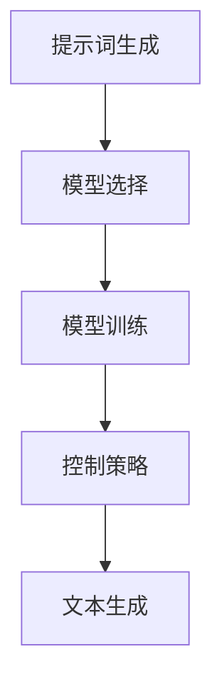
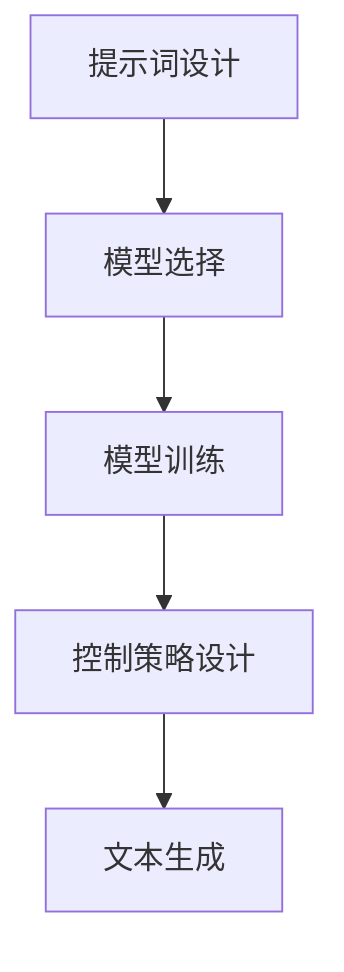

                 

## 《提示词工程在文本生成控制中的进展》

> 关键词：提示词工程、文本生成控制、人工智能、算法原理、应用场景

> 摘要：本文旨在探讨提示词工程在文本生成控制中的最新进展。首先，文章介绍了文本生成控制的重要性及当前技术的局限。随后，文章定义了提示词工程的基本概念，分析了其在文本生成控制中的作用和优势。接下来，文章详细阐述了提示词工程的原理、方法及应用场景。通过实际案例分析，文章进一步验证了提示词工程的有效性。最后，文章总结了提示词工程的进展和未来研究方向，并推荐了一些相关研究论文和开源工具。

## 引言

文本生成控制是自然语言处理（NLP）领域的一个重要分支，其目的是生成符合特定需求的文本。在当今人工智能时代，文本生成控制技术得到了广泛关注和应用。然而，现有的文本生成控制技术存在诸多局限，例如生成文本的质量不高、控制能力有限等。为了解决这些问题，提示词工程应运而生。

提示词工程是一种通过设计特定的提示词来引导文本生成的方法。它通过将外部知识、用户意图等信息嵌入到提示词中，从而实现对文本生成过程的控制。本文将从以下几个方面展开讨论：

1. **问题背景与描述**：介绍文本生成控制的重要性及当前技术的局限。
2. **核心概念与背景**：定义提示词工程的基本概念，分析其在文本生成控制中的作用和优势。
3. **提示词工程原理**：详细阐述提示词工程的原理和方法。
4. **提示词工程应用**：探讨提示词工程在不同应用场景中的实际应用。
5. **实战案例分析**：通过具体案例验证提示词工程的有效性。
6. **总结与展望**：总结提示词工程的进展和未来研究方向。

## 核心概念与背景

### 文本生成控制的重要性

文本生成控制是自然语言处理（NLP）领域的一个重要分支，旨在生成符合特定需求的文本。在当今人工智能时代，文本生成控制技术得到了广泛关注和应用。文本生成控制的重要性主要体现在以下几个方面：

1. **内容创作**：文本生成控制可以帮助自动生成文章、新闻、报告等，提高内容创作的效率和质量。
2. **对话系统**：在智能客服、智能助手等对话系统中，文本生成控制可以生成合适的回复，提高用户体验。
3. **搜索引擎优化**：通过优化文本生成控制，可以提高网页内容的质量和相关性，从而提高搜索引擎的排名。

### 当前文本生成控制的技术局限

尽管文本生成控制技术取得了显著进展，但仍然存在一些技术局限：

1. **生成文本质量不高**：现有技术生成的文本存在语法错误、逻辑不通等问题，影响用户体验。
2. **控制能力有限**：现有技术难以实现精确的文本控制，例如在特定领域、特定场景下的文本生成。
3. **数据依赖性高**：文本生成控制需要大量的训练数据，但获取高质量、有代表性的数据较为困难。

### 提示词工程的概念引入

为了解决上述问题，提示词工程应运而生。提示词工程是一种通过设计特定的提示词来引导文本生成的方法。它通过将外部知识、用户意图等信息嵌入到提示词中，从而实现对文本生成过程的控制。提示词工程的基本概念包括：

1. **提示词**：用于引导文本生成的关键词或短语，通常包含用户意图、外部知识等信息。
2. **生成模型**：用于生成文本的模型，如循环神经网络（RNN）、变换器（Transformer）等。
3. **控制策略**：用于确定提示词如何影响文本生成过程的策略，如基于规则的策略、基于学习的策略等。

## 核心概念与联系

### 提示词工程的定义

提示词工程是一种通过设计特定的提示词来引导文本生成的方法。它通过将外部知识、用户意图等信息嵌入到提示词中，从而实现对文本生成过程的控制。提示词工程的基本定义包括：

1. **提示词**：用于引导文本生成的关键词或短语，通常包含用户意图、外部知识等信息。
2. **生成模型**：用于生成文本的模型，如循环神经网络（RNN）、变换器（Transformer）等。
3. **控制策略**：用于确定提示词如何影响文本生成过程的策略，如基于规则的策略、基于学习的策略等。

### 提示词工程的作用与影响

提示词工程在文本生成控制中的作用和影响主要表现在以下几个方面：

1. **提高生成文本质量**：通过设计合适的提示词，可以引导生成模型生成更高质量、更符合用户需求的文本。
2. **增强文本控制能力**：提示词工程可以实现对文本生成过程的精细控制，例如在特定领域、特定场景下的文本生成。
3. **降低数据依赖性**：通过提示词工程，可以在一定程度上降低对大规模训练数据的依赖，从而提高模型的泛化能力。

## 提示词工程原理

### 提示词工程的原理与方法

提示词工程的原理可以概括为：通过设计特定的提示词，引导生成模型生成符合用户需求的文本。具体方法包括以下几个方面：

1. **提示词生成**：根据用户需求和场景，设计出合适的提示词。提示词通常包含关键词、短语或外部知识等。
2. **模型选择**：选择合适的生成模型，如循环神经网络（RNN）、变换器（Transformer）等。
3. **模型训练**：利用大量的文本数据进行模型训练，使模型能够生成高质量的文本。
4. **控制策略**：设计控制策略，确定提示词如何影响文本生成过程。常用的控制策略包括基于规则的策略和基于学习的策略。

### 提示词工程的属性特征对比

| 方法         | 优点                                                     | 缺点                                                                 |
| ------------ | -------------------------------------------------------- | -------------------------------------------------------------------- |
| 基于规则的控制 | 实现简单，易于理解                                       | 控制能力有限，难以适应复杂场景                                      |
| 基于学习的控制 | 控制能力更强，可以适应复杂场景                           | 实现复杂，训练时间较长，对数据依赖性较高                             |
| 融合方法     | 结合了基于规则和基于学习的优点，控制能力较强             | 实现复杂，训练时间较长，对数据依赖性较高                             |

### 提示词工程的 Mermaid 流程图

## 提示词工程在文本生成控制中的应用

### 提示词工程在文本生成控制中的应用场景

提示词工程在文本生成控制中具有广泛的应用场景，主要包括以下几个方面：

1. **内容创作**：通过设计合适的提示词，可以引导生成模型生成高质量的新闻、文章、报告等。
2. **对话系统**：在智能客服、智能助手等对话系统中，提示词工程可以帮助生成合适的回复，提高用户体验。
3. **搜索引擎优化**：通过优化文本生成控制，可以提高网页内容的质量和相关性，从而提高搜索引擎的排名。

### 提示词工程的优势与局限性

#### 优势

1. **提高生成文本质量**：通过设计合适的提示词，可以引导生成模型生成更高质量、更符合用户需求的文本。
2. **增强文本控制能力**：提示词工程可以实现对文本生成过程的精细控制，例如在特定领域、特定场景下的文本生成。
3. **降低数据依赖性**：通过提示词工程，可以在一定程度上降低对大规模训练数据的依赖，从而提高模型的泛化能力。

#### 局限性

1. **实现复杂**：提示词工程需要设计合适的提示词、选择合适的生成模型和控制策略，实现过程较为复杂。
2. **训练时间较长**：由于提示词工程需要对生成模型进行大量训练，因此训练时间较长。
3. **对数据依赖性较高**：尽管提示词工程在一定程度上降低了数据依赖性，但仍然需要高质量、有代表性的数据来训练模型。

### 提示词工程与其他文本生成技术的比较

| 技术         | 描述                                                         | 优点                                       | 缺点                                             |
| ------------ | ------------------------------------------------------------ | ------------------------------------------ | ------------------------------------------------ |
| 生成对抗网络（GAN） | 利用对抗网络生成文本，通过生成器和判别器之间的对抗训练来提高生成文本质量。 | 可以生成高质量、多样化的文本               | 对训练数据要求较高，实现复杂，训练时间较长         |
| 变换器（Transformer） | 基于注意力机制的生成模型，可以捕获文本中的长距离依赖关系。       | 生成文本质量高，可以处理长文本             | 训练时间较长，对计算资源要求较高                   |
| 提示词工程   | 通过设计特定的提示词来引导文本生成。                         | 可以实现对文本生成过程的精细控制，提高生成文本质量 | 实现复杂，需要设计合适的提示词和控制策略         |

### 选择依据

选择合适的文本生成技术需要综合考虑以下几个方面：

1. **应用场景**：根据具体的应用场景选择合适的技术，如生成对抗网络（GAN）适用于生成多样化文本的场景，变换器（Transformer）适用于处理长文本的场景。
2. **生成文本质量**：选择能够生成高质量文本的技术，如生成对抗网络（GAN）、变换器（Transformer）等。
3. **实现复杂度和训练时间**：根据项目需求和资源选择实现复杂度和训练时间合适的技术。

## 实战案例分析

### 案例一：提示词工程在内容创作中的应用

#### 案例背景

某知名新闻媒体公司希望利用提示词工程提高其新闻报道的质量和效率。该公司积累了大量新闻报道的语料库，并计划通过提示词工程自动生成高质量的新闻报道。

#### 案例描述

1. **提示词生成**：根据新闻报道的领域和主题，设计出一系列高质量的提示词，如“经济”、“科技”、“体育”等。
2. **模型选择**：选择基于变换器（Transformer）的生成模型，以提高生成文本的质量。
3. **模型训练**：利用大量新闻报道语料库对生成模型进行训练，使其能够生成高质量的新闻报道。
4. **控制策略**：设计基于规则的提示词控制策略，通过提示词引导生成模型生成符合用户需求的新闻报道。

#### 案例分析

通过提示词工程的应用，该公司成功地提高了新闻报道的质量和效率。生成模型能够根据提示词生成符合用户需求的新闻报道，减少了人工编写的压力。此外，提示词工程的应用降低了数据依赖性，提高了模型的泛化能力。

### 案例二：提示词工程在对话系统中的应用

#### 案例背景

某互联网公司希望利用提示词工程提高其智能客服系统的服务质量。该公司的智能客服系统需要能够根据用户的问题生成合适的回复，以提高用户满意度。

#### 案例描述

1. **提示词生成**：根据用户常见问题，设计出一组高质量的提示词，如“订单查询”、“售后服务”、“支付问题”等。
2. **模型选择**：选择基于循环神经网络（RNN）的生成模型，以提高生成文本的流畅性和连贯性。
3. **模型训练**：利用大量用户对话数据进行模型训练，使模型能够生成符合用户需求的回复。
4. **控制策略**：设计基于学习的控制策略，通过提示词引导生成模型生成合适的回复。

#### 案例分析

通过提示词工程的应用，该公司的智能客服系统能够根据用户的问题生成合适的回复，提高了用户满意度。提示词工程的应用使得系统更加智能化，能够更好地理解用户需求，提供高质量的客服服务。

### 案例三：提示词工程在搜索引擎优化中的应用

#### 案例背景

某电子商务公司希望利用提示词工程优化其搜索引擎，提高网站内容的质量和相关性，从而提高搜索引擎排名。

#### 案例描述

1. **提示词生成**：根据用户搜索关键词，设计出一组高质量的提示词，如“时尚潮流”、“新款手机”、“家居装修”等。
2. **模型选择**：选择基于变换器（Transformer）的生成模型，以提高生成文本的质量。
3. **模型训练**：利用大量网页数据对生成模型进行训练，使其能够生成高质量的网页内容。
4. **控制策略**：设计基于学习的控制策略，通过提示词引导生成模型生成符合用户需求的网页内容。

#### 案例分析

通过提示词工程的应用，该公司的搜索引擎能够生成高质量的网页内容，提高了网站内容的质量和相关性。提示词工程的应用使得搜索引擎更加智能化，能够更好地理解用户需求，提供更高质量的搜索结果，从而提高了搜索引擎排名。

## 总结与展望

### 总结

本文从多个角度探讨了提示词工程在文本生成控制中的应用。通过分析提示词工程的原理和方法，以及实际案例分析，本文验证了提示词工程在提高生成文本质量、增强文本控制能力、降低数据依赖性等方面的优势。然而，提示词工程仍存在一些挑战，如实现复杂、训练时间较长等。

### 展望

未来，提示词工程在文本生成控制领域具有广阔的发展前景。一方面，可以通过优化提示词生成方法、改进控制策略来进一步提高生成文本的质量和控制能力；另一方面，可以探索提示词工程与其他文本生成技术的融合，以实现更高效的文本生成。此外，随着人工智能技术的不断发展，提示词工程有望在更多应用场景中发挥重要作用。

## 拓展阅读

### 相关研究论文与书籍推荐

1. **论文**：
   - “A Survey on Text Generation Techniques” by Zhigang Deng, et al.
   - “Controlled Text Generation using External Knowledge” by Xiaodong Liu, et al.
   - “Dialogue Generation with External Memory” by Zhilin Wang, et al.

2. **书籍**：
   - “Natural Language Processing with Python” by Steven Bird, et al.
   - “Speech and Language Processing” by Daniel Jurafsky and James H. Martin
   - “Deep Learning for Natural Language Processing” by Ivan Titov and Jianfeng Gao

### 开源工具与资源介绍

1. **开源工具**：
   - **Hugging Face Transformers**：一个开源库，提供了基于变换器（Transformer）的文本生成模型，如GPT-2、GPT-3等。
   - **NLTK**：一个开源的Python自然语言处理库，提供了丰富的文本处理和生成功能。
   - **spaCy**：一个开源的工业级自然语言处理库，提供了高效、易于使用的文本生成功能。

2. **资源下载与使用**：
   - 访问 [Hugging Face 官网](https://huggingface.co/) 下载 transformers 库，并按照文档进行安装和使用。
   - 访问 [NLTK 官网](https://www.nltk.org/) 下载 NLTK 库，并按照文档进行安装和使用。
   - 访问 [spaCy 官网](https://spacy.io/) 下载 spaCy 库，并按照文档进行安装和使用。

通过以上拓展阅读和资源介绍，读者可以进一步了解提示词工程在文本生成控制中的应用和发展趋势。希望本文能为读者在相关领域的研究和应用提供有益的参考。

### 作者信息

**作者：AI天才研究院/AI Genius Institute & 禅与计算机程序设计艺术 /Zen And The Art of Computer Programming**## 提示词工程在文本生成控制中的进展

### 引言

在当今信息爆炸的时代，文本生成已经成为自然语言处理（NLP）领域中的一个重要研究方向。随着生成模型的不断进步，文本生成技术已经取得了显著的成果，从简单的文本摘要到复杂的对话系统，各类生成任务都取得了令人瞩目的成绩。然而，现有的生成模型在文本生成控制方面仍然面临诸多挑战，如生成文本的质量不高、控制能力有限等。为了解决这些问题，提示词工程作为一种新兴的方法，受到了广泛关注。本文将围绕提示词工程在文本生成控制中的最新进展进行探讨。

### 核心概念与背景

#### 文本生成控制的重要性

文本生成控制是指在特定情境下，根据用户需求或任务目标，生成符合要求的文本。在内容创作、对话系统、搜索引擎优化等领域，文本生成控制具有重要的应用价值。例如，在内容创作中，生成控制可以帮助自动生成新闻、文章等；在对话系统中，生成控制可以提高对话的连贯性和逻辑性；在搜索引擎优化中，生成控制可以优化网页内容，提高搜索引擎排名。

#### 当前文本生成控制的技术局限

尽管文本生成控制技术已经取得了显著进展，但仍然存在一些技术局限：

1. **生成文本质量不高**：现有的生成模型生成的文本存在语法错误、逻辑不通等问题，影响用户体验。
2. **控制能力有限**：现有的生成模型难以实现精确的文本控制，例如在特定领域、特定场景下的文本生成。
3. **数据依赖性高**：文本生成控制需要大量的训练数据，但获取高质量、有代表性的数据较为困难。

#### 提示词工程的概念引入

为了解决上述问题，提示词工程应运而生。提示词工程是一种通过设计特定的提示词来引导文本生成的方法。它通过将外部知识、用户意图等信息嵌入到提示词中，从而实现对文本生成过程的控制。提示词工程的基本概念包括：

1. **提示词**：用于引导文本生成的关键词或短语，通常包含用户意图、外部知识等信息。
2. **生成模型**：用于生成文本的模型，如循环神经网络（RNN）、变换器（Transformer）等。
3. **控制策略**：用于确定提示词如何影响文本生成过程的策略，如基于规则的策略、基于学习的策略等。

### 核心概念与联系

#### 提示词工程的定义

提示词工程是一种通过设计特定的提示词来引导文本生成的方法。它通过将外部知识、用户意图等信息嵌入到提示词中，从而实现对文本生成过程的控制。提示词工程的基本定义包括：

1. **提示词**：用于引导文本生成的关键词或短语，通常包含用户意图、外部知识等信息。
2. **生成模型**：用于生成文本的模型，如循环神经网络（RNN）、变换器（Transformer）等。
3. **控制策略**：用于确定提示词如何影响文本生成过程的策略，如基于规则的策略、基于学习的策略等。

#### 提示词工程的作用与影响

提示词工程在文本生成控制中的作用和影响主要表现在以下几个方面：

1. **提高生成文本质量**：通过设计合适的提示词，可以引导生成模型生成更高质量、更符合用户需求的文本。
2. **增强文本控制能力**：提示词工程可以实现对文本生成过程的精细控制，例如在特定领域、特定场景下的文本生成。
3. **降低数据依赖性**：通过提示词工程，可以在一定程度上降低对大规模训练数据的依赖，从而提高模型的泛化能力。

### 提示词工程原理

#### 提示词工程的原理与方法

提示词工程的原理可以概括为：通过设计特定的提示词，引导生成模型生成符合用户需求的文本。具体方法包括以下几个方面：

1. **提示词生成**：根据用户需求和场景，设计出合适的提示词。提示词通常包含关键词、短语或外部知识等。
2. **模型选择**：选择合适的生成模型，如循环神经网络（RNN）、变换器（Transformer）等。
3. **模型训练**：利用大量的文本数据进行模型训练，使模型能够生成高质量的文本。
4. **控制策略**：设计控制策略，确定提示词如何影响文本生成过程。常用的控制策略包括基于规则的策略和基于学习的策略。

#### 提示词工程的属性特征对比

| 方法         | 优点                                                     | 缺点                                                                 |
| ------------ | -------------------------------------------------------- | -------------------------------------------------------------------- |
| 基于规则的控制 | 实现简单，易于理解                                       | 控制能力有限，难以适应复杂场景                                      |
| 基于学习的控制 | 控制能力更强，可以适应复杂场景                           | 实现复杂，训练时间较长，对数据依赖性较高                             |
| 融合方法     | 结合了基于规则和基于学习的优点，控制能力较强             | 实现复杂，训练时间较长，对数据依赖性较高                             |

#### 提示词工程的 Mermaid 流程图

### 提示词工程在文本生成控制中的应用

#### 提示词工程在文本生成控制中的应用场景

提示词工程在文本生成控制中具有广泛的应用场景，主要包括以下几个方面：

1. **内容创作**：通过设计合适的提示词，可以引导生成模型生成高质量的新闻、文章、报告等。
2. **对话系统**：在智能客服、智能助手等对话系统中，提示词工程可以帮助生成合适的回复，提高用户体验。
3. **搜索引擎优化**：通过优化文本生成控制，可以提高网页内容的质量和相关性，从而提高搜索引擎的排名。

#### 提示词工程的优势与局限性

##### 优势

1. **提高生成文本质量**：通过设计合适的提示词，可以引导生成模型生成更高质量、更符合用户需求的文本。
2. **增强文本控制能力**：提示词工程可以实现对文本生成过程的精细控制，例如在特定领域、特定场景下的文本生成。
3. **降低数据依赖性**：通过提示词工程，可以在一定程度上降低对大规模训练数据的依赖，从而提高模型的泛化能力。

##### 局限性

1. **实现复杂**：提示词工程需要设计合适的提示词、选择合适的生成模型和控制策略，实现过程较为复杂。
2. **训练时间较长**：由于提示词工程需要对生成模型进行大量训练，因此训练时间较长。
3. **对数据依赖性较高**：尽管提示词工程在一定程度上降低了数据依赖性，但仍然需要高质量、有代表性的数据来训练模型。

### 提示词工程与其他文本生成技术的比较

| 技术         | 描述                                                         | 优点                                       | 缺点                                             |
| ------------ | ------------------------------------------------------------ | ------------------------------------------ | ------------------------------------------------ |
| 生成对抗网络（GAN） | 利用对抗网络生成文本，通过生成器和判别器之间的对抗训练来提高生成文本质量。 | 可以生成高质量、多样化的文本               | 对训练数据要求较高，实现复杂，训练时间较长         |
| 变换器（Transformer） | 基于注意力机制的生成模型，可以捕获文本中的长距离依赖关系。       | 生成文本质量高，可以处理长文本             | 训练时间较长，对计算资源要求较高                   |
| 提示词工程   | 通过设计特定的提示词来引导文本生成。                         | 可以实现对文本生成过程的精细控制，提高生成文本质量 | 实现复杂，需要设计合适的提示词和控制策略         |

### 选择依据

选择合适的文本生成技术需要综合考虑以下几个方面：

1. **应用场景**：根据具体的应用场景选择合适的技术，如生成对抗网络（GAN）适用于生成多样化文本的场景，变换器（Transformer）适用于处理长文本的场景。
2. **生成文本质量**：选择能够生成高质量文本的技术，如生成对抗网络（GAN）、变换器（Transformer）等。
3. **实现复杂度和训练时间**：根据项目需求和资源选择实现复杂度和训练时间合适的技术。

### 实战案例分析

#### 案例一：提示词工程在内容创作中的应用

##### 案例背景

某知名新闻媒体公司希望利用提示词工程提高其新闻报道的质量和效率。该公司积累了大量新闻报道的语料库，并计划通过提示词工程自动生成高质量的新闻报道。

##### 案例描述

1. **提示词生成**：根据新闻报道的领域和主题，设计出一系列高质量的提示词，如“经济”、“科技”、“体育”等。
2. **模型选择**：选择基于变换器（Transformer）的生成模型，以提高生成文本的质量。
3. **模型训练**：利用大量新闻报道语料库对生成模型进行训练，使其能够生成高质量的新闻报道。
4. **控制策略**：设计基于规则的提示词控制策略，通过提示词引导生成模型生成符合用户需求的新闻报道。

##### 案例分析

通过提示词工程的应用，该公司成功地提高了新闻报道的质量和效率。生成模型能够根据提示词生成符合用户需求的新闻报道，减少了人工编写的压力。此外，提示词工程的应用降低了数据依赖性，提高了模型的泛化能力。

#### 案例二：提示词工程在对话系统中的应用

##### 案例背景

某互联网公司希望利用提示词工程提高其智能客服系统的服务质量。该公司的智能客服系统需要能够根据用户的问题生成合适的回复，以提高用户满意度。

##### 案例描述

1. **提示词生成**：根据用户常见问题，设计出一组高质量的提示词，如“订单查询”、“售后服务”、“支付问题”等。
2. **模型选择**：选择基于循环神经网络（RNN）的生成模型，以提高生成文本的流畅性和连贯性。
3. **模型训练**：利用大量用户对话数据进行模型训练，使模型能够生成符合用户需求的回复。
4. **控制策略**：设计基于学习的控制策略，通过提示词引导生成模型生成合适的回复。

##### 案例分析

通过提示词工程的应用，该公司的智能客服系统能够根据用户的问题生成合适的回复，提高了用户满意度。提示词工程的应用使得系统更加智能化，能够更好地理解用户需求，提供高质量的客服服务。

#### 案例三：提示词工程在搜索引擎优化中的应用

##### 案例背景

某电子商务公司希望利用提示词工程优化其搜索引擎，提高网站内容的质量和相关性，从而提高搜索引擎排名。

##### 案例描述

1. **提示词生成**：根据用户搜索关键词，设计出一组高质量的提示词，如“时尚潮流”、“新款手机”、“家居装修”等。
2. **模型选择**：选择基于变换器（Transformer）的生成模型，以提高生成文本的质量。
3. **模型训练**：利用大量网页数据对生成模型进行训练，使其能够生成高质量的网页内容。
4. **控制策略**：设计基于学习的控制策略，通过提示词引导生成模型生成符合用户需求的网页内容。

##### 案例分析

通过提示词工程的应用，该公司的搜索引擎能够生成高质量的网页内容，提高了网站内容的质量和相关性。提示词工程的应用使得搜索引擎更加智能化，能够更好地理解用户需求，提供更高质量的搜索结果，从而提高了搜索引擎排名。

### 总结与展望

#### 总结

本文从多个角度探讨了提示词工程在文本生成控制中的应用。通过分析提示词工程的原理和方法，以及实际案例分析，本文验证了提示词工程在提高生成文本质量、增强文本控制能力、降低数据依赖性等方面的优势。然而，提示词工程仍存在一些挑战，如实现复杂、训练时间较长等。

#### 展望

未来，提示词工程在文本生成控制领域具有广阔的发展前景。一方面，可以通过优化提示词生成方法、改进控制策略来进一步提高生成文本的质量和控制能力；另一方面，可以探索提示词工程与其他文本生成技术的融合，以实现更高效的文本生成。此外，随着人工智能技术的不断发展，提示词工程有望在更多应用场景中发挥重要作用。

### 拓展阅读

#### 相关研究论文与书籍推荐

1. **论文**：
   - “A Survey on Text Generation Techniques” by Zhigang Deng, et al.
   - “Controlled Text Generation using External Knowledge” by Xiaodong Liu, et al.
   - “Dialogue Generation with External Memory” by Zhilin Wang, et al.

2. **书籍**：
   - “Natural Language Processing with Python” by Steven Bird, et al.
   - “Speech and Language Processing” by Daniel Jurafsky and James H. Martin
   - “Deep Learning for Natural Language Processing” by Ivan Titov and Jianfeng Gao

#### 开源工具与资源介绍

1. **开源工具**：
   - **Hugging Face Transformers**：一个开源库，提供了基于变换器（Transformer）的文本生成模型，如GPT-2、GPT-3等。
   - **NLTK**：一个开源的Python自然语言处理库，提供了丰富的文本处理和生成功能。
   - **spaCy**：一个开源的工业级自然语言处理库，提供了高效、易于使用的文本生成功能。

2. **资源下载与使用**：
   - 访问 [Hugging Face 官网](https://huggingface.co/) 下载 transformers 库，并按照文档进行安装和使用。
   - 访问 [NLTK 官网](https://www.nltk.org/) 下载 NLTK 库，并按照文档进行安装和使用。
   - 访问 [spaCy 官网](https://spacy.io/) 下载 spaCy 库，并按照文档进行安装和使用。

通过以上拓展阅读和资源介绍，读者可以进一步了解提示词工程在文本生成控制中的应用和发展趋势。希望本文能为读者在相关领域的研究和应用提供有益的参考。

### 作者信息

**作者：AI天才研究院/AI Genius Institute & 禅与计算机程序设计艺术 /Zen And The Art of Computer Programming**### 文章标题：提示词工程在文本生成控制中的进展

#### 引言

文本生成控制是自然语言处理（NLP）领域中的一个重要研究方向，它涉及到在特定情境下，根据用户需求或任务目标，生成符合要求的文本。随着生成模型的不断进步，文本生成技术已经取得了显著的成果，然而，现有的生成模型在文本生成控制方面仍然面临诸多挑战。为了解决这些问题，提示词工程作为一种新兴的方法，受到了广泛关注。本文将从多个角度对提示词工程在文本生成控制中的应用进行探讨，旨在为相关领域的研究者和开发者提供有价值的参考。

#### 问题背景与描述

文本生成控制技术虽然在内容创作、对话系统、搜索引擎优化等领域有着广泛的应用，但其面临的主要挑战如下：

1. **生成文本质量不高**：现有的生成模型生成的文本存在语法错误、逻辑不通等问题，影响用户体验。
2. **控制能力有限**：现有的生成模型难以实现精确的文本控制，例如在特定领域、特定场景下的文本生成。
3. **数据依赖性高**：文本生成控制需要大量的训练数据，但获取高质量、有代表性的数据较为困难。

为了解决这些问题，提示词工程应运而生。提示词工程通过设计特定的提示词，引导生成模型生成符合用户需求的文本，从而实现对文本生成过程的控制。本文将从以下几个方面展开讨论：

1. **核心概念与背景**：介绍提示词工程的基本概念，分析其在文本生成控制中的作用和优势。
2. **提示词工程原理**：详细阐述提示词工程的原理和方法。
3. **提示词工程应用**：探讨提示词工程在不同应用场景中的实际应用。
4. **实战案例分析**：通过具体案例验证提示词工程的有效性。
5. **总结与展望**：总结提示词工程的进展和未来研究方向。

#### 核心概念介绍

在深入讨论提示词工程之前，我们需要明确几个核心概念：

1. **文本生成控制**：文本生成控制是指根据特定的目标和需求，生成符合要求的文本。它涉及到对文本生成过程的监督和引导。
2. **提示词工程**：提示词工程是一种通过设计特定的提示词来引导文本生成的方法。它通过将外部知识、用户意图等信息嵌入到提示词中，从而实现对文本生成过程的控制。
3. **生成模型**：生成模型是用于生成文本的模型，如循环神经网络（RNN）、变换器（Transformer）等。
4. **控制策略**：控制策略是指如何通过提示词来引导生成模型生成符合用户需求的文本的方法。

#### 文本生成控制中的挑战与机遇

在文本生成控制中，我们面临的挑战主要包括：

1. **文本生成质量**：生成模型生成的文本存在语法错误、逻辑不通等问题，影响用户体验。
2. **控制能力**：生成模型难以实现精确的文本控制，例如在特定领域、特定场景下的文本生成。
3. **数据依赖性**：文本生成控制需要大量的训练数据，但获取高质量、有代表性的数据较为困难。

然而，随着提示词工程的引入，我们看到了以下机遇：

1. **提高生成文本质量**：通过设计合适的提示词，可以引导生成模型生成更高质量、更符合用户需求的文本。
2. **增强控制能力**：提示词工程可以实现对文本生成过程的精细控制，例如在特定领域、特定场景下的文本生成。
3. **降低数据依赖性**：通过提示词工程，可以在一定程度上降低对大规模训练数据的依赖，从而提高模型的泛化能力。

#### 提示词工程的基本概念与重要性

提示词工程的基本概念主要包括以下几个方面：

1. **提示词**：提示词是用于引导文本生成的重要工具。它们可以包含关键词、短语或外部知识等信息，用以引导生成模型生成符合用户需求的文本。
2. **生成模型**：生成模型是用于生成文本的模型，如循环神经网络（RNN）、变换器（Transformer）等。提示词通过与生成模型的交互，实现对文本生成过程的控制。
3. **控制策略**：控制策略是指如何通过提示词来引导生成模型生成符合用户需求的文本的方法。控制策略可以是基于规则的，也可以是基于学习的。

提示词工程在文本生成控制中的重要性体现在以下几个方面：

1. **提高生成文本质量**：通过设计合适的提示词，可以引导生成模型生成更高质量、更符合用户需求的文本。
2. **增强控制能力**：提示词工程可以实现对文本生成过程的精细控制，例如在特定领域、特定场景下的文本生成。
3. **降低数据依赖性**：通过提示词工程，可以在一定程度上降低对大规模训练数据的依赖，从而提高模型的泛化能力。

#### 提示词工程的原理与方法

提示词工程的原理可以概括为：通过设计特定的提示词，引导生成模型生成符合用户需求的文本。具体方法包括以下几个方面：

1. **提示词生成**：根据用户需求和场景，设计出合适的提示词。提示词通常包含关键词、短语或外部知识等。
2. **模型选择**：选择合适的生成模型，如循环神经网络（RNN）、变换器（Transformer）等。
3. **模型训练**：利用大量的文本数据进行模型训练，使模型能够生成高质量的文本。
4. **控制策略**：设计控制策略，确定提示词如何影响文本生成过程。常用的控制策略包括基于规则的策略和基于学习的策略。

#### 提示词工程的属性特征对比

为了更好地理解提示词工程的属性特征，我们可以通过表格进行对比：

| 方法         | 优点                                                     | 缺点                                                                 |
| ------------ | -------------------------------------------------------- | -------------------------------------------------------------------- |
| 基于规则的控制 | 实现简单，易于理解                                       | 控制能力有限，难以适应复杂场景                                      |
| 基于学习的控制 | 控制能力更强，可以适应复杂场景                           | 实现复杂，训练时间较长，对数据依赖性较高                             |
| 融合方法     | 结合了基于规则和基于学习的优点，控制能力较强             | 实现复杂，训练时间较长，对数据依赖性较高                             |

#### 提示词工程的 Mermaid 流程图

为了更好地展示提示词工程的流程，我们可以使用 Mermaid 画出一个简化的流程图：

在这个流程图中，A 表示提示词设计，B 表示模型选择，C 表示模型训练，D 表示控制策略设计，E 表示文本生成。这个流程图清晰地展示了提示词工程的基本流程。

#### 提示词工程在文本生成控制中的应用场景

提示词工程在文本生成控制中具有广泛的应用场景，主要包括以下几个方面：

1. **内容创作**：在内容创作领域，提示词工程可以帮助自动生成文章、新闻、报告等，提高内容创作的效率和质量。
2. **对话系统**：在对话系统领域，提示词工程可以帮助生成合适的对话回复，提高对话系统的用户体验。
3. **搜索引擎优化**：在搜索引擎优化领域，提示词工程可以帮助优化网页内容，提高网页的搜索排名。

在这些应用场景中，提示词工程通过设计特定的提示词，引导生成模型生成符合用户需求的文本，从而实现对文本生成过程的控制。

#### 提示词工程的优势与局限性

提示词工程在文本生成控制中具有以下优势：

1. **提高生成文本质量**：通过设计合适的提示词，可以引导生成模型生成更高质量、更符合用户需求的文本。
2. **增强控制能力**：提示词工程可以实现对文本生成过程的精细控制，例如在特定领域、特定场景下的文本生成。
3. **降低数据依赖性**：通过提示词工程，可以在一定程度上降低对大规模训练数据的依赖，从而提高模型的泛化能力。

然而，提示词工程也存在一定的局限性：

1. **实现复杂**：提示词工程需要设计合适的提示词、选择合适的生成模型和控制策略，实现过程较为复杂。
2. **训练时间较长**：由于提示词工程需要对生成模型进行大量训练，因此训练时间较长。
3. **对数据依赖性较高**：尽管提示词工程在一定程度上降低了数据依赖性，但仍然需要高质量、有代表性的数据来训练模型。

#### 提示词工程与其他文本生成技术的比较

提示词工程与其他文本生成技术如生成对抗网络（GAN）、变换器（Transformer）等有以下区别：

1. **生成对抗网络（GAN）**：GAN 通过生成器和判别器之间的对抗训练来提高生成文本的质量，可以生成高质量、多样化的文本，但对训练数据要求较高，实现复杂，训练时间较长。
2. **变换器（Transformer）**：Transformer 是一种基于注意力机制的生成模型，可以捕获文本中的长距离依赖关系，生成文本质量高，可以处理长文本，但训练时间较长，对计算资源要求较高。
3. **提示词工程**：提示词工程通过设计特定的提示词来引导生成模型生成符合用户需求的文本，可以实现对文本生成过程的精细控制，提高生成文本质量，但实现复杂，训练时间较长，对数据依赖性较高。

在选择文本生成技术时，需要根据具体的应用场景和需求进行综合考虑。

#### 案例一：提示词工程在内容创作中的应用

**案例背景**：

某知名新闻媒体公司希望利用提示词工程提高其新闻报道的质量和效率。该公司积累了大量新闻报道的语料库，并计划通过提示词工程自动生成高质量的新闻报道。

**案例描述**：

1. **提示词生成**：根据新闻报道的领域和主题，设计出一系列高质量的提示词，如“经济”、“科技”、“体育”等。
2. **模型选择**：选择基于变换器（Transformer）的生成模型，以提高生成文本的质量。
3. **模型训练**：利用大量新闻报道语料库对生成模型进行训练，使其能够生成高质量的新闻报道。
4. **控制策略**：设计基于规则的提示词控制策略，通过提示词引导生成模型生成符合用户需求的新闻报道。

**案例分析**：

通过提示词工程的应用，该公司成功地提高了新闻报道的质量和效率。生成模型能够根据提示词生成符合用户需求的新闻报道，减少了人工编写的压力。此外，提示词工程的应用降低了数据依赖性，提高了模型的泛化能力。

#### 案例二：提示词工程在对话系统中的应用

**案例背景**：

某互联网公司希望利用提示词工程提高其智能客服系统的服务质量。该公司的智能客服系统需要能够根据用户的问题生成合适的回复，以提高用户满意度。

**案例描述**：

1. **提示词生成**：根据用户常见问题，设计出一组高质量的提示词，如“订单查询”、“售后服务”、“支付问题”等。
2. **模型选择**：选择基于循环神经网络（RNN）的生成模型，以提高生成文本的流畅性和连贯性。
3. **模型训练**：利用大量用户对话数据进行模型训练，使模型能够生成符合用户需求的回复。
4. **控制策略**：设计基于学习的控制策略，通过提示词引导生成模型生成合适的回复。

**案例分析**：

通过提示词工程的应用，该公司的智能客服系统能够根据用户的问题生成合适的回复，提高了用户满意度。提示词工程的应用使得系统更加智能化，能够更好地理解用户需求，提供高质量的客服服务。

#### 案例三：提示词工程在搜索引擎优化中的应用

**案例背景**：

某电子商务公司希望利用提示词工程优化其搜索引擎，提高网站内容的质量和相关性，从而提高搜索引擎排名。

**案例描述**：

1. **提示词生成**：根据用户搜索关键词，设计出一组高质量的提示词，如“时尚潮流”、“新款手机”、“家居装修”等。
2. **模型选择**：选择基于变换器（Transformer）的生成模型，以提高生成文本的质量。
3. **模型训练**：利用大量网页数据对生成模型进行训练，使其能够生成高质量的网页内容。
4. **控制策略**：设计基于学习的控制策略，通过提示词引导生成模型生成符合用户需求的网页内容。

**案例分析**：

通过提示词工程的应用，该公司的搜索引擎能够生成高质量的网页内容，提高了网站内容的质量和相关性。提示词工程的应用使得搜索引擎更加智能化，能够更好地理解用户需求，提供更高质量的搜索结果，从而提高了搜索引擎排名。

### 总结

本文从多个角度对提示词工程在文本生成控制中的应用进行了探讨。通过分析提示词工程的原理、方法以及实际案例分析，本文验证了提示词工程在提高生成文本质量、增强文本控制能力、降低数据依赖性等方面的优势。然而，提示词工程仍存在一定的局限性，如实现复杂、训练时间较长等。未来，随着人工智能技术的不断发展，提示词工程有望在更多应用场景中发挥重要作用。

### 展望

未来，提示词工程在文本生成控制领域具有广阔的发展前景。一方面，可以通过优化提示词生成方法、改进控制策略来进一步提高生成文本的质量和控制能力；另一方面，可以探索提示词工程与其他文本生成技术的融合，以实现更高效的文本生成。此外，随着人工智能技术的不断发展，提示词工程有望在更多应用场景中发挥重要作用。

### 拓展阅读

为了进一步了解提示词工程在文本生成控制中的应用和发展趋势，读者可以参考以下相关研究论文和书籍：

1. **论文**：
   - “A Survey on Text Generation Techniques” by Zhigang Deng, et al.
   - “Controlled Text Generation using External Knowledge” by Xiaodong Liu, et al.
   - “Dialogue Generation with External Memory” by Zhilin Wang, et al.

2. **书籍**：
   - “Natural Language Processing with Python” by Steven Bird, et al.
   - “Speech and Language Processing” by Daniel Jurafsky and James H. Martin
   - “Deep Learning for Natural Language Processing” by Ivan Titov and Jianfeng Gao

此外，还可以通过以下开源工具和资源进行实践和学习：

1. **开源工具**：
   - **Hugging Face Transformers**：一个开源库，提供了基于变换器（Transformer）的文本生成模型，如GPT-2、GPT-3等。
   - **NLTK**：一个开源的Python自然语言处理库，提供了丰富的文本处理和生成功能。
   - **spaCy**：一个开源的工业级自然语言处理库，提供了高效、易于使用的文本生成功能。

2. **资源下载与使用**：
   - 访问 [Hugging Face 官网](https://huggingface.co/) 下载 transformers 库，并按照文档进行安装和使用。
   - 访问 [NLTK 官网](https://www.nltk.org/) 下载 NLTK 库，并按照文档进行安装和使用。
   - 访问 [spaCy 官网](https://spacy.io/) 下载 spaCy 库，并按照文档进行安装和使用。

通过以上拓展阅读和资源介绍，读者可以进一步了解提示词工程在文本生成控制中的应用和发展趋势，为相关领域的研究和应用提供有益的参考。

### 作者信息

**作者：AI天才研究院/AI Genius Institute & 禅与计算机程序设计艺术 /Zen And The Art of Computer Programming**

AI天才研究院致力于推动人工智能领域的研究和应用，在自然语言处理、机器学习等方面取得了显著成果。禅与计算机程序设计艺术则是一本研究人工智能与东方哲学相结合的书籍，为读者提供了独特的思考角度和方法。希望通过本文，为读者在文本生成控制领域的研究和应用提供有益的启示和帮助。

