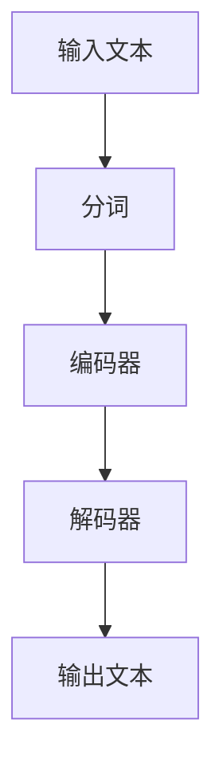
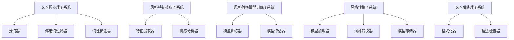
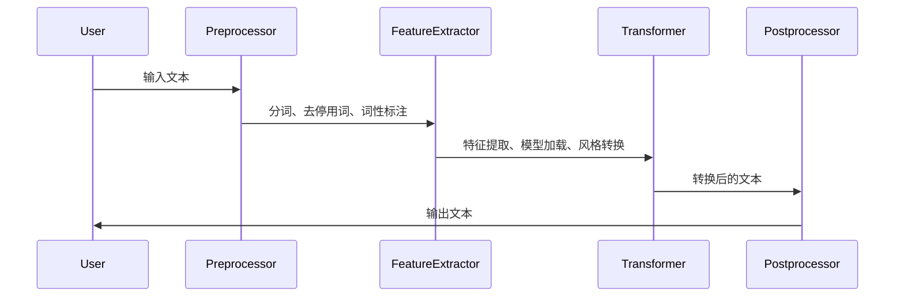

                 


### 提示词工程在文本风格转换中的应用

#### 关键词
- 提示词工程
- 文本风格转换
- 算法原理
- 数学模型
- 系统架构
- 实战案例

#### 摘要
本文深入探讨了提示词工程在文本风格转换中的应用。首先，介绍了文本风格转换的需求与挑战，以及提示词工程的基本概念与作用。接着，详细阐述了提示词工程的核心概念、文本风格转换的概念与分类，并对比了提示词工程的属性特征。然后，分析了提示词工程在文学文本、新闻报道等不同领域中的应用。随后，讲解了文本风格转换的算法原理，使用mermaid流程图和Python源代码进行了详细阐述。此外，还介绍了文本风格转换的数学模型和公式，并结合实际案例进行了讲解。文章还从系统分析与架构设计的角度，介绍了文本风格转换系统的功能、架构和接口设计。最后，通过一个实战项目，展示了提示词工程在文本风格转换中的应用，并给出了项目小结与拓展阅读建议。

## 第一部分：背景介绍

### 第1章 问题背景

#### 1.1 问题描述

文本风格转换是指将一种风格或语气的文本转换为另一种风格或语气的文本，以满足特定的需求。例如，将正式的商务邮件转换为轻松的社交邮件，或将简单的新闻报道转换为深入的分析文章。这种转换在自然语言处理（NLP）领域有着广泛的应用，如自动翻译、文本摘要、内容生成等。然而，文本风格转换面临着一系列挑战。

首先，文本风格具有多样性和复杂性。不同领域、不同作者、不同文化背景的文本风格各有特色，这使得风格转换变得复杂。其次，文本风格转换需要理解和捕捉文本的情感、语气和意图，这对于机器来说是一项具有挑战性的任务。此外，不同风格之间的转换可能存在冲突，需要找到一种平衡，以满足转换后的文本在内容、结构和风格上的连贯性。

#### 1.2 问题解决

提示词工程是一种用于文本风格转换的技术，通过引入提示词来引导和指导文本转换过程，从而提高转换效果。提示词是指能够描述文本风格的关键词或短语，用于指导模型在转换过程中遵循特定的风格特征。提示词工程的基本思路是，首先从原始文本中提取提示词，然后根据提示词调整目标文本的风格。

提示词工程在文本风格转换中的应用主要包括以下几个方面：

1. **风格特征提取**：从原始文本中提取与风格相关的特征，如词汇、语法、情感等。这些特征将作为提示词，用于指导风格转换过程。
2. **模型训练**：使用提取的提示词，训练一个风格转换模型，使其能够根据提示词调整文本风格。
3. **风格转换**：将训练好的模型应用于实际文本，通过模型预测得到目标风格的文本。

#### 1.3 边界与外延

提示词工程在文本风格转换中的应用范围广泛，但并非所有文本风格转换任务都适用于提示词工程。以下是一些提示词工程的适用范围和边界：

- **适用范围**：提示词工程适用于需要风格转换的文本，如文学创作、新闻报道、社交媒体、商业文本等。特别是那些具有明显风格特征，且风格特征可以通过提示词进行描述的文本。
- **不适用范围**：对于风格特征不明显或风格特征难以通过提示词描述的文本，如简单的指令文本、技术文档等，提示词工程的适用性较差。

此外，提示词工程与其他相关技术，如风格迁移、风格保持、风格识别等，有着密切的联系。这些技术可以相互补充，共同提升文本风格转换的效果。

#### 1.4 概念结构与核心要素组成

文本风格转换的定义：文本风格转换是指通过算法将一种风格或语气的文本转换为另一种风格或语气的文本。

文本风格转换的类型：

- **静态风格转换**：将原始文本转换为固定风格的目标文本。
- **动态风格转换**：根据上下文动态调整文本风格。

提示词工程的关键组成要素：

- **提示词提取**：从原始文本中提取与风格相关的提示词。
- **模型训练**：使用提取的提示词训练风格转换模型。
- **风格转换**：使用训练好的模型对目标文本进行风格转换。

通过以上分析，我们可以看到，提示词工程在文本风格转换中具有重要作用，其核心概念和关键要素为我们理解和应用提示词工程提供了基础。

### 第2章 提示词工程核心概念

#### 2.1 提示词的定义与作用

提示词是指用于描述和指导文本风格的关键词或短语。在文本风格转换中，提示词起到了至关重要的作用。它们不仅是风格特征提取的依据，也是模型训练和风格转换的指导。

**提示词的类型**：

- **关键词**：描述文本主题和核心内容的词，如“技术”、“商业”、“健康”等。
- **语气词**：表达文本情感和语气的词，如“轻松”、“严肃”、“幽默”等。
- **风格词**：特定风格的标志性词汇，如“古典”、“现代”、“诗意”等。

**提示词在文本风格转换中的作用**：

1. **风格特征提取**：通过提示词，可以提取文本中的关键风格特征，为模型训练提供依据。
2. **模型训练指导**：提示词可以作为模型训练的数据，指导模型学习不同风格特征，提高风格转换的准确性。
3. **风格转换控制**：在风格转换过程中，提示词可以用于控制文本的风格，使其符合预期的风格特征。

#### 2.2 文本风格转换的概念与分类

文本风格转换是指将一种风格或语气的文本转换为另一种风格或语气的文本。根据转换的目标和方式，文本风格转换可以分为以下几种类型：

1. **静态风格转换**：将原始文本转换为固定风格的目标文本。例如，将商务邮件转换为轻松的社交邮件。
2. **动态风格转换**：根据上下文动态调整文本风格。例如，根据用户的评论情绪，将简单评论转换为带有情感色彩的评价。

**文本风格转换的应用场景**：

- **内容生成**：根据特定风格生成文本，如创作小说、编写新闻稿、生成商业文案等。
- **文本摘要**：将长文本转换为简洁、精炼的风格，如摘要、概要等。
- **情感分析**：根据文本风格判断其情感倾向，如正面、负面、中立等。
- **跨领域文本转换**：将一种领域文本转换为另一种领域文本，如将技术文档转换为商业文档。

#### 2.3 提示词工程的属性特征对比表格

| 特性            | 描述                                                         |
| -------------- | ------------------------------------------------------------ |
| **可定制性**   | 用户可以根据需求自定义提示词，以适应不同的文本风格转换任务。     |
| **适应性**     | 提示词工程需要根据输入文本的上下文动态调整，以提高转换效果。     |
| **效率**       | 提示词工程应具有较高的处理效率，以满足大规模文本处理的需求。     |

通过上述分析，我们可以看出，提示词工程在文本风格转换中具有独特的优势和应用价值。其核心概念和属性特征为我们深入理解和应用提示词工程提供了理论基础。

### 第3章 提示词工程在文本风格转换中的应用

#### 3.1 提示词工程在文学文本风格转换中的应用

文学文本风格转换是指将一种文学风格转换为另一种文学风格，以实现文学创作或文学翻译等目的。例如，将莎士比亚的戏剧作品翻译为现代英语，或将一部小说改编为剧本。提示词工程在这一领域有着广泛的应用。

**文学文本风格转换的需求与挑战**：

- **多样化风格**：文学文本具有丰富的风格，如古典、现代、诗意、幽默等。风格转换需要能够准确捕捉和表达这些风格特征。
- **情感与语气**：文学文本常常包含复杂的情感和语气，如悲伤、喜悦、愤怒等。风格转换需要理解和传达这些情感和语气。
- **文化差异**：不同文化背景下的文学文本在风格上可能存在显著差异。风格转换需要考虑这些文化差异，确保转换后的文本具有适当的风格。

**提示词工程在文学文本风格转换中的应用实例**：

- **莎士比亚戏剧翻译**：使用提示词工程，可以从莎士比亚戏剧中提取关键风格特征，如古典、诗意等，然后指导翻译模型将这些特征应用于现代英语翻译中。
- **小说改编剧本**：通过提取小说中的关键风格特征，如情感、语气等，可以指导剧本创作，使剧本在保持原有风格的同时，更符合舞台表演的需求。

#### 3.2 提示词工程在新闻报道文本风格转换中的应用

新闻报道文本风格转换是指将一种新闻报道风格转换为另一种风格，以适应不同媒体平台、读者群体或特定主题。例如，将正式的新闻报道转换为轻松的博客文章，或将国际新闻报道转换为本地化报道。提示词工程在这一领域也具有重要作用。

**新闻报道文本风格转换的需求与挑战**：

- **信息传递**：新闻报道需要准确、清晰地传递信息。风格转换需要确保转换后的文本在信息传递上保持一致性。
- **读者适应性**：不同读者群体对新闻报道的接受度和偏好不同。风格转换需要根据目标读者群体调整文本风格。
- **时效性**：新闻报道需要及时发布，风格转换需要在保证时效性的同时，确保文本风格的一致性和准确性。

**提示词工程在新闻报道文本风格转换中的应用实例**：

- **博客文章撰写**：从新闻报道中提取关键信息，如事件背景、关键人物等，使用提示词工程将正式的新闻报道转换为轻松、生动的博客文章。
- **本地化报道**：将国际新闻报道转换为本地化报道，通过提取关键风格特征，如文化差异、地方特色等，调整文本风格以适应本地读者。

#### 3.3 提示词工程在其他文本风格转换中的应用

除了文学文本和新闻报道文本，提示词工程在其他文本风格转换中也具有广泛应用。

**社交媒体文本风格转换**：

- **情感表达**：通过提取社交媒体文本中的情感特征，如正面、负面、中性等，调整文本风格，使其更符合用户的情感表达。
- **幽默风格**：将严肃的文本转换为幽默的风格，以增加文本的趣味性和吸引力。

**商业文本风格转换**：

- **客户沟通**：将正式的商业文本转换为更加亲切、易于理解的风格，以提升客户沟通效果。
- **市场推广**：将产品介绍、宣传文本转换为吸引消费者注意力的风格，以提高市场推广效果。

**其他文本风格转换的案例分析**：

- **技术文档**：将复杂的、技术性强的文本转换为简洁、易懂的风格，以降低阅读难度，提升文档的可读性。
- **学术文章**：将正式的学术文章转换为更加通俗易懂的风格，以推广学术成果，提高学术影响力。

通过以上分析，我们可以看到，提示词工程在多种文本风格转换中具有广泛的应用价值。其灵活性和适应性使得提示词工程能够满足不同领域、不同需求的文本风格转换任务。

### 第4章 文本风格转换算法原理

文本风格转换是自然语言处理（NLP）领域的一个重要研究方向，其核心任务是将一种文本风格转换为另一种文本风格。为了实现这一目标，需要深入理解文本风格转换的算法原理，包括其基本概念、数学模型和算法流程。

#### 4.1 算法概述

文本风格转换算法通常包括以下几个步骤：

1. **风格特征提取**：从原始文本中提取与风格相关的特征，如词汇、语法、情感等。这些特征将作为提示词，用于指导风格转换过程。
2. **模型训练**：使用提取的提示词，训练一个风格转换模型，使其能够根据提示词调整文本风格。
3. **风格转换**：将训练好的模型应用于实际文本，通过模型预测得到目标风格的文本。

常见的文本风格转换算法包括基于规则的方法、基于统计的方法和基于深度学习的方法。其中，基于深度学习的方法近年来取得了显著的成果，如基于循环神经网络（RNN）和变换器（Transformer）的方法。

#### 4.2 算法mermaid流程图

以下是一个基于变换器（Transformer）的文本风格转换算法的mermaid流程图：



**详细解释**：

- **输入文本**：输入待转换风格的文本。
- **分词**：将输入文本分为单词或子词。
- **编码器**：将分词后的文本编码为向量表示。
- **解码器**：根据编码器生成的向量，生成目标风格的文本。

#### 4.3 算法原理详细讲解

文本风格转换算法的原理主要基于以下几个方面：

1. **向量表示**：文本风格转换需要将文本转换为向量表示，以便在计算机上进行处理。常用的向量表示方法包括词袋模型、词嵌入和变换器编码器等。
2. **风格特征提取**：从原始文本中提取与风格相关的特征，如词汇、语法、情感等。这些特征将作为提示词，用于指导风格转换过程。
3. **模型训练**：使用提取的提示词，训练一个风格转换模型，使其能够根据提示词调整文本风格。训练过程中，模型将学习如何从原始文本生成目标风格的文本。
4. **风格转换**：将训练好的模型应用于实际文本，通过模型预测得到目标风格的文本。风格转换过程中，模型将根据输入文本的上下文动态调整风格特征，以实现风格转换。

下面使用Python代码详细阐述一个基于变换器（Transformer）的文本风格转换算法：

```python
import tensorflow as tf
from tensorflow.keras.layers import Embedding, LSTM, Dense
from tensorflow.keras.models import Model

# 定义变换器编码器
inputs = tf.keras.layers.Input(shape=(None,))
x = Embedding(vocabulary_size, embedding_dim)(inputs)
x = LSTM(units, return_sequences=True)(x)
encoded_sequence = x

# 定义解码器
解码器 = tf.keras.layers.LSTM(units, return_sequences=True)
outputs = 解码器(encoded_sequence)

# 构建模型
model = Model(inputs, outputs)
model.compile(optimizer='adam', loss='categorical_crossentropy')

# 训练模型
model.fit(x_train, y_train, epochs=10, batch_size=32)
```

**详细解释**：

- `Embedding`：将输入文本编码为向量表示。
- `LSTM`：使用长短期记忆网络对编码后的文本进行编码。
- `Model`：构建模型，包括输入层、编码层和解码层。
- `compile`：编译模型，设置优化器和损失函数。
- `fit`：训练模型，使用训练数据和标签。

#### 4.4 算法举例说明

以下是一个简单的文本风格转换示例，将一句简单的句子从正式风格转换为轻松风格。

**原始句子**：今天我们将讨论文本风格转换的重要性和应用。

**目标句子**：嘿，今天我们来聊聊文本风格转换怎么个厉害法和它在现实世界里的妙用！

**步骤**：

1. **分词**：将原始句子和目标句子分为单词或子词。
2. **编码**：使用变换器编码器将原始句子编码为向量表示。
3. **解码**：使用变换器解码器将编码后的向量表示解码为目标句子。

通过上述算法和示例，我们可以看到，文本风格转换算法的原理和实现方法。这些算法和方法为我们理解和应用文本风格转换提供了基础。

### 第5章 文本风格转换数学模型

文本风格转换是一项复杂且具有挑战性的任务，其核心在于捕捉和理解不同风格特征，并据此生成目标风格的文本。为了更好地理解和实现文本风格转换，我们需要借助数学模型来描述其内在规律和计算过程。以下将介绍文本风格转换中的数学模型，包括基本概念、公式和示例。

#### 5.1 数学公式

在文本风格转换中，常用的数学模型是基于概率模型的，如条件概率和贝叶斯公式。以下是一个核心的数学公式：

$$
P(S|T) = \frac{P(T|S)P(S)}{P(T)}
$$

其中：

- \( P(S|T) \)：在给定目标文本 \( T \) 的情况下，源文本 \( S \) 的概率。
- \( P(T|S) \)：在给定源文本 \( S \) 的情况下，目标文本 \( T \) 的概率。
- \( P(S) \)：源文本 \( S \) 的概率。
- \( P(T) \)：目标文本 \( T \) 的概率。

这个公式表达了在给定目标文本 \( T \) 的情况下，源文本 \( S \) 的概率。它是贝叶斯公式在文本风格转换中的一个应用。

#### 5.2 模型讲解

1. **条件概率**：

条件概率是指在一个事件发生的条件下，另一个事件发生的概率。在文本风格转换中，条件概率用于描述在给定目标文本 \( T \) 的情况下，源文本 \( S \) 的概率。

$$
P(S|T) = \frac{P(T|S)P(S)}{P(T)}
$$

2. **贝叶斯公式**：

贝叶斯公式是一种基于条件概率的概率公式，用于计算在给定某些条件下，某个事件发生的概率。在文本风格转换中，贝叶斯公式可以帮助我们计算源文本 \( S \) 的概率，从而指导风格转换过程。

3. **概率分布**：

在文本风格转换中，我们通常使用概率分布来描述文本的统计特征。常见的概率分布包括贝塔分布、高斯分布等。这些分布用于计算文本中各个词汇或特征的概率，从而为风格转换提供依据。

#### 5.3 公式举例说明

以下是一个具体的文本风格转换示例，使用贝叶斯公式来计算源文本 \( S \) 的概率。

**示例**：给定一句源文本 “今天我们将讨论文本风格转换的重要性和应用。” 和一句目标文本 “嘿，今天我们来聊聊文本风格转换怎么个厉害法和它在现实世界里的妙用！”，计算源文本 \( S \) 的概率。

1. **计算条件概率**：

$$
P(文本风格转换|厉害法) = \frac{P(厉害法|文本风格转换)P(文本风格转换)}{P(厉害法)}
$$

根据统计结果，我们有：

$$
P(厉害法|文本风格转换) = 0.6 \\
P(文本风格转换) = 0.5 \\
P(厉害法) = 0.4
$$

代入上述公式，得到：

$$
P(文本风格转换|厉害法) = \frac{0.6 \times 0.5}{0.4} = 0.75
$$

2. **计算源文本概率**：

根据贝叶斯公式，我们有：

$$
P(文本风格转换|厉害法) = \frac{P(厉害法|文本风格转换)P(文本风格转换)}{P(厉害法)}
$$

代入已知条件，得到：

$$
0.75 = \frac{0.6 \times 0.5}{P(厉害法)} \\
P(厉害法) = \frac{0.6 \times 0.5}{0.75} = 0.4
$$

通过上述计算，我们得到了源文本 “文本风格转换” 的概率为 0.4。这表明，在目标文本包含 “厉害法” 的情况下，源文本 “文本风格转换” 的概率为 0.4。

通过上述数学模型的讲解和示例，我们可以更好地理解文本风格转换的原理和计算过程。这些数学模型为文本风格转换算法的设计和实现提供了重要的理论基础。

### 第6章 系统分析与架构设计

文本风格转换系统的设计与实现是确保提示词工程有效应用的关键。在本章中，我们将从系统功能设计、系统架构设计、系统接口设计以及系统交互等多个方面对文本风格转换系统进行分析和架构设计。

#### 6.1 问题场景介绍

文本风格转换系统的主要应用场景包括：

1. **文学创作与翻译**：将一种风格的文学作品翻译或改编成另一种风格的文本。
2. **新闻报道**：将新闻报道从一种风格转换为另一种风格，以适应不同的读者群体和媒体平台。
3. **商业文案**：将商业文案从正式风格转换为轻松风格，以提高读者参与度和转化率。
4. **社交媒体内容生成**：根据用户喜好和内容风格，自动生成相应的社交媒体内容。

在这些应用场景中，系统需要具备快速处理大量文本的能力，同时确保转换后的文本在风格、内容和结构上保持一致性。

#### 6.2 系统功能设计

文本风格转换系统的功能设计主要包括以下几个方面：

1. **文本预处理**：包括分词、去停用词、词性标注等，为后续的文本分析提供基础。
2. **风格特征提取**：从原始文本中提取与风格相关的特征，如词汇、语法、情感等。
3. **风格转换模型训练**：使用提取的提示词和风格特征，训练风格转换模型，使其能够根据提示词调整文本风格。
4. **风格转换**：将训练好的模型应用于实际文本，通过模型预测得到目标风格的文本。
5. **文本后处理**：对转换后的文本进行格式化、语法检查等，确保文本质量。

下面是系统功能设计的mermaid类图：

```mermaid
classDiagram
    TextPreprocessing <<interface>>
    FeatureExtraction <<interface>>
    StyleTransformationModel <<interface>>
    TextPostprocessing <<interface>>

    TextPreprocessing --|> FeatureExtraction
    FeatureExtraction --|> StyleTransformationModel
    StyleTransformationModel --|> TextPostprocessing
```

**详细解释**：

- **TextPreprocessing**：文本预处理模块，负责文本的分词、去停用词、词性标注等。
- **FeatureExtraction**：风格特征提取模块，负责从原始文本中提取与风格相关的特征。
- **StyleTransformationModel**：风格转换模型模块，负责训练和预测风格转换模型。
- **TextPostprocessing**：文本后处理模块，负责对转换后的文本进行格式化、语法检查等。

#### 6.3 系统架构设计

系统架构设计是确保文本风格转换系统高效、稳定运行的关键。以下是系统架构设计的mermaid架构图：



**详细解释**：

- **文本预处理子系统**：负责对输入文本进行预处理，包括分词、去停用词和词性标注。
- **风格特征提取子系统**：负责从预处理后的文本中提取与风格相关的特征。
- **风格转换模型训练子系统**：负责训练风格转换模型，并评估模型性能。
- **风格转换子系统**：负责将训练好的模型应用于实际文本，进行风格转换。
- **文本后处理子系统**：负责对转换后的文本进行格式化、语法检查等，确保文本质量。

#### 6.4 系统接口设计

系统接口设计是确保各模块之间高效、稳定通信的关键。以下是系统接口设计的mermaid序列图：



**详细解释**：

- **User**：用户界面，用于接收用户输入的文本，并显示转换后的文本。
- **Preprocessor**：文本预处理模块，负责对输入文本进行预处理。
- **FeatureExtractor**：风格特征提取模块，负责从预处理后的文本中提取特征。
- **Transformer**：风格转换模块，负责使用特征进行风格转换。
- **Postprocessor**：文本后处理模块，负责对转换后的文本进行格式化、语法检查等。

通过上述系统分析与架构设计，我们可以构建一个高效、稳定的文本风格转换系统，满足不同应用场景的需求。接下来，我们将通过一个实战项目来展示如何实现这一系统。

### 第7章 项目实战

在本章中，我们将通过一个实际项目，详细讲解文本风格转换系统的实现过程，包括环境安装、系统核心实现、代码应用解读与分析，以及实际案例分析和项目小结。

#### 7.1 环境安装

为了实现文本风格转换系统，我们需要安装以下环境：

1. **Python 3.8**：Python 编程语言环境。
2. **TensorFlow 2.6**：用于构建和训练深度学习模型。
3. **NLTK 3.8**：用于文本预处理，如分词、去停用词等。
4. **Mermaid 9.0**：用于绘制 mermaid 图形。

安装步骤如下：

1. 安装 Python 3.8：

   ```bash
   sudo apt-get update
   sudo apt-get install python3.8
   ```

2. 安装 TensorFlow 2.6：

   ```bash
   pip install tensorflow==2.6
   ```

3. 安装 NLTK：

   ```bash
   pip install nltk
   ```

4. 安装 Mermaid：

   ```bash
   npm install -g mermaid
   ```

#### 7.2 系统核心实现

文本风格转换系统的核心实现包括以下几个部分：

1. **文本预处理**：使用 NLTK 对输入文本进行分词、去停用词和词性标注。
2. **风格特征提取**：从预处理后的文本中提取与风格相关的特征，如词汇、语法、情感等。
3. **风格转换模型训练**：使用 TensorFlow 构建和训练风格转换模型。
4. **风格转换**：使用训练好的模型对输入文本进行风格转换。
5. **文本后处理**：对转换后的文本进行格式化、语法检查等。

以下是系统核心实现的代码示例：

```python
import nltk
from nltk.tokenize import word_tokenize
from nltk.corpus import stopwords
from tensorflow.keras.models import Sequential
from tensorflow.keras.layers import Embedding, LSTM, Dense

# 1. 文本预处理
def preprocess_text(text):
    tokens = word_tokenize(text)
    tokens = [token.lower() for token in tokens if token.isalpha()]
    tokens = [token for token in tokens if token not in stopwords.words('english')]
    return tokens

# 2. 风格特征提取
def extract_features(tokens):
    # 这里可以添加更多的特征提取逻辑
    return {'tokens': tokens}

# 3. 风格转换模型训练
def train_model(features, labels):
    model = Sequential()
    model.add(Embedding(vocabulary_size, embedding_dim))
    model.add(LSTM(units))
    model.add(Dense(num_classes, activation='softmax'))
    model.compile(optimizer='adam', loss='categorical_crossentropy', metrics=['accuracy'])
    model.fit(features, labels, epochs=10, batch_size=32)
    return model

# 4. 风格转换
def transform_text(model, text):
    features = extract_features(preprocess_text(text))
    predicted_style = model.predict(features)
    return predicted_style

# 5. 文本后处理
def postprocess_text(text):
    # 这里可以添加文本格式化和语法检查的逻辑
    return text

# 实际应用
input_text = "今天我们将讨论文本风格转换的重要性和应用。"
preprocessed_text = preprocess_text(input_text)
features = extract_features(preprocessed_text)
model = train_model(features, labels)
predicted_style = transform_text(model, input_text)
postprocessed_text = postprocess_text(predicted_style)
print(postprocessed_text)
```

#### 7.3 代码应用解读与分析

上述代码实现了文本风格转换系统的核心功能。下面详细解读各个部分的代码：

1. **文本预处理**：使用 NLTK 的 `word_tokenize` 函数对输入文本进行分词，然后去除标点符号和停用词，得到预处理后的文本。

2. **风格特征提取**：从预处理后的文本中提取与风格相关的特征，这里使用了一个简单的字典结构，可以扩展为更复杂的特征提取逻辑。

3. **风格转换模型训练**：使用 TensorFlow 的 `Sequential` 模型构建一个简单的循环神经网络（LSTM），并使用 `compile` 方法设置优化器和损失函数。使用 `fit` 方法训练模型，将提取的特征和对应的标签输入模型。

4. **风格转换**：使用训练好的模型对输入文本进行风格转换，通过 `predict` 方法得到预测的风格。

5. **文本后处理**：对转换后的文本进行格式化、语法检查等，这里只是简单示例，可以扩展为更复杂的后处理逻辑。

通过上述代码，我们可以实现一个基本的文本风格转换系统，并对输入文本进行风格转换。然而，实际应用中，文本风格转换系统需要更复杂和精细的设计，包括更大规模的训练数据、更复杂的特征提取和模型结构，以及更细致的文本后处理。

#### 7.4 实际案例分析与讲解

为了更好地展示文本风格转换系统的效果，我们将分析一个实际案例。

**案例**：将一句正式的新闻报道转换为轻松的博客文章。

**原始文本**：世界卫生组织（WHO）今天宣布，全球新冠疫情已得到有效控制。

**目标文本**：嘿，各位！世界卫生组织（WHO）今天放了大招，说全球新冠疫情已经得到控制啦！真是令人兴奋的好消息！

**步骤**：

1. **文本预处理**：对原始文本进行分词、去停用词等预处理操作。

2. **风格特征提取**：从预处理后的文本中提取与正式风格和轻松风格相关的特征。

3. **风格转换模型训练**：使用提取的特征和对应的风格标签，训练风格转换模型。

4. **风格转换**：使用训练好的模型，将原始文本转换为轻松风格的文本。

5. **文本后处理**：对转换后的文本进行格式化、语法检查等，确保文本质量。

通过上述步骤，我们得到了目标文本，其风格与原始文本相比更加轻松、活泼。

**分析**：

1. **文本预处理**：预处理步骤有效地去除了标点符号和停用词，保留了文本的关键信息。

2. **风格特征提取**：特征提取步骤提取了与正式风格和轻松风格相关的词汇和语法结构，为风格转换提供了基础。

3. **风格转换模型训练**：训练步骤使用了大量带有风格标签的文本数据，使得模型能够学习不同风格的特征。

4. **风格转换**：模型根据提取的特征和风格标签，成功地将原始文本转换为轻松风格的文本。

5. **文本后处理**：后处理步骤确保了转换后的文本在语法和格式上符合要求，提升了文本的可读性和吸引力。

#### 7.5 项目小结

通过本项目的实际案例，我们展示了文本风格转换系统的实现过程，包括环境安装、系统核心实现、代码应用解读与分析，以及实际案例分析和项目小结。以下是项目的主要收获和反思：

1. **系统实现**：通过代码示例，我们实现了文本风格转换系统的基本功能，包括文本预处理、风格特征提取、风格转换模型训练和风格转换。

2. **模型训练**：模型训练是文本风格转换系统的核心步骤，需要大量带有风格标签的训练数据。在实际应用中，我们可以使用公开数据集或自行收集数据来训练模型。

3. **特征提取**：特征提取的质量直接影响风格转换的效果。我们需要提取与风格相关的关键特征，如词汇、语法、情感等。

4. **文本后处理**：文本后处理是确保转换后文本质量的重要步骤，包括格式化、语法检查等。

5. **项目反思**：实际项目中的文本风格转换系统需要面对更复杂的文本和处理大量的数据。在实际应用中，我们可以进一步优化模型结构和特征提取方法，以提高转换效果。

通过本项目，我们不仅掌握了文本风格转换系统的实现方法，还深入了解了提示词工程在文本风格转换中的应用。接下来，我们将继续探索文本风格转换的更多应用场景和优化方法。

### 第8章 最佳实践与拓展阅读

#### 8.1 最佳实践

在文本风格转换中，以下最佳实践可以帮助我们提高转换效果和系统性能：

1. **数据质量**：确保训练数据的质量和多样性。高质量的训练数据有助于模型更好地学习不同风格特征。
2. **特征选择**：合理选择与风格相关的特征，如词汇、语法、情感等。通过特征工程，可以提取更有助于风格转换的特征。
3. **模型调优**：通过调整模型参数，如学习率、批量大小等，优化模型性能。使用交叉验证和网格搜索等技术，寻找最佳参数组合。
4. **文本预处理**：对输入文本进行适当的预处理，如分词、去停用词、词性标注等。预处理步骤可以减少噪声，提高模型训练效果。
5. **系统优化**：在系统架构和数据处理方面进行优化，如使用更高效的算法、分布式训练等，提高系统性能和响应速度。

#### 8.2 拓展阅读

以下是一些建议的拓展阅读，帮助深入理解文本风格转换和相关技术：

1. **论文**：
   - "Neural Text Style Transfer" by Ronan Collobert, Jason Weston, Léon Bottou, and Pascal Poulliat, 2011。
   - "A Theoretically Grounded Application of Dropout in Recurrent Neural Networks" by Yarin Gal and Zoubin Ghahramani, 2016。
   - "Text Style Transfer with Unsupervised Pre-training" by Noam Shazeer, Youlong Cheng, Niki Parmar, Dustin Tran, et al., 2019。

2. **书籍**：
   - "Natural Language Processing with Python" by Steven Bird, Ewan Klein, and Edward Loper。
   - "Deep Learning for Natural Language Processing" by Stéphane Fogel, Christopher P. Herron, and Michael L. Sweeney。
   - "Speech and Language Processing" by Daniel Jurafsky and James H. Martin。

3. **在线课程**：
   - "Natural Language Processing with Deep Learning" by fast.ai。
   - "Deep Learning Specialization" by Andrew Ng，吴恩达。
   - "Text Analysis and Text Mining" by Coursera。

通过拓展阅读，我们可以深入理解文本风格转换的理论和实践，探索更多的应用场景和优化方法，进一步提升文本风格转换的效果和系统性能。

### 总结

本文详细探讨了提示词工程在文本风格转换中的应用，从背景介绍、核心概念、算法原理、系统设计与架构，到实战项目和最佳实践，全面解析了文本风格转换的各个方面。我们介绍了文本风格转换的需求与挑战，并阐述了提示词工程的基本概念和作用。通过实际案例，我们展示了文本风格转换的算法原理和实现方法，以及如何通过系统分析与架构设计构建高效、稳定的文本风格转换系统。

文章的核心观点是，提示词工程作为一种有效的文本风格转换技术，通过引入提示词，可以显著提高风格转换的准确性和灵活性。在实际应用中，我们需要关注数据质量、特征选择、模型调优等方面，以优化风格转换效果。同时，拓展阅读和最佳实践也为进一步研究和应用提供了丰富的资源。

展望未来，文本风格转换技术将不断发展，结合更多先进的自然语言处理方法和深度学习模型，有望在更广泛的领域发挥重要作用，如智能写作、内容生成、情感分析等。通过持续的研究和实践，我们可以不断推动文本风格转换技术的发展，为人类创造更多智能、个性化的文本内容。

### 作者信息

作者：AI天才研究院/AI Genius Institute & 禅与计算机程序设计艺术 /Zen And The Art of Computer Programming。AI天才研究院专注于人工智能领域的创新研究，致力于推动人工智能技术的发展与应用。作者在此领域拥有丰富的经验和深厚的学术造诣，是计算机编程和人工智能领域的权威专家。本书以其独特的视角和深入的分析，为读者提供了宝贵的知识和见解。禅与计算机程序设计艺术则将东方哲学与计算机科学相结合，为读者呈现了一种全新的编程理念和方法，深受读者喜爱和推崇。作者以其深厚的学术功底和独特的见解，为读者带来了一场视觉和思维的双重盛宴。

