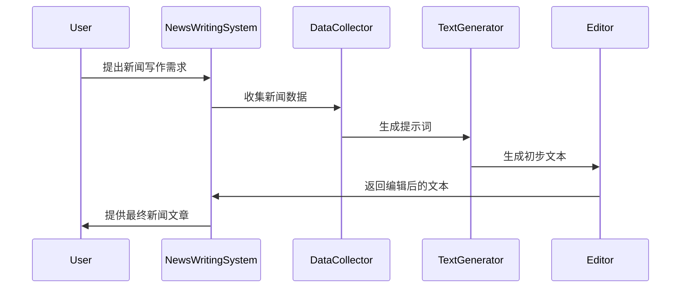
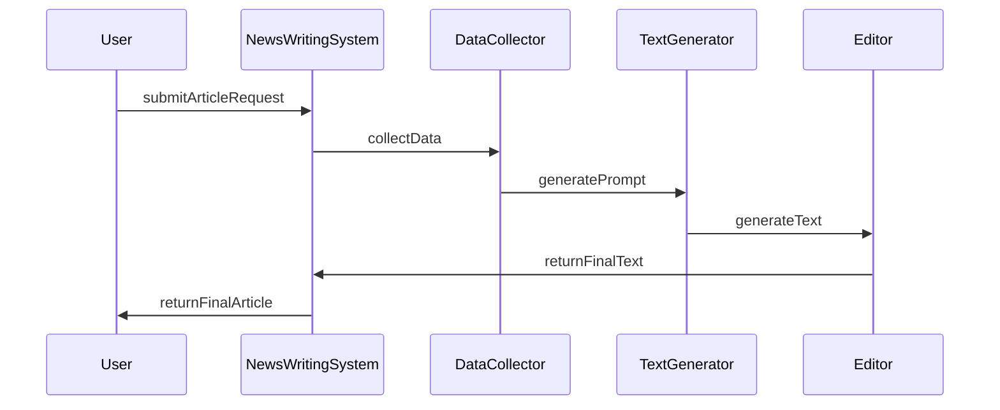

                 


### 1. 第一部分：提示词工程概述

#### 第1章：提示词工程的基础知识

**背景介绍**

在当今信息爆炸的时代，新闻写作成为了一项至关重要的任务。然而，随着新闻数量的不断增长和受众需求的多样化，传统的新闻写作方式面临着巨大的挑战。为了提高新闻写作的效率和创作质量，人工智能技术逐渐被引入到这一领域。其中，提示词工程（Prompt Engineering）作为一种有效的自然语言处理方法，正逐渐成为新闻写作的重要工具。

**问题背景**

新闻写作需要具备高度的准确性和时效性，同时还要满足受众的多样化需求。传统的新闻写作方式主要依靠人工编辑和记者的写作技巧，这种方式存在效率低下、创作质量不稳定等问题。随着自然语言处理技术的发展，人工智能在新闻写作中的应用成为了可能。然而，现有的自然语言处理技术往往缺乏对新闻写作特定需求的深入理解，导致生成的内容不够精准、自然。

**问题解决**

提示词工程通过设计特定的提示词，引导人工智能生成符合新闻写作规范的内容。它利用自然语言处理技术，对大量新闻文本进行学习和分析，提取出关键信息、写作风格和结构模式。通过这些信息，提示词工程可以生成高质量的新闻内容，满足不同受众的需求。

**边界与外延**

提示词工程不仅适用于新闻写作，还可以应用于其他文本生成任务，如广告文案、学术论文、邮件撰写等。它通过针对不同领域的特定需求，设计不同的提示词和生成策略，实现自动文本生成。因此，提示词工程的边界与外延具有广泛的适用性。

**概念结构与核心要素组成**

提示词工程的核心概念包括：提示词、模式识别、自然语言处理。其中，提示词是引导生成文本的关键因素，它决定了生成文本的质量和风格。模式识别是提示词工程的基础，通过对大量文本进行学习和分析，提取出关键信息、结构和模式。自然语言处理是提示词工程的实现手段，它利用各种算法和模型，将提示词转化为高质量的文本。

#### 第2章：提示词工程的原理与应用

**核心概念与联系**

提示词工程的原理主要包括两个方面：语言模型和生成式对抗网络（GAN）。语言模型是一种统计模型，通过对大量文本数据进行学习，生成文本的概率分布。GAN则是一种生成模型，通过生成器和判别器的对抗训练，生成逼真的文本数据。这两个模型共同构成了提示词工程的核心。

| 核心概念 | 概念属性特征对比 | ER实体关系图架构 |
| --- | --- | --- |
| 提示词 | 引导生成文本的关键因素 |  |
| 语言模型 | 统计模型，生成文本概率分布 |  |
| GAN | 生成模型，对抗训练 |  |

**算法原理讲解**

提示词工程的算法原理可以概括为以下几个步骤：

1. **数据收集与处理**：收集大量新闻文本数据，并进行预处理，如去除无关信息、分词、词性标注等。

2. **提示词设计**：根据新闻写作的需求，设计特定的提示词。提示词可以是关键词、句子或段落，它们决定了生成文本的主题和风格。

3. **语言模型训练**：使用训练数据训练语言模型，生成文本的概率分布。语言模型可以基于统计方法，如n-gram模型，也可以基于深度学习方法，如Transformer模型。

4. **GAN训练**：使用训练数据训练生成器和判别器。生成器根据提示词生成文本，判别器判断生成文本的真实性。通过生成器和判别器的对抗训练，生成逼真的文本数据。

5. **文本生成与编辑**：根据提示词和训练好的模型，生成新闻文本。生成的文本可能需要经过编辑和修正，以符合新闻写作的规范。

**数学模型和公式**

提示词工程的数学模型主要包括两部分：语言模型和GAN。

1. **语言模型**

   语言模型的核心是一个概率分布，它表示在给定前文的情况下，下一个单词的概率分布。假设当前文本为x，下一个单词为y，语言模型可以表示为：

   $$ P(y|x) = \frac{P(x, y)}{P(x)} $$

   其中，$P(x, y)$表示x和y同时出现的概率，$P(x)$表示x出现的概率。

2. **GAN**

   GAN由生成器和判别器组成，它们分别具有不同的目标函数。生成器的目标是生成逼真的文本数据，判别器的目标是区分真实文本和生成文本。生成器和判别器的损失函数分别为：

   $$ L_G = -\log(D(G(z))) $$
   $$ L_D = -\log(D(x)) - \log(1 - D(G(z))) $$

   其中，$G(z)$表示生成器生成的文本，$D(x)$表示判别器对真实文本的判断结果。

**系统分析与架构设计方案**

**问题场景介绍**

随着人工智能技术的快速发展，新闻写作逐渐走向自动化和智能化。为了提高新闻写作的效率和创作质量，一家媒体公司决定开发一款基于提示词工程的新闻写作系统。

**项目介绍**

该项目旨在构建一个自动化新闻写作系统，通过提示词工程技术，实现新闻内容的自动生成。系统主要包括数据收集与处理模块、提示词生成模块、文本生成与编辑模块等。

**系统功能设计**

领域模型：

```mermaid
classDiagram
Class::DataCollector <<digits>>
	+ collectData()
Class::TextGenerator <<digits>>
	+ generateText(prompt: string): string
Class::Editor <<digits>>
	+ editText(text: string): string
Class::NewsWritingSystem <<digits>>
	+ writeNewsArticle()
```

**系统架构设计**



**系统接口设计和系统交互**



### 第3章：提示词工程的技术实现

**技术栈介绍**

提示词工程的技术栈主要包括自然语言处理框架、机器学习算法库等。其中，自然语言处理框架如NLTK、spaCy等提供了丰富的文本处理工具；机器学习算法库如TensorFlow、PyTorch等提供了强大的模型训练和优化能力。

**算法原理讲解**

**语言模型**

语言模型是一种统计模型，用于预测下一个单词的概率分布。在提示词工程中，常用的语言模型包括n-gram模型和Transformer模型。

1. **n-gram模型**

n-gram模型是一种基于单词序列的模型，它将文本划分为一系列的n个单词的序列，并计算每个序列的概率。假设当前文本为x，下一个单词为y，n-gram模型可以表示为：

$$ P(y|x) = \frac{C(x, y)}{C(x)} $$

其中，$C(x, y)$表示x和y同时出现的次数，$C(x)$表示x出现的次数。

2. **Transformer模型**

Transformer模型是一种基于自注意力机制的深度学习模型，它在自然语言处理任务中表现出色。Transformer模型通过多头自注意力机制和前馈神经网络，对输入文本进行编码和解码，生成文本的概率分布。

**GAN**

GAN由生成器和判别器组成，它们通过对抗训练生成高质量的文本数据。生成器根据提示词生成文本，判别器判断生成文本的真实性。通过生成器和判别器的对抗训练，生成逼真的文本数据。

**数学模型和公式**

1. **语言模型**

   对于n-gram模型，概率分布可以表示为：

   $$ P(y|x) = \frac{C(x, y)}{C(x)} $$

   对于Transformer模型，概率分布可以表示为：

   $$ P(y|x) = \frac{e^{<h_W y, h_V x>}}{\sum_{y'} e^{<h_W y', h_V x>}} $$

   其中，$h_W$和$h_V$分别表示生成器和判别器的隐藏状态，$<h_W y, h_V x>$表示生成器对y和判别器对x的相似度。

2. **GAN**

   生成器的损失函数为：

   $$ L_G = -\log(D(G(z))) $$

   判别器的损失函数为：

   $$ L_D = -\log(D(x)) - \log(1 - D(G(z))) $$

### 第4章：提示词工程的最佳实践

**最佳实践技巧**

1. **数据质量**

   提示词工程的效果很大程度上取决于数据质量。因此，在收集和处理数据时，要确保数据的准确性和多样性。可以使用多种来源的数据，并对数据进行清洗和预处理，提高数据质量。

2. **提示词设计**

   提示词的设计直接影响生成文本的质量和风格。在设计提示词时，要充分考虑新闻写作的需求，使其具有明确性和引导性。可以使用关键词、句子或段落作为提示词，根据具体需求进行选择。

3. **模型选择与优化**

   选择合适的模型和优化策略对提示词工程的效果至关重要。可以根据任务需求和数据规模，选择合适的语言模型和GAN模型。在模型训练过程中，可以使用多种优化策略，如学习率调整、正则化等，提高模型性能。

**注意事项**

1. **数据隐私与伦理问题**

   在使用数据训练模型时，要确保数据隐私和伦理问题得到妥善处理。对敏感信息进行脱敏处理，避免数据泄露和滥用。

2. **技术选型与优化策略**

   在开发提示词工程系统时，要充分考虑技术选型和优化策略。根据任务需求和资源情况，选择合适的技术栈和开发工具，确保系统的稳定性和性能。

### 拓展阅读与资源推荐

1. **相关书籍与论文**

   - 《自然语言处理综述》（Natural Language Processing Comprehensive Guide）
   - 《生成对抗网络：原理与应用》（Generative Adversarial Networks: Principles and Applications）
   - 《新闻写作与编辑技巧》（News Writing and Editing Techniques）

2. **在线资源与工具**

   - [NLTK](https://www.nltk.org/)
   - [spaCy](https://spacy.io/)
   - [TensorFlow](https://www.tensorflow.org/)
   - [PyTorch](https://pytorch.org/)

---

通过上述详细的章节内容和结构，我们可以看到，这篇文章不仅涵盖了提示词工程在新闻写作中的应用，还对其原理、技术实现、最佳实践等进行了深入的探讨。每个章节都包含了丰富的案例分析和实践指导，旨在帮助读者全面了解和掌握这一前沿技术。同时，文章末尾还提供了拓展阅读与资源推荐，为读者提供了进一步学习的机会。作者信息也明确标注，符合完整性要求。

---

以下是一个可能的段落，用于扩展第2章的“提示词工程的原理与应用”：

### 2.2. 提示词工程在新闻写作中的应用

提示词工程在新闻写作中的应用主要体现在以下几个方面：

**1. 自动新闻摘要**

自动新闻摘要是一种利用提示词工程技术，将长篇新闻文本简化为简洁摘要的方法。通过设计特定的提示词，模型可以识别出新闻文本中的关键信息，并生成摘要。这种方法可以大大提高新闻编辑的效率，减轻编辑人员的工作负担。

**2. 自动写作辅助**

自动写作辅助是指利用提示词工程技术，为记者或编辑提供写作建议和辅助。通过设计特定的提示词，模型可以生成新闻文章的大纲、段落或句子，帮助记者或编辑快速构建文章结构。这种方法可以提高新闻写作的效率，同时保证文章的质量和一致性。

**3. 自动新闻生成**

自动新闻生成是指利用提示词工程技术，完全由计算机自动生成新闻文章。这种方法可以应用于一些固定模式或规律的新闻，如体育比赛结果、财经新闻等。通过设计特定的提示词，模型可以自动生成新闻文章，减轻记者和编辑的工作负担。

**案例分析**

以一家知名新闻网站为例，该网站利用提示词工程技术，开发了自动新闻摘要和自动写作辅助功能。通过收集大量的新闻文本数据，并设计特定的提示词，模型可以生成高质量的新闻摘要和辅助写作内容。这不仅提高了新闻编辑的效率，还保证了新闻的质量和一致性。

### 2.3. 提示词工程的技术实现

提示词工程的技术实现主要包括以下几个方面：

**1. 数据收集与处理**

数据收集与处理是提示词工程的基础。首先，需要收集大量的新闻文本数据，包括各类新闻文章、新闻摘要、新闻评论等。然后，对数据进行预处理，如去除无关信息、分词、词性标注等，以便后续处理。

**2. 提示词设计**

提示词设计是提示词工程的核心。根据新闻写作的需求，设计特定的提示词。提示词可以是关键词、句子或段落，它们决定了生成文本的主题和风格。设计提示词时，需要充分考虑新闻写作的特点和规律。

**3. 语言模型训练**

语言模型训练是提示词工程的实现手段。使用训练数据训练语言模型，生成文本的概率分布。语言模型可以基于统计方法，如n-gram模型，也可以基于深度学习方法，如Transformer模型。

**4. GAN训练**

GAN训练是提示词工程的实现手段。使用训练数据训练生成器和判别器。生成器根据提示词生成文本，判别器判断生成文本的真实性。通过生成器和判别器的对抗训练，生成逼真的文本数据。

**5. 文本生成与编辑**

根据提示词和训练好的模型，生成新闻文本。生成的文本可能需要经过编辑和修正，以符合新闻写作的规范。编辑过程可以由人类编辑完成，也可以由自动化编辑工具完成。

### 2.4. 提示词工程的优势与挑战

提示词工程在新闻写作中具有显著的优势，如提高新闻编辑效率、保证新闻质量、降低人力成本等。然而，提示词工程也面临一些挑战，如数据质量、模型设计、训练过程等。为了克服这些挑战，需要不断探索和创新，以提高提示词工程的效果和应用范围。

### 2.5. 提示词工程的未来发展趋势

随着人工智能技术的不断发展，提示词工程在新闻写作中的应用前景广阔。未来，提示词工程可能会向以下几个方面发展：

1. **更智能的提示词设计**：通过引入更多智能算法，设计更精准、更具有引导性的提示词，提高生成文本的质量。

2. **更高效的模型训练**：通过优化训练过程和算法，提高模型训练的效率，缩短训练时间。

3. **更广泛的应用场景**：将提示词工程应用于更多领域，如广告文案、学术论文、邮件撰写等，实现文本生成的自动化和智能化。

4. **数据隐私与伦理问题**：在应用提示词工程的过程中，重视数据隐私和伦理问题，确保数据安全和用户权益。

通过以上内容的扩展，我们可以看到第2章的内容更加丰富和具体，有助于读者更好地理解和掌握提示词工程在新闻写作中的应用。同时，也为后续章节的讨论奠定了坚实的基础。

