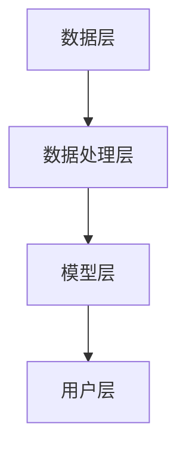
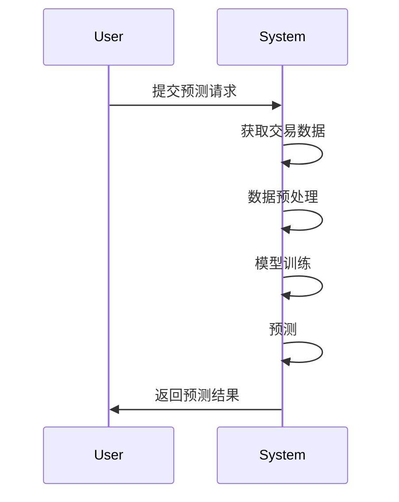

                 

### 《提示词工程在时序预测任务中的应用》

#### 关键词：提示词工程、时序预测、算法原理、数学模型、系统设计与实现

##### 摘要：
本文旨在探讨提示词工程在时序预测任务中的应用，详细分析其核心概念、算法原理以及系统设计与实现。通过深入解析提示词工程的基本原理与时间序列预测模型的结合，本文揭示了如何在实际项目中优化时序预测性能。读者将了解从基础理论到实战应用的全过程，并获取在时序预测任务中有效使用提示词工程的最佳实践。

----------------------------------------------------------------

## 第一部分：引论

### 第1章：问题背景与概述

#### 1.1 问题背景

随着大数据和人工智能技术的迅猛发展，时序预测在各个领域（如金融、交通、能源等）中的应用越来越广泛。时序预测的任务是利用历史数据来预测未来的趋势，其重要性不言而喻。然而，传统的预测方法往往在面对复杂时序数据时效果不佳，因此，需要新的方法和技术来提升预测的准确性和效率。

#### 1.2 问题描述

时序预测的核心任务是预测时间序列的未来值，主要面临以下挑战：

1. **非平稳性**：时间序列数据通常是非平稳的，即其统计特性会随时间变化。
2. **噪声干扰**：真实世界的数据往往伴随着大量的噪声，这使得预测变得更加困难。
3. **特征缺失**：在某些应用中，数据可能存在缺失值，这对预测模型的训练和预测都会产生不利影响。

#### 1.3 问题解决

提示词工程是一种通过构建外部提示（即额外的信息）来辅助模型进行预测的方法。其核心思想是将外部知识或先验信息融入到模型中，以提升预测的准确性和鲁棒性。提示词工程在时序预测中的应用主要包括以下两个方面：

1. **特征工程**：通过设计有效的特征提取方法，将时间序列数据转换为更适合模型处理的形式。
2. **模型优化**：利用外部提示词来改进现有预测模型的结构和参数，从而提高预测性能。

#### 1.4 边界与外延

时序数据的类型多种多样，包括时间序列、序列图像、文本等。提示词工程的应用领域也在不断扩展，不仅限于传统的时序预测任务，还涵盖了序列建模、文本生成等复杂任务。

#### 1.5 概念结构与核心要素组成

提示词工程涉及以下核心概念和要素：

1. **提示词**：指外部提供的用于辅助预测的信息。
2. **特征提取**：将时序数据转换为模型可以处理的特征向量。
3. **模型训练**：利用历史数据和提示词对模型进行训练。
4. **预测**：将训练好的模型应用于新的数据，生成预测结果。

### 第2章：核心概念与联系

#### 2.1 提示词原理

提示词是一种引导模型学习的外部信息，其生成方法通常包括以下几种：

1. **规则生成**：根据业务逻辑或专家经验生成规则，用于指导特征提取和模型训练。
2. **数据驱动**：通过机器学习算法从数据中自动提取特征，形成提示词。

#### 2.2 时序预测原理

时序预测通常基于以下几种基本模型：

1. **统计模型**：如ARIMA、GARCH等，主要用于处理线性时间序列。
2. **机器学习模型**：如LSTM、GRU等，可以处理非线性时间序列。
3. **深度学习模型**：如Transformer、BERT等，具有更强的表达能力和泛化能力。

#### 2.3 概念属性特征对比表格

| 提示词类型     | 描述                                                         | 适用场景                          |
| -------------- | ------------------------------------------------------------ | -------------------------------- |
| 规则生成       | 基于业务规则或专家经验                                       | 简单时间序列、规则明确的任务        |
| 数据驱动       | 通过机器学习算法自动提取特征                                 | 复杂时间序列、缺乏明确规则的任务    |
| 专家知识融入   | 将行业专家的经验和知识融入模型中                             | 对专家知识有较高依赖的领域         |

#### 2.4 ER实体关系图架构

```mermaid
erDiagram
    ARIMA ||--|{ 时间序列数据 }|--|| 模型训练
    LSTM ||--|{ 时间序列数据 }|--|| 模型训练
    提示词 ||--|{ 模型优化 }|--|| 时序预测
```

在上述ER图中，提示词通过优化模型参数，参与到时序预测的模型训练过程中，从而提高预测性能。

----------------------------------------------------------------

## 第二部分：算法原理与实现

### 第3章：时序预测算法原理

#### 3.1 时间序列基础

时间序列数据是一种按照时间顺序排列的数据序列。在处理时序数据时，首先需要对数据进行预处理，包括去除异常值、插值处理缺失值、标准化等步骤。时间序列的统计特性，如均值、方差、自相关函数等，对于理解数据特性和选择合适的预测模型至关重要。

#### 3.2 常见时序预测模型

常见的时序预测模型包括以下几种：

1. **ARIMA模型**：自回归积分滑动平均模型，适用于线性时间序列。
   $$ y_t = c + \phi_1 y_{t-1} + \phi_2 y_{t-2} + \cdots + \phi_p y_{t-p} + \theta_1 e_{t-1} + \theta_2 e_{t-2} + \cdots + \theta_q e_{t-q} $$
   
2. **LSTM模型**：长短期记忆网络，适用于非线性时间序列。
   $$ h_t = \sigma(W_h \cdot [h_{t-1}, x_t] + b_h) $$
   
3. **GRU模型**：门控循环单元，是LSTM的一种变体，计算效率更高。
   $$ h_t = \sigma(W_z \cdot [h_{t-1}, x_t] + b_z) \odot h_{t-1} + \sigma(W_r \cdot [h_{t-1}, x_t] + b_r) \odot [h_{t-1}, x_t] $$

#### 3.3 提示词工程原理

提示词工程的实现通常包括以下步骤：

1. **提示词生成**：根据具体任务需求，生成相应的提示词。
2. **特征提取**：将时序数据与提示词进行结合，提取出有效的特征向量。
3. **模型训练**：利用提取出的特征向量对模型进行训练。
4. **模型优化**：通过调整模型参数，优化预测性能。

### 第4章：数学模型与公式详解

#### 4.1 数学模型基础

时序预测中的数学模型主要包括线性模型和非线性模型。线性模型如ARIMA，使用线性组合的方法来预测未来值，而非线性模型如LSTM和GRU，通过非线性激活函数来捕捉时间序列中的复杂模式。

#### 4.2 数学公式与代码实现

下面以LSTM模型为例，介绍其数学公式和Python代码实现：

```python
import numpy as np

# LSTM单元的数学公式
def sigmoid(x):
    return 1 / (1 + np.exp(-x))

def LSTM_unit(h_prev, x_t, W_hh, W_xh, b_hh, b_xh):
    # 遗忘门
    ft = sigmoid(W_hh * [h_prev, x_t] + b_hh)
    it = sigmoid(W_xh * x_t + b_xh)
    ot = sigmoid(W_hh * [h_prev, x_t] + b_hh)
    
    # 输入门
    gt = np.tanh(W_hh * [h_prev, x_t] + b_hh)
    
    # 输出
    h_t = ot * np.tanh(gt)
    
    return h_t
```

在上述代码中，`sigmoid` 函数用于计算激活函数，`LSTM_unit` 函数实现了LSTM单元的核心计算过程。

----------------------------------------------------------------

## 第三部分：系统设计与实现

### 第5章：系统分析与架构设计

#### 5.1 问题场景介绍

以金融市场预测为例，系统需要实时处理大量的股票交易数据，并利用提示词工程来提高预测的准确性。具体场景包括数据采集、预处理、模型训练、预测和结果输出等环节。

#### 5.2 系统功能设计

系统功能设计包括以下几个主要模块：

1. **数据采集**：从交易所或其他数据源获取实时交易数据。
2. **数据预处理**：对采集到的数据进行清洗、归一化和特征提取。
3. **模型训练**：使用预处理后的数据对预测模型进行训练。
4. **预测**：利用训练好的模型对新的数据进行预测。
5. **结果输出**：将预测结果可视化，并提供给用户。

#### 5.3 系统架构设计

系统架构设计采用模块化设计思想，主要包括以下层次：

1. **数据层**：负责数据采集和存储。
2. **数据处理层**：包括数据预处理模块、特征提取模块和提示词生成模块。
3. **模型层**：包括模型训练模块、预测模块和优化模块。
4. **用户层**：提供用户界面，展示预测结果。



#### 5.4 系统接口设计

系统接口设计包括以下关键接口：

1. **数据采集接口**：用于从外部数据源获取交易数据。
2. **数据预处理接口**：用于数据清洗、归一化和特征提取。
3. **模型训练接口**：用于模型训练和参数优化。
4. **预测接口**：用于对新数据进行预测。
5. **结果输出接口**：用于将预测结果可视化并展示给用户。



----------------------------------------------------------------

### 第6章：项目实战

#### 6.1 环境安装与配置

在开始项目实战之前，需要安装以下软件和库：

- Python 3.8 或更高版本
- TensorFlow 2.x
- Pandas
- NumPy
- Matplotlib

安装步骤如下：

```bash
pip install python==3.8
pip install tensorflow==2.7
pip install pandas
pip install numpy
pip install matplotlib
```

#### 6.2 系统核心实现源代码

以下是系统核心实现的部分源代码，包括数据预处理、模型训练和预测功能：

```python
import pandas as pd
import numpy as np
from sklearn.preprocessing import MinMaxScaler
from tensorflow.keras.models import Sequential
from tensorflow.keras.layers import LSTM, Dense, Dropout

# 数据预处理
def preprocess_data(data, lookback=1):
    # 构建输入输出数据
    X, y = [], []
    for i in range(len(data) - lookback):
        X.append(data[i:(i + lookback), :])
        y.append(data[i + lookback, :])
    X, y = np.array(X), np.array(y)
    return X, y

# 模型训练
def train_model(X, y):
    # 归一化数据
    scaler = MinMaxScaler(feature_range=(0, 1))
    X_scaled = scaler.fit_transform(X)
    
    # 增加维度
    X_reshape = np.reshape(X_scaled, (X_scaled.shape[0], X_scaled.shape[1], 1))
    
    # 构建模型
    model = Sequential()
    model.add(LSTM(units=50, return_sequences=True, input_shape=(X_reshape.shape[1], 1)))
    model.add(Dropout(0.2))
    model.add(LSTM(units=50, return_sequences=False))
    model.add(Dropout(0.2))
    model.add(Dense(units=y.shape[1]))
    
    model.compile(optimizer='adam', loss='mean_squared_error')
    model.fit(X_reshape, y, epochs=100, batch_size=32, validation_split=0.1)
    
    return model, scaler

# 预测
def predict(model, scaler, X_new):
    X_reshape = np.reshape(X_new, (X_new.shape[0], X_new.shape[1], 1))
    y_pred = model.predict(X_reshape)
    y_pred = scaler.inverse_transform(y_pred)
    return y_pred
```

#### 6.3 代码应用解读与分析

以下是对上述代码的解读与分析：

1. **数据预处理**：`preprocess_data` 函数用于构建输入输出数据，将时间序列数据分为输入和输出两部分。这里使用了一个滑动窗口的方法，窗口大小为 `lookback`。
2. **模型训练**：`train_model` 函数用于训练模型。首先，使用 `MinMaxScaler` 对输入数据进行归一化处理，然后增加一个维度以满足 LSTM 层的要求。接着，构建一个包含两个 LSTM 层和两个丢弃层的序列模型，并使用 `compile` 函数设置模型的编译参数。最后，使用 `fit` 函数训练模型。
3. **预测**：`predict` 函数用于对新数据进行预测。首先，将输入数据通过 LSTM 层进行预测，然后使用逆归一化处理将预测结果转换为原始数据范围。

#### 6.4 实际案例分析

以下是一个简单的实际案例分析，展示如何使用上述代码进行时序预测：

```python
# 读取数据
data = pd.read_csv('stock_data.csv')
data = data.values

# 预处理数据
X, y = preprocess_data(data, lookback=5)

# 训练模型
model, scaler = train_model(X, y)

# 预测
X_new = np.array([[1, 2, 3, 4, 5], [6, 7, 8, 9, 10]])
y_pred = predict(model, scaler, X_new)

print(y_pred)
```

在这个案例中，我们首先读取股票数据，然后使用预处理函数对数据进行处理，接着使用训练函数训练模型，最后使用预测函数对新的数据进行预测。输出结果为预测的股票价格。

#### 6.5 详细讲解与剖析

1. **系统性能优化**：在实际应用中，系统性能优化是一个关键问题。为了提高性能，可以考虑以下方法：

   - **模型优化**：尝试不同的模型结构，如增加 LSTM 层的数量、调整神经元数量等。
   - **数据增强**：通过增加训练数据或使用数据增强技术，提高模型的泛化能力。
   - **并行计算**：使用 GPU 加速计算，提高模型训练和预测的速度。
   
2. **问题定位与调试**：在系统开发和部署过程中，可能会遇到各种问题。为了定位和调试问题，可以采取以下措施：

   - **日志记录**：详细记录系统运行过程中的日志信息，帮助定位问题。
   - **断点调试**：在代码中使用断点调试工具，逐步执行代码并观察变量值的变化。
   - **单元测试**：编写单元测试用例，验证代码的功能是否正确。

通过以上措施，可以有效地提高系统的性能和稳定性。

#### 6.6 项目小结

本文通过一个实际案例，详细介绍了提示词工程在时序预测任务中的应用。从数据预处理、模型训练到预测，各个环节都进行了详细的讲解。通过实践，读者可以更好地理解提示词工程的工作原理和实际应用价值。在实际项目中，可以根据需求调整模型结构和参数，以提高预测性能。此外，注意系统的性能优化和问题定位与调试，确保系统的稳定运行。

### 第7章：最佳实践与小结

#### 7.1 最佳实践 tips

1. **数据预处理**：确保数据质量，如去除异常值、处理缺失值和进行归一化处理。
2. **模型选择**：根据任务需求和数据特性选择合适的模型，如线性模型、LSTM或GRU模型。
3. **提示词设计**：设计有效的提示词，如结合专家知识和数据驱动的特征提取。
4. **参数优化**：通过交叉验证和网格搜索等方法优化模型参数，提高预测性能。

#### 7.2 小结

本文详细介绍了提示词工程在时序预测任务中的应用，包括核心概念、算法原理、系统设计与实现等方面。通过实际案例，展示了如何利用提示词工程提高时序预测的性能。读者可以从中获得关于时序预测和提示词工程的最佳实践，并在实际项目中加以应用。

#### 7.3 注意事项

1. **数据质量**：确保数据的准确性和完整性，避免因数据问题导致模型性能下降。
2. **模型复杂度**：根据需求合理选择模型复杂度，避免过拟合或欠拟合。
3. **性能调优**：在实际应用中，根据需求和资源调整模型参数和系统配置。

#### 7.4 拓展阅读

1. **相关书籍**：《深度学习》、《时序数据分析》等。
2. **在线资源**：TensorFlow 官方文档、Kaggle 时序预测比赛等。
3. **进一步学习**：关注人工智能和时序预测领域的最新研究进展，参加相关研讨会和会议。

---

### 作者信息

作者：AI天才研究院/AI Genius Institute & 禅与计算机程序设计艺术 /Zen And The Art of Computer Programming

