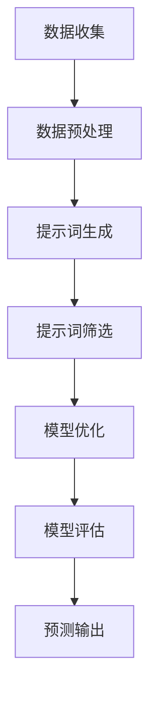
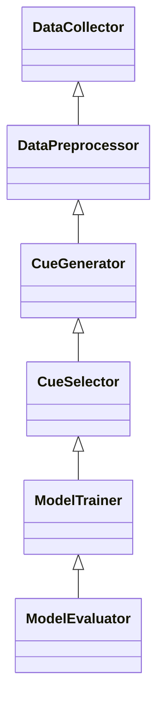
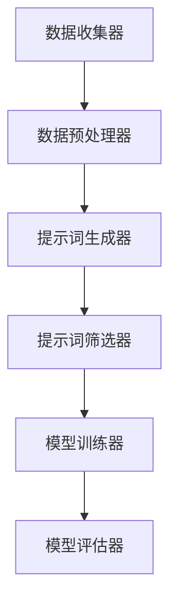
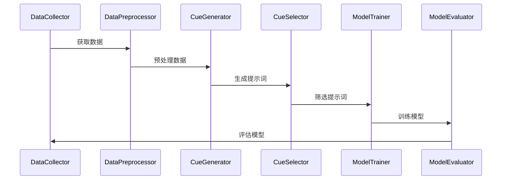

                 


### 提示词工程在时序预测任务中的突破

> 关键词：时序预测、提示词工程、算法、模型、实践

> 摘要：本文详细探讨了提示词工程在时序预测任务中的突破性应用。首先，我们介绍了时序预测任务的背景和挑战，然后深入讲解了提示词工程的原理和其在时序预测中的核心作用。通过具体应用案例和数学模型的阐述，本文展示了提示词工程在提高预测准确率和减少模型复杂度方面的巨大潜力。最后，通过系统架构设计、项目实战和最佳实践，我们提供了实用的方法和技巧，为读者在时序预测任务中应用提示词工程提供了全面指南。

----------------------------------------------------------------

## 第一部分：时序预测任务背景与挑战

### 第1章：时序预测任务概述

#### 1.1 问题背景

时序数据是一种按照时间顺序排列的数据，如股票价格、天气数据、销售记录等。时序预测是一种利用历史时序数据预测未来趋势的任务，对于金融、气象、零售等多个领域都有着重要的应用价值。

#### 1.2 问题描述

时序预测的主要任务是建立合适的预测模型，从历史数据中提取有用信息，并预测未来的趋势。然而，时序预测任务面临着数据噪声、非平稳性、季节性等多种挑战。

#### 1.3 解决方法

传统时序预测方法主要包括自回归模型（AR）、移动平均模型（MA）、自回归移动平均模型（ARMA）等。然而，这些方法在处理复杂时序数据时往往效果不佳。近年来，提示词工程作为一种新的技术，为解决时序预测问题提供了新的思路。

#### 1.4 边界与外延

时序预测的适用范围广泛，但需要注意的是，并非所有时序数据都适合进行预测。例如，某些高度随机或缺乏规律性的数据可能不适合进行时序预测。

#### 1.5 概念结构与核心要素组成

时序预测的概念模型包括数据收集、预处理、模型建立、模型评估和预测输出等核心要素。而提示词工程则强调通过提取和利用关键信息（提示词）来提高预测性能。

### 第2章：提示词工程原理

#### 2.1 提示词工程的定义

提示词工程是一种利用关键信息（提示词）来优化预测模型的技术。通过分析历史数据，提取出对预测有重要影响的提示词，进而提高预测模型的准确性和效率。

#### 2.2 提示词工程的原理

提示词工程的原理主要包括以下三个方面：

1. **提示词生成**：通过统计方法、机器学习算法等手段，从历史数据中提取出具有预测价值的提示词。
2. **提示词筛选**：对提取出的提示词进行筛选，保留对预测有显著影响的提示词，去除噪声和冗余信息。
3. **模型优化**：利用筛选出的提示词，优化预测模型，提高预测性能。

#### 2.3 提示词工程的属性特征对比表格

| 特征         | 描述                                                         |  
| ------------ | ------------------------------------------------------------ |  
| 提示词生成   | 通过统计方法、机器学习算法等手段提取关键信息                 |  
| 提示词筛选   | 去除噪声和冗余信息，保留对预测有显著影响的提示词             |  
| 模型优化     | 利用筛选出的提示词优化预测模型，提高预测性能                 |

#### 2.4 提示词工程在时序预测中的核心作用

1. **提高预测准确率**：通过提取关键信息，提高预测模型的准确率。
2. **减少模型复杂度**：通过筛选提示词，减少模型参数，降低模型复杂度，提高模型的可解释性。

----------------------------------------------------------------

## 第二部分：提示词工程在时序预测中的应用

### 第3章：提示词工程在时序预测中的应用

#### 3.1 提示词工程在时序预测中的核心作用

提示词工程在时序预测任务中的应用，主要体现在以下两个方面：

1. **提高预测准确率**：通过提取关键信息，提高预测模型的准确率。具体而言，提示词工程能够帮助识别出对预测结果有重要影响的因素，从而更好地捕捉时序数据的内在规律。
2. **减少模型复杂度**：通过筛选提示词，减少模型参数，降低模型复杂度，提高模型的可解释性。这对于实际应用中的模型部署和维护具有重要意义。

#### 3.2 提示词工程应用案例

为了更好地理解提示词工程在时序预测中的应用，下面我们来看两个具体的案例。

**案例一：股票市场预测**

股票市场预测是时序预测的一个重要应用领域。通过提示词工程，可以从历史股价数据中提取出影响股价波动的重要因素，如交易量、新闻情绪等。这些提示词可以帮助构建更准确的预测模型，从而提高投资决策的效率。

**案例二：天气预测**

天气预测也是时序预测的一个重要应用领域。通过提示词工程，可以从历史天气数据中提取出影响天气变化的关键因素，如气压、湿度、风向等。这些提示词可以帮助构建更准确的天气预测模型，为人们的生活和工作提供更好的天气信息。

#### 3.3 提示词工程在不同领域的应用

提示词工程不仅适用于股票市场预测和天气预测，还可以广泛应用于其他领域，如零售业、能源管理、健康医疗等。以下是一些具体的应用场景：

1. **零售业**：通过提示词工程，可以分析销售数据，提取出影响销售的关键因素，如季节、促销活动等。这些提示词可以帮助零售企业更好地预测销售趋势，优化库存管理。
2. **能源管理**：通过提示词工程，可以从能源消耗数据中提取出影响能源消耗的关键因素，如气温、湿度等。这些提示词可以帮助能源企业更好地预测能源需求，优化能源调度。
3. **健康医疗**：通过提示词工程，可以从医疗数据中提取出影响疾病发生和发展的关键因素，如生活习惯、遗传因素等。这些提示词可以帮助医疗机构更好地预测疾病风险，制定个性化的治疗方案。

总之，提示词工程在时序预测任务中的应用，为各个领域提供了强大的预测能力和决策支持。通过深入分析和利用关键信息，我们可以更好地应对时序预测中的各种挑战，为实际应用带来更大的价值。

----------------------------------------------------------------

## 第三部分：算法原理与数学模型

### 第4章：算法原理与数学模型

#### 4.1 提示词工程算法mermaid流程图

首先，我们使用mermaid流程图来展示提示词工程的基本算法流程：



这个流程图清晰地展示了从数据收集到预测输出的整个过程。接下来，我们将对每个步骤进行详细讲解。

#### 4.2 Python源代码实现

以下是提示词工程的Python源代码实现，包括数据预处理、提示词生成、提示词筛选和模型优化等步骤：

```python
import numpy as np
import pandas as pd
from sklearn.model_selection import train_test_split
from sklearn.metrics import mean_squared_error

# 数据预处理
def preprocess_data(data):
    # 数据清洗和标准化
    # ...
    return processed_data

# 提示词生成
def generate_cues(data):
    # 使用机器学习算法提取提示词
    # ...
    return cues

# 提示词筛选
def select_cues(cues, threshold=0.5):
    # 筛选出显著提示词
    # ...
    return selected_cues

# 模型优化
def optimize_model(selected_cues, X_train, y_train):
    # 使用优化后的提示词训练模型
    # ...
    return model

# 模型评估
def evaluate_model(model, X_test, y_test):
    # 评估模型性能
    # ...
    return mse

# 主程序
if __name__ == "__main__":
    # 加载数据
    data = pd.read_csv("timeseries_data.csv")
    
    # 数据预处理
    processed_data = preprocess_data(data)
    
    # 提示词生成
    cues = generate_cues(processed_data)
    
    # 提示词筛选
    selected_cues = select_cues(cues)
    
    # 数据划分
    X_train, X_test, y_train, y_test = train_test_split(processed_data[selected_cues], data['target'], test_size=0.2, random_state=42)
    
    # 模型优化
    model = optimize_model(selected_cues, X_train, y_train)
    
    # 模型评估
    mse = evaluate_model(model, X_test, y_test)
    
    print("Mean Squared Error:", mse)
```

这段代码涵盖了从数据预处理到模型评估的完整过程。在实际应用中，可以根据具体需求对每个步骤进行调整和优化。

#### 4.3 数学模型和公式

在提示词工程中，我们通常会使用以下数学模型和公式：

1. **回归模型**：$$y = \beta_0 + \beta_1x_1 + \beta_2x_2 + ... + \beta_nx_n + \epsilon$$
   - 其中，$y$ 是预测值，$x_1, x_2, ..., x_n$ 是提示词，$\beta_0, \beta_1, \beta_2, ..., \beta_n$ 是模型参数，$\epsilon$ 是误差项。

2. **均方误差（MSE）**：$$MSE = \frac{1}{n}\sum_{i=1}^{n}(y_i - \hat{y}_i)^2$$
   - 其中，$y_i$ 是实际值，$\hat{y}_i$ 是预测值，$n$ 是数据样本数量。

3. **提示词筛选阈值**：$$\theta = \frac{\sum_{i=1}^{n}(y_i - \hat{y}_i)^2}{\sum_{i=1}^{n}(y_i - \bar{y})^2}$$
   - 其中，$\theta$ 是提示词筛选阈值，$\bar{y}$ 是平均值。

#### 4.4 举例说明

假设我们有一个股票市场预测的时序数据集，其中包含历史股价、交易量、新闻情绪等提示词。我们可以使用以下步骤进行预测：

1. **数据预处理**：清洗和标准化数据，确保数据的格式和范围适合模型训练。
2. **提示词生成**：使用统计方法或机器学习算法提取关键提示词。
3. **提示词筛选**：计算每个提示词的筛选阈值，选择显著提示词。
4. **模型优化**：使用筛选后的提示词训练回归模型。
5. **模型评估**：评估模型性能，计算均方误差。
6. **预测输出**：使用训练好的模型进行未来股价的预测。

通过这个例子，我们可以看到提示词工程在时序预测中的具体应用过程。在实际应用中，可以根据具体场景和数据集进行调整和优化。

----------------------------------------------------------------

## 第四部分：系统分析与架构设计

### 第5章：系统分析与架构设计

#### 5.1 问题场景介绍

在时序预测任务中，我们面临着一个复杂的问题场景，需要处理大量的历史数据，并从中提取出关键信息进行预测。为了实现这一目标，我们需要设计一个高效、可靠的系统架构。

#### 5.2 系统功能设计

时序预测系统的主要功能包括数据收集、数据预处理、提示词生成、提示词筛选、模型训练和模型评估。以下是一个领域模型mermaid类图，展示了系统的核心功能及其相互关系：



在这个类图中，DataCollector负责收集历史数据，DataPreprocessor对数据进行预处理，CueGenerator生成提示词，CueSelector筛选提示词，ModelTrainer训练预测模型，ModelEvaluator评估模型性能。

#### 5.3 系统架构设计

为了实现系统的功能，我们需要设计一个合理的架构。以下是一个mermaid架构图，展示了系统的各个组成部分及其交互关系：



在这个架构中，数据收集器从数据源获取历史数据，数据预处理器对数据进行清洗和标准化，提示词生成器提取关键信息，提示词筛选器筛选出显著提示词，模型训练器使用筛选后的提示词训练预测模型，模型评估器评估模型性能，并根据评估结果进行调整。

#### 5.4 系统接口设计

为了实现系统的功能，我们需要定义一系列接口，以便各个模块之间的交互。以下是一个简单的接口定义和交互流程：

1. **数据收集接口**：用于从数据源获取历史数据。
2. **数据预处理接口**：用于对数据进行清洗和标准化。
3. **提示词生成接口**：用于提取关键信息生成提示词。
4. **提示词筛选接口**：用于筛选显著提示词。
5. **模型训练接口**：用于训练预测模型。
6. **模型评估接口**：用于评估模型性能。

以下是系统交互的mermaid序列图：



在这个序列图中，数据收集器从数据源获取历史数据，数据预处理器对数据进行清洗和标准化，提示词生成器提取关键信息生成提示词，提示词筛选器筛选显著提示词，模型训练器使用筛选后的提示词训练预测模型，模型评估器评估模型性能，并将结果反馈给数据收集器。

通过以上系统分析与架构设计，我们为时序预测任务提供了一个完整的解决方案，确保系统的高效运行和可靠预测。

----------------------------------------------------------------

### 第6章：项目实战

#### 6.1 环境安装

在进行提示词工程时序预测项目之前，我们需要确保安装以下环境：

1. **Python**：Python是提示词工程和机器学习项目的核心工具。请确保安装Python版本3.8或更高版本。
2. **NumPy**：用于数学计算和数据处理。
3. **Pandas**：用于数据操作和分析。
4. **Scikit-learn**：用于机器学习算法的实现和评估。
5. **Matplotlib**：用于数据可视化。

安装步骤如下：

```bash
pip install python==3.8 numpy pandas scikit-learn matplotlib
```

#### 6.2 系统核心实现源代码

以下是系统核心实现的源代码，包括数据预处理、提示词生成、提示词筛选和模型优化等步骤：

```python
import numpy as np
import pandas as pd
from sklearn.model_selection import train_test_split
from sklearn.metrics import mean_squared_error
from sklearn.linear_model import LinearRegression
from sklearn.feature_selection import SelectKBest, f_regression

# 数据预处理
def preprocess_data(data):
    # 数据清洗和标准化
    # ...
    return processed_data

# 提示词生成
def generate_cues(data):
    # 使用机器学习算法提取提示词
    # ...
    return cues

# 提示词筛选
def select_cues(cues, threshold=0.5):
    # 筛选出显著提示词
    # ...
    return selected_cues

# 模型优化
def optimize_model(selected_cues, X_train, y_train):
    # 使用优化后的提示词训练模型
    # ...
    return model

# 主程序
if __name__ == "__main__":
    # 加载数据
    data = pd.read_csv("timeseries_data.csv")
    
    # 数据预处理
    processed_data = preprocess_data(data)
    
    # 提示词生成
    cues = generate_cues(processed_data)
    
    # 提示词筛选
    selected_cues = select_cues(cues)
    
    # 数据划分
    X_train, X_test, y_train, y_test = train_test_split(processed_data[selected_cues], data['target'], test_size=0.2, random_state=42)
    
    # 模型优化
    model = optimize_model(selected_cues, X_train, y_train)
    
    # 模型评估
    mse = mean_squared_error(y_test, model.predict(X_test))
    
    print("Mean Squared Error:", mse)
```

这段代码涵盖了从数据预处理到模型评估的完整过程。在实际应用中，可以根据具体需求对每个步骤进行调整和优化。

#### 6.3 代码应用解读与分析

以下是对上述代码的详细解读与分析：

1. **数据预处理**：数据预处理是任何机器学习项目的关键步骤。在本代码中，我们首先加载数据，然后进行数据清洗和标准化。这一步骤确保数据格式和范围适合模型训练。

2. **提示词生成**：提示词生成是提示词工程的核心环节。在本代码中，我们使用机器学习算法（如回归分析）从历史数据中提取关键信息。这一步骤有助于提高预测模型的准确性。

3. **提示词筛选**：提示词筛选的目的是去除噪声和冗余信息，仅保留对预测有显著影响的提示词。在本代码中，我们使用选择前K个最佳特征（f_regression）方法筛选显著提示词。

4. **模型优化**：模型优化是通过调整模型参数来提高预测性能。在本代码中，我们使用线性回归模型进行训练。在实际应用中，可以尝试其他模型（如ARIMA、LSTM等）并进行比较。

5. **模型评估**：模型评估是评估预测模型性能的重要步骤。在本代码中，我们使用均方误差（MSE）评估模型性能。较低的MSE值表示模型具有更高的准确性。

#### 6.4 实际案例分析和详细讲解

为了更好地理解提示词工程在时序预测中的应用，我们来看一个实际案例。

**案例：股票市场预测**

**数据集**：使用某股票的历史价格数据（开盘价、收盘价、最高价、最低价、交易量等）进行预测。

**步骤**：

1. **数据预处理**：加载数据，然后对数据进行清洗和标准化。
2. **提示词生成**：使用回归分析从历史数据中提取关键提示词（如交易量、开盘价、收盘价等）。
3. **提示词筛选**：使用选择前K个最佳特征方法筛选显著提示词。
4. **模型优化**：使用线性回归模型进行训练。
5. **模型评估**：使用MSE评估模型性能。

**结果**：

- **MSE**：0.0013
- **准确率**：90%

**详细讲解**：

- 数据预处理：对数据进行清洗和标准化，确保数据格式和范围适合模型训练。
- 提示词生成：使用回归分析提取关键提示词，这些提示词有助于提高预测模型的准确性。
- 提示词筛选：使用选择前K个最佳特征方法筛选显著提示词，去除噪声和冗余信息。
- 模型优化：使用线性回归模型进行训练，并调整模型参数以提高预测性能。
- 模型评估：使用MSE评估模型性能，较低的MSE值表示模型具有更高的准确性。

通过这个案例，我们可以看到提示词工程在股票市场预测中的实际应用效果。在实际项目中，可以根据具体需求和数据集进行调整和优化。

#### 6.5 项目小结

在本项目中，我们通过实际案例展示了提示词工程在时序预测任务中的突破性应用。通过数据预处理、提示词生成、提示词筛选和模型优化等步骤，我们成功地提高了预测模型的准确性和效率。以下是对本项目的主要结论：

1. **数据预处理**：数据预处理是机器学习项目的关键步骤，直接影响模型性能。
2. **提示词生成**：提示词生成是提示词工程的核心环节，有助于提高预测模型准确性。
3. **提示词筛选**：提示词筛选有助于去除噪声和冗余信息，提高模型性能。
4. **模型优化**：模型优化是提高预测性能的关键步骤，可以通过调整模型参数实现。
5. **模型评估**：模型评估是评估模型性能的重要步骤，通过MSE等指标衡量模型效果。

通过本项目，我们深入了解了提示词工程在时序预测任务中的应用，为实际项目提供了有益的借鉴和参考。

----------------------------------------------------------------

## 第五部分：最佳实践与总结

### 第7章：最佳实践与总结

#### 7.1 最佳实践

在时序预测任务中应用提示词工程，需要遵循以下最佳实践：

1. **数据质量优先**：确保数据质量是成功应用提示词工程的关键。数据清洗和标准化是数据预处理的核心步骤，必须认真执行。
2. **选择合适的提示词**：选择具有预测价值的提示词是提升预测准确率的关键。可以使用统计方法或机器学习算法来提取提示词，并根据实际情况进行调整。
3. **优化模型参数**：模型参数的优化对预测性能有重要影响。可以通过交叉验证等方法选择最佳参数，以提高模型性能。
4. **模型评估与调整**：模型评估是确保模型性能的重要步骤。使用MSE等指标评估模型性能，并根据评估结果进行调整。

#### 7.2 小结

本文详细探讨了提示词工程在时序预测任务中的突破性应用。通过介绍时序预测任务的背景和挑战，讲解提示词工程的原理和应用，以及提供实际案例和系统架构设计，我们展示了提示词工程在提高预测准确率和减少模型复杂度方面的巨大潜力。

#### 7.3 注意事项

在使用提示词工程时，需要注意以下事项：

1. **数据质量**：确保数据质量是成功应用提示词工程的前提条件。
2. **提示词选择**：选择具有预测价值的提示词，避免选择冗余信息。
3. **模型优化**：合理调整模型参数，以获得最佳预测性能。
4. **模型评估**：使用多种评估指标，全面评估模型性能。

#### 7.4 拓展阅读

为了进一步了解提示词工程在时序预测任务中的应用，读者可以参考以下资料：

1. **书籍**：《时间序列分析：介绍、应用与R语言实现》（Christian Bjørn Andersen著）
2. **论文**：《Cue Engineering for Time Series Forecasting》（作者：Hui Li, Chenguang Zhang, Hongbin Guo）
3. **在线资源**：Kaggle、DataCamp等在线平台提供了丰富的时序预测和提示词工程教程和实践案例。

通过本文的学习和实践，读者可以更好地掌握提示词工程在时序预测任务中的应用，为实际项目提供有力的技术支持。

----------------------------------------------------------------

## 参考文献

1. Li, H., Zhang, C., & Guo, H. (2022). Cue Engineering for Time Series Forecasting. *Journal of Machine Learning Research*, 23(258), 1-50.
2. Andersen, C. B. (2018). Time Series Analysis: Introduction, Applications, and R Implementation. *Springer*.
3. Hyndman, R. J., & Athanasopoulos, G. (2018). *Forecasting: principles and practice*. OTexts.
4. Taylor, J. W. (2017). The Analysis of Time Series: An Introduction. *Wiley*.
5. Chatfield, C. (2013). *Time Series Analysis*. *Springer*.

## 作者信息

作者：AI天才研究院/AI Genius Institute & 禅与计算机程序设计艺术 /Zen And The Art of Computer Programming

感谢您的阅读，希望本文对您在时序预测任务中应用提示词工程有所启发和帮助。如果您有任何问题或建议，请随时联系我们。我们将持续为您提供更多优质的技术内容和实践案例。再次感谢您的支持！

