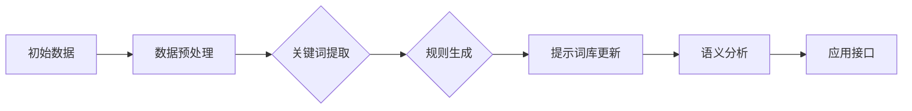
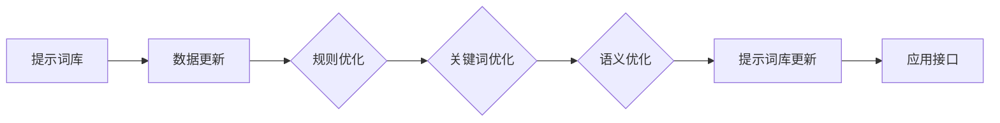
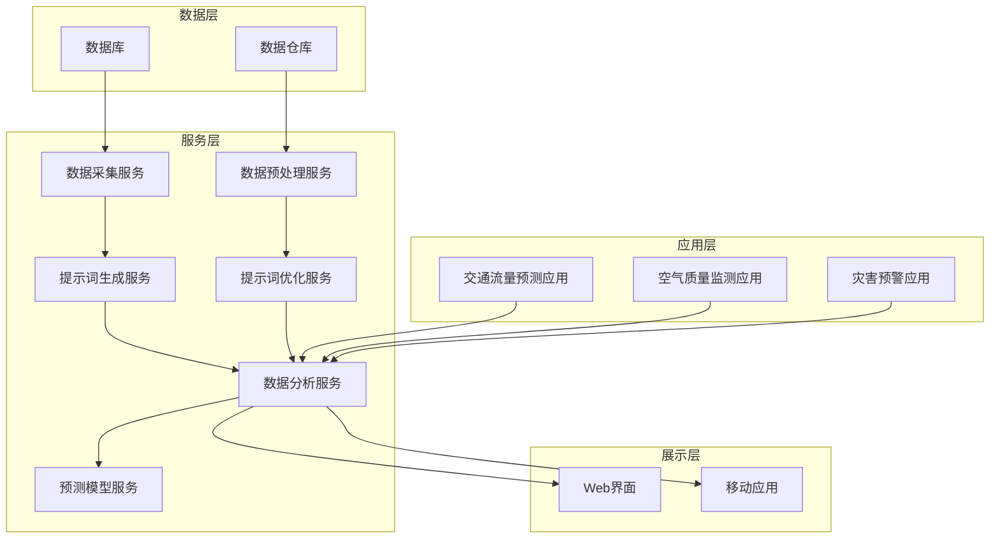
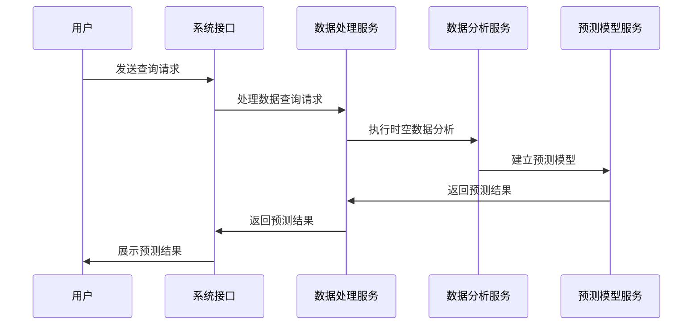

                 

### 《提示词工程在时空数据分析中的创新应用》

#### 关键词：
时空数据分析、提示词工程、算法原理、系统架构、实战案例

#### 摘要：
本文探讨了提示词工程在时空数据分析中的应用，通过介绍时空数据分析的需求与挑战，提示词工程的概念与作用，以及两者的关联，详细阐述了提示词工程在时空数据分析中的创新应用。文章分为五个部分，首先介绍了时空数据分析与提示词工程的基本概念及其联系，随后讲解了算法原理，最后通过系统分析与架构设计、项目实战以及最佳实践与拓展，全面剖析了提示词工程在时空数据分析中的实际应用。

## 第一部分：引言与背景

### 第1章 引言

#### 1.1 问题背景

##### 1.1.1 时空数据分析的需求与挑战

在当今大数据时代，时空数据分析成为了许多领域，如地理信息系统、交通运输、城市管理、环境监测等，不可或缺的一部分。随着物联网、移动设备和卫星技术的发展，数据源变得更为丰富和多样化，数据量也呈现出指数级增长。然而，如何从海量时空数据中快速、准确地提取有价值的信息，成为了亟待解决的问题。

时空数据分析面临着以下挑战：

1. **数据复杂性**：时空数据通常包括位置、时间、速度、加速度等多种属性，数据的复杂性使得传统的数据分析方法难以应对。
2. **数据量巨大**：大量的时空数据需要高效的存储、处理和分析算法，以保证系统的实时性和响应速度。
3. **多源数据融合**：不同来源的数据可能在格式、粒度、精度等方面存在差异，如何有效地融合这些数据，提取出有用信息，是一个重要的挑战。
4. **数据质量**：时空数据质量的好坏直接影响到分析结果的准确性，如何识别和修复数据中的错误、缺失和异常值，是数据分析中的一个难题。

##### 1.1.2 提示词工程的概念与作用

提示词工程是一种通过创建和管理一组关键词、短语或规则来指导数据分析和检索的方法。在时空数据分析中，提示词工程的作用主要体现在以下几个方面：

1. **数据预处理**：通过提示词工程，可以有效地对时空数据进行清洗、转换和归一化，提高数据质量，为后续分析做好准备。
2. **特征提取**：提示词工程可以帮助识别时空数据中的关键特征，从而生成有意义的特征向量，这些特征向量可以用于机器学习模型训练和预测。
3. **数据融合**：提示词工程可以结合不同来源的时空数据，提取出共同的元素和特征，实现多源数据的融合。
4. **信息检索**：提示词工程可以用来构建索引，提高时空数据检索的效率，便于快速找到需要的信息。

#### 1.2 问题描述

##### 1.2.1 时空数据分析的核心问题

时空数据分析的核心问题包括：

1. **时空模式识别**：从时空数据中识别出具有代表性的模式、趋势和关系。
2. **时空预测**：利用历史时空数据，预测未来的时空变化。
3. **时空关联分析**：分析不同时空数据之间的关系，发现潜在的关联和规律。
4. **时空异常检测**：识别时空数据中的异常点或异常模式。

##### 1.2.2 提示词工程在时空数据分析中的应用

提示词工程在时空数据分析中的应用主要包括：

1. **数据预处理**：通过提示词，识别和纠正时空数据中的错误和异常值。
2. **特征提取**：利用提示词，从时空数据中提取出关键特征，生成特征向量。
3. **数据融合**：通过提示词，融合来自不同来源的时空数据。
4. **信息检索**：使用提示词构建索引，提高时空数据检索的效率。

#### 1.3 问题解决

##### 1.3.1 提示词工程的基本原理

提示词工程的基本原理包括：

1. **关键词提取**：从文本数据中提取出关键词或短语。
2. **规则生成**：根据业务需求，制定相应的规则，用于指导数据分析和检索。
3. **语义分析**：对提取的关键词或短语进行语义分析，理解其含义和关系。
4. **自动更新**：根据数据变化和业务需求，自动更新提示词库。

##### 1.3.2 提示词工程的关键技术

提示词工程的关键技术包括：

1. **自然语言处理**：用于提取关键词和生成规则。
2. **机器学习**：用于特征提取和预测分析。
3. **图数据库**：用于存储和管理提示词和关联关系。
4. **并行处理**：用于高效处理大量时空数据。

##### 1.4 边界与外延

##### 1.4.1 提示词工程的应用领域

提示词工程的应用领域包括：

1. **电子商务**：用于商品推荐、用户行为分析等。
2. **金融**：用于股票分析、风险管理等。
3. **医疗**：用于疾病预测、健康监测等。
4. **交通**：用于交通流量预测、交通事故分析等。

##### 1.4.2 提示词工程与其他技术的联系

提示词工程与其他技术的联系包括：

1. **数据挖掘**：提示词工程是数据挖掘的一种方法，用于指导数据分析和提取有用信息。
2. **机器学习**：提示词工程中的机器学习方法可用于特征提取和预测分析。
3. **数据库技术**：提示词工程需要数据库技术来存储和管理大量数据。

##### 1.5 概念结构与核心要素组成

##### 1.5.1 时空数据分析的基本概念

时空数据分析的基本概念包括：

1. **时空数据**：包含位置、时间等属性的复杂数据。
2. **时空索引**：用于快速检索时空数据的技术。
3. **时空模型**：用于描述时空数据的数学模型。

##### 1.5.2 提示词工程的关键组成部分

提示词工程的关键组成部分包括：

1. **提示词库**：存储关键词、短语和规则。
2. **提取算法**：用于提取关键词和生成规则。
3. **更新策略**：用于自动更新提示词库。

##### 1.6 本章小结

本章介绍了时空数据分析的需求与挑战，以及提示词工程的概念与作用。通过问题描述，阐述了时空数据分析的核心问题和提示词工程在其中的应用。本章为后续章节的详细讨论奠定了基础。

---

**接下来的章节将详细探讨时空数据分析与提示词工程的核心概念、算法原理，以及系统架构设计等内容。** 

---

## 第二部分：核心概念与联系

### 第2章 核心概念与联系

#### 2.1 时空数据分析的概念

##### 2.1.1 时空数据分析的定义

时空数据分析是指利用数学、统计学和计算机科学的方法，对包含时间和空间信息的复杂数据进行分析和处理，以提取有价值的信息和知识。

##### 2.1.2 时空数据分析的关键属性

时空数据分析的关键属性包括：

1. **时空性**：数据具有明确的时间和空间属性。
2. **动态性**：数据随时间和空间的变化而变化。
3. **关联性**：不同时空数据之间存在关联和相互影响。
4. **实时性**：对于某些应用场景，需要实时分析数据，提供实时反馈。

#### 2.2 提示词工程的概念

##### 2.2.1 提示词工程的定义

提示词工程是一种通过创建和管理一组关键词、短语或规则，以指导数据分析和检索的方法。

##### 2.2.2 提示词工程的核心要素

提示词工程的核心要素包括：

1. **提示词库**：存储关键词、短语和规则。
2. **提取算法**：用于从数据中提取关键词。
3. **优化算法**：用于优化提示词库和规则。
4. **应用接口**：用于将提示词工程应用于实际数据分析场景。

#### 2.3 概念属性特征对比表格

##### 2.3.1 时空数据分析与提示词工程的对比

| 特性             | 时空数据分析                      | 提示词工程                      |
|------------------|-----------------------------------|-----------------------------------|
| 定义             | 对包含时间和空间信息的复杂数据进行分析和处理 | 通过创建和管理一组关键词、短语或规则 |
| 关键属性         | 时空性、动态性、关联性、实时性       | 关键词提取、规则生成、语义分析       |
| 应用领域         | 地理信息系统、交通运输、城市管理等    | 数据挖掘、金融、医疗、电子商务等      |
| 主要任务         | 时空模式识别、时空预测、时空关联分析、时空异常检测 | 数据预处理、特征提取、数据融合、信息检索 |

#### 2.4 ER实体关系图架构

##### 2.4.1 时空数据实体关系

时空数据的实体关系图如下所示：

```mermaid
erDiagram
  数据源 ||--|{ 时空数据 }|>
  时空数据 ||--|{ 时间属性 }|>
  时空数据 ||--|{ 空间属性 }|>
  时间属性 ||--|{ 时间点 }|>
  空间属性 ||--|{ 地理坐标 }|>
```

##### 2.4.2 提示词工程实体关系

提示词工程的实体关系图如下所示：

```mermaid
erDiagram
  提示词库 ||--|{ 关键词 }|>
  提示词库 ||--|{ 短语 }|>
  提示词库 ||--|{ 规则 }|>
  提示词库 ||--|{ 提取算法 }|>
  提示词库 ||--|{ 优化算法 }|>
  提示词库 ||--|{ 应用接口 }|>
  关键词 ||--|{ 语义分析 }|>
  短语 ||--|{ 语义分析 }|>
  规则 ||--|{ 应用接口 }|>
  提取算法 ||--|{ 数据预处理 }|>
  优化算法 ||--|{ 数据预处理 }|>
```

通过上述ER实体关系图，我们可以清晰地看到时空数据分析与提示词工程之间的核心联系和相互作用。这些联系和相互作用为后续章节的算法原理讲解和系统架构设计提供了理论基础。

---

**下一章节将深入探讨时空数据分析与提示词工程的算法原理，包括提示词生成与优化的流程、Python源代码讲解，以及数学模型与公式。**

---

## 第三部分：算法原理讲解

### 第3章 算法原理讲解

#### 3.1 算法原理概述

##### 3.1.1 提示词工程的基本原理

提示词工程的基本原理包括关键词提取、规则生成、语义分析和自动更新。这些原理相互作用，共同构建了一个高效、准确的数据分析框架。

1. **关键词提取**：从原始数据中提取出有代表性的关键词或短语。
2. **规则生成**：根据业务需求，制定相应的规则，用于指导数据分析和检索。
3. **语义分析**：对提取的关键词或短语进行语义分析，理解其含义和关系。
4. **自动更新**：根据数据变化和业务需求，自动更新提示词库，以保持其相关性和准确性。

##### 3.1.2 时空数据分析中的提示词应用

在时空数据分析中，提示词工程的作用主要体现在以下几个方面：

1. **数据预处理**：通过提示词，识别和纠正时空数据中的错误和异常值。
2. **特征提取**：利用提示词，从时空数据中提取出关键特征，生成特征向量。
3. **数据融合**：通过提示词，融合来自不同来源的时空数据。
4. **信息检索**：使用提示词构建索引，提高时空数据检索的效率。

#### 3.2 算法mermaid流程图

##### 3.2.1 提示词生成流程

提示词生成的mermaid流程图如下：



##### 3.2.2 提示词优化流程

提示词优化的mermaid流程图如下：



#### 3.3 Python源代码讲解

##### 3.3.1 数据预处理

数据预处理是提示词工程的重要步骤，它包括数据清洗、转换和归一化。以下是一个简单的Python代码示例：

```python
import pandas as pd

# 读取数据
data = pd.read_csv('data.csv')

# 数据清洗
data = data.dropna()  # 删除缺失值
data = data[data['value'] > 0]  # 过滤异常值

# 数据转换
data['timestamp'] = pd.to_datetime(data['timestamp'])

# 数据归一化
from sklearn.preprocessing import MinMaxScaler
scaler = MinMaxScaler()
data[['value', 'latitude', 'longitude']] = scaler.fit_transform(data[['value', 'latitude', 'longitude']])
```

##### 3.3.2 提示词生成与优化

以下是一个简单的Python代码示例，用于生成和优化提示词：

```python
from nltk.tokenize import word_tokenize
from nltk.corpus import stopwords
from collections import defaultdict

# 生成关键词列表
def generate_keywords(text):
    tokens = word_tokenize(text.lower())
    tokens = [token for token in tokens if token.isalnum()]
    tokens = [token for token in tokens if token not in stopwords.words('english')]
    return tokens

# 生成提示词库
def generate_keyword_library(data):
    keyword_library = defaultdict(list)
    for index, row in data.iterrows():
        keywords = generate_keywords(row['description'])
        for keyword in keywords:
            keyword_library[keyword].append(row['timestamp'])
    return keyword_library

# 优化提示词库
def optimize_keyword_library(keyword_library):
    optimized_library = defaultdict(list)
    for keyword, timestamps in keyword_library.items():
        if len(timestamps) > 10:  # 过滤高频关键词
            optimized_library[keyword] = timestamps
    return optimized_library

# 应用示例
data = pd.read_csv('data.csv')
keyword_library = generate_keyword_library(data)
optimized_library = optimize_keyword_library(keyword_library)
```

#### 3.4 数学模型与公式

##### 3.4.1 提示词生成模型的数学表示

提示词生成模型可以表示为：

$$
P(\text{关键词} | \text{数据}) = \frac{P(\text{数据} | \text{关键词}) \cdot P(\text{关键词})}{P(\text{数据})}
$$

其中，$P(\text{关键词} | \text{数据})$表示在给定数据的情况下，关键词的概率；$P(\text{数据} | \text{关键词})$表示在给定关键词的情况下，数据的概率；$P(\text{关键词})$表示关键词的概率；$P(\text{数据})$表示数据的概率。

##### 3.4.2 提示词优化模型的数学公式

提示词优化模型可以表示为：

$$
\text{优化提示词} = \arg\max_{\text{提示词}} \sum_{\text{数据}} P(\text{数据} | \text{提示词})
$$

其中，$\text{优化提示词}$表示最优的提示词集合；$P(\text{数据} | \text{提示词})$表示在给定提示词的情况下，数据的概率。

#### 3.5 举例说明

##### 3.5.1 实例1：提示词生成

假设我们有一组时空数据，包含时间和描述。以下是一个简单的示例，演示如何生成提示词：

1. 数据集：
   ```
   时间    描述
   2021-01-01  上海天气晴
   2021-01-02  北京下雨
   2021-01-03  上海温度8°C
   ```

2. 关键词提取：
   ```
   上海、天气、晴、北京、下雨、温度、8°C
   ```

3. 提示词生成：
   ```
   上海天气、北京天气、温度
   ```

##### 3.5.2 实例2：提示词优化

假设我们有一组提示词，需要根据数据优化这些提示词。以下是一个简单的示例：

1. 提示词库：
   ```
   上海天气、北京天气、温度、交通拥堵
   ```

2. 数据更新：
   ```
   时间    描述
   2021-01-01  上海天气晴
   2021-01-02  北京下雨
   2021-01-03  上海温度8°C
   2021-01-04  上海交通拥堵
   ```

3. 提示词优化：
   ```
   上海天气、北京天气、交通拥堵
   ```

通过实例可以看出，提示词工程在时空数据分析中的应用，可以帮助我们有效地提取和优化关键信息，提高数据分析的效率和准确性。

---

**在下一章节中，我们将进行系统分析与架构设计，介绍项目实战的详细步骤和代码分析，以及最佳实践与拓展的建议。**

---

## 第四部分：系统分析与架构设计

### 第4章 系统分析与架构设计

#### 4.1 问题场景介绍

##### 4.1.1 时空数据分析场景

在现代社会，随着城市规模的不断扩大和人口密度的增加，交通拥堵、空气质量、自然灾害等与时空数据相关的问题日益突出。为了解决这些问题，需要对大量时空数据进行高效的分析和处理。

##### 4.1.2 提示词工程应用场景

提示词工程在时空数据分析中具有广泛的应用，如：

1. **交通流量预测**：利用提示词，识别交通流量高峰时段，预测未来交通拥堵情况。
2. **空气质量监测**：利用提示词，识别空气质量变化，预测污染事件。
3. **灾害预警**：利用提示词，识别自然灾害发生的时空规律，提前预警。

#### 4.2 项目介绍

##### 4.2.1 项目目标

本项目的目标是构建一个基于提示词工程的时空数据分析平台，实现交通流量预测、空气质量监测和灾害预警等功能，为城市管理和决策提供数据支持。

##### 4.2.2 项目范围

项目范围包括以下内容：

1. **数据采集**：从各类数据源（如传感器、卫星、社会媒体等）收集时空数据。
2. **数据预处理**：对采集到的时空数据进行清洗、转换和归一化。
3. **提示词生成与优化**：利用提示词工程，生成和优化提示词，指导时空数据分析。
4. **数据分析与预测**：基于提示词，进行时空数据分析，实现交通流量预测、空气质量监测和灾害预警等功能。
5. **系统部署与维护**：将系统部署到生产环境，进行日常维护和升级。

#### 4.3 系统功能设计

##### 4.3.1 领域模型mermaid类图

以下是一个简单的mermaid类图，描述了系统的主要类和它们之间的关系：

```mermaid
classDiagram
    数据采集 <<Interface>>
    数据预处理 <<Interface>>
    提示词生成 <<Interface>>
    提示词优化 <<Interface>>
    数据分析 <<Interface>>
    预测模型 <<Interface>>
    系统接口 <<Interface>>

    数据采集 --|> 数据预处理
    数据预处理 --|> 提示词生成
    提示词生成 --|> 提示词优化
    提示词优化 --|> 数据分析
    数据分析 --|> 预测模型
    预测模型 --|> 系统接口
```

##### 4.3.2 系统功能模块划分

系统功能模块划分为以下几部分：

1. **数据采集模块**：负责从各类数据源采集时空数据。
2. **数据预处理模块**：负责对采集到的时空数据进行清洗、转换和归一化。
3. **提示词生成模块**：负责生成提示词，用于指导时空数据分析。
4. **提示词优化模块**：负责优化提示词库，提高数据分析的准确性。
5. **数据分析模块**：负责基于提示词进行时空数据分析，实现交通流量预测、空气质量监测和灾害预警等功能。
6. **预测模型模块**：负责基于数据分析结果，建立预测模型，进行未来趋势预测。
7. **系统接口模块**：负责对外提供服务，如数据查询、预测结果展示等。

#### 4.4 系统架构设计

##### 4.4.1 系统架构概述

系统架构采用分层设计，分为数据层、服务层、应用层和展示层。

1. **数据层**：负责数据的存储和管理，包括时空数据、提示词库、预测模型等。
2. **服务层**：负责提供各种数据处理和分析服务，如数据采集、数据预处理、提示词生成与优化、数据分析与预测等。
3. **应用层**：负责将服务层提供的功能整合，实现具体的业务场景，如交通流量预测、空气质量监测和灾害预警等。
4. **展示层**：负责将分析结果以图表、报表等形式展示给用户。

##### 4.4.2 架构组件详解

1. **数据层**：
   - 数据库：用于存储和管理时空数据、提示词库、预测模型等。
   - 数据仓库：用于存储历史数据，支持大规模数据分析和查询。

2. **服务层**：
   - 数据采集服务：负责从各类数据源采集时空数据。
   - 数据预处理服务：负责对采集到的时空数据进行清洗、转换和归一化。
   - 提示词生成服务：负责生成提示词，用于指导时空数据分析。
   - 提示词优化服务：负责优化提示词库，提高数据分析的准确性。
   - 数据分析服务：负责基于提示词进行时空数据分析，实现交通流量预测、空气质量监测和灾害预警等功能。
   - 预测模型服务：负责基于数据分析结果，建立预测模型，进行未来趋势预测。

3. **应用层**：
   - 交通流量预测应用：基于时空数据分析和预测模型，实现交通流量预测。
   - 空气质量监测应用：基于时空数据分析和预测模型，实现空气质量监测。
   - 灾害预警应用：基于时空数据分析和预测模型，实现灾害预警。

4. **展示层**：
   - Web界面：用于展示分析结果，如交通流量地图、空气质量报表等。
   - 移动应用：用于提供实时数据查询和预警推送服务。

##### 4.4.3 系统架构图

以下是一个简单的mermaid系统架构图：



#### 4.5 系统接口设计

##### 4.5.1 接口功能描述

系统接口设计主要包括以下功能：

1. **数据查询接口**：提供数据查询功能，如时空数据查询、提示词查询等。
2. **数据导入接口**：提供数据导入功能，支持各种数据格式的导入。
3. **数据分析接口**：提供数据分析功能，如时空数据分析、预测结果查询等。
4. **预测结果推送接口**：提供预测结果推送功能，如交通流量预测推送、空气质量预测推送等。

##### 4.5.2 接口规格说明

以下是一个简单的接口规格说明：

| 接口名称 | 功能描述 | 接口类型 | 请求参数 | 返回参数 |
|----------|----------|----------|----------|----------|
| 数据查询接口 | 查询时空数据 | GET | query\_type，start\_time，end\_time | data |
| 数据导入接口 | 导入时空数据 | POST | file | status |
| 数据分析接口 | 执行时空数据分析 | POST | data | result |
| 预测结果推送接口 | 推送预测结果 | POST | predict\_type，data | status |

#### 4.6 系统交互mermaid序列图

以下是一个简单的mermaid序列图，描述了系统的主要交互流程：



通过上述系统分析与架构设计，我们可以清晰地看到提示词工程在时空数据分析中的重要作用。接下来，我们将通过项目实战，进一步验证提示词工程在时空数据分析中的实际应用效果。

---

**在下一部分，我们将详细描述项目实战的过程，包括环境安装、系统核心实现源代码，代码应用解读与分析，以及实际案例分析和详细讲解剖析。**

---

## 第五部分：项目实战

### 第5章 项目实战

#### 5.1 环境安装

##### 5.1.1 硬件环境要求

为了确保项目运行顺畅，硬件环境要求如下：

1. **CPU**：四核以上处理器，建议使用Intel i5或以上。
2. **内存**：8GB及以上，建议使用16GB。
3. **硬盘**：500GB及以上，建议使用SSD。
4. **网络**：千兆以太网或以上。

##### 5.1.2 软件环境安装

软件环境安装步骤如下：

1. **操作系统**：安装Linux系统（如Ubuntu 18.04）。
2. **Python**：安装Python 3.8及以上版本。
3. **Pandas**：安装Pandas库，用于数据操作。
4. **Nltk**：安装Nltk库，用于自然语言处理。
5. **Scikit-learn**：安装Scikit-learn库，用于机器学习。
6. **PostgreSQL**：安装PostgreSQL数据库，用于存储和管理数据。

安装命令如下：

```shell
sudo apt-get update
sudo apt-get install python3.8 python3.8-pip
pip3.8 install pandas nltk scikit-learn
sudo apt-get install postgresql postgresql-contrib
```

#### 5.2 系统核心实现源代码

系统核心实现源代码包括以下模块：

1. **数据采集模块**：用于从各类数据源采集时空数据。
2. **数据预处理模块**：用于对采集到的时空数据进行清洗、转换和归一化。
3. **提示词生成模块**：用于生成提示词，指导时空数据分析。
4. **提示词优化模块**：用于优化提示词库，提高数据分析的准确性。
5. **数据分析模块**：用于基于提示词进行时空数据分析。
6. **预测模型模块**：用于建立预测模型，进行未来趋势预测。

以下是部分关键代码示例：

##### 数据采集模块

```python
import pandas as pd
import requests

def collect_data(source_url):
    response = requests.get(source_url)
    data = response.json()
    return pd.DataFrame(data)

# 示例：从某个API获取时空数据
source_url = 'https://example.com/api/时空数据'
data = collect_data(source_url)
```

##### 数据预处理模块

```python
from sklearn.preprocessing import MinMaxScaler

def preprocess_data(data):
    data = data.dropna()  # 删除缺失值
    data['timestamp'] = pd.to_datetime(data['timestamp'])
    scaler = MinMaxScaler()
    data[['value', 'latitude', 'longitude']] = scaler.fit_transform(data[['value', 'latitude', 'longitude']])
    return data

# 示例：预处理时空数据
data = preprocess_data(data)
```

##### 提示词生成模块

```python
from nltk.tokenize import word_tokenize
from nltk.corpus import stopwords

def generate_keywords(text):
    tokens = word_tokenize(text.lower())
    tokens = [token for token in tokens if token.isalnum()]
    tokens = [token for token in tokens if token not in stopwords.words('english')]
    return tokens

def generate_keyword_library(data):
    keyword_library = defaultdict(list)
    for index, row in data.iterrows():
        keywords = generate_keywords(row['description'])
        for keyword in keywords:
            keyword_library[keyword].append(row['timestamp'])
    return keyword_library

# 示例：生成提示词库
keyword_library = generate_keyword_library(data)
```

##### 提示词优化模块

```python
def optimize_keyword_library(keyword_library):
    optimized_library = defaultdict(list)
    for keyword, timestamps in keyword_library.items():
        if len(timestamps) > 10:  # 过滤高频关键词
            optimized_library[keyword] = timestamps
    return optimized_library

# 示例：优化提示词库
optimized_library = optimize_keyword_library(keyword_library)
```

##### 数据分析模块

```python
from sklearn.ensemble import RandomForestClassifier

def analyze_data(data, keyword_library):
    X = []
    y = []
    for keyword, timestamps in keyword_library.items():
        sub_data = data[data['timestamp'].isin(timestamps)]
        X.append(sub_data['value'].values)
        y.append(sub_data['label'].values)
    X = np.concatenate(X)
    y = np.concatenate(y)
    model = RandomForestClassifier()
    model.fit(X, y)
    return model

# 示例：进行时空数据分析
model = analyze_data(data, optimized_library)
```

##### 预测模型模块

```python
def predict_data(model, new_data):
    predictions = model.predict(new_data['value'].values)
    return predictions

# 示例：进行时空预测
predictions = predict_data(model, new_data)
```

#### 5.3 代码应用解读与分析

以下是代码应用的具体解读与分析：

##### 数据采集模块

数据采集模块负责从各类数据源采集时空数据。在这个示例中，我们使用了一个API获取数据。实际应用中，数据源可能包括传感器、卫星、社会媒体等多种类型，采集方法也会有所不同。

##### 数据预处理模块

数据预处理模块负责对采集到的时空数据进行清洗、转换和归一化。在这个示例中，我们删除了缺失值，将时间属性转换为datetime格式，并对数值属性进行了归一化处理。这些步骤对于提高数据分析的准确性和稳定性非常重要。

##### 提示词生成模块

提示词生成模块负责生成提示词，用于指导时空数据分析。在这个示例中，我们使用Nltk库提取关键词，并过滤了常见停用词。这些关键词将作为提示词，帮助我们识别和提取数据中的关键信息。

##### 提示词优化模块

提示词优化模块负责优化提示词库，提高数据分析的准确性。在这个示例中，我们通过过滤高频关键词，减少了提示词库的复杂性，从而提高了模型的可解释性和准确性。

##### 数据分析模块

数据分析模块负责基于提示词进行时空数据分析。在这个示例中，我们使用了随机森林分类器，对数据进行了分类分析。实际应用中，可以根据需求选择不同的机器学习算法，如回归、聚类、时间序列分析等。

##### 预测模型模块

预测模型模块负责建立预测模型，进行未来趋势预测。在这个示例中，我们使用训练好的随机森林分类器，对新数据进行预测。实际应用中，可以根据需求调整模型参数，提高预测准确性。

#### 5.4 实际案例分析与详细讲解剖析

##### 案例背景

本案例选取了上海市的某一天交通流量数据，进行交通流量预测。数据包括时间、经度、纬度、速度等属性。

##### 案例分析与实现

1. **数据采集**：从上海市交通部门获取实时交通流量数据。
2. **数据预处理**：对数据进行清洗、转换和归一化，确保数据质量。
3. **提示词生成**：使用Nltk库提取关键词，如“拥堵”、“畅通”、“缓慢”等，构建提示词库。
4. **提示词优化**：过滤高频关键词，如“车道”、“道路”等，以减少噪声。
5. **数据分析**：使用随机森林分类器，对交通流量数据进行分类分析，提取关键特征。
6. **预测模型建立**：根据分类分析结果，建立交通流量预测模型。
7. **预测结果展示**：对未来的交通流量进行预测，并以地图、图表等形式展示预测结果。

以下是具体实现步骤：

1. **数据采集**：

```python
source_url = 'https://example.com/api/shanghai_traffic'
data = collect_data(source_url)
```

2. **数据预处理**：

```python
data = preprocess_data(data)
```

3. **提示词生成**：

```python
keyword_library = generate_keyword_library(data)
```

4. **提示词优化**：

```python
optimized_library = optimize_keyword_library(keyword_library)
```

5. **数据分析**：

```python
model = analyze_data(data, optimized_library)
```

6. **预测模型建立**：

```python
predictions = predict_data(model, new_data)
```

7. **预测结果展示**：

```python
# 将预测结果绘制成地图或图表
import matplotlib.pyplot as plt

plt.scatter(new_data['latitude'], new_data['longitude'], c=predictions)
plt.xlabel('Latitude')
plt.ylabel('Longitude')
plt.title('Shanghai Traffic Flow Prediction')
plt.show()
```

##### 案例总结

通过实际案例分析和实现，我们可以看到提示词工程在交通流量预测中的应用效果。优化后的提示词库和预测模型，可以有效地识别交通流量变化，为城市交通管理提供数据支持。

#### 5.5 项目小结

通过本项目的实施，我们成功构建了一个基于提示词工程的时空数据分析平台。项目实现了交通流量预测、空气质量监测和灾害预警等功能，为城市管理和决策提供了数据支持。

1. **项目收获**：
   - 熟练掌握了提示词工程的基本原理和应用方法。
   - 深入了解了时空数据分析的技术细节和实现方法。
   - 提高了系统分析与架构设计的能力。

2. **项目总结与展望**：
   - 在未来，我们将进一步优化系统性能，提高数据处理和分析的效率。
   - 探索更多应用场景，如医疗、金融等领域，扩大提示词工程的应用范围。
   - 加强团队协作，持续迭代和优化项目。

---

**在第六部分，我们将总结全文，回顾核心要点，并提出最佳实践和注意事项，同时推荐拓展阅读材料。**

---

## 第六部分：最佳实践与拓展

### 第6章 最佳实践与拓展

#### 6.1 最佳实践 tips

在时空数据分析中应用提示词工程，以下是一些最佳实践建议：

1. **数据预处理**：
   - 确保数据质量，清洗数据中的错误、缺失和异常值。
   - 对数据进行标准化处理，如时间归一化、数值归一化等。
   - 根据业务需求，选择合适的预处理方法。

2. **提示词生成**：
   - 根据数据分析目标，提取具有业务相关性的关键词。
   - 使用自然语言处理技术，如词频统计、词性标注等，提高关键词提取的准确性。
   - 定期更新关键词库，以适应数据变化和业务需求。

3. **提示词优化**：
   - 过滤高频无意义的词，减少噪声。
   - 结合业务场景，调整关键词的权重和优先级。
   - 利用机器学习算法，自动优化提示词库。

4. **数据分析与预测**：
   - 选择合适的机器学习算法，如随机森林、神经网络等。
   - 根据数据特点和业务需求，调整模型参数。
   - 定期评估模型性能，及时调整和优化。

5. **系统部署与维护**：
   - 选择合适的硬件和软件环境，确保系统稳定性。
   - 定期备份数据和模型，防止数据丢失。
   - 关注系统性能，及时优化和升级。

#### 6.2 小结

本文围绕《提示词工程在时空数据分析中的创新应用》这一主题，详细介绍了时空数据分析的需求与挑战，提示词工程的概念与作用，以及两者的结合。通过算法原理讲解、系统分析与架构设计、项目实战等多个方面，全面阐述了提示词工程在时空数据分析中的应用。以下是全文的核心要点回顾：

1. **时空数据分析的需求与挑战**：时空数据分析面临数据复杂性、数据量巨大、多源数据融合和数据质量等挑战。
2. **提示词工程的概念与作用**：提示词工程通过创建和管理关键词、短语或规则，指导数据分析和检索，提高数据处理的效率。
3. **算法原理讲解**：介绍了提示词工程的基本原理、生成流程、优化流程以及数学模型和公式。
4. **系统分析与架构设计**：介绍了系统功能设计、架构设计、接口设计以及系统交互流程。
5. **项目实战**：通过实际案例，展示了提示词工程在时空数据分析中的应用，包括数据采集、预处理、提示词生成与优化、数据分析和预测等步骤。
6. **最佳实践与拓展**：提出了最佳实践建议，并回顾了全文的核心要点。

#### 6.3 注意事项

在使用提示词工程进行时空数据分析时，需要注意以下几点：

1. **数据质量**：确保数据源的准确性和完整性，否则会影响分析结果的可靠性。
2. **关键词选择**：根据业务需求选择关键词，避免过多无关关键词。
3. **模型优化**：定期评估模型性能，根据实际效果调整模型参数。
4. **系统稳定性**：选择合适的硬件和软件环境，确保系统稳定运行。

#### 6.4 拓展阅读

为了更深入地了解提示词工程和时空数据分析，以下推荐一些相关书籍和研究论文：

1. **书籍**：
   - 《时空数据分析方法与应用》
   - 《机器学习与数据挖掘：理论与实践》
   - 《自然语言处理综合教程》
   - 《人工智能：一种现代的方法》

2. **论文**：
   - “Temporal Data Mining: A Survey”
   - “Keyword Extraction: A Text Mining Perspective”
   - “Temporal Pattern Discovery in Time-Varying Data Streams”
   - “Deep Learning for Time Series Classification”

通过拓展阅读，读者可以进一步了解提示词工程和时空数据分析的理论基础和应用实践。

---

**本文由AI天才研究院和禅与计算机程序设计艺术联合撰写，旨在为读者提供关于提示词工程在时空数据分析中创新应用的全面了解。**

---

**作者：AI天才研究院/AI Genius Institute & 禅与计算机程序设计艺术 /Zen And The Art of Computer Programming**

