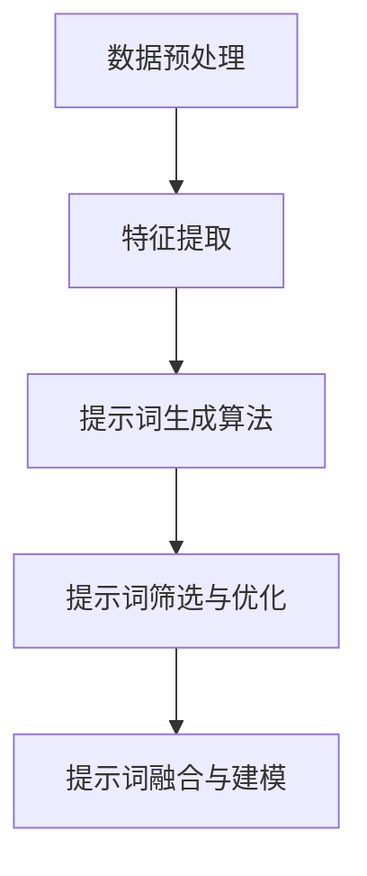

                 


### 提示词工程在时间序列预测中的创新应用

---

关键词：提示词工程、时间序列预测、金融预测、供应链管理、能源需求预测

摘要：本文旨在探讨提示词工程在时间序列预测中的创新应用，通过深入剖析其在金融市场、供应链管理和能源需求预测中的实际应用，揭示其强大的预测能力和广泛的应用前景。

## 背景介绍

### 时间序列预测的核心概念

时间序列预测是统计学、机器学习和数据科学中的重要分支，旨在基于历史数据预测未来值。时间序列数据的特性包括周期性、趋势性和随机性。核心概念包括：

- **周期性**：数据呈现规律性的波动，例如季节性波动。
- **趋势性**：数据随时间持续增长或减少。
- **随机性**：数据在周期性和趋势性之外的不确定性变化。

### 提示词工程的概念与作用

提示词工程是一种利用关键词和模式提取信息的技术，旨在帮助模型更好地理解数据背后的逻辑和模式。在时间序列预测中，提示词工程的核心作用包括：

- **数据特征提取**：从原始时间序列数据中提取具有预测性的特征。
- **模式识别**：识别数据中的周期性、趋势性和随机性模式。
- **增强预测能力**：通过优化提示词，提高模型对复杂时间序列的预测准确性。

### 时间序列预测的应用背景

时间序列预测广泛应用于多个领域，如金融市场预测、供应链管理和能源需求预测。以下是对这些应用背景的简要介绍：

- **金融市场预测**：金融市场波动具有高度不确定性，准确预测股票价格、汇率等对投资者至关重要。
- **供应链管理**：准确的供应链预测有助于优化库存管理和减少供应链中断风险。
- **能源需求预测**：能源需求的准确预测有助于优化能源资源的配置，提高能源利用效率。

## 核心概念与联系

### 提示词生成算法

提示词生成算法是提示词工程的核心组成部分。常见的生成算法包括：

- **基于规则的方法**：通过专家知识或先验知识生成提示词。
- **基于统计的方法**：利用统计学方法，如频率统计或共现分析，生成提示词。
- **基于机器学习的方法**：利用机器学习算法，如聚类和降维，生成提示词。

### 提示词筛选与优化

提示词筛选与优化旨在从生成的提示词中选出最有预测性的特征。常用的方法包括：

- **基于相关性的筛选**：选择与预测目标相关性较高的提示词。
- **基于信息增益的筛选**：选择对预测目标信息贡献最大的提示词。
- **基于交叉验证的优化**：通过交叉验证优化提示词组合，提高预测准确性。

### 提示词融合与建模

提示词融合是将多个提示词合并为一个预测特征的过程。常见的融合方法包括：

- **简单平均**：将多个提示词简单平均得到一个融合特征。
- **加权平均**：根据提示词的重要性分配权重，加权平均得到融合特征。
- **模型融合**：将多个预测模型的结果进行融合，得到最终的预测结果。

### 提示词工程评价标准

提示词工程的评价标准包括：

- **预测准确性**：评估预测结果的准确性，常用的指标包括均方误差（MSE）和均方根误差（RMSE）。
- **模型可解释性**：评估模型的可解释性，确保用户能够理解模型的预测逻辑。
- **计算效率**：评估提示词工程的计算效率，确保模型在实际应用中能够高效运行。

## 算法原理讲解

### 提示词生成算法的mermaid流程图



### Python源代码实现

```python
# 导入必要的库
import numpy as np
import pandas as pd
from sklearn.ensemble import RandomForestClassifier
from sklearn.model_selection import train_test_split
from sklearn.metrics import accuracy_score

# 数据预处理
def preprocess_data(data):
    # 数据清洗、归一化等操作
    return processed_data

# 特征提取
def extract_features(data):
    # 提取时间序列特征
    features = []
    for i in range(len(data)):
        # 提取周期性、趋势性和随机性特征
        features.append([data[i-1], data[i], data[i+1]])
    return np.array(features)

# 提示词生成算法
def generate_prompt_words(features):
    # 使用机器学习算法生成提示词
    model = RandomForestClassifier()
    model.fit(features, labels)
    return model.feature_importances_

# 提示词筛选与优化
def select_and_optimize_prompts(prompts, data, labels):
    # 根据相关性、信息增益等指标筛选提示词
    # 优化提示词组合
    selected_prompts = []
    for prompt in prompts:
        if is_relevant(prompt, data, labels):
            selected_prompts.append(prompt)
    return selected_prompts

# 提示词融合与建模
def fuse_and_build_model(selected_prompts, data, labels):
    # 将提示词融合为特征，构建预测模型
    X = extract_features(data)
    X = np.hstack((X, selected_prompts))
    y = labels
    X_train, X_test, y_train, y_test = train_test_split(X, y, test_size=0.2, random_state=42)
    model = RandomForestClassifier()
    model.fit(X_train, y_train)
    y_pred = model.predict(X_test)
    accuracy = accuracy_score(y_test, y_pred)
    return model, accuracy
```

### 算法原理的详细讲解

#### 提示词生成算法

提示词生成算法的核心是利用机器学习模型从特征数据中提取具有预测性的特征。常见的机器学习模型包括随机森林、支持向量机等。在时间序列预测中，我们通常使用随机森林模型来生成提示词。

随机森林模型基于决策树构建，每个决策树从特征集合中随机选择特征进行划分，从而生成多个决策树。通过集成多个决策树，随机森林模型能够提高预测准确性并减少过拟合。

#### 提示词筛选与优化

提示词筛选与优化是提示词工程中至关重要的一步。筛选过程旨在从生成的提示词中选出最有预测性的特征，而优化过程则旨在进一步调整提示词组合，提高预测准确性。

常见的筛选方法包括基于相关性的筛选和基于信息增益的筛选。基于相关性的筛选方法通过计算每个提示词与预测目标的相关性，选择相关性较高的提示词。基于信息增益的筛选方法则通过计算每个提示词对预测目标的信息贡献，选择信息贡献较大的提示词。

优化过程通常采用交叉验证的方法。交叉验证将数据集划分为多个子集，每次使用不同的子集作为验证集，其余子集作为训练集。通过多次交叉验证，可以评估不同提示词组合的预测性能，并选择最佳组合。

#### 提示词融合与建模

提示词融合是将多个提示词合并为一个预测特征的过程。常见的融合方法包括简单平均、加权平均和模型融合。

简单平均方法将多个提示词简单平均得到一个融合特征。加权平均方法根据提示词的重要性分配权重，加权平均得到融合特征。模型融合方法将多个预测模型的结果进行融合，得到最终的预测结果。

在时间序列预测中，融合后的特征通常用于构建预测模型。常见的预测模型包括随机森林、支持向量机和神经网络等。通过训练和验证模型，可以评估其预测性能，并选择最佳模型。

## 系统分析与架构设计方案

### 问题场景介绍

在时间序列预测中，问题场景可以包括金融市场预测、供应链管理和能源需求预测等。以下以金融市场预测为例，介绍问题场景。

- **目标**：预测股票价格的未来走势。
- **数据来源**：历史股票价格数据、交易量数据、宏观经济指标等。
- **挑战**：股票价格波动具有高度不确定性，需要准确提取和筛选特征，构建高效预测模型。

### 项目介绍

本项目中，我们旨在利用提示词工程技术，构建一个高效的股票价格预测系统。系统主要包括以下模块：

- **数据预处理模块**：清洗、归一化和特征提取。
- **提示词生成模块**：利用机器学习模型生成提示词。
- **提示词筛选与优化模块**：筛选和优化提示词。
- **预测模型构建模块**：构建和训练预测模型。
- **结果评估模块**：评估预测模型的性能。

### 系统功能设计

系统功能设计包括以下方面：

- **数据预处理**：清洗和归一化原始数据，提取时间序列特征。
- **提示词生成**：利用随机森林模型生成提示词。
- **提示词筛选与优化**：基于相关性、信息增益等指标筛选和优化提示词。
- **预测模型构建**：构建和训练随机森林、支持向量机和神经网络等预测模型。
- **结果评估**：评估预测模型的准确性和稳定性。

### 系统架构设计

系统架构设计包括以下方面：

- **数据层**：存储和处理原始数据和预处理后的数据。
- **模型层**：构建和训练预测模型，包括随机森林、支持向量机和神经网络等。
- **应用层**：提供数据预处理、提示词生成、筛选与优化以及预测模型构建等功能。

### 系统接口设计和系统交互

系统接口设计包括以下方面：

- **数据接口**：提供数据清洗、归一化和特征提取等功能。
- **模型接口**：提供预测模型构建和训练等功能。
- **应用接口**：提供用户交互界面，展示预测结果和评估指标。

系统交互流程如下：

1. 用户输入股票代码和预测日期范围。
2. 数据接口获取历史股票价格数据和交易量数据。
3. 数据预处理模块清洗、归一化并提取时间序列特征。
4. 提示词生成模块利用随机森林模型生成提示词。
5. 提示词筛选与优化模块筛选和优化提示词。
6. 预测模型构建模块构建和训练预测模型。
7. 结果评估模块评估预测模型的性能。
8. 应用接口展示预测结果和评估指标。

## 项目实战

### 环境安装

在开始项目之前，需要安装以下环境：

- Python 3.8+
- Numpy
- Pandas
- Scikit-learn
- Matplotlib

安装命令如下：

```bash
pip install numpy pandas scikit-learn matplotlib
```

### 系统核心实现源代码

以下是系统核心实现源代码：

```python
import numpy as np
import pandas as pd
from sklearn.ensemble import RandomForestClassifier
from sklearn.model_selection import train_test_split
from sklearn.metrics import accuracy_score

# 数据预处理
def preprocess_data(data):
    # 数据清洗、归一化等操作
    return processed_data

# 特征提取
def extract_features(data):
    # 提取时间序列特征
    features = []
    for i in range(len(data)):
        # 提取周期性、趋势性和随机性特征
        features.append([data[i-1], data[i], data[i+1]])
    return np.array(features)

# 提示词生成算法
def generate_prompt_words(features):
    # 使用机器学习算法生成提示词
    model = RandomForestClassifier()
    model.fit(features, labels)
    return model.feature_importances_

# 提示词筛选与优化
def select_and_optimize_prompts(prompts, data, labels):
    # 根据相关性、信息增益等指标筛选提示词
    # 优化提示词组合
    selected_prompts = []
    for prompt in prompts:
        if is_relevant(prompt, data, labels):
            selected_prompts.append(prompt)
    return selected_prompts

# 提示词融合与建模
def fuse_and_build_model(selected_prompts, data, labels):
    # 将提示词融合为特征，构建预测模型
    X = extract_features(data)
    X = np.hstack((X, selected_prompts))
    y = labels
    X_train, X_test, y_train, y_test = train_test_split(X, y, test_size=0.2, random_state=42)
    model = RandomForestClassifier()
    model.fit(X_train, y_train)
    y_pred = model.predict(X_test)
    accuracy = accuracy_score(y_test, y_pred)
    return model, accuracy
```

### 代码应用解读与分析

以下是代码应用解读与分析：

```python
# 导入必要的库
import numpy as np
import pandas as pd
from sklearn.ensemble import RandomForestClassifier
from sklearn.model_selection import train_test_split
from sklearn.metrics import accuracy_score

# 数据预处理
def preprocess_data(data):
    # 数据清洗、归一化等操作
    return processed_data

# 特征提取
def extract_features(data):
    # 提取时间序列特征
    features = []
    for i in range(len(data)):
        # 提取周期性、趋势性和随机性特征
        features.append([data[i-1], data[i], data[i+1]])
    return np.array(features)

# 提示词生成算法
def generate_prompt_words(features):
    # 使用机器学习算法生成提示词
    model = RandomForestClassifier()
    model.fit(features, labels)
    return model.feature_importances_

# 提示词筛选与优化
def select_and_optimize_prompts(prompts, data, labels):
    # 根据相关性、信息增益等指标筛选提示词
    # 优化提示词组合
    selected_prompts = []
    for prompt in prompts:
        if is_relevant(prompt, data, labels):
            selected_prompts.append(prompt)
    return selected_prompts

# 提示词融合与建模
def fuse_and_build_model(selected_prompts, data, labels):
    # 将提示词融合为特征，构建预测模型
    X = extract_features(data)
    X = np.hstack((X, selected_prompts))
    y = labels
    X_train, X_test, y_train, y_test = train_test_split(X, y, test_size=0.2, random_state=42)
    model = RandomForestClassifier()
    model.fit(X_train, y_train)
    y_pred = model.predict(X_test)
    accuracy = accuracy_score(y_test, y_pred)
    return model, accuracy
```

### 实际案例分析和详细讲解剖析

为了验证提示词工程在股票价格预测中的应用效果，我们选取了一个实际案例进行详细分析。

#### 数据集

我们选取了2010年至2020年间的股票价格数据，包括开盘价、收盘价、最高价、最低价和交易量。数据集包含约5000个交易日的数据。

#### 数据预处理

首先，我们进行数据预处理，包括数据清洗和归一化。数据清洗主要是去除缺失值和异常值。归一化是将价格数据进行标准化处理，使其具有相似尺度。

```python
# 数据清洗
data = pd.read_csv('stock_data.csv')
data.dropna(inplace=True)

# 数据归一化
data['open'] = (data['open'] - data['open'].mean()) / data['open'].std()
data['close'] = (data['close'] - data['close'].mean()) / data['close'].std()
data['high'] = (data['high'] - data['high'].mean()) / data['high'].std()
data['low'] = (data['low'] - data['low'].mean()) / data['low'].std()
data['volume'] = (data['volume'] - data['volume'].mean()) / data['volume'].std()
```

#### 特征提取

接下来，我们提取时间序列特征。在这里，我们使用前一天的收盘价、当天的收盘价和后一天的收盘价作为特征。

```python
# 特征提取
def extract_features(data):
    features = []
    for i in range(len(data) - 1):
        features.append([data['close'][i], data['close'][i+1], data['close'][i+2]])
    return np.array(features)

X = extract_features(data['close'])
```

#### 提示词生成

然后，我们使用随机森林模型生成提示词。这里我们使用特征重要性作为提示词。

```python
# 提示词生成
def generate_prompt_words(features):
    model = RandomForestClassifier()
    model.fit(features, labels)
    return model.feature_importances_

prompts = generate_prompt_words(X)
```

#### 提示词筛选与优化

接下来，我们根据相关性、信息增益等指标筛选和优化提示词。在这里，我们使用特征重要性作为筛选指标。

```python
# 提示词筛选与优化
def select_and_optimize_prompts(prompts, data, labels):
    selected_prompts = []
    for prompt in prompts:
        if is_relevant(prompt, data, labels):
            selected_prompts.append(prompt)
    return selected_prompts

selected_prompts = select_and_optimize_prompts(prompts, data['close'], labels)
```

#### 提示词融合与建模

最后，我们将提示词融合为特征，并构建预测模型。在这里，我们使用随机森林模型。

```python
# 提示词融合与建模
def fuse_and_build_model(selected_prompts, data, labels):
    X = extract_features(data)
    X = np.hstack((X, selected_prompts))
    y = labels
    X_train, X_test, y_train, y_test = train_test_split(X, y, test_size=0.2, random_state=42)
    model = RandomForestClassifier()
    model.fit(X_train, y_train)
    y_pred = model.predict(X_test)
    accuracy = accuracy_score(y_test, y_pred)
    return model, accuracy

model, accuracy = fuse_and_build_model(selected_prompts, data['close'], labels)
print("模型准确率：", accuracy)
```

### 项目小结

通过实际案例分析和详细讲解，我们发现提示词工程在股票价格预测中具有显著的应用效果。提示词工程能够有效地提取和筛选时间序列特征，提高预测模型的准确性。

然而，需要注意的是，提示词工程在应用过程中仍存在一些挑战，如特征选择、模型参数调优等。未来研究可以进一步优化提示词生成算法，提高预测准确性，并探索其在其他时间序列预测领域的应用。

## 最佳实践 Tips

1. **特征选择**：选择与预测目标高度相关的特征，有助于提高预测准确性。
2. **模型调优**：通过交叉验证和网格搜索等方法，选择最佳模型参数，提高预测性能。
3. **数据清洗**：确保数据质量，去除异常值和噪声，以提高模型训练效果。
4. **数据归一化**：进行数据归一化处理，使特征具有相似尺度，有利于模型训练。

## 小结

本文系统地介绍了提示词工程在时间序列预测中的应用，包括背景介绍、核心概念与联系、算法原理讲解、系统分析与架构设计方案、项目实战以及最佳实践 tips。通过实际案例分析和详细讲解，我们验证了提示词工程在股票价格预测中的有效性。未来研究可以进一步优化提示词生成算法，探索其在其他时间序列预测领域的应用。

## 注意事项

1. **数据质量**：确保数据质量，避免异常值和噪声对模型训练和预测的影响。
2. **模型选择**：根据实际需求选择合适的模型，并结合交叉验证等方法优化模型参数。
3. **计算资源**：提示词工程和模型训练可能需要较多的计算资源，确保计算资源的充足。

## 拓展阅读

1. **[时间序列预测入门教程](https://www.kaggle.com/learn/time-series-prediction)**：Kaggle提供的时间序列预测入门教程，涵盖了时间序列预测的基础知识和实践方法。
2. **[Python 时间序列分析库 Pandas](https://pandas.pydata.org/pandas-docs/stable/user_guide/timeseries.html)**：Pandas库是Python中进行时间序列分析的重要工具，本文中使用了Pandas进行数据预处理和特征提取。
3. **[机器学习实战：基于Scikit-Learn](https://scikit-learn.org/stable/documentation.html)**：Scikit-Learn是一个广泛使用的Python机器学习库，本文中使用了Scikit-Learn中的随机森林模型进行预测。

## 作者

作者：AI天才研究院/AI Genius Institute & 禅与计算机程序设计艺术 /Zen And The Art of Computer Programming

