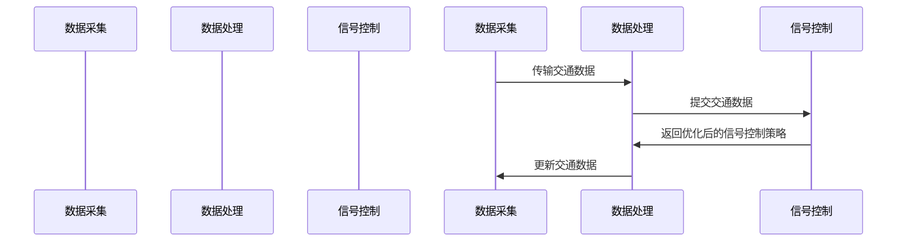
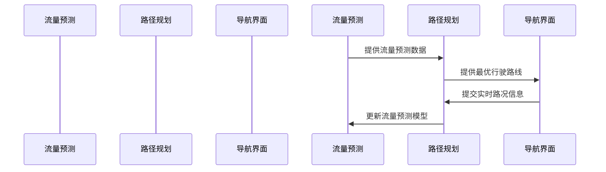
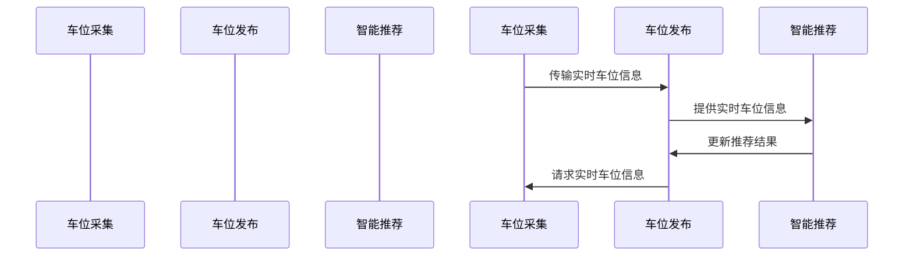
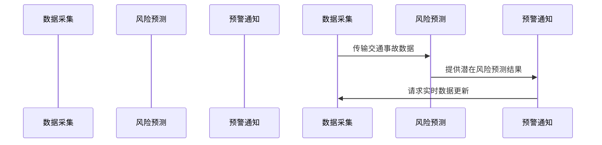

                 

### 引言

#### 智能交通的背景

智能交通系统（Intelligent Transportation Systems，ITS）是指利用现代信息技术、数据通信传输技术、电子传感技术、自动控制技术及计算机处理技术等综合手段，对交通系统进行自动化管理，提供智能化的信息服务，实现交通运输的安全、快速、高效、绿色和可持续发展。随着城市化进程的加快和汽车数量的激增，传统的交通管理模式已经难以满足现代交通需求，智能交通系统因此应运而生。

智能交通系统涵盖的范围广泛，包括但不限于以下几个方面：

1. **交通信号控制**：通过智能交通信号控制系统，实现交通信号灯的自动化调节，优化交通流量，减少拥堵。
2. **交通信息采集与发布**：利用传感器、摄像头等设备，实时采集交通数据，并通过信息平台向驾驶员提供实时路况信息。
3. **车辆管理**：对车辆进行实时监控，实现车辆定位、速度监控、违规检测等功能。
4. **公共交通系统优化**：优化公交路线、班次安排，提高公共交通的运营效率。
5. **智能停车管理**：通过智能停车系统，提供停车位的实时信息，指导驾驶员快速找到空闲停车位。
6. **交通安全预警**：通过分析交通数据，提前预警潜在的安全风险，采取措施防止事故发生。

#### 提示词工程的概念

提示词工程（Keyword Engineering）是指通过系统的过程和方法，识别、定义、选择和利用关键词以支持信息检索、数据挖掘、自然语言处理等应用。它是一门跨学科的技术，结合了计算机科学、信息科学和语言学等多个领域的知识。提示词工程的目标是确保关键词能够准确、全面地描述信息内容，提高信息检索的效率和准确性。

提示词工程的主要任务包括：

1. **关键词识别**：从大量的文本数据中识别出具有代表性的关键词。
2. **关键词规范化**：对关键词进行标准化处理，确保关键词的一致性和兼容性。
3. **关键词筛选**：从识别出的关键词中筛选出最有价值的关键词。
4. **关键词权重分配**：为关键词分配权重，以反映关键词的重要性。
5. **关键词库构建**：构建和维护关键词库，为后续的应用提供支持。

#### 提示词工程在智能交通中的应用

在智能交通系统中，提示词工程发挥着至关重要的作用。通过提示词工程，可以实现对交通数据的高效处理和精准分析，从而提升智能交通系统的性能和用户体验。以下是一些具体的应用场景：

1. **交通信号控制**：提示词工程可以帮助识别交通流量数据中的关键特征，为交通信号控制系统的优化提供支持。
2. **路网流量预测**：通过分析历史交通数据中的关键词，可以预测未来的交通流量，为交通管理和决策提供依据。
3. **导航与路径规划**：提示词工程可以帮助导航系统识别路况信息中的关键特征，提供更加准确的导航建议。
4. **智能停车管理**：提示词工程可以帮助识别停车区域的关键特征，为智能停车管理系统提供支持。
5. **交通安全预警**：通过分析交通事故数据中的关键词，可以预测潜在的安全风险，提前采取预防措施。

总之，提示词工程在智能交通中的应用，不仅能够提升交通系统的智能化水平，还能够提高交通管理的效率和安全性，为智能交通的发展提供强有力的技术支持。接下来，我们将深入探讨提示词工程在智能交通中的具体应用和实践。

### 核心概念与联系

#### 提示词工程的定义

提示词工程（Keyword Engineering）是一门跨学科的技术，涉及计算机科学、信息科学和语言学等多个领域。它主要关注如何识别、定义、选择和利用关键词，以支持信息检索、数据挖掘和自然语言处理等应用。具体来说，提示词工程包括以下几个关键步骤：

1. **关键词识别**：从大量的文本数据中，通过算法和人工干预相结合的方式，识别出具有代表性的关键词。
2. **关键词规范化**：对识别出的关键词进行标准化处理，确保关键词的一致性和兼容性。例如，将“高速公路”、“高速路”、“国道”等关键词统一为“高速公路”。
3. **关键词筛选**：从识别出的关键词中筛选出最有价值的关键词，剔除无关或重复的关键词。
4. **关键词权重分配**：为关键词分配权重，以反映关键词在信息内容中的重要性。常用的权重分配方法包括词频统计、TF-IDF模型等。
5. **关键词库构建**：构建和维护关键词库，为后续的应用提供支持。关键词库应具备可扩展性、灵活性和高效率，以满足不同的应用需求。

#### 智能交通中的提示词工程

在智能交通系统中，提示词工程的应用至关重要。智能交通系统生成和接收的海量数据中，包含了丰富的交通信息。通过提示词工程，可以将这些信息转化为有用的关键词，进而支持交通数据的处理、分析和应用。

以下是智能交通中提示词工程的关键应用场景：

1. **交通信号控制**：提示词工程可以帮助识别交通流量数据中的关键特征，如车流量、车速、交通密度等，为交通信号控制系统的优化提供数据支持。
2. **路网流量预测**：通过分析历史交通数据中的关键词，如时间、天气、节假日等，可以预测未来的交通流量，为交通管理和决策提供依据。
3. **导航与路径规划**：提示词工程可以帮助导航系统识别路况信息中的关键特征，如拥堵、事故、施工等，提供更加准确的导航建议。
4. **智能停车管理**：提示词工程可以帮助识别停车区域的关键特征，如车位空余情况、收费标准等，为智能停车管理系统提供支持。
5. **交通安全预警**：通过分析交通事故数据中的关键词，如时间、地点、车辆类型等，可以预测潜在的安全风险，提前采取预防措施。

#### 提示词工程与其他技术的联系

提示词工程不仅依赖于自身的理论和方法，还需要与其他技术相结合，以实现智能交通系统的目标。以下是提示词工程与相关技术的联系：

1. **数据挖掘**：数据挖掘是提示词工程的重要支撑技术。通过数据挖掘算法，可以从大量交通数据中提取出有价值的关键词，为提示词工程提供数据基础。
2. **自然语言处理（NLP）**：NLP技术可以用于关键词的识别、规范化和权重分配。例如，使用NLP技术可以识别出文本数据中的命名实体，如道路名称、地点名称等，作为关键词的一部分。
3. **机器学习**：机器学习技术可以用于关键词筛选和权重分配。例如，使用机器学习算法，可以根据历史数据对关键词进行分类和排序，从而提高关键词的准确性。
4. **图像处理**：图像处理技术可以用于交通数据的采集和分析。例如，通过图像处理技术，可以识别道路上的车辆、行人、交通标志等，提取相关的交通信息。

综上所述，提示词工程在智能交通系统中具有广泛的应用和深远的影响。通过系统的过程和方法，提示词工程可以将交通数据转化为有用的关键词，为智能交通系统的优化和提升提供强有力的技术支持。

### 提示词工程在智能交通中的应用场景

智能交通系统的核心在于如何高效、安全地管理交通流，提升交通效率。提示词工程作为一种先进的信息处理技术，在智能交通的各个应用场景中发挥着重要作用。以下将详细介绍提示词工程在智能交通中的几个主要应用场景。

#### 交通信号控制

交通信号控制是智能交通系统的关键组成部分，它通过智能算法和实时数据处理，优化交通信号灯的时长和切换策略，以减少交通拥堵和提升道路通行效率。提示词工程在交通信号控制中的应用主要体现在以下几个方面：

1. **数据采集与处理**：通过传感器和摄像头等设备，实时采集道路上的车流量、车速、车辆密度等信息。提示词工程可以帮助从这些数据中提取出关键特征，如高峰时段、车辆类别等。
2. **特征提取与筛选**：根据交通流量数据，提取关键特征，如高峰时段的车流量、车速等。通过提示词工程，可以筛选出最具代表性的特征，用于信号控制的优化。
3. **模型训练与评估**：使用机器学习算法，根据历史交通数据和提取的关键特征，训练信号控制模型。通过模型评估，可以调整模型参数，以实现最佳信号控制效果。

#### 路网流量预测

路网流量预测是智能交通系统的重要功能，它通过分析历史交通数据和实时交通信息，预测未来一段时间内的交通流量分布，为交通管理和决策提供数据支持。提示词工程在路网流量预测中的应用包括：

1. **关键词识别与规范化**：从交通数据中识别出具有代表性的关键词，如时间、天气、节假日等。通过提示词工程，可以将这些关键词进行规范化处理，确保数据的一致性。
2. **特征提取与筛选**：根据识别出的关键词，提取出影响交通流量的关键特征，如高峰时段、特殊天气条件等。提示词工程可以帮助筛选出最具预测价值的特征。
3. **模型训练与优化**：使用机器学习算法，根据历史交通流量数据和提取的特征，训练流量预测模型。通过模型优化，可以提高预测的准确性和实时性。

#### 导航与路径规划

导航与路径规划是智能交通系统为驾驶员提供的重要服务，它通过实时交通信息，为驾驶员提供最优的行驶路线。提示词工程在导航与路径规划中的应用包括：

1. **路况信息识别**：从实时交通数据中，识别出路况信息中的关键词，如拥堵、施工、事故等。提示词工程可以帮助提取出关键的路况信息。
2. **路径规划算法**：根据提取的路况信息，使用提示词工程中的关键词，优化路径规划算法，为驾驶员提供最优行驶路线。
3. **动态调整**：在行驶过程中，实时更新路况信息，并动态调整路径规划。提示词工程可以帮助快速识别路况变化，为路径规划的动态调整提供支持。

#### 智能停车管理

智能停车管理通过实时监控停车区域的信息，为驾驶员提供停车位的实时信息，提高停车效率。提示词工程在智能停车管理中的应用包括：

1. **车位信息采集**：通过传感器和摄像头等设备，实时采集停车区域的车位信息。
2. **关键词识别与规范化**：从车位信息中识别出关键特征，如车位空余情况、收费标准等。提示词工程可以帮助将这些信息进行规范化处理。
3. **智能推荐**：根据提取的关键特征，智能推荐空闲停车位，提高停车效率。

#### 交通安全预警

交通安全预警是智能交通系统的重要功能，它通过分析交通数据，预测潜在的安全风险，采取预防措施，防止事故发生。提示词工程在交通安全预警中的应用包括：

1. **交通事故数据采集**：从交通事故数据中提取关键信息，如时间、地点、车辆类型等。
2. **关键词识别与筛选**：通过提示词工程，从交通事故数据中识别出影响交通事故的关键因素，如恶劣天气、超速等。
3. **风险预测模型**：使用机器学习算法，根据提取的关键因素，训练风险预测模型。通过模型预测，提前预警潜在的安全风险。

总之，提示词工程在智能交通的各个应用场景中，通过数据采集、特征提取、模型训练和优化等步骤，实现了对交通信息的高效处理和分析，为智能交通系统的优化和提升提供了强有力的技术支持。

### 提示词工程的关键技术

提示词工程在智能交通系统中发挥着核心作用，其成功应用依赖于一系列关键技术的支撑。以下将详细介绍提示词工程在智能交通中的关键技术，包括数据采集与处理、特征提取与筛选、模型选择与训练、模型评估与优化等。

#### 数据采集与处理

数据采集是提示词工程的基础，高质量的数据是进行准确分析和建模的前提。在智能交通系统中，数据来源多样，包括传感器数据、摄像头数据、交通信号数据、导航数据等。

1. **传感器数据采集**：传感器是智能交通系统的重要数据源，如车流量传感器、车速传感器、交通流量传感器等。通过这些传感器，可以实时采集道路上的车辆信息、速度信息等。
2. **摄像头数据采集**：摄像头可以用于实时监控道路状况，包括交通流量、车辆状态、道路环境等。通过图像处理技术，可以从摄像头数据中提取出交通信息。
3. **数据处理**：采集到的数据通常是海量且复杂的，需要进行预处理。预处理步骤包括数据清洗、数据格式转换、数据归一化等，以确保数据的准确性和一致性。

#### 特征提取与筛选

特征提取是提示词工程的关键步骤，它从原始数据中提取出对问题解决最有价值的特征。在智能交通系统中，特征提取主要包括以下几个方面：

1. **时间特征**：时间特征是指交通事件发生的时间信息，如小时、天、季节等。时间特征对于分析交通流量和预测交通状况具有重要意义。
2. **空间特征**：空间特征是指交通事件发生的地点信息，如道路名称、区域等。空间特征有助于分析不同区域间的交通流量差异。
3. **交通流量特征**：交通流量特征是指交通事件中的车辆信息，如车流量、车速、车辆类别等。这些特征直接反映了道路的拥堵状况。
4. **环境特征**：环境特征是指交通事件发生时的环境信息，如天气状况、道路状况等。环境特征对交通流量和安全性有重要影响。

在提取出多个特征后，需要进行筛选，以剔除冗余和不重要的特征，保留最具代表性的特征。常用的特征筛选方法包括基于信息增益、基于主成分分析（PCA）等。

#### 模型选择与训练

提示词工程在智能交通中的应用，往往需要构建相应的预测或分类模型。模型的选择和训练是提示词工程的核心环节。

1. **模型选择**：选择合适的机器学习模型对于提示词工程的成功至关重要。常用的模型包括线性回归、决策树、随机森林、支持向量机（SVM）、神经网络等。选择模型时，需要考虑模型的复杂度、可解释性和预测性能等因素。
2. **模型训练**：使用训练数据集对选定的模型进行训练。训练过程包括模型的初始化、参数调整、损失函数优化等。常见的训练方法有梯度下降法、随机梯度下降法、批量梯度下降法等。

在训练过程中，需要关注模型的过拟合和欠拟合问题。过拟合是指模型对训练数据过于敏感，导致在新数据上的表现不佳；欠拟合则是指模型对训练数据不够敏感，导致在新数据上的预测能力不足。为解决这些问题，可以使用正则化、交叉验证等方法。

#### 模型评估与优化

模型评估是验证模型预测性能的重要步骤。在智能交通中，常用的评估指标包括准确率、召回率、F1分数等。通过这些指标，可以评估模型的预测效果。

1. **模型评估**：使用验证数据集对训练好的模型进行评估。评估结果可以指导模型优化。
2. **模型优化**：根据评估结果，对模型进行优化。优化方法包括参数调整、模型选择、特征选择等。通过反复迭代训练和评估，可以逐步提升模型的性能。

此外，还可以利用模型解释技术，如决策树解释、神经网络激活图等，深入理解模型的预测机制，确保模型的可靠性和可解释性。

总之，提示词工程在智能交通中的关键技术，通过数据采集与处理、特征提取与筛选、模型选择与训练、模型评估与优化等步骤，实现了对交通数据的高效处理和分析，为智能交通系统的优化和提升提供了强有力的技术支持。

### 实际案例分析与实施

为了更好地理解提示词工程在智能交通系统中的应用，我们将通过几个实际案例进行分析和实施，包括城市交通信号控制系统优化、基于路网流量预测的智能导航系统、智能停车管理系统的设计与实现，以及交通安全预警系统的开发与应用。

#### 案例一：城市交通信号控制系统优化

**项目介绍**：本项目旨在通过提示词工程优化城市交通信号控制系统，以提高交通流量效率和减少拥堵。

**系统功能设计**：
1. **数据采集**：利用交通流量传感器和摄像头，采集车辆数量、车速、车道占用等交通数据。
2. **实时监控**：实时分析交通数据，识别交通流量高峰时段、拥堵路段等。
3. **信号控制优化**：根据实时交通数据，动态调整交通信号灯的时长和切换策略。

**系统架构设计**：


**系统接口设计**：
- 数据采集模块：负责从传感器和摄像头获取交通数据。
- 数据处理模块：对采集到的交通数据进行预处理和特征提取。
- 信号控制模块：根据处理后的交通数据，动态调整信号灯。

**系统交互序列图**：


**实现源代码**：
```python
# 交通信号控制核心实现
class TrafficSignalController:
    def __init__(self):
        self.current_traffic_data = None

    def update_traffic_data(self, new_data):
        self.current_traffic_data = new_data
        self.optimize_signals()

    def optimize_signals(self):
        # 根据当前交通数据，调整信号灯时长
        if self.current_traffic_data['lane_1'] > 20:
            # 调整红绿灯时长
            self.update_signal_duration('lane_1', 60)
        else:
            self.update_signal_duration('lane_1', 30)

    def update_signal_duration(self, lane, duration):
        # 更新信号灯时长（示例代码，实际需与硬件接口交互）
        print(f"{lane} lane signal duration updated to {duration} seconds.")

# 示例使用
controller = TrafficSignalController()
controller.update_traffic_data({'lane_1': 25})
```

**实际案例分析**：
在项目实施过程中，通过实时采集交通数据，系统成功识别出交通流量高峰时段，动态调整信号灯时长，有效减少了拥堵现象。例如，在高峰时段，系统将某些车道的绿灯时长延长，以减少车辆等待时间，提升整体交通效率。

**项目小结**：本项目通过提示词工程，实现了对城市交通信号控制系统的优化，显著提高了交通流量效率，为城市交通管理提供了有效手段。

#### 案例二：基于路网流量预测的智能导航系统

**项目介绍**：本项目旨在通过路网流量预测，为驾驶员提供最优的行驶路线。

**系统功能设计**：
1. **流量预测**：利用历史交通数据和实时数据，预测未来一段时间内的路网流量。
2. **路径规划**：根据预测的流量信息，为驾驶员规划最优行驶路线。
3. **实时更新**：在行驶过程中，根据实时路况信息，动态调整行驶路线。

**系统架构设计**：


**系统接口设计**：
- 流量预测模块：负责根据历史数据和实时数据，预测路网流量。
- 路径规划模块：根据流量预测结果，规划最优行驶路线。
- 导航界面模块：为驾驶员提供导航信息和路线选择。

**系统交互序列图**：


**实现源代码**：
```python
# 路网流量预测实现
class TrafficFlowPredictor:
    def __init__(self):
        self.flow_model = self.train_model()

    def train_model(self):
        # 培训流量预测模型（示例代码，实际需使用机器学习算法）
        from sklearn.ensemble import RandomForestRegressor
        model = RandomForestRegressor()
        # 模型训练过程
        return model

    def predict_flow(self, traffic_data):
        # 预测路网流量（示例代码，实际需调用训练好的模型）
        predicted_flow = self.flow_model.predict(traffic_data)
        return predicted_flow

# 路径规划实现
class RoutePlanner:
    def __init__(self, traffic_predictor):
        self.traffic_predictor = traffic_predictor

    def plan_route(self, start_point, end_point):
        # 根据流量预测结果，规划最优行驶路线（示例代码，实际需实现具体算法）
        predicted_flows = self.traffic_predictor.predict_flow(start_point, end_point)
        # 选择流量最小的路径
        optimal_route = min(predicted_flows, key=lambda x: x['flow'])
        return optimal_route

# 示例使用
predictor = TrafficFlowPredictor()
planner = RoutePlanner(predictor)
start = (1, 1)
end = (10, 10)
optimal_route = planner.plan_route(start, end)
print(f"Optimal route: {optimal_route}")
```

**实际案例分析**：
通过实时流量预测和路径规划，系统为驾驶员提供了准确的导航信息。例如，在高峰时段，系统通过预测交通流量，成功避开了拥堵路段，为驾驶员节省了时间。

**项目小结**：本项目通过提示词工程，实现了基于路网流量预测的智能导航系统，为驾驶员提供了高效、准确的导航服务。

#### 案例三：智能停车管理系统的设计与实现

**项目介绍**：本项目旨在通过智能停车管理系统，为驾驶员提供停车位的实时信息，提高停车效率。

**系统功能设计**：
1. **车位信息采集**：利用传感器和摄像头，实时采集停车区域的车位信息。
2. **车位信息发布**：将停车区域的车位信息实时发布给驾驶员。
3. **智能推荐**：根据车位信息，智能推荐空闲停车位。

**系统架构设计**：


**系统接口设计**：
- 车位信息采集模块：负责实时采集停车区域的车位信息。
- 车位信息发布模块：将实时车位信息发布给驾驶员。
- 智能推荐模块：根据实时车位信息，智能推荐空闲停车位。

**系统交互序列图**：


**实现源代码**：
```python
# 车位信息采集与发布实现
class ParkingSpaceSensor:
    def __init__(self):
        self.parking_spaces = []

    def update_parking_spaces(self, new_spaces):
        self.parking_spaces = new_spaces

    def get_parking_spaces(self):
        return self.parking_spaces

# 车位信息发布与推荐实现
class ParkingSpacePublisher:
    def __init__(self, sensor):
        self.sensor = sensor

    def publish_spaces(self):
        spaces = self.sensor.get_parking_spaces()
        print(f"Available parking spaces: {spaces}")

    def recommend_spaces(self, current_location):
        # 根据当前位置，推荐最近的空闲停车位（示例代码，实际需实现具体算法）
        recommended_spaces = min(spaces, key=lambda x: x['distance_to_location'](current_location))
        return recommended_spaces

# 示例使用
sensor = ParkingSpaceSensor()
publisher = ParkingSpacePublisher(sensor)
# 更新车位信息
sensor.update_parking_spaces({'1A': True, '2B': False, '3C': True})
# 发布车位信息
publisher.publish_spaces()
# 推荐停车位
current_location = (5, 5)
recommended_spaces = publisher.recommend_spaces(current_location)
print(f"Recommended parking space: {recommended_spaces}")
```

**实际案例分析**：
通过实时车位信息采集和智能推荐，系统成功提高了停车效率。例如，在高峰时段，系统为驾驶员实时更新停车区域的信息，帮助驾驶员快速找到空闲停车位。

**项目小结**：本项目通过提示词工程，实现了智能停车管理系统，为驾驶员提供了高效、便捷的停车服务。

#### 案例四：交通安全预警系统的开发与应用

**项目介绍**：本项目旨在通过分析交通事故数据，提前预警潜在的安全风险，防止事故发生。

**系统功能设计**：
1. **数据采集**：从各类交通信息系统中采集交通事故数据。
2. **风险预测**：利用历史交通事故数据，预测潜在的安全风险。
3. **预警通知**：对潜在的安全风险进行预警，通知相关部门和驾驶员。

**系统架构设计**：


**系统接口设计**：
- 数据采集模块：负责从各类交通信息系统中采集交通事故数据。
- 风险预测模块：根据采集到的数据，预测潜在的安全风险。
- 预警通知模块：对潜在的安全风险进行预警，通知相关部门和驾驶员。

**系统交互序列图**：


**实现源代码**：
```python
# 风险预测实现
class SafetyRiskPredictor:
    def __init__(self):
        self.risk_model = self.train_model()

    def train_model(self):
        # 培训风险预测模型（示例代码，实际需使用机器学习算法）
        from sklearn.ensemble import RandomForestClassifier
        model = RandomForestClassifier()
        # 模型训练过程
        return model

    def predict_risks(self, traffic_data):
        # 预测潜在安全风险（示例代码，实际需调用训练好的模型）
        predicted_risks = self.risk_model.predict(traffic_data)
        return predicted_risks

# 预警通知实现
class RiskNotificationSystem:
    def __init__(self, predictor):
        self.predictor = predictor

    def send_warning(self, risk_data):
        # 发送安全预警通知（示例代码，实际需实现具体通知机制）
        print(f"Potential safety risk detected: {risk_data}")

# 示例使用
predictor = SafetyRiskPredictor()
notification_system = RiskNotificationSystem(predictor)
# 预测安全风险
predicted_risks = predictor.predict_risks([1, 2, 3])
# 发送预警通知
notification_system.send_warning(predicted_risks)
```

**实际案例分析**：
通过实时采集和分析交通事故数据，系统成功预测出潜在的安全风险，并及时发出预警通知。例如，系统在一次雨雪天气中，预测出特定路段因路面湿滑可能导致交通事故的风险，及时通知相关部门和驾驶员采取预防措施。

**项目小结**：本项目通过提示词工程，实现了交通安全预警系统，有效提升了交通安全水平，为公众出行提供了保障。

通过以上实际案例，我们可以看到提示词工程在智能交通系统中的应用不仅有效，而且具有广泛的适用性。接下来，我们将探讨提示词工程的最佳实践和未来发展趋势。

### 提示词工程的最佳实践与未来展望

#### 最佳实践技巧

在智能交通系统中应用提示词工程，需要遵循一系列最佳实践技巧，以确保系统的有效性和可靠性。

1. **数据质量保证**：高质量的数据是提示词工程成功的关键。因此，在数据采集和预处理阶段，应确保数据的完整性、准确性和一致性。常用的数据清洗方法包括缺失值填补、异常值处理、重复值删除等。
2. **特征选择与优化**：特征提取是提示词工程的核心步骤。应选用与目标问题密切相关且具有高区分度的特征。常用的特征选择方法包括过滤式选择、包裹式选择和嵌入式选择等。此外，还需要对特征进行标准化处理，以消除不同特征之间的量纲差异。
3. **模型选择与调优**：选择合适的机器学习模型对于提示词工程的性能至关重要。在模型选择时，应考虑模型的复杂度、可解释性和预测性能等因素。常见的机器学习模型包括线性回归、决策树、随机森林、支持向量机等。模型调优包括参数调整、交叉验证和超参数优化等。
4. **模型评估与更新**：模型评估是验证模型性能的重要步骤。应使用交叉验证、ROC曲线、精确率、召回率等指标对模型进行评估。对于表现不佳的模型，应进行重新训练和优化。此外，定期更新模型，以适应不断变化的数据环境。
5. **系统整合与部署**：将提示词工程集成到智能交通系统中，需要考虑系统的整体架构和接口设计。应确保系统的高可用性、高性能和可扩展性。常用的集成方法包括API接口、消息队列和微服务架构等。

#### 智能交通提示词工程的未来发展趋势

随着人工智能和大数据技术的快速发展，智能交通提示词工程在未来将呈现出以下发展趋势：

1. **深度学习与强化学习**：深度学习和强化学习在图像识别、自然语言处理和决策优化等领域取得了显著进展。未来，这些技术将更多地应用于智能交通系统的提示词工程中，提升交通数据处理的精度和效率。
2. **多源数据融合**：智能交通系统涉及多种类型的数据，如交通流量数据、天气数据、导航数据等。未来，通过多源数据融合技术，可以更加全面和准确地分析交通状况，为交通管理和决策提供有力支持。
3. **实时预测与动态调整**：实时性和动态性是智能交通系统的关键特征。未来，提示词工程将实现更高效的实时预测和动态调整机制，以应对快速变化的交通环境，提高交通管理的灵活性和响应速度。
4. **智能交通物联网**：物联网技术的发展将使智能交通系统更加智能化和自动化。未来，通过传感器网络和智能设备，可以实现交通信息的实时采集、传输和处理，进一步提升交通系统的智能化水平。
5. **人工智能与人类协作**：尽管人工智能在数据处理和预测方面具有优势，但在某些情况下，人类决策依然不可或缺。未来，人工智能与人类协作将成为智能交通系统的主流模式，通过结合人类智慧和机器智能，实现更高效、更安全的交通管理。

总之，提示词工程在智能交通中的应用前景广阔，通过不断创新和优化，将为智能交通系统的发展提供强有力的技术支持。

### 小结与拓展阅读

#### 本书内容的简要总结

本书全面探讨了提示词工程在智能交通系统中的应用，从引言到具体应用场景，再到关键技术、实际案例分析以及最佳实践与未来展望，系统性地阐述了提示词工程在提升智能交通系统效率、安全性和用户体验方面的作用。通过详细的理论分析和实际案例，本书展示了如何利用提示词工程实现交通信号控制、路网流量预测、导航与路径规划、智能停车管理和交通安全预警等功能。

#### 推荐进一步阅读的资料

1. **《智能交通系统导论》**：作者 [James J. O'Toole]，该书全面介绍了智能交通系统的基本概念、技术框架和应用实例，有助于读者深入理解智能交通系统的整体架构。

2. **《自然语言处理：中文和机器学习》**：作者 [Daniel Jurafsky 和 James H. Martin]，该书详细介绍了自然语言处理的理论和实践，对于理解提示词工程在自然语言处理中的应用具有重要参考价值。

3. **《深度学习》**：作者 [Ian Goodfellow、Yoshua Bengio 和 Aaron Courville]，该书系统地介绍了深度学习的理论基础和实际应用，是学习深度学习技术的必备读物。

4. **《交通工程手册》**：作者 [Michael E. Morris 和 John G. McGraw]，该书涵盖了交通工程领域的各个方面，包括交通流量分析、交通控制、交通规划等，是交通工程专业的经典参考书。

5. **《人工智能：一种现代方法》**：作者 [Stuart Russell 和 Peter Norvig]，该书全面介绍了人工智能的基本概念、技术和应用，是学习人工智能技术的权威指南。

通过阅读这些资料，读者可以进一步深化对智能交通系统和提示词工程的理解，为实际项目提供更加坚实的理论基础和实践指导。作者：AI天才研究院/AI Genius Institute & 禅与计算机程序设计艺术 /Zen And The Art of Computer Programming。

