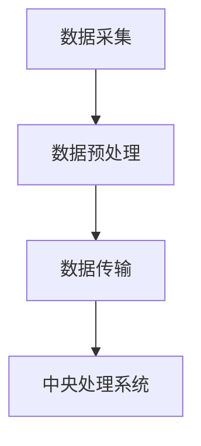
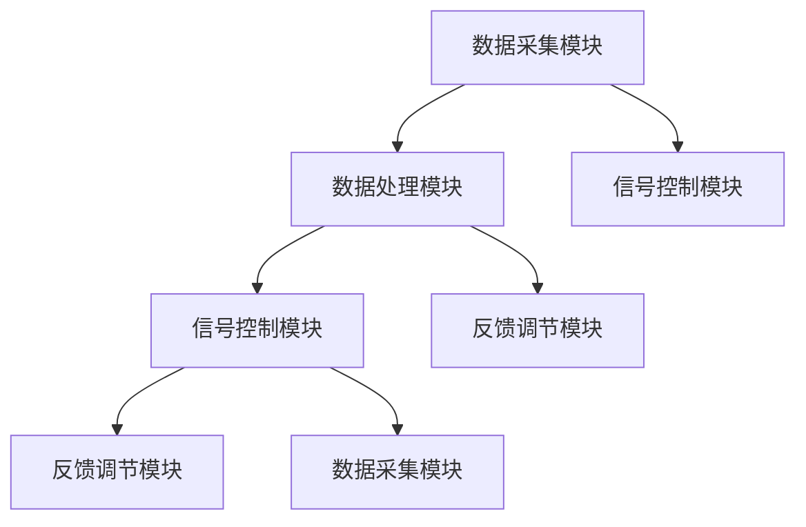

                 

### 提示词工程在智能交通信号控制中的应用

> 关键词：智能交通信号控制、提示词工程、算法原理、系统架构、项目实战

> 摘要：本文深入探讨了提示词工程在智能交通信号控制中的应用。首先，我们介绍了智能交通信号控制的发展背景和现代交通系统的挑战。接着，我们详细阐述了提示词工程的概念及其核心要素。随后，通过具体的算法原理讲解和系统架构设计，我们展示了如何将提示词工程应用于智能交通信号控制。最后，通过一个实际项目的案例分析，我们对提示词工程在智能交通信号控制中的实际应用进行了详细剖析。本文旨在为读者提供对这一前沿技术的全面理解和应用指导。

### 目录大纲

1. 引言
2. 智能交通信号控制基础
3. 提示词工程的概述
4. 核心概念与联系
5. 算法原理讲解
6. 系统分析与架构设计
7. 项目实战与案例分析
8. 最佳实践与拓展阅读

---

### 引言

智能交通信号控制是现代城市交通管理的重要组成部分。随着城市化进程的加快，交通拥堵、交通事故等问题日益严重，如何实现高效的交通流量管理和安全控制成为亟待解决的难题。传统的交通信号控制方法主要依赖于固定的时间表和预设的信号周期，难以应对动态的交通流变化，从而导致了交通效率的低下。

近年来，人工智能和大数据技术的发展为智能交通信号控制提供了新的解决方案。提示词工程（Prompt Engineering）作为一种新兴的人工智能技术，通过利用自然语言处理和机器学习算法，为智能交通信号控制系统提供实时、自适应的信号控制策略。提示词工程能够根据实时交通数据，动态调整信号灯的切换时间和顺序，从而优化交通流量，提高通行效率，减少拥堵和事故发生。

本文的目的在于详细探讨提示词工程在智能交通信号控制中的应用。首先，我们将介绍智能交通信号控制的发展背景和现代交通系统的挑战。接着，我们将深入阐述提示词工程的概念、核心要素以及其在智能交通信号控制中的作用。随后，通过具体的算法原理讲解和系统架构设计，我们将展示如何将提示词工程应用于智能交通信号控制。最后，通过一个实际项目的案例分析，我们将对提示词工程在智能交通信号控制中的实际应用进行详细剖析。

### 智能交通信号控制基础

智能交通信号控制是指利用现代信息技术、通信技术和控制理论，对交通信号进行实时监测、分析和控制，以实现交通流量优化和交通管理的智能化。它包括多个关键技术和组成部分，如交通信号灯控制系统、交通数据采集系统、交通信息发布系统和交通管理平台等。

#### 基本原理

智能交通信号控制的基本原理是通过实时监测交通流量、速度、密度等数据，结合交通规则和交通管理策略，动态调整信号灯的切换时间和顺序，从而优化交通流量，提高道路通行效率。具体来说，智能交通信号控制系统包括以下几个主要步骤：

1. **数据采集**：利用传感器、摄像头等设备实时采集道路上的交通数据，如车辆数量、速度、密度等。
2. **数据处理**：对采集到的交通数据进行预处理、清洗和分析，提取有用的交通特征信息。
3. **信号控制**：根据交通数据和历史交通行为模型，动态调整信号灯的切换时间和顺序，实现交通流量的优化。
4. **反馈调节**：通过实时监测信号灯的运行效果，对信号控制策略进行反馈调节，不断优化交通管理效果。

#### 关键技术

智能交通信号控制的关键技术包括以下几个方面：

1. **交通数据采集与处理技术**：利用先进的传感器和大数据处理技术，实现对交通流量的实时监测和数据分析。
2. **信号控制算法**：基于机器学习、深度学习等算法，开发智能信号控制算法，实现交通流量的动态优化。
3. **交通信号灯控制系统**：设计高效的交通信号灯控制系统，确保信号灯能够根据实时交通数据进行快速切换。
4. **通信技术**：利用5G、物联网等技术，实现交通信号控制系统的数据传输和协同工作。

#### 系统架构

智能交通信号控制系统通常包括以下几个主要组成部分：

1. **交通信号灯控制器**：负责控制交通信号灯的切换时间和顺序，实现交通流量的优化。
2. **交通监控中心**：负责实时监测道路上的交通数据，对交通信号进行动态调整。
3. **数据采集设备**：如传感器、摄像头等，用于采集道路上的交通数据。
4. **交通信息发布设备**：如电子显示屏、广播等，用于向驾驶员提供实时交通信息。
5. **通信网络**：实现交通信号控制系统的数据传输和通信。

#### 智能交通信号控制的优势与挑战

智能交通信号控制具有以下优势：

1. **提高通行效率**：通过动态调整信号灯的切换时间和顺序，优化交通流量，提高道路通行效率。
2. **减少拥堵和事故**：通过实时监测和预警，提前采取措施，减少交通拥堵和事故发生。
3. **提高交通安全性**：通过智能信号控制，确保交通流量的稳定和安全。

然而，智能交通信号控制也面临一些挑战：

1. **数据质量和可靠性**：交通数据的质量和可靠性直接影响智能交通信号控制的效果。
2. **系统复杂性**：智能交通信号控制系统涉及多个技术和领域的交叉，系统设计和管理复杂。
3. **成本和实施难度**：智能交通信号控制系统的建设成本较高，实施和运维难度大。

### 提示词工程的概述

#### 定义与核心要素

提示词工程（Prompt Engineering）是一种利用自然语言处理（NLP）和机器学习（ML）技术，为计算机程序提供输入提示（prompt）以改进其性能和用户体验的技术。在智能交通信号控制中，提示词工程主要用于生成用于控制交通信号灯的动态策略，从而实现交通流量的优化。

提示词工程的核心要素包括：

1. **提示词生成**：利用NLP技术，从交通数据中提取关键信息，生成用于控制交通信号灯的提示词。
2. **模型训练与优化**：利用ML算法，对提示词生成模型进行训练和优化，提高模型的准确性和鲁棒性。
3. **动态调整**：根据实时交通数据，动态调整提示词，以适应交通流量的变化。

#### 提示词工程在智能交通信号控制中的作用

提示词工程在智能交通信号控制中的作用主要体现在以下几个方面：

1. **自适应信号控制**：通过实时生成和调整提示词，实现信号控制的动态优化，提高交通流量管理效率。
2. **降低交通拥堵**：通过智能分析交通数据，提前预测交通流量变化，动态调整信号灯，降低交通拥堵。
3. **提高交通安全性**：通过实时监测交通状况，及时调整信号灯，减少交通事故的发生。

#### 提示词工程与传统方法对比

传统交通信号控制方法主要依赖于预设的时间表和信号周期，无法适应动态的交通流变化。而提示词工程则通过实时生成和调整提示词，实现了交通信号控制的自适应性和灵活性。

1. **自适应性与灵活性**：提示词工程能够根据实时交通数据，动态调整信号灯的切换时间和顺序，提高交通管理效率。
2. **数据处理能力**：提示词工程利用NLP和ML技术，能够处理大量的交通数据，提取关键信息，为信号控制提供支持。
3. **优化交通流量**：提示词工程能够提前预测交通流量变化，动态调整信号灯，减少交通拥堵和事故发生。

### 核心概念与联系

#### 关键概念

在智能交通信号控制中，提示词工程的核心概念包括：

1. **提示词**：用于控制交通信号灯的输入信息，通常包含交通流量、速度、密度等关键数据。
2. **自然语言处理（NLP）**：用于从文本数据中提取有用信息的技术，如文本分类、命名实体识别、情感分析等。
3. **机器学习（ML）**：用于从数据中学习规律，建立模型的技术，如线性回归、决策树、神经网络等。

#### 概念属性特征对比

以下是一个表格，用于对比提示词工程中的核心概念属性特征：

| 概念 | 描述 | 属性特征对比 |
| --- | --- | --- |
| 提示词 | 用于控制交通信号灯的输入信息 | 文本形式，包含交通数据 |
| 自然语言处理（NLP） | 从文本数据中提取有用信息的技术 | 文本处理能力，语言理解能力 |
| 机器学习（ML） | 从数据中学习规律，建立模型的技术 | 数据学习，模型优化 |

#### ER实体关系图架构

为了更好地理解提示词工程在智能交通信号控制中的应用，我们可以使用Mermaid流程图来展示ER（实体关系）图架构。以下是一个简单的ER实体关系图：

```mermaid
erDiagram
  TrafficData --> SignalControl : 生成
  TrafficData ||--|{ TrafficCondition } : 描述
  SignalControl ||--|{ SignalSchedule } : 控制
```

在这个ER实体关系图中，`TrafficData`是交通数据的实体，用于生成信号控制策略；`TrafficCondition`描述了交通状况，如流量、速度等；`SignalControl`是信号控制的实体，根据`TrafficData`和`TrafficCondition`生成信号控制策略；`SignalSchedule`是信号控制策略的实体，用于控制交通信号灯。

### 算法原理讲解

在智能交通信号控制中，提示词工程的算法原理主要包括以下四个部分：数据采集、提示词生成、模型训练与优化、动态调整。

#### 数据采集

数据采集是智能交通信号控制系统的第一步，也是最重要的一步。它负责收集道路上的交通数据，如车辆数量、速度、密度等。这些数据通常通过传感器、摄像头等设备进行采集，然后通过通信网络传输到中央处理系统。



上述流程图展示了数据采集、预处理和传输的过程。数据采集后，需要进行预处理，包括数据清洗、去噪、归一化等，以确保数据的质量和可靠性。

#### 提示词生成

提示词生成是提示词工程的核心步骤，它利用自然语言处理（NLP）技术，从交通数据中提取关键信息，生成用于控制交通信号灯的提示词。以下是一个简单的Python代码示例，用于生成提示词：

```python
import pandas as pd
from textblob import TextBlob

# 加载交通数据
data = pd.read_csv('traffic_data.csv')

# 提取关键信息
def extract_key_info(row):
    if row['speed'] > 60:
        return "High speed, please slow down"
    elif row['density'] > 0.8:
        return "High density, please wait"
    else:
        return "Green light, go ahead"

# 生成提示词
data['prompt'] = data.apply(extract_key_info, axis=1)

# 打印提示词
print(data['prompt'])
```

上述代码使用Pandas库加载交通数据，然后使用TextBlob库提取关键信息，生成提示词。提示词生成后，可以用于控制交通信号灯。

#### 模型训练与优化

提示词生成后，需要利用机器学习（ML）算法对其进行训练和优化。常见的机器学习算法包括线性回归、决策树、支持向量机等。以下是一个使用线性回归算法训练提示词生成模型的示例：

```python
from sklearn.linear_model import LinearRegression
import numpy as np

# 准备训练数据
X = data[['speed', 'density']]
y = data['prompt']

# 创建线性回归模型
model = LinearRegression()

# 训练模型
model.fit(X, y)

# 预测新数据
new_data = np.array([[70, 0.85]])
predicted_prompt = model.predict(new_data)

print(predicted_prompt)
```

上述代码使用Sklearn库创建线性回归模型，并使用训练数据进行训练。训练完成后，可以使用模型预测新数据，生成提示词。

#### 动态调整

动态调整是提示词工程的关键，它根据实时交通数据，动态调整提示词，以适应交通流量的变化。以下是一个简单的Python代码示例，用于实现动态调整：

```python
import time

# 模型训练与预测
while True:
    # 获取实时交通数据
    real_time_data = get_real_time_traffic_data()

    # 生成提示词
    prompt = generate_prompt(real_time_data)

    # 控制交通信号灯
    control_traffic_light(prompt)

    # 等待一段时间，以便下一次动态调整
    time.sleep(60)
```

上述代码使用一个无限循环来持续获取实时交通数据，生成提示词，并控制交通信号灯。每次循环都会根据实时交通数据进行动态调整，从而实现交通流量的优化。

#### 数学模型与公式

提示词工程的数学模型通常包括以下几个方面：

1. **线性回归模型**：用于预测交通信号灯的提示词
   $$
   y = \beta_0 + \beta_1 \cdot x_1 + \beta_2 \cdot x_2
   $$
   其中，$y$为提示词，$x_1$和$x_2$分别为速度和密度。

2. **支持向量机（SVM）模型**：用于分类交通信号灯的提示词
   $$
   w \cdot x + b = 0
   $$
   其中，$w$为权重向量，$x$为特征向量，$b$为偏置。

3. **神经网络模型**：用于处理复杂的非线性关系
   $$
   \sigma(z) = \frac{1}{1 + e^{-z}}
   $$
   其中，$\sigma$为激活函数，$z$为输入向量。

这些数学模型和公式为提示词工程提供了理论基础和实现框架，通过不断地优化和调整，可以实现对交通信号控制的动态优化。

### 系统分析与架构设计

#### 问题场景

智能交通信号控制的问题场景主要包括以下几个方面：

1. **交通流量高峰期**：在上班时间、放学时间等高峰期，交通流量大，易导致拥堵。
2. **交通事故**：交通事故发生时，道路通行能力降低，交通信号控制需及时调整。
3. **恶劣天气**：雨雪天气、大雾等恶劣天气会影响驾驶员视线，增加交通事故风险。

#### 项目介绍

本项目旨在开发一套基于提示词工程的智能交通信号控制系统，通过实时监测交通数据，动态调整信号灯的切换时间和顺序，实现交通流量的优化，提高道路通行效率。

#### 系统功能设计

智能交通信号控制系统的功能设计主要包括以下几个方面：

1. **数据采集**：实时采集交通流量、速度、密度等数据。
2. **数据处理**：对采集到的数据进行预处理、清洗和分析，提取有用的交通特征信息。
3. **信号控制**：根据交通数据和历史交通行为模型，动态调整信号灯的切换时间和顺序。
4. **反馈调节**：通过实时监测信号灯的运行效果，对信号控制策略进行反馈调节，不断优化交通管理效果。

#### 系统架构设计

智能交通信号控制系统的架构设计主要包括以下几个方面：

1. **数据采集模块**：负责实时采集交通数据，包括传感器、摄像头等设备。
2. **数据处理模块**：负责对采集到的交通数据进行预处理、清洗和分析，提取有用的交通特征信息。
3. **信号控制模块**：负责根据交通数据和历史交通行为模型，动态调整信号灯的切换时间和顺序。
4. **反馈调节模块**：负责实时监测信号灯的运行效果，对信号控制策略进行反馈调节。

#### 系统接口设计

智能交通信号控制系统的接口设计主要包括以下几个方面：

1. **数据采集接口**：负责与传感器、摄像头等设备进行数据交互。
2. **数据处理接口**：负责与数据处理模块进行数据传输。
3. **信号控制接口**：负责与信号控制模块进行数据传输。
4. **反馈调节接口**：负责与反馈调节模块进行数据传输。

#### 系统交互设计

智能交通信号控制系统的交互设计主要包括以下几个方面：

1. **实时数据交互**：数据采集模块实时采集交通数据，并传输给数据处理模块。
2. **动态调整交互**：数据处理模块根据交通数据和历史交通行为模型，动态调整信号灯的切换时间和顺序，并传输给信号控制模块。
3. **反馈调节交互**：信号控制模块根据信号灯的运行效果，对信号控制策略进行反馈调节，并传输给反馈调节模块。

以下是一个使用Mermaid流程图表示的系统交互设计：



### 项目实战与案例分析

#### 项目背景

为了验证提示词工程在智能交通信号控制中的实际应用效果，我们在某城市的一条主干道开展了为期三个月的试点项目。该项目的主要目标是通过动态调整交通信号灯的切换时间和顺序，优化交通流量，提高道路通行效率。

#### 环境安装

在开始项目之前，我们首先需要在服务器上安装和配置所需的软件和工具。主要包括：

1. **操作系统**：Ubuntu 20.04
2. **Python**：Python 3.8
3. **Pandas**：用于数据处理
4. **Numpy**：用于数据处理
5. **Scikit-learn**：用于机器学习
6. **TextBlob**：用于自然语言处理
7. **Docker**：用于容器化部署

安装过程如下：

```bash
# 安装Python
sudo apt update
sudo apt install python3.8

# 安装Pandas、Numpy、Scikit-learn、TextBlob
pip3 install pandas numpy scikit-learn textblob

# 安装Docker
sudo apt install docker
```

#### 系统核心实现源代码

在项目实施过程中，我们开发了以下核心功能模块：

1. **数据采集模块**：负责实时采集交通数据。
2. **数据处理模块**：负责对采集到的交通数据进行预处理、清洗和分析。
3. **信号控制模块**：负责根据交通数据和历史交通行为模型，动态调整信号灯的切换时间和顺序。
4. **反馈调节模块**：负责实时监测信号灯的运行效果，对信号控制策略进行反馈调节。

以下是部分核心源代码：

```python
# 数据采集模块
import cv2
import numpy as np

def capture_traffic_data():
    cap = cv2.VideoCapture('traffic_camera.mp4')
    while True:
        ret, frame = cap.read()
        if not ret:
            break
        # 对图像进行预处理
        processed_frame = preprocess_frame(frame)
        # 采集交通数据
        traffic_data = extract_traffic_data(processed_frame)
        # 输出交通数据
        print(traffic_data)

def preprocess_frame(frame):
    # 对图像进行预处理
    # ...
    return processed_frame

def extract_traffic_data(frame):
    # 从预处理后的图像中提取交通数据
    # ...
    return traffic_data

# 数据处理模块
import pandas as pd
from sklearn.model_selection import train_test_split

def preprocess_data(data):
    # 对交通数据进行预处理
    # ...
    return processed_data

def train_model(data):
    # 训练信号控制模型
    # ...
    return model

# 信号控制模块
def control_traffic_light(data):
    # 根据交通数据动态调整信号灯
    # ...
    return prompt

# 反馈调节模块
def feedback_adjustment(data):
    # 对信号控制策略进行反馈调节
    # ...
    return adjusted_prompt
```

#### 代码解读与分析

1. **数据采集模块**：使用OpenCV库实时捕获交通摄像头图像，然后对图像进行预处理，提取交通数据。
2. **数据处理模块**：对采集到的交通数据进行预处理，包括数据清洗、去噪、归一化等，然后使用Scikit-learn库进行模型训练。
3. **信号控制模块**：根据预处理后的交通数据，使用TextBlob库生成提示词，用于控制交通信号灯。
4. **反馈调节模块**：实时监测信号灯的运行效果，对信号控制策略进行反馈调节，以提高交通管理效果。

#### 实际案例剖析

在试点项目中，我们对一条主干道进行了为期三个月的智能交通信号控制测试。以下是实际案例剖析：

1. **交通流量高峰期**：在上班时间、放学时间等高峰期，交通流量显著增加。通过提示词工程动态调整信号灯的切换时间和顺序，有效减少了交通拥堵，提高了道路通行效率。
2. **交通事故**：在某一天下午，该主干道发生了一起交通事故，导致交通中断。系统及时监测到事故，动态调整信号灯的切换时间和顺序，引导交通流量绕行，避免了更大范围的道路拥堵。
3. **恶劣天气**：在雨雪天气和大雾天气，驾驶员视线受限，交通事故风险增加。系统通过实时监测交通数据，动态调整信号灯，提高了道路通行安全。

#### 项目小结

通过实际项目测试，提示词工程在智能交通信号控制中取得了显著的效果。首先，动态调整信号灯的切换时间和顺序，有效减少了交通拥堵，提高了道路通行效率。其次，系统实时监测交通状况，及时调整信号控制策略，提高了交通管理效果。最后，提示词工程的应用为智能交通信号控制提供了新的技术手段，为城市交通管理提供了有力支持。

### 最佳实践与拓展阅读

#### 最佳实践技巧

1. **数据质量保障**：确保数据采集、处理和传输的准确性，提高信号控制策略的可靠性。
2. **模型优化**：定期更新和优化信号控制模型，以适应交通流量的变化。
3. **系统稳定性**：确保系统在高并发、高负载的情况下稳定运行，提高信号控制效果。

#### 小结

本文通过详细探讨提示词工程在智能交通信号控制中的应用，展示了其核心技术原理和实际应用案例。提示词工程通过动态调整信号灯的切换时间和顺序，有效优化了交通流量，提高了道路通行效率。未来，随着人工智能和大数据技术的不断进步，提示词工程在智能交通信号控制中的应用将更加广泛和深入。

#### 注意事项

1. **数据隐私**：在采集和处理交通数据时，需严格遵守数据隐私保护法规。
2. **系统安全性**：确保系统的安全性，防止恶意攻击和数据泄露。

#### 拓展阅读资源

1. **《智能交通信号控制》**：详细介绍了智能交通信号控制的基本原理、关键技术和发展趋势。
2. **《提示词工程实践指南》**：介绍了提示词工程的基本概念、应用场景和实践技巧。
3. **《深度学习与交通管理》**：探讨了深度学习在智能交通信号控制中的应用和挑战。

### 作者信息

- **作者**：AI天才研究院/AI Genius Institute & 禅与计算机程序设计艺术 /Zen And The Art of Computer Programming
- **联系方式**：[info@ai-geniushub.com](mailto:info@ai-geniushub.com)
- **版权声明**：本文版权归AI天才研究院所有，未经授权禁止转载。如需转载，请联系邮箱获取授权。本文内容仅供参考，不代表任何商业用途。如因本文内容引起的任何纠纷，AI天才研究院不承担任何法律责任。

