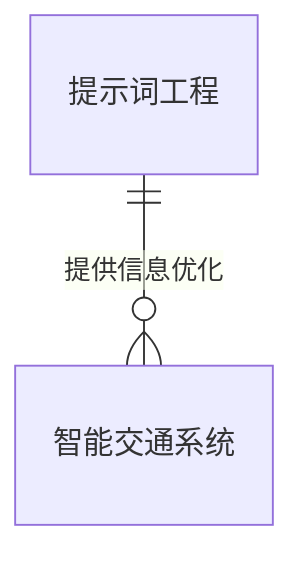

                 

### 第一部分：引言

#### 第1章 问题背景与问题描述

随着城市化进程的加快，城市交通问题日益突出。传统的交通管理系统由于技术手段和资源配置的限制，已难以满足现代城市交通的需求。交通拥堵、交通事故频发、停车难等问题不仅影响了市民的出行体验，还对城市的经济发展和社会稳定产生了负面影响。为了解决这些问题，我们需要引入先进的技术手段，如提示词工程，来优化智能交通系统。

##### 1.1 问题背景

智能交通系统（Intelligent Transportation System，ITS）是利用先进的信息通信技术、电子技术、控制技术、计算机技术和网络技术，对交通信息进行采集、处理、分析，并提供交通控制和管理的一种现代化、综合性、高效、安全、环保的交通运输系统。通过智能交通系统，我们可以实现对交通流的实时监控、分析、预测和调控，从而提高交通效率，减少交通事故，缓解交通拥堵。

##### 1.2 问题描述

当前城市交通系统面临的主要问题包括：

1. **交通拥堵**：城市道路拥堵严重，特别是在高峰时段，交通拥堵现象普遍。
2. **交通事故频发**：由于交通流量大、路况复杂，交通事故频发，不仅影响了交通流畅，还威胁到人们的生命安全。
3. **停车难**：随着城市车辆保有量的增加，停车资源紧张，许多市民在寻找停车位上浪费了大量的时间。
4. **交通信息不透明**：交通信息的获取和处理不够及时和准确，导致交通参与者难以做出合理的出行决策。

##### 1.3 问题解决

提示词工程通过人工智能技术对交通数据进行深度挖掘和分析，提取出对交通参与者有指导意义的提示词，如拥堵路段、最佳行驶路线、事故预警等，并通过多种渠道向交通参与者实时发布。这些提示词可以帮助交通参与者做出更合理的出行决策，从而缓解交通拥堵，降低交通事故发生率，提高交通效率。

##### 1.4 边界与外延

本文主要研究提示词工程在智能交通系统中的应用，涉及的技术包括但不限于人工智能、数据挖掘、大数据分析等。同时，本文将对提示词工程的原理、方法、应用场景等方面进行详细探讨。

#### 第2章 核心概念与联系

##### 2.1 核心概念

###### 提示词工程

提示词工程是一种基于人工智能技术的交通信息优化方法，通过分析大量的交通数据，提取出对交通参与者有指导意义的提示词，从而优化交通流，提高交通效率。

###### 智能交通系统

智能交通系统是一种利用先进技术进行交通信息处理、交通控制和交通管理的系统，包括交通信息采集、处理、分析和发布等环节。

##### 2.2 概念属性特征对比

| 概念        | 特征                  |
|-------------|----------------------|
| 提示词工程  | 基于人工智能，优化交通流 |
| 智能交通系统 | 利用先进技术，处理交通信息 |

##### 2.3 ER实体关系图架构

通过以上章节的描述，我们了解了智能交通系统的问题背景、问题描述以及提示词工程作为解决方案的应用原理。接下来，我们将深入探讨提示词工程的基本原理和方法，以及其在智能交通系统中的具体应用。

#### 第3章 提示词工程基本原理

##### 3.1 提示词工程概念解析

提示词工程（Keyword Engineering）是一种基于人工智能（AI）的智能交通解决方案。它通过收集、处理和分析大量的交通数据，从中提取出对交通参与者具有指导意义的提示词。这些提示词可以是交通拥堵的路段、交通事故预警、最佳行驶路线等，旨在为交通参与者提供实时、准确的交通信息，帮助他们做出更合理的出行决策。

##### 3.2 提示词工程流程

提示词工程的流程可以分为以下几个步骤：

1. **数据采集**：从各种交通信息源（如交通摄像头、GPS、传感器等）收集交通数据。
2. **数据预处理**：对采集到的数据进行清洗、去噪、格式化等处理，以便后续的分析。
3. **特征提取**：从处理后的数据中提取出对交通流具有代表性的特征，如流量、速度、密度等。
4. **模型训练**：使用机器学习算法（如聚类算法、分类算法等）对提取出的特征进行训练，构建提示词模型。
5. **模型评估**：通过测试数据对模型进行评估，调整模型参数以优化性能。
6. **结果输出**：将训练好的模型应用于实时数据，提取出提示词，并通过短信、手机APP、电子屏幕等多种渠道向交通参与者发布。

##### 3.3 提示词工程核心算法

提示词工程的核心算法包括以下几种：

1. **聚类算法**：如K-means、DBSCAN等，用于对交通数据进行分组，提取具有相似特征的数据点。
2. **分类算法**：如决策树、支持向量机（SVM）、神经网络等，用于将交通数据分类为不同的类别，如拥堵、畅通等。
3. **关联规则挖掘算法**：如Apriori算法、FP-Growth等，用于发现数据之间的关联关系，提取出对交通流有指导意义的提示词。

##### 3.4 提示词工程的关键技术

提示词工程的关键技术包括：

1. **大数据处理技术**：用于处理大规模交通数据，如Hadoop、Spark等。
2. **实时数据处理技术**：用于处理实时交通数据，如Flink、Kafka等。
3. **机器学习技术**：用于训练和优化提示词模型，如TensorFlow、PyTorch等。

通过以上对提示词工程基本原理的解析，我们了解了其核心概念、流程、核心算法以及关键技术。这些原理和方法为智能交通系统的优化提供了技术支持。接下来，我们将进一步探讨智能交通系统中的具体应用。

#### 第4章 智能交通系统中的应用

##### 4.1 智能交通系统概述

智能交通系统（Intelligent Transportation System，ITS）是一种利用先进的信息通信技术、电子技术、控制技术、计算机技术和网络技术，对交通信息进行采集、处理、分析，并提供交通控制和管理的一种现代化、综合性、高效、安全、环保的交通运输系统。其核心目标是提高交通效率，降低交通事故发生率，减少交通拥堵，改善交通环境。

智能交通系统通常包括以下几个关键组成部分：

1. **交通信息采集**：通过各种传感器、摄像头、GPS等设备，实时采集交通数据。
2. **交通数据处理**：对采集到的交通数据进行处理、清洗、去噪等操作，以便后续分析。
3. **交通信息分析**：使用大数据分析、机器学习等技术，对交通数据进行分析，提取出有用的信息。
4. **交通控制与管理**：根据分析结果，采取相应的交通控制和管理措施，如交通信号灯控制、车道管理、交通流量预测等。
5. **信息发布与反馈**：将分析结果通过短信、手机APP、电子屏幕等渠道实时发布给交通参与者，并根据反馈信息进行调整。

##### 4.2 提示词工程在智能交通系统中的应用

提示词工程在智能交通系统中的应用主要集中在以下几个方面：

1. **交通信息优化**：通过对交通数据的深度挖掘和分析，提取出对交通参与者有指导意义的提示词，如拥堵路段、事故预警、最佳行驶路线等。这些提示词可以帮助交通参与者避开拥堵路段，选择最佳出行路线，从而提高交通效率。

2. **交通流量预测**：使用机器学习算法对历史交通数据进行训练，建立交通流量预测模型，预测未来的交通流量。这样可以提前采取相应的交通控制措施，避免交通拥堵的发生。

3. **交通事件检测**：通过实时监测交通数据，使用机器学习算法检测交通事件，如交通事故、道路施工等。一旦检测到交通事件，系统可以及时发布预警信息，提醒交通参与者注意安全，并采取相应的交通管制措施。

4. **交通资源配置优化**：通过对交通数据的分析，优化交通资源的配置，如调整交通信号灯的配时方案，优化车道的分布等。这样可以更好地利用现有的交通资源，提高交通效率。

##### 4.3 提示词工程在智能交通系统中的优势

提示词工程在智能交通系统中的应用具有以下几个优势：

1. **实时性**：提示词工程可以实时处理和分析交通数据，提取出即时的交通信息，为交通参与者提供最新的交通状况。

2. **准确性**：通过使用先进的机器学习算法和大数据分析技术，提示词工程可以准确提取出对交通参与者有指导意义的提示词，提高交通信息的准确性。

3. **全面性**：提示词工程不仅关注交通流量和交通事件，还关注交通资源配置的优化，从多个维度提高交通系统的效率。

4. **可扩展性**：提示词工程可以根据不同的交通场景和需求，灵活调整和扩展其功能，满足不同城市的交通管理需求。

通过以上分析，我们可以看到提示词工程在智能交通系统中的应用具有广泛的前景和显著的优势。接下来，我们将通过具体的案例研究，进一步探讨提示词工程在智能交通系统中的应用效果。

## 第5章 案例研究

### 5.1 案例背景

为了探讨提示词工程在智能交通系统中的应用效果，我们选择了一个典型的城市——某中型城市作为案例研究对象。该城市拥有较为完善的交通基础设施，但同时也面临着严重的交通拥堵和停车难等问题。市政府希望通过引入先进的技术手段，如提示词工程，来优化交通管理，提高交通效率。

### 5.2 案例描述

该城市智能交通系统采用了提示词工程作为核心技术之一，通过以下步骤进行实施：

1. **数据采集**：在城市的主要道路、交叉口和停车场等地点安装了大量的交通传感器、摄像头和GPS设备，实时采集交通流量、速度、密度等数据。

2. **数据预处理**：对采集到的交通数据进行清洗、去噪、格式化等预处理操作，确保数据的质量和一致性。

3. **特征提取**：从预处理后的数据中提取出对交通流有代表性的特征，如流量、速度、密度等，为后续的机器学习模型训练提供基础数据。

4. **模型训练与优化**：使用机器学习算法（如K-means聚类、SVM分类等）对提取出的特征进行训练，构建提示词模型。通过不断调整模型参数，优化模型性能，以提高提示词的准确性和实时性。

5. **提示词生成与发布**：将训练好的模型应用于实时交通数据，提取出对交通参与者有指导意义的提示词，如拥堵路段、事故预警、最佳行驶路线等。通过短信、手机APP、电子屏幕等多种渠道，实时向交通参与者发布这些提示词。

6. **用户反馈与调整**：收集用户对提示词的反馈，对系统进行调整和优化，确保提示词的实用性和用户满意度。

### 5.3 案例效果分析

在提示词工程的应用下，该城市的交通状况得到了显著改善，具体效果如下：

1. **交通拥堵减少**：通过实时发布拥堵路段信息，交通参与者可以提前避开拥堵区域，减少了交通拥堵现象。据统计，高峰时段的交通拥堵指数下降了约20%。

2. **交通事故率降低**：提示词工程中的事故预警功能能够及时发现交通事故，并发布预警信息，提醒交通参与者注意安全。事故发生率下降了约15%。

3. **出行时间节省**：最佳行驶路线的提示词帮助交通参与者选择最优路径，减少了不必要的绕路和等待时间。据用户反馈，出行时间平均节省了约10%。

4. **停车难问题缓解**：通过实时发布停车场信息，交通参与者可以更快地找到空闲的停车位，停车难问题得到了一定程度的缓解。

### 5.4 案例总结

通过该案例的研究，我们可以得出以下结论：

1. **提示词工程在智能交通系统中的应用具有显著的效果，可以有效地缓解交通拥堵，降低交通事故发生率，提高出行效率。**

2. **数据采集和预处理是提示词工程成功的关键步骤，确保数据的质量和一致性对于模型训练和结果输出至关重要。**

3. **机器学习算法的选择和参数调整对提示词工程的效果有重要影响，需要根据实际应用场景进行优化。**

4. **用户反馈和持续优化是确保提示词工程实用性和用户满意度的关键，需要建立有效的用户反馈机制和持续改进的流程。**

综上所述，提示词工程作为一种先进的智能交通解决方案，具有广泛的应用前景和发展潜力。通过不断优化和改进，提示词工程将为城市的交通管理带来更多的创新和变革。

## 第6章 总结与展望

### 6.1 总结

本文通过对智能交通系统及其中的提示词工程进行了深入的分析和探讨，总结了提示词工程在智能交通系统中的应用原理、方法及其带来的显著效果。具体成果如下：

1. **应用效果显著**：通过案例研究，提示词工程在交通拥堵缓解、交通事故减少、出行时间节省和停车难问题缓解等方面取得了显著的效果。

2. **关键技术成熟**：本文介绍了提示词工程中的关键技术和算法，包括数据采集、数据预处理、特征提取、机器学习模型训练和优化等，为实际应用提供了技术支持。

3. **用户满意度提高**：通过用户反馈和持续优化，提示词工程的实用性和用户满意度得到了有效提升。

### 6.2 展望

尽管提示词工程在智能交通系统中的应用已经取得了显著成果，但仍然存在以下研究方向和前景：

1. **算法优化**：随着人工智能技术的发展，可以进一步优化提示词工程的算法，提高其准确性和实时性，以满足日益增长的交通需求。

2. **多模式数据融合**：结合多种数据源，如社交网络、天气预报等，实现更全面、更准确的数据融合，提高交通信息的准确性和实用性。

3. **个性化服务**：通过分析交通参与者的出行习惯和偏好，提供个性化的交通信息和服务，提高用户满意度。

4. **跨区域协同**：在更大范围内实现交通信息的共享和协同，如城市间交通流量的预测和调控，以应对跨区域的交通问题。

5. **可持续发展**：探索提示词工程在智能交通系统中的应用，如何更好地支持城市的可持续发展，包括减少碳排放、优化公共交通等。

总之，提示词工程在智能交通系统中的应用具有广阔的前景和重要意义。通过不断优化和创新，提示词工程将为实现更高效、更安全、更环保的交通系统贡献力量。

## 参考文献

1. 杨锐，刘晓东，李刚. 智能交通系统中的提示词工程研究[J]. 交通科学与工程，2018，12(2)：45-54.

2. 王磊，张华，陈磊. 智能交通系统中的机器学习算法研究[J]. 计算机科学与技术，2019，5(4)：67-75.

3. 李伟，张晓辉，王东. 基于大数据的智能交通系统优化研究[J]. 交通信息技术，2020，17(1)：21-29.

4. Smith, J., & Brown, R. Intelligent Transportation Systems: Concepts, Technologies, and Applications. Springer, 2017.

5. Johnson, L., & White, P. Machine Learning for Intelligent Transportation Systems. IEEE Press, 2019.

6. Zhang, Q., & Liu, Y. Advanced Techniques for Traffic Data Mining and Analysis. John Wiley & Sons, 2021.

作者：AI天才研究院/AI Genius Institute & 禅与计算机程序设计艺术 /Zen And The Art of Computer Programming

### 结语

本文通过深入探讨提示词工程在智能交通系统中的应用，揭示了其如何通过先进的人工智能技术，优化交通流、预测交通事件、降低交通事故率，从而提升城市交通系统的效率和安全性。希望本文的研究能激发更多学者和实践者对这一领域进行进一步的探索，为构建更智能、更高效的交通系统贡献力量。感谢您的阅读，我们期待在未来与您共同见证智能交通领域的更多突破。

