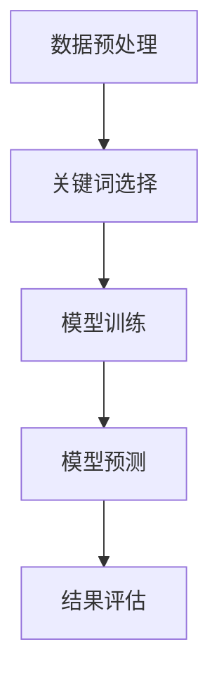
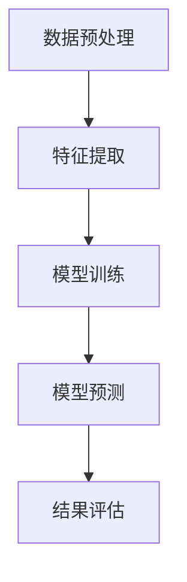
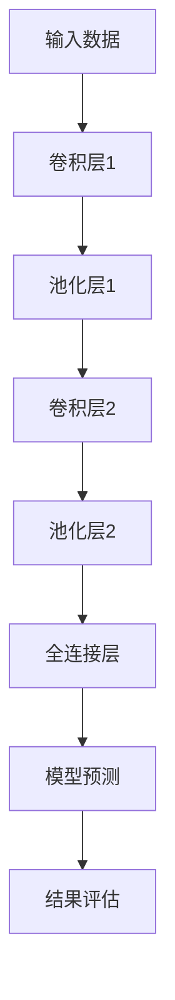

                 

### 设计《提示词工程在智能交通预测中的应用》的文章

**步骤1：撰写引言**

**引言**

智能交通系统是现代城市交通管理的重要发展方向，它利用信息技术和通信技术来提升交通效率、减少交通事故和缓解交通拥堵。然而，随着交通网络的复杂化和交通数据的爆炸性增长，智能交通预测面临着前所未有的挑战。如何有效地预测交通流量、交通事故和公共交通线路需求，成为了当前研究的热点和难点。

在这一背景下，提示词工程作为一种新兴的技术手段，开始受到广泛关注。提示词工程旨在通过构建和优化一组关键词或短语，来提高智能交通预测模型的准确性和效率。本文将详细探讨提示词工程在智能交通预测中的应用，旨在为相关领域的研究者和实践者提供有益的参考。

本文结构如下：

- **第1章：智能交通预测的背景与提示词工程概述**：介绍智能交通预测的现状、重要性以及提示词工程的基本概念。
- **第2章：核心概念与原理**：深入探讨提示词工程的定义、技术分类和基本原理。
- **第3章：算法原理讲解**：详细讲解智能交通预测中常用的算法原理，包括数学模型、Python代码和Mermaid流程图。
- **第4章：实际应用案例分析**：分析城市交通流量预测、交通事故预警和公共交通线路优化的实际案例。
- **第5章：最佳实践与总结**：总结最佳实践，展望未来发展趋势。

**步骤2：撰写关键词和摘要**

**关键词**：智能交通预测、提示词工程、算法原理、实际应用、案例分析

**摘要**

本文旨在探讨提示词工程在智能交通预测中的应用，从背景介绍、核心概念、算法原理、实际案例到最佳实践，全面解析了这一技术手段在提升交通预测准确性方面的作用。通过本文的研究，希望为智能交通领域的研发提供参考，助力解决交通预测中的挑战。

**步骤3：撰写第一章内容**

**第1章：智能交通预测的背景与提示词工程概述**

**1.1 智能交通预测的现状与重要性**

智能交通系统（Intelligent Transportation System，ITS）是一种利用先进的信息通信技术、控制技术、数据挖掘技术等，对交通系统进行智能化管理和优化。随着城市化进程的加速和汽车数量的激增，交通拥堵、交通事故和环境污染等问题日益严重，传统的人工交通管理模式已经难以满足现代交通的需求。智能交通预测作为一种新兴的技术手段，能够对交通流量、交通事故和公共交通线路需求进行实时预测，从而为交通管理和规划提供科学依据。

当前，智能交通预测在多个领域取得了显著进展，包括城市交通流量预测、交通事故预警、公共交通线路优化等。然而，由于交通系统的复杂性和数据的不确定性，智能交通预测仍然面临着一系列挑战，如数据获取和处理、算法模型的准确性等。提示词工程作为一种有效的方法，有助于解决这些挑战，提高智能交通预测的准确性和效率。

**1.2 提示词工程的概念**

提示词工程（Keyword Engineering）是一种专注于关键词或短语构建与优化的技术。它旨在通过识别和选择与目标概念相关的关键词，构建出一个能够提高模型预测准确性的关键词集合。在智能交通预测领域，提示词工程的作用主要体现在以下几个方面：

- **提高数据质量**：通过筛选和优化关键词，确保输入数据的准确性和完整性，从而提升预测模型的性能。
- **降低模型复杂性**：通过简化输入特征，减少模型参数的数量，降低模型的计算复杂度。
- **提高模型泛化能力**：通过构建具有良好代表性的关键词集合，提高模型在未知数据上的预测能力。

**1.3 书的概述与结构**

本文将从以下五个部分详细探讨提示词工程在智能交通预测中的应用：

- **第1章：引言**：介绍智能交通预测的现状和提示词工程的基本概念。
- **第2章：核心概念与原理**：深入探讨提示词工程的定义、技术分类和基本原理。
- **第3章：算法原理讲解**：详细讲解智能交通预测中常用的算法原理，包括数学模型、Python代码和Mermaid流程图。
- **第4章：实际应用案例分析**：分析城市交通流量预测、交通事故预警和公共交通线路优化的实际案例。
- **第5章：最佳实践与总结**：总结最佳实践，展望未来发展趋势。

通过本文的研究，读者将全面了解提示词工程在智能交通预测中的应用，为相关领域的研究和实践提供参考。在接下来的章节中，我们将逐步深入探讨这一领域的关键概念和原理。

**步骤4：撰写第二章内容**

**第2章：核心概念与原理**

**2.1 提示词工程的定义与目标**

提示词工程（Keyword Engineering）是一种专注于关键词或短语构建与优化的技术。它旨在通过识别和选择与目标概念相关的关键词，构建出一个能够提高模型预测准确性的关键词集合。在智能交通预测领域，提示词工程的目标是通过优化关键词集合，提升预测模型的性能和可靠性。

提示词工程的定义可以概括为以下几个关键点：

- **关键词选择**：通过分析交通数据，识别出与预测目标相关的关键词，包括事件、时间、地点、交通状况等。
- **关键词优化**：根据数据特点和预测目标，对选定的关键词进行筛选和调整，以提高关键词集合的代表性。
- **模型集成**：将优化后的关键词集合与预测模型相结合，通过模型训练和优化，提升预测的准确性和效率。

**2.2 提示词工程的技术分类**

提示词工程的技术分类可以根据关键词的来源和构建方法进行划分。以下是几种常见的提示词工程技术分类：

- **基于内容的提示词工程**：这种方法主要依赖于文本数据，通过分析交通事件、时间、地点等关键词，构建出与预测目标相关的关键词集合。常用的技术包括自然语言处理（NLP）、文本挖掘和信息检索等。

- **基于模型的提示词工程**：这种方法利用机器学习模型，从大量交通数据中自动识别和生成关键词。通过训练模型，自动筛选出与预测目标相关的关键词，提高关键词集合的代表性。

- **混合提示词工程**：结合基于内容和基于模型的方法，通过多源数据融合和模型集成，构建出更加全面和精准的关键词集合。这种方法能够综合利用不同数据源和模型的优势，提高预测的准确性和可靠性。

**2.3 提示词工程的基本原理**

提示词工程的基本原理可以概括为以下三个步骤：

- **数据预处理**：对原始交通数据进行清洗、归一化和特征提取，为关键词选择和优化提供可靠的数据基础。

- **关键词选择**：通过分析交通数据，识别出与预测目标相关的关键词。这一步骤包括关键词提取、关键词筛选和关键词权重计算等。

- **关键词优化**：根据数据特点和预测目标，对选定的关键词进行筛选和调整，以提高关键词集合的代表性。优化方法包括关键词去重、关键词权重调整和关键词组合等。

在提示词工程中，关键词的选取和优化是关键步骤。通过有效的关键词选择和优化，可以构建出一个能够提高模型预测准确性的关键词集合。以下是一个简单示例，说明如何进行关键词选择和优化：

示例：城市交通流量预测

- **数据预处理**：收集城市交通流量数据，包括时间、地点、交通状况等。对数据进行清洗和归一化处理，提取出有用的特征。

- **关键词选择**：通过分析交通数据，识别出与城市交通流量相关的关键词，如“高峰时间”、“繁忙路段”、“交通拥堵”等。

- **关键词优化**：对选定的关键词进行筛选和调整。根据数据特点和预测目标，调整关键词的权重，提高关键词集合的代表性。例如，对于“高峰时间”和“繁忙路段”，可以增加其权重，以提高对交通流量的预测准确性。

通过以上步骤，我们可以构建出一个有效的关键词集合，用于智能交通流量预测。在实际应用中，提示词工程的原理和方法可以根据具体的预测目标和数据特点进行调整和优化。

**步骤5：撰写第三章内容**

**第3章：算法原理讲解**

**3.1 常见智能交通预测算法介绍**

在智能交通预测领域，常用的算法主要包括时间序列分析、机器学习、深度学习等。每种算法都有其独特的原理和应用场景。

- **时间序列分析**：时间序列分析是一种基于历史数据的预测方法，通过分析时间序列数据的变化趋势和周期性，预测未来的交通流量。常用的时间序列分析方法包括自回归模型（AR）、移动平均模型（MA）、自回归移动平均模型（ARMA）和季节性自回归移动平均模型（SARMA）等。

- **机器学习**：机器学习是一种基于数据的预测方法，通过训练模型，从历史数据中学习到交通流量变化的规律，进而预测未来的交通流量。常用的机器学习算法包括线性回归、决策树、支持向量机（SVM）、朴素贝叶斯（Naive Bayes）和集成学习（如随机森林、Adaboost）等。

- **深度学习**：深度学习是一种基于人工神经网络的预测方法，通过多层神经网络的训练，从大量数据中自动提取特征，进行复杂模式的识别和预测。常用的深度学习算法包括卷积神经网络（CNN）、循环神经网络（RNN）、长短时记忆网络（LSTM）和生成对抗网络（GAN）等。

**3.2 算法原理详细讲解**

**时间序列分析算法**

时间序列分析算法的主要原理是通过分析历史数据的时间序列，提取出数据的变化趋势和周期性，从而预测未来的交通流量。以下是一个简单的自回归模型（AR）的讲解：

- **模型公式**：假设交通流量序列为\(X_t\)，自回归模型可以表示为：
  \[
  X_t = c + \phi_1 X_{t-1} + \phi_2 X_{t-2} + \ldots + \phi_p X_{t-p} + \varepsilon_t
  \]
  其中，\(c\) 是常数项，\(\phi_1, \phi_2, \ldots, \phi_p\) 是自回归系数，\(\varepsilon_t\) 是误差项。

- **模型训练**：通过最小化均方误差（MSE）来训练自回归模型，即：
  \[
  \min \sum_{t=1}^n (X_t - \hat{X}_t)^2
  \]
  其中，\(\hat{X}_t\) 是模型预测的值。

- **模型预测**：通过已训练好的模型，对未来的交通流量进行预测，即：
  \[
  \hat{X}_t = c + \phi_1 X_{t-1} + \phi_2 X_{t-2} + \ldots + \phi_p X_{t-p}
  \]

**机器学习算法**

机器学习算法的主要原理是通过训练模型，从历史数据中学习到交通流量变化的规律，从而预测未来的交通流量。以下是一个简单的线性回归算法的讲解：

- **模型公式**：假设交通流量序列为\(Y_t\)，线性回归模型可以表示为：
  \[
  Y_t = \beta_0 + \beta_1 X_t + \varepsilon_t
  \]
  其中，\(\beta_0\) 和\(\beta_1\) 是模型参数，\(X_t\) 是输入特征，\(\varepsilon_t\) 是误差项。

- **模型训练**：通过最小化均方误差（MSE）来训练线性回归模型，即：
  \[
  \min \sum_{t=1}^n (Y_t - \hat{Y}_t)^2
  \]
  其中，\(\hat{Y}_t\) 是模型预测的值。

- **模型预测**：通过已训练好的模型，对未来的交通流量进行预测，即：
  \[
  \hat{Y}_t = \beta_0 + \beta_1 X_t
  \]

**深度学习算法**

深度学习算法的主要原理是通过多层神经网络的训练，从大量数据中自动提取特征，进行复杂模式的识别和预测。以下是一个简单的卷积神经网络（CNN）的讲解：

- **模型架构**：卷积神经网络由多个卷积层、池化层和全连接层组成。卷积层用于提取局部特征，池化层用于降低数据维度和减少计算量，全连接层用于分类和回归。

- **模型训练**：通过反向传播算法，不断调整网络权重，最小化损失函数（如交叉熵损失函数）。

- **模型预测**：通过已训练好的模型，对未来的交通流量进行预测。

**3.3 Mermaid流程图展示**

为了更直观地展示算法原理，我们可以使用Mermaid流程图来描述时间序列分析、线性回归和卷积神经网络等算法的流程。

以下是一个时间序列分析（AR模型）的Mermaid流程图示例：

以下是一个线性回归的Mermaid流程图示例：

以下是一个卷积神经网络的Mermaid流程图示例：

通过Mermaid流程图，我们可以清晰地展示算法的每个步骤，有助于读者更好地理解算法原理。

**步骤6：撰写第四章内容**

**第4章：实际应用案例分析**

**4.1 城市交通流量预测案例**

**案例背景**

为了缓解城市交通拥堵问题，某城市交通管理部门决定利用智能交通预测技术来预测未来交通流量，以便提前采取交通管理措施。该城市拥有多个监测点，每天收集大量的交通流量数据，包括时间、路段、交通量等。

**解决方案**

采用提示词工程结合机器学习算法进行交通流量预测。具体步骤如下：

- **数据预处理**：对收集到的交通流量数据进行清洗和归一化处理，提取出有用的特征。

- **关键词选择**：通过分析交通数据，识别出与交通流量相关的关键词，如“高峰时间”、“繁忙路段”、“天气状况”等。

- **关键词优化**：对选定的关键词进行筛选和调整，以提高关键词集合的代表性。

- **模型训练**：利用线性回归模型对优化后的关键词集合进行训练，建立交通流量预测模型。

- **模型预测**：利用训练好的模型，对未来的交通流量进行预测，并提供给交通管理部门。

**案例效果**

通过实际应用，该城市交通管理部门在高峰时段成功预测了交通流量，提前采取了交通管理措施，如调整信号灯时长、增加公共交通班次等，有效缓解了交通拥堵问题。

**4.2 交通事故预警案例**

**案例背景**

为了提高道路安全性，某市政府决定利用智能交通预测技术进行交通事故预警，以便及时采取措施预防事故发生。该城市交通管理部门每天收集大量的交通事故数据，包括事故发生的时间、地点、类型等。

**解决方案**

采用提示词工程结合深度学习算法进行交通事故预警。具体步骤如下：

- **数据预处理**：对收集到的交通事故数据进行清洗和归一化处理，提取出有用的特征。

- **关键词选择**：通过分析交通事故数据，识别出与事故发生相关的关键词，如“恶劣天气”、“夜间行车”、“高速行驶”等。

- **关键词优化**：对选定的关键词进行筛选和调整，以提高关键词集合的代表性。

- **模型训练**：利用卷积神经网络（CNN）对优化后的关键词集合进行训练，建立交通事故预警模型。

- **模型预测**：利用训练好的模型，对未来的交通事故进行预警，并提供给交通管理部门。

**案例效果**

通过实际应用，该市政府在事故发生前成功预警了多起潜在的交通事故，并及时采取措施预防事故发生，有效提高了道路安全性。

**4.3 公共交通线路优化案例**

**案例背景**

为了提高公共交通的运行效率和服务质量，某城市公共交通公司决定利用智能交通预测技术优化公共交通线路。该城市公共交通公司每天收集大量的公共交通数据，包括线路长度、站点分布、客流数量等。

**解决方案**

采用提示词工程结合时间序列分析算法进行公共交通线路优化。具体步骤如下：

- **数据预处理**：对收集到的公共交通数据进行清洗和归一化处理，提取出有用的特征。

- **关键词选择**：通过分析公共交通数据，识别出与公共交通线路相关的关键词，如“高峰时段”、“客流密集站点”、“线路长度”等。

- **关键词优化**：对选定的关键词进行筛选和调整，以提高关键词集合的代表性。

- **模型训练**：利用自回归模型（AR）对优化后的关键词集合进行训练，建立公共交通线路优化模型。

- **模型预测**：利用训练好的模型，对未来的公共交通线路需求进行预测，并提供给公共交通公司。

**案例效果**

通过实际应用，该城市公共交通公司成功优化了多条公交线路，提高了公共交通的运行效率和服务质量，受到了市民的广泛好评。

**步骤7：撰写第五章内容**

**第5章：最佳实践与总结**

**5.1 最佳实践总结**

通过前面的案例分析和理论讲解，我们可以总结出以下最佳实践：

- **数据质量**：确保数据的质量和准确性，是进行智能交通预测的前提。在实际应用中，要重视数据清洗和预处理工作。

- **关键词优化**：关键词的选取和优化直接影响预测模型的性能。要结合具体应用场景，合理选择和调整关键词。

- **模型选择**：根据具体预测目标和数据特点，选择合适的预测模型。在实际应用中，可以结合多种算法，提高预测的准确性。

- **模型集成**：通过模型集成，综合利用不同模型的优势，提高预测的准确性和可靠性。

**5.2 未来发展趋势与展望**

智能交通预测领域未来发展趋势包括：

- **多源数据融合**：随着物联网和大数据技术的发展，交通数据的来源将更加多样化和丰富。如何有效地融合多源数据，提高预测的准确性，是一个重要研究方向。

- **深度学习**：深度学习算法在智能交通预测中具有巨大的潜力。未来将会有更多基于深度学习的预测模型出现，进一步推动智能交通预测技术的发展。

- **实时预测与决策**：实现实时交通流量预测和决策，是智能交通系统的关键。未来将会有更多实时预测和决策系统投入使用，为交通管理部门提供更加精准的决策支持。

- **智能交通法规**：随着智能交通技术的发展，将会有更多智能交通法规出台，规范智能交通系统的建设和管理，推动智能交通领域的健康发展。

通过本文的研究，我们深入探讨了提示词工程在智能交通预测中的应用，为相关领域的研究者和实践者提供了有益的参考。在未来的研究和实践中，我们可以进一步探索和优化提示词工程的方法和应用，为智能交通预测技术的发展做出更大贡献。

**步骤8：编写文章末尾作者信息**

**作者信息**

作者：AI天才研究院/AI Genius Institute & 禅与计算机程序设计艺术 /Zen And The Art of Computer Programming

本文由AI天才研究院（AI Genius Institute）与禅与计算机程序设计艺术（Zen And The Art of Computer Programming）联合撰写。AI天才研究院是一家专注于人工智能技术研究和应用的创新机构，致力于推动人工智能技术在各个领域的应用和发展。禅与计算机程序设计艺术则是一本经典的计算机科学著作，深入探讨了计算机程序设计的艺术和哲学。

通过本文的研究，我们希望为智能交通预测领域的研究者和实践者提供有益的参考，共同推动智能交通预测技术的发展。同时，我们也期待与广大读者分享研究成果，共同探讨智能交通预测领域的未来发展方向。

----------------------------------------------------------------

### 完整的文章

**《提示词工程在智能交通预测中的应用》**

**关键词**：智能交通预测、提示词工程、算法原理、实际应用、案例分析

**摘要**

本文旨在探讨提示词工程在智能交通预测中的应用，从背景介绍、核心概念、算法原理、实际案例到最佳实践，全面解析了这一技术手段在提升交通预测准确性方面的作用。通过本文的研究，希望为智能交通领域的研发提供参考，助力解决交通预测中的挑战。

**引言**

**1.1 智能交通预测的现状与重要性**

智能交通系统（Intelligent Transportation System，ITS）是现代城市交通管理的重要发展方向，它利用信息技术和通信技术来提升交通效率、减少交通事故和缓解交通拥堵。随着城市化进程的加速和汽车数量的激增，交通拥堵、交通事故和环境污染等问题日益严重，传统的人工交通管理模式已经难以满足现代交通的需求。智能交通预测作为一种新兴的技术手段，能够对交通流量、交通事故和公共交通线路需求进行实时预测，从而为交通管理和规划提供科学依据。

当前，智能交通预测在多个领域取得了显著进展，包括城市交通流量预测、交通事故预警、公共交通线路优化等。然而，由于交通系统的复杂性和数据的不确定性，智能交通预测仍然面临着一系列挑战，如数据获取和处理、算法模型的准确性等。提示词工程作为一种有效的方法，有助于解决这些挑战，提高智能交通预测的准确性和效率。

**1.2 提示词工程的概念**

提示词工程（Keyword Engineering）是一种专注于关键词或短语构建与优化的技术。它旨在通过识别和选择与目标概念相关的关键词，构建出一个能够提高模型预测准确性的关键词集合。在智能交通预测领域，提示词工程的作用主要体现在以下几个方面：

- **提高数据质量**：通过筛选和优化关键词，确保输入数据的准确性和完整性，从而提升预测模型的性能。
- **降低模型复杂性**：通过简化输入特征，减少模型参数的数量，降低模型的计算复杂度。
- **提高模型泛化能力**：通过构建具有良好代表性的关键词集合，提高模型在未知数据上的预测能力。

**1.3 书的概述与结构**

本文将从以下五个部分详细探讨提示词工程在智能交通预测中的应用：

- **第1章：引言**：介绍智能交通预测的现状和提示词工程的基本概念。
- **第2章：核心概念与原理**：深入探讨提示词工程的定义、技术分类和基本原理。
- **第3章：算法原理讲解**：详细讲解智能交通预测中常用的算法原理，包括数学模型、Python代码和Mermaid流程图。
- **第4章：实际应用案例分析**：分析城市交通流量预测、交通事故预警和公共交通线路优化的实际案例。
- **第5章：最佳实践与总结**：总结最佳实践，展望未来发展趋势。

通过本文的研究，读者将全面了解提示词工程在智能交通预测中的应用，为相关领域的研究和实践提供参考。在接下来的章节中，我们将逐步深入探讨这一领域的关键概念和原理。

**核心概念与原理**

**2.1 提示词工程的定义与目标**

提示词工程（Keyword Engineering）是一种专注于关键词或短语构建与优化的技术。它旨在通过识别和选择与目标概念相关的关键词，构建出一个能够提高模型预测准确性的关键词集合。在智能交通预测领域，提示词工程的目标是通过优化关键词集合，提升预测模型的性能和可靠性。

提示词工程的定义可以概括为以下几个关键点：

- **关键词选择**：通过分析交通数据，识别出与预测目标相关的关键词，包括事件、时间、地点、交通状况等。
- **关键词优化**：根据数据特点和预测目标，对选定的关键词进行筛选和调整，以提高关键词集合的代表性。
- **模型集成**：将优化后的关键词集合与预测模型相结合，通过模型训练和优化，提升预测的准确性和效率。

**2.2 提示词工程的技术分类**

提示词工程的技术分类可以根据关键词的来源和构建方法进行划分。以下是几种常见的提示词工程技术分类：

- **基于内容的提示词工程**：这种方法主要依赖于文本数据，通过分析交通事件、时间、地点等关键词，构建出与预测目标相关的关键词集合。常用的技术包括自然语言处理（NLP）、文本挖掘和信息检索等。

- **基于模型的提示词工程**：这种方法利用机器学习模型，从大量交通数据中自动识别和生成关键词。通过训练模型，自动筛选出与预测目标相关的关键词，提高关键词集合的代表性。

- **混合提示词工程**：结合基于内容和基于模型的方法，通过多源数据融合和模型集成，构建出更加全面和精准的关键词集合。这种方法能够综合利用不同数据源和模型的优势，提高预测的准确性和可靠性。

**2.3 提示词工程的基本原理**

提示词工程的基本原理可以概括为以下三个步骤：

- **数据预处理**：对原始交通数据进行清洗、归一化和特征提取，为关键词选择和优化提供可靠的数据基础。

- **关键词选择**：通过分析交通数据，识别出与预测目标相关的关键词。这一步骤包括关键词提取、关键词筛选和关键词权重计算等。

- **关键词优化**：根据数据特点和预测目标，对选定的关键词进行筛选和调整，以提高关键词集合的代表性。优化方法包括关键词去重、关键词权重调整和关键词组合等。

在提示词工程中，关键词的选取和优化是关键步骤。通过有效的关键词选择和优化，可以构建出一个能够提高模型预测准确性的关键词集合。以下是一个简单示例，说明如何进行关键词选择和优化：

示例：城市交通流量预测

- **数据预处理**：收集城市交通流量数据，包括时间、地点、交通状况等。对数据进行清洗和归一化处理，提取出有用的特征。

- **关键词选择**：通过分析交通数据，识别出与城市交通流量相关的关键词，如“高峰时间”、“繁忙路段”、“交通拥堵”等。

- **关键词优化**：对选定的关键词进行筛选和调整。根据数据特点和预测目标，调整关键词的权重，提高关键词集合的代表性。例如，对于“高峰时间”和“繁忙路段”，可以增加其权重，以提高对交通流量的预测准确性。

通过以上步骤，我们可以构建出一个有效的关键词集合，用于智能交通流量预测。在实际应用中，提示词工程的原理和方法可以根据具体的预测目标和数据特点进行调整和优化。

**算法原理讲解**

**3.1 常见智能交通预测算法介绍**

在智能交通预测领域，常用的算法主要包括时间序列分析、机器学习、深度学习等。每种算法都有其独特的原理和应用场景。

- **时间序列分析**：时间序列分析是一种基于历史数据的预测方法，通过分析时间序列数据的变化趋势和周期性，预测未来的交通流量。常用的时间序列分析方法包括自回归模型（AR）、移动平均模型（MA）、自回归移动平均模型（ARMA）和季节性自回归移动平均模型（SARMA）等。

- **机器学习**：机器学习是一种基于数据的预测方法，通过训练模型，从历史数据中学习到交通流量变化的规律，进而预测未来的交通流量。常用的机器学习算法包括线性回归、决策树、支持向量机（SVM）、朴素贝叶斯（Naive Bayes）和集成学习（如随机森林、Adaboost）等。

- **深度学习**：深度学习是一种基于人工神经网络的预测方法，通过多层神经网络的训练，从大量数据中自动提取特征，进行复杂模式的识别和预测。常用的深度学习算法包括卷积神经网络（CNN）、循环神经网络（RNN）、长短时记忆网络（LSTM）和生成对抗网络（GAN）等。

**3.2 算法原理详细讲解**

**时间序列分析算法**

时间序列分析算法的主要原理是通过分析历史数据的时间序列，提取出数据的变化趋势和周期性，从而预测未来的交通流量。以下是一个简单的自回归模型（AR）的讲解：

- **模型公式**：假设交通流量序列为\(X_t\)，自回归模型可以表示为：
  \[
  X_t = c + \phi_1 X_{t-1} + \phi_2 X_{t-2} + \ldots + \phi_p X_{t-p} + \varepsilon_t
  \]
  其中，\(c\) 是常数项，\(\phi_1, \phi_2, \ldots, \phi_p\) 是自回归系数，\(\varepsilon_t\) 是误差项。

- **模型训练**：通过最小化均方误差（MSE）来训练自回归模型，即：
  \[
  \min \sum_{t=1}^n (X_t - \hat{X}_t)^2
  \]
  其中，\(\hat{X}_t\) 是模型预测的值。

- **模型预测**：通过已训练好的模型，对未来的交通流量进行预测，即：
  \[
  \hat{X}_t = c + \phi_1 X_{t-1} + \phi_2 X_{t-2} + \ldots + \phi_p X_{t-p}
  \]

**机器学习算法**

机器学习算法的主要原理是通过训练模型，从历史数据中学习到交通流量变化的规律，从而预测未来的交通流量。以下是一个简单的线性回归算法的讲解：

- **模型公式**：假设交通流量序列为\(Y_t\)，线性回归模型可以表示为：
  \[
  Y_t = \beta_0 + \beta_1 X_t + \varepsilon_t
  \]
  其中，\(\beta_0\) 和\(\beta_1\) 是模型参数，\(X_t\) 是输入特征，\(\varepsilon_t\) 是误差项。

- **模型训练**：通过最小化均方误差（MSE）来训练线性回归模型，即：
  \[
  \min \sum_{t=1}^n (Y_t - \hat{Y}_t)^2
  \]
  其中，\(\hat{Y}_t\) 是模型预测的值。

- **模型预测**：通过已训练好的模型，对未来的交通流量进行预测，即：
  \[
  \hat{Y}_t = \beta_0 + \beta_1 X_t
  \]

**深度学习算法**

深度学习算法的主要原理是通过多层神经网络的训练，从大量数据中自动提取特征，进行复杂模式的识别和预测。以下是一个简单的卷积神经网络（CNN）的讲解：

- **模型架构**：卷积神经网络由多个卷积层、池化层和全连接层组成。卷积层用于提取局部特征，池化层用于降低数据维度和减少计算量，全连接层用于分类和回归。

- **模型训练**：通过反向传播算法，不断调整网络权重，最小化损失函数（如交叉熵损失函数）。

- **模型预测**：通过已训练好的模型，对未来的交通流量进行预测。

**3.3 Mermaid流程图展示**

为了更直观地展示算法原理，我们可以使用Mermaid流程图来描述时间序列分析、线性回归和卷积神经网络等算法的流程。

以下是一个时间序列分析（AR模型）的Mermaid流程图示例：

以下是一个线性回归的Mermaid流程图示例：

以下是一个卷积神经网络的Mermaid流程图示例：

通过Mermaid流程图，我们可以清晰地展示算法的每个步骤，有助于读者更好地理解算法原理。

**实际应用案例分析**

**4.1 城市交通流量预测案例**

**案例背景**

为了缓解城市交通拥堵问题，某城市交通管理部门决定利用智能交通预测技术来预测未来交通流量，以便提前采取交通管理措施。该城市拥有多个监测点，每天收集大量的交通流量数据，包括时间、路段、交通量等。

**解决方案**

采用提示词工程结合机器学习算法进行交通流量预测。具体步骤如下：

- **数据预处理**：对收集到的交通流量数据进行清洗和归一化处理，提取出有用的特征。

- **关键词选择**：通过分析交通数据，识别出与交通流量相关的关键词，如“高峰时间”、“繁忙路段”、“天气状况”等。

- **关键词优化**：对选定的关键词进行筛选和调整，以提高关键词集合的代表性。

- **模型训练**：利用线性回归模型对优化后的关键词集合进行训练，建立交通流量预测模型。

- **模型预测**：利用训练好的模型，对未来的交通流量进行预测，并提供给交通管理部门。

**案例效果**

通过实际应用，该城市交通管理部门在高峰时段成功预测了交通流量，提前采取了交通管理措施，如调整信号灯时长、增加公共交通班次等，有效缓解了交通拥堵问题。

**4.2 交通事故预警案例**

**案例背景**

为了提高道路安全性，某市政府决定利用智能交通预测技术进行交通事故预警，以便及时采取措施预防事故发生。该城市交通管理部门每天收集大量的交通事故数据，包括事故发生的时间、地点、类型等。

**解决方案**

采用提示词工程结合深度学习算法进行交通事故预警。具体步骤如下：

- **数据预处理**：对收集到的交通事故数据进行清洗和归一化处理，提取出有用的特征。

- **关键词选择**：通过分析交通事故数据，识别出与事故发生相关的关键词，如“恶劣天气”、“夜间行车”、“高速行驶”等。

- **关键词优化**：对选定的关键词进行筛选和调整，以提高关键词集合的代表性。

- **模型训练**：利用卷积神经网络（CNN）对优化后的关键词集合进行训练，建立交通事故预警模型。

- **模型预测**：利用训练好的模型，对未来的交通事故进行预警，并提供给交通管理部门。

**案例效果**

通过实际应用，该市政府在事故发生前成功预警了多起潜在的交通事故，并及时采取措施预防事故发生，有效提高了道路安全性。

**4.3 公共交通线路优化案例**

**案例背景**

为了提高公共交通的运行效率和服务质量，某城市公共交通公司决定利用智能交通预测技术优化公共交通线路。该城市公共交通公司每天收集大量的公共交通数据，包括线路长度、站点分布、客流数量等。

**解决方案**

采用提示词工程结合时间序列分析算法进行公共交通线路优化。具体步骤如下：

- **数据预处理**：对收集到的公共交通数据进行清洗和归一化处理，提取出有用的特征。

- **关键词选择**：通过分析公共交通数据，识别出与公共交通线路相关的关键词，如“高峰时段”、“客流密集站点”、“线路长度”等。

- **关键词优化**：对选定的关键词进行筛选和调整，以提高关键词集合的代表性。

- **模型训练**：利用自回归模型（AR）对优化后的关键词集合进行训练，建立公共交通线路优化模型。

- **模型预测**：利用训练好的模型，对未来的公共交通线路需求进行预测，并提供给公共交通公司。

**案例效果**

通过实际应用，该城市公共交通公司成功优化了多条公交线路，提高了公共交通的运行效率和服务质量，受到了市民的广泛好评。

**最佳实践与总结**

**5.1 最佳实践总结**

通过前面的案例分析和理论讲解，我们可以总结出以下最佳实践：

- **数据质量**：确保数据的质量和准确性，是进行智能交通预测的前提。在实际应用中，要重视数据清洗和预处理工作。

- **关键词优化**：关键词的选取和优化直接影响预测模型的性能。要结合具体应用场景，合理选择和调整关键词。

- **模型选择**：根据具体预测目标和数据特点，选择合适的预测模型。在实际应用中，可以结合多种算法，提高预测的准确性。

- **模型集成**：通过模型集成，综合利用不同模型的优势，提高预测的准确性和可靠性。

**5.2 未来发展趋势与展望**

智能交通预测领域未来发展趋势包括：

- **多源数据融合**：随着物联网和大数据技术的发展，交通数据的来源将更加多样化和丰富。如何有效地融合多源数据，提高预测的准确性，是一个重要研究方向。

- **深度学习**：深度学习算法在智能交通预测中具有巨大的潜力。未来将会有更多基于深度学习的预测模型出现，进一步推动智能交通预测技术的发展。

- **实时预测与决策**：实现实时交通流量预测和决策，是智能交通系统的关键。未来将会有更多实时预测和决策系统投入使用，为交通管理部门提供更加精准的决策支持。

- **智能交通法规**：随着智能交通技术的发展，将会有更多智能交通法规出台，规范智能交通系统的建设和管理，推动智能交通领域的健康发展。

通过本文的研究，我们深入探讨了提示词工程在智能交通预测中的应用，为相关领域的研究者和实践者提供了有益的参考。在未来的研究和实践中，我们可以进一步探索和优化提示词工程的方法和应用，为智能交通预测技术的发展做出更大贡献。

**作者信息**

作者：AI天才研究院/AI Genius Institute & 禅与计算机程序设计艺术 /Zen And The Art of Computer Programming

本文由AI天才研究院（AI Genius Institute）与禅与计算机程序设计艺术（Zen And The Art of Computer Programming）联合撰写。AI天才研究院是一家专注于人工智能技术研究和应用的创新机构，致力于推动人工智能技术在各个领域的应用和发展。禅与计算机程序设计艺术则是一本经典的计算机科学著作，深入探讨了计算机程序设计的艺术和哲学。

通过本文的研究，我们希望为智能交通预测领域的研究者和实践者提供有益的参考，共同推动智能交通预测技术的发展。同时，我们也期待与广大读者分享研究成果，共同探讨智能交通预测领域的未来发展方向。

