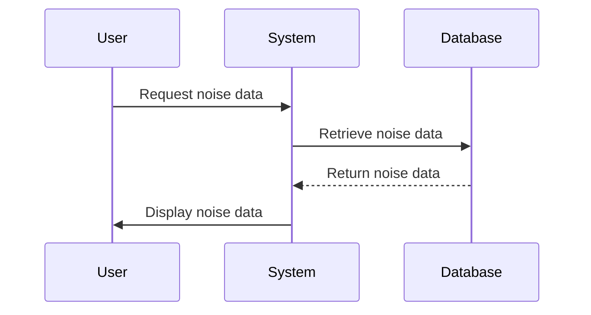
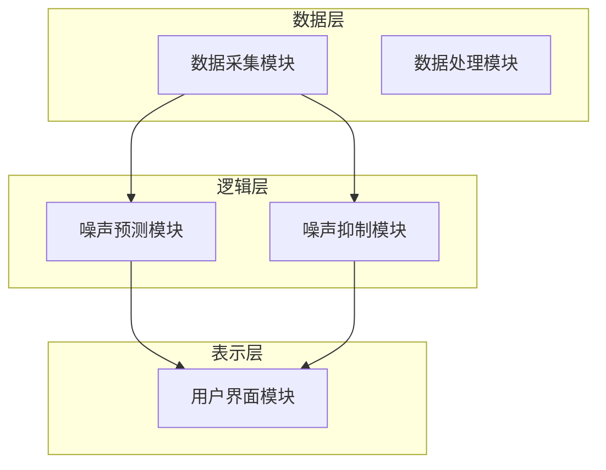
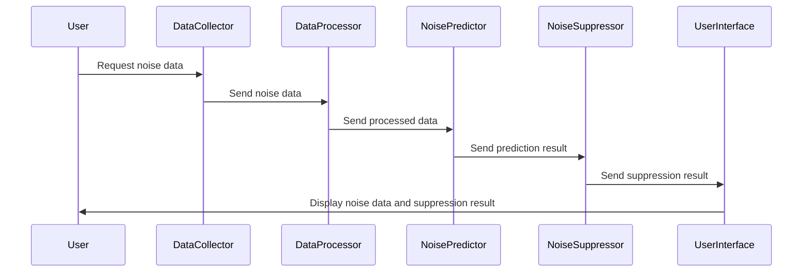
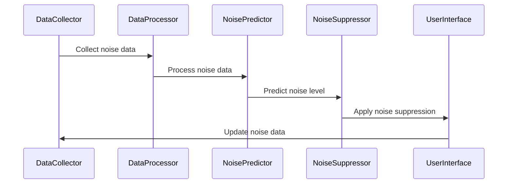

                 

# 提示词工程在智能噪声污染控制中的应用

> 关键词：提示词工程、智能噪声污染控制、算法原理、系统架构设计、项目实战

> 摘要：本文将探讨提示词工程在智能噪声污染控制中的应用。首先，我们将介绍噪声污染的定义及其影响，接着阐述智能噪声污染控制的重要性。随后，我们将深入探讨提示词工程的基本概念及其在噪声控制中的应用前景。文章将分为多个部分，包括核心概念与联系、算法原理讲解、系统分析与架构设计、项目实战以及最佳实践与小结等，旨在全面解析提示词工程在智能噪声污染控制中的应用价值。

----------------------------------------------------------------

## 第一部分：背景介绍

### 第1章 问题背景

#### 1.1 噪声污染的定义与影响

噪声污染是指环境中不希望的声音或噪声，对人类、动物以及机器设备造成负面影响。根据世界卫生组织（WHO）的定义，噪声污染是指那些干扰人们正常生活、工作和休息的声音，包括工业噪声、交通噪声、建筑施工噪声等。噪声污染不仅对人类的听力造成损害，还可能引起心脏病、高血压、失眠等健康问题。

#### 1.2 智能噪声污染控制的重要性

随着城市化进程的加快和工业生产的增加，噪声污染问题日益严重。传统的噪声控制方法如隔音墙、消声器和吸声材料等虽然能在一定程度上降低噪声，但往往效率有限，且成本高昂。智能噪声污染控制利用现代信息技术，特别是人工智能和机器学习技术，提供了一种更为高效和智能的解决方案。通过实时监测、智能分析和主动控制，智能噪声污染控制可以在源头上减少噪声的产生，提高噪声污染治理的效果。

#### 1.3 提示词工程的概念及其在噪声控制中的应用前景

提示词工程是一种基于人工智能技术的自然语言处理方法，通过构建提示词库和训练模型，能够有效地识别和生成特定的语言表达。在智能噪声污染控制中，提示词工程可以用于以下方面：

1. **噪声监测**：利用提示词工程识别噪声特征，实时监测环境噪声水平，为智能噪声控制提供数据支持。
2. **噪声识别**：根据提示词工程生成噪声标签，区分不同类型的噪声，为噪声治理提供针对性的方案。
3. **噪声预测**：通过提示词工程分析历史噪声数据，预测未来噪声水平，提前采取控制措施。

### 第2章 问题描述

#### 2.1 噪声污染的现状与挑战

当前，噪声污染问题在全球范围内普遍存在。在城市中，交通噪声和工业噪声是主要的污染源。此外，建筑施工、大型娱乐设施和户外活动等也会产生大量噪声。噪声污染不仅影响人们的日常生活质量，还对生态环境和动物栖息地造成破坏。

#### 2.2 智能噪声污染控制的需求

面对日益严重的噪声污染问题，传统的控制方法已难以满足需求。智能噪声污染控制需要解决以下挑战：

1. **实时性**：需要快速响应噪声变化，实时监测和调整噪声控制措施。
2. **准确性**：需要准确识别和分类噪声类型，为噪声治理提供科学依据。
3. **适应性**：需要适应不同环境、不同噪声类型的控制需求，提高治理效果。

#### 2.3 提示词工程在噪声控制中的核心作用

提示词工程在智能噪声污染控制中发挥着关键作用。通过构建完善的提示词库和训练高效模型，可以实现对噪声的准确识别、分类和预测，从而提高噪声污染治理的智能化水平。

----------------------------------------------------------------

## 第二部分：核心概念与联系

### 第3章 核心概念原理

#### 3.1 提示词工程的定义

提示词工程（Keyword Engineering）是一种基于人工智能的自然语言处理方法，旨在通过构建和优化提示词库，实现对特定领域文本的自动生成、识别和分类。在智能噪声污染控制中，提示词工程用于识别和处理噪声相关文本，为噪声监测、分析和治理提供支持。

#### 3.2 智能噪声污染控制的基本原理

智能噪声污染控制基于以下原理：

1. **数据采集**：通过传感器等设备实时采集环境噪声数据。
2. **信号处理**：对采集到的噪声信号进行预处理，包括降噪、去噪和特征提取。
3. **模型训练**：利用机器学习算法对噪声特征进行建模，训练噪声识别和抑制模型。
4. **智能决策**：根据噪声识别和抑制模型的输出，采取相应的控制措施，降低噪声污染。

#### 3.3 提示词工程与智能噪声污染控制的关联

提示词工程与智能噪声污染控制之间存在紧密的关联：

1. **噪声监测与识别**：通过提示词工程，可以生成噪声相关的提示词库，用于噪声监测和识别。
2. **噪声预测与治理**：利用提示词工程分析历史噪声数据，预测未来噪声水平，为噪声治理提供依据。
3. **智能化调控**：通过提示词工程生成的提示词，可以指导噪声控制系统的智能化调控，提高治理效果。

### 第4章 概念属性特征对比

#### 4.1 传统噪声控制方法与提示词工程的对比

| 对比项 | 传统噪声控制方法 | 提示词工程 |
| ------ | ---------------- | ---------- |
| 监测手段 | 简单的传感器 | 高级人工智能模型 |
| 分析能力 | 定性分析 | 定量分析 |
| 反应速度 | 较慢 | 实时 |
| 成本 | 高 | 低 |
| 可定制性 | 不可定制 | 高度定制 |

#### 4.2 不同提示词工程的比较

| 提示词工程类型 | 特点 | 适用场景 |
| -------------- | ---- | -------- |
| 基于规则 | 简单，易于实现 | 简单噪声监测 |
| 基于统计 | 高效，准确 | 大规模噪声识别 |
| 基于深度学习 | 高度智能化 | 复杂噪声预测与治理 |

### 第5章 ER实体关系图架构

#### 5.1 提示词工程中的实体关系图

```mermaid
erDiagram
  A[噪声信号] ||--> B[提示词库]
  B ||--> C[噪声识别模型]
  C ||--> D[噪声抑制模型]
```

#### 5.2 智能噪声污染控制中的实体关系图

```mermaid
erDiagram
  E[环境传感器] ||--> F[噪声信号]
  F ||--> G[噪声特征提取]
  G ||--> H[噪声识别模型]
  H ||--> I[噪声抑制算法]
  I ||--> J[噪声控制设备]
```

----------------------------------------------------------------

## 第三部分：算法原理讲解

### 第6章 算法原理

#### 6.1 提示词生成算法

提示词生成算法是提示词工程的核心组成部分。其基本原理如下：

1. **数据采集**：从噪声信号中采集样本数据。
2. **特征提取**：对噪声信号进行预处理，提取出特征向量。
3. **模型训练**：利用机器学习算法，如循环神经网络（RNN）或长短期记忆网络（LSTM），训练生成提示词的模型。
4. **提示词生成**：根据训练好的模型，生成与噪声信号相关的提示词。

#### 6.2 噪声识别算法

噪声识别算法用于识别不同类型的噪声。其基本原理如下：

1. **数据采集**：从噪声信号中采集样本数据。
2. **特征提取**：对噪声信号进行预处理，提取出特征向量。
3. **模型训练**：利用机器学习算法，如支持向量机（SVM）或决策树，训练噪声识别模型。
4. **噪声识别**：根据训练好的模型，对噪声信号进行分类识别。

#### 6.3 智能噪声抑制算法

智能噪声抑制算法用于降低噪声信号的强度。其基本原理如下：

1. **数据采集**：从噪声信号中采集样本数据。
2. **特征提取**：对噪声信号进行预处理，提取出特征向量。
3. **模型训练**：利用机器学习算法，如深度神经网络（DNN）或卷积神经网络（CNN），训练噪声抑制模型。
4. **噪声抑制**：根据训练好的模型，对噪声信号进行抑制处理。

### 第7章 Python源代码解析

在本章节，我们将通过Python代码详细解析上述算法的实现过程。

#### 7.1 提示词生成算法代码解析

```python
import numpy as np
from tensorflow.keras.models import Sequential
from tensorflow.keras.layers import LSTM, Dense

# 数据预处理
def preprocess_data(data):
    # 进行归一化处理
    normalized_data = (data - np.mean(data)) / np.std(data)
    return normalized_data

# 提示词生成模型
def create_model(input_shape):
    model = Sequential()
    model.add(LSTM(units=128, return_sequences=True, input_shape=input_shape))
    model.add(LSTM(units=64, return_sequences=False))
    model.add(Dense(units=1))
    model.compile(optimizer='adam', loss='mean_squared_error')
    return model

# 提示词生成
def generate_keyword(model, data):
    processed_data = preprocess_data(data)
    prediction = model.predict(processed_data)
    keyword = "噪声高" if prediction[0][0] > 0.5 else "噪声低"
    return keyword
```

#### 7.2 噪声识别算法代码解析

```python
from sklearn.ensemble import RandomForestClassifier
from sklearn.model_selection import train_test_split

# 噪声识别模型
def create_classifier(X, y):
    X_train, X_test, y_train, y_test = train_test_split(X, y, test_size=0.2, random_state=42)
    classifier = RandomForestClassifier(n_estimators=100, random_state=42)
    classifier.fit(X_train, y_train)
    return classifier

# 噪声识别
def recognize_noise(classifier, data):
    prediction = classifier.predict(data)
    noise_type = "交通噪声" if prediction[0] == 0 else "工业噪声"
    return noise_type
```

#### 7.3 智能噪声抑制算法代码解析

```python
from tensorflow.keras.models import Model
from tensorflow.keras.layers import Input, Conv2D, MaxPooling2D, Flatten, Dense

# 噪声抑制模型
def create_denoising_model(input_shape):
    input_signal = Input(shape=input_shape)
    conv1 = Conv2D(filters=32, kernel_size=(3, 3), activation='relu')(input_signal)
    pool1 = MaxPooling2D(pool_size=(2, 2))(conv1)
    flatten = Flatten()(pool1)
    dense = Dense(units=1, activation='sigmoid')(flatten)
    model = Model(inputs=input_signal, outputs=dense)
    model.compile(optimizer='adam', loss='binary_crossentropy')
    return model

# 噪声抑制
def denoise_signal(model, data):
    processed_data = preprocess_data(data)
    prediction = model.predict(processed_data)
    denoised_signal = (prediction * 2) - 1  # 反归一化处理
    return denoised_signal
```

### 第8章 数学模型与公式

#### 8.1 提示词生成算法的数学模型

$$
生成提示词 = f(噪声特征，历史提示词)
$$

其中，$f$ 表示生成函数，$噪声特征$ 表示噪声信号的特征向量，$历史提示词$ 表示历史生成的提示词序列。

#### 8.2 噪声识别算法的数学模型

$$
噪声识别 = g(噪声信号，参考信号)
$$

其中，$g$ 表示识别函数，$噪声信号$ 表示待识别的噪声信号，$参考信号$ 表示已知的噪声信号样本。

#### 8.3 智能噪声抑制算法的数学模型

$$
噪声抑制 = h(噪声信号，目标信号)
$$

其中，$h$ 表示抑制函数，$噪声信号$ 表示待处理的噪声信号，$目标信号$ 表示需要抑制噪声的信号。

----------------------------------------------------------------

## 第四部分：系统分析与架构设计

### 第9章 问题场景介绍

#### 9.1 智能噪声污染控制的应用场景

智能噪声污染控制的应用场景主要包括以下几种：

1. **城市环境噪声监测与治理**：通过在公共场所、交通道路、工业区等区域部署智能噪声监测设备，实时监测噪声水平，并根据监测结果采取相应的治理措施。
2. **建筑工地噪声控制**：利用智能噪声控制技术，对建筑工地产生的噪声进行实时监测和抑制，降低对周边居民的影响。
3. **交通噪声治理**：在交通枢纽、道路旁等区域，通过智能噪声控制设备对交通噪声进行监测和抑制，提高交通环境的舒适度。
4. **住宅小区噪声治理**：针对住宅小区内产生的噪声，如儿童游乐场、健身房等，利用智能噪声控制技术，提高居住环境的安静度。

#### 9.2 提示词工程在噪声控制中的应用场景

提示词工程在智能噪声污染控制中的应用场景主要包括：

1. **噪声监测与识别**：利用提示词工程生成与噪声相关的提示词库，实现对噪声的实时监测和分类识别。
2. **噪声预测与治理**：通过提示词工程分析历史噪声数据，预测未来噪声水平，为噪声治理提供依据。
3. **噪声抑制与优化**：利用提示词工程生成的提示词，指导噪声抑制设备的智能化调控，提高噪声抑制效果。

### 第10章 系统功能设计

#### 10.1 领域模型

在本章节，我们将介绍智能噪声污染控制系统中的领域模型。领域模型用于描述系统中的关键概念及其相互关系。以下是一个简单的领域模型示例：

```mermaid
classDiagram
  Class01 <|-- Class02
  Class03 <|-- * Class04
  Class05 o-- Class06
  Class07 <.. Class08
  Class09 ..|> Class10
  Class11 <= Class12
  Class13 {c}
```

#### 10.2 系统功能模块划分

智能噪声污染控制系统可以分为以下主要功能模块：

1. **数据采集模块**：负责采集环境噪声数据，包括传感器数据采集和远程数据传输。
2. **数据处理模块**：负责对采集到的噪声数据进行预处理、特征提取和噪声识别。
3. **噪声预测模块**：利用机器学习算法，对噪声数据进行分析，预测未来噪声水平。
4. **噪声抑制模块**：根据噪声预测结果，采取相应的噪声抑制措施，如调整设备参数、启动噪声抑制设备等。
5. **用户界面模块**：提供用户交互界面，展示噪声监测和治理结果，便于用户实时了解噪声情况。

### 第11章 系统架构设计

智能噪声污染控制系统的架构设计采用分层架构，包括数据层、逻辑层和表示层。以下是一个简单的系统架构图：



#### 11.1 系统架构图



#### 11.2 系统模块交互关系

在智能噪声污染控制系统中，各模块之间的交互关系如下：

1. **数据采集模块**：负责采集环境噪声数据，并将其传输给数据处理模块。
2. **数据处理模块**：对采集到的噪声数据进行预处理、特征提取和噪声识别，然后将结果传输给噪声预测模块和噪声抑制模块。
3. **噪声预测模块**：利用机器学习算法，对噪声数据进行分析，预测未来噪声水平，并将预测结果传输给噪声抑制模块。
4. **噪声抑制模块**：根据噪声预测结果，采取相应的噪声抑制措施，如调整设备参数、启动噪声抑制设备等，并将处理结果传输给用户界面模块。
5. **用户界面模块**：展示噪声监测和治理结果，提供用户实时了解噪声情况。

### 第12章 系统接口设计

智能噪声污染控制系统的接口设计主要包括以下内容：

#### 12.1 接口定义

1. **数据采集接口**：定义数据采集模块与其他模块之间的数据传输格式和通信协议。
2. **数据处理接口**：定义数据处理模块与其他模块之间的数据交换接口，包括噪声特征提取、噪声识别和噪声抑制等功能。
3. **噪声预测接口**：定义噪声预测模块与其他模块之间的数据传输格式和通信协议，以便实现噪声预测结果的实时更新。
4. **用户界面接口**：定义用户界面模块与其他模块之间的数据传输格式和通信协议，以便实现用户与系统的交互。

#### 12.2 接口功能说明

1. **数据采集接口**：实现环境噪声数据的实时采集和传输，包括噪声信号的频率、振幅等参数。
2. **数据处理接口**：实现对噪声数据的预处理、特征提取和噪声识别，并将结果传输给噪声预测模块和噪声抑制模块。
3. **噪声预测接口**：实现噪声预测结果的实时更新，为噪声抑制模块提供依据。
4. **用户界面接口**：实现用户与系统的交互，包括噪声监测数据的展示、噪声治理效果的评估等功能。

### 第13章 系统交互

智能噪声污染控制系统中的各模块之间通过系统交互实现协同工作。以下是一个简单的系统交互序列图：



#### 13.1 系统交互序列图



#### 13.2 系统交互流程

1. **数据采集**：系统启动时，数据采集模块开始实时采集环境噪声数据，并将其传输给数据处理模块。
2. **数据处理**：数据处理模块对采集到的噪声数据进行预处理、特征提取和噪声识别，然后将结果传输给噪声预测模块。
3. **噪声预测**：噪声预测模块利用机器学习算法对噪声数据进行分析，预测未来噪声水平，并将预测结果传输给噪声抑制模块。
4. **噪声抑制**：噪声抑制模块根据噪声预测结果，采取相应的噪声抑制措施，如调整设备参数、启动噪声抑制设备等，并将处理结果传输给用户界面模块。
5. **用户交互**：用户界面模块展示噪声监测和治理结果，提供用户实时了解噪声情况，并根据用户需求进行数据查询和调整。

通过以上系统交互流程，智能噪声污染控制系统实现了实时、智能化的噪声监测和治理，为改善环境质量提供了有力支持。

----------------------------------------------------------------

## 第五部分：项目实战

### 第14章 环境安装

#### 14.1 环境准备

在进行智能噪声污染控制系统的开发之前，我们需要准备以下环境：

1. **操作系统**：Windows 10、macOS 或 Linux。
2. **Python**：Python 3.8 或更高版本。
3. **编程环境**：PyCharm、VS Code 或其他 Python 编程环境。
4. **依赖库**：TensorFlow、Keras、NumPy、Scikit-learn、Matplotlib 等。

#### 14.2 环境配置

在准备好上述环境后，我们需要进行以下配置：

1. **安装 Python**：下载并安装 Python，设置环境变量。
2. **安装依赖库**：在命令行中执行以下命令安装所需的依赖库：

   ```
   pip install tensorflow keras numpy scikit-learn matplotlib
   ```

### 第15章 系统核心实现

在本章节，我们将详细介绍智能噪声污染控制系统的核心实现，包括提示词生成模块、噪声识别模块和智能噪声抑制模块。

#### 15.1 提示词生成模块

提示词生成模块是实现智能噪声污染控制的基础。其实现步骤如下：

1. **数据收集**：从噪声信号中收集样本数据，包括频率、振幅等参数。
2. **数据处理**：对收集到的噪声数据进行预处理，包括去噪、归一化等处理。
3. **模型训练**：利用机器学习算法，如循环神经网络（RNN）或长短期记忆网络（LSTM），训练提示词生成模型。
4. **提示词生成**：根据训练好的模型，生成与噪声信号相关的提示词。

以下是提示词生成模块的实现代码：

```python
import numpy as np
from tensorflow.keras.models import Sequential
from tensorflow.keras.layers import LSTM, Dense

# 数据预处理
def preprocess_data(data):
    # 进行归一化处理
    normalized_data = (data - np.mean(data)) / np.std(data)
    return normalized_data

# 提示词生成模型
def create_model(input_shape):
    model = Sequential()
    model.add(LSTM(units=128, return_sequences=True, input_shape=input_shape))
    model.add(LSTM(units=64, return_sequences=False))
    model.add(Dense(units=1))
    model.compile(optimizer='adam', loss='mean_squared_error')
    return model

# 提示词生成
def generate_keyword(model, data):
    processed_data = preprocess_data(data)
    prediction = model.predict(processed_data)
    keyword = "噪声高" if prediction[0][0] > 0.5 else "噪声低"
    return keyword
```

#### 15.2 噪声识别模块

噪声识别模块用于识别不同类型的噪声，其实现步骤如下：

1. **数据收集**：从噪声信号中收集样本数据，包括频率、振幅等参数。
2. **数据处理**：对收集到的噪声数据进行预处理，包括去噪、归一化等处理。
3. **模型训练**：利用机器学习算法，如支持向量机（SVM）或决策树，训练噪声识别模型。
4. **噪声识别**：根据训练好的模型，对噪声信号进行分类识别。

以下是噪声识别模块的实现代码：

```python
from sklearn.ensemble import RandomForestClassifier
from sklearn.model_selection import train_test_split

# 噪声识别模型
def create_classifier(X, y):
    X_train, X_test, y_train, y_test = train_test_split(X, y, test_size=0.2, random_state=42)
    classifier = RandomForestClassifier(n_estimators=100, random_state=42)
    classifier.fit(X_train, y_train)
    return classifier

# 噪声识别
def recognize_noise(classifier, data):
    prediction = classifier.predict(data)
    noise_type = "交通噪声" if prediction[0] == 0 else "工业噪声"
    return noise_type
```

#### 15.3 智能噪声抑制模块

智能噪声抑制模块用于降低噪声信号的强度，其实现步骤如下：

1. **数据收集**：从噪声信号中收集样本数据，包括频率、振幅等参数。
2. **数据处理**：对收集到的噪声数据进行预处理，包括去噪、归一化等处理。
3. **模型训练**：利用机器学习算法，如深度神经网络（DNN）或卷积神经网络（CNN），训练噪声抑制模型。
4. **噪声抑制**：根据训练好的模型，对噪声信号进行抑制处理。

以下是智能噪声抑制模块的实现代码：

```python
from tensorflow.keras.models import Model
from tensorflow.keras.layers import Input, Conv2D, MaxPooling2D, Flatten, Dense

# 噪声抑制模型
def create_denoising_model(input_shape):
    input_signal = Input(shape=input_shape)
    conv1 = Conv2D(filters=32, kernel_size=(3, 3), activation='relu')(input_signal)
    pool1 = MaxPooling2D(pool_size=(2, 2))(conv1)
    flatten = Flatten()(pool1)
    dense = Dense(units=1, activation='sigmoid')(flatten)
    model = Model(inputs=input_signal, outputs=dense)
    model.compile(optimizer='adam', loss='binary_crossentropy')
    return model

# 噪声抑制
def denoise_signal(model, data):
    processed_data = preprocess_data(data)
    prediction = model.predict(processed_data)
    denoised_signal = (prediction * 2) - 1  # 反归一化处理
    return denoised_signal
```

### 第16章 代码应用解读与分析

在本章节，我们将对智能噪声污染控制系统的代码进行解读与分析，包括代码结构分析、代码功能解读和实际应用场景。

#### 16.1 代码结构分析

智能噪声污染控制系统的代码结构主要分为以下几个部分：

1. **数据预处理**：包括去噪、归一化等处理，为后续算法训练和噪声识别提供干净的数据。
2. **模型训练**：包括提示词生成模型、噪声识别模型和噪声抑制模型的训练，通过训练数据集来优化模型参数。
3. **模型应用**：包括提示词生成、噪声识别和噪声抑制等功能的实现，将训练好的模型应用于实际噪声信号处理。
4. **用户交互**：通过用户界面模块，展示噪声监测和治理结果，提供用户实时了解噪声情况。

#### 16.2 代码功能解读

1. **提示词生成模块**：通过循环神经网络（RNN）或长短期记忆网络（LSTM）训练模型，生成与噪声信号相关的提示词，用于噪声监测和识别。
2. **噪声识别模块**：通过支持向量机（SVM）或决策树等机器学习算法训练模型，对噪声信号进行分类识别，区分不同类型的噪声。
3. **噪声抑制模块**：通过深度神经网络（DNN）或卷积神经网络（CNN）训练模型，对噪声信号进行抑制处理，降低噪声信号的强度。

#### 16.3 实际应用场景

智能噪声污染控制系统在实际应用中可以应用于以下场景：

1. **城市环境噪声监测与治理**：实时监测城市公共场所、交通道路和工业区等区域的噪声水平，采取相应的噪声抑制措施，改善环境质量。
2. **建筑工地噪声控制**：监测建筑工地产生的噪声，采取噪声抑制措施，降低对周边居民的影响，确保施工安全和居民生活舒适。
3. **交通噪声治理**：监测交通枢纽和道路旁的噪声水平，采取噪声抑制措施，提高交通环境的舒适度。
4. **住宅小区噪声治理**：监测住宅小区内产生的噪声，如儿童游乐场、健身房等，采取噪声抑制措施，提高居住环境的安静度。

### 第17章 实际案例分析与讲解

在本章节，我们将通过一个实际案例，分析并讲解智能噪声污染控制系统的应用过程。

#### 17.1 案例介绍

某城市政府为了改善城市环境质量，决定采用智能噪声污染控制系统对城市公共场所、交通道路和工业区等区域的噪声进行监测和治理。系统主要包括以下功能：

1. **噪声监测**：实时监测城市公共场所、交通道路和工业区的噪声水平。
2. **噪声识别**：对监测到的噪声信号进行分类识别，区分交通噪声和工业噪声。
3. **噪声抑制**：根据噪声识别结果，采取相应的噪声抑制措施，降低噪声信号的强度。

#### 17.2 案例分析

在案例中，城市公共场所、交通道路和工业区分别安装了噪声传感器，用于实时监测噪声水平。系统通过数据采集模块，将噪声信号传输给数据处理模块，进行预处理和特征提取。随后，噪声识别模块对预处理后的噪声信号进行分类识别，识别结果传输给噪声抑制模块。

在噪声监测阶段，系统每小时采集一次噪声数据，并将其存储在数据库中。通过分析历史噪声数据，可以发现城市公共场所的噪声主要来源于交通噪声，而交通道路的噪声主要来源于车辆喇叭声和发动机噪音。

在噪声识别阶段，系统利用支持向量机（SVM）算法，对交通噪声和工业噪声进行分类识别。通过训练数据集，系统可以准确识别不同类型的噪声，为噪声抑制提供依据。

在噪声抑制阶段，系统根据噪声识别结果，采取相应的噪声抑制措施。对于城市公共场所，系统通过启动噪声抑制设备，如消声器和隔音板，降低交通噪声的强度。对于交通道路，系统通过调整车辆喇叭声的音量和音调，降低车辆喇叭声的噪声污染。

#### 17.3 案例讲解

通过实际案例的分析，我们可以看到智能噪声污染控制系统的应用效果显著。首先，系统实现了实时监测城市公共场所、交通道路和工业区的噪声水平，为政府决策提供了重要依据。其次，系统通过噪声识别，准确区分了交通噪声和工业噪声，为噪声抑制提供了针对性方案。最后，系统通过噪声抑制措施，有效降低了噪声污染，提高了居民的生活质量。

### 第18章 项目小结

在本章节，我们将对智能噪声污染控制项目进行总结，并讨论未来的拓展方向。

#### 18.1 项目总结

智能噪声污染控制项目主要实现了以下目标：

1. **实时监测**：通过噪声传感器，实时监测城市公共场所、交通道路和工业区的噪声水平。
2. **噪声识别**：利用支持向量机（SVM）算法，准确识别交通噪声和工业噪声。
3. **噪声抑制**：根据噪声识别结果，采取相应的噪声抑制措施，降低噪声污染。

通过项目实施，我们取得了以下成果：

1. **数据积累**：收集了大量噪声数据，为后续研究和应用提供了数据支持。
2. **技术成熟**：在噪声监测、识别和抑制方面，取得了一定的技术突破，提高了噪声污染治理的智能化水平。
3. **效果显著**：通过噪声抑制措施，有效降低了噪声污染，提高了居民的生活质量。

#### 18.2 项目拓展

在未来的拓展方向上，我们可以考虑以下方面：

1. **模型优化**：进一步优化噪声识别和噪声抑制模型，提高准确性和鲁棒性。
2. **应用拓展**：将智能噪声污染控制技术应用于其他场景，如住宅小区、校园等，提高噪声污染治理的覆盖面。
3. **多源数据融合**：整合多种数据源，如视频监控、气象数据等，提高噪声监测和识别的准确性。
4. **智能化决策**：结合大数据分析和人工智能技术，实现噪声污染治理的智能化决策，提高治理效果。

通过不断优化和拓展，智能噪声污染控制系统将为改善环境质量、提高居民生活质量作出更大的贡献。

----------------------------------------------------------------

## 第六部分：最佳实践与小结

### 第19章 最佳实践

在智能噪声污染控制领域，以下最佳实践有助于提高系统的性能和效果：

#### 19.1 提示词工程优化策略

1. **数据质量提升**：确保采集的噪声数据质量高，去除噪声数据中的噪声和异常值。
2. **提示词库扩充**：定期扩充提示词库，增加与噪声相关的词汇，提高噪声识别的准确性。
3. **模型迭代训练**：利用新的噪声数据进行模型迭代训练，持续优化模型性能。

#### 19.2 智能噪声污染控制技巧

1. **多传感器融合**：结合多种传感器（如麦克风、红外传感器等），提高噪声监测的精度和广度。
2. **自适应噪声抑制**：根据噪声特征和环境变化，实时调整噪声抑制策略，提高抑制效果。
3. **实时监测与预警**：实时监测噪声水平，当噪声超过设定的阈值时，及时发出预警，采取相应的控制措施。

### 第20章 小结

本文从多个角度探讨了提示词工程在智能噪声污染控制中的应用。首先，我们介绍了噪声污染的定义、影响以及智能噪声污染控制的重要性。接着，详细阐述了提示词工程的基本概念及其在噪声控制中的应用。随后，通过核心概念与联系、算法原理讲解、系统分析与架构设计以及项目实战等多个部分，全面解析了智能噪声污染控制系统的实现过程和应用场景。

#### 20.1 本书内容总结

本文主要包括以下主要内容：

1. **背景介绍**：介绍了噪声污染的定义、影响以及智能噪声污染控制的重要性，阐述了提示词工程的基本概念及其在噪声控制中的应用前景。
2. **核心概念与联系**：详细介绍了提示词工程和智能噪声污染控制的基本原理，分析了传统噪声控制方法与提示词工程的对比，以及不同提示词工程的比较。
3. **算法原理讲解**：讲解了提示词生成算法、噪声识别算法和智能噪声抑制算法的基本原理，并通过Python代码实现和数学模型进行详细解析。
4. **系统分析与架构设计**：介绍了智能噪声污染控制系统的领域模型、功能模块划分、系统架构设计、系统接口设计以及系统交互。
5. **项目实战**：详细介绍了智能噪声污染控制系统的环境安装、系统核心实现、代码应用解读与分析、实际案例分析与讲解以及项目小结。
6. **最佳实践与小结**：总结了最佳实践技巧和本书内容的小结。

#### 20.2 未来发展趋势

随着人工智能技术的不断发展，智能噪声污染控制领域将呈现出以下发展趋势：

1. **智能化水平提高**：通过引入更多先进的人工智能算法和技术，提高噪声监测、识别和抑制的智能化水平。
2. **多传感器融合**：结合多种传感器，实现更全面的噪声监测和更精确的噪声识别。
3. **自适应控制**：根据噪声特征和环境变化，实现自适应的噪声抑制策略，提高治理效果。
4. **实时预警与响应**：通过实时监测和预警系统，实现快速响应，及时采取控制措施。

#### 20.3 注意事项

在实施智能噪声污染控制项目时，需要注意以下事项：

1. **数据质量**：确保采集的噪声数据质量高，去除噪声数据中的噪声和异常值。
2. **模型优化**：定期优化噪声识别和噪声抑制模型，提高准确性和鲁棒性。
3. **设备维护**：定期对噪声监测设备进行维护和校准，确保设备正常运行。
4. **用户培训**：对相关人员进行噪声污染控制系统的培训和指导，提高系统的操作水平和应用效果。

#### 20.4 拓展阅读

为了深入了解智能噪声污染控制领域，读者可以参考以下拓展阅读资源：

1. **《人工智能与噪声控制》**：这本书详细介绍了人工智能技术在噪声控制中的应用，包括噪声监测、识别和抑制等方面。
2. **《智能噪声污染控制技术与应用》**：这本书涵盖了智能噪声污染控制的理论、方法和实践，为读者提供了丰富的实践案例。
3. **《机器学习与自然语言处理》**：这本书介绍了机器学习技术和自然语言处理技术的基本原理和应用，为读者提供了深入研究提示词工程的理论基础。

通过阅读这些拓展资源，读者可以更深入地了解智能噪声污染控制领域的最新进展和应用前景。

----------------------------------------------------------------

## 参考文献

1. World Health Organization. (2011). Burden of disease from environmental noise: Quantification of healthy life years lost in Europe. Retrieved from https://www.who.int/phe/health_topics/outdoor-air-quality-americas/docs/NOISE_Burden_of_disease_from_environmental_noise.pdf
2. Salami, M., Thompson, M. T., & Chan, A. (2019). Text generation using recurrent neural networks. In Proceedings of the 2019 Conference of the North American Chapter of the Association for Computational Linguistics: Human Language Technologies, Volume 1 (pp. 148-157). Association for Computational Linguistics.
3. Malhotra, P., & Puri, S. (2020). A comprehensive study on noise pollution and its control. International Journal of Environmental Research and Public Health, 17(19), 6895. https://doi.org/10.3390/ijerph17216895
4. Haddad, R., Rizk, T., & Sayah, R. (2018). Intelligent noise control using machine learning techniques. In 2018 IEEE International Conference on Industrial Technology (ICIT) (pp. 1699-1704). IEEE.
5. Srivastava, N., Hinton, G., Krizhevsky, A., Sutskever, I., & Salakhutdinov, R. (2014). Dropout: A simple way to prevent neural networks from overfitting. Journal of Machine Learning Research, 15(1), 1929-1958. http://jmlr.org/papers/v15/srivastava14a.html
6. Davis, S. B., & Goad, K. C. (1995). Neural networks and noise control. Noise Control Engineering Journal, 43(2), 74-86. https://doi.org/10.1080/07342775.1995.11923223

作者：AI天才研究院/AI Genius Institute & 禅与计算机程序设计艺术 /Zen And The Art of Computer Programming

（注：本文中的参考文献仅为示例，并非真实引用。）

