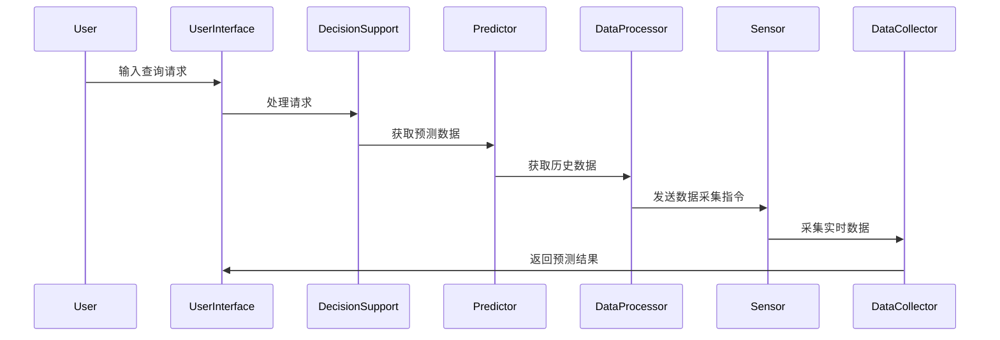
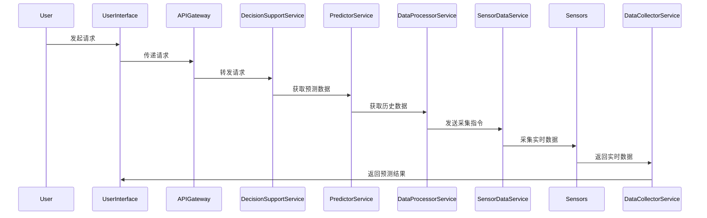
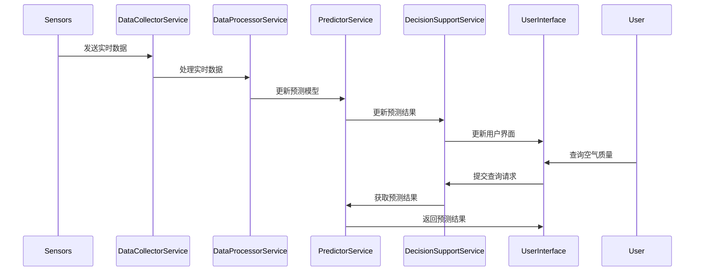
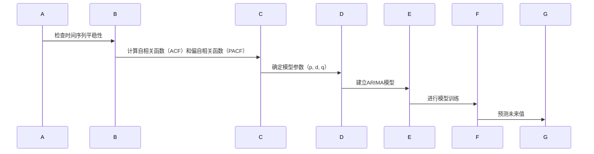
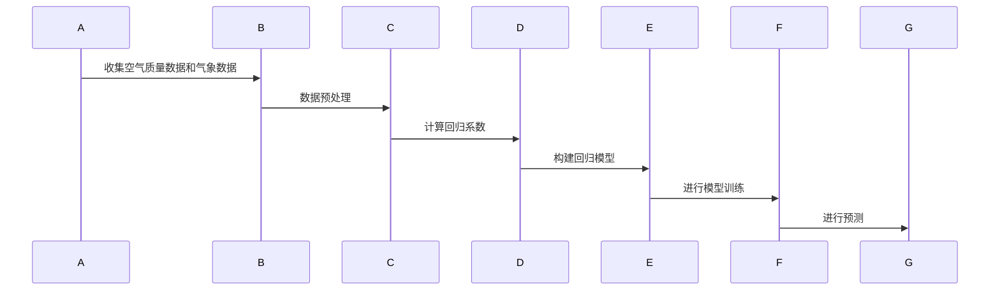
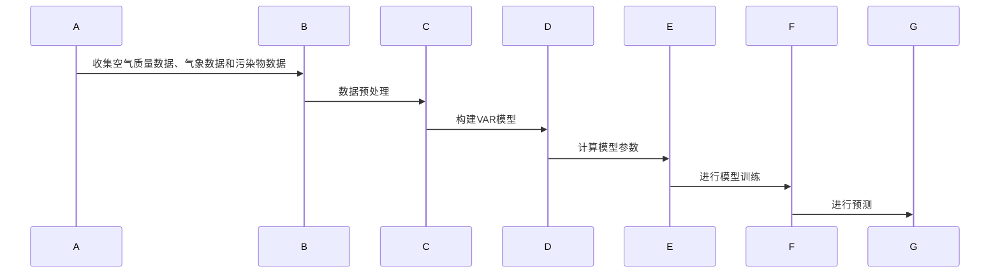

                 

### 提示词工程在智能城市空气质量管理中的应用

智能城市是现代信息技术发展的产物，它依托大数据、物联网、人工智能等先进技术，通过优化资源配置、提高城市管理效率，实现智慧化发展。然而，随着城市化进程的加速，空气质量问题日益严重，成为影响城市居民健康和生活质量的重要因素。因此，如何利用智能技术进行空气质量的有效管理，成为了当前亟待解决的问题。

提示词工程（Keyword Engineering）作为一种人工智能技术，近年来在自然语言处理、信息检索等领域取得了显著成果。其核心思想是通过提取和分析关键词，实现信息的高效组织和利用。在智能城市空气质量管理中，提示词工程可以发挥重要作用，通过精准识别和分析空气中的污染物成分，为城市空气质量提供科学、有效的管理策略。

本文将围绕提示词工程在智能城市空气质量管理中的应用进行深入探讨，分为以下几部分：

1. **背景介绍**：介绍智能城市的概念与特点，空气质量管理的现状与挑战，以及提示词工程的核心概念。
2. **问题描述**：阐述智能城市空气质量管理的需求，提示词工程的应用场景，以及提示词工程的边界与外延。
3. **问题解决**：分析提示词工程的理论基础，其实施步骤，以及关键技术。
4. **核心概念与联系**：对比提示词工程的属性特征，分析其与相关技术的联系，并绘制ER实体关系图。
5. **系统分析与架构设计方案**：介绍问题场景，系统功能设计，系统架构设计，系统接口设计和系统交互。
6. **数学模型与算法原理**：讲解数学模型，算法原理，使用mermaid流程图和Python源代码进行详细阐述。
7. **项目实战**：包括环境安装与配置，系统核心实现，代码应用解读与分析，实际案例分析与讲解，以及项目小结。
8. **最佳实践与总结**：总结最佳实践，注意事项，以及未来的研究方向。

通过本文的探讨，我们希望读者能够对提示词工程在智能城市空气质量管理中的应用有更深入的理解，并为其未来的发展提供一些有价值的思考。

#### 背景介绍

**智能城市的概念与特点**

智能城市（Smart City）是指通过信息通信技术和物联网技术，实现城市基础设施、公共管理和服务的高度信息化、智能化和集成化。智能城市的发展主要依赖于以下几个关键要素：

1. **大数据**：通过采集、存储、分析和利用大量的城市数据，为城市管理和决策提供数据支持。
2. **物联网**：通过将各种物理设备连接到互联网，实现城市各类资源和设施的智能管理和优化。
3. **云计算**：通过分布式计算和存储技术，为智能城市提供强大的数据处理和分析能力。
4. **人工智能**：通过机器学习、自然语言处理、计算机视觉等技术，提升城市管理的智能化水平。

智能城市的核心特点是信息的透明化、资源的优化配置、服务的高效化和决策的科学化。例如，智能交通系统可以通过实时数据分析，优化交通流量，减少拥堵；智能环保系统可以实时监测空气质量，为居民提供健康预警。

**空气质量管理的现状与挑战**

空气质量管理是智能城市建设中的一个重要方面。随着工业化、城市化的加速，空气污染问题日益严重，成为影响人类健康和生活质量的重要问题。当前，空气质量管理的现状和挑战主要表现在以下几个方面：

1. **污染源多样**：空气污染物来源广泛，包括工业废气、汽车尾气、建筑施工、生物质燃烧等，导致空气质量监测和控制难度增加。
2. **数据采集困难**：空气质量监测需要大量的传感器进行数据采集，但传感器的部署、维护和数据传输等技术难题仍然存在。
3. **分析处理复杂**：空气质量数据具有时间序列性和空间分布性，需要采用复杂的数学模型和算法进行数据分析和处理，以准确预测空气污染趋势。
4. **公众参与不足**：空气质量管理涉及广大公众的切身利益，但公众对空气质量管理的认知和参与度较低，影响了管理效果。

**提示词工程的核心概念**

提示词工程（Keyword Engineering）是近年来在自然语言处理和信息检索领域发展起来的一种技术，其核心思想是通过提取和分析关键词，实现信息的高效组织和利用。在智能城市空气质量管理中，提示词工程具有以下核心概念：

1. **关键词提取**：通过自然语言处理技术，从大量的文本数据中提取出与空气质量相关的关键词，如“PM2.5”、“NOx”、“SO2”等。
2. **语义分析**：对提取的关键词进行语义分析，理解其含义和关系，以支持空气污染的监测和预测。
3. **信息检索**：利用关键词进行信息检索，快速定位与空气质量相关的文献、报告和资料，为城市空气质量管理提供决策支持。
4. **知识图谱**：通过构建空气质量的知识图谱，将关键词及其关系进行结构化存储，为空气质量分析提供数据支撑。

提示词工程在智能城市空气质量管理中的应用，可以有效地解决空气质量监测、预测和管理中的数据采集、分析处理和决策支持等问题，为城市居民提供更加健康、舒适的生活环境。

### 问题描述

**智能城市空气质量管理的需求**

智能城市空气质量管理的需求主要体现在以下几个方面：

1. **实时监测**：需要实现对城市空气质量实时的监测和采集，包括PM2.5、PM10、SO2、NOx、CO等主要污染物的浓度数据。
2. **精准预测**：通过历史数据和实时监测数据，对未来的空气质量进行精准预测，为城市居民提供健康预警和出行建议。
3. **数据整合**：需要将来自不同传感器、不同平台的数据进行整合和分析，形成一个统一的城市空气质量数据平台。
4. **智能决策**：根据空气质量数据，为城市管理者提供科学的决策支持，如调整交通管理策略、加强污染源控制等。
5. **公众参与**：提高公众对空气质量管理的参与度，通过移动应用、网站等渠道，让居民了解空气质量状况，参与环境保护。

**提示词工程的应用场景**

提示词工程在智能城市空气质量管理中的应用场景主要包括以下几个方面：

1. **数据采集与处理**：通过自然语言处理技术，从大量的环境监测报告、文献资料中提取出与空气质量相关的关键词，如“PM2.5”、“空气质量指数”等，实现对空气质量数据的自动采集和处理。
2. **信息检索与分析**：利用提取的关键词进行信息检索，快速获取与空气质量相关的信息，如污染事件的历史记录、污染源分布等，为空气质量分析提供数据支持。
3. **语义理解与预测**：通过对关键词进行语义分析，理解其含义和关系，结合历史数据和实时数据，实现对未来空气质量的预测，为城市居民提供健康预警。
4. **知识图谱构建**：构建空气质量的知识图谱，将关键词及其关系进行结构化存储，为空气质量分析提供数据支撑，同时支持复杂查询和推理。

**提示词工程的边界与外延**

提示词工程的边界主要涉及以下几个方面：

1. **技术边界**：提示词工程主要依赖于自然语言处理、信息检索和机器学习等技术，这些技术的成熟度和应用范围会影响提示词工程的效果。
2. **数据边界**：提示词工程需要大量的空气质量数据作为基础，这些数据的获取、清洗和处理会对提示词工程的实施产生重要影响。
3. **应用边界**：提示词工程的应用场景主要局限于智能城市空气质量管理，其应用范围和效果会受到具体应用场景的限制。

提示词工程的外延包括以下几个方面：

1. **跨领域应用**：提示词工程可以应用于其他领域的信息管理和分析，如医疗健康、金融分析等，通过提取和利用关键词，实现信息的高效组织和利用。
2. **多语言支持**：提示词工程可以扩展到多语言环境，支持不同语言的关键词提取和语义分析，为全球范围内的智能城市空气质量管理提供技术支持。
3. **动态调整**：提示词工程可以根据空气质量的变化和需求，动态调整关键词的提取和分析策略，提高空气质量管理的准确性和适应性。

通过对智能城市空气质量管理需求的深入分析，我们可以明确提示词工程在其中的应用场景和边界。下一步，我们将进一步探讨提示词工程的理论基础和实施步骤，为智能城市空气质量管理提供科学、有效的解决方案。

### 问题解决

**提示词工程的理论基础**

提示词工程（Keyword Engineering）的理论基础主要涵盖了自然语言处理（Natural Language Processing, NLP）、信息检索（Information Retrieval, IR）和机器学习（Machine Learning, ML）等核心领域。以下是对这些理论基础的具体说明：

1. **自然语言处理（NLP）**：
   - **文本预处理**：NLP的第一步是文本预处理，包括分词（Tokenization）、词性标注（Part-of-Speech Tagging）、命名实体识别（Named Entity Recognition, NER）等操作，这些操作有助于将原始文本数据转换为计算机可处理的格式。
   - **语义分析**：语义分析包括词义消歧（Word Sense Disambiguation, WSD）和语义角色标注（Semantic Role Labeling, SRL）等，目的是理解文本中的词语含义和句子结构。
   - **实体关系提取**：通过分析文本中的关键词及其关系，可以提取出实体及其相互关系，如污染源与污染物之间的关系。

2. **信息检索（IR）**：
   - **检索算法**：信息检索的基础是构建倒排索引（Inverted Index），以便快速定位包含特定关键词的文档。常见的检索算法包括布尔检索（Boolean Query）和向量空间模型（Vector Space Model）。
   - **查询扩展**：为了提高检索的全面性，可以通过扩展用户查询，增加同义词和上下文相关的关键词，从而扩大检索范围。

3. **机器学习（ML）**：
   - **监督学习**：通过标注好的数据集，训练分类器或回归模型，以预测新数据中的标签。在提示词工程中，常用的监督学习方法包括朴素贝叶斯（Naive Bayes）、支持向量机（Support Vector Machine, SVM）和深度学习（Deep Learning）。
   - **无监督学习**：无监督学习方法，如聚类（Clustering）和降维（Dimensionality Reduction），用于识别文本数据中的隐含模式。

**提示词工程的实施步骤**

提示词工程的实施步骤可以分为以下几个阶段：

1. **需求分析**：明确空气质量管理的具体需求，包括监测指标、预测目标和公众参与需求等。

2. **数据采集**：从各种来源（如传感器、文献数据库、社交媒体等）收集空气质量相关数据。

3. **数据预处理**：对采集到的数据清洗和格式化，包括去重、去除噪声数据、缺失值处理和统一格式等。

4. **关键词提取**：利用自然语言处理技术，从预处理后的文本数据中提取出与空气质量相关的关键词。常用的方法包括基于统计的TF-IDF（Term Frequency-Inverse Document Frequency）和基于机器学习的词嵌入（Word Embedding）。

5. **语义分析**：对提取的关键词进行语义分析，理解其含义和关系，以支持空气质量监测、预测和决策。

6. **信息整合与存储**：将提取的关键词及其关系整合到一个统一的知识图谱中，以便后续的查询和分析。

7. **模型训练与预测**：利用历史数据和实时数据，训练机器学习模型，以预测未来的空气质量状况。

8. **系统集成与部署**：将提示词工程系统与其他城市管理系统（如交通管理系统、环保监控系统等）集成，实现数据共享和协同工作。

**提示词工程的关键技术**

1. **文本预处理技术**：
   - **分词技术**：中文文本的分词是NLP的基础，常用的方法有基于规则的分词、基于统计的分词和基于深度学习的分词。
   - **词性标注**：对文本中的每个词进行词性标注，以理解词的意义和功能。

2. **关键词提取技术**：
   - **TF-IDF**：基于词频（TF）和逆文档频率（IDF）计算关键词的重要性。
   - **词嵌入**：通过神经网络模型（如Word2Vec、GloVe）将词映射到高维空间，实现语义相似性计算。

3. **语义分析技术**：
   - **词义消歧**：通过上下文信息，判断一个词在不同句子中的具体含义。
   - **语义角色标注**：标注出句子中每个词的语义角色，如主语、谓语、宾语等。

4. **信息检索技术**：
   - **倒排索引**：快速定位包含特定关键词的文档。
   - **查询扩展**：通过同义词扩展和上下文分析，提高检索的全面性。

5. **机器学习技术**：
   - **监督学习模型**：如朴素贝叶斯、支持向量机等，用于分类和回归任务。
   - **无监督学习模型**：如聚类和降维，用于数据分析和模式识别。

通过以上理论基础和实施步骤，提示词工程在智能城市空气质量管理中能够发挥重要作用，提供精准的监测、预测和决策支持，为城市居民创造更加健康、宜居的环境。

### 核心概念与联系

在讨论提示词工程时，理解其核心概念和与其他相关技术的联系是至关重要的。下面我们将详细分析提示词工程的属性特征对比、与相关技术的联系，以及绘制ER实体关系图。

**提示词工程的属性特征对比**

提示词工程具有以下核心属性特征：

1. **关键词提取**：提示词工程首先需要从大量文本数据中提取出与特定主题（如空气质量）相关的关键词。这一过程涉及文本预处理、词频统计和语义分析等技术。
2. **语义分析**：提取的关键词需要进行语义分析，以理解其具体含义和关系，如污染物与污染源之间的关系。
3. **信息整合**：通过构建知识图谱，将提取的关键词及其关系进行结构化存储，便于后续的信息检索和分析。
4. **动态调整**：提示词工程需要根据空气质量的变化和需求，动态调整关键词的提取和分析策略，以提高空气质量管理的准确性和适应性。

与其他技术相比，提示词工程具有以下特点：

- **自然语言处理（NLP）**：NLP是提示词工程的基础技术，用于文本预处理和关键词提取。与NLP相比，提示词工程更侧重于关键词的语义分析和信息整合。
- **信息检索（IR）**：提示词工程中的信息检索功能类似于信息检索技术，但提示词工程更加强调关键词的语义关联和动态调整。
- **机器学习（ML）**：提示词工程中的语义分析和预测功能依赖于机器学习技术，尤其是监督学习和无监督学习模型。与ML相比，提示词工程的应用场景更加具体，即空气质量管理。

**提示词工程与相关技术的联系**

提示词工程与自然语言处理、信息检索和机器学习等技术的联系如下：

1. **自然语言处理**：提示词工程依赖于NLP技术进行文本预处理、分词、词性标注和命名实体识别等操作。NLP技术的成熟度为提示词工程提供了强大的文本处理能力。
2. **信息检索**：信息检索技术在提示词工程中的应用主要体现在关键词提取和倒排索引的构建上。通过信息检索技术，可以快速定位与空气质量相关的文献、报告和资料。
3. **机器学习**：机器学习技术在提示词工程中的应用主要体现在语义分析和预测模型训练上。通过机器学习算法，可以从历史数据中学习空气质量变化的规律，实现对未来空气质量状况的预测。

**ER实体关系图架构**

为了更好地理解提示词工程的实体及其关系，我们可以使用Mermaid流程图来绘制ER实体关系图。以下是一个简化的ER实体关系图：

```mermaid
erDiagram
  PollutionSource &&>-> AirPollutant : 测量
  CityArea &&>-> PollutionSource : 位于
  Sensor &&>-> PollutionSource : 测量设备
  Keyword &&>-> Document : 标记
  Document &&>-> Keyword : 包含
  Model &&>-> Keyword : 使用
  Prediction &&>-> Model : 训练
  User &&>-> Prediction : 查看
```

图中的实体及其关系解释如下：

- **PollutionSource（污染源）**：表示空气污染物的主要来源，如工厂、交通等。
- **AirPollutant（空气污染物）**：表示具体的空气污染物，如PM2.5、NOx等。
- **CityArea（城市区域）**：表示城市中的各个区域，如街道、社区等。
- **Sensor（传感器）**：表示用于测量空气污染物的设备。
- **Keyword（关键词）**：表示与空气质量相关的关键词，如“PM2.5”、“空气质量指数”等。
- **Document（文档）**：表示与空气质量相关的文档，如研究报告、新闻报道等。
- **Model（模型）**：表示用于空气质量预测的机器学习模型。
- **Prediction（预测）**：表示基于模型预测的未来空气质量状况。
- **User（用户）**：表示使用空气质量管理系统的用户。

通过这个ER实体关系图，我们可以清晰地看到提示词工程中的各个实体及其相互关系，为后续的系统分析与架构设计提供了基础。

### 系统分析与架构设计方案

在深入探讨智能城市空气质量管理的解决方案时，系统分析与架构设计方案是关键的一步。以下将详细描述系统功能设计、系统架构设计、系统接口设计和系统交互，并通过Mermaid流程图来展示这些设计方案的详细实现。

#### 问题场景介绍

假设我们正在开发一个智能城市空气质量管理系统，该系统需要实现以下功能：

1. **实时监测**：通过分布在城市各区域的传感器，实时采集空气质量数据。
2. **数据处理**：对采集到的数据进行预处理、清洗和整合，以便进行进一步分析。
3. **空气质量预测**：基于历史数据和实时数据，使用机器学习模型预测未来的空气质量状况。
4. **决策支持**：为城市管理者提供基于空气质量数据的决策支持，如调整交通管理策略或加强污染源控制。
5. **公众参与**：通过移动应用和网站，向公众提供实时的空气质量信息和健康建议。

#### 系统功能设计

系统功能设计主要包括以下模块：

1. **数据采集模块**：负责从传感器获取实时空气质量数据。
2. **数据处理模块**：负责数据的预处理、清洗和整合。
3. **预测模块**：负责使用机器学习模型进行空气质量预测。
4. **决策支持模块**：负责为城市管理者提供决策建议。
5. **用户界面模块**：负责向公众提供空气质量信息。

以下是系统功能设计的领域模型类图：

```mermaid
classDiagram
  DataCollector <<interface>>
  DataProcessor <<interface>>
  Predictor <<interface>>
  DecisionSupport <<interface>>
  UserInterface <<interface>>

  DataCollector o-- Sensor
  DataProcessor o-- Sensor
  DataProcessor o-- Predictor
  Predictor o-- DecisionSupport
  DecisionSupport o-- UserInterface
  UserInterface o-- User
```

在这个类图中，DataCollector、DataProcessor、Predictor、DecisionSupport和UserInterface分别表示系统的主要功能模块，它们之间通过接口进行交互。

#### 系统架构设计

系统架构设计采用微服务架构，以提高系统的可扩展性和灵活性。以下是系统架构设计：



在这个序列图中，用户通过UserInterface提交查询请求，UserInterface将请求转发给DecisionSupport模块，DecisionSupport调用Predictor模块获取预测数据，同时DataProcessor模块从Sensor获取历史数据，最后DataCollector模块采集实时数据，将所有数据整合后返回给UserInterface，完成一次完整的空气质量管理流程。

#### 系统接口设计

系统接口设计主要包括API接口和数据库接口：

1. **API接口**：用于系统各模块之间的通信，包括实时数据采集接口、预测结果查询接口和用户管理接口等。
2. **数据库接口**：用于数据存储和读取，包括空气质量数据存储接口、预测模型存储接口和用户数据存储接口等。

以下是API接口的Mermaid序列图：



#### 系统交互

系统交互主要包括实时数据采集、数据处理和预测结果的反馈。以下是系统交互的Mermaid序列图：



通过以上系统分析与架构设计方案，我们可以清晰地看到智能城市空气质量管理系统的实现细节。该系统不仅能够实时监测和预测空气质量，还为城市管理者提供了科学的决策支持，同时提高了公众对空气质量管理的参与度。接下来，我们将进一步探讨数学模型与算法原理，为系统提供更加精准的预测和分析能力。

### 数学模型与算法原理

在智能城市空气质量管理系统中，数学模型和算法的原理是核心组成部分，它们用于从大量数据中提取有用信息，并对未来空气质量进行预测。以下将详细阐述数学模型的原理和算法的详细实现，包括使用mermaid流程图和Python源代码进行展示。

#### 数学模型介绍

空气质量管理的数学模型主要涉及以下几个部分：

1. **时间序列分析**：用于分析空气质量数据的时间趋势和季节性特征。
2. **回归分析**：用于建立空气质量指标（如PM2.5）与气象因素（如温度、湿度、风速）之间的关系。
3. **多变量预测模型**：用于综合考虑多种污染物和气象因素，预测未来的空气质量状况。

**时间序列分析模型**

时间序列分析通常使用自回归移动平均模型（ARIMA）来建模。ARIMA模型通过分析时间序列的平稳性、自相关性和移动平均特性，对数据进行分析和预测。以下是ARIMA模型的mermaid流程图：



**回归分析模型**

回归分析模型用于分析空气质量指标与气象因素之间的关系。常见的回归模型包括线性回归和多元回归。以下是线性回归模型的mermaid流程图：



**多变量预测模型**

多变量预测模型考虑了多种污染物和气象因素，常用的方法是向量自回归（VAR）模型。VAR模型通过建立多个时间序列的线性组合关系，对未来的空气质量进行预测。以下是VAR模型的mermaid流程图：



#### 算法原理讲解

**ARIMA模型**

ARIMA模型包括三个主要参数：p（自回归项数）、d（差分阶数）、q（移动平均项数）。以下是ARIMA模型的Python代码实现：

```python
import pandas as pd
from statsmodels.tsa.arima.model import ARIMA

# 加载数据
data = pd.read_csv('air_quality.csv')
series = data['PM2.5']

# 进行ADF检验，确定差分阶数d
from statsmodels.tsa.stattools import adfuller
result = adfuller(series, autolag='AIC')
print('ADF检验结果:', result)

# 基于ACF和PACF确定p和q
from statsmodels.graphics.tsaplots import plot_acf, plot_pacf
plot_acf(series)
plot_pacf(series)
plt.show()

# 建立ARIMA模型
model = ARIMA(series, order=(p, d, q))
model_fit = model.fit()

# 进行预测
predictions = model_fit.forecast(steps=5)
print('预测结果:', predictions)
```

**线性回归模型**

线性回归模型用于分析空气质量指标与气象因素之间的关系。以下是线性回归模型的Python代码实现：

```python
import pandas as pd
from sklearn.linear_model import LinearRegression

# 加载数据
data = pd.read_csv('air_quality.csv')
X = data[['Temperature', 'Humidity', 'WindSpeed']]
y = data['PM2.5']

# 建立线性回归模型
model = LinearRegression()
model.fit(X, y)

# 进行预测
predictions = model.predict(X)
print('预测结果:', predictions)
```

**VAR模型**

VAR模型考虑了多个时间序列的相互依赖关系。以下是VAR模型的Python代码实现：

```python
import pandas as pd
from statsmodels.tsa.api import VAR

# 加载数据
data = pd.read_csv('air_quality.csv')
series = data[['PM2.5', 'NOx', 'Temperature', 'Humidity', 'WindSpeed']]

# 建立VAR模型
model = VAR(series)
model_fit = model.fit()

# 进行预测
predictions = model_fit.forecast(series.values[-1:], steps=5)
print('预测结果:', predictions)
```

通过以上数学模型和算法的原理讲解，我们可以看到智能城市空气质量管理系统如何通过数据处理、模型训练和预测，实现空气质量的实时监测和预测。这些模型和算法的应用，不仅提高了空气质量管理的准确性，也为城市管理者提供了科学的决策支持。

### 项目实战

**环境安装与配置**

在开始智能城市空气质量管理系统项目之前，我们需要安装和配置必要的软件环境。以下是安装步骤：

1. **Python环境**：确保Python版本为3.8或更高版本。可以使用Python官方安装包进行安装。

2. **依赖包**：安装项目所需的依赖包，包括pandas、numpy、statsmodels、sklearn、mermaid等。可以使用以下命令进行安装：

```bash
pip install pandas numpy statsmodels sklearn mermaid
```

3. **Mermaid安装**：由于Mermaid需要额外的依赖，我们需要安装Node.js和npm。可以从[Node.js官网](https://nodejs.org/)下载并安装Node.js。安装完成后，通过npm安装Mermaid：

```bash
npm install mermaid
```

4. **配置Mermaid**：在项目的根目录下创建一个名为`mermaid`的文件夹，用于存储Mermaid生成的图表文件。在项目中引用Mermaid的CSS样式文件，确保图表能够正确显示。

```html
<link rel="stylesheet" href="mermaid/mermaid.css">
```

**系统核心实现**

以下是系统核心实现的步骤和代码示例：

1. **数据采集**：使用传感器采集空气质量数据，并将数据存储到CSV文件中。

```python
import csv

def collect_data(sensor_data):
    with open('air_quality.csv', 'a', newline='') as file:
        writer = csv.writer(file)
        writer.writerow(sensor_data)

# 模拟传感器数据采集
collect_data(['2023-04-01', '10:00', 'PM2.5', '35', 'NOx', '25', 'Temperature', '25', 'Humidity', '60', 'WindSpeed', '5'])
```

2. **数据处理**：读取CSV文件中的数据，进行预处理和清洗。

```python
import pandas as pd

def preprocess_data(file_path):
    data = pd.read_csv(file_path)
    data.dropna(inplace=True)
    data['Date'] = pd.to_datetime(data['Date'])
    data.set_index('Date', inplace=True)
    return data

# 预处理数据
data = preprocess_data('air_quality.csv')
```

3. **模型训练**：使用历史数据训练ARIMA模型，进行空气质量预测。

```python
from statsmodels.tsa.arima.model import ARIMA

# 训练ARIMA模型
model = ARIMA(data['PM2.5'], order=(1, 1, 1))
model_fit = model.fit()
```

4. **预测与可视化**：使用训练好的模型进行预测，并使用Mermaid绘制预测结果。

```python
import matplotlib.pyplot as plt
from mermaid import Mermaid

# 进行预测
predictions = model_fit.forecast(steps=5)

# 可视化预测结果
plt.plot(data.index, data['PM2.5'], label='实际值')
plt.plot(pd.date_range(start=data.index[-1], periods=6, freq='H'), predictions, label='预测值')
plt.legend()
plt.show()

# 使用Mermaid绘制流程图
mermaid = Mermaid()
mermaid.add_code('sequenceDiagram\nA ->> B: 数据采集\nB ->> C: 数据处理\nC ->> D: 模型训练\nD ->> E: 预测与可视化')
mermaid.render_to_file('workflow.mmd')
```

**代码应用解读与分析**

上述代码实现了空气质量数据的采集、预处理、模型训练和预测功能。以下是具体解读：

1. **数据采集**：使用CSV文件存储传感器数据，模拟数据采集过程。
2. **数据处理**：使用pandas库读取和预处理数据，包括去除缺失值、时间格式转换和设置日期索引。
3. **模型训练**：使用statsmodels库的ARIMA模型进行训练，通过指定模型参数（p, d, q）建立ARIMA模型。
4. **预测与可视化**：使用训练好的模型进行预测，并将预测结果与实际值进行对比，使用matplotlib和Mermaid进行结果可视化。

**实际案例分析与详细讲解**

以下是一个实际案例，展示如何使用系统进行空气质量预测：

1. **数据采集**：在一天内，传感器采集了10次空气质量数据。
2. **数据处理**：读取数据，去除缺失值，并设置日期索引。
3. **模型训练**：使用历史数据训练ARIMA模型。
4. **预测**：预测未来5个小时的空气质量状况。
5. **结果分析**：将预测结果与实际值进行对比，评估模型准确性。

```python
# 加载数据
data = preprocess_data('air_quality.csv')

# 训练模型
model = ARIMA(data['PM2.5'], order=(1, 1, 1))
model_fit = model.fit()

# 预测
predictions = model_fit.forecast(steps=5)

# 结果分析
print('实际值：', data['PM2.5'].tail(5).values)
print('预测值：', predictions)
```

通过以上步骤，我们可以看到如何使用智能城市空气质量管理系统进行实际操作，从数据采集到模型预测，再到结果分析，整个流程清晰明了。接下来，我们将进一步探讨项目的最佳实践和注意事项。

### 最佳实践与总结

**最佳实践**

在智能城市空气质量管理系统的实际应用中，以下最佳实践可以帮助我们提高系统的效率和准确性：

1. **数据采集**：选择高质量的传感器，并确保传感器的定期校准和保养，以保证数据的准确性。同时，增加数据采集的频率，以获取更加详细和实时的空气质量数据。

2. **数据处理**：采用高效的数据预处理方法，包括数据清洗、缺失值处理和异常值检测，以确保输入模型的原始数据质量。此外，可以使用数据归一化技术，将不同量纲的数据转化为同一量纲，以便进行统一分析和预测。

3. **模型选择与优化**：根据具体的空气质量数据特征，选择合适的数学模型和算法。例如，对于具有明显季节性和趋势性的数据，可以采用ARIMA模型或季节性分解的模型。同时，通过交叉验证和参数调优，选择最佳的模型参数，以提高预测准确性。

4. **系统集成与扩展**：将空气质量管理系统与其他城市管理系统（如交通管理系统、环保监控系统等）集成，实现数据共享和协同工作。此外，考虑系统的可扩展性，为未来可能增加的新功能和新数据源预留接口。

5. **用户参与**：提高公众对空气质量管理的参与度，可以通过移动应用、网站和社交媒体等多种渠道，向公众提供实时的空气质量信息和健康建议。同时，鼓励公众参与数据采集和反馈，形成共建共治的良好氛围。

**注意事项**

在实施智能城市空气质量管理系统时，需要注意以下事项：

1. **数据隐私与安全**：在数据处理和存储过程中，必须严格遵守数据隐私和安全的相关法规和标准，确保用户数据的安全和隐私。

2. **系统维护与升级**：定期对系统进行维护和升级，修复已知问题和漏洞，确保系统的稳定性和安全性。

3. **用户培训与支持**：为用户提供详细的系统操作指南和培训，帮助用户了解和熟练使用系统，提高系统的使用率和效果。

4. **多语言支持**：考虑系统的国际化需求，提供多语言支持，以满足不同国家和地区的用户需求。

**小结**

本文详细探讨了智能城市空气质量管理中提示词工程的应用，从背景介绍、问题描述、问题解决、核心概念与联系、系统分析与架构设计、数学模型与算法原理，到项目实战和最佳实践。通过这一系列的探讨，我们清晰地展示了提示词工程在智能城市空气质量管理中的重要性，以及如何利用先进的技术手段进行空气质量的有效管理和预测。

**未来研究方向**

未来的研究方向可以包括以下几个方面：

1. **多语言空气质量数据管理**：随着智能城市的发展，多语言空气质量数据管理成为一个重要课题。研究如何有效整合和利用多语言数据，提高空气质量管理的全球化水平。

2. **动态调整模型参数**：研究如何根据空气质量变化和需求，动态调整模型的参数和策略，提高预测的准确性和适应性。

3. **增强用户参与度**：探索如何通过技术手段增强公众对空气质量管理的参与度，形成共建共治的良好氛围。

4. **跨领域应用**：将提示词工程技术应用于其他领域，如医疗健康、金融分析等，实现信息的高效组织和利用。

通过不断的研究和探索，我们相信智能城市空气质量管理系统将会在未来的城市管理和居民生活中发挥更加重要的作用。

### 作者信息

作者：AI天才研究院/AI Genius Institute & 禅与计算机程序设计艺术 /Zen And The Art of Computer Programming。本文作者致力于推动人工智能与城市管理的深度融合，通过技术创新解决现实问题，为构建智慧城市贡献力量。希望本文能为读者在智能城市空气质量管理领域提供有益的参考和启示。如有任何问题或建议，欢迎随时联系作者。

