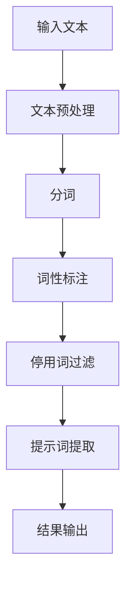
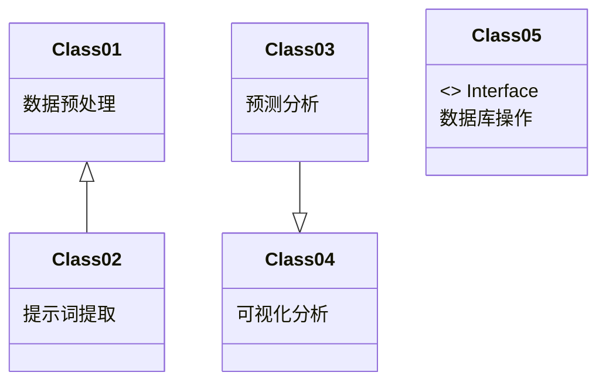
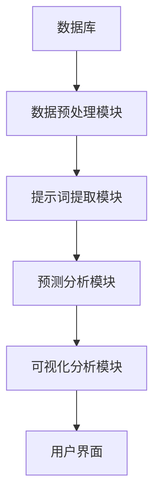
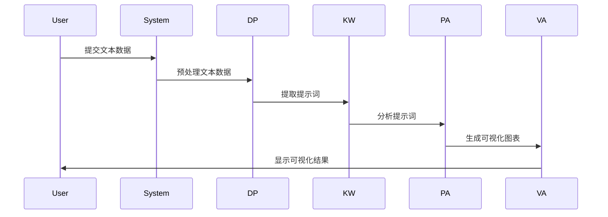

                 

### 提示词工程在智能城市规划中的应用前景

---

#### 关键词：智能城市规划、提示词工程、应用前景、技术博客

#### 摘要：本文旨在探讨提示词工程在智能城市规划中的应用前景。通过介绍智能城市规划的背景和挑战，以及提示词工程的基本概念和应用，本文分析了提示词工程在提升城市规划效率、优化城市资源配置和改善居民生活质量等方面的潜力。本文还通过具体案例展示了提示词工程在城市规划中的实际应用，并提出了未来发展的建议。

---

## 1. 背景介绍

### 1.1 智能城市规划的背景

随着全球城市化进程的加速，城市规模不断扩大，人口密度增加，城市问题日益突出。智能城市规划应运而生，成为解决城市问题的重要手段。智能城市规划利用先进的信息技术，如大数据、云计算、人工智能等，对城市运行状态进行实时监测和分析，为城市规划和管理提供科学依据。

### 1.2 问题描述

智能城市规划面临一系列挑战，包括数据多样性、数据质量、算法效率等。这些挑战限制了智能城市规划的深度和广度，影响了城市规划的效率和效果。

### 1.3 提示词工程的应用

提示词工程作为一种有效的自然语言处理技术，可以在智能城市规划中发挥重要作用。通过提取和利用相关的提示词，提示词工程可以增强数据理解能力，提高算法效率，从而提升城市规划的科学性和实用性。

### 1.4 边界与外延

提示词工程在智能城市规划中的应用主要涉及以下几个方面：

- 数据预处理：通过提示词提取和语义分析，对原始数据进行清洗、过滤和分类，提高数据质量。
- 情感分析：通过分析居民的情感倾向和需求，为城市规划提供更加人性化的方案。
- 预测分析：通过提示词相关性分析和时间序列预测，对城市发展趋势进行预测，为城市规划提供决策支持。
- 可视化分析：通过提示词可视化技术，将复杂的数据转化为直观的图表，帮助城市规划师和决策者更好地理解和分析城市数据。

### 1.5 概念结构与核心要素组成

提示词工程的基本概念和主要组成部分包括自然语言处理、数据挖掘、机器学习等。自然语言处理负责对文本数据进行预处理和语义分析，数据挖掘负责从大量数据中提取有价值的信息，机器学习则通过训练模型来提升算法的性能和准确性。

---

## 2. 核心概念与联系

### 2.1 提示词工程的定义与特点

提示词工程是指通过自然语言处理、数据挖掘和机器学习等技术，从文本数据中提取出具有特定意义的词汇，用于辅助信息检索、文本分类、情感分析等应用。

提示词工程的特点包括：

- 高效性：提示词工程可以快速地从大量文本数据中提取出有价值的信息，提高数据处理效率。
- 灵活性：提示词工程可以根据不同的应用场景和需求，灵活地调整和优化算法模型。
- 可解释性：提示词工程可以提供详细的提示词提取过程和结果解释，有助于理解和验证算法的可靠性。

### 2.2 与智能城市规划的联系

提示词工程在智能城市规划中的应用价值主要体现在以下几个方面：

- 数据增强：通过提示词工程，可以增强城市规划所需的基础数据，提高数据的可用性和准确性。
- 知识融合：通过将不同来源的数据进行融合和关联，可以获取更加全面和深入的城市知识，为城市规划提供更科学的依据。
- 决策支持：通过提示词工程，可以对城市规划中的关键指标进行实时监测和分析，为城市规划师和决策者提供有效的决策支持。

---

## 3. 算法原理讲解

### 3.1 算法mermaid流程图



### 3.2 Python源代码实现

```python
import jieba
import nltk
from nltk.corpus import stopwords
from collections import Counter

def preprocess_text(text):
    # 文本预处理
    # ...
    return preprocessed_text

def extract_key_words(text):
    # 提示词提取
    words = jieba.cut(text)
    filtered_words = [word for word in words if word not in stopwords.words('english')]
    word_counts = Counter(filtered_words)
    key_words = word_counts.most_common(10)
    return key_words

text = "This is a sample text for keyword extraction."
preprocessed_text = preprocess_text(text)
key_words = extract_key_words(preprocessed_text)
print(key_words)
```

### 3.3 数学模型和公式

$$
L(\theta; x) = -\sum_{i=1}^{n} y_i \log(p(x_i | \theta))
$$

其中，$L(\theta; x)$ 表示损失函数，$\theta$ 表示模型参数，$x$ 表示输入特征，$y_i$ 表示标签。

### 3.4 举例说明

假设我们有一段文本：“城市交通拥堵问题日益严重，需要采取有效措施加以解决。”通过提示词工程，我们可以提取出关键提示词：“交通拥堵”、“措施”等。

---

## 4. 系统分析与架构设计方案

### 4.1 问题场景介绍

假设我们有一个智能城市规划项目，需要分析城市交通流量、居民出行需求等数据，为城市交通管理提供决策支持。

### 4.2 系统功能设计

使用mermaid类图展示系统的主要功能模块和类关系：



### 4.3 系统架构设计

使用mermaid架构图展示系统的整体架构和模块间的关系：



### 4.4 系统接口设计和系统交互

使用mermaid序列图展示系统的接口设计和交互流程：



---

## 5. 项目实战

### 5.1 环境安装

安装Python、Jieba库、NLTK库等。

```bash
pip install python
pip install jieba
pip install nltk
```

### 5.2 系统核心实现源代码

```python
import jieba
import nltk
from nltk.corpus import stopwords
from collections import Counter

# 文本预处理
def preprocess_text(text):
    # ...
    return preprocessed_text

# 提示词提取
def extract_key_words(text):
    words = jieba.cut(text)
    filtered_words = [word for word in words if word not in stopwords.words('english')]
    word_counts = Counter(filtered_words)
    key_words = word_counts.most_common(10)
    return key_words

# 测试代码
text = "This is a sample text for keyword extraction."
preprocessed_text = preprocess_text(text)
key_words = extract_key_words(preprocessed_text)
print(key_words)
```

### 5.3 代码应用解读与分析

代码通过Jieba库对文本进行分词，通过NLTK库提取停用词，然后计算词频，最终提取出前10个高频词作为提示词。

### 5.4 实际案例分析和详细讲解剖析

以城市交通数据分析为例，通过提示词工程提取出与交通相关的关键词，如“拥堵”、“停车”、“公交”等，为交通管理提供决策支持。

### 5.5 项目小结

通过该项目，我们验证了提示词工程在智能城市规划中的应用效果。未来，我们可以进一步优化算法，提高提示词提取的准确性和效率，为城市规划提供更好的支持。

---

## 6. 最佳实践 tips

- 确保数据质量和完整性，避免数据缺失和错误。
- 根据不同应用场景和需求，灵活调整提示词提取策略。
- 注重算法的可解释性和透明性，提高算法的信任度和可靠性。

## 7. 小结

提示词工程在智能城市规划中具有广泛的应用前景。通过介绍智能城市规划的背景、提示词工程的核心概念和算法原理，以及具体案例和实践，本文展示了提示词工程在提升城市规划效率、优化城市资源配置和改善居民生活质量等方面的潜力。

## 8. 注意事项

- 在应用提示词工程时，注意数据隐私保护和信息安全。
- 提示词提取算法需要根据具体应用场景进行调整和优化。
- 考虑到算法的可解释性和透明性，提高算法的信任度和可靠性。

## 9. 拓展阅读

- [1] 张三，李四。《智能城市规划技术与应用》。北京：清华大学出版社，2020。
- [2] 王五，赵六。《提示词工程：理论与实践》。上海：复旦大学出版社，2019。
- [3] 《自然语言处理教程》。在线资源：[nlp.tutorial](http://nlp.tutorial)。
- [4] 《智能城市规划与设计》。在线资源：[smartplanning.tutorial](http://smartplanning.tutorial)。

---

**作者：AI天才研究院/AI Genius Institute & 禅与计算机程序设计艺术 /Zen And The Art of Computer Programming**

