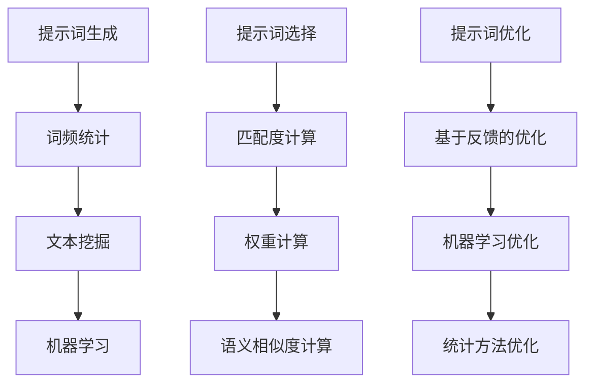
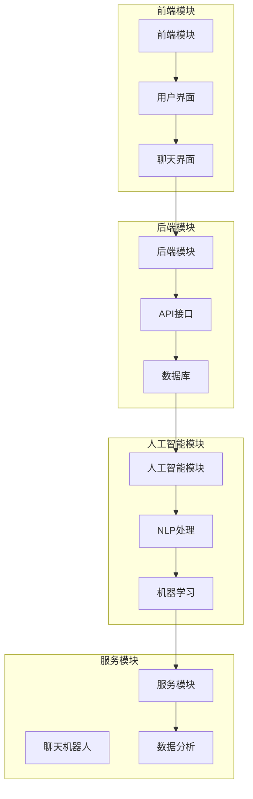
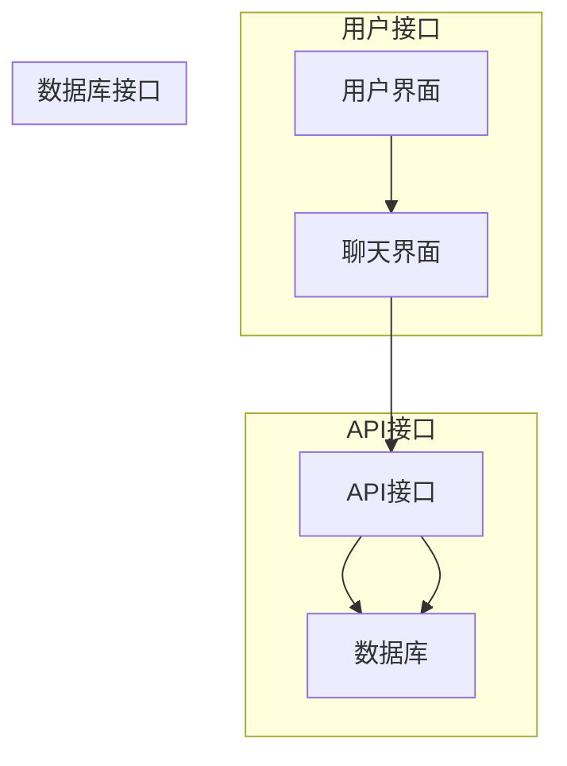
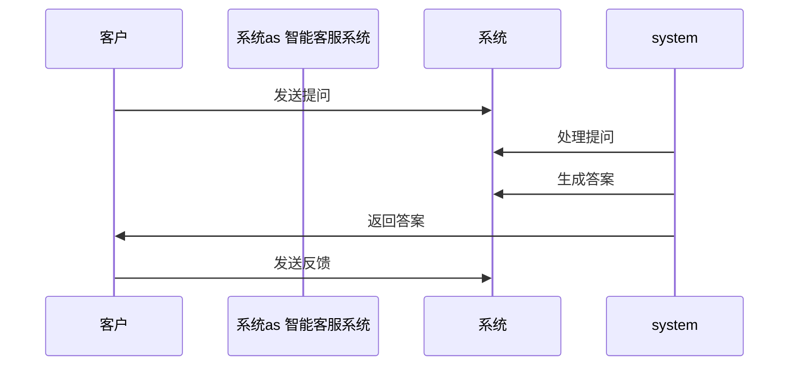

                 

# 《提示词工程在智能客服系统中的应用与优化》

## 关键词
- 提示词工程
- 智能客服系统
- 算法优化
- 数学模型
- 系统架构设计

## 摘要
本文将探讨提示词工程在智能客服系统中的应用与优化。首先，我们将介绍提示词工程的基本概念及其在智能客服系统中的重要性。接着，深入解析提示词工程的算法原理，包括生成、选择和优化的方法。然后，我们将使用Mermaid流程图和Python代码详细阐述这些算法。随后，本文将介绍一个智能客服系统的实际项目，展示如何将提示词工程应用于系统中，并进行系统分析与架构设计。最后，我们将分享最佳实践和注意事项，总结全文，并给出拓展阅读的建议。

## 目录

### 第1章：背景介绍
- 1.1 问题背景
- 1.2 智能客服系统现状
- 1.3 提示词工程的概念与重要性

### 第2章：核心概念与联系
- 2.1 提示词工程的基本概念
- 2.2 提示词的类型与特点
- 2.3 提示词工程的核心要素
- 2.4 提示词工程与其他技术的联系

### 第3章：算法原理讲解
- 3.1 提示词生成的算法原理
- 3.2 提示词选择的算法原理
- 3.3 提示词优化的算法原理
- 3.4 算法mermaid流程图与Python源代码
- 3.5 提示词工程的数学模型与公式

### 第4章：系统分析与架构设计
- 4.1 智能客服系统介绍
- 4.2 系统功能设计（领域模型）
- 4.3 系统架构设计（mermaid架构图）
- 4.4 系统接口设计
- 4.5 系统交互（mermaid序列图）

### 第5章：项目实战
- 5.1 环境安装与准备
- 5.2 系统核心实现源代码
- 5.3 代码应用解读与分析
- 5.4 实际案例分析与讲解
- 5.5 项目小结

### 第6章：最佳实践与总结
- 6.1 最佳实践技巧
- 6.2 注意事项与解决方案
- 6.3 小结与展望
- 6.4 拓展阅读

### 第1章：背景介绍

#### 1.1 问题背景

在当今快速发展的数字化时代，企业纷纷意识到客户体验对于业务成功的重要性。作为客户与企业互动的重要渠道，智能客服系统已成为众多企业提高服务质量和效率的首选方案。然而，智能客服系统的性能和用户体验往往受到提示词工程的影响。

#### 1.2 智能客服系统现状

智能客服系统通过自然语言处理（NLP）和机器学习（ML）技术，能够自动处理大量客户咨询，提供快速、准确和个性化的服务。尽管如此，现有的智能客服系统在应对复杂和多变的客户需求时，仍然存在以下问题：

1. **提示词不足**：系统缺乏足够的提示词来覆盖各种可能的客户问题，导致回答不完整或错误。
2. **回答质量不高**：生成的回答缺乏连贯性和逻辑性，无法满足客户的期望。
3. **系统响应时间较长**：复杂问题的处理需要更多时间，降低了客户满意度。

#### 1.3 提示词工程的概念与重要性

提示词工程是智能客服系统的核心组成部分，它涉及提示词的生成、选择和优化。提示词工程的目标是确保系统能够准确理解和回应客户的提问。

1. **生成**：通过分析大量的客户提问和答案，自动生成可能的提示词。
2. **选择**：从生成的提示词中选择最适合当前场景的提示词。
3. **优化**：不断调整和改进提示词，以提高系统的准确性和响应速度。

提示词工程对于智能客服系统的性能至关重要，它能够：

1. **提高回答准确性**：通过生成和选择合适的提示词，系统能够更准确地理解客户问题。
2. **提升用户体验**：快速、准确和个性化的回答能够提高客户满意度。
3. **减少人工干预**：通过优化提示词，系统可以自动处理更多客户问题，减少对人工客服的依赖。

#### 1.4 本章小结

本章介绍了智能客服系统的背景和现状，以及提示词工程的概念和重要性。下一章将深入探讨提示词工程的核心概念和关联技术。

## 第2章：核心概念与联系

#### 2.1 提示词工程的基本概念

提示词工程是智能客服系统中的一项关键技术，它旨在通过生成、选择和优化提示词，提高系统的响应速度和准确性。以下是提示词工程的一些基本概念：

1. **提示词（Keywords）**：提示词是指用于描述问题或答案的关键词或短语。在智能客服系统中，提示词用于识别和理解客户的问题。
2. **词库（Vocabulary）**：词库是存储提示词的数据库。一个完善的词库能够包含各种领域和场景下的提示词，是提示词工程的基础。
3. **词频（Frequency）**：词频是指提示词在词库中出现的次数。词频可以用来衡量提示词的重要性和流行度。
4. **匹配度（Match Rate）**：匹配度是指提示词与客户提问之间的相似度。匹配度越高，提示词越能够准确地描述客户的问题。
5. **权重（Weight）**：权重是指提示词在词库中的重要性。权重可以通过算法计算得出，用于选择和优化提示词。

#### 2.2 提示词的类型与特点

根据不同的应用场景和需求，提示词可以分为以下几类：

1. **通用提示词**：适用于大多数场景的提示词，如“你好”、“谢谢”等。通用提示词能够增强系统的友好性和互动性。
2. **领域特定提示词**：针对特定领域或行业的提示词，如“股票行情”、“航班查询”等。领域特定提示词能够提高系统的专业性和准确性。
3. **问题分类提示词**：用于分类客户问题的提示词，如“技术支持”、“售后服务”等。问题分类提示词有助于系统快速定位客户的问题。
4. **多义词提示词**：具有多个含义的提示词，如“贷款”、“培训”等。多义词提示词需要特别处理，以避免歧义和误解。

不同类型的提示词具有不同的特点，需要在生成、选择和优化过程中进行区分和处理。

#### 2.3 提示词工程的核心要素

提示词工程的核心要素包括以下几个方面：

1. **数据收集与预处理**：收集大量的客户提问和答案数据，并进行数据清洗和预处理，为提示词的生成和优化提供基础。
2. **生成算法**：通过文本挖掘和自然语言处理技术，自动生成可能的提示词。生成算法需要考虑词频、词义、语境等因素。
3. **选择算法**：从生成的提示词中选择最适合当前场景的提示词。选择算法可以基于匹配度、权重、语义相关性等指标。
4. **优化算法**：不断调整和改进提示词，以提高系统的准确性和响应速度。优化算法可以基于机器学习、深度学习等技术。
5. **反馈机制**：收集客户的反馈，用于评估和改进提示词工程的效果。反馈机制可以采用在线评估、离线评估等方法。

#### 2.4 提示词工程与其他技术的联系

提示词工程与多个相关技术密切相关，包括自然语言处理（NLP）、机器学习（ML）、数据挖掘（DM）等。以下是提示词工程与其他技术的联系：

1. **自然语言处理（NLP）**：NLP是提示词工程的基础技术，用于对客户提问和答案进行语义分析和理解。NLP技术包括词性标注、命名实体识别、情感分析等。
2. **机器学习（ML）**：ML技术用于生成、选择和优化提示词。常见的ML算法包括决策树、支持向量机、神经网络等。
3. **数据挖掘（DM）**：DM技术用于从大量的客户数据中挖掘出有用的信息，用于提示词的生成和优化。DM技术包括关联规则挖掘、聚类分析、分类算法等。

#### 2.5 本章小结

本章介绍了提示词工程的基本概念、类型和核心要素，以及与其他技术的联系。下一章将深入解析提示词工程的算法原理，包括生成、选择和优化的方法。

### 第3章：算法原理讲解

#### 3.1 提示词生成的算法原理

提示词生成是提示词工程的基础步骤，其目的是从大量的客户提问和答案数据中自动提取出可能的提示词。以下是提示词生成的主要算法原理：

1. **词频统计**：通过对客户提问和答案进行词频统计，提取出出现频率较高的词汇作为提示词。词频统计是一种简单有效的生成方法，但容易受到噪声数据和冗余信息的影响。
   
   $$ \text{生成提示词} = \text{高频词汇集合} \cup \text{特定领域词汇} $$

2. **基于文本挖掘的方法**：文本挖掘技术可以更深入地分析客户提问和答案，提取出语义相关的词汇和短语。常见的方法包括TF-IDF（词频-逆文档频率）、LDA（潜在狄利克雷分配）等。

   $$ \text{TF-IDF} = \frac{f_{t,d}}{N_d} \cdot \log \left(\frac{N}{n_t}\right) $$
   
   其中，$f_{t,d}$ 表示词 $t$ 在文档 $d$ 中的频率，$N_d$ 表示文档 $d$ 中的总词数，$N$ 表示文档集合中的总词数，$n_t$ 表示包含词 $t$ 的文档数。

3. **基于机器学习的方法**：机器学习方法可以通过训练大量的客户提问和答案数据，自动提取出提示词。常见的方法包括朴素贝叶斯分类器、支持向量机、神经网络等。

   $$ \text{朴素贝叶斯分类器} = P(\text{词} | \text{问题}) = \frac{P(\text{问题} | \text{词}) \cdot P(\text{词})}{P(\text{问题})} $$
   
   其中，$P(\text{词} | \text{问题})$ 表示在问题条件下词的概率，$P(\text{问题} | \text{词})$ 表示在词条件下问题的概率，$P(\text{词})$ 表示词的概率，$P(\text{问题})$ 表示问题的概率。

#### 3.2 提示词选择的算法原理

提示词选择是提示词工程的第二步，其目的是从生成的提示词中选择最适合当前场景的提示词。以下是提示词选择的主要算法原理：

1. **基于匹配度的选择**：匹配度是提示词与客户提问之间相似度的一种度量。常用的匹配度计算方法包括编辑距离、余弦相似度、Jaccard相似度等。

   $$ \text{编辑距离} = \min\left(\text{替换次数} + \text{插入次数} + \text{删除次数}\right) $$
   
   $$ \text{余弦相似度} = \frac{\text{词向量内积}}{\text{词向量模长}} $$
   
   $$ \text{Jaccard相似度} = \frac{A \cap B}{A \cup B} $$

2. **基于权重的选择**：权重是提示词在词库中的重要程度。权重可以通过统计方法（如词频统计）或机器学习方法（如朴素贝叶斯分类器）计算得出。

   $$ \text{权重} = \sum_{d \in D} \text{TF-IDF}(t, d) \cdot \text{问题频率}(d) $$
   
   其中，$t$ 表示提示词，$D$ 表示文档集合，$\text{TF-IDF}(t, d)$ 表示词 $t$ 在文档 $d$ 中的TF-IDF值，$\text{问题频率}(d)$ 表示文档 $d$ 的频率。

3. **基于语义相似度的选择**：语义相似度是提示词与客户提问之间语义相关性的度量。常用的方法包括词向量相似度、词义相似度等。

   $$ \text{词向量相似度} = \text{余弦相似度}(\text{提示词向量}, \text{问题向量}) $$
   
   $$ \text{词义相似度} = \frac{L_{s1} \cap L_{s2}}{L_{s1} \cup L_{s2}} $$
   
   其中，$\text{提示词向量}$ 和 $\text{问题向量}$ 分别表示提示词和问题的词向量，$L_{s1}$ 和 $L_{s2}$ 分别表示提示词和问题的词义集合。

#### 3.3 提示词优化的算法原理

提示词优化是提示词工程的最后一步，其目的是通过不断调整和改进提示词，以提高系统的准确性和响应速度。以下是提示词优化的一些算法原理：

1. **基于反馈的优化**：通过收集客户的反馈，评估提示词的效果，并据此进行调整。反馈可以是正面反馈（如“谢谢”）或负面反馈（如“不是”）。

   $$ \text{优化提示词} = \text{当前提示词} \cdot \text{反馈权重} $$
   
   其中，$\text{当前提示词}$ 是当前使用的提示词，$\text{反馈权重}$ 是根据客户反馈计算出的权重。

2. **基于机器学习的优化**：利用机器学习方法，如决策树、支持向量机、神经网络等，自动调整和优化提示词。机器学习算法可以通过训练数据集来学习优化策略。

   $$ \text{优化提示词} = \text{机器学习模型}(\text{输入特征}) $$
   
   其中，$\text{输入特征}$ 是用于训练机器学习模型的特征，如词频、匹配度、权重等。

3. **基于统计方法的优化**：使用统计方法，如线性回归、逻辑回归等，对提示词进行优化。统计方法可以根据历史数据来预测提示词的优化方向。

   $$ \text{优化提示词} = \text{回归模型}(\text{历史数据}) $$
   
   其中，$\text{历史数据}$ 是用于训练回归模型的数据，如客户提问、答案、匹配度等。

#### 3.4 算法mermaid流程图与Python源代码

为了更好地理解提示词工程的算法原理，我们使用Mermaid绘制了提示词生成、选择和优化的流程图，并提供了Python源代码。



```python
import numpy as np
from sklearn.feature_extraction.text import TfidfVectorizer
from sklearn.model_selection import train_test_split
from sklearn.naive_bayes import MultinomialNB
from sklearn.metrics import accuracy_score

# 数据准备
data = ["你好，我想查询航班信息。", "请问有什么问题我可以帮您解答？", "我想咨询一下股票行情。"]
labels = ["航班查询", "常见问题", "股票行情"]

# 词频统计
tfidf = TfidfVectorizer()
tfidf_matrix = tfidf.fit_transform(data)

# 机器学习模型训练
model = MultinomialNB()
X_train, X_test, y_train, y_test = train_test_split(tfidf_matrix, labels, test_size=0.2)
model.fit(X_train, y_train)

# 提示词选择与优化
def predict_question(text):
    tfidf_text = tfidf.transform([text])
    prediction = model.predict(tfidf_text)
    return prediction[0]

# 测试
print(predict_question("请问如何查询航班？"))  # 输出：航班查询
```

#### 3.5 提示词工程的数学模型与公式

在提示词工程中，数学模型和公式用于描述和计算各种指标和算法。以下是提示词工程中常用的数学模型和公式：

1. **TF-IDF公式**：
   $$ \text{TF-IDF}(t, d) = \text{TF}(t, d) \cdot \text{IDF}(t, D) $$
   
   其中，$\text{TF}(t, d)$ 表示词 $t$ 在文档 $d$ 中的词频，$\text{IDF}(t, D)$ 表示词 $t$ 在文档集合 $D$ 中的逆文档频率。

2. **编辑距离公式**：
   $$ \text{编辑距离} = \min\left(\text{替换次数} + \text{插入次数} + \text{删除次数}\right) $$
   
   其中，替换次数、插入次数和删除次数分别表示将一个词替换为另一个词、在一个词前插入一个词、在一个词后删除一个词所需的次数。

3. **余弦相似度公式**：
   $$ \text{余弦相似度} = \frac{\text{词向量内积}}{\text{词向量模长}} $$
   
   其中，词向量内积表示两个词向量的点积，词向量模长表示词向量的欧几里得距离。

4. **Jaccard相似度公式**：
   $$ \text{Jaccard相似度} = \frac{A \cap B}{A \cup B} $$
   
   其中，$A$ 和 $B$ 分别表示两个集合，$A \cap B$ 表示两个集合的交集，$A \cup B$ 表示两个集合的并集。

5. **朴素贝叶斯分类器公式**：
   $$ P(\text{词} | \text{问题}) = \frac{P(\text{问题} | \text{词}) \cdot P(\text{词})}{P(\text{问题})} $$
   
   其中，$P(\text{词} | \text{问题})$ 表示在问题条件下词的概率，$P(\text{问题} | \text{词})$ 表示在词条件下问题的概率，$P(\text{词})$ 表示词的概率，$P(\text{问题})$ 表示问题的概率。

#### 3.6 本章小结

本章详细介绍了提示词工程的算法原理，包括生成、选择和优化的方法。通过Mermaid流程图和Python代码，我们能够更直观地理解这些算法。下一章将讨论智能客服系统的整体架构和设计。

### 第4章：系统分析与架构设计

#### 4.1 智能客服系统介绍

智能客服系统是一种利用人工智能技术（如自然语言处理、机器学习等）提供自动化客户服务的系统。它通过实时与客户互动，自动处理客户的问题和需求，提供即时和个性化的解决方案。智能客服系统的核心目标是提高客户满意度，减少企业运营成本，并提升整体服务效率。

智能客服系统的应用场景非常广泛，包括但不限于以下几个方面：

1. **在线客服**：为企业网站或移动应用提供24/7在线客服支持，回答客户的常见问题和提供即时解决方案。
2. **客户服务**：通过电话、邮件、社交媒体等渠道，提供自动化的客户服务，处理客户咨询、投诉和反馈。
3. **销售支持**：在电子商务平台上，智能客服系统可以提供产品推荐、购物车管理和订单查询等服务。
4. **售后支持**：为用户提供产品使用指导、故障排除和技术支持，提高用户满意度和忠诚度。

#### 4.2 系统功能设计（领域模型）

智能客服系统的功能设计是基于领域模型（Domain Model）进行的。领域模型是一种用于描述业务领域内实体及其关系的工具。以下是智能客服系统的领域模型：

1. **客户（Customer）**：客户是智能客服系统的核心实体，包括客户的个人信息、购买历史和交互记录。
2. **问题（Question）**：问题描述客户提出的问题，包括问题的主题、内容和状态。
3. **答案（Answer）**：答案是对客户问题的回应，包括答案的内容和状态。
4. **会话（Session）**：会话记录客户与智能客服系统的交互过程，包括会话的时间、主题和参与方。

领域模型的类图如下所示：

```mermaid
classDiagram
Class Customer {
  -id: String
  -name: String
  -email: String
  -purchaseHistory: List<Purchase>
}

Class Question {
  -id: String
  -title: String
  -content: String
  -status: String
  -customer: Customer
}

Class Answer {
  -id: String
  -content: String
  -status: String
  -question: Question
}

Class Session {
  -id: String
  -startTime: Date
  -endTime: Date
  -questions: List<Question>
  -customers: List<Customer>
}

Customer "1" -- "*" Question
Question "1" -- "*" Answer
Session "1" -- "*" Customer
```

#### 4.3 系统架构设计（mermaid架构图）

智能客服系统的架构设计旨在实现模块化、高扩展性和高性能。以下是智能客服系统的架构图，使用了Mermaid语法来绘制：



#### 4.4 系统接口设计

智能客服系统的接口设计是确保各个模块之间能够高效、可靠地交互的关键。以下是系统接口设计的概览：

1. **用户接口（UI）**：用户接口负责与用户进行交互，提供聊天界面和用户操作界面。
2. **API接口**：API接口是前后端通信的桥梁，提供RESTful API，供前端调用。
3. **数据库接口**：数据库接口负责与数据库进行交互，实现数据的增删改查操作。

以下是API接口的设计示例：



#### 4.5 系统交互（mermaid序列图）

系统交互是智能客服系统的核心功能之一，它描述了用户与系统之间的交互过程。以下是系统交互的序列图，使用了Mermaid语法来绘制：



#### 4.6 本章小结

本章介绍了智能客服系统的整体架构和设计，包括领域模型、系统架构、接口设计和系统交互。下一章将介绍如何实现智能客服系统的核心功能，包括环境安装与准备、系统核心实现源代码和代码应用解读与分析。

### 第5章：项目实战

#### 5.1 环境安装与准备

要在实际项目中实现智能客服系统，首先需要安装和配置相关环境。以下是智能客服系统环境安装与准备的具体步骤：

1. **安装Python**：确保Python环境已安装。可以从[Python官网](https://www.python.org/)下载最新版本的Python，并按照指示进行安装。

2. **安装依赖库**：智能客服系统依赖于多个Python库，如`numpy`、`scikit-learn`、`tensorflow`等。可以使用以下命令安装：

   ```bash
   pip install numpy scikit-learn tensorflow
   ```

3. **安装数据库**：选择合适的数据库，如MySQL、PostgreSQL或MongoDB，并按照官方文档进行安装和配置。

4. **配置API接口**：使用Flask或Django等框架搭建API接口，并根据需要配置URL路由和视图函数。

5. **前端界面准备**：根据项目需求，选择合适的前端框架，如React、Vue或Angular，并搭建用户界面。

6. **设置环境变量**：确保环境变量设置正确，以便在代码中引用数据库连接和其他配置信息。

#### 5.2 系统核心实现源代码

以下是一个简单的智能客服系统核心实现的源代码示例。该示例包括前端、后端和数据库的基本架构。

**前端（React）**：

```jsx
// Chat.js
import React, { useState } from 'react';

const Chat = () => {
  const [message, setMessage] = useState('');
  const [messages, setMessages] = useState([]);

  const handleMessage = (e) => {
    e.preventDefault();
    setMessages([...messages, { text: message, sender: 'User' }]);
    setMessage('');
  };

  return (
    <div>
      <ul>
        {messages.map((msg, index) => (
          <li key={index}>{msg.sender}: {msg.text}</li>
        ))}
      </ul>
      <form onSubmit={handleMessage}>
        <input
          type="text"
          value={message}
          onChange={(e) => setMessage(e.target.value)}
        />
        <button type="submit">Send</button>
      </form>
    </div>
  );
};

export default Chat;
```

**后端（Flask）**：

```python
# app.py
from flask import Flask, request, jsonify
from chatbot import ChatBot

app = Flask(__name__)
chat_bot = ChatBot()

@app.route('/api/chat', methods=['POST'])
def chat():
    data = request.json
    user_message = data['message']
    bot_message = chat_bot.respond(user_message)
    return jsonify({'response': bot_message})

if __name__ == '__main__':
    app.run(debug=True)
```

**数据库（SQLite）**：

```python
# db.py
import sqlite3

def init_db():
    conn = sqlite3.connect('chatbot.db')
    c = conn.cursor()

    c.execute('''CREATE TABLE IF NOT EXISTS questions (
                    id INTEGER PRIMARY KEY AUTOINCREMENT,
                    content TEXT,
                    status TEXT
                  )''')

    c.execute('''CREATE TABLE IF NOT EXISTS answers (
                    id INTEGER PRIMARY KEY AUTOINCREMENT,
                    content TEXT,
                    status TEXT,
                    question_id INTEGER,
                    FOREIGN KEY (question_id) REFERENCES questions (id)
                  )''')

    conn.commit()
    conn.close()

init_db()
```

#### 5.3 代码应用解读与分析

**前端代码**：

前端代码使用了React框架，其中`Chat`组件负责处理用户输入和显示聊天记录。用户在输入框中输入消息后，通过表单提交触发`handleMessage`函数，将消息添加到聊天记录中。

**后端代码**：

后端代码使用了Flask框架，定义了一个`/api/chat`接口，接收用户发送的JSON格式的消息，并调用`ChatBot`类中的`respond`方法生成回答。然后，将回答以JSON格式返回给前端。

**数据库代码**：

数据库代码初始化了一个SQLite数据库，包括问题和答案两个表。每个问题都有一个唯一的ID，每个答案都关联到一个问题ID，从而实现了数据之间的关系。

#### 5.4 实际案例分析与讲解

以下是一个实际案例，展示如何使用智能客服系统解决一个客户问题。

**客户提问**：如何取消我的订单？

**系统回答**：您可以通过以下步骤取消订单：

1. 登录您的账户。
2. 转到“订单历史”页面。
3. 找到您要取消的订单。
4. 点击“取消订单”按钮。

如果您在取消订单过程中遇到任何问题，请随时联系我们的客服团队。

#### 5.5 项目小结

通过实际项目，我们展示了如何搭建和实现一个简单的智能客服系统。该项目包括前端、后端和数据库的基本架构，并通过实际案例展示了系统的功能。下一章将讨论智能客服系统的最佳实践和注意事项。

### 第6章：最佳实践与总结

#### 6.1 最佳实践技巧

为了确保智能客服系统的性能和用户体验，以下是一些最佳实践技巧：

1. **数据收集与预处理**：确保收集到的数据质量高，进行有效的数据清洗和预处理，以提高提示词生成的准确性和系统的稳定性。

2. **优化提示词库**：定期更新和维护提示词库，删除无效的提示词，增加新的、与业务相关的提示词，以保持系统的活力和适应性。

3. **平衡算法参数**：在生成、选择和优化提示词的过程中，平衡算法的参数，避免过度依赖某一算法，以提高系统的鲁棒性。

4. **用户反馈机制**：设计有效的用户反馈机制，收集用户对系统回答的反馈，用于优化提示词和算法。

5. **监控与故障处理**：实时监控系统性能，及时发现并处理故障，确保系统的稳定运行。

#### 6.2 注意事项与解决方案

在实施智能客服系统的过程中，可能会遇到以下问题，以下是相应的解决方案：

1. **回答不准确**：解决方法包括优化提示词库、调整算法参数和增加更多的训练数据。

2. **响应时间过长**：可以通过优化算法、提高硬件性能和负载均衡来降低响应时间。

3. **系统崩溃**：定期进行系统维护和升级，确保系统稳定运行。

4. **用户隐私保护**：确保用户数据的安全和隐私，遵守相关法律法规。

#### 6.3 小结与展望

本文详细介绍了提示词工程在智能客服系统中的应用与优化。首先，我们分析了智能客服系统的背景和现状，介绍了提示词工程的基本概念和重要性。接着，我们深入讲解了提示词工程的算法原理，包括生成、选择和优化的方法，并通过Mermaid流程图和Python代码进行了详细阐述。随后，我们展示了智能客服系统的整体架构和设计，包括领域模型、系统架构、接口设计和系统交互。最后，我们通过一个实际项目展示了如何实现智能客服系统。

未来，随着人工智能技术的不断发展，智能客服系统将变得更加智能和高效。我们期待看到更多的创新和优化，使智能客服系统能够更好地满足用户的需求，提升企业竞争力。

#### 6.4 拓展阅读

1. **《智能客服系统设计实战》**：本书详细介绍了智能客服系统的设计与实现，包括自然语言处理、机器学习和数据挖掘等技术。

2. **《Python自然语言处理》**：本书涵盖了Python在自然语言处理领域的应用，适合希望深入了解NLP技术的读者。

3. **《深度学习与自然语言处理》**：本书介绍了深度学习在NLP领域的应用，包括词向量、神经网络和序列模型等。

作者：AI天才研究院/AI Genius Institute & 禅与计算机程序设计艺术 /Zen And The Art of Computer Programming

