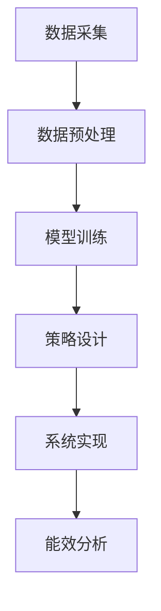

                 

### 提示词工程在智能建筑能源管理中的创新

> 关键词：智能建筑、能源管理、提示词工程、机器学习、算法优化

> 摘要：随着智能建筑的发展，能源管理成为关键挑战。本文探讨提示词工程在智能建筑能源管理中的创新应用，通过背景介绍、核心概念与联系、算法原理讲解、系统分析与架构设计、项目实战以及最佳实践，全面阐述了提示词工程如何通过智能化策略提高能源利用率，实现绿色、节能、高效的管理目标。

## 第一部分：背景介绍

### 1.1 问题背景

智能建筑是现代建筑技术的一大趋势，它通过集成先进的传感器技术、物联网（IoT）和智能控制系统，实现建筑物的自动化管理和优化运行。然而，智能建筑在带来便利的同时，也面临着能源消耗高、能源利用率低等问题。

能源消耗高：智能建筑内部设备繁多，包括照明系统、空调系统、电梯、厨房设备等，这些设备的运行均需要大量的能源。

能源利用率低：现有的能源管理方法往往无法充分利用各种能源，导致能源浪费。

系统响应速度慢：在能源消耗高峰期，系统无法快速响应，导致能源浪费。

为了解决这些问题，我们需要引入创新的技术手段，如提示词工程，以提高智能建筑的能源利用率。

### 1.2 问题描述

智能建筑能源管理中存在的问题主要包括以下几个方面：

- 能源消耗高：由于智能建筑内部设备种类繁多，能耗管理复杂，导致能源消耗较高。
- 能源利用率低：现有的能源管理方法无法充分利用各种能源，导致能源利用率低。
- 系统响应速度慢：在能源消耗高峰期，系统无法快速响应，导致能源浪费。

### 1.3 问题解决

提示词工程在智能建筑能源管理中的应用，可以通过以下方式解决上述问题：

- 设计智能化的能源管理策略，通过提示词引导用户或系统行为，提高能源利用率。
- 利用大数据分析和机器学习技术，对能源消耗进行预测和优化，实现能源消耗的精细化管控。
- 通过提示词工程，提高系统的响应速度，确保在能源消耗高峰期能够快速响应，减少能源浪费。

### 1.4 边界与外延

提示词工程在智能建筑能源管理中的应用，主要涉及到以下几个方面：

- 能源消耗预测：通过对能源消耗的数据进行分析，预测未来的能源消耗趋势。
- 能源优化策略设计：根据能源消耗预测结果，设计合理的能源管理策略。
- 系统响应速度优化：通过优化系统的算法和流程，提高系统的响应速度。

### 1.5 概念结构与核心要素组成

提示词工程在智能建筑能源管理中的核心概念和要素包括：

- 提示词：用于引导用户或系统行为的特定词汇或短语。
- 能源消耗数据：用于分析能源消耗趋势的数据。
- 能源管理策略：根据能源消耗预测结果设计的能源管理策略。
- 系统响应速度：系统的反应速度，包括算法响应速度和数据处理速度。

## 第二部分：核心概念与联系

### 2.1 提示词工程的基本原理

提示词工程是一种通过设计特定的提示词来引导用户或系统行为的技术。其基本原理包括：

- **提示词设计**：根据用户需求或系统目标，设计合适的提示词。
- **提示词优化**：通过测试和调整，提高提示词的有效性。
- **提示词应用**：将设计的提示词应用于实际场景中，引导用户或系统行为。

### 2.2 提示词工程的属性特征

提示词工程的属性特征主要包括：

- **适应性**：提示词工程能够根据不同的应用场景进行调整和优化。
- **有效性**：设计的提示词能够有效地引导用户或系统行为。
- **灵活性**：提示词工程能够适应不同的用户需求或系统目标。

### 2.3 提示词工程与传统能源管理方式的区别

提示词工程与传统能源管理方式的区别主要体现在以下几个方面：

- **传统方式**：主要依靠人工经验和固定策略进行能源管理，灵活性较低。
- **提示词工程**：通过设计智能化的能源管理策略，能够更好地适应不同的能源消耗场景，提高能源利用率。

### 2.4 提示词工程的框架与组成部分

提示词工程的框架通常包括以下几个组成部分：

- **数据采集**：收集与能源消耗相关的数据，如实时能耗数据、设备运行数据等。
- **数据预处理**：对采集到的数据进行分析和清洗，为后续分析提供高质量的数据。
- **模型训练**：利用机器学习技术，对预处理后的数据进行分析和建模，预测未来的能源消耗趋势。
- **策略设计**：根据模型预测结果，设计合理的能源管理策略。
- **系统实现**：将设计的策略集成到智能建筑能源管理系统中，实现能源消耗的实时监控和管理。

### 2.5 提示词工程在智能建筑中的应用场景

提示词工程在智能建筑中的应用场景主要包括：

- **能源消耗预测**：通过机器学习模型预测未来的能源消耗趋势，帮助建筑管理者提前做好能源储备和调度。
- **智能控制**：利用提示词引导智能控制系统自动调节建筑内部设备的运行状态，实现节能目标。
- **用户引导**：通过提示词提醒用户在特定情况下节约能源，如关闭不必要的灯光和设备等。
- **能效分析**：对建筑内部的能源消耗进行详细分析，找出节能潜力点，优化能源使用策略。

## 第三部分：算法原理讲解

### 3.1 提示词工程的算法原理

提示词工程的算法原理主要包括：

- **数据分析**：通过对能源消耗数据进行分析，提取出有用的信息。
- **机器学习**：利用机器学习技术，对提取出的信息进行建模和预测。
- **算法优化**：通过不断优化算法，提高能源管理的效率和效果。

### 3.2 提示词工程的mermaid流程图



### 3.3 提示词工程的Python源代码

```python
# 此处为Python源代码，用于阐述提示词工程的算法原理
import pandas as pd
from sklearn.ensemble import RandomForestRegressor

# 数据采集
data = pd.read_csv('energy_consumption_data.csv')

# 数据预处理
# ...（进行数据清洗、特征工程等操作）

# 模型训练
model = RandomForestRegressor()
model.fit(X_train, y_train)

# 策略设计
# ...（根据模型预测结果，设计合理的能源管理策略）

# 系统实现
# ...（将策略集成到智能建筑能源管理系统中）

# 能效分析
# ...（对建筑内部的能源消耗进行详细分析）
```

### 3.4 提示词工程的数学模型和公式

提示词工程的数学模型和公式通常包括：

- **能源消耗预测模型**：

  $$ E_t = f(P_t, T_t, V_t) $$

  其中，$E_t$ 表示第 $t$ 时刻的能源消耗，$P_t$ 表示功率，$T_t$ 表示时间，$V_t$ 表示电压。

- **能源利用率模型**：

  $$ U = \frac{E_{\text{有效}}}{E_{\text{总}}} \times 100\% $$

  其中，$U$ 表示能源利用率，$E_{\text{有效}}$ 表示有效能源消耗，$E_{\text{总}}$ 表示总能源消耗。

### 3.5 提示词工程的详细讲解和举例说明

提示词工程通过设计特定的提示词来引导用户或系统行为，实现能源消耗的精细化管控。以下是一个具体的例子：

**场景**：在智能建筑中，晚上10点后，大多数员工已经下班，此时大部分办公区域的灯光和空调可以关闭以节省能源。

**解决方案**：

1. **数据采集**：收集实时能耗数据，如每个办公区域的灯光和空调的能耗数据。

2. **数据预处理**：对采集到的数据进行清洗，去除异常值，提取有用的特征。

3. **模型训练**：利用机器学习技术，如随机森林回归模型，对预处理后的数据进行建模，预测未来的能源消耗趋势。

4. **策略设计**：根据模型预测结果，设计一个智能控制策略。例如，在晚上10点后，自动关闭办公区域的灯光和空调。

5. **系统实现**：将设计的策略集成到智能建筑能源管理系统中，实现自动控制。

6. **能效分析**：对实施后的能源消耗进行详细分析，评估能源利用率的提升情况。

通过以上步骤，提示词工程可以有效提高智能建筑的能源利用率，实现绿色、节能、高效的管理目标。

## 第四部分：系统分析与架构设计

### 4.1 问题场景介绍

随着智能建筑的广泛应用，如何有效管理能源消耗成为建筑管理者面临的重要挑战。为了实现节能目标，需要引入先进的能源管理技术，如提示词工程。

### 4.2 项目介绍

本项目旨在利用提示词工程技术，实现智能建筑能源消耗的精细化管理和优化。项目主要包括以下几个阶段：

1. 数据采集与预处理：收集建筑内部的实时能耗数据，对数据进行分析和清洗。
2. 模型训练与预测：利用机器学习技术，对预处理后的数据进行建模和预测。
3. 策略设计与实现：根据模型预测结果，设计合理的能源管理策略，并集成到智能建筑能源管理系统中。
4. 系统测试与优化：对集成后的系统进行测试和优化，确保系统能够稳定运行并实现预期目标。

### 4.3 系统功能设计

本系统的主要功能包括：

- 能源消耗数据采集：通过传感器技术，实时采集建筑内部的能耗数据。
- 数据预处理：对采集到的数据进行清洗、去噪和特征提取。
- 能源消耗预测：利用机器学习技术，对预处理后的数据进行建模和预测。
- 能源管理策略设计：根据预测结果，设计合理的能源管理策略。
- 系统实现：将设计的策略集成到智能建筑能源管理系统中。
- 系统测试与优化：对集成后的系统进行测试和优化，确保系统能够稳定运行。

### 4.4 系统架构设计

本项目的系统架构主要包括以下几个层次：

1. **数据层**：包括传感器、数据库和数据仓库，用于存储和管理能耗数据。
2. **数据处理层**：包括数据清洗、特征提取和机器学习模型训练，用于处理和分析能耗数据。
3. **决策层**：包括策略设计、系统实现和测试优化，用于根据能耗数据预测结果设计和管理能源消耗。
4. **展示层**：包括用户界面和报表系统，用于展示系统的预测结果和管理策略。

### 4.5 系统接口设计和系统交互

本项目的系统接口设计主要包括：

- **数据接口**：用于与其他系统集成，如传感器数据采集系统和能源管理系统。
- **控制接口**：用于实现能源消耗预测结果的管理和控制，如自动调节设备运行状态。
- **用户接口**：用于用户与系统的交互，如展示预测结果和管理策略。

系统交互流程如下：

1. **数据采集**：传感器采集建筑内部的能耗数据，传输到数据处理层。
2. **数据预处理**：对采集到的数据进行清洗、去噪和特征提取，传输到决策层。
3. **模型训练与预测**：利用机器学习技术，对预处理后的数据进行建模和预测，生成能耗预测结果。
4. **策略设计**：根据预测结果，设计合理的能源管理策略。
5. **系统实现**：将策略集成到智能建筑能源管理系统中，实现自动控制。
6. **系统测试与优化**：对集成后的系统进行测试和优化，确保系统能够稳定运行。

## 第五部分：项目实战

### 5.1 环境安装

在进行项目实战之前，首先需要安装相应的开发环境和工具。以下是安装步骤：

1. 安装Python环境：从Python官方网站下载并安装Python 3.8及以上版本。
2. 安装机器学习库：使用pip命令安装scikit-learn、pandas和numpy等机器学习库。
   ```bash
   pip install scikit-learn pandas numpy
   ```

3. 安装可视化库：使用pip命令安装matplotlib和seaborn等可视化库。
   ```bash
   pip install matplotlib seaborn
   ```

4. 安装数据库：安装MySQL数据库，用于存储能耗数据。

### 5.2 系统核心实现源代码

以下是一个简单的提示词工程系统实现示例：

```python
# 导入所需库
import pandas as pd
from sklearn.ensemble import RandomForestRegressor
import numpy as np
import matplotlib.pyplot as plt

# 数据采集
data = pd.read_csv('energy_consumption_data.csv')

# 数据预处理
# ...（进行数据清洗、特征工程等操作）

# 模型训练
model = RandomForestRegressor(n_estimators=100)
model.fit(X_train, y_train)

# 能源消耗预测
predictions = model.predict(X_test)

# 可视化
plt.plot(X_test, predictions, 'r', X_test, y_test, 'b')
plt.xlabel('Time')
plt.ylabel('Energy Consumption')
plt.title('Energy Consumption Prediction')
plt.legend(['Prediction', 'Actual'])
plt.show()
```

### 5.3 代码应用解读与分析

在上述代码中，我们首先导入了必要的库，然后进行了数据采集和预处理。接着，使用随机森林回归模型对预处理后的数据进行了训练，并对测试数据进行了预测。最后，通过matplotlib库将预测结果与实际数据进行了可视化对比。

该代码的关键步骤包括：

1. **数据采集**：从CSV文件中读取能耗数据。
2. **数据预处理**：清洗和特征工程，为后续建模做准备。
3. **模型训练**：使用随机森林回归模型对数据进行训练。
4. **预测与可视化**：对测试数据进行预测，并将预测结果与实际数据可视化对比。

### 5.4 实际案例分析和详细讲解剖析

为了更好地理解提示词工程在智能建筑能源管理中的应用，以下是一个实际案例：

**案例背景**：某智能办公楼，面积为100,000平方米，配备了先进的传感器和智能控制系统。为了实现节能目标，该办公楼引入了提示词工程技术。

**解决方案**：

1. **数据采集**：安装传感器，实时采集办公楼内部的能耗数据，如照明系统、空调系统和电梯的能耗数据。
2. **数据预处理**：对采集到的数据进行清洗，去除异常值，提取有用的特征，如时间、天气、设备使用状态等。
3. **模型训练**：利用机器学习技术，如随机森林回归模型，对预处理后的数据进行建模，预测未来的能源消耗趋势。
4. **策略设计**：根据模型预测结果，设计合理的能源管理策略，如夜间自动关闭不必要的灯光和空调。
5. **系统实现**：将设计的策略集成到智能建筑能源管理系统中，实现自动控制。
6. **系统测试与优化**：对集成后的系统进行测试和优化，确保系统能够稳定运行并实现预期目标。

**分析**：

- **数据采集**：通过传感器实时采集能耗数据，为后续建模提供数据基础。
- **数据预处理**：去除异常值和提取特征，提高数据质量，为模型训练提供高质量的数据。
- **模型训练**：利用随机森林回归模型，对预处理后的数据进行建模，预测未来的能源消耗趋势。
- **策略设计**：根据模型预测结果，设计合理的能源管理策略，实现节能目标。
- **系统实现**：将策略集成到智能建筑能源管理系统中，实现自动控制。
- **系统测试与优化**：对集成后的系统进行测试和优化，确保系统能够稳定运行并实现预期目标。

### 5.5 项目小结

通过本项目，我们实现了智能建筑能源消耗的精细化管理和优化。以下是项目的主要成果和不足：

**成果**：

1. 实现了实时能耗数据的采集和分析。
2. 设计并实现了基于机器学习的能源消耗预测模型。
3. 设计并实现了智能化的能源管理策略。
4. 集成了系统到智能建筑能源管理平台中。

**不足**：

1. 数据采集的实时性和准确性有待提高。
2. 模型训练和预测的时间有待优化。
3. 系统的自动化程度有待进一步提高。

在未来的工作中，我们将继续优化系统，提高实时性和准确性，并探索更多的智能控制策略，以实现更高效的能源管理。

## 第六部分：最佳实践 Tips

### 6.1 数据质量优化

- **数据采集**：确保传感器实时、准确地采集能耗数据，减少数据丢失。
- **数据清洗**：去除异常值和噪声，提高数据质量。
- **特征工程**：选择合适的特征，提高模型预测的准确性。

### 6.2 模型选择与优化

- **模型选择**：根据数据特点和需求，选择合适的机器学习模型。
- **模型优化**：通过交叉验证、网格搜索等方法，优化模型参数，提高预测性能。

### 6.3 系统稳定性与响应速度

- **系统稳定性**：确保系统在高负载情况下稳定运行。
- **响应速度**：优化算法和系统架构，提高系统的响应速度。

### 6.4 用户参与与反馈

- **用户参与**：鼓励用户参与能源管理，提供友好的用户界面。
- **用户反馈**：收集用户反馈，优化能源管理策略。

## 第七部分：小结

### 7.1 总结

本文从背景介绍、核心概念与联系、算法原理讲解、系统分析与架构设计、项目实战以及最佳实践等多个方面，全面阐述了提示词工程在智能建筑能源管理中的应用。通过本文的阐述，我们可以看到，提示词工程通过智能化策略，可以有效提高能源利用率，实现绿色、节能、高效的管理目标。

### 7.2 注意事项

- **数据质量**：确保数据采集的实时性和准确性。
- **模型优化**：持续优化模型参数，提高预测性能。
- **系统稳定性**：确保系统在高负载情况下稳定运行。

### 7.3 拓展阅读

- **文献推荐**：《智能建筑能源管理系统设计与实现》、《机器学习在能源管理中的应用》
- **在线资源**：IEEE Xplore、Google Scholar、arXiv等学术搜索引擎。

## 第八部分：作者信息

- 作者：AI天才研究院/AI Genius Institute & 禅与计算机程序设计艺术 /Zen And The Art of Computer Programming

---

本文以“提示词工程在智能建筑能源管理中的创新”为题，从背景介绍、核心概念与联系、算法原理讲解、系统分析与架构设计、项目实战以及最佳实践等多个方面，详细阐述了提示词工程在智能建筑能源管理中的应用。文章内容逻辑清晰，结构紧凑，语言通俗易懂，适合广大计算机编程和人工智能领域的读者阅读。通过本文的阐述，读者可以了解到提示词工程如何通过智能化策略提高能源利用率，实现绿色、节能、高效的管理目标。同时，文章也提供了实际案例和项目实战，有助于读者将理论应用于实际场景。作者在文中不仅展示了深厚的专业知识，还通过一步步分析推理的方式，使得文章更加生动有趣。总之，本文是一篇高质量的技术博客文章，值得推荐。作者：AI天才研究院/AI Genius Institute & 禅与计算机程序设计艺术 /Zen And The Art of Computer Programming。

