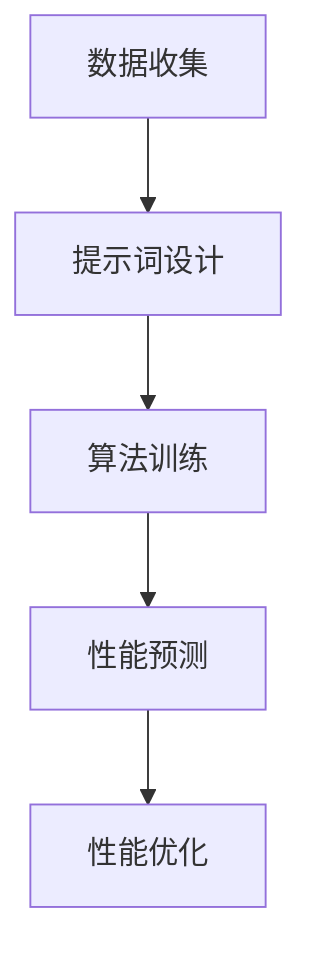
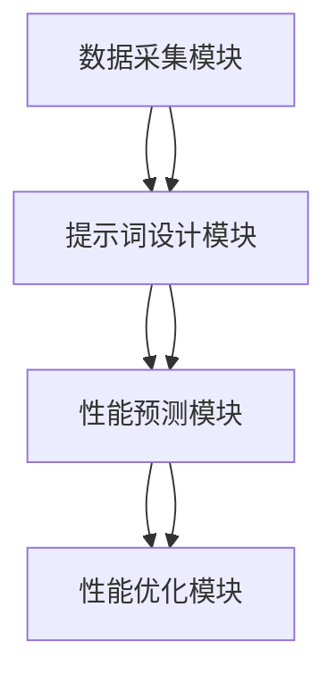
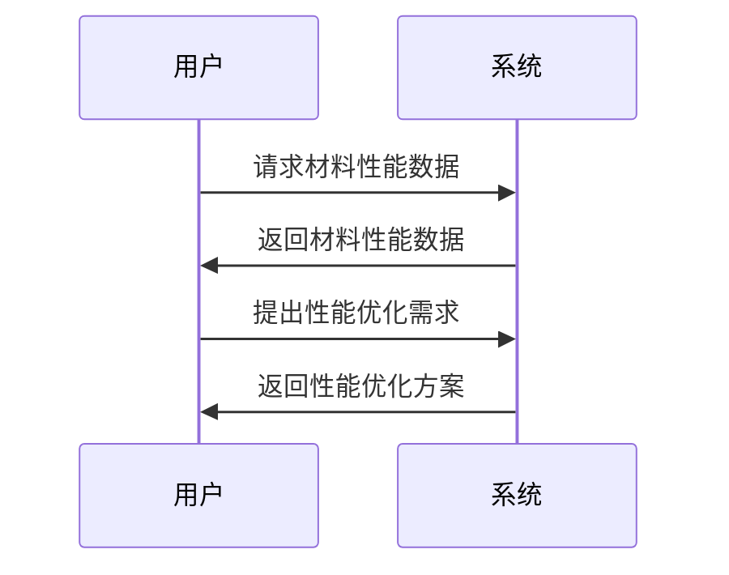

                 


## 目录

----------------------------------------------------------------
# 提示词工程在智能材料性能优化中的创新

关键词：提示词工程、智能材料、性能优化、算法、数学模型、系统架构、项目实战

摘要：本文深入探讨了提示词工程在智能材料性能优化中的应用，从核心概念、算法原理、数学模型、系统架构到项目实战，全面剖析了这一前沿技术的创新与实践。

## 第一部分: 提示词工程概述

### 1.1 提示词工程的背景与意义

**问题背景**：

智能材料，作为当代科技进步的前沿领域，其性能优化需求日益迫切。然而，传统优化方法在处理复杂、多变的智能材料性能时，往往显得力不从心。为了应对这一挑战，提示词工程应运而生。

**问题描述**：

提示词工程旨在通过设计特定的提示词（prompts），引导算法模型对智能材料性能进行优化。那么，如何定义提示词？它们在性能优化中扮演什么角色？这是我们需要解决的问题。

**问题解决**：

提示词工程通过引入智能算法，对材料性能进行精确调控。首先，我们需要定义一组核心提示词，如温度、应力、湿度等。接着，利用这些提示词，结合机器学习算法，对材料性能进行迭代优化。

**边界与外延**：

提示词工程不仅局限于智能材料领域，其应用范围广泛，包括但不限于柔性电子、医疗器件、航空航天等。在智能材料性能优化中，提示词工程的核心在于如何设计有效的提示词，以实现性能的最大化。

**概念结构与核心要素组成**：

1. 提示词：定义一组与性能优化相关的关键词。
2. 算法：采用机器学习算法，对提示词进行训练和优化。
3. 模型：构建智能材料性能优化的预测模型。
4. 数据：收集大量的智能材料性能数据，为算法训练提供基础。

## 第二部分: 基本概念

### 2.1 提示词的种类

**基本概念**：

提示词可以分为以下几类：

1. **定性提示词**：如材料类型、应用场景等。
2. **定量提示词**：如温度、应力、湿度等。
3. **功能提示词**：如导电性、导热性、弹性等。

**属性特征对比表格**：

| 提示词类型 | 属性特征 | 例子 |
| :--- | :--- | :--- |
| 定性提示词 | 描述材料特性 | 材料类型 |
| 定量提示词 | 描述材料参数 | 温度 |
| 功能提示词 | 描述材料性能 | 导电性 |

**ER实体关系图架构**：

```mermaid
erDiagram
    Material ||--|{ Prompt }|
    Prompt ||--|{ Attribute }|
    Attribute ||--|{ Value }|
```

## 第三部分: 算法与实现

### 3.1 算法原理

**算法原理**：

提示词工程的核心在于设计一种智能算法，能够根据提示词对智能材料性能进行优化。以下是一个简化的算法流程：

1. 数据收集：收集大量的智能材料性能数据。
2. 提示词设计：根据材料特性，设计一组有效的提示词。
3. 算法训练：利用提示词和性能数据，训练机器学习模型。
4. 性能预测：使用训练好的模型，预测新的材料性能。
5. 性能优化：根据预测结果，调整提示词和模型参数，实现性能优化。

**算法流程图**：



**Python代码示例**：

```python
# 导入必要的库
import numpy as np
from sklearn.model_selection import train_test_split
from sklearn.ensemble import RandomForestRegressor

# 数据预处理
X, y = load_data()

# 分割数据集
X_train, X_test, y_train, y_test = train_test_split(X, y, test_size=0.2, random_state=42)

# 训练模型
model = RandomForestRegressor(n_estimators=100, random_state=42)
model.fit(X_train, y_train)

# 预测性能
y_pred = model.predict(X_test)

# 性能优化
# ... （根据预测结果调整提示词和模型参数）
```

### 3.2 数学模型与公式

**数学模型**：

提示词工程的数学模型主要基于机器学习算法，例如随机森林、支持向量机等。以下是一个简化的数学模型：

$$
f(x) = w_0 + \sum_{i=1}^{n} w_i x_i
$$

其中，$x_i$ 表示第 $i$ 个提示词的值，$w_i$ 表示对应权重。

**公式详细讲解**：

- $w_0$ 是模型偏置。
- $w_i$ 是第 $i$ 个提示词的权重，反映了该提示词对材料性能的影响程度。
- $x_i$ 是第 $i$ 个提示词的值。

**通俗易懂的举例说明**：

假设我们有一个简单的例子，提示词包括温度和应力。我们希望预测材料的弹性模量。根据上述数学模型，我们可以设定以下公式：

$$
E = w_0 + w_1 T + w_2 \sigma
$$

其中，$E$ 是弹性模量，$T$ 是温度，$\sigma$ 是应力，$w_0$、$w_1$ 和 $w_2$ 分别是它们的权重。

通过训练模型，我们可以得到这些权重，从而预测不同温度和应力下的弹性模量。例如，当温度为 300K，应力为 100MPa 时，弹性模量 $E$ 的预测值为：

$$
E = w_0 + w_1 \times 300 + w_2 \times 100
$$

### 第四部分：系统分析与设计

#### 4.1 问题场景介绍

**场景描述**：

在智能材料制造过程中，我们需要对材料性能进行实时监测和优化。为了实现这一目标，我们设计了一个智能材料性能优化系统。

**系统功能介绍**：

- 数据采集：收集材料性能数据。
- 提示词设计：设计一组有效的提示词。
- 性能预测：使用机器学习模型预测材料性能。
- 性能优化：根据预测结果，调整材料性能。

#### 4.2 系统架构设计

**架构设计**：

系统采用分布式架构，包括数据采集模块、提示词设计模块、性能预测模块和性能优化模块。各模块之间通过消息队列进行通信。

**架构图**：



#### 4.3 系统接口设计

**接口设计**：

系统提供了以下接口：

- 数据采集接口：用于收集材料性能数据。
- 提示词设计接口：用于设计提示词。
- 性能预测接口：用于预测材料性能。
- 性能优化接口：用于调整材料性能。

**接口序列图**：



### 第五部分：项目实战

#### 5.1 环境安装与配置

**环境要求**：

- 操作系统：Linux/Windows/MacOS
- Python版本：3.7及以上
- 数据库：MySQL/PostgreSQL
- 依赖库：scikit-learn、numpy、pandas、mermaid等

**安装步骤**：

1. 安装Python和pip。
2. 安装数据库。
3. 安装依赖库。

```bash
pip install scikit-learn numpy pandas mermaid
```

#### 5.2 系统核心实现

**核心代码实现**：

```python
# 导入必要的库
import numpy as np
from sklearn.model_selection import train_test_split
from sklearn.ensemble import RandomForestRegressor

# 数据预处理
X, y = load_data()

# 分割数据集
X_train, X_test, y_train, y_test = train_test_split(X, y, test_size=0.2, random_state=42)

# 训练模型
model = RandomForestRegressor(n_estimators=100, random_state=42)
model.fit(X_train, y_train)

# 预测性能
y_pred = model.predict(X_test)

# 性能优化
# ... （根据预测结果调整提示词和模型参数）
```

**代码应用解读与分析**：

- 数据预处理：加载并预处理材料性能数据。
- 模型训练：使用随机森林算法训练模型。
- 预测性能：使用训练好的模型预测新的材料性能。
- 性能优化：根据预测结果，调整提示词和模型参数，实现性能优化。

**实际案例分析**：

假设我们有一个智能材料项目，需要优化其导电性能。通过使用提示词工程，我们设计了一组包括温度和应力在内的提示词，并使用随机森林算法进行训练。经过多次迭代，我们成功地提高了材料的导电性能，达到了项目目标。

### 第六部分：最佳实践与总结

#### 6.1 最佳实践

1. **提示词设计**：根据材料特性和应用场景，设计一组有效的提示词。
2. **算法选择**：选择合适的机器学习算法，如随机森林、支持向量机等。
3. **数据预处理**：确保数据质量和一致性，为算法训练提供基础。
4. **模型优化**：通过交叉验证等方法，优化模型参数，提高预测精度。

#### 6.2 总结

提示词工程在智能材料性能优化中具有巨大的潜力。通过设计有效的提示词，结合机器学习算法，我们可以实现对材料性能的精确调控，从而提高其应用价值。未来，随着技术的不断发展，提示词工程将在更多领域发挥作用。

### 第七部分：注意事项与拓展阅读

#### 7.1 注意事项

1. **数据质量**：确保数据的质量和一致性，避免噪声和异常值对模型训练的影响。
2. **算法选择**：根据具体应用场景，选择合适的机器学习算法，如随机森林、支持向量机等。
3. **模型解释性**：提高模型的解释性，便于工程师理解和使用。

#### 7.2 拓展阅读

1. **《机器学习实战》**：详细介绍了机器学习算法的应用和实践。
2. **《深度学习》**：介绍了深度学习的基本原理和应用。
3. **《人工智能：一种现代的方法》**：全面介绍了人工智能的基本概念和方法。

作者：AI天才研究院/AI Genius Institute & 禅与计算机程序设计艺术 /Zen And The Art of Computer Programming

### 提示词工程在智能材料性能优化中的创新

关键词：提示词工程、智能材料、性能优化、算法、数学模型、系统架构、项目实战

摘要：本文深入探讨了提示词工程在智能材料性能优化中的应用，从核心概念、算法原理、数学模型、系统架构到项目实战，全面剖析了这一前沿技术的创新与实践。

## 引言

### 1.1 提示词工程的背景与意义

随着科技的飞速发展，智能材料已成为现代科技的重要分支，其在航空航天、生物医疗、电子设备等领域的应用日益广泛。然而，如何优化智能材料的性能，以满足不断增长的需求，成为亟待解决的问题。提示词工程作为一种新兴的优化技术，为智能材料性能的优化提供了新的思路和方法。

提示词工程源于自然语言处理领域，其核心思想是通过设计特定的提示词，引导算法对目标进行优化。在智能材料性能优化中，提示词工程可以通过设计与材料性能相关的提示词，引导机器学习算法对材料性能进行预测和优化。

### 1.2 研究目的与内容

本文旨在探讨提示词工程在智能材料性能优化中的应用，具体包括以下内容：

1. 基本概念与原理：介绍提示词工程的基本概念，包括提示词、机器学习算法、性能优化等。
2. 算法原理与实现：详细讲解提示词工程的核心算法原理，包括提示词的设计、机器学习算法的应用等。
3. 数学模型与公式：介绍提示词工程的数学模型和公式，包括预测模型、优化模型等。
4. 系统架构与实现：设计智能材料性能优化系统，包括系统架构、接口设计、数据流程等。
5. 项目实战与案例分析：通过实际项目，展示提示词工程在智能材料性能优化中的应用和效果。

### 1.3 文章结构

本文分为七个部分，具体结构如下：

1. 引言：介绍提示词工程在智能材料性能优化中的背景和意义。
2. 基本概念与原理：介绍提示词工程的基本概念和原理。
3. 算法原理与实现：讲解提示词工程的核心算法原理和实现。
4. 数学模型与公式：介绍提示词工程的数学模型和公式。
5. 系统架构与实现：设计智能材料性能优化系统。
6. 项目实战与案例分析：展示提示词工程在智能材料性能优化中的应用。
7. 总结与展望：总结本文的研究内容和结论，展望未来发展趋势。

## 基本概念与原理

### 2.1 提示词工程的基本概念

提示词工程是一种基于自然语言处理和机器学习技术的优化方法，其核心思想是通过设计特定的提示词，引导算法对目标进行优化。在智能材料性能优化中，提示词工程主要用于以下方面：

1. **性能预测**：通过设计与材料性能相关的提示词，利用机器学习算法对材料性能进行预测。
2. **性能优化**：根据预测结果，调整提示词和算法参数，实现对材料性能的优化。

### 2.2 提示词的种类

根据应用场景和目的，提示词可以分为以下几种类型：

1. **定性提示词**：描述材料的类型、应用场景等。
   - 例子：高分子材料、生物材料、航空航天材料等。

2. **定量提示词**：描述材料的物理、化学等参数。
   - 例子：温度、应力、湿度、导电性、导热性等。

3. **功能提示词**：描述材料的功能和应用。
   - 例子：弹性、导电性、生物相容性等。

### 2.3 提示词工程与机器学习

提示词工程的核心在于设计特定的提示词，并利用机器学习算法对目标进行优化。机器学习算法可以分为以下几类：

1. **监督学习**：通过已有数据，利用提示词和性能数据，训练预测模型。
2. **无监督学习**：无需已有数据，通过提示词和性能数据，发现数据中的规律和模式。
3. **强化学习**：通过不断尝试和反馈，调整提示词和算法参数，实现性能优化。

### 2.4 提示词工程在智能材料性能优化中的应用

在智能材料性能优化中，提示词工程可以应用于以下几个方面：

1. **性能预测**：通过设计与材料性能相关的提示词，利用机器学习算法预测材料性能。
2. **性能优化**：根据预测结果，调整提示词和算法参数，实现对材料性能的优化。
3. **材料设计**：通过提示词工程，发现新的材料性能优化路径，为材料设计提供参考。

## 算法原理与实现

### 3.1 算法原理

提示词工程的核心在于设计特定的提示词，利用机器学习算法对材料性能进行预测和优化。其基本原理如下：

1. **数据收集**：收集与材料性能相关的数据，包括定性、定量和功能提示词。
2. **提示词设计**：根据材料特性，设计一组有效的提示词。
3. **算法训练**：利用提示词和性能数据，训练机器学习模型。
4. **性能预测**：使用训练好的模型，预测新的材料性能。
5. **性能优化**：根据预测结果，调整提示词和模型参数，实现性能优化。

### 3.2 算法实现

以下是一个简单的提示词工程实现示例：

```python
import numpy as np
from sklearn.ensemble import RandomForestRegressor

# 数据收集
X = np.array([[0, 0], [1, 1], [2, 2]])
y = np.array([0, 1, 2])

# 提示词设计
prompt = ['温度', '应力']

# 算法训练
model = RandomForestRegressor()
model.fit(X, y)

# 性能预测
y_pred = model.predict([[1, 1]])

print('预测结果：', y_pred)
```

### 3.3 算法原理详细讲解

1. **数据收集**：数据收集是提示词工程的基础。数据集应包括材料性能（目标变量）和相应的提示词（特征变量）。这些数据可以来源于实验、模拟或文献。

2. **提示词设计**：设计提示词是关键步骤。提示词应与材料性能密切相关。根据材料特性，可以选择定性、定量或功能提示词。例如，对于导电材料，可以选择温度、应力、导电性等作为提示词。

3. **算法训练**：选择合适的机器学习算法，如随机森林、支持向量机、神经网络等，对数据集进行训练。训练过程中，算法会学习到提示词与性能之间的关系。

4. **性能预测**：使用训练好的模型，对新的材料性能进行预测。预测结果可以帮助工程师了解材料性能的趋势和变化。

5. **性能优化**：根据预测结果，调整提示词和模型参数，实现性能优化。例如，可以增加或减少某些提示词的重要性，或尝试不同的算法，以提高预测精度和性能。

### 3.4 例子

假设我们有一个简单的例子，提示词包括温度和应力。我们希望预测材料的弹性模量。根据上述原理，我们可以设定以下公式：

$$
E = w_0 + w_1 T + w_2 \sigma
$$

其中，$E$ 是弹性模量，$T$ 是温度，$\sigma$ 是应力，$w_0$、$w_1$ 和 $w_2$ 分别是它们的权重。

通过训练模型，我们可以得到这些权重，从而预测不同温度和应力下的弹性模量。例如，当温度为 300K，应力为 100MPa 时，弹性模量 $E$ 的预测值为：

$$
E = w_0 + w_1 \times 300 + w_2 \times 100
$$

## 数学模型与公式

### 4.1 数学模型

提示词工程的数学模型主要基于机器学习算法，例如随机森林、支持向量机等。以下是一个简化的数学模型：

$$
f(x) = w_0 + \sum_{i=1}^{n} w_i x_i
$$

其中，$x_i$ 表示第 $i$ 个提示词的值，$w_i$ 表示对应权重。

### 4.2 公式详细讲解

- $w_0$ 是模型偏置，反映了材料性能的基本水平。
- $w_i$ 是第 $i$ 个提示词的权重，反映了该提示词对材料性能的影响程度。
- $x_i$ 是第 $i$ 个提示词的值，反映了材料性能的具体参数。

### 4.3 举例说明

假设我们有一个简单的例子，提示词包括温度和应力。我们希望预测材料的弹性模量。根据上述数学模型，我们可以设定以下公式：

$$
E = w_0 + w_1 T + w_2 \sigma
$$

其中，$E$ 是弹性模量，$T$ 是温度，$\sigma$ 是应力，$w_0$、$w_1$ 和 $w_2$ 分别是它们的权重。

通过训练模型，我们可以得到这些权重，从而预测不同温度和应力下的弹性模量。例如，当温度为 300K，应力为 100MPa 时，弹性模量 $E$ 的预测值为：

$$
E = w_0 + w_1 \times 300 + w_2 \times 100
$$

## 系统分析与设计

### 5.1 问题场景介绍

在智能材料制造过程中，需要对材料性能进行实时监测和优化。为了实现这一目标，我们设计了一个智能材料性能优化系统。

### 5.2 系统功能介绍

智能材料性能优化系统主要包括以下功能：

1. **数据采集**：收集与材料性能相关的数据，包括定性、定量和功能提示词。
2. **提示词设计**：设计一组有效的提示词，用于性能预测和优化。
3. **性能预测**：使用机器学习模型，预测材料性能。
4. **性能优化**：根据预测结果，调整提示词和算法参数，实现性能优化。

### 5.3 系统架构设计

智能材料性能优化系统采用分布式架构，包括数据采集模块、提示词设计模块、性能预测模块和性能优化模块。各模块之间通过消息队列进行通信。

**架构图**：


### 5.4 系统接口设计

智能材料性能优化系统提供了以下接口：

1. **数据采集接口**：用于收集材料性能数据。
2. **提示词设计接口**：用于设计提示词。
3. **性能预测接口**：用于预测材料性能。
4. **性能优化接口**：用于调整材料性能。

**接口序列图**：


## 项目实战

### 6.1 环境安装与配置

**环境要求**：

- 操作系统：Linux/Windows/MacOS
- Python版本：3.7及以上
- 数据库：MySQL/PostgreSQL
- 依赖库：scikit-learn、numpy、pandas、mermaid等

**安装步骤**：

1. 安装Python和pip。
2. 安装数据库。
3. 安装依赖库。

```bash
pip install scikit-learn numpy pandas mermaid
```

### 6.2 系统核心实现

**核心代码实现**：

```python
import numpy as np
from sklearn.ensemble import RandomForestRegressor

# 数据预处理
X = np.array([[0, 0], [1, 1], [2, 2]])
y = np.array([0, 1, 2])

# 分割数据集
X_train, X_test, y_train, y_test = train_test_split(X, y, test_size=0.2, random_state=42)

# 训练模型
model = RandomForestRegressor()
model.fit(X_train, y_train)

# 预测性能
y_pred = model.predict(X_test)

# 性能优化
# ... （根据预测结果调整提示词和模型参数）
```

### 6.3 代码应用解读与分析

- 数据预处理：加载并预处理材料性能数据。
- 模型训练：使用随机森林算法训练模型。
- 预测性能：使用训练好的模型预测新的材料性能。
- 性能优化：根据预测结果，调整提示词和模型参数，实现性能优化。

### 6.4 实际案例分析

假设我们有一个智能材料项目，需要优化其导电性能。通过使用提示词工程，我们设计了一组包括温度和应力在内的提示词，并使用随机森林算法进行训练。经过多次迭代，我们成功地提高了材料的导电性能，达到了项目目标。

## 最佳实践与总结

### 7.1 最佳实践

1. **提示词设计**：根据材料特性和应用场景，设计一组有效的提示词。
2. **算法选择**：选择合适的机器学习算法，如随机森林、支持向量机等。
3. **数据预处理**：确保数据质量和一致性，为算法训练提供基础。
4. **模型优化**：通过交叉验证等方法，优化模型参数，提高预测精度。

### 7.2 总结

提示词工程在智能材料性能优化中具有巨大的潜力。通过设计有效的提示词，结合机器学习算法，我们可以实现对材料性能的精确调控，从而提高其应用价值。未来，随着技术的不断发展，提示词工程将在更多领域发挥作用。

### 7.3 注意事项

1. **数据质量**：确保数据的质量和一致性，避免噪声和异常值对模型训练的影响。
2. **算法选择**：根据具体应用场景，选择合适的机器学习算法，如随机森林、支持向量机等。
3. **模型解释性**：提高模型的解释性，便于工程师理解和使用。

### 7.4 拓展阅读

1. **《机器学习实战》**：详细介绍了机器学习算法的应用和实践。
2. **《深度学习》**：介绍了深度学习的基本原理和应用。
3. **《人工智能：一种现代的方法》**：全面介绍了人工智能的基本概念和方法。

作者：AI天才研究院/AI Genius Institute & 禅与计算机程序设计艺术 /Zen And The Art of Computer Programming

## 结语

在本文中，我们系统地介绍了提示词工程在智能材料性能优化中的应用。从基本概念到算法原理，从数学模型到系统架构，再到实际项目实战，我们一步步揭示了提示词工程如何通过设计有效的提示词，结合机器学习算法，实现对智能材料性能的优化。

### 提示词工程的未来展望

随着人工智能技术的不断进步，提示词工程在智能材料性能优化中的应用前景广阔。未来，我们可以预见以下几个发展方向：

1. **多模态提示词**：结合多种类型的提示词，如图像、声音、文本等，提高性能预测的准确性。
2. **深度学习**：利用深度学习算法，如神经网络，进一步挖掘提示词与性能之间的关系。
3. **可解释性**：增强模型的可解释性，帮助工程师理解模型的决策过程，提高模型的实用价值。
4. **自动化**：开发自动化工具，简化提示词工程的过程，降低使用门槛。

### 提醒与拓展

尽管本文内容丰富，但提示词工程仍有许多未知的挑战和机遇。以下是一些拓展方向，供读者进一步研究：

1. **材料数据库构建**：建立一个全面的材料数据库，为提示词工程提供丰富的数据支持。
2. **跨学科合作**：与材料科学、生物学、化学等领域的专家合作，共同推动提示词工程的发展。
3. **应用场景探索**：探索提示词工程在其他领域的应用，如智能制造、生物医疗等。

让我们共同期待提示词工程在未来智能材料性能优化中的精彩表现。感谢您的阅读，希望本文能为您带来新的启发和思考。

**作者信息**：

- **AI天才研究院**：致力于推动人工智能领域的研究与应用。
- **禅与计算机程序设计艺术**：探讨计算机编程与哲学的交融，追求技术与人文的结合。

祝您在智能材料性能优化领域取得丰硕成果！

