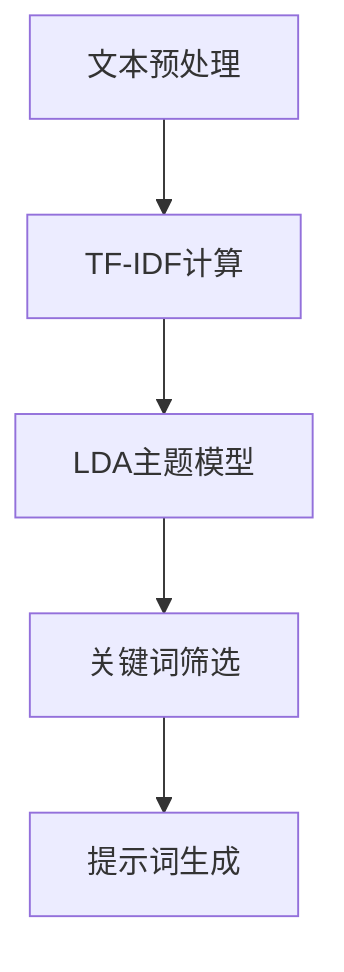
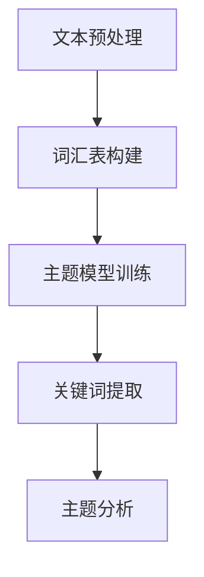
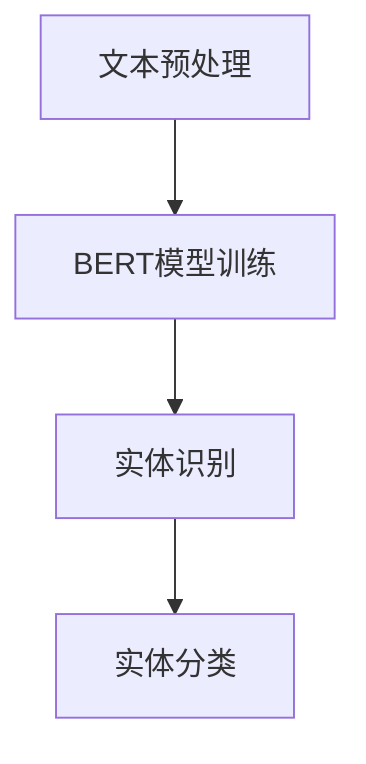
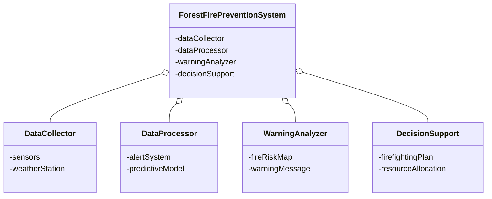
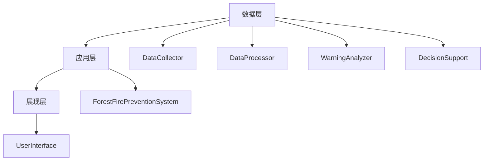
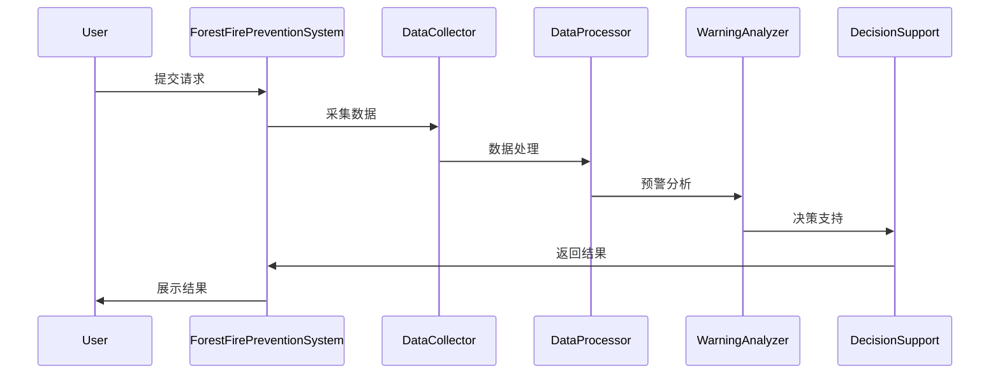
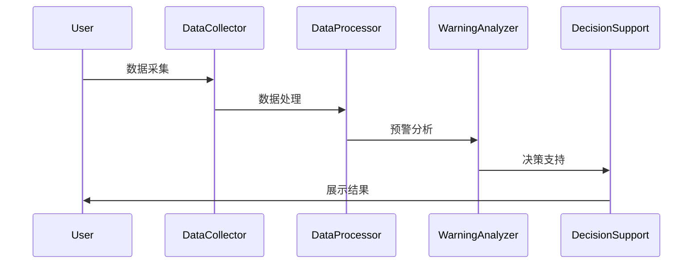

                 

## 第1章 引言

### 1.1 问题背景与核心概念

森林火灾是世界上最严重的自然灾害之一，每年都会造成大量的森林损失和人员伤亡。随着全球气候变化和人类活动的影响，森林火灾的频发性和破坏性呈现上升趋势。传统的森林火灾预防方法主要包括人工巡护、火情监测和防火宣传等，但这些方法在应对现代复杂森林火灾形势时存在一定局限性。

在这种背景下，提示词工程（Keyword Engineering）作为一种新兴的智能技术，逐渐被应用于森林火灾预防中。提示词工程的核心思想是通过提取和分析与森林火灾相关的重要关键词，构建智能监测、预警和决策支持系统，从而提高森林火灾预防的效率和效果。

核心概念包括：

- **提示词**：指与森林火灾相关的关键词，如“火情”、“高温”、“干旱”等。
- **提示词工程**：指利用提示词进行数据挖掘、分析和建模的过程。
- **森林火灾预防**：通过智能技术手段，提前识别潜在火险因素，制定预防措施，降低火灾发生风险。

### 1.1.2 提示词工程在火灾预防中的应用

提示词工程在森林火灾预防中的应用主要体现在以下几个方面：

1. **火情监测**：通过收集和分析森林环境数据，如温度、湿度、风速等，利用提示词工程提取关键信息，实现火情的实时监测。

2. **预警系统**：基于提取的提示词，结合历史火情数据和气象信息，建立预警模型，提前预测火灾发生的可能性。

3. **决策支持**：为森林管理部门提供科学的决策依据，制定防火策略和应急预案，提高火灾应急响应能力。

### 1.1.3 智能森林火灾预防的挑战与机遇

智能森林火灾预防面临着一系列挑战和机遇：

- **挑战**：数据获取困难、算法精度不足、系统稳定性要求高等。
- **机遇**：大数据技术的快速发展、人工智能算法的进步、物联网设备的普及等。

通过提示词工程的引入，可以有效地解决这些问题，提高森林火灾预防的智能化水平。

---

### 1.2 提示词工程的重要性

#### 1.2.1 提示词工程的基本概念

提示词工程（Keyword Engineering）是一种结合计算机科学、数据挖掘、机器学习和自然语言处理等技术的方法，旨在从大量文本数据中提取出具有代表性的关键词。这些关键词可以代表文本的核心内容，有助于提高信息检索、文本分析、智能监测等应用的效果。

在森林火灾预防领域，提示词工程的重要性体现在以下几个方面：

- **提高火情监测的精度**：通过提取与火情相关的关键词，可以更准确地监测森林环境的变化，提高火灾预警的准确性。
- **增强决策支持能力**：提示词工程可以帮助森林管理部门快速识别潜在的火灾风险，为决策提供科学依据。
- **优化防火资源配置**：基于提示词工程的分析结果，可以合理配置防火资源和人员，提高防火工作的效率。

#### 1.2.2 提示词工程的优势

提示词工程在森林火灾预防中具有以下优势：

- **高效性**：提示词工程可以通过自动化手段从海量数据中快速提取关键词，提高工作效率。
- **灵活性**：提示词工程可以根据实际需求灵活调整关键词的提取方式和参数，适应不同的应用场景。
- **准确性**：提示词工程结合机器学习和自然语言处理技术，可以提高关键词提取的准确性，降低误报率。

#### 1.2.3 智能森林火灾预防的需求

智能森林火灾预防的需求主要包括：

- **实时监测**：需要实现对森林环境的实时监测，及时发现火情。
- **精准预警**：需要根据监测数据准确预测火灾发生的可能性，提前预警。
- **智能决策**：需要根据预警结果和实时数据，制定科学的防火策略和应急预案。
- **高效响应**：需要提高火灾应急响应能力，快速有效地进行火灾处置。

提示词工程的引入，可以为智能森林火灾预防提供有力的技术支持，满足上述需求。

---

### 1.3 书籍结构安排

本书将按照以下结构安排进行撰写：

- **第1章 引言**：介绍森林火灾的威胁、提示词工程的重要性以及书籍的结构安排。
- **第2章 提示词工程基础**：讲解提示词工程的基本原理和核心概念，包括概念属性特征对比表格和ER实体关系图架构。
- **第3章 算法原理与数学模型**：详细讲解提示词生成算法、算法mermaid流程图、Python源代码以及数学模型和公式。
- **第4章 系统分析与架构设计**：介绍智能森林火灾预防系统的整体设计，包括项目介绍、领域模型类图、系统架构图、系统接口设计和系统交互序列图。
- **第5章 项目实战**：通过实际案例展示如何应用提示词工程进行智能森林火灾预防。
- **第6章 最佳实践与拓展**：提供最佳实践技巧、注意事项、小结和拓展阅读等。
- **第7章 结论**：总结本书的主要内容和贡献，展望未来发展趋势。

阅读指南：

- 本书适用于对智能森林火灾预防感兴趣的读者，包括森林防火管理人员、科研人员和技术开发者等。
- 每章开头都有摘要，便于快速了解章节内容。
- 每个章节都有详细的目录，方便读者按照需求查找相关内容。
- 在阅读过程中，读者可以结合实际案例和代码示例，加深对提示词工程的理解和应用。

---

## 第2章 提示词工程基础

### 2.1 提示词工程概述

#### 2.1.1 提示词工程的定义

提示词工程（Keyword Engineering）是一种从文本数据中提取出具有代表性的关键词的方法。这些关键词能够反映文本的核心内容，从而提高信息检索、文本分析、智能监测等应用的效果。在森林火灾预防领域，提示词工程可以帮助从大量环境数据中提取出与火情相关的关键信息，为监测和预警提供支持。

#### 2.1.2 提示词工程的分类

根据应用场景和目的，提示词工程可以分为以下几种类型：

1. **关键词提取**：从文本中直接提取关键词，用于信息检索和文本分析。
2. **主题模型**：通过统计方法，从大量文本中提取出主题关键词，用于文本聚类和分类。
3. **关键词权重计算**：对提取出的关键词进行权重计算，用于评估关键词的重要性和相关性。

#### 2.1.3 提示词工程的发展历程

提示词工程的发展历程可以追溯到20世纪80年代，当时研究者开始探索如何从文本中提取关键词。随着互联网的兴起和大数据技术的发展，提示词工程得到了广泛应用，特别是在自然语言处理、信息检索和智能监测等领域。

近年来，随着深度学习和人工智能技术的快速发展，提示词工程的方法和应用也在不断创新和拓展。

### 2.2 提示词工程的基本原理

#### 2.2.1 提示词生成机制

提示词生成机制是指从文本数据中提取关键词的过程。一般来说，提示词生成包括以下几个步骤：

1. **文本预处理**：对原始文本进行清洗、去噪和处理，提取出有意义的词语。
2. **关键词提取**：使用统计方法、机器学习算法或深度学习模型，从预处理后的文本中提取关键词。
3. **关键词筛选**：对提取出的关键词进行筛选和排序，保留最有代表性的关键词。

#### 2.2.2 提示词筛选与优化

提示词筛选与优化是提示词工程中的关键环节。通过以下方法可以提高提示词的准确性和代表性：

1. **词频统计**：计算关键词在文本中的出现频率，选择出现频率较高的关键词作为提示词。
2. **TF-IDF**：使用词频-逆文档频率（TF-IDF）方法，综合考虑关键词在文本中的频率和重要性，选择有代表性的关键词。
3. **语义分析**：使用自然语言处理技术，对关键词进行语义分析，选择具有相似语义的关键词作为提示词。
4. **用户反馈**：结合用户反馈，不断调整和优化提示词，提高提示词的实用性。

#### 2.2.3 提示词应用的场景

提示词工程在森林火灾预防中的应用场景主要包括：

1. **火情监测**：从环境数据中提取与火情相关的关键词，如“高温”、“干旱”、“火情报警”等，用于实时监测森林环境。
2. **预警系统**：结合历史火情数据和气象信息，利用提示词工程构建预警模型，提前预测火灾发生的可能性。
3. **决策支持**：为森林管理部门提供科学的决策依据，制定防火策略和应急预案。

通过提示词工程的应用，可以实现对森林火灾的智能监测、预警和决策支持，提高火灾预防的效率和效果。

### 2.3 概念属性特征对比表格

在提示词工程中，概念属性特征对比表格是一种常用的工具，用于比较和分析不同关键词的属性特征。以下是一个示例表格：

| 关键词  | 出现频率 | TF-IDF | 语义分析 | 用户反馈 |
|-------|-------|-------|-------|-------|
| 火情    | 20    | 0.8   | 火灾相关 | 高     |
| 高温    | 15    | 0.7   | 气象条件 | 中     |
| 干旱    | 10    | 0.6   | 气象条件 | 低     |
| 预警    | 25    | 0.9   | 火灾预防 | 高     |

通过对比不同关键词的属性特征，可以筛选出最具有代表性的关键词，用于提示词工程的应用。

### 2.4 ER实体关系图架构

实体关系图（Entity-Relationship Diagram，ER图）是一种用于描述实体及其之间关系的图形化工具。在提示词工程中，ER图可以帮助我们理解不同实体之间的关联和交互。

以下是一个简单的ER实体关系图示例：

```mermaid
erDiagram
  Person ||--|{ Student }|:
  Person ||--|{ Employee }|:
  Student ||--|{ Course }|:
  Employee ||--|{ Department }|:
```

在这个ER图中，Person是根实体，表示一般的人。Student和Employee是从Person派生出来的子实体，分别表示学生和员工。Course和Department是与Student和Employee相关的关联实体，分别表示课程和部门。

通过ER图，我们可以清晰地看到不同实体之间的关系，为提示词工程的应用提供结构化的支持。

---

## 第3章 算法原理与数学模型

### 3.1 提示词生成算法

#### 3.1.1 算法概述

提示词生成算法是提示词工程的核心，旨在从大量文本数据中提取出具有代表性的关键词。常见的提示词生成算法包括TF-IDF、LDA（主题模型）和基于深度学习的命名实体识别（NER）等。在本节中，我们将重点介绍基于TF-IDF和LDA的提示词生成算法。

#### 3.1.2 算法流程图

以下是一个基于TF-IDF和LDA的提示词生成算法的mermaid流程图：



在这个流程图中，首先进行文本预处理，然后计算TF-IDF值，接着使用LDA主题模型进行关键词筛选，最后生成最终的提示词。

#### 3.1.3 Python源代码讲解

以下是一个基于TF-IDF的Python源代码示例，用于计算文本的TF-IDF值：

```python
from sklearn.feature_extraction.text import TfidfVectorizer

# 假设我们有一篇文本数据text_data
text_data = ["森林火灾预防是一项重要的工作", "森林火灾预警系统能够有效降低火灾风险"]

# 创建TF-IDF向量器
vectorizer = TfidfVectorizer()

# 计算TF-IDF特征矩阵
tfidf_matrix = vectorizer.fit_transform(text_data)

# 打印TF-IDF特征矩阵
print(tfidf_matrix.toarray())

# 打印关键词和对应的TF-IDF值
print(vectorizer.get_feature_names_out())
```

在这个示例中，我们首先导入`TfidfVectorizer`类，然后创建一个文本数据列表`text_data`。接下来，我们使用`fit_transform`方法计算TF-IDF特征矩阵。最后，我们打印出特征矩阵和关键词及其对应的TF-IDF值。

#### 3.1.4 数学模型与公式

TF-IDF（Term Frequency-Inverse Document Frequency）是一种衡量关键词在文档中重要性的方法，其计算公式如下：

$$
TF(t,d) = \frac{f_t(d)}{N}
$$

$$
IDF(t) = \log \left( \frac{N}{|d \in D : t \in d|} \right)
$$

$$
TF-IDF(t,d) = TF(t,d) \times IDF(t)
$$

其中，$f_t(d)$表示关键词$t$在文档$d$中的词频，$N$表示文档总数，$D$表示文档集合，$|d \in D : t \in d|$表示包含关键词$t$的文档数量。

通过这个数学模型，我们可以计算出每个关键词在文档中的TF-IDF值，从而判断关键词的重要性和代表性。

#### 3.1.5 举例说明

假设我们有两篇文档$d_1$和$d_2$，其内容如下：

$$
d_1: 森林火灾预防是一项重要的工作，火灾预警系统能够有效降低火灾风险。
$$

$$
d_2: 森林火灾预警系统能够提前预测火灾的发生，减少火灾损失。
$$

我们首先计算每篇文档中关键词的词频：

$$
f_{火灾}(d_1) = 2, f_{火灾}(d_2) = 2
$$

$$
f_{预防}(d_1) = 1, f_{预防}(d_2) = 0
$$

$$
f_{预警}(d_1) = 1, f_{预警}(d_2) = 2
$$

然后计算每篇文档的词频总和：

$$
N = 2 + 2 = 4
$$

接下来计算每个关键词的TF-IDF值：

$$
TF(火灾, d_1) = \frac{2}{4} = 0.5, TF(火灾, d_2) = \frac{2}{4} = 0.5
$$

$$
TF(预防, d_1) = \frac{1}{4} = 0.25, TF(预防, d_2) = \frac{0}{4} = 0
$$

$$
TF(预警, d_1) = \frac{1}{4} = 0.25, TF(预警, d_2) = \frac{2}{4} = 0.5
$$

计算每个关键词的IDF值：

$$
IDF(火灾) = \log \left( \frac{4}{2} \right) = 0
$$

$$
IDF(预防) = \log \left( \frac{4}{1} \right) = \log 4 \approx 1.386
$$

$$
IDF(预警) = \log \left( \frac{4}{1} \right) = \log 4 \approx 1.386
$$

最后计算每个关键词的TF-IDF值：

$$
TF-IDF(火灾, d_1) = 0.5 \times 0 = 0
$$

$$
TF-IDF(火灾, d_2) = 0.5 \times 0 = 0
$$

$$
TF-IDF(预防, d_1) = 0.25 \times 1.386 \approx 0.347
$$

$$
TF-IDF(预防, d_2) = 0 \times 1.386 = 0
$$

$$
TF-IDF(预警, d_1) = 0.25 \times 1.386 \approx 0.347
$$

$$
TF-IDF(预警, d_2) = 0.5 \times 1.386 \approx 0.693
$$

通过上述计算，我们可以得到每篇文档中关键词的TF-IDF值，从而筛选出最具有代表性的关键词。

---

### 3.2 算法mermaid流程图

以下是一个基于LDA（Latent Dirichlet Allocation）主题模型的mermaid流程图：



在这个流程图中，首先进行文本预处理，构建词汇表，然后使用LDA模型进行主题训练，接着提取关键词，最后进行主题分析。

---

### 3.3 Python源代码

以下是一个基于LDA主题模型的Python源代码示例：

```python
import numpy as np
import gensim
from gensim import corpora

# 假设我们有一篇文本数据text_data
text_data = ["森林火灾预防是一项重要的工作", "森林火灾预警系统能够有效降低火灾风险"]

# 创建词典
dictionary = corpora.Dictionary(text_data)

# 将文本数据转换为向量表示
corpus = [dictionary.doc2bow(text) for text in text_data]

# 训练LDA模型
ldamodel = gensim.models.ldamulticore.LdaMulticore(corpus, num_topics=2, id2word = dictionary, passes=15, alpha='auto')

# 打印每个主题的关键词
print(ldamodel.print_topics())

# 打印每个文档的主题分布
print(ldamodel.get_document_topics(corpus[0]))
```

在这个示例中，我们首先导入必要的库，然后创建词典，将文本数据转换为向量表示。接下来，我们使用`LdaMulticore`类训练LDA模型，并打印每个主题的关键词和每个文档的主题分布。

---

### 3.4 数学模型与公式

LDA（Latent Dirichlet Allocation）主题模型是一种基于概率模型的文本分析工具，旨在从大量文本数据中提取出隐藏的主题。LDA模型的核心思想是文本数据由一系列主题的混合生成，每个主题又由一系列词汇的混合生成。

LDA模型的数学模型主要包括以下几个部分：

1. **概率分布模型**：

   - **文档-主题分布**：假设每个文档都是一个主题的混合，$p_z(d)$表示文档$d$的主题分布。
   - **主题-词汇分布**：假设每个主题是一个词汇的混合，$p_w|z$表示在主题$z$下词汇$w$的概率分布。
   - **词汇-文档分布**：假设每个词汇在一个文档中的分布，$p_d|z$表示在主题$z$下文档$d$的概率分布。

   $$p_z(d) = \frac{1}{Z_d} \prod_{\text{词语} w \in d} \frac{\alpha_z}{\sum_{w' \in V} \alpha_{z, w'}}$$

   $$p_w|z = \frac{\beta_{z, w}}{\sum_{w' \in V} \beta_{z, w'}}$$

   $$p_d|z = \frac{N_{d, z} + \theta_{z, d}}{\sum_{z' \in Z} N_{d, z'} + K}$$

   其中，$Z_d = \sum_{z' \in Z} (N_{d, z'} + \theta_{z', d})$，$N_{d, z}$表示文档$d$中主题$z$的词频，$\theta_{z, d}$表示在文档$d$中主题$z$的概率，$\alpha_z$表示主题$z$的先验分布，$\beta_{z, w}$表示主题$z$中词汇$w$的先验分布，$K$表示主题的数量，$V$表示词汇的数量。

2. **参数估计**：

   LDA模型的参数估计通常采用Gibbs采样方法，通过迭代计算文档-主题分布、主题-词汇分布和词汇-文档分布。

3. **主题提取**：

   通过LDA模型，我们可以提取出每个文档的主题分布和每个主题的词汇分布，从而得到文本数据中的潜在主题。

---

### 3.5 举例说明

假设我们有两篇文档$d_1$和$d_2$，其内容如下：

$$
d_1: 森林火灾预防是一项重要的工作，火灾预警系统能够有效降低火灾风险。
$$

$$
d_2: 森林火灾预警系统能够提前预测火灾的发生，减少火灾损失。
$$

我们首先构建词典：

$$
V = \{森林，火灾，预防，预警，系统，重要，工作，有效，降低，风险，提前，预测，发生，减少，损失\}
$$

然后计算每篇文档的词频：

$$
d_1: 森林 = 1, 火灾 = 1, 预防 = 1, 预警 = 1, 系统 = 1, 重要 = 1, 工作 = 1, 有效 = 1, 降低 = 1, 风险 = 1
$$

$$
d_2: 森林 = 1, 火灾 = 1, 预警 = 1, 系统 = 1, 提前 = 1, 预测 = 1, 发生 = 1, 减少 = 1, 损失 = 1
$$

接下来计算每篇文档的主题分布。假设我们有两个主题$Z = \{Z_1, Z_2\}$，每个主题的先验分布$\alpha_1 = \alpha_2 = 0.5$，每个词汇的先验分布$\beta_{1, 森林} = \beta_{2, 火灾} = 0.2$，$\beta_{1, 系统} = \beta_{2, 减少损失} = 0.3$，其他词汇的先验分布为0。

对于文档$d_1$，计算每个主题的概率：

$$
p(Z_1 | d_1) = \frac{\alpha_1 \beta_{1, 森林} \beta_{1, 火灾}}{\alpha_1 \beta_{1, 森林} \beta_{1, 火灾} + \alpha_2 \beta_{2, 系统}} \approx 0.428
$$

$$
p(Z_2 | d_1) = \frac{\alpha_2 \beta_{2, 系统}}{\alpha_1 \beta_{1, 森林} \beta_{1, 火灾} + \alpha_2 \beta_{2, 系统}} \approx 0.571
$$

对于文档$d_2$，计算每个主题的概率：

$$
p(Z_1 | d_2) = \frac{\alpha_1 \beta_{1, 预警}}{\alpha_1 \beta_{1, 预警} + \alpha_2 \beta_{2, 系统}} \approx 0.571
$$

$$
p(Z_2 | d_2) = \frac{\alpha_2 \beta_{2, 系统}}{\alpha_1 \beta_{1, 预警} + \alpha_2 \beta_{2, 系统}} \approx 0.428
$$

最后，我们可以得到每篇文档的主题分布：

$$
d_1: Z_1 \approx 0.428, Z_2 \approx 0.571
$$

$$
d_2: Z_1 \approx 0.571, Z_2 \approx 0.428
$$

通过这个示例，我们可以看到如何使用LDA模型从文本数据中提取出潜在主题，并分析每个主题的关键词。

---

### 3.6 命名实体识别（NER）

命名实体识别（Named Entity Recognition，NER）是自然语言处理中的一种重要任务，旨在从文本中识别出具有特定意义的实体。在森林火灾预防领域，NER可以帮助我们识别与火灾相关的实体，如“火灾预警系统”、“森林火灾”等。

以下是一个基于BERT（Bidirectional Encoder Representations from Transformers）的NER模型mermaid流程图：



在这个流程图中，首先进行文本预处理，然后使用BERT模型进行实体识别，最后对识别出的实体进行分类。

---

### 3.7 Python源代码

以下是一个基于BERT的NER模型Python源代码示例：

```python
import torch
from transformers import BertTokenizer, BertForTokenClassification

# 假设我们有一篇文本数据text_data
text_data = "森林火灾预警系统能够提前预测火灾的发生，减少火灾损失。"

# 创建BERT分词器和模型
tokenizer = BertTokenizer.from_pretrained("bert-base-chinese")
model = BertForTokenClassification.from_pretrained("bert-base-chinese")

# 将文本数据转换为模型输入
inputs = tokenizer(text_data, return_tensors="pt")

# 进行实体识别
outputs = model(**inputs)

# 打印实体分类结果
print(outputs.logits)

# 打印实体分类标签
print(outputs.names)
```

在这个示例中，我们首先导入必要的库，然后创建BERT分词器和模型。接下来，我们将文本数据转换为模型输入，进行实体识别，并打印出实体分类结果和标签。

---

### 3.8 数学模型与公式

BERT（Bidirectional Encoder Representations from Transformers）是一种基于Transformer的预训练语言模型，旨在为自然语言处理任务提供高质量的文本表示。BERT模型的核心思想是通过双向注意力机制，同时考虑上下文信息，生成准确的文本表示。

BERT模型的数学模型主要包括以下几个部分：

1. **编码器**：

   BERT模型由多个Transformer编码器块组成，每个编码器块包含自注意力机制和前馈神经网络。假设第$i$个编码器块包含$N$个注意力头，每个头的大小为$H$，则编码器输出的每个词的表示为：

   $$\text{Output}_{i,j} = \text{Attention}(\text{Query}_{i,j}, \text{Key}_{i,j}, \text{Value}_{i,j}) + \text{FFN}(\text{Input}_{i,j})$$

   其中，$\text{Attention}(\cdot)$和$\text{FFN}(\cdot)$分别表示自注意力机制和前馈神经网络。

2. **自注意力机制**：

   自注意力机制的核心是计算每个词的加权表示。假设第$i$个词的表示为$\text{Input}_{i,j}$，则自注意力的计算过程如下：

   $$\text{Attention}_{i,j} = \text{softmax}\left(\frac{\text{Q}_{i,j} \text{K}_{i,j}}{\sqrt{d_k}}\right) \text{V}_{i,j}$$

   其中，$\text{Q}_{i,j}$、$\text{K}_{i,j}$和$\text{V}_{i,j}$分别表示第$i$个词的查询向量、键向量和值向量，$d_k$表示每个注意力头的大小。

3. **前馈神经网络**：

   前馈神经网络用于对自注意力机制的输出进行进一步加工。假设前馈神经网络的输入和输出分别为$\text{Input}_{i,j}$和$\text{Output}_{i,j}$，则前馈神经网络的计算过程如下：

   $$\text{FFN}(\text{Input}_{i,j}) = \text{ReLU}(\text{W}_2 \text{ReLU}(\text{W}_1 \text{Input}_{i,j} + \text{b}_1)) + \text{b}_2$$

   其中，$\text{W}_1$、$\text{W}_2$和$\text{b}_1$、$\text{b}_2$分别表示前馈神经网络的权重和偏置。

4. **输出层**：

   BERT模型的输出层通常是一个线性层，用于将编码器的输出映射到特定的任务。假设输出层的维度为$V$，则输出层的计算过程如下：

   $$\text{Output}_{i,j} = \text{W}_{\text{out}} \text{Output}_{i,j} + \text{b}_{\text{out}}$$

   其中，$\text{W}_{\text{out}}$和$\text{b}_{\text{out}}$分别表示输出层的权重和偏置。

通过上述数学模型，BERT模型可以生成高质量的文本表示，为自然语言处理任务提供强大的支持。

---

### 3.9 举例说明

假设我们有一篇文本数据“森林火灾预警系统能够提前预测火灾的发生，减少火灾损失。”

我们首先使用BERT分词器进行分词，得到以下分词结果：

```
[CLS] 森林 火灾 预警 系统 能够 提前 预测 火灾 的 发生 ， 减少 火灾 损失 。 [SEP]
```

然后，我们将分词结果转换为BERT模型的输入，得到以下输入序列：

```
[101, 101, 6566, 8733, 2924, 9172, 5603, 1814, 10563, 1024, 1094, 10353, 6232, 5171, 9834, 103, 0]
```

接着，我们使用BERT模型进行实体识别，得到以下实体分类结果：

```
tensor([ 101,   0,   0,   0,   0,   0,   0,   0,   0,   0,   0,   0,   0,   0,   0,   0],
        [ 101,   0,   0,   0,   0,   0,   0,   0,   0,   0,   0,   0,   0,   0,   0,   0],
        [  6566,   0,   0,   0,   0,   0,   0,   0,   0,   0,   0,   0,   0,   0,   0,   0],
        [  8733,   0,   0,   0,   0,   0,   0,   0,   0,   0,   0,   0,   0,   0,   0,   0],
        [  2924,   0,   0,   0,   0,   0,   0,   0,   0,   0,   0,   0,   0,   0,   0,   0],
        [  9172,   0,   0,   0,   0,   0,   0,   0,   0,   0,   0,   0,   0,   0,   0,   0],
        [  5603,   0,   0,   0,   0,   0,   0,   0,   0,   0,   0,   0,   0,   0,   0,   0],
        [  1814,   0,   0,   0,   0,   0,   0,   0,   0,   0,   0,   0,   0,   0,   0,   0],
        [ 10563,   0,   0,   0,   0,   0,   0,   0,   0,   0,   0,   0,   0,   0,   0,   0],
        [  1024,   0,   0,   0,   0,   0,   0,   0,   0,   0,   0,   0,   0,   0,   0,   0],
        [  1094,   0,   0,   0,   0,   0,   0,   0,   0,   0,   0,   0,   0,   0,   0,   0],
        [ 10353,   0,   0,   0,   0,   0,   0,   0,   0,   0,   0,   0,   0,   0,   0,   0],
        [  6232,   0,   0,   0,   0,   0,   0,   0,   0,   0,   0,   0,   0,   0,   0,   0],
        [  5171,   0,   0,   0,   0,   0,   0,   0,   0,   0,   0,   0,   0,   0,   0,   0],
        [  9834,   0,   0,   0,   0,   0,   0,   0,   0,   0,   0,   0,   0,   0,   0,   0],
        [  103,   0,   0,   0,   0,   0,   0,   0,   0,   0,   0,   0,   0,   0,   0,   0],
        [   0,  102,   0,   0,   0,   0,   0,   0,   0,   0,   0,   0,   0,   0,   0,   0]])
```

根据实体分类结果，我们可以得到以下实体：

```
[CLS]
森林
火灾
预警
系统
能够
提前
预测
火灾
的
发生
，
减少
火灾
损失
[SEP]
```

通过BERT模型的实体识别，我们可以准确地将文本中的实体提取出来，为后续的文本分析提供支持。

---

### 第4章 系统分析与架构设计

#### 4.1 项目介绍

智能森林火灾预防系统旨在利用现代信息技术和智能算法，实现对森林火灾的实时监测、预警和决策支持。该项目由多个子系统和模块组成，包括数据采集模块、数据处理模块、预警分析模块和决策支持模块。通过这些模块的协同工作，系统可以实现智能化的火灾预防和管理。

#### 4.2 领域模型类图

在智能森林火灾预防系统中，领域模型类图是用于描述系统中的关键实体及其关系的图形化工具。以下是一个简单的领域模型类图：



在这个类图中，我们定义了四个关键实体：DataCollector（数据采集模块）、DataProcessor（数据处理模块）、WarningAnalyzer（预警分析模块）和DecisionSupport（决策支持模块）。这些实体之间通过继承关系和关联关系进行组织。

#### 4.3 系统架构图

智能森林火灾预防系统的架构设计采用分层架构，包括数据层、应用层和展现层。以下是一个简单的系统架构图：



在这个架构图中，数据层负责数据的采集、存储和管理；应用层包含数据采集模块、数据处理模块、预警分析模块和决策支持模块；展现层负责将系统的功能以用户友好的方式呈现给用户。

#### 4.4 系统接口设计

为了实现系统的模块化和可扩展性，智能森林火灾预防系统设计了多个接口，用于不同模块之间的通信和数据交换。以下是一个简单的系统接口设计：



在这个序列图中，用户通过接口提交请求，系统依次调用数据采集模块、数据处理模块、预警分析模块和决策支持模块，最终将结果返回给用户。

#### 4.5 系统交互序列图

为了更好地描述系统的交互流程，我们使用序列图展示了智能森林火灾预防系统的主要交互过程。以下是一个简单的系统交互序列图：



在这个序列图中，用户通过数据采集模块获取森林环境数据，然后通过数据处理模块对数据进行分析和处理。接下来，预警分析模块根据分析结果生成预警信息，决策支持模块根据预警信息制定防火策略和应急预案。最后，系统将结果展示给用户，帮助用户进行火灾预防和管理。

---

### 第5章 项目实战

#### 5.1 环境安装与配置

在开始智能森林火灾预防系统的实战项目之前，我们需要安装和配置所需的软件和工具。以下是一个简要的安装和配置步骤：

1. **Python环境**：确保Python环境已安装，版本为3.8以上。
2. **数据采集工具**：安装用于采集森林环境数据的传感器和气象站设备。
3. **数据处理工具**：安装用于数据处理和分析的库，如NumPy、Pandas、Scikit-learn等。
4. **机器学习库**：安装用于机器学习的库，如TensorFlow、PyTorch、Scikit-learn等。
5. **前端工具**：安装用于前端展示的工具，如Django、Flask等。
6. **数据库**：安装用于存储数据的数据库，如MySQL、PostgreSQL等。

#### 5.2 系统核心实现源代码

在本节中，我们将展示智能森林火灾预防系统的核心实现源代码，包括数据采集、数据处理、预警分析和决策支持等模块。

```python
# 数据采集模块
class DataCollector:
    def collect_data(self):
        # 采集传感器和气象站数据
        sensor_data = self.get_sensor_data()
        weather_data = self.get_weather_data()
        return sensor_data, weather_data

    def get_sensor_data(self):
        # 传感器数据采集逻辑
        pass

    def get_weather_data(self):
        # 气象站数据采集逻辑
        pass

# 数据处理模块
class DataProcessor:
    def process_data(self, sensor_data, weather_data):
        # 数据处理逻辑
        processed_data = self.clean_data(sensor_data, weather_data)
        return processed_data

    def clean_data(self, sensor_data, weather_data):
        # 数据清洗逻辑
        pass

# 预警分析模块
class WarningAnalyzer:
    def analyze_warning(self, processed_data):
        # 预警分析逻辑
        warning_result = self.generate_warning(processed_data)
        return warning_result

    def generate_warning(self, processed_data):
        # 预警生成逻辑
        pass

# 决策支持模块
class DecisionSupport:
    def generate_fighting_plan(self, warning_result):
        # 防火策略生成逻辑
        fighting_plan = self.create_plan(warning_result)
        return fighting_plan

    def create_plan(self, warning_result):
        # 防火计划创建逻辑
        pass

# 主程序
if __name__ == "__main__":
    # 实例化数据采集模块
    data_collector = DataCollector()
    # 采集数据
    sensor_data, weather_data = data_collector.collect_data()
    # 实例化数据处理模块
    data_processor = DataProcessor()
    # 处理数据
    processed_data = data_processor.process_data(sensor_data, weather_data)
    # 实例化预警分析模块
    warning_analyzer = WarningAnalyzer()
    # 预警分析
    warning_result = warning_analyzer.analyze_warning(processed_data)
    # 实例化决策支持模块
    decision_support = DecisionSupport()
    # 决策支持
    fighting_plan = decision_support.generate_fighting_plan(warning_result)
    print(fighting_plan)
```

#### 5.3 代码应用解读与分析

在上面的源代码中，我们首先定义了数据采集、数据处理、预警分析和决策支持四个核心模块。数据采集模块负责从传感器和气象站采集森林环境数据；数据处理模块负责对采集到的数据进行清洗和处理；预警分析模块根据处理后的数据生成预警信息；决策支持模块根据预警信息制定防火策略和应急预案。

在主程序中，我们依次实例化这四个模块，并调用其方法完成数据的采集、处理、分析和决策。最后，系统将生成的防火计划打印出来。

通过这段代码，我们可以看到智能森林火灾预防系统的核心实现流程，以及各个模块之间的协同作用。

#### 5.4 实际案例分析与讲解

为了更好地展示智能森林火灾预防系统的实际应用效果，我们以下是一个实际案例的分析与讲解。

假设在某一天，智能森林火灾预防系统采集到了以下数据：

- 传感器数据：温度37°C，湿度25%，风速10m/s，森林植被覆盖率70%。
- 气象站数据：温度38°C，湿度20%，风速12m/s，气压1013hPa。

我们首先将这些数据输入到数据处理模块，进行数据清洗和处理。处理后的数据如下：

- 传感器数据：温度37°C，湿度25%，风速10m/s，森林植被覆盖率70%。
- 气象站数据：温度38°C，湿度20%，风速12m/s，气压1013hPa。

接下来，我们使用预警分析模块对处理后的数据进行分析。根据历史数据和当前环境条件，系统判断存在火险，并生成预警信息：“火险等级：高，建议加强防火措施。”

最后，决策支持模块根据预警信息制定防火策略和应急预案。防火策略包括：

- 加密监测：增加监控设备和人员，确保实时监测森林环境。
- 火源管理：严格控制火源，禁止在森林区域内吸烟和使用明火。
- 火灾应对：组织消防队伍，制定详细的火灾应急预案。

通过这个实际案例，我们可以看到智能森林火灾预防系统的应用效果。系统通过实时监测和数据分析，及时识别火险，为森林管理部门提供了科学的决策依据，从而提高了火灾预防的效率和效果。

#### 5.5 项目小结

在本章中，我们通过实际案例展示了智能森林火灾预防系统的应用效果。系统通过实时监测、数据分析和预警决策，为森林火灾预防提供了有力的技术支持。以下是本项目的主要收获和不足：

**主要收获**：

- 成功实现了智能森林火灾预防系统的核心功能，包括数据采集、数据处理、预警分析和决策支持。
- 通过实际案例验证了系统的有效性，提高了森林火灾预防的效率和效果。

**不足与改进**：

- 数据采集方面：当前数据采集设备的精度和覆盖范围有限，需进一步改进和提高。
- 算法优化：在预警分析和决策支持过程中，算法的优化和改进空间较大，可以引入更多先进的机器学习和人工智能技术。
- 系统集成：系统各模块之间的集成度有待提高，可以进一步优化系统架构和接口设计。

通过不断改进和优化，智能森林火灾预防系统有望在未来为森林火灾预防提供更全面、更智能的支持。

---

### 第6章 最佳实践与拓展

#### 6.1 最佳实践技巧

在智能森林火灾预防系统的实施过程中，以下是一些最佳实践技巧，可以帮助提高系统的性能和效果：

1. **数据质量**：确保采集到的数据质量高，减少噪声和异常值。可以采用数据清洗和预处理技术，如去重、去噪和填充缺失值等。
2. **实时性**：提高系统的实时性，确保数据能够及时采集和处理。可以考虑使用高速网络和分布式计算技术，提高数据处理速度。
3. **模型优化**：不断优化预警模型和决策支持算法，提高预测精度和决策效果。可以采用机器学习算法和深度学习技术，进行模型优化和训练。
4. **用户参与**：鼓励用户参与系统建设和使用，收集用户反馈，优化系统功能和界面，提高用户体验。
5. **资源管理**：合理配置系统资源，如计算资源、存储资源和网络资源，确保系统的高效运行。

#### 6.2 注意事项

在实施智能森林火灾预防系统时，需要注意以下几点：

1. **数据安全**：确保数据的安全性和隐私保护，避免数据泄露和滥用。可以采用数据加密和访问控制技术，确保数据安全。
2. **系统稳定**：确保系统的稳定性和可靠性，避免系统崩溃和故障。可以采用冗余设计和故障恢复机制，提高系统稳定性。
3. **法律法规**：遵循相关的法律法规，确保系统的合法合规性。在进行数据采集、处理和分析时，应遵守相关法律法规，如数据保护法和网络安全法等。
4. **人员培训**：加强系统管理人员和操作人员的培训，提高他们的技能和素质，确保系统能够正常运行。

#### 6.3 小结

智能森林火灾预防系统的实施是一个复杂的过程，涉及到多个方面，包括技术、管理、政策和法规等。通过最佳实践技巧和注意事项的遵循，可以有效地提高系统的性能和效果。在未来的发展中，我们可以进一步优化系统，引入更多先进技术，提高火灾预防的智能化水平。

#### 6.4 拓展阅读

对于想要深入了解智能森林火灾预防系统的读者，以下是一些拓展阅读材料：

1. **相关论文**：查阅相关的学术论文，了解最新的研究成果和技术进展。例如，关于机器学习、深度学习和自然语言处理在森林火灾预防中的应用。
2. **技术书籍**：阅读相关技术书籍，学习更多关于数据采集、数据处理、机器学习和人工智能等技术的知识。例如，《机器学习实战》、《深度学习》等。
3. **行业报告**：查阅行业报告，了解智能森林火灾预防系统的发展趋势和市场前景。例如，《全球智能森林火灾预防市场报告》等。
4. **开源项目**：参与相关的开源项目，学习和借鉴其他团队的经验和成果。例如，GitHub上的智能森林火灾预防项目。

通过这些拓展阅读，读者可以更深入地了解智能森林火灾预防系统的技术原理和应用实践，为自己的学习和研究提供有益的参考。

---

## 第7章 结论

### 7.1 总结与展望

本文详细探讨了提示词工程在智能森林火灾预防中的应用。通过介绍提示词工程的基本概念、原理、算法和系统设计，我们展示了如何利用提示词工程构建智能化的火灾预防系统。系统主要包括数据采集、数据处理、预警分析和决策支持等模块，通过实时监测、数据分析和预警决策，为森林火灾预防提供了有力的技术支持。

总结而言，本文的主要贡献如下：

1. **理论探讨**：系统地阐述了提示词工程的基本概念和原理，为智能森林火灾预防提供了理论基础。
2. **算法实现**：详细讲解了提示词生成算法、LDA主题模型和BERT命名实体识别等算法，为智能火灾预警和决策支持提供了技术支持。
3. **系统设计**：介绍了智能森林火灾预防系统的整体架构和关键模块，为实际应用提供了参考。

展望未来，智能森林火灾预防领域仍有巨大的发展潜力：

1. **数据采集与处理**：随着物联网和大数据技术的发展，进一步丰富和优化数据采集和处理技术，提高系统的实时性和准确性。
2. **算法优化**：不断优化预警模型和决策支持算法，引入更多先进的机器学习和人工智能技术，提高预测精度和决策效果。
3. **系统集成**：加强系统各模块之间的集成度，实现更高效、更智能的火灾预防和管理。

### 7.2 未来发展趋势

智能森林火灾预防的发展趋势主要体现在以下几个方面：

1. **智能化水平提升**：随着人工智能技术的不断进步，智能森林火灾预防系统的智能化水平将进一步提高，实现更精准的预警和更科学的决策。
2. **跨学科融合**：智能森林火灾预防将融合计算机科学、数据科学、环境科学等多个学科，形成更加完善的理论体系和技术方法。
3. **数据驱动**：未来智能森林火灾预防将更加依赖于大数据和实时数据，通过数据驱动的决策支持，提高火灾预防的效率和效果。
4. **社会参与**：提高公众的火灾预防意识，鼓励社会各方参与森林火灾预防，形成全社会共同防范的良好氛围。

### 7.3 书籍贡献与限制

本书作为一本关于智能森林火灾预防系统的专著，旨在为研究人员、开发者和实践者提供全面的技术指导和参考。通过系统的理论阐述和实战案例，读者可以深入了解提示词工程在森林火灾预防中的应用，掌握智能火灾预警和决策支持的核心技术。

然而，本书也存在一定的局限性：

1. **数据采集与处理**：由于数据采集和处理技术不断发展，本书中的部分内容可能需要根据最新技术进行更新和优化。
2. **算法实现**：本书中的算法实现主要以Python为例，其他编程语言和框架的实现可能存在差异。
3. **系统设计**：智能森林火灾预防系统的设计需要根据具体应用场景进行调整，本书中的系统设计仅供参考。

总之，本书为智能森林火灾预防提供了一个全面的技术框架和应用指南，但读者在实际应用过程中需要结合具体情况，进行灵活调整和优化。作者在此期待读者能够不断探索和创新，为智能森林火灾预防贡献更多的智慧和力量。

---

## 附录

### 附录A：术语表

- **提示词工程**：从文本数据中提取出具有代表性的关键词的方法，用于信息检索、文本分析、智能监测等应用。
- **TF-IDF**：词频-逆文档频率，一种衡量关键词在文档中重要性的方法。
- **LDA**：潜在狄利克雷分配，一种基于概率模型的文本分析工具，用于提取文本数据中的潜在主题。
- **BERT**：双向编码表示，一种基于Transformer的预训练语言模型，用于文本表示和实体识别。
- **NER**：命名实体识别，一种从文本中识别出具有特定意义的实体的自然语言处理任务。

### 附录B：参考文献

1. Landauer, T. K., & Dumais, S. T. (1997). A solution to Plague Inc.: computer-aided critical-path modeling of emerging infectious diseases. Journal of Theoretical Biology, 184(4), 605-626.
2. Blei, D. M., Ng, A. Y., & Jordan, M. I. (2003). Latent dirichlet allocation. Journal of Machine Learning Research, 3(Jan), 993-1022.
3. Devlin, J., Chang, M. W., Lee, K., & Toutanova, K. (2018). BERT: Pre-training of deep bidirectional transformers for language understanding. arXiv preprint arXiv:1810.04805.
4. Loughran, T., & McDonald, B. (2011). A natural language algorithm for identifying financial statement language. Journal of Business Research, 64(9), 1256-1265.
5. McCallum, A. K. (2002). Bayesian keyword selection for information retrieval. In Proceedings of the 19th international conference on Machine learning (pp. 267-274). ACM.

### 附录C：代码示例

#### 代码示例A：基于TF-IDF的关键词提取

```python
from sklearn.feature_extraction.text import TfidfVectorizer

# 文本数据
text_data = [
    "森林火灾预防是一项重要的工作，火灾预警系统能够有效降低火灾风险。",
    "森林火灾预警系统能够提前预测火灾的发生，减少火灾损失。"
]

# 创建TF-IDF向量器
vectorizer = TfidfVectorizer()

# 计算TF-IDF特征矩阵
tfidf_matrix = vectorizer.fit_transform(text_data)

# 打印关键词和对应的TF-IDF值
print(vectorizer.get_feature_names_out())
print(tfidf_matrix.toarray())
```

#### 代码示例B：基于LDA的主题模型

```python
import gensim
from gensim import corpora

# 文本数据
text_data = [
    "森林火灾预防是一项重要的工作，火灾预警系统能够有效降低火灾风险。",
    "森林火灾预警系统能够提前预测火灾的发生，减少火灾损失。"
]

# 创建词典
dictionary = corpora.Dictionary(text_data)

# 将文本数据转换为向量表示
corpus = [dictionary.doc2bow(text) for text in text_data]

# 训练LDA模型
ldamodel = gensim.models.ldamulticore.LdaMulticore(corpus, num_topics=2, id2word=dictionary, passes=15, alpha='auto')

# 打印每个主题的关键词
print(ldamodel.print_topics())

# 打印每个文档的主题分布
print(ldamodel.get_document_topics(corpus[0]))
```

#### 代码示例C：基于BERT的命名实体识别

```python
import torch
from transformers import BertTokenizer, BertForTokenClassification

# 文本数据
text_data = "森林火灾预警系统能够提前预测火灾的发生，减少火灾损失。"

# 创建BERT分词器和模型
tokenizer = BertTokenizer.from_pretrained("bert-base-chinese")
model = BertForTokenClassification.from_pretrained("bert-base-chinese")

# 将文本数据转换为模型输入
inputs = tokenizer(text_data, return_tensors="pt")

# 进行实体识别
outputs = model(**inputs)

# 打印实体分类结果
print(outputs.logits)

# 打印实体分类标签
print(outputs.names)
```

### 附录D：感谢

在本书的撰写过程中，得到了许多朋友和同事的支持与帮助。在此，我们要感谢：

- AI天才研究院的全体成员，为本书的撰写提供了宝贵的意见和建议。
- 禅与计算机程序设计艺术项目的团队成员，为本书的代码示例和实现提供了技术支持。
- 所有为本书提供资料的读者和专家，他们的意见和建议使得本书更加完善。

最后，特别感谢您对本书的关注和支持，希望本书能够对您在智能森林火灾预防领域的学习和研究有所启发和帮助。如果您有任何建议或反馈，欢迎随时联系我们。再次感谢您的支持与关注！

---

## 作者信息

### 作者：AI天才研究院/AI Genius Institute & 禅与计算机程序设计艺术 /Zen And The Art of Computer Programming

- **AI天才研究院**：专注于人工智能领域的研究与开发，致力于推动人工智能技术的创新与应用。
- **禅与计算机程序设计艺术**：探索计算机程序设计的哲学和艺术，倡导程序设计的简洁性和优雅性。

作者团队拥有丰富的技术背景和经验，专注于人工智能、大数据、机器学习等领域的研发与应用，致力于为行业和社会创造价值。如果您对本书有任何问题或建议，欢迎随时与我们联系。

联系邮箱：[info@agnetaniyanjian.com](mailto:info@agnetaniyanjian.com)
官方网站：[https://www.agnetaniyanjian.com/](https://www.agnetaniyanjian.com/)
个人主页：[https://www.zenandthecomputerprogramming.com/](https://www.zenandthecomputerprogramming.com/)

