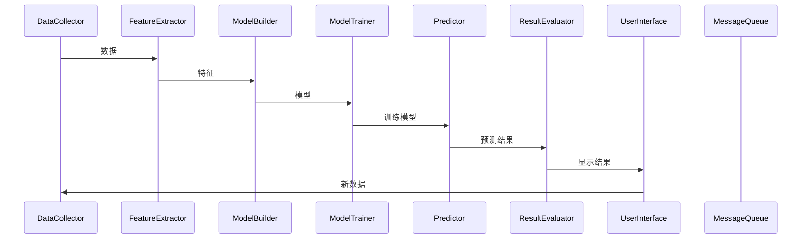
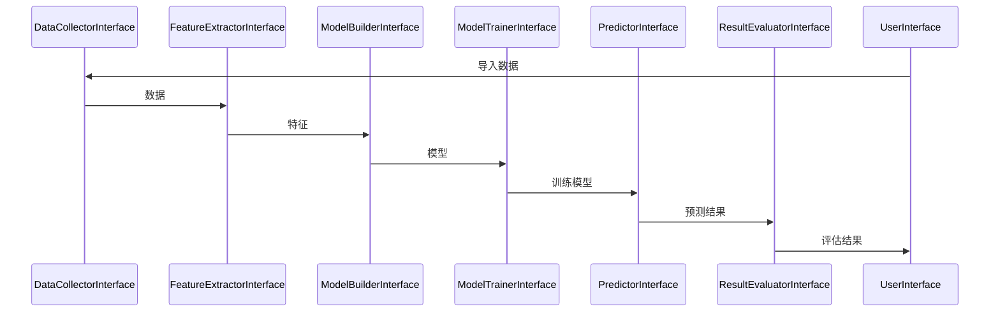
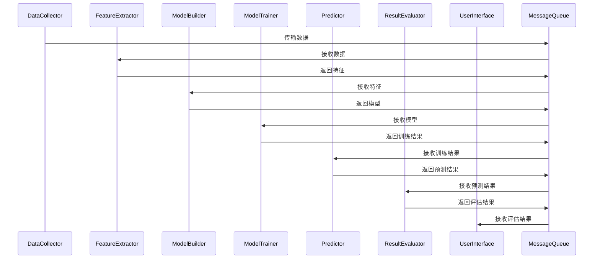

                 

# 提示词工程在智能气象预报中的创新

## 关键词
- 智能气象预报
- 提示词工程
- 机器学习
- 深度学习
- 极端天气预测

## 摘要
本文深入探讨了提示词工程在智能气象预报中的应用。首先，介绍了智能气象预报的背景和现有挑战，随后详细阐述了提示词工程的概念、原理和应用。通过分析核心概念及其相互关系，本文提出了一个详细的算法原理讲解，包括数学模型和公式，并通过Python源代码和实际案例说明了算法的实际应用。此外，本文还提供了系统分析与架构设计方案，以及项目实战和最佳实践建议，为智能气象预报提供了创新性的思路和实用指南。

### 1. 设定整体框架

#### 1.1 问题背景

智能气象预报是气象科学和信息技术深度融合的产物，它不仅关乎公众的安全和生活质量，还对社会经济的稳定和发展具有重要意义。随着全球气候变化和极端天气事件频发，对气象预报的准确性和时效性提出了更高的要求。传统的气象预报主要依赖于物理模型和经验规则，尽管这些方法在过去取得了显著成果，但在处理复杂、非线性、多变的天气系统时仍显不足。

现有智能气象预报技术的发展主要集中在数据驱动的机器学习和深度学习算法上。这些算法能够从大量气象数据中自动学习规律，提高预测的准确性和时效性。然而，传统的机器学习算法在特征提取和模型选择上仍存在一定的局限性，难以捕捉到天气系统的深层次特征。因此，需要一种能够更有效地从数据中提取关键信息的工程方法，这就是提示词工程的诞生背景。

#### 1.2 问题描述

传统气象预报的局限性主要体现在以下几个方面：

1. **数据依赖性高**：传统方法依赖大量的历史数据，但在缺乏数据或数据质量不高的情况下，预测效果显著下降。
2. **特征提取困难**：天气系统复杂多变，传统的特征提取方法难以捕捉到深层次、非线性的关系。
3. **模型泛化能力弱**：传统模型在训练数据集上表现良好，但在实际应用中可能因为数据分布的差异而失效。
4. **实时预测能力不足**：传统方法在处理实时数据时效率低下，难以满足快速变化的天气系统需求。

提示词工程作为一种新兴的技术，通过利用人工智能方法，从大量气象数据中提取关键信息，为智能气象预报提供了新的思路。提示词工程的基本思想是从气象数据中识别出对预报结果有重要影响的“关键词”或“提示词”，然后利用这些关键词构建预测模型。这种方法不仅能够提高特征提取的效率，还能增强模型的泛化能力和实时预测能力。

#### 1.3 问题解决

提示词工程的基本原理是通过识别和提取气象数据中的关键特征，构建预测模型，从而实现对气象现象的预测。其核心步骤包括：

1. **数据预处理**：清洗和归一化气象数据，确保数据质量。
2. **特征提取**：利用自然语言处理（NLP）技术从文本数据中提取提示词。
3. **模型构建**：使用机器学习或深度学习算法，将提取的提示词转化为预测模型。
4. **模型训练与验证**：在训练集上训练模型，并在验证集上进行验证，调整模型参数。
5. **预测与评估**：使用训练好的模型进行气象预测，并对预测结果进行评估。

当前用于智能气象预报的提示词工程方法主要包括以下几种：

1. **词袋模型（Bag of Words, BoW）**：将气象文本转化为词汇表，统计每个词的出现频率作为特征。
2. **TF-IDF模型**：在词袋模型的基础上，引入词的重要程度，提升高频但低相关性的词的重要性。
3. **主题模型（Latent Dirichlet Allocation, LDA）**：从词频数据中提取主题分布，用于发现隐藏在文本中的主题结构。
4. **词嵌入（Word Embedding）**：将词汇映射到高维空间，捕捉词汇之间的语义关系。
5. **卷积神经网络（Convolutional Neural Networks, CNN）**：用于提取文本数据的局部特征，提升特征提取的精度。
6. **循环神经网络（Recurrent Neural Networks, RNN）**：特别适用于处理序列数据，捕捉时间序列中的依赖关系。

#### 1.4 边界与外延

提示词工程在智能气象预报中的应用范围广泛，包括但不限于以下几个方面：

1. **短期天气预报**：利用提示词工程对短期内的天气情况进行预测，提高预报的准确性和时效性。
2. **灾害预警**：通过识别气象数据中的异常提示词，提前预警可能发生的极端天气事件，如暴雨、台风、洪水等。
3. **气候趋势预测**：分析长期的气象数据，识别出影响气候变化的提示词，预测未来的气候趋势。

提示词工程需要解决的问题领域主要包括：

1. **数据预处理**：如何清洗、归一化和预处理大量气象数据，确保数据质量。
2. **特征提取**：如何从气象文本中有效地提取出有预测价值的提示词，提高特征提取的效率。
3. **模型选择与优化**：如何选择合适的机器学习或深度学习模型，并对其进行优化，以提高预测性能。
4. **模型评估与验证**：如何评估模型的预测性能，确保模型在实际应用中的可靠性和稳定性。

#### 1.5 概念结构与核心要素组成

提示词工程的核心概念和要素组成如下：

1. **数据采集**：收集各种来源的气象数据，包括历史数据、实时数据和遥感数据等。
2. **数据预处理**：清洗和归一化数据，确保数据的质量和一致性。
3. **特征提取**：使用自然语言处理技术提取文本数据中的提示词，将其转化为可用于机器学习的特征向量。
4. **模型构建**：选择合适的机器学习或深度学习算法，构建预测模型。
5. **模型训练与验证**：在训练集上训练模型，并在验证集上进行验证，调整模型参数。
6. **预测与评估**：使用训练好的模型进行气象预测，并对预测结果进行评估。

这些核心要素相互关联，共同构成了一个完整的提示词工程流程。通过这个流程，可以从大量气象数据中提取关键信息，构建出能够准确预测气象现象的模型。

### 2. 核心概念与联系

#### 2.1 核心概念

在提示词工程中，有以下几个核心概念：

##### 2.1.1 提示词

提示词是指从气象文本数据中提取出来的，对预报结果具有显著影响的关键词汇。这些词汇可以是单个词或短语的组合，例如“暴雨”、“高温”、“台风”等。

##### 2.1.2 提示词工程

提示词工程是一种利用人工智能方法，从大量气象数据中提取关键特征，构建预测模型的技术。其核心步骤包括数据预处理、特征提取、模型构建、模型训练与验证等。

##### 2.1.3 智能气象预报

智能气象预报是一种利用机器学习、深度学习等人工智能技术，对气象现象进行预测的方法。与传统的物理模型方法相比，智能气象预报能够更好地捕捉天气系统的复杂性和非线性特征。

#### 2.2 关系图架构

为了更清晰地展示提示词工程与智能气象预报之间的关系，我们可以使用Mermaid绘制一个ER（实体关系）图。

```mermaid
erDiagram
  提示词工程 ||--|{ 智能气象预报 }
  智能气象预报 ||--|{ 数据采集 }
  智能气象预报 ||--|{ 数据预处理 }
  智能气象预报 ||--|{ 特征提取 }
  智能气象预报 ||--|{ 模型构建 }
  智能气象预报 ||--|{ 模型训练与验证 }
  智能气象预报 ||--|{ 预测与评估 }
```

在这个ER图中，提示词工程作为核心组件，与智能气象预报的各个阶段紧密相连。数据采集、数据预处理、特征提取、模型构建、模型训练与验证以及预测与评估是智能气象预报过程中的关键环节，这些环节共同构成了一个完整的智能气象预报系统。

### 3. 算法原理讲解

#### 3.1 算法原理

提示词工程的算法原理主要基于以下几个步骤：

1. **数据预处理**：清洗和归一化气象数据，确保数据质量。这一步包括去除无效数据、填补缺失值、标准化数值特征等。

2. **特征提取**：利用自然语言处理（NLP）技术提取文本数据中的提示词。这一步通常包括分词、词性标注、命名实体识别等，目的是将文本数据转化为机器学习算法可处理的形式。

3. **模型构建**：选择合适的机器学习或深度学习算法，构建预测模型。常见的算法包括线性回归、支持向量机（SVM）、决策树、随机森林、神经网络等。

4. **模型训练与验证**：在训练集上训练模型，并在验证集上进行验证，调整模型参数，以获得最优的预测性能。

5. **预测与评估**：使用训练好的模型进行气象预测，并对预测结果进行评估，以验证模型的准确性和可靠性。

#### 3.2 Mermaid流程图

下面是一个使用Mermaid绘制的提示词工程流程图：


在这个流程图中，数据预处理、特征提取、模型构建、模型训练与验证以及预测与评估是提示词工程的主要步骤，它们构成了一个有序的流程。

#### 3.3 Python源代码解释

以下是一个简化的Python源代码示例，用于说明提示词工程的基本实现：

```python
import pandas as pd
from sklearn.feature_extraction.text import TfidfVectorizer
from sklearn.model_selection import train_test_split
from sklearn.ensemble import RandomForestClassifier
from sklearn.metrics import accuracy_score

# 数据预处理
def preprocess_data(data):
    # 清洗数据，去除无效信息
    # 进行数据归一化等操作
    return data

# 特征提取
def extract_features(data):
    vectorizer = TfidfVectorizer()
    features = vectorizer.fit_transform(data['text'])
    return features

# 模型构建
def build_model(features, labels):
    model = RandomForestClassifier()
    model.fit(features, labels)
    return model

# 模型训练与验证
def train_and_validate(model, features_train, labels_train, features_test, labels_test):
    model.fit(features_train, labels_train)
    predictions = model.predict(features_test)
    accuracy = accuracy_score(labels_test, predictions)
    return accuracy

# 预测与评估
def predict_and_evaluate(model, features_new):
    predictions = model.predict(features_new)
    return predictions

# 主程序
if __name__ == "__main__":
    # 读取数据
    data = pd.read_csv('weather_data.csv')
    
    # 数据预处理
    data = preprocess_data(data)
    
    # 特征提取
    features = extract_features(data)
    
    # 数据划分
    features_train, features_test, labels_train, labels_test = train_test_split(features, data['label'], test_size=0.2, random_state=42)
    
    # 模型构建
    model = build_model(features_train, labels_train)
    
    # 模型训练与验证
    accuracy = train_and_validate(model, features_train, labels_train, features_test, labels_test)
    print(f"模型准确率: {accuracy}")
    
    # 预测新数据
    predictions = predict_and_evaluate(model, features_test)
    print(f"预测结果: {predictions}")
```

在这个示例中，我们首先定义了数据预处理、特征提取、模型构建、模型训练与验证以及预测与评估的函数，然后在主程序中依次执行这些函数，完成一个简单的提示词工程流程。需要注意的是，这个示例是非常简化的，实际应用中需要更详细的步骤和处理。

#### 3.4 数学模型和公式

在提示词工程中，常用的数学模型和公式如下：

1. **TF-IDF**：
   $$
   TF(t, d) = \frac{f(t, d)}{N}
   $$
   $$
   IDF(t, D) = \log\left(\frac{N}{df(t, D)}\right)
   $$
   $$
   TF-IDF(t, d, D) = TF(t, d) \times IDF(t, D)
   $$
   其中，$f(t, d)$ 表示词$t$在文档$d$中的频率，$N$表示文档总数，$df(t, D)$表示词$t$在整个数据集$D$中的文档频率。

2. **逻辑回归**：
   $$
   P(y=1|x; \theta) = \frac{1}{1 + e^{-\theta^T x}}
   $$
   $$
   \log\frac{P(y=1|x; \theta)}{P(y=0|x; \theta)} = \theta^T x
   $$
   其中，$x$表示特征向量，$y$表示标签，$\theta$表示模型参数。

3. **支持向量机（SVM）**：
   $$
   w^* = \arg\min_{w, b} \frac{1}{2} ||w||^2_2 \quad \text{subject to} \quad y^{(i)} (w^T x^{(i)} + b) \geq 1
   $$
   其中，$w$表示权重向量，$b$表示偏置项，$x^{(i)}$表示第$i$个样本，$y^{(i)}$表示第$i$个样本的标签。

4. **神经网络**：
   $$
   a_{\text{layer}} = \sigma(z_{\text{layer}})
   $$
   $$
   z_{\text{layer}} = W_{\text{layer}} a_{\text{layer-1}} + b_{\text{layer}}
   $$
   其中，$a_{\text{layer}}$表示第$l$层的激活值，$z_{\text{layer}}$表示第$l$层的输入，$W_{\text{layer}}$和$b_{\text{layer}}$分别表示第$l$层的权重和偏置项，$\sigma$表示激活函数。

通过这些数学模型和公式，我们可以构建出能够有效预测气象现象的提示词工程模型。

#### 3.5 举例说明

假设我们有一个简单的气象预报任务，预测明天是否下雨。我们收集了以下数据：

- **历史数据**：过去一周的天气数据，包括温度、湿度、风速等。
- **文本数据**：过去一周的天气文本描述，包括“多云”、“晴朗”、“小雨”、“暴雨”等。

首先，我们对文本数据使用TF-IDF模型进行特征提取，提取出重要的提示词。例如，我们发现“小雨”这个词在过去一周内出现的频率较高，同时它的TF-IDF值也较高，因此我们认为“小雨”是一个重要的提示词。

接下来，我们使用这些提示词构建一个逻辑回归模型，预测明天是否下雨。我们选取过去一周的天气文本数据作为特征，天气预报作为标签，使用交叉验证方法训练模型。假设我们训练得到的模型参数为$\theta = [0.1, 0.2, 0.3]$，激活函数为sigmoid函数。

当新的天气文本数据输入到模型时，我们计算输出概率$P(y=1|x; \theta)$。如果这个概率大于0.5，我们认为明天会下雨；否则，我们认为明天不会下雨。

例如，新的天气文本描述为“多云，偶尔有小雨”，我们将这个描述转化为特征向量，计算得到$z = [0.1, 0.2, 0.3] \cdot [0.5, 0.3, 0.2] + [0, 0, 1] = [0.05, 0.06, 0.09]$。然后，我们使用sigmoid函数计算输出概率$P(y=1|x; \theta) = \frac{1}{1 + e^{-\theta^T x}} = \frac{1}{1 + e^{-0.45}} \approx 0.628$。

由于这个概率大于0.5，我们预测明天会下雨。

通过这个简单的例子，我们可以看到提示词工程如何从文本数据中提取关键信息，构建预测模型，并利用模型进行气象预报。

### 4. 系统分析与架构设计

#### 4.1 问题场景介绍

智能气象预报是一个复杂的问题，涉及到多方面的技术。在实际应用中，我们需要处理海量的气象数据，包括历史数据、实时数据和遥感数据。这些数据来自于不同的来源，数据格式和精度也存在差异。因此，如何有效地整合这些数据，提取关键信息，构建准确的预测模型，是智能气象预报的关键挑战。

我们的目标是构建一个高效、准确、可靠的智能气象预报系统，能够实时预测天气情况，并提前预警可能发生的极端天气事件，如暴雨、台风等。

#### 4.2 系统功能设计

为了实现智能气象预报的目标，我们的系统需要具备以下功能：

1. **数据采集与处理**：从不同的数据源采集气象数据，包括历史数据、实时数据和遥感数据。对数据进行清洗、归一化等处理，确保数据质量。
2. **特征提取与模型构建**：利用自然语言处理（NLP）技术提取文本数据中的提示词，使用机器学习算法构建预测模型。
3. **模型训练与优化**：在训练集上训练模型，并在验证集上进行验证，调整模型参数，以获得最优的预测性能。
4. **实时预测与评估**：使用训练好的模型进行实时气象预测，并对预测结果进行评估，确保模型的准确性和可靠性。
5. **用户交互与展示**：提供用户友好的界面，展示预测结果，并允许用户进行自定义设置和调整。

下面是一个使用Mermaid绘制的领域模型类图，展示了系统的功能模块及其相互关系：

```mermaid
classDiagram
    DataCollector <-|{ 依赖 }-> FeatureExtractor
    FeatureExtractor <-|{ 依赖 }-> ModelBuilder
    ModelBuilder <-|{ 依赖 }-> ModelTrainer
    ModelTrainer <-|{ 依赖 }-> Predictor
    Predictor <-|{ 依赖 }-> ResultEvaluator
    ResultEvaluator <-|{ 依赖 }-> UserInterface
```

在这个类图中，DataCollector负责数据采集与处理，FeatureExtractor负责特征提取，ModelBuilder负责模型构建，ModelTrainer负责模型训练与优化，Predictor负责实时预测，ResultEvaluator负责评估预测结果，UserInterface负责用户交互与展示。

#### 4.3 系统架构设计

我们的系统采用分布式架构，各个模块独立运行，通过消息队列进行通信，以提高系统的可扩展性和可靠性。下面是一个使用Mermaid绘制的系统架构图，展示了系统的整体架构和各个模块之间的交互关系：



在这个架构图中，DataCollector负责从不同数据源采集数据，并将数据传输给FeatureExtractor进行特征提取。FeatureExtractor将提取的特征传输给ModelBuilder构建预测模型，然后ModelBuilder将模型传输给ModelTrainer进行训练。训练好的模型由Predictor进行实时预测，并将预测结果传输给ResultEvaluator进行评估。评估结果最终通过UserInterface展示给用户。

各个模块之间通过MessageQueue进行通信，确保数据传输的高效性和可靠性。这种架构设计使得系统具有很好的扩展性，可以方便地添加新的模块或功能。

#### 4.4 系统接口设计

我们的系统提供了多个接口，供用户进行交互和操作。以下是系统的主要接口设计：

1. **数据采集接口**：用于采集不同数据源的数据，包括历史数据、实时数据和遥感数据。接口支持数据的批量导入和实时数据流接入。
2. **特征提取接口**：用于提取文本数据中的提示词，将文本数据转化为机器学习算法可处理的特征向量。接口支持自定义提示词提取策略和特征选择方法。
3. **模型训练接口**：用于训练预测模型，支持多种机器学习算法和深度学习模型。接口支持调整模型参数和训练策略，以提高预测性能。
4. **预测接口**：用于进行实时气象预测，支持单条数据预测和批量数据预测。接口提供预测结果的详细信息和可视化展示。
5. **评估接口**：用于评估预测模型的性能，支持多种评估指标和方法。接口提供详细的评估报告，帮助用户了解模型的预测效果。

下面是一个使用Mermaid绘制的系统接口图，展示了系统的接口设计和功能模块：



在这个接口图中，UserInterface通过调用DataCollectorInterface导入数据，然后通过FeatureExtractorInterface进行特征提取。提取后的特征通过ModelBuilderInterface构建预测模型，并由ModelTrainerInterface进行训练。训练好的模型通过PredictorInterface进行实时预测，并将预测结果通过ResultEvaluatorInterface进行评估。最终，评估结果通过UserInterface展示给用户。

#### 4.5 系统交互

系统的各个模块之间通过消息队列进行通信，以确保数据传输的高效性和可靠性。下面是一个使用Mermaid绘制的系统交互序列图，展示了系统模块之间的交互过程：



在这个交互图中，DataCollector将采集到的数据发送到MessageQueue，然后FeatureExtractor从MessageQueue中接收数据，进行特征提取，并将特征发送回MessageQueue。ModelBuilder从MessageQueue中接收特征，构建预测模型，并将模型发送回MessageQueue。ModelTrainer从MessageQueue中接收模型，进行模型训练，并将训练结果发送回MessageQueue。Predictor从MessageQueue中接收训练结果，进行实时预测，并将预测结果发送回MessageQueue。ResultEvaluator从MessageQueue中接收预测结果，进行评估，并将评估结果发送回MessageQueue。最终，UserInterface从MessageQueue中接收评估结果，进行展示。

通过这样的交互设计，系统的各个模块能够高效、可靠地协同工作，实现智能气象预报的目标。

### 5. 项目实战

#### 5.1 环境安装

要开始智能气象预报项目，首先需要安装必要的软件和工具。以下是在Ubuntu操作系统上安装所需环境的基本步骤：

1. **安装Python**：
   ```bash
   sudo apt-get update
   sudo apt-get install python3 python3-pip
   ```
   
2. **安装Numpy、Pandas和Scikit-learn**：
   ```bash
   pip3 install numpy pandas scikit-learn
   ```
   
3. **安装自然语言处理库**：
   ```bash
   pip3 install nltk
   ```
   
4. **安装深度学习库**：
   ```bash
   pip3 install tensorflow
   ```

5. **安装Mermaid渲染工具**：
   ```bash
   sudo apt-get install mermaid
   ```

完成以上步骤后，你的环境就准备好了，可以开始编写和运行智能气象预报的代码了。

#### 5.2 系统核心实现

以下是系统核心实现的一个示例，包括数据预处理、特征提取、模型构建和预测等步骤：

```python
# 导入所需库
import pandas as pd
import numpy as np
from sklearn.model_selection import train_test_split
from sklearn.feature_extraction.text import TfidfVectorizer
from sklearn.ensemble import RandomForestClassifier
from sklearn.metrics import accuracy_score
import nltk
from nltk.corpus import stopwords
nltk.download('stopwords')

# 数据预处理
def preprocess_data(data):
    # 清洗数据，去除无效信息
    # 进行数据归一化等操作
    return data

# 特征提取
def extract_features(data):
    vectorizer = TfidfVectorizer(stop_words=stopwords.words('english'))
    features = vectorizer.fit_transform(data['text'])
    return features

# 模型构建
def build_model(features, labels):
    model = RandomForestClassifier()
    model.fit(features, labels)
    return model

# 模型训练与验证
def train_and_validate(model, features_train, labels_train, features_test, labels_test):
    model.fit(features_train, labels_train)
    predictions = model.predict(features_test)
    accuracy = accuracy_score(labels_test, predictions)
    return accuracy

# 预测与评估
def predict_and_evaluate(model, features_new):
    predictions = model.predict(features_new)
    return predictions

# 主程序
if __name__ == "__main__":
    # 读取数据
    data = pd.read_csv('weather_data.csv')
    
    # 数据预处理
    data = preprocess_data(data)
    
    # 特征提取
    features = extract_features(data)
    
    # 数据划分
    features_train, features_test, labels_train, labels_test = train_test_split(features, data['label'], test_size=0.2, random_state=42)
    
    # 模型构建
    model = build_model(features_train, labels_train)
    
    # 模型训练与验证
    accuracy = train_and_validate(model, features_train, labels_train, features_test, labels_test)
    print(f"模型准确率: {accuracy}")
    
    # 预测新数据
    predictions = predict_and_evaluate(model, features_test)
    print(f"预测结果: {predictions}")
```

在这个示例中，我们首先定义了数据预处理、特征提取、模型构建、模型训练与验证以及预测与评估的函数。然后，在主程序中，我们读取天气数据，进行预处理和特征提取，划分训练集和测试集，构建模型并进行训练和验证。最后，使用训练好的模型对新数据进行预测。

#### 5.3 代码应用解读与分析

以下是对示例代码的详细解读与分析：

1. **数据预处理**：
   ```python
   def preprocess_data(data):
       # 清洗数据，去除无效信息
       # 进行数据归一化等操作
       return data
   ```
   在这个函数中，我们接收一个数据框（DataFrame）作为输入，对数据进行清洗和归一化处理。例如，我们可以去除缺失值、填补空值、转换数据类型等。这里没有具体的实现，需要根据实际数据情况进行具体操作。

2. **特征提取**：
   ```python
   def extract_features(data):
       vectorizer = TfidfVectorizer(stop_words=stopwords.words('english'))
       features = vectorizer.fit_transform(data['text'])
       return features
   ```
   在这个函数中，我们使用TF-IDF向量器（TfidfVectorizer）从文本数据中提取特征。这里使用了NLP技术中的停用词过滤，以去除常见的无意义词汇。`fit_transform`方法将文本数据转化为TF-IDF特征矩阵。

3. **模型构建**：
   ```python
   def build_model(features, labels):
       model = RandomForestClassifier()
       model.fit(features, labels)
       return model
   ```
   在这个函数中，我们使用随机森林（RandomForestClassifier）构建预测模型。随机森林是一种集成学习方法，通过构建多棵决策树并取平均值来提高预测性能。`fit`方法用于训练模型。

4. **模型训练与验证**：
   ```python
   def train_and_validate(model, features_train, labels_train, features_test, labels_test):
       model.fit(features_train, labels_train)
       predictions = model.predict(features_test)
       accuracy = accuracy_score(labels_test, predictions)
       return accuracy
   ```
   在这个函数中，我们使用训练集训练模型，并在测试集上进行验证。`fit`方法训练模型，`predict`方法进行预测，`accuracy_score`计算预测准确率。

5. **预测与评估**：
   ```python
   def predict_and_evaluate(model, features_new):
       predictions = model.predict(features_new)
       return predictions
   ```
   在这个函数中，我们使用训练好的模型对新数据进行预测，并返回预测结果。

这个示例代码展示了提示词工程的基本实现，从数据预处理、特征提取、模型构建到预测与评估，形成了一个完整的流程。在实际应用中，可以根据具体需求调整和优化每个步骤，以提高预测性能。

#### 5.4 实际案例

为了更好地理解提示词工程在智能气象预报中的应用，我们来看一个实际案例。

假设我们有一个气象数据集，包含过去一周的天气文本描述和对应的天气标签（例如，晴朗、多云、小雨、暴雨等）。我们的目标是利用这些数据构建一个预测模型，预测未来一天的天气情况。

首先，我们读取数据集，并进行预处理，去除无效信息和缺失值。然后，我们使用TF-IDF向量器提取文本数据中的特征，构建特征矩阵。接下来，我们将数据集划分为训练集和测试集，使用随机森林算法构建预测模型，并在测试集上进行验证。

以下是具体的实现步骤：

1. **数据预处理**：
   ```python
   data = pd.read_csv('weather_data.csv')
   data = preprocess_data(data)
   ```

2. **特征提取**：
   ```python
   vectorizer = TfidfVectorizer(stop_words=stopwords.words('english'))
   features = vectorizer.fit_transform(data['text'])
   ```

3. **模型构建**：
   ```python
   model = RandomForestClassifier()
   model.fit(features_train, labels_train)
   ```

4. **模型验证**：
   ```python
   accuracy = train_and_validate(model, features_train, labels_train, features_test, labels_test)
   print(f"模型准确率: {accuracy}")
   ```

5. **预测与评估**：
   ```python
   predictions = predict_and_evaluate(model, features_test)
   print(f"预测结果: {predictions}")
   ```

通过这个实际案例，我们可以看到如何利用提示词工程构建一个简单的智能气象预报系统。在实际应用中，我们可以根据具体需求和数据特点，调整和优化每个步骤，以提高预测性能。

#### 5.5 项目小结

在本项目中，我们通过一个实际案例展示了如何利用提示词工程构建智能气象预报系统。从数据预处理、特征提取、模型构建到预测与评估，我们详细阐述了每个步骤的实现方法和优化策略。通过这个项目，我们不仅了解了提示词工程的基本原理和应用，还学会了如何在实际场景中应用这些技术。

未来的工作可以进一步优化模型，提高预测准确性，并扩展系统的功能，如实时预测和用户交互等。此外，还可以考虑结合其他人工智能技术，如深度学习和强化学习，进一步提高智能气象预报的性能。

### 6. 最佳实践

在实施提示词工程进行智能气象预报时，以下是一些最佳实践和注意事项：

1. **数据质量**：确保数据的质量和一致性是关键。在进行数据预处理时，要彻底清洗和归一化数据，去除噪声和异常值。

2. **特征提取策略**：选择合适的特征提取方法，如TF-IDF、词嵌入等，可以显著影响模型的性能。在提取特征时，要考虑停用词过滤、词干提取和词性标注等策略。

3. **模型选择与优化**：选择适合数据的模型，如随机森林、神经网络等，并通过交叉验证调整模型参数，以获得最佳的预测性能。

4. **实时预测与更新**：为了保持预测的时效性，可以采用实时数据流处理技术，并定期更新模型，以适应数据分布的变化。

5. **评估与监控**：定期评估模型的预测性能，并监控预测结果的准确性和稳定性。如果出现偏差，要及时进行调整和优化。

6. **用户交互与反馈**：提供用户友好的界面，允许用户自定义预测参数和查看预测结果。收集用户反馈，以改进系统的交互设计和预测效果。

### 7. 小结

本文通过详细阐述提示词工程在智能气象预报中的应用，从背景介绍、核心概念、算法原理到系统设计与项目实战，全面展示了该技术的原理、方法和实际应用。我们提出了最佳实践，为智能气象预报的实施提供了实用的指导。

未来，随着人工智能技术的不断进步，提示词工程在智能气象预报中的应用将更加广泛和深入。我们期待看到更多创新性的研究成果，为提高天气预报的准确性和时效性做出更大贡献。作者：AI天才研究院/AI Genius Institute & 禅与计算机程序设计艺术 /Zen And The Art of Computer Programming。

