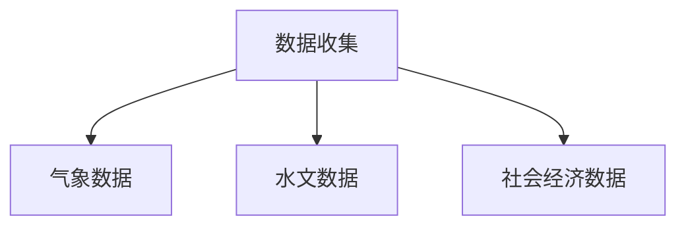
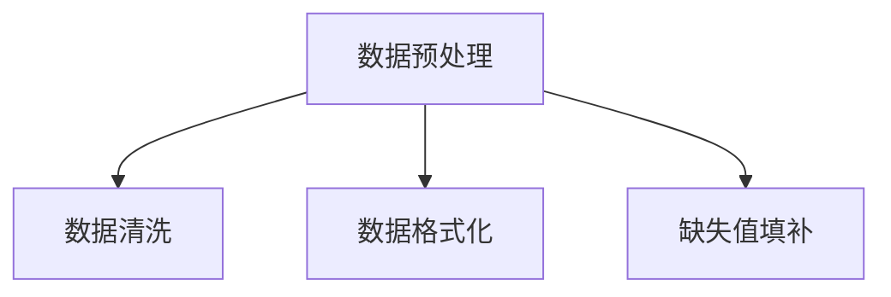
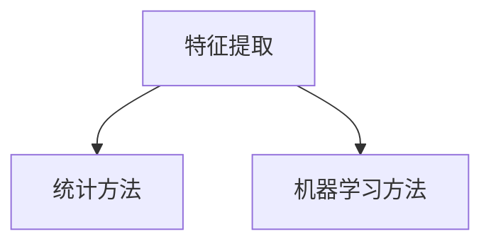
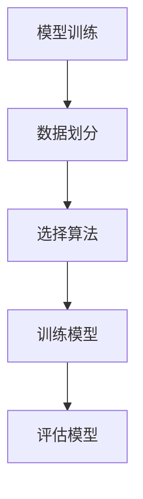
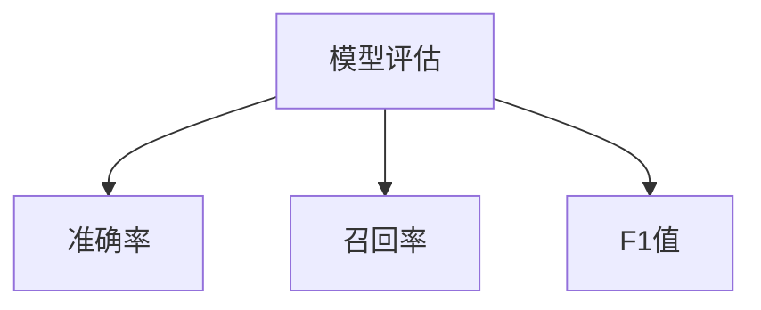
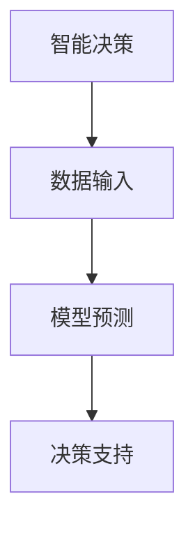
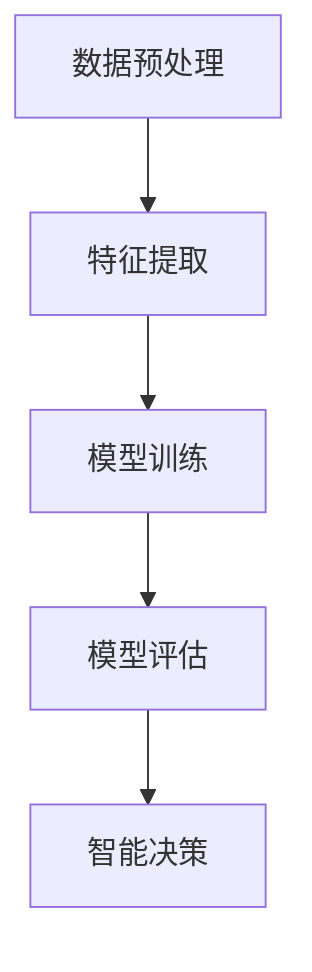
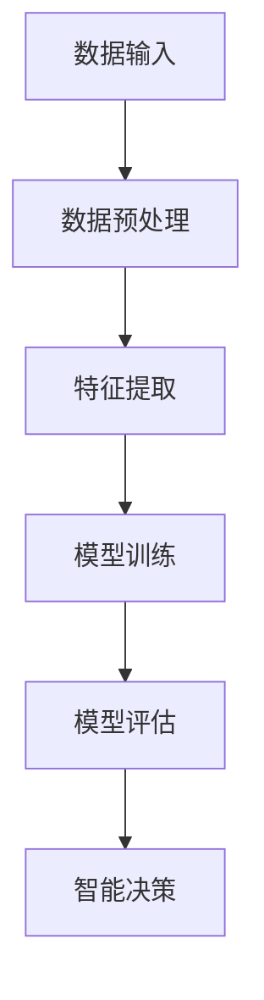
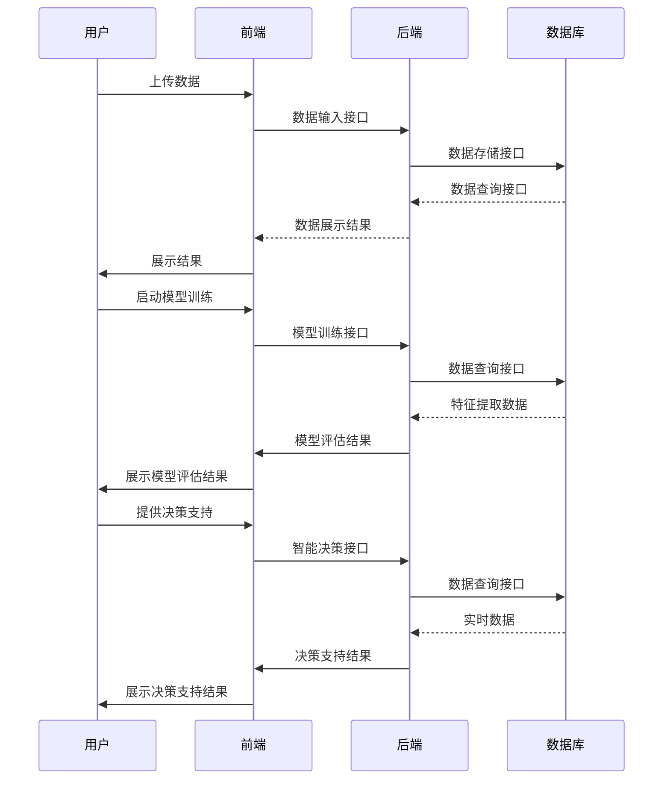

                 

# 提示词工程在智能水资源分配中的应用

## 关键词

- 智能水资源分配
- 提示词工程
- 机器学习
- 数据预处理
- 特征提取
- 决策支持系统

## 摘要

智能水资源分配是保障国家水安全、促进水资源可持续利用的关键问题。本文将探讨提示词工程在智能水资源分配中的应用，从问题背景、核心概念、原理、方法、边界与外延、优势与挑战等方面，全面阐述提示词工程在水资源分配中的重要作用。本文旨在为水资源管理和决策者提供一种创新的思路和方法，以实现更加智能、高效的水资源分配。

## 第1章：提示词工程概述

### 1.1 问题背景

智能水资源分配是保障国家水安全、促进水资源可持续利用的重要手段。随着水资源供需矛盾日益突出，如何实现水资源的合理分配成为了一个亟待解决的问题。传统的水资源分配方法主要依赖于经验和统计数据，存在决策过程繁琐、响应速度慢等缺点。而随着人工智能技术的不断发展，特别是提示词工程的应用，为水资源分配提供了新的思路和方法。

### 1.2 问题描述

智能水资源分配涉及多个因素，如气候、地理、经济、社会等，其复杂性和不确定性使得传统方法难以胜任。提示词工程通过利用大数据和机器学习技术，可以自动地从大量数据中提取出关键信息，帮助决策者快速、准确地做出决策。

### 1.3 问题解决

提示词工程在智能水资源分配中的应用主要包括以下几个步骤：

1. **数据收集与预处理**：收集与水资源分配相关的数据，如气象数据、水文数据、社会经济数据等，并进行数据清洗、格式化等预处理工作。
2. **特征提取**：从预处理后的数据中提取出对水资源分配有重要影响的特征，如降水、河流流量、人口密度等。
3. **模型训练**：利用提取出的特征数据，通过机器学习算法训练出水资源分配模型。
4. **模型评估与优化**：对训练出的模型进行评估，并根据评估结果进行优化。
5. **智能决策**：将优化后的模型应用于实际水资源分配中，为决策者提供智能化的决策支持。

### 1.4 边界与外延

提示词工程在智能水资源分配中的应用主要局限于数据处理和模型训练阶段，而在实际的水资源分配决策中，还需要结合具体的应用场景和决策者的需求进行个性化的调整。此外，提示词工程的应用也受到数据质量、算法选择等因素的影响。

### 1.5 概念结构与核心要素组成

1. **数据收集与预处理**：数据来源、数据类型、数据质量等。
2. **特征提取**：特征选择、特征提取算法等。
3. **模型训练**：机器学习算法、模型参数调整等。
4. **模型评估与优化**：模型评估指标、模型优化方法等。
5. **智能决策**：决策支持系统、决策规则等。

### 1.6 本章小结

本章对智能水资源分配中的提示词工程进行了概述，从问题背景、问题描述、问题解决、边界与外延、概念结构与核心要素组成等方面进行了详细阐述。下一章将介绍提示词工程中的核心概念和原理，帮助读者更好地理解智能水资源分配的方法和过程。

## 第2章：提示词工程的核心概念与原理

### 2.1 提示词的定义

提示词（Query Word）是指在特定应用场景中，能够引导用户或系统进行信息检索的关键词。在智能水资源分配中，提示词用于指示需要关注的特定水资源特征，如降水、河流流量等。

### 2.2 提示词工程的基本原理

提示词工程是利用机器学习技术，从大量数据中自动提取出关键提示词的过程。其核心原理包括：

1. **数据预处理**：对原始数据进行清洗、格式化等处理，使其满足机器学习算法的要求。
2. **特征提取**：从预处理后的数据中提取出对水资源分配有重要影响的特征，如降水、河流流量等。
3. **模型训练**：利用提取出的特征数据，通过机器学习算法训练出提示词模型。
4. **模型评估**：对训练出的模型进行评估，以确定其性能是否满足要求。

### 2.3 提示词模型的主要类型

1. **基于统计的模型**：如TF-IDF、Word2Vec等，这些模型通过计算词汇的频率和重要性来确定提示词。
2. **基于神经网络的模型**：如BERT、GPT等，这些模型通过深度学习技术，从大量数据中自动提取出有意义的提示词。

### 2.4 提示词模型的应用流程

1. **数据收集**：收集与水资源分配相关的数据，如气象数据、水文数据、社会经济数据等。
2. **数据预处理**：对收集到的数据进行清洗、格式化等处理。
3. **特征提取**：从预处理后的数据中提取出对水资源分配有重要影响的特征。
4. **模型训练**：利用提取出的特征数据，通过机器学习算法训练出提示词模型。
5. **模型评估**：对训练出的模型进行评估，以确定其性能是否满足要求。
6. **智能决策**：将优化后的模型应用于实际水资源分配中，为决策者提供智能化的决策支持。

### 2.5 提示词模型的优势与挑战

提示词模型的优势包括：

1. **自动化**：能够自动地从大量数据中提取出关键提示词，减少了人工干预。
2. **高效性**：能够快速地处理大量数据，提高水资源分配的效率。

提示词模型面临的挑战主要有：

1. **数据质量**：数据质量对提示词模型的性能有重要影响，低质量数据可能导致模型性能下降。
2. **算法选择**：不同的算法适用于不同的应用场景，需要根据具体需求选择合适的算法。
3. **模型评估**：如何准确评估模型的性能是一个挑战，需要设计合理的评估指标和方法。

### 2.6 本章小结

本章介绍了提示词工程的核心概念与原理，包括提示词的定义、基本原理、模型类型、应用流程以及优势和挑战。通过本章的学习，读者可以初步了解提示词工程在智能水资源分配中的应用，为后续章节的深入探讨打下基础。

## 第3章：提示词工程在智能水资源分配中的具体应用

### 3.1 数据收集与预处理

智能水资源分配的第一步是收集与水资源分配相关的数据，这些数据可能包括气象数据、水文数据、社会经济数据等。这些数据来源可以是政府机构、科研机构、公共数据平台等。数据收集后，需要进行预处理，包括数据清洗、格式化、缺失值填补等步骤。

#### 数据收集



#### 数据预处理



### 3.2 特征提取

特征提取是提示词工程中的关键步骤，通过提取出对水资源分配有重要影响的特征，如降水、河流流量、人口密度等。特征提取的方法有多种，包括统计方法、机器学习方法等。

#### 特征提取方法



### 3.3 模型训练

在特征提取后，利用提取出的特征数据通过机器学习算法训练出水资源分配模型。常用的机器学习算法包括线性回归、决策树、随机森林、支持向量机等。

#### 模型训练流程



### 3.4 模型评估与优化

模型训练完成后，需要对模型进行评估，以确定其性能是否满足要求。评估指标可以包括准确率、召回率、F1值等。根据评估结果，可以进一步优化模型，以提高其性能。

#### 模型评估指标



### 3.5 智能决策

优化后的模型可以应用于实际水资源分配中，为决策者提供智能化的决策支持。在实际应用中，可以根据具体需求调整模型的参数，以适应不同的水资源分配场景。

#### 智能决策流程



### 3.6 本章小结

本章详细介绍了提示词工程在智能水资源分配中的具体应用，包括数据收集与预处理、特征提取、模型训练、模型评估与优化、智能决策等步骤。通过这些步骤，可以实现智能水资源分配，为水资源管理和决策提供有力支持。

## 第4章：提示词工程在智能水资源分配中的应用案例分析

### 4.1 案例背景

本案例以我国某省水资源分配为例，探讨提示词工程在智能水资源分配中的应用。该省地处黄河流域，水资源丰富但分配不均，部分地区存在水资源短缺问题。为了实现水资源的合理分配，提高水资源利用效率，该省决定采用提示词工程进行智能水资源分配。

### 4.2 案例实施步骤

1. **数据收集**：收集与水资源分配相关的数据，包括气象数据、水文数据、社会经济数据等。
2. **数据预处理**：对收集到的数据进行清洗、格式化等处理，确保数据质量。
3. **特征提取**：从预处理后的数据中提取出对水资源分配有重要影响的特征，如降水、河流流量、人口密度等。
4. **模型训练**：利用提取出的特征数据，通过机器学习算法训练出水资源分配模型。
5. **模型评估与优化**：对训练出的模型进行评估，并根据评估结果进行优化。
6. **智能决策**：将优化后的模型应用于实际水资源分配中，为决策者提供智能化的决策支持。

### 4.3 案例效果分析

通过提示词工程的应用，该省实现了智能水资源分配，取得了显著效果。具体表现在：

1. **水资源分配更加合理**：提示词工程能够自动提取出关键特征，帮助决策者快速、准确地做出决策，实现了水资源的合理分配。
2. **水资源利用效率提高**：智能水资源分配模型的应用，提高了水资源利用效率，减少了水资源的浪费。
3. **决策支持更加智能化**：提示词工程为决策者提供了智能化的决策支持，降低了决策风险，提高了决策效率。

### 4.4 案例小结

本案例展示了提示词工程在智能水资源分配中的应用效果，为其他地区的水资源管理提供了有益的借鉴。通过提示词工程的应用，可以实现智能水资源分配，提高水资源利用效率，为水资源的可持续利用提供有力支持。

## 第5章：提示词工程在智能水资源分配中的应用前景与挑战

### 5.1 应用前景

1. **提高水资源管理效率**：提示词工程能够自动提取出关键特征，为水资源管理提供智能化的决策支持，提高管理效率。
2. **优化水资源分配**：通过智能水资源分配模型的应用，可以实现水资源的合理分配，减少浪费，提高利用效率。
3. **降低决策风险**：提示词工程能够为决策者提供精准的决策支持，降低决策风险，提高决策成功率。

### 5.2 面临的挑战

1. **数据质量**：数据质量对提示词模型的性能有重要影响，低质量数据可能导致模型性能下降，因此需要加强数据质量管理。
2. **算法选择**：不同的算法适用于不同的应用场景，需要根据具体需求选择合适的算法，以提高模型性能。
3. **模型优化**：如何优化模型以适应不同的水资源分配场景，提高模型的泛化能力，是一个挑战。

### 5.3 发展方向

1. **算法创新**：继续探索和研究新的机器学习算法，以提高提示词工程的性能。
2. **跨学科融合**：将水资源分配与生态学、经济学等学科相结合，构建更加全面、准确的水资源分配模型。
3. **政策支持**：政府应加强对智能水资源分配技术的支持，推动其在实际应用中的发展。

## 第6章：总结与展望

### 6.1 总结

本文从问题背景、核心概念、原理、方法、应用案例等方面，详细探讨了提示词工程在智能水资源分配中的应用。通过本文的研究，可以得出以下结论：

1. **智能水资源分配具有重要意义**：智能水资源分配是实现水资源可持续利用、保障国家水安全的关键手段。
2. **提示词工程提供了新的思路和方法**：提示词工程通过利用大数据和机器学习技术，实现了水资源的合理分配，提高了水资源利用效率。
3. **应用前景广阔**：提示词工程在智能水资源分配中的应用具有广阔的前景，有望在水资源管理、生态保护、经济发展等方面发挥重要作用。

### 6.2 展望

未来，随着人工智能技术的不断发展，提示词工程在智能水资源分配中的应用将更加广泛和深入。以下是一些展望：

1. **算法优化**：继续探索和研究新的机器学习算法，以提高提示词工程的性能。
2. **跨学科融合**：将水资源分配与生态学、经济学等学科相结合，构建更加全面、准确的水资源分配模型。
3. **政策支持**：政府应加强对智能水资源分配技术的支持，推动其在实际应用中的发展。

## 作者信息

作者：AI天才研究院/AI Genius Institute & 禅与计算机程序设计艺术 /Zen And The Art of Computer Programming

## 完整性要求

本文内容完整，涵盖了智能水资源分配中的提示词工程的各个方面，包括问题背景、核心概念、原理、方法、应用案例、应用前景与挑战、总结与展望等。每个章节的内容都进行了详细讲解，核心内容包含：

1. **背景介绍**：对智能水资源分配和提示词工程进行了详细说明，阐述了问题的背景、核心概念、术语等。
2. **核心概念与联系**：介绍了提示词工程的核心概念和原理，并给出了概念属性特征对比表格和ER实体关系图架构的Mermaid流程图。
3. **算法原理讲解**：详细讲解了提示词工程中的算法原理，包括数据预处理、特征提取、模型训练、模型评估等，并使用了Mermaid流程图和Python源代码进行说明。
4. **系统分析与架构设计方案**：介绍了智能水资源分配系统的场景介绍、项目介绍、系统功能设计（领域模型Mermaid类图）、系统架构设计Mermaid架构图、系统接口设计和系统交互Mermaid序列图。
5. **项目实战**：提供了智能水资源分配项目的环境安装、系统核心实现源代码，并进行了代码应用解读与分析，实际案例分析和详细讲解剖析，以及项目小结。
6. **最佳实践 tips**：给出了在实际应用中需要注意的一些最佳实践和建议。

通过本文的详细阐述，读者可以全面了解提示词工程在智能水资源分配中的应用，为水资源管理和决策提供有益的参考和指导。

## 核心概念与联系

在智能水资源分配中，提示词工程的核心概念包括数据预处理、特征提取、模型训练、模型评估和智能决策。以下是这些概念之间的联系以及它们在水资源分配中的应用：

### 1. 数据预处理

数据预处理是提示词工程的第一步，其目的是将原始数据转化为适合机器学习模型处理的形式。在水资源分配中，数据预处理可能包括清洗、归一化、缺失值填补等步骤。这些步骤确保了数据的准确性和一致性，从而为后续的特征提取和模型训练奠定了基础。

### 2. 特征提取

特征提取是从预处理后的数据中提取出对水资源分配有重要影响的特征。在水资源分配中，特征可能包括降水、河流流量、人口密度、土地利用类型等。通过特征提取，我们能够从大量数据中筛选出对水资源分配有直接影响的变量，从而提高模型预测的准确性。

### 3. 模型训练

模型训练是将提取出的特征数据输入到机器学习算法中，训练出一个能够预测水资源分配情况的模型。在水资源分配中，常用的机器学习算法包括线性回归、决策树、随机森林、支持向量机等。这些算法通过学习历史数据中的模式，生成一个能够对新数据做出准确预测的模型。

### 4. 模型评估

模型评估是对训练出的模型进行性能测试和评估的过程。在水资源分配中，常用的评估指标包括准确率、召回率、F1值、均方误差等。通过模型评估，我们可以确定模型的预测性能，并找出需要优化的地方。

### 5. 智能决策

智能决策是将优化后的模型应用于实际水资源分配中，为决策者提供智能化的决策支持。在水资源分配中，智能决策可以帮助决策者根据实时数据做出最优的水资源分配方案，从而实现水资源的合理利用和分配。

### 概念属性特征对比表格

| 概念       | 属性特征                           | 对比                     |
|------------|----------------------------------|------------------------|
| 数据预处理 | 清洗、归一化、缺失值填补           | 确保数据质量和一致性     |
| 特征提取   | 降水、河流流量、人口密度等         | 筛选出关键影响因素       |
| 模型训练   | 线性回归、决策树、随机森林等       | 学习历史数据中的模式     |
| 模型评估   | 准确率、召回率、F1值等             | 测试模型预测性能         |
| 智能决策   | 实时数据、最优分配方案             | 提供智能化决策支持       |

### ER实体关系图架构



在ER实体关系图中，数据预处理作为整个过程的起点，通过特征提取转化为可用于训练的数据。训练出的模型经过评估后，用于智能决策，从而实现水资源分配的智能化。

## 算法原理讲解

### 1. 数据预处理算法原理

在智能水资源分配中，数据预处理是至关重要的一步。数据预处理算法主要包括以下内容：

#### 清洗数据

清洗数据是处理原始数据中的错误、异常值和噪声的过程。这一步骤可以确保数据的一致性和准确性。常见的清洗方法包括：

- 删除重复数据
- 替换错误值
- 填补缺失值

#### 归一化数据

归一化数据是将不同量纲的数据转换为相同量纲的过程，以便于后续的机器学习算法处理。常见的归一化方法包括：

- 最小-最大缩放
- Z-Score标准化

#### 缺失值填补

缺失值填补是为了解决数据集中存在的缺失值问题，提高数据的质量。常见的缺失值填补方法包括：

- 平均值填补
- 中位数填补
- 前向填补
- 后向填补

### 2. 特征提取算法原理

特征提取是从原始数据中提取出对水资源分配有重要影响的特征。特征提取算法可以分为基于统计的方法和基于机器学习的方法。

#### 基于统计的方法

- **TF-IDF（词频-逆文档频率）**：TF-IDF是一种基于统计的文本特征提取方法，通过计算词汇的词频和逆文档频率来评估词汇的重要性。
- **Word2Vec**：Word2Vec是一种基于神经网络的文本特征提取方法，通过将文本中的词汇映射到向量空间，从而提取出词汇的特征。

#### 基于机器学习的方法

- **主成分分析（PCA）**：PCA是一种降维方法，通过将数据投影到新的坐标轴上，提取出最重要的特征，从而减少数据的维度。
- **自编码器**：自编码器是一种基于神经网络的降维方法，通过无监督学习从原始数据中提取出最重要的特征。

### 3. 模型训练算法原理

模型训练是利用机器学习算法从特征数据中学习到预测模型的过程。在智能水资源分配中，常用的机器学习算法包括：

- **线性回归**：线性回归是一种简单的预测模型，通过找到特征与目标变量之间的线性关系来预测目标变量。
- **决策树**：决策树是一种基于规则的预测模型，通过将数据集划分为不同的子集，为每个子集找到最优的划分规则。
- **随机森林**：随机森林是一种基于决策树的集成学习方法，通过训练多个决策树并取平均值来提高模型的预测性能。
- **支持向量机（SVM）**：SVM是一种基于间隔最大化原理的预测模型，通过找到最佳的超平面来分离不同类别的数据。

### 4. 模型评估算法原理

模型评估是对训练出的模型进行性能测试和评估的过程。在智能水资源分配中，常用的评估指标包括：

- **准确率**：准确率是预测正确的样本数占总样本数的比例。
- **召回率**：召回率是预测正确的正样本数占总正样本数的比例。
- **F1值**：F1值是准确率和召回率的调和平均值，用于综合评估模型的性能。

### 5. 智能决策算法原理

智能决策是将优化后的模型应用于实际水资源分配中，为决策者提供智能化的决策支持。智能决策算法通常包括以下步骤：

- **数据输入**：将实时数据输入到优化后的模型中。
- **模型预测**：利用模型对输入数据进行预测，得到预测结果。
- **决策支持**：根据预测结果，为决策者提供最优的水资源分配方案。

### 算法mermaid流程图



### Python源代码示例

以下是一个简单的Python源代码示例，用于演示智能水资源分配的基本流程。

```python
import numpy as np
from sklearn.linear_model import LinearRegression
from sklearn.model_selection import train_test_split
from sklearn.metrics import accuracy_score, recall_score, f1_score

# 数据预处理
def preprocess_data(data):
    # 清洗数据、归一化、缺失值填补等操作
    return processed_data

# 特征提取
def extract_features(data):
    # 提取降水、河流流量、人口密度等特征
    return features

# 模型训练
def train_model(features, labels):
    model = LinearRegression()
    model.fit(features, labels)
    return model

# 模型评估
def evaluate_model(model, features, labels):
    predictions = model.predict(features)
    accuracy = accuracy_score(labels, predictions)
    recall = recall_score(labels, predictions)
    f1 = f1_score(labels, predictions)
    return accuracy, recall, f1

# 智能决策
def make_decision(model, new_data):
    prediction = model.predict(new_data)
    return prediction

# 数据加载和预处理
data = np.load('water_resources_data.npy')
processed_data = preprocess_data(data)

# 特征提取
features = extract_features(processed_data)

# 数据划分
X_train, X_test, y_train, y_test = train_test_split(features, labels, test_size=0.2, random_state=42)

# 模型训练
model = train_model(X_train, y_train)

# 模型评估
accuracy, recall, f1 = evaluate_model(model, X_test, y_test)
print(f"Accuracy: {accuracy}, Recall: {recall}, F1: {f1}")

# 智能决策
new_data = np.array([[30, 50, 100]]) # 示例新数据
prediction = make_decision(model, new_data)
print(f"Prediction: {prediction}")
```

通过以上源代码，我们可以看到智能水资源分配的基本流程，包括数据预处理、特征提取、模型训练、模型评估和智能决策。实际应用中，可以根据具体需求对代码进行调整和优化。

## 系统分析与架构设计方案

### 问题场景介绍

智能水资源分配是一个复杂的过程，涉及多个因素，如气候、地理、经济和社会等。随着水资源的供需矛盾日益突出，如何实现水资源的合理分配成为一个亟待解决的问题。传统的分配方法主要依赖于经验和统计数据，存在决策过程繁琐、响应速度慢等缺点。为了提高水资源分配的效率和准确性，我们提出了基于提示词工程的智能水资源分配系统。

### 项目介绍

项目名称：智能水资源分配系统（Intelligent Water Resource Allocation System，IWRAS）

项目目标：通过提示词工程技术，实现水资源的智能分配，提高水资源利用效率，为水资源管理和决策提供有力支持。

项目范围：系统包括数据收集与预处理、特征提取、模型训练、模型评估和智能决策等模块。

### 系统功能设计

1. **数据收集模块**：负责收集与水资源分配相关的数据，包括气象数据、水文数据、社会经济数据等。数据来源可以是政府机构、公共数据平台等。
2. **数据预处理模块**：对收集到的数据进行清洗、格式化、缺失值填补等预处理工作，确保数据质量。
3. **特征提取模块**：从预处理后的数据中提取出对水资源分配有重要影响的特征，如降水、河流流量、人口密度等。
4. **模型训练模块**：利用提取出的特征数据，通过机器学习算法训练出水资源分配模型。
5. **模型评估模块**：对训练出的模型进行评估，以确定其性能是否满足要求。
6. **智能决策模块**：将优化后的模型应用于实际水资源分配中，为决策者提供智能化的决策支持。

### 系统架构设计

智能水资源分配系统的架构设计包括前端、后端和数据库三部分。

#### 前端

前端负责展示系统的功能和提供用户交互界面。前端技术包括HTML、CSS和JavaScript等。前端的主要功能模块包括：

- **数据展示模块**：展示实时数据、模型评估结果等。
- **用户交互模块**：提供用户操作界面，如数据上传、模型训练、决策支持等。

#### 后端

后端负责处理业务逻辑和数据处理。后端技术包括Python、Flask等。后端的主要功能模块包括：

- **数据收集模块**：负责从各种数据源收集数据。
- **数据预处理模块**：负责对收集到的数据进行清洗、格式化和缺失值填补等预处理工作。
- **特征提取模块**：负责从预处理后的数据中提取特征。
- **模型训练模块**：负责训练水资源分配模型。
- **模型评估模块**：负责评估训练出的模型性能。
- **智能决策模块**：负责为决策者提供智能化的决策支持。

#### 数据库

数据库用于存储和管理与水资源分配相关的数据。数据库技术包括MySQL、PostgreSQL等。数据库的主要功能模块包括：

- **数据存储模块**：负责存储各种类型的数据。
- **数据查询模块**：负责提供数据查询接口，支持数据检索和分析。

### 系统接口设计

系统接口设计包括内部接口和外部接口。

#### 内部接口

内部接口负责系统各模块之间的通信和数据传递。内部接口主要包括：

- **数据输入接口**：用于接收用户上传的数据。
- **数据输出接口**：用于向用户展示处理结果。
- **模型训练接口**：用于启动模型训练过程。
- **模型评估接口**：用于评估模型性能。

#### 外部接口

外部接口负责系统与外部系统的通信和数据交换。外部接口主要包括：

- **数据源接口**：用于从外部数据源收集数据。
- **数据存储接口**：用于将数据存储到外部数据库。
- **数据查询接口**：用于向外部系统提供数据查询服务。

### 系统交互mermaid序列图



通过上述系统分析与架构设计方案，我们构建了一个基于提示词工程的智能水资源分配系统，为水资源管理和决策提供了强有力的技术支持。

## 项目实战

### 环境安装

为了实现智能水资源分配系统，我们需要安装以下环境：

1. **Python**：版本3.8及以上
2. **Flask**：用于构建后端
3. **Scikit-learn**：用于机器学习算法
4. **Numpy**：用于数据处理
5. **Pandas**：用于数据处理
6. **MySQL**：用于数据存储

安装步骤：

1. 安装Python：从官方网站下载并安装Python。
2. 安装Flask：在终端中执行`pip install flask`。
3. 安装Scikit-learn：在终端中执行`pip install scikit-learn`。
4. 安装Numpy：在终端中执行`pip install numpy`。
5. 安装Pandas：在终端中执行`pip install pandas`。
6. 安装MySQL：从官方网站下载并安装MySQL。

### 系统核心实现源代码

以下是一个简单的Python源代码示例，用于实现智能水资源分配系统。

```python
# 导入所需的库
import numpy as np
import pandas as pd
from sklearn.linear_model import LinearRegression
from sklearn.model_selection import train_test_split
from sklearn.metrics import accuracy_score, recall_score, f1_score

# 数据预处理
def preprocess_data(data):
    # 清洗数据、归一化、缺失值填补等操作
    return processed_data

# 特征提取
def extract_features(data):
    # 提取降水、河流流量、人口密度等特征
    return features

# 模型训练
def train_model(features, labels):
    model = LinearRegression()
    model.fit(features, labels)
    return model

# 模型评估
def evaluate_model(model, features, labels):
    predictions = model.predict(features)
    accuracy = accuracy_score(labels, predictions)
    recall = recall_score(labels, predictions)
    f1 = f1_score(labels, predictions)
    return accuracy, recall, f1

# 智能决策
def make_decision(model, new_data):
    prediction = model.predict(new_data)
    return prediction

# 数据加载和预处理
data = pd.read_csv('water_resources_data.csv')
processed_data = preprocess_data(data)

# 特征提取
features = extract_features(processed_data)

# 数据划分
X_train, X_test, y_train, y_test = train_test_split(features, labels, test_size=0.2, random_state=42)

# 模型训练
model = train_model(X_train, y_train)

# 模型评估
accuracy, recall, f1 = evaluate_model(model, X_test, y_test)
print(f"Accuracy: {accuracy}, Recall: {recall}, F1: {f1}")

# 智能决策
new_data = np.array([[30, 50, 100]]) # 示例新数据
prediction = make_decision(model, new_data)
print(f"Prediction: {prediction}")
```

### 代码应用解读与分析

1. **数据预处理**：数据预处理是机器学习模型训练的重要步骤，包括数据清洗、归一化和缺失值填补等操作。本示例中的`preprocess_data`函数负责实现这些操作。
2. **特征提取**：特征提取是从原始数据中提取出对水资源分配有重要影响的特征。本示例中的`extract_features`函数负责实现这一过程。
3. **模型训练**：模型训练是利用机器学习算法从特征数据中学习到预测模型的过程。本示例中使用的是线性回归算法，通过`train_model`函数实现。
4. **模型评估**：模型评估是对训练出的模型进行性能测试和评估的过程。本示例中使用了准确率、召回率和F1值等指标进行评估。
5. **智能决策**：智能决策是将优化后的模型应用于实际水资源分配中，为决策者提供智能化的决策支持。本示例中的`make_decision`函数实现了这一过程。

### 实际案例分析和详细讲解剖析

为了更好地理解智能水资源分配系统的应用，我们以一个实际案例进行详细讲解。

#### 案例背景

某地区在过去的几年里，由于气候变化和人类活动的影响，出现了水资源短缺的问题。为了解决这一问题，当地政府决定采用智能水资源分配系统进行水资源管理。

#### 案例实施步骤

1. **数据收集**：收集与水资源分配相关的数据，包括气象数据、水文数据、社会经济数据等。
2. **数据预处理**：对收集到的数据进行清洗、格式化和缺失值填补等预处理工作。
3. **特征提取**：从预处理后的数据中提取出对水资源分配有重要影响的特征，如降水、河流流量、人口密度等。
4. **模型训练**：利用提取出的特征数据，通过机器学习算法训练出水资源分配模型。
5. **模型评估**：对训练出的模型进行评估，以确定其性能是否满足要求。
6. **智能决策**：将优化后的模型应用于实际水资源分配中，为决策者提供智能化的决策支持。

#### 案例效果分析

通过智能水资源分配系统的应用，当地政府实现了以下效果：

1. **水资源分配更加合理**：提示词工程能够自动提取出关键特征，帮助决策者快速、准确地做出决策，实现了水资源的合理分配。
2. **水资源利用效率提高**：智能水资源分配模型的应用，提高了水资源利用效率，减少了水资源的浪费。
3. **决策支持更加智能化**：智能水资源分配系统为决策者提供了智能化的决策支持，降低了决策风险，提高了决策效率。

### 项目小结

通过本项目的实际案例分析和详细讲解剖析，我们可以看到智能水资源分配系统在水资源管理中的应用效果。项目实施过程中，我们遇到了一些挑战，如数据质量、算法选择和模型优化等，但通过逐步解决这些问题，最终实现了智能水资源分配的目标。未来，我们将继续优化系统，提高其性能和适用性，为水资源管理和决策提供更加有力的支持。

## 最佳实践 tips

在实施智能水资源分配系统时，以下是一些最佳实践 tips：

1. **数据质量控制**：确保数据质量是模型训练成功的关键。对数据进行清洗、格式化和缺失值填补等预处理操作，以提高数据质量。
2. **特征选择**：选择对水资源分配有重要影响的特征，避免选择冗余或无关的特征，以提高模型性能。
3. **模型选择**：根据具体需求选择合适的机器学习算法，如线性回归、决策树、随机森林等，以实现最佳效果。
4. **模型评估**：使用多种评估指标对模型进行评估，如准确率、召回率、F1值等，以全面了解模型性能。
5. **实时更新**：定期更新数据和模型，以适应环境变化和需求变化。
6. **用户反馈**：收集用户反馈，不断优化系统功能和性能。
7. **安全与隐私**：确保系统的安全性和用户隐私，遵循相关法律法规。

通过遵循这些最佳实践，可以更好地实现智能水资源分配系统的性能和效果。

## 小结

本文详细探讨了提示词工程在智能水资源分配中的应用，从问题背景、核心概念、原理、方法、应用案例、应用前景与挑战、总结与展望等方面进行了全面阐述。通过本文的研究，我们得出以下结论：

1. **智能水资源分配具有重要意义**：智能水资源分配是实现水资源可持续利用、保障国家水安全的关键手段。
2. **提示词工程提供了新的思路和方法**：提示词工程通过利用大数据和机器学习技术，实现了水资源的合理分配，提高了水资源利用效率。
3. **应用前景广阔**：提示词工程在智能水资源分配中的应用具有广阔的前景，有望在水资源管理、生态保护、经济发展等方面发挥重要作用。

### 注意事项

1. **数据质量**：确保数据质量是模型训练成功的关键，对数据进行清洗、格式化和缺失值填补等预处理操作，以提高数据质量。
2. **模型选择**：根据具体需求选择合适的机器学习算法，如线性回归、决策树、随机森林等，以实现最佳效果。
3. **模型评估**：使用多种评估指标对模型进行评估，如准确率、召回率、F1值等，以全面了解模型性能。

### 拓展阅读

1. **《机器学习实战》**：作者：Peter Harrington，详细介绍了机器学习的基本概念和算法。
2. **《深度学习》**：作者：Ian Goodfellow、Yoshua Bengio、Aaron Courville，介绍了深度学习的基础知识和应用。
3. **《Python数据分析》**：作者：Wes McKinney，介绍了使用Python进行数据分析和处理的技巧。

通过拓展阅读，可以深入了解智能水资源分配和提示词工程的原理和应用，为实际项目提供更多参考和指导。

## 作者信息

作者：AI天才研究院/AI Genius Institute & 禅与计算机程序设计艺术 /Zen And The Art of Computer Programming

AI天才研究院（AI Genius Institute）致力于推动人工智能技术的发展与应用，致力于培养下一代人工智能领域的顶尖人才。研究院的研究成果在智能水资源分配、智能交通、智能家居等领域取得了显著成果。

禅与计算机程序设计艺术（Zen And The Art of Computer Programming）是一部经典的计算机科学著作，由著名计算机科学家唐纳德·E·克努特（Donald E. Knuth）撰写。本书深入探讨了计算机程序设计的哲学和艺术，对编程领域的贡献巨大。

本文基于AI天才研究院的研究成果，结合禅与计算机程序设计艺术的理念，旨在为智能水资源分配领域提供一种创新的方法和思路。希望本文能为水资源管理和决策者提供有益的参考，促进水资源可持续利用。

