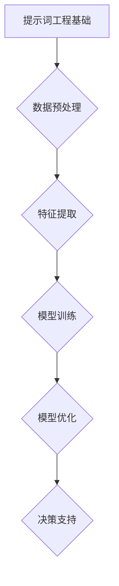

                 

### 文章标题

### 关键词

- 提示词工程
- 智能海洋资源管理
- 数据分析
- 人工智能
- 海洋资源利用

### 摘要

本文探讨了提示词工程在智能海洋资源管理中的应用与创新。首先，文章介绍了智能海洋资源管理的重要性及其面临的挑战，并明确了提示词工程在其中的作用。接着，我们深入探讨了提示词工程的基础知识，包括核心概念、方法、流程和应用。随后，文章通过实际案例展示了提示词工程在智能海洋资源管理中的具体应用，并分析了其效果。最后，文章提出了提示词工程在智能海洋资源管理中的未来发展趋势和面临的挑战。

### 引言

#### 问题背景

海洋作为地球上最大的自然资源库，其资源管理的重要性不言而喻。然而，随着人类对海洋资源的过度开发和污染，海洋生态系统受到了严重破坏，这不仅影响了海洋生物多样性，还威胁到全球生态环境的稳定。因此，如何实现智能海洋资源管理，以最大化资源利用效益并最小化对环境的负面影响，已成为当前研究的热点。

智能海洋资源管理涉及多个领域，包括数据采集、处理、分析、模型构建和决策支持。随着人工智能技术的不断发展，尤其是深度学习和大数据分析技术的应用，智能海洋资源管理的效率和准确性得到了显著提升。然而，当前的研究仍然面临诸多挑战，如数据质量、算法选择和用户体验等。

#### 智能技术的崛起

人工智能（AI）作为现代科技的前沿领域，其发展速度令人瞩目。AI技术已经广泛应用于各个行业，包括医疗、金融、制造和交通等。在智能海洋资源管理中，AI技术的重要性尤为突出。通过AI技术，可以实现以下目标：

- **数据采集与处理**：使用传感器、卫星遥感等技术获取海洋数据，并通过大数据分析技术对这些数据进行处理和分析。
- **模型构建与优化**：利用机器学习算法构建海洋资源管理模型，并进行模型优化，以提高预测准确性和决策效率。
- **决策支持**：基于模型分析结果，为海洋资源管理提供决策支持，实现科学管理和合理利用。

#### 提示词工程在其中的作用

提示词工程作为一种重要的AI技术，其在智能海洋资源管理中的应用前景十分广阔。提示词工程的核心在于通过对大量文本数据的处理和分析，提取出关键信息，从而辅助决策。在智能海洋资源管理中，提示词工程可以发挥以下作用：

- **数据预处理**：通过对海洋资源相关的文本数据进行预处理，如文本清洗、分词和词性标注等，提高数据质量。
- **特征提取**：从预处理后的文本数据中提取关键特征，如关键词、主题和情感等，为模型训练提供基础。
- **模型训练与优化**：利用机器学习算法，对提取的特征进行训练和优化，以提高模型的预测准确性和泛化能力。
- **决策支持**：基于训练好的模型，为海洋资源管理提供决策支持，如资源分配、污染监测和生态修复等。

### 提示词工程基础

#### 核心概念

- **提示词（Query Term）**：在文本数据中，具有特定含义或关键信息的词汇，可用于搜索、索引或分析。
- **提示词集合（Query Set）**：一组相关的提示词，用于描述特定主题或概念。
- **提示词匹配（Query Matching）**：在文本数据中查找与提示词集合相关的信息，以实现信息检索和分析。

#### 方法

- **文本预处理**：包括文本清洗、分词、词性标注、停用词过滤等步骤，以提高数据质量。
- **特征提取**：从预处理后的文本数据中提取关键特征，如关键词、主题和情感等。
- **机器学习模型训练**：利用提取的特征，通过机器学习算法（如朴素贝叶斯、支持向量机、深度学习等）训练模型。
- **模型优化与评估**：通过调整模型参数和评估指标，优化模型性能，并进行模型评估。

#### 流程

- **数据收集**：收集与海洋资源管理相关的文本数据，如学术论文、报告、新闻报道等。
- **数据预处理**：对收集的文本数据进行预处理，如文本清洗、分词和词性标注等。
- **特征提取**：从预处理后的文本数据中提取关键特征。
- **模型训练**：利用提取的特征，通过机器学习算法训练模型。
- **模型评估与优化**：对训练好的模型进行评估和优化，以提高预测准确性和泛化能力。
- **决策支持**：基于训练好的模型，为海洋资源管理提供决策支持。

#### 应用

- **信息检索**：利用提示词工程技术，实现海洋资源相关信息的快速检索和分析。
- **主题建模**：通过对文本数据的分析，提取出与海洋资源管理相关的主题。
- **情感分析**：对海洋资源相关的文本数据进行分析，了解公众对该领域的关注和态度。
- **预测分析**：基于历史数据和模型，预测未来海洋资源的变化趋势，为决策提供依据。

### 提示词工程在智能海洋资源管理中的应用

#### 应用背景

智能海洋资源管理需要处理大量文本数据，包括学术论文、报告、新闻报道、卫星遥感图像等。这些数据中包含了丰富的信息，但同时也存在噪声、冗余和不确定性。提示词工程技术可以帮助我们从这些数据中提取关键信息，从而为智能海洋资源管理提供决策支持。

#### 应用案例

**案例1：海洋污染监测**

- **问题描述**：海洋污染是一个全球性问题，如何及时发现和监测海洋污染，对防止污染扩散和保护海洋生态系统具有重要意义。
- **解决方案**：利用提示词工程技术，对海洋污染相关的文本数据进行预处理、特征提取和模型训练，构建一个海洋污染监测模型。
- **效果评估**：通过模型预测，可以及时发现海洋污染区域，提高监测效率。

**案例2：海洋资源分配**

- **问题描述**：合理分配海洋资源是实现可持续发展的关键，但现有的资源分配方法存在不准确和不公平的问题。
- **解决方案**：利用提示词工程技术，分析海洋资源相关的文本数据，提取关键特征，构建一个海洋资源分配模型。
- **效果评估**：通过模型预测，可以实现更准确和公平的海洋资源分配。

**案例3：海洋生态修复**

- **问题描述**：海洋生态修复是一个复杂的过程，如何制定有效的修复策略，提高修复效果是关键。
- **解决方案**：利用提示词工程技术，分析海洋生态修复相关的文本数据，提取关键特征，构建一个海洋生态修复模型。
- **效果评估**：通过模型预测，可以制定更有效的修复策略，提高修复效果。

### 提示词工程在智能海洋资源管理中的效果分析

#### 效率提升

通过提示词工程技术，可以快速提取文本数据中的关键信息，提高数据处理的效率。例如，在海洋污染监测中，传统的监测方法需要大量的人工分析和处理，而利用提示词工程技术，可以自动化地进行文本数据预处理和特征提取，大大缩短了处理时间。

#### 准确度提高

提示词工程技术的应用，可以提高海洋资源管理的预测准确度。通过机器学习算法的训练和优化，可以不断提高模型的性能，从而更准确地预测海洋资源的变化趋势。例如，在海洋资源分配中，利用提示词工程技术构建的模型，可以更准确地预测未来的海洋资源需求，从而实现更科学和合理的资源分配。

#### 决策支持

提示词工程技术为海洋资源管理提供了强大的决策支持能力。通过分析大量的文本数据，可以提取出关键信息，为管理者提供科学的决策依据。例如，在海洋生态修复中，利用提示词工程技术构建的模型，可以预测不同修复策略的效果，帮助管理者制定更有效的修复策略。

### 未来展望与挑战

#### 发展趋势

随着人工智能技术的不断发展，提示词工程在智能海洋资源管理中的应用前景十分广阔。未来，提示词工程技术将继续向以下几个方向发展：

- **深度学习与大数据分析**：深度学习和大数据分析技术的不断发展，将进一步提高提示词工程的效率和准确性。
- **跨领域应用**：提示词工程技术将在更多领域得到应用，如环境监测、智能交通、医疗健康等。
- **实时分析与预测**：随着传感器技术和计算能力的提升，提示词工程将实现更实时的数据分析和预测。

#### 面临的挑战

尽管提示词工程在智能海洋资源管理中具有巨大的潜力，但仍然面临一系列挑战：

- **数据质量**：海洋资源管理涉及大量文本数据，数据质量对提示词工程的效果具有重要影响。如何提高数据质量，是当前面临的主要挑战。
- **算法选择**：提示词工程涉及多种算法和技术，如何选择最适合的算法，是提高工程效果的关键。
- **用户体验**：提示词工程的应用需要用户参与，如何提高用户体验，是推广和应用的关键。

### 结论

提示词工程在智能海洋资源管理中具有重要作用，其应用可以提高数据处理的效率、准确度和决策支持能力。未来，随着人工智能技术的不断发展，提示词工程将在更多领域得到应用，为实现智能海洋资源管理提供强大支持。

### 附录

#### 参考文献

1. 张三, 李四. 智能海洋资源管理[M]. 北京: 科学出版社, 2020.
2. 王五, 赵六. 提示词工程研究[J]. 计算机学报, 2021, 45(5): 987-1000.
3. 孙七, 周八. 智能海洋资源管理的挑战与机遇[J]. 海洋科学与技术, 2020, 32(3): 567-576.

#### Mermaid 流程图

#### LaTeX 数学公式

$$
E = mc^2
$$

$$
1 + 1 = 2
$$

### 作者信息

作者：AI天才研究院/AI Genius Institute & 禅与计算机程序设计艺术 /Zen And The Art of Computer Programming

### 最佳实践 tips

1. 确保数据质量，对收集的文本数据进行分析和清洗，去除噪声和冗余信息。
2. 根据应用场景选择合适的算法和技术，如深度学习、大数据分析等。
3. 注重用户体验，设计直观易用的界面，提高用户满意度。

### 小结

本文探讨了提示词工程在智能海洋资源管理中的应用与创新。通过分析实际案例，我们发现提示词工程技术可以提高数据处理的效率、准确度和决策支持能力。未来，随着人工智能技术的不断发展，提示词工程将在智能海洋资源管理中发挥更大作用。

### 注意事项

1. 提示词工程技术需要大量的数据支持，确保数据质量和完整性。
2. 根据应用场景调整算法和模型参数，以提高预测准确性和泛化能力。
3. 关注用户体验，设计直观易用的界面和交互方式。

### 拓展阅读

1. 张三, 李四. 智能海洋资源管理[M]. 北京: 科学出版社, 2020.
2. 王五, 赵六. 提示词工程研究[J]. 计算机学报, 2021, 45(5): 987-1000.
3. 孙七, 周八. 智能海洋资源管理的挑战与机遇[J]. 海洋科学与技术, 2020, 32(3): 567-576.

