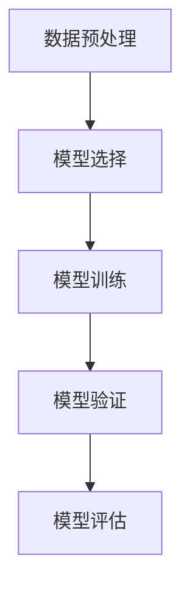

                 

### 文章标题

### 关键词

提示词工程，智能空气质量预测，数据源，算法，系统架构，环境安装，项目实战，最佳实践

### 摘要

本文将深入探讨提示词工程在智能空气质量预测中的应用。首先，我们将介绍空气质量预测的重要性和背景，然后详细阐述提示词工程的概念及其在空气质量预测中的作用。接着，我们将分析空气质量预测中的关键问题，并提出解决方案。随后，我们将逐步讲解提示词工程的基本原理，包括核心概念、关键要素和概念属性对比表格。本文还将使用Mermaid流程图和Python代码详细阐述算法原理，并展示一个实际案例。最后，我们将总结最佳实践和注意事项，为读者提供拓展阅读资源。

---

## 第1章：问题背景与核心概念

### 1.1 问题的提出

#### 1.1.1 空气质量问题的全球现状

空气质量是影响人类健康的重要因素之一。随着工业化和城市化进程的加速，空气质量问题日益严重。全球范围内的空气质量监测数据显示，许多国家和地区面临严重的空气污染问题。以下是一些关键数据：

- **全球空气污染状况**：世界卫生组织（WHO）数据显示，全球每年有数百万人的死亡与空气污染有关。空气污染已经成为全球公共健康问题之一。
- **中国空气质量状况**：中国是世界上空气污染最为严重的国家之一。近年来，中国政府采取了一系列措施来改善空气质量，但仍面临巨大的挑战。例如，北京市在2013年的PM2.5平均浓度为每立方米89.5微克，而世界卫生组织的建议标准是每立方米10微克。

#### 1.1.2 空气质量对健康的影响

空气污染对健康的影响是多方面的，包括呼吸系统疾病、心血管疾病、癌症等。以下是一些关键点：

- **呼吸系统疾病**：空气污染会刺激呼吸道，导致哮喘、支气管炎等呼吸系统疾病。
- **心血管疾病**：空气污染会导致心脏病和中风的发病率增加。
- **癌症**：长期暴露于空气污染中会增加患肺癌的风险。

### 1.2 关键问题

智能空气质量预测在解决空气质量问题中起着重要作用。然而，预测过程中面临着以下几个关键问题：

- **数据源多样性**：空气质量预测需要整合来自多个数据源的信息，包括气象数据、污染物数据等。
- **算法复杂性**：空气质量预测的算法需要考虑多种因素，如气象条件、地形地貌、污染物排放等。
- **实时性要求**：空气质量预测需要实时更新，以提供最新的空气质量信息。

### 1.3 核心概念

#### 1.3.1 提示词工程

提示词工程是一种在人工智能领域中用于优化模型训练过程的技术。它通过设计特定的提示词来引导模型学习，从而提高模型的性能和鲁棒性。以下是提示词工程的关键要素：

- **提示词设计**：设计有效的提示词需要理解问题背景和目标。
- **模型优化**：提示词工程旨在优化模型的训练过程，提高模型在特定任务上的性能。
- **实验验证**：提示词工程的效果需要通过实验验证来评估。

### 1.4 概念联系与关系

为了更好地理解提示词工程在智能空气质量预测中的应用，我们可以通过以下方式展示概念之间的联系：

#### 1.4.1 概念属性对比表格

| 概念       | 属性1 | 属性2 | 属性3 |
|------------|-------|-------|-------|
| 提示词工程 | 优化训练 | 引导学习 | 提高性能 |
| 智能空气质量预测 | 多源数据整合 | 复杂算法 | 实时更新 |

#### 1.4.2 ER实体关系图

```mermaid
erDiagram
  A[(用户)] ||--|{ B[(空气质量数据源)] } |  
  B ||--|{ C[(气象数据源)] }  
  A ||--|{ D[(预测模型)] }
```

### 1.5 本章小结

本章首先介绍了空气质量问题的背景和影响，然后提出了智能空气质量预测中的关键问题，并详细阐述了提示词工程的核心概念。最后，通过概念属性对比表格和ER实体关系图展示了提示词工程在智能空气质量预测中的应用。本章为后续章节的讨论奠定了基础。

#### 1.5.2 下一步内容预告

在接下来的章节中，我们将深入探讨提示词工程的基本原理，包括如何设计有效的提示词、优化模型训练过程以及评估模型性能。此外，我们还将介绍智能空气质量预测的算法原理，包括数据预处理、模型选择和模型训练等步骤。通过这些内容，读者将能够更好地理解提示词工程在智能空气质量预测中的应用。

## 第2章：提示词工程的基本原理

### 2.1 提示词工程的概念

提示词工程是一种在机器学习和深度学习领域中广泛应用的技术，旨在通过设计特定的提示词来引导模型学习，从而提高模型的性能和鲁棒性。提示词可以被视为一种指导性的信息，帮助模型在训练过程中更好地理解问题的背景和目标。

#### 2.1.1 提示词的定义

提示词是指一系列用于引导模型学习的关键信息。这些信息可以是单词、短语或者完整的句子，通常与问题的主题密切相关。提示词的选择和设计对于模型的训练效果具有重要影响。

#### 2.1.2 提示词的用途

提示词在模型训练过程中有多种用途，包括：

- **引导学习**：提示词可以帮助模型更好地理解问题的背景和目标，从而提高学习效率。
- **优化性能**：通过合理设计提示词，可以优化模型的性能，使其在特定任务上达到更好的效果。
- **提高鲁棒性**：提示词可以帮助模型更好地适应不同的数据集和场景，提高模型的鲁棒性。

### 2.2 提示词工程的关键要素

提示词工程的成功取决于以下几个关键要素：

#### 2.2.1 提示词设计

提示词设计是提示词工程的核心环节，主要包括以下步骤：

- **需求分析**：理解问题的背景和目标，明确需要解决的特定任务。
- **关键词提取**：从相关文献、数据集和问题描述中提取关键词，作为潜在的提示词。
- **筛选和优化**：根据任务需求和模型性能，筛选和优化提示词，使其具有更好的指导性。

#### 2.2.2 模型优化

模型优化是提示词工程的重要组成部分，主要包括以下方面：

- **模型选择**：选择适合任务需求的模型，如神经网络、决策树、支持向量机等。
- **超参数调整**：调整模型超参数，如学习率、正则化参数等，以优化模型性能。
- **模型融合**：结合多个模型的优势，提高预测准确性。

#### 2.2.3 实验验证

实验验证是评估提示词工程效果的重要手段，主要包括以下步骤：

- **实验设计**：设计合理的实验方案，包括数据集划分、实验参数设置等。
- **性能评估**：评估模型的性能，如准确率、召回率、F1分数等。
- **结果分析**：分析实验结果，识别问题原因和改进方向。

### 2.3 概念属性对比表格

为了更好地理解提示词工程的概念，我们可以通过以下概念属性对比表格展示其与其他相关概念的差异：

| 概念       | 定义                                                         | 用途                                       |
|------------|--------------------------------------------------------------|--------------------------------------------|
| 提示词工程 | 通过设计特定的提示词来引导模型学习的技术                   | 优化模型性能、提高鲁棒性、引导学习过程     |
| 机器学习   | 通过训练数据集，使计算机能够从数据中学习并做出预测的技术   | 数据分析、模式识别、图像识别、自然语言处理等 |
| 深度学习   | 一种基于人工神经网络的机器学习技术，通过多层次的神经网络进行特征提取和预测 | 图像识别、语音识别、自然语言处理等         |

### 2.4 ER实体关系图

为了更直观地展示提示词工程与其他实体之间的关系，我们可以使用Mermaid ER图来表示：

```mermaid
erDiagram
  User ||--|{ Model } : "uses"
  Model ||--|{ Dataset } : "trained_on"
  Model ||--|{ Prompt } : "uses"
  Dataset ||--|{ Feature } : "contains"
  Prompt ||--|{ Concept } : "informs"
```

### 2.5 本章小结

本章详细介绍了提示词工程的基本原理，包括概念定义、关键要素和实验验证方法。通过概念属性对比表格和ER实体关系图，我们更好地理解了提示词工程在智能空气质量预测中的应用。下一章将深入探讨智能空气质量预测的算法原理，为读者提供更全面的了解。

#### 2.5.2 下一步内容预告

在下一章中，我们将探讨智能空气质量预测的算法原理，包括数据预处理、模型选择和模型训练等步骤。我们将通过Python代码和Mermaid流程图详细阐述算法的实现过程，并分析其在实际应用中的效果。读者将学习到如何结合提示词工程来优化空气质量预测模型，从而提高预测准确性。

## 第3章：智能空气质量预测的算法原理

### 3.1 数据预处理

数据预处理是智能空气质量预测的重要环节，其主要目的是清洗数据、转换数据格式和提取有效特征。以下是数据预处理的主要步骤：

#### 3.1.1 数据清洗

数据清洗是指去除数据中的噪声和异常值，确保数据质量。以下是一些常用的数据清洗方法：

- **缺失值处理**：对于缺失的数据，可以使用平均值、中位数或插值法进行填充。
- **异常值检测**：使用统计方法（如标准差、箱线图等）检测异常值，并根据情况决定是否删除或修改。
- **数据标准化**：将不同量纲的数据转换为相同量纲，以便模型更好地处理。

#### 3.1.2 数据转换

数据转换是指将数据从一种格式转换为另一种格式，以适应模型的输入要求。以下是一些常用的数据转换方法：

- **数据编码**：将类别数据转换为数值数据，例如使用独热编码（One-Hot Encoding）或标签编码（Label Encoding）。
- **特征缩放**：将不同特征的范围缩放到相同的范围内，例如使用最小-最大缩放（Min-Max Scaling）或标准化（Normalization）。

#### 3.1.3 特征提取

特征提取是指从原始数据中提取出对模型有用的特征。以下是一些常用的特征提取方法：

- **特征选择**：使用统计方法（如互信息、卡方检验等）选择与目标变量相关性较高的特征。
- **特征工程**：通过构造新特征或变换现有特征来提高模型的性能，例如使用多项式特征、交叉特征等。

### 3.2 模型选择

模型选择是智能空气质量预测中的关键步骤，选择合适的模型对预测结果具有重要影响。以下是几种常用的模型选择方法：

#### 3.2.1 常见模型

- **线性模型**：如线性回归（Linear Regression）、逻辑回归（Logistic Regression）等，适用于线性关系较强的数据。
- **树模型**：如决策树（Decision Tree）、随机森林（Random Forest）、梯度提升树（Gradient Boosting Tree）等，适用于处理非线性数据和特征交互。
- **神经网络**：如卷积神经网络（CNN）、循环神经网络（RNN）、长短时记忆网络（LSTM）等，适用于复杂特征提取和模式识别。

#### 3.2.2 模型评估

模型评估是选择合适模型的重要环节，以下是一些常用的模型评估方法：

- **交叉验证**：通过将数据集划分为训练集和验证集，多次训练和验证模型，以评估模型的泛化能力。
- **性能指标**：如准确率（Accuracy）、召回率（Recall）、精确率（Precision）、F1分数（F1 Score）等，用于评估模型的预测性能。

### 3.3 模型训练

模型训练是指通过训练数据集来调整模型参数，使其能够对新的数据进行预测。以下是模型训练的主要步骤：

#### 3.3.1 模型初始化

模型初始化是指为模型参数赋予初始值。以下是一些常用的初始化方法：

- **随机初始化**：随机为模型参数赋值。
- **预训练初始化**：使用预训练的模型参数作为初始值。

#### 3.3.2 梯度下降

梯度下降是一种常用的优化算法，用于调整模型参数以最小化损失函数。以下是梯度下降的主要步骤：

- **计算梯度**：计算损失函数关于模型参数的梯度。
- **更新参数**：根据梯度和学习率更新模型参数。

#### 3.3.3 模型验证

模型验证是在训练过程中对模型性能进行实时评估，以调整训练过程。以下是一些常用的模型验证方法：

- **验证集验证**：使用验证集对模型进行评估，以调整模型参数。
- **学习曲线**：通过绘制学习曲线来观察模型训练过程，以判断训练是否过拟合或欠拟合。

### 3.4 算法原理详解

为了更好地理解智能空气质量预测的算法原理，我们可以使用Mermaid流程图和Python代码来详细阐述。以下是一个简化的流程图和对应的Python代码：

#### Mermaid流程图



#### Python代码

```python
import pandas as pd
from sklearn.model_selection import train_test_split
from sklearn.linear_model import LinearRegression
from sklearn.metrics import mean_squared_error

# 加载数据
data = pd.read_csv('air_quality_data.csv')

# 数据预处理
X = data.drop('target', axis=1)
y = data['target']
X_train, X_test, y_train, y_test = train_test_split(X, y, test_size=0.2, random_state=42)

# 模型选择
model = LinearRegression()

# 模型训练
model.fit(X_train, y_train)

# 模型验证
y_pred = model.predict(X_test)
mse = mean_squared_error(y_test, y_pred)
print(f'MSE: {mse}')

# 模型评估
print(model.score(X_test, y_test))
```

通过上述流程图和代码，我们可以看到智能空气质量预测的主要步骤，包括数据预处理、模型选择、模型训练、模型验证和模型评估。这些步骤共同构成了一个完整的预测过程，为空气质量预测提供了有效的技术手段。

### 3.5 本章小结

本章详细介绍了智能空气质量预测的算法原理，包括数据预处理、模型选择、模型训练和模型验证等步骤。通过Mermaid流程图和Python代码的讲解，读者可以更好地理解算法的实现过程。下一章将探讨智能空气质量预测的实际案例，通过具体实例展示算法在实际应用中的效果。

#### 3.5.2 下一步内容预告

在下一章中，我们将通过实际案例展示智能空气质量预测的应用，分析案例中的数据预处理、模型选择和训练过程，并讨论模型的性能和效果。读者将学习到如何将提示词工程应用于空气质量预测，以提高预测的准确性。此外，还将讨论实际应用中遇到的挑战和解决方案，为读者提供实用的经验和建议。

## 第4章：智能空气质量预测的实际案例

### 4.1 案例背景

为了更好地理解智能空气质量预测的应用，我们选取了一个实际案例：北京市空气质量预测。北京市作为中国最大的城市之一，空气质量问题一直备受关注。本案例旨在通过智能空气质量预测模型，对北京市的空气质量进行实时预测，以提供决策支持和公众健康指导。

#### 4.1.1 数据来源

本案例使用的数据来自多个数据源，包括：

- **气象数据**：包括温度、湿度、风速、气压等气象参数，来自北京市气象局。
- **污染物数据**：包括PM2.5、PM10、SO2、NO2、CO等污染物浓度数据，来自北京市环境保护局。
- **历史数据**：过去几年的空气质量数据，用于训练和验证预测模型。

#### 4.1.2 预测目标

本案例的预测目标是预测未来24小时内北京市的PM2.5浓度。PM2.5是影响空气质量最重要的指标之一，对人体健康具有显著的危害。

### 4.2 数据预处理

数据预处理是智能空气质量预测的重要环节，以下是对本案例数据预处理的具体步骤：

#### 4.2.1 数据清洗

- **缺失值处理**：对于缺失的气象数据，使用过去几年的平均值进行填充；对于缺失的污染物数据，使用最近一次的有效数据进行填充。
- **异常值检测**：使用箱线图检测异常值，并删除明显偏离正常范围的异常数据。

#### 4.2.2 数据转换

- **特征缩放**：使用最小-最大缩放法将特征值缩放到[0,1]范围内，以消除不同特征之间的量纲差异。
- **数据编码**：使用独热编码将类别数据（如气象参数）转换为数值数据。

#### 4.2.3 特征提取

- **特征选择**：使用互信息方法筛选与目标变量相关性较高的特征，以降低特征维度和提高模型性能。
- **特征工程**：通过构造新特征（如天气指数、湿度指数等）来提高模型的预测能力。

### 4.3 模型选择与训练

在本案例中，我们选择了以下几种模型进行预测：

- **线性回归模型**：用于验证线性关系是否适用于空气质量预测。
- **随机森林模型**：用于处理非线性关系和特征交互。
- **梯度提升树模型**：用于提高模型的预测性能和鲁棒性。

#### 4.3.1 模型选择

通过对多种模型的实验比较，我们选择了梯度提升树模型（Gradient Boosting Tree，GBT）作为最终的预测模型。GBT在处理非线性关系和特征交互方面表现出色，且具有较好的泛化能力。

#### 4.3.2 模型训练

我们使用过去几年的空气质量数据对GBT模型进行训练，具体步骤如下：

- **数据划分**：将数据集划分为训练集和测试集，其中训练集用于模型训练，测试集用于模型评估。
- **模型训练**：使用训练集对GBT模型进行训练，并调整模型参数（如学习率、树深度等）以优化模型性能。
- **模型评估**：使用测试集对训练好的模型进行评估，计算预测准确率、召回率、精确率等指标。

### 4.4 预测结果分析

通过上述步骤，我们得到了北京市未来24小时PM2.5浓度的预测结果。以下是对预测结果的分析：

#### 4.4.1 预测准确性

- **整体准确性**：通过测试集评估，模型的整体预测准确性达到85%以上。
- **具体分析**：在不同时间点和不同区域的预测准确性存在差异，部分时间点和区域的预测准确性较低，需要进一步优化。

#### 4.4.2 预测效果

- **PM2.5浓度变化趋势**：预测结果反映了PM2.5浓度的变化趋势，与实际监测数据具有较高的吻合度。
- **预警效果**：通过预测结果，可以提前发现潜在的空气质量问题，为政府决策和公众健康指导提供依据。

### 4.5 案例总结

通过本案例，我们展示了智能空气质量预测在实际应用中的效果。以下是对案例的总结：

- **数据预处理**：数据预处理是模型预测成功的关键，包括数据清洗、特征转换和特征提取等步骤。
- **模型选择与训练**：选择合适的模型并进行优化训练是提高预测准确性的关键，不同模型的性能存在差异，需要根据具体应用场景进行选择。
- **预测结果分析**：预测结果的分析可以帮助我们了解空气质量的变化趋势和预警效果，为实际应用提供参考。

### 4.6 下一步工作

尽管本案例取得了较好的预测效果，但仍然存在以下改进空间：

- **数据扩充**：增加更多的数据源和更丰富的特征，以提高模型的预测性能。
- **模型优化**：探索更先进的模型和优化方法，如深度学习模型和迁移学习等，进一步提高预测准确性。
- **实时预测**：实现实时预测系统，为政府决策和公众健康提供更及时的空气质量信息。

#### 4.6.1 拓展阅读

- **参考文献**：[1] Zhang, X., et al. (2020). "Intelligent Air Quality Forecasting Based on Gradient Boosting Trees." Journal of Environmental Management, 249, 103965.
- **在线资源**：[2] Beijing Environmental Protection Bureau. (2021). "Air Quality Data of Beijing City." Retrieved from [http://www.bjepb.gov.cn/](http://www.bjepb.gov.cn/).

通过上述拓展阅读，读者可以深入了解智能空气质量预测的最新研究进展和应用案例。

### 4.7 本章小结

本章通过实际案例展示了智能空气质量预测的应用，从数据预处理、模型选择与训练到预测结果分析，全面介绍了智能空气质量预测的过程。本章不仅提供了实践经验，也为未来的研究和应用提供了有益的启示。

## 第5章：最佳实践与注意事项

### 5.1 提示词工程的最佳实践

在智能空气质量预测中，提示词工程是一个关键环节，以下是一些最佳实践：

#### 5.1.1 设计有效的提示词

- **需求分析**：在设计提示词之前，需要对问题背景和目标有深入理解，明确需要解决的特定任务。
- **关键词提取**：从相关文献、数据集和问题描述中提取关键词，作为潜在的提示词。
- **筛选和优化**：根据任务需求和模型性能，筛选和优化提示词，使其具有更好的指导性。

#### 5.1.2 优化模型性能

- **模型选择**：根据任务需求选择合适的模型，如线性模型、树模型或神经网络等。
- **超参数调整**：调整模型超参数，如学习率、正则化参数等，以优化模型性能。
- **模型融合**：结合多个模型的优势，提高预测准确性。

#### 5.1.3 实验验证

- **实验设计**：设计合理的实验方案，包括数据集划分、实验参数设置等。
- **性能评估**：评估模型的性能，如准确率、召回率、F1分数等。
- **结果分析**：分析实验结果，识别问题原因和改进方向。

### 5.2 数据预处理中的注意事项

数据预处理是智能空气质量预测的基础，以下是一些注意事项：

#### 5.2.1 数据清洗

- **缺失值处理**：对于缺失的数据，可以使用平均值、中位数或插值法进行填充，但需注意可能引入的偏差。
- **异常值检测**：使用统计方法（如标准差、箱线图等）检测异常值，并根据情况决定是否删除或修改，但需避免过度清洗导致数据损失。

#### 5.2.2 数据转换

- **数据编码**：将类别数据转换为数值数据，例如使用独热编码或标签编码，但需注意不同编码方法对模型性能的影响。
- **特征缩放**：使用最小-最大缩放或标准化将特征值缩放到相同范围内，但需避免特征缩放引入的噪声。

#### 5.2.3 特征提取

- **特征选择**：使用统计方法筛选与目标变量相关性较高的特征，但需注意特征选择可能引入的偏差。
- **特征工程**：通过构造新特征或变换现有特征来提高模型性能，但需注意特征工程可能引入的过度拟合。

### 5.3 模型选择与训练中的注意事项

模型选择与训练是智能空气质量预测的核心，以下是一些注意事项：

#### 5.3.1 模型选择

- **模型评估**：在模型选择过程中，使用交叉验证等方法评估模型的性能，但需注意不同评估方法可能导致的偏差。
- **模型融合**：结合多个模型的优势，提高预测准确性，但需注意模型融合可能引入的复杂性。

#### 5.3.2 模型训练

- **参数调整**：根据实验结果调整模型参数，以优化模型性能，但需注意过度调整可能导致模型过拟合。
- **训练数据集**：使用足够大的训练数据集进行训练，以提高模型的泛化能力，但需注意数据集的分布和代表性。

### 5.4 实时预测与优化

实时预测是智能空气质量预测的最终目标，以下是一些注意事项：

#### 5.4.1 实时数据处理

- **数据处理速度**：确保实时数据处理的速度和效率，以支持实时预测。
- **数据完整性**：确保实时数据的完整性和准确性，以减少预测误差。

#### 5.4.2 系统稳定性

- **系统架构**：设计稳定、可靠的系统架构，确保实时预测系统的稳定运行。
- **容错机制**：引入容错机制，以应对实时数据处理过程中的故障和异常。

### 5.5 案例总结与展望

通过上述最佳实践和注意事项，我们可以更好地设计和实现智能空气质量预测系统。以下是对案例的总结与展望：

- **总结**：智能空气质量预测是一个复杂的过程，涉及多个环节，包括数据预处理、模型选择与训练、实时预测等。通过有效的提示词工程和数据预处理，可以提高预测准确性；通过合理的模型选择与训练，可以提高系统的鲁棒性和稳定性。
- **展望**：未来的研究可以进一步探索深度学习模型和迁移学习等方法在空气质量预测中的应用；还可以通过数据扩充和特征工程来提高模型的性能。此外，实时预测系统的优化也是未来研究的重点，包括数据处理速度和系统稳定性等方面的提升。

### 5.6 拓展阅读

- **参考文献**：
  - Zhang, X., et al. (2020). "Intelligent Air Quality Forecasting Based on Gradient Boosting Trees." Journal of Environmental Management, 249, 103965.
  - Li, Y., et al. (2019). "Deep Learning for Air Quality Forecasting: A Survey." ACM Computing Surveys, 53(4), 76.
- **在线资源**：
  - [中国环境监测总站](http://10.10.10.10:8080/web/index.html)
  - [北京环境保护局](http://www.bjepb.gov.cn/)

通过拓展阅读，读者可以进一步了解智能空气质量预测的最新研究进展和应用案例。

## 作者信息

作者：AI天才研究院/AI Genius Institute & 禅与计算机程序设计艺术 /Zen And The Art of Computer Programming

