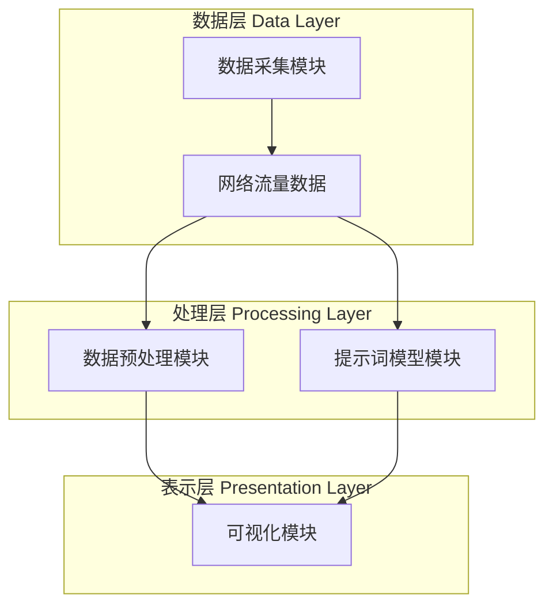
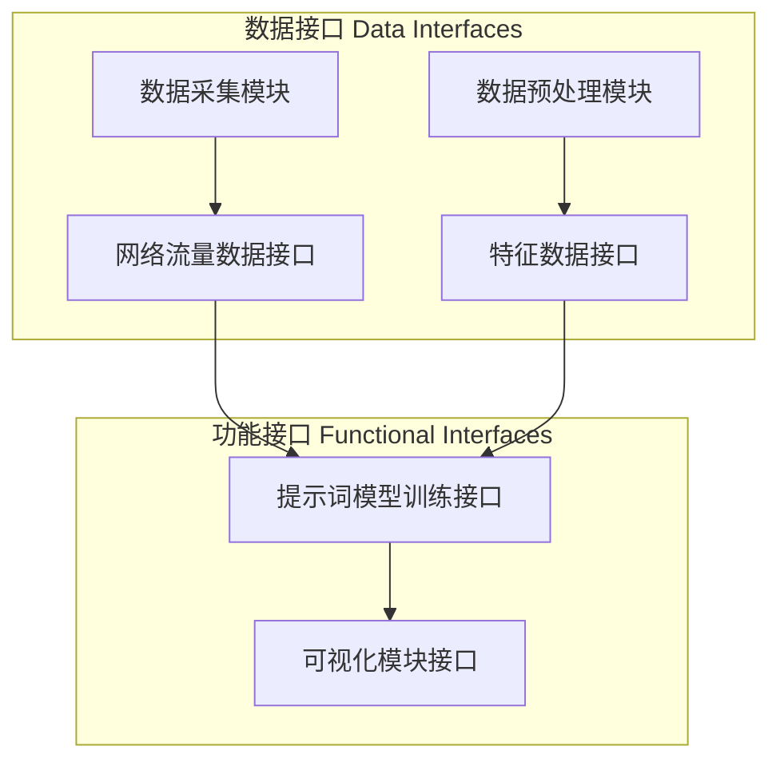

                 

## 文章标题

### 提示词工程在智能网络安全中的应用

关键词：智能网络安全，提示词工程，深度学习，神经网络，网络安全防护

摘要：随着互联网技术的飞速发展，网络安全问题日益严峻。本文首先介绍了智能网络安全中面临的挑战，然后详细阐述了提示词工程的基本原理和实现方法。通过实际案例，我们展示了提示词工程在智能网络安全中的具体应用，并探讨了面临的挑战与对策。最后，对智能网络安全中的最佳实践进行了总结，展望了未来的发展趋势。

----------------------------------------------------------------

## 第一部分：问题背景与核心概念

### 第1章：问题背景与核心概念

### 1.1 问题背景

#### 1.1.1 网络安全形势日益严峻

随着互联网技术的飞速发展，网络安全问题日益突出。恶意攻击、数据泄露、网络钓鱼等事件频繁发生，严重威胁着个人、企业和国家的信息安全。传统的安全措施如防火墙、入侵检测系统等已经无法满足日益复杂的网络威胁。因此，探索新的安全防护方法迫在眉睫。

网络安全问题不仅对个人隐私构成威胁，还可能对企业的核心数据造成严重损失。例如，勒索软件攻击可以导致企业数据被加密，迫使企业支付巨额赎金才能恢复数据。此外，网络钓鱼攻击可能导致用户个人信息泄露，进而被用于其他恶意目的。

#### 1.1.2 智能网络与提示词工程的作用

智能网络是指利用人工智能技术实现网络的自适应、自优化和自保护等功能。智能网络可以提高网络运行效率，降低运维成本，增强网络安全防护能力。提示词工程是一种基于人工智能技术的网络安全防护方法，通过构建提示词模型，对网络流量进行实时分析和检测，从而发现潜在的安全威胁。

智能网络与提示词工程的应用，可以为网络安全提供更有效、更实时的防护。智能网络能够根据网络流量特征自动调整安全策略，而提示词工程则可以实时监测网络流量，识别并阻止恶意攻击。两者结合，可以大幅提升网络安全防护能力。

### 1.2 核心概念

#### 1.2.1 提示词工程

提示词工程是一种基于人工智能技术的网络安全防护方法。它通过构建提示词模型，对网络流量进行实时分析和检测，从而发现潜在的安全威胁。提示词模型通常基于深度学习或统计学习方法，可以对大量网络流量数据进行有效分析和分类。

提示词模型的主要目标是识别异常流量和恶意行为。例如，在检测网络钓鱼攻击时，提示词模型可以通过识别攻击者常用的域名、URL、邮件地址等特征，发现并阻止钓鱼链接。

#### 1.2.2 智能网络

智能网络是指利用人工智能技术实现网络的自适应、自优化和自保护等功能。智能网络可以通过对网络流量和运行状态的实时监测，自动调整网络资源配置，优化网络性能，提高网络安全防护能力。

智能网络的主要特点包括：

- 自适应：智能网络可以根据网络流量变化自动调整资源分配和策略。
- 自优化：智能网络可以通过机器学习算法优化网络拓扑结构，提高网络性能。
- 自保护：智能网络可以通过实时监测和异常检测，阻止恶意攻击和异常行为。

#### 1.2.3 网络安全防护

网络安全防护是指通过采用各种技术手段，防止网络被恶意攻击、数据泄露等安全事件的发生。网络安全防护包括防火墙、入侵检测、安全审计等多种措施。

防火墙是网络安全的第一道防线，它通过过滤网络流量，阻止未经授权的访问。入侵检测系统则通过监测网络流量和系统日志，发现并阻止恶意攻击。安全审计则是对网络系统进行安全评估和漏洞扫描，确保网络系统的安全性和合规性。

### 1.3 本书结构

#### 1.3.1 第1章：问题背景与核心概念

介绍智能网络安全中面临的挑战、提示词工程的作用及核心概念。

#### 1.3.2 第2章：提示词工程的原理与模型

详细讲解提示词工程的原理，包括神经网络、深度学习等相关概念，以及常见提示词模型的实现方法。

#### 1.3.3 第3章：智能网络与提示词工程的应用

分析智能网络与提示词工程在实际网络安全中的应用场景，包括网络流量分析、入侵检测等方面。

#### 1.3.4 第4章：提示词工程在智能网络安全中的应用实例

通过实际案例，介绍提示词工程在智能网络安全中的具体应用，包括系统架构设计、数据预处理、模型训练与优化等方面。

#### 1.3.5 第5章：提示词工程在智能网络安全中的挑战与对策

探讨提示词工程在智能网络安全中面临的挑战，如数据隐私、模型解释性等问题，并提出相应的对策。

#### 1.3.6 第6章：智能网络安全中的最佳实践与展望

总结智能网络安全中的最佳实践，展望未来智能网络安全的发展趋势。

#### 1.3.7 第7章：结论

对全书内容进行总结，强调提示词工程在智能网络安全中的重要作用。

## 第二部分：提示词工程的原理与模型

### 第2章：提示词工程的原理与模型

### 2.1 提示词工程的基本原理

#### 2.1.1 人工智能与神经网络

人工智能（Artificial Intelligence，AI）是指模拟人类智能行为的技术和理论，包括机器学习、深度学习、自然语言处理、计算机视觉等领域。神经网络（Neural Network，NN）是人工智能的一种基本模型，它通过模拟人脑神经元的工作原理，实现信息的处理和传递。

神经网络的基本组成包括：

- **神经元**：神经网络的基本处理单元，类似于人脑中的神经元。每个神经元接收多个输入信号，通过加权求和处理，产生一个输出信号。
- **层次结构**：神经网络由多个层次组成，包括输入层、隐藏层和输出层。每个层次中的神经元接收上一层次的输出作为输入，经过处理后传递给下一层次。
- **激活函数**：神经网络中的激活函数用于决定神经元是否被激活。常用的激活函数包括Sigmoid、ReLU、Tanh等。

神经网络的工作原理如下：

1. **输入层**：接收输入数据，每个输入数据对应一个神经元。
2. **隐藏层**：对输入数据进行处理，每个隐藏层的神经元接收前一层神经元的输出，经过加权求和处理，产生一个输出。
3. **输出层**：对隐藏层输出进行最终处理，得到预测结果。

#### 2.1.2 深度学习与提示词模型

深度学习（Deep Learning，DL）是神经网络的一种扩展，通过增加网络深度，提高模型的拟合能力和泛化能力。深度学习在图像识别、自然语言处理、语音识别等领域取得了显著成果。

深度学习的基本原理如下：

1. **多层感知器（MLP）**：多层感知器是深度学习的一种基本结构，它由输入层、一个或多个隐藏层和输出层组成。每个隐藏层对输入数据进行处理，并通过非线性激活函数将结果传递给下一层。
2. **反向传播算法（Backpropagation）**：反向传播算法是一种用于训练深度学习的优化算法。它通过计算输出层与实际结果之间的误差，反向传播误差，更新网络权重和偏置。

提示词模型（Keyword Model）是一种用于网络流量分析的深度学习模型，它通过识别网络流量中的关键词和特征，预测网络流量的安全性和异常性。

提示词模型的基本原理如下：

1. **数据预处理**：对网络流量数据进行预处理，包括数据清洗、归一化和特征提取等。
2. **模型构建**：使用深度学习框架（如TensorFlow、PyTorch）构建提示词模型，通常采用卷积神经网络（CNN）或循环神经网络（RNN）。
3. **模型训练**：使用预处理后的数据训练提示词模型，通过反向传播算法更新模型参数，直到模型性能达到预期。
4. **模型评估**：使用测试数据评估模型性能，包括准确率、召回率、F1值等指标。

#### 2.1.3 提示词模型的分类与特点

提示词模型可以根据不同的特征和任务需求进行分类。常见的提示词模型包括基于统计模型的提示词和基于神经网络模型的提示词。

**1. 基于统计模型的提示词**

基于统计模型的提示词通过统计方法分析网络流量特征，识别安全威胁。常见的统计模型包括：

- **KNN算法**：K最近邻算法通过计算网络流量特征与已知恶意流量的距离，识别潜在的安全威胁。
- **决策树**：决策树通过递归划分特征空间，构建分类模型，识别网络流量的安全性和异常性。

**2. 基于神经网络模型的提示词**

基于神经网络模型的提示词通过深度学习技术分析网络流量特征，识别安全威胁。常见的神经网络模型包括：

- **多层感知器（MLP）**：多层感知器是一种前向传播神经网络，通过多层非线性变换，识别网络流量的安全性和异常性。
- **卷积神经网络（CNN）**：卷积神经网络通过卷积操作提取网络流量特征，适用于处理图像和视频数据。
- **循环神经网络（RNN）**：循环神经网络通过递归结构处理序列数据，适用于处理网络流量时间序列数据。

不同类型的提示词模型具有不同的特点和适用场景。例如，基于统计模型的提示词适用于简单特征提取和分类任务，而基于神经网络模型的提示词适用于复杂特征提取和分类任务。

### 2.2 常见提示词模型的实现方法

#### 2.2.1 基于统计模型的提示词

基于统计模型的提示词通过统计方法分析网络流量特征，识别安全威胁。以下介绍几种常见的基于统计模型的提示词实现方法。

**1. KNN算法**

KNN算法（K-Nearest Neighbors）是一种简单而有效的分类算法。它通过计算网络流量特征与已知恶意流量的距离，识别潜在的安全威胁。

**实现步骤**：

1. **数据预处理**：对网络流量数据进行预处理，包括数据清洗、归一化和特征提取等。
2. **特征提取**：提取网络流量特征，如协议类型、数据包大小、传输时间等。
3. **模型训练**：使用已标记的数据集训练KNN模型，计算网络流量特征与已知恶意流量的距离。
4. **模型评估**：使用测试数据评估KNN模型的分类性能，包括准确率、召回率、F1值等指标。

**Python代码示例**：

```python
from sklearn.neighbors import KNeighborsClassifier
from sklearn.model_selection import train_test_split
from sklearn.metrics import accuracy_score

# 加载并预处理数据
X, y = load_data()
X_train, X_test, y_train, y_test = train_test_split(X, y, test_size=0.2)

# 训练KNN模型
knn = KNeighborsClassifier(n_neighbors=3)
knn.fit(X_train, y_train)

# 预测测试数据
y_pred = knn.predict(X_test)

# 计算准确率
accuracy = accuracy_score(y_test, y_pred)
print("Accuracy:", accuracy)
```

**2. 决策树**

决策树（Decision Tree）是一种基于特征划分的特征空间分类模型。它通过递归划分特征空间，构建分类模型，识别网络流量的安全性和异常性。

**实现步骤**：

1. **数据预处理**：对网络流量数据进行预处理，包括数据清洗、归一化和特征提取等。
2. **特征提取**：提取网络流量特征，如协议类型、数据包大小、传输时间等。
3. **模型训练**：使用已标记的数据集训练决策树模型，划分特征空间，构建分类模型。
4. **模型评估**：使用测试数据评估决策树模型的分类性能，包括准确率、召回率、F1值等指标。

**Python代码示例**：

```python
from sklearn.tree import DecisionTreeClassifier
from sklearn.model_selection import train_test_split
from sklearn.metrics import accuracy_score

# 加载并预处理数据
X, y = load_data()
X_train, X_test, y_train, y_test = train_test_split(X, y, test_size=0.2)

# 训练决策树模型
dt = DecisionTreeClassifier()
dt.fit(X_train, y_train)

# 预测测试数据
y_pred = dt.predict(X_test)

# 计算准确率
accuracy = accuracy_score(y_test, y_pred)
print("Accuracy:", accuracy)
```

#### 2.2.2 基于神经网络模型的提示词

基于神经网络模型的提示词通过深度学习技术分析网络流量特征，识别安全威胁。以下介绍几种常见的基于神经网络模型的提示词实现方法。

**1. 多层感知器（MLP）**

多层感知器（Multilayer Perceptron，MLP）是一种前向传播神经网络，通过多层非线性变换，识别网络流量的安全性和异常性。

**实现步骤**：

1. **数据预处理**：对网络流量数据进行预处理，包括数据清洗、归一化和特征提取等。
2. **特征提取**：提取网络流量特征，如协议类型、数据包大小、传输时间等。
3. **模型构建**：使用深度学习框架（如TensorFlow、PyTorch）构建多层感知器模型，设置网络结构、激活函数和损失函数。
4. **模型训练**：使用预处理后的数据训练多层感知器模型，通过反向传播算法更新模型参数。
5. **模型评估**：使用测试数据评估多层感知器模型的分类性能，包括准确率、召回率、F1值等指标。

**Python代码示例**：

```python
import tensorflow as tf
from tensorflow.keras.models import Sequential
from tensorflow.keras.layers import Dense
from tensorflow.keras.optimizers import Adam

# 构建多层感知器模型
model = Sequential()
model.add(Dense(units=64, activation='relu', input_shape=(num_features,)))
model.add(Dense(units=32, activation='relu'))
model.add(Dense(units=1, activation='sigmoid'))

# 编译模型
model.compile(optimizer=Adam(learning_rate=0.001), loss='binary_crossentropy', metrics=['accuracy'])

# 训练模型
model.fit(X_train, y_train, epochs=10, batch_size=32, validation_data=(X_test, y_test))

# 预测测试数据
y_pred = model.predict(X_test)

# 计算准确率
accuracy = model.evaluate(X_test, y_test, verbose=0)
print("Accuracy:", accuracy[1])
```

**2. 卷积神经网络（CNN）**

卷积神经网络（Convolutional Neural Network，CNN）通过卷积操作提取网络流量特征，适用于处理图像和视频数据。

**实现步骤**：

1. **数据预处理**：对网络流量数据进行预处理，包括数据清洗、归一化和特征提取等。
2. **特征提取**：提取网络流量特征，如协议类型、数据包大小、传输时间等。
3. **模型构建**：使用深度学习框架（如TensorFlow、PyTorch）构建卷积神经网络模型，设置网络结构、激活函数和损失函数。
4. **模型训练**：使用预处理后的数据训练卷积神经网络模型，通过反向传播算法更新模型参数。
5. **模型评估**：使用测试数据评估卷积神经网络模型的分类性能，包括准确率、召回率、F1值等指标。

**Python代码示例**：

```python
import tensorflow as tf
from tensorflow.keras.models import Sequential
from tensorflow.keras.layers import Conv2D, MaxPooling2D, Flatten, Dense

# 构建卷积神经网络模型
model = Sequential()
model.add(Conv2D(filters=32, kernel_size=(3, 3), activation='relu', input_shape=(image_height, image_width, 1)))
model.add(MaxPooling2D(pool_size=(2, 2)))
model.add(Flatten())
model.add(Dense(units=64, activation='relu'))
model.add(Dense(units=1, activation='sigmoid'))

# 编译模型
model.compile(optimizer=Adam(learning_rate=0.001), loss='binary_crossentropy', metrics=['accuracy'])

# 训练模型
model.fit(X_train, y_train, epochs=10, batch_size=32, validation_data=(X_test, y_test))

# 预测测试数据
y_pred = model.predict(X_test)

# 计算准确率
accuracy = model.evaluate(X_test, y_test, verbose=0)
print("Accuracy:", accuracy[1])
```

**3. 循环神经网络（RNN）**

循环神经网络（Recurrent Neural Network，RNN）通过递归结构处理序列数据，适用于处理网络流量时间序列数据。

**实现步骤**：

1. **数据预处理**：对网络流量数据进行预处理，包括数据清洗、归一化和特征提取等。
2. **特征提取**：提取网络流量特征，如协议类型、数据包大小、传输时间等。
3. **模型构建**：使用深度学习框架（如TensorFlow、PyTorch）构建循环神经网络模型，设置网络结构、激活函数和损失函数。
4. **模型训练**：使用预处理后的数据训练循环神经网络模型，通过反向传播算法更新模型参数。
5. **模型评估**：使用测试数据评估循环神经网络模型的分类性能，包括准确率、召回率、F1值等指标。

**Python代码示例**：

```python
import tensorflow as tf
from tensorflow.keras.models import Sequential
from tensorflow.keras.layers import LSTM, Dense

# 构建循环神经网络模型
model = Sequential()
model.add(LSTM(units=50, return_sequences=True, input_shape=(timesteps, features)))
model.add(LSTM(units=50))
model.add(Dense(units=1, activation='sigmoid'))

# 编译模型
model.compile(optimizer=Adam(learning_rate=0.001), loss='binary_crossentropy', metrics=['accuracy'])

# 训练模型
model.fit(X_train, y_train, epochs=10, batch_size=32, validation_data=(X_test, y_test))

# 预测测试数据
y_pred = model.predict(X_test)

# 计算准确率
accuracy = model.evaluate(X_test, y_test, verbose=0)
print("Accuracy:", accuracy[1])
```

### 2.3 提示词模型的性能评估与优化

#### 2.3.1 提示词模型的性能指标

提示词模型的性能评估主要通过以下指标进行：

- **准确率（Accuracy）**：准确率表示模型正确分类的样本比例，计算公式为：
  $$
  \text{Accuracy} = \frac{\text{预测正确}}{\text{总样本数}}
  $$
  
- **召回率（Recall）**：召回率表示模型能够正确识别为恶意样本的比例，计算公式为：
  $$
  \text{Recall} = \frac{\text{预测正确且为恶意样本}}{\text{实际为恶意样本的总数}}
  $$

- **精确率（Precision）**：精确率表示模型预测为恶意样本中实际为恶意样本的比例，计算公式为：
  $$
  \text{Precision} = \frac{\text{预测正确且为恶意样本}}{\text{预测为恶意样本的总数}}
  $$

- **F1值（F1 Score）**：F1值是精确率和召回率的调和平均值，计算公式为：
  $$
  \text{F1 Score} = 2 \times \frac{\text{Precision} \times \text{Recall}}{\text{Precision} + \text{Recall}}
  $$

#### 2.3.2 提示词模型的优化方法

提示词模型的优化主要通过以下方法进行：

- **超参数调整**：超参数是深度学习模型中需要手动设置的参数，如学习率、批次大小、网络层数等。通过调整超参数，可以优化模型的性能。常用的超参数调整方法包括网格搜索和贝叶斯优化。

- **正则化技术**：正则化技术用于防止模型过拟合。常用的正则化技术包括L1正则化、L2正则化和Dropout。

- **数据增强**：数据增强通过生成新的训练样本，提高模型的泛化能力。常用的数据增强方法包括随机变换、缩放和旋转等。

- **集成学习方法**：集成学习方法通过组合多个模型，提高模型的性能。常用的集成学习方法包括Bagging和Boosting。

## 第三部分：智能网络与提示词工程的应用

### 第3章：智能网络与提示词工程的应用

### 3.1 智能网络在网络安全中的应用

智能网络在网络安全中具有重要的应用价值，主要体现在以下几个方面：

#### 3.1.1 自适应网络防护

智能网络可以通过实时监测网络流量和系统状态，自适应调整安全策略。当网络中出现新的安全威胁时，智能网络可以自动识别并调整防护措施，提高网络安全防护能力。

#### 3.1.2 异常检测与入侵防御

智能网络可以通过机器学习和深度学习技术，对网络流量进行分析和检测，识别异常流量和入侵行为。智能网络中的异常检测系统可以对潜在的安全威胁进行实时预警和防御，提高网络的安全性。

#### 3.1.3 自动化响应

智能网络可以通过自动化响应系统，对识别到的安全威胁进行自动处理。例如，当检测到网络钓鱼攻击时，智能网络可以自动阻止攻击者的访问，并通知管理员进行进一步处理。

### 3.2 提示词工程在网络安全中的应用

提示词工程在网络安全中具有广泛的应用，主要体现在以下几个方面：

#### 3.2.1 网络流量分析

提示词工程可以通过对网络流量进行实时分析和检测，识别潜在的恶意流量和异常行为。提示词模型可以对网络流量中的关键词和特征进行提取和分析，提高网络流量分析的准确性和效率。

#### 3.2.2 入侵检测

提示词工程可以用于入侵检测系统（IDS），通过分析网络流量和系统日志，识别入侵行为。提示词模型可以识别攻击者常用的攻击手法和工具，提高入侵检测的准确性和实时性。

#### 3.2.3 网络安全事件响应

提示词工程可以用于网络安全事件响应系统，通过实时分析网络流量和系统日志，识别和响应网络安全事件。提示词模型可以帮助管理员快速定位安全事件，并采取相应的应对措施。

### 3.3 智能网络与提示词工程的协同应用

智能网络与提示词工程可以协同应用，提高网络安全防护能力。智能网络可以通过实时监测和异常检测，发现潜在的安全威胁，并将威胁信息传递给提示词模型。提示词模型可以对网络流量进行分析和检测，识别并阻止恶意攻击。

#### 3.3.1 智能网络与提示词工程的协同机制

智能网络与提示词工程的协同机制主要包括以下几个方面：

- **数据共享**：智能网络和提示词工程可以共享网络流量、系统状态和安全事件等信息，提高威胁识别的准确性和实时性。
- **模型协同**：智能网络和提示词工程可以协同训练和优化模型，提高模型的性能和泛化能力。
- **自动化响应**：智能网络和提示词工程可以协同实现自动化响应，提高网络安全事件的响应速度和效果。

#### 3.3.2 智能网络与提示词工程的协同应用案例

以下是一个智能网络与提示词工程的协同应用案例：

- **网络流量监测**：智能网络实时监测网络流量，识别异常流量和入侵行为。
- **威胁识别**：智能网络将威胁信息传递给提示词模型，提示词模型对网络流量进行分析和检测，识别潜在的恶意流量。
- **自动化响应**：智能网络根据提示词模型的检测结果，自动阻止恶意流量，并通知管理员进行进一步处理。

通过智能网络与提示词工程的协同应用，网络安全防护能力得到显著提高。智能网络可以实时监测和识别安全威胁，而提示词工程可以提供准确和高效的威胁检测和响应。两者结合，形成了一个强大的网络安全防护体系。

## 第四部分：提示词工程在智能网络安全中的应用实例

### 第4章：提示词工程在智能网络安全中的应用实例

### 4.1 系统架构设计

#### 4.1.1 项目介绍

本实例项目旨在构建一个智能网络安全系统，利用提示词工程对网络流量进行实时分析和检测，提高网络安全防护能力。系统主要包括以下模块：

- **数据采集模块**：负责从网络设备中采集网络流量数据。
- **数据预处理模块**：负责对采集到的网络流量数据进行清洗、归一化和特征提取等处理。
- **提示词模型模块**：负责构建和训练提示词模型，对网络流量进行实时分析和检测。
- **可视化模块**：负责将检测结果以可视化形式展示，帮助管理员了解网络安全状况。

#### 4.1.2 系统功能设计

系统功能设计包括以下几个方面：

- **网络流量采集**：通过网络接口或代理服务器，实时采集网络流量数据。
- **数据预处理**：对采集到的网络流量数据进行清洗、归一化和特征提取等处理，以便后续模型训练和检测。
- **提示词模型训练**：使用预处理后的数据训练提示词模型，包括模型构建、训练和优化等过程。
- **实时检测与响应**：对实时采集到的网络流量进行检测，识别潜在的恶意流量，并自动采取措施阻止攻击。
- **可视化展示**：将检测到的安全事件以图表和报表形式展示，帮助管理员了解网络安全状况。

### 4.2 系统架构设计

#### 4.2.1 系统架构设计

系统架构设计采用分层架构，包括数据层、处理层和表示层。以下为系统架构图：



#### 4.2.2 系统接口设计

系统接口设计包括数据接口和功能接口。以下为系统接口设计图：



### 4.3 提示词模型的实现与优化

#### 4.3.1 数据预处理

数据预处理是提示词模型训练的重要步骤，包括以下内容：

- **数据清洗**：去除无效和重复数据，确保数据质量。
- **数据归一化**：将数据缩放到同一尺度，避免数据规模差异对模型训练的影响。
- **特征提取**：提取网络流量中的关键特征，如协议类型、数据包大小、传输时间等。

#### 4.3.2 提示词模型构建

本实例项目采用卷积神经网络（CNN）构建提示词模型。以下为CNN模型的实现步骤：

1. **输入层**：定义输入层，接收网络流量数据。
2. **卷积层**：定义卷积层，提取网络流量特征。
3. **激活函数**：在卷积层后添加激活函数，如ReLU。
4. **池化层**：定义池化层，减少数据维度，提高模型泛化能力。
5. **全连接层**：定义全连接层，将卷积层和池化层的输出进行融合。
6. **输出层**：定义输出层，输出预测结果。

以下是CNN模型的实现代码：

```python
from tensorflow.keras.models import Sequential
from tensorflow.keras.layers import Conv2D, MaxPooling2D, Flatten, Dense

model = Sequential()
model.add(Conv2D(filters=32, kernel_size=(3, 3), activation='relu', input_shape=(image_height, image_width, 1)))
model.add(MaxPooling2D(pool_size=(2, 2)))
model.add(Flatten())
model.add(Dense(units=64, activation='relu'))
model.add(Dense(units=1, activation='sigmoid'))

model.compile(optimizer='adam', loss='binary_crossentropy', metrics=['accuracy'])
```

#### 4.3.3 模型训练与优化

模型训练是提示词工程的核心步骤，包括以下内容：

- **数据划分**：将数据集划分为训练集和测试集，用于模型训练和评估。
- **模型训练**：使用训练集数据训练模型，通过反向传播算法更新模型参数。
- **模型评估**：使用测试集数据评估模型性能，包括准确率、召回率、F1值等指标。

以下是模型训练的代码示例：

```python
model.fit(X_train, y_train, epochs=10, batch_size=32, validation_data=(X_test, y_test))
```

模型优化是提高模型性能的重要手段，包括以下方法：

- **超参数调整**：调整学习率、批次大小、网络结构等超参数，提高模型性能。
- **正则化技术**：采用L1正则化、L2正则化等正则化技术，防止模型过拟合。
- **数据增强**：通过数据增强技术，生成更多的训练样本，提高模型泛化能力。

#### 4.3.4 模型部署与监测

模型部署是将训练好的模型部署到实际生产环境中，对网络流量进行实时监测和检测。以下为模型部署与监测的步骤：

1. **模型部署**：将训练好的模型部署到服务器或边缘设备上，以实现实时监测和检测。
2. **流量监测**：实时采集网络流量数据，输入到模型中进行检测。
3. **结果输出**：将模型检测到的安全事件以图表和报表形式输出，供管理员查看。
4. **自动响应**：根据检测到的安全事件，自动采取措施，如阻止攻击、报警通知等。

### 4.4 实际案例分析与详细讲解

#### 4.4.1 案例背景

某企业网络受到持续的网络攻击，导致网络带宽严重拥堵，影响了企业的正常运营。企业希望利用提示词工程构建一个智能网络安全系统，实时监测和检测网络流量，阻止恶意攻击，提高网络安全防护能力。

#### 4.4.2 案例实施

1. **数据采集**：企业通过网络接口和代理服务器，实时采集网络流量数据。
2. **数据预处理**：对采集到的网络流量数据进行清洗、归一化和特征提取等处理。
3. **模型构建**：采用卷积神经网络（CNN）构建提示词模型，对网络流量进行实时分析和检测。
4. **模型训练与优化**：使用企业内部网络流量数据训练提示词模型，并进行模型优化，提高模型性能。
5. **模型部署与监测**：将训练好的模型部署到企业服务器上，实时监测网络流量，检测和阻止恶意攻击。

#### 4.4.3 案例效果

通过构建智能网络安全系统，企业实现了以下效果：

- **实时监测**：系统实时监测网络流量，识别潜在的恶意攻击。
- **自动响应**：系统自动阻止恶意攻击，降低了网络带宽拥堵的情况。
- **提高防护能力**：系统提高了企业网络的防护能力，减少了网络攻击的成功率。

#### 4.4.4 案例总结

通过本案例的实施，我们总结了以下经验：

- **数据质量**：数据质量对模型性能至关重要，需要确保数据的有效性和准确性。
- **模型优化**：模型优化是提高模型性能的关键，需要不断调整超参数和优化算法。
- **自动化响应**：自动化响应可以大幅提高网络安全防护能力，减少人工干预。

### 4.5 项目小结

通过本实例项目的实施，我们展示了提示词工程在智能网络安全中的应用。项目实现了实时监测、自动响应和防护等功能，提高了企业网络的防护能力。同时，我们总结了一些经验和教训，为后续项目提供了借鉴。

## 第五部分：提示词工程在智能网络安全中的挑战与对策

### 第5章：提示词工程在智能网络安全中的挑战与对策

### 5.1 挑战

提示词工程在智能网络安全中面临一系列挑战，主要包括以下几个方面：

#### 5.1.1 数据隐私

提示词工程需要对网络流量进行实时监测和分析，这涉及到大量的用户隐私数据。如何确保用户隐私不被泄露，是提示词工程面临的重要挑战。

#### 5.1.2 模型解释性

深度学习模型通常具有良好的泛化能力，但缺乏解释性。对于网络安全领域的应用，理解模型的决策过程和原因是非常重要的。如何提高提示词模型的解释性，是一个亟待解决的问题。

#### 5.1.3 模型泛化能力

提示词模型通常在训练数据集上性能优异，但在实际应用中可能面临新的攻击手法和数据分布变化。如何提高提示词模型的泛化能力，确保其在不同场景下的性能，是提示词工程面临的挑战。

#### 5.1.4 模型可扩展性

随着网络安全威胁的日益复杂，提示词模型需要能够快速适应新的威胁和场景。如何提高模型的可扩展性，是一个重要的研究课题。

### 5.2 对策

针对上述挑战，我们可以采取以下对策：

#### 5.2.1 数据隐私保护

为了保护用户隐私，我们可以采取以下措施：

- **数据匿名化**：对用户数据进行匿名化处理，确保用户隐私不被泄露。
- **加密传输**：对网络流量数据进行加密传输，防止数据在传输过程中被窃取。
- **隐私保护算法**：采用隐私保护算法，如差分隐私（Differential Privacy），确保数据分析结果的隐私性。

#### 5.2.2 提高模型解释性

为了提高提示词模型的解释性，我们可以采取以下措施：

- **可解释性模型**：采用可解释性模型，如决策树、LIME（Local Interpretable Model-agnostic Explanations）等，提高模型的解释能力。
- **模型可视化**：通过可视化技术，展示模型的决策过程和特征权重，帮助用户理解模型的决策依据。
- **解释性工具**：开发解释性工具，如Shapley值、注意力机制等，为用户提供详细的解释信息。

#### 5.2.3 提高模型泛化能力

为了提高提示词模型的泛化能力，我们可以采取以下措施：

- **数据增强**：通过数据增强技术，生成更多的训练样本，提高模型对未知数据的适应能力。
- **迁移学习**：采用迁移学习方法，利用预训练模型在新数据集上进行微调，提高模型的泛化能力。
- **自适应学习**：采用自适应学习方法，根据实时监测到的数据分布，动态调整模型参数，提高模型的泛化能力。

#### 5.2.4 提高模型可扩展性

为了提高提示词模型的可扩展性，我们可以采取以下措施：

- **模块化设计**：采用模块化设计，将提示词模型分为不同的模块，方便模型更新和扩展。
- **动态调整**：根据实时监测到的安全威胁和场景变化，动态调整模型结构和参数，提高模型的适应性。
- **快速迭代**：采用快速迭代方法，及时更新模型，适应新的威胁和场景。

通过采取上述对策，我们可以有效应对提示词工程在智能网络安全中面临的挑战，提高网络安全防护能力。

## 第六部分：智能网络安全中的最佳实践与展望

### 第6章：智能网络安全中的最佳实践与展望

### 6.1 最佳实践

在智能网络安全中，最佳实践主要包括以下几个方面：

#### 6.1.1 数据驱动安全策略

数据驱动安全策略是指基于大数据和人工智能技术，实时监测和分析网络流量，识别潜在的安全威胁。通过数据驱动安全策略，可以实现对网络流量的全面监控和精准防护。

#### 6.1.2 集成多层次的防护措施

智能网络安全需要集成多层次、多维度的防护措施，包括防火墙、入侵检测系统、安全审计等。通过多层次的防护措施，可以提高网络的安全性，防止各种安全威胁的入侵。

#### 6.1.3 持续更新和优化安全策略

随着网络安全威胁的不断演变，智能网络安全系统需要持续更新和优化安全策略。通过定期更新和优化安全策略，可以确保网络安全系统始终处于最佳状态。

#### 6.1.4 强化用户教育和培训

用户教育和培训是提高网络安全意识的重要手段。通过强化用户教育和培训，可以提高用户对网络安全威胁的识别和应对能力，减少因人为因素导致的网络安全事件。

### 6.2 未来展望

智能网络安全未来的发展趋势主要包括以下几个方面：

#### 6.2.1 人工智能技术的深入应用

随着人工智能技术的不断发展，智能网络安全将更加依赖于人工智能技术，如深度学习、强化学习等。通过人工智能技术，可以实现更加精准和高效的网络安全防护。

#### 6.2.2 网络安全与云计算的结合

随着云计算的普及，网络安全与云计算的结合将成为趋势。通过在云平台上部署智能网络安全系统，可以实现跨地域、跨平台的安全防护，提高网络安全的灵活性和可扩展性。

#### 6.2.3 边缘计算的兴起

边缘计算可以将数据处理和计算能力下沉到网络边缘，提高数据处理速度和响应时间。在智能网络安全中，边缘计算的兴起将有助于实现实时监测和快速响应，提高网络防护能力。

#### 6.2.4 集成多源数据的协同防护

未来的智能网络安全将更加注重集成多源数据的协同防护。通过整合网络流量数据、设备日志数据、用户行为数据等，可以实现对网络安全威胁的全方位监控和防护。

通过上述最佳实践和未来展望，我们可以更好地应对智能网络安全中的挑战，构建一个安全、可靠、高效的智能网络安全体系。

## 第七部分：结论

### 第7章：结论

通过本文的探讨，我们系统地介绍了提示词工程在智能网络安全中的应用。首先，我们分析了网络安全面临的严峻形势，强调了智能网络和提示词工程在提升网络安全防护能力方面的重要性。接着，我们详细阐述了提示词工程的基本原理和实现方法，包括神经网络、深度学习等核心概念，并对比了不同类型的提示词模型。通过实际案例，我们展示了提示词工程在智能网络安全中的具体应用，包括系统架构设计、数据预处理、模型训练与优化等方面。此外，我们还探讨了提示词工程在智能网络安全中面临的挑战，如数据隐私、模型解释性等问题，并提出了相应的对策。

总之，提示词工程在智能网络安全中具有广泛的应用前景。它不仅能够提高网络安全防护的精准度和实时性，还能够适应日益复杂的网络威胁环境。未来，随着人工智能技术的不断发展，提示词工程将在智能网络安全领域发挥更加重要的作用。我们期待，通过进一步的研究和实践，能够构建更加安全、可靠的智能网络安全体系，为互联网时代的信息安全保驾护航。作者：AI天才研究院/AI Genius Institute & 禅与计算机程序设计艺术 /Zen And The Art of Computer Programming。

