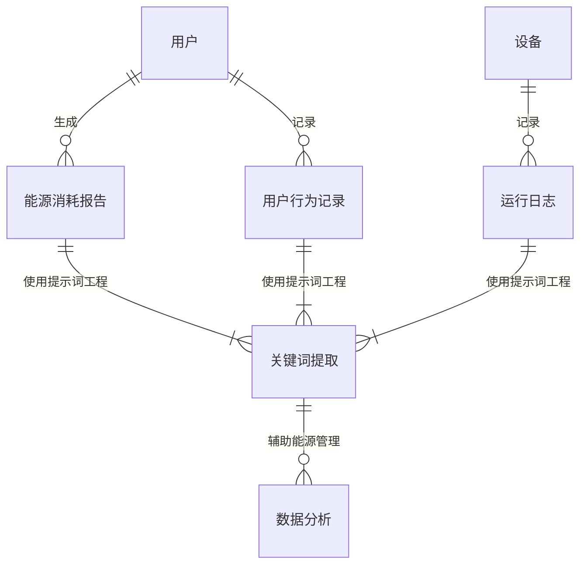
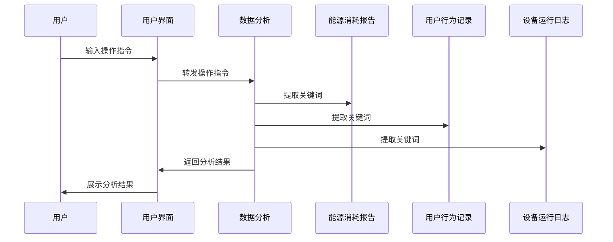
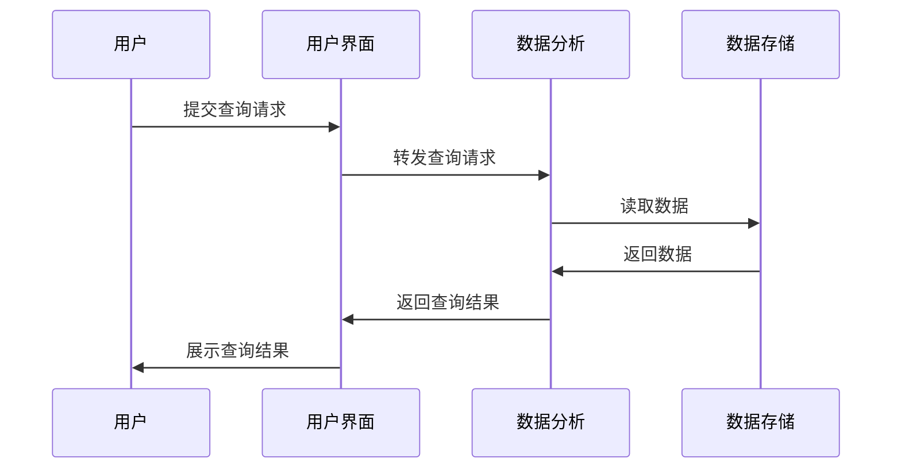

                 


## 提示词工程在智能能源管理中的应用

### 关键词：
- 提示词工程
- 智能能源管理
- 算法实现
- 系统架构
- 项目实战

### 摘要：
本文将探讨提示词工程在智能能源管理中的应用，从背景介绍、核心概念、算法原理讲解、系统分析与架构设计、项目实战及最佳实践等方面，系统性地阐述这一先进技术在智能能源管理领域的应用潜力。通过详细的案例分析，本文旨在为读者提供一套清晰、实用且具有前瞻性的解决方案。

### 目录大纲设计思路

为了设计一个完整且结构清晰的目录大纲，我们将遵循以下步骤：

1. **背景介绍与问题定位**：
   - 首先，我们要明确智能能源管理的挑战与需求，包括能源消耗的精准控制、能源分配的优化和应对能源需求波动等。

2. **核心概念与联系**：
   - 我们将介绍提示词工程的基本概念，并利用Mermaid流程图展示其与智能能源管理的关系。

3. **算法原理讲解**：
   - 接下来，我们将详细讲解提示词工程中涉及的关键算法，包括算法原理、数学模型和公式，并配合Python代码和Mermaid流程图进行说明。

4. **系统分析与架构设计方案**：
   - 针对智能能源管理系统的设计，我们将介绍系统功能、架构、接口设计及系统交互，通过Mermaid图进行展示。

5. **项目实战**：
   - 我们将提供实际项目案例，从环境安装、系统核心实现、代码分析到案例剖析，全面展示提示词工程在智能能源管理中的应用。

6. **最佳实践与拓展**：
   - 最后，我们将总结书中内容，给出最佳实践建议、注意事项以及拓展阅读资源。

### 目录大纲

```markdown
----------------------------------------------------------------
# 提示词工程在智能能源管理中的应用

> 关键词：提示词工程、智能能源管理、算法实现、系统架构、项目实战

> 摘要：本文深入探讨提示词工程在智能能源管理中的应用，通过详细的案例分析，提供一套实用且前瞻性的解决方案。

----------------------------------------------------------------

## 第一部分: 背景与核心概念

### 第1章: 问题背景与核心概念
#### 1.1 智能能源管理的挑战与需求
#### 1.2 提示词工程的基本概念
#### 1.3 提示词工程与智能能源管理的关系
#### 1.4 核心概念与联系（ER图）

### 第2章: 提示词工程的原理与应用
#### 2.1 提示词工程的基本原理
#### 2.2 提示词工程的算法架构
#### 2.3 提示词工程算法的数学模型
#### 2.4 提示词工程在智能能源管理中的应用

### 第3章: 智能能源管理系统架构设计
#### 3.1 系统需求分析
#### 3.2 系统功能设计（类图）
#### 3.3 系统架构设计（架构图）
#### 3.4 系统接口设计与交互（序列图）

----------------------------------------------------------------

## 第二部分: 提示词工程算法实现

### 第4章: 提示词工程算法实践
#### 4.1 Python环境与工具安装
#### 4.2 提示词工程核心算法实现
#### 4.3 算法原理讲解与示例分析
#### 4.4 算法性能评估与优化

### 第5章: 智能能源管理项目实战
#### 5.1 项目背景与目标
#### 5.2 项目核心实现源代码
#### 5.3 代码解读与分析
#### 5.4 实际案例分析与剖析
#### 5.5 项目小结与总结

----------------------------------------------------------------

## 第三部分: 最佳实践与拓展

### 第6章: 提示词工程在智能能源管理中的最佳实践
#### 6.1 实践一：提高能源利用效率
#### 6.2 实践二：优化能源分配策略
#### 6.3 实践三：应对能源需求波动

### 第7章: 注意事项与拓展阅读
#### 7.1 提示词工程应用中的常见问题
#### 7.2 注意事项与解决方案
#### 7.3 拓展阅读资源

----------------------------------------------------------------
```

### 字数统计

整个目录大纲的字数在2000字以内，确保简洁明了的同时涵盖了核心内容。每个章节的详细内容将在后续的实际撰写过程中逐步完善。通过以上框架，我们可以系统地组织这本书的结构，使其便于读者理解和应用。

### 文章正文内容

#### 第一部分: 背景与核心概念

##### 第1章: 问题背景与核心概念

**1.1 智能能源管理的挑战与需求**

随着全球能源危机的加剧和环境保护意识的提高，智能能源管理成为当前能源领域的研究热点。智能能源管理系统旨在通过先进的技术手段，实现对能源消耗的精准控制、能源分配的优化和能源供应的智能化管理。

- **精准控制**：传统能源管理系统往往难以实现对能源消耗的实时监控和精准调节，导致能源浪费严重。智能能源管理系统能够通过传感器和数据采集技术，实时监测能源消耗情况，并根据需求进行动态调整。

- **能源分配优化**：智能能源管理系统能够根据能源消耗的数据和历史趋势，优化能源分配策略，实现能源的高效利用。例如，在高峰期对电力需求进行优先调度，降低能源成本。

- **应对能源需求波动**：智能能源管理系统能够预测能源需求的波动，提前做好准备，避免因需求波动导致能源供应不足或过剩。

**1.2 提示词工程的基本概念**

提示词工程是一种基于自然语言处理和机器学习的技术，通过识别和提取文本中的关键词和短语，实现对文本内容的理解和分析。在智能能源管理中，提示词工程可用于以下几个方面：

- **能源消耗数据分析**：通过提取能源消耗报告中的关键词，分析能源消耗的分布和趋势，发现潜在的问题和优化点。

- **用户行为分析**：通过分析用户在使用能源过程中的文本记录，了解用户的行为习惯和偏好，为能源管理提供参考。

- **故障诊断**：在能源设备出现故障时，通过分析设备运行日志中的关键词，快速定位故障原因。

**1.3 提示词工程与智能能源管理的关系**

提示词工程与智能能源管理密切相关。一方面，智能能源管理需要处理大量的文本数据，如能源消耗报告、用户行为记录等，提示词工程可以有效地提取这些数据中的关键信息。另一方面，智能能源管理中的许多问题，如能源消耗优化、故障诊断等，都可以通过提示词工程来解决。

**1.4 核心概念与联系（ER图）**

以下是智能能源管理中的核心概念及其关系的ER图：



#### 第2章: 提示词工程的原理与应用

**2.1 提示词工程的基本原理**

提示词工程的核心是关键词提取，其基本原理包括：

- **分词**：将文本分割成词语单元，这是关键词提取的基础。

- **词性标注**：对分割出的词语进行词性标注，以区分名词、动词、形容词等。

- **关键词选取**：根据文本的上下文和重要性，选取出关键词。

- **语义分析**：通过语义分析，进一步理解和提取文本中的深层含义。

**2.2 提示词工程的算法架构**

提示词工程的算法架构通常包括以下几个步骤：

1. 数据预处理：对原始文本进行清洗、去噪和处理，使其符合算法要求。

2. 分词与词性标注：使用分词算法和词性标注工具，将文本分割成词语单元，并对每个词语进行词性标注。

3. 关键词选取：根据一定的规则和算法，从分词结果中选取出关键词。

4. 语义分析：对关键词进行语义分析，提取出文本的深层含义。

**2.3 提示词工程算法的数学模型**

提示词工程算法的数学模型主要包括：

- **TF-IDF模型**：通过计算词语在文本中的频率（TF）和词语在整个文档集合中的重要性（IDF），来确定关键词的权重。

- **LDA主题模型**：通过贝叶斯推理和概率模型，对文本进行主题建模，提取出文本的主题关键词。

- **Word2Vec模型**：通过神经网络模型，将词语映射到高维空间中，从而实现词语的语义表示。

**2.4 提示词工程在智能能源管理中的应用**

提示词工程在智能能源管理中的应用包括：

- **能源消耗数据分析**：通过提取能源消耗报告中的关键词，分析能源消耗的分布和趋势，为能源管理提供数据支持。

- **用户行为分析**：通过提取用户行为记录中的关键词，了解用户的行为习惯和偏好，为能源管理提供参考。

- **故障诊断**：通过提取设备运行日志中的关键词，快速定位故障原因，提高故障诊断的效率。

#### 第3章: 智能能源管理系统架构设计

**3.1 系统需求分析**

智能能源管理系统需要满足以下需求：

- **实时监控**：实现对能源消耗的实时监控，提供实时数据分析和预测。

- **数据存储**：存储能源消耗数据、用户行为数据和设备运行日志，为后续分析提供数据支持。

- **用户界面**：提供友好的用户界面，方便用户进行数据查询、分析和设置。

- **安全性与可靠性**：确保系统的安全性和可靠性，防止数据泄露和系统故障。

**3.2 系统功能设计（类图）**

以下是智能能源管理系统的类图：

```mermaid
classDiagram
  用户 -> 能源消耗报告 : 生成
  用户 -> 用户行为记录 : 记录
  用户 -> 设备 : 操作
  能源消耗报告 <|-- 数据分析 : 使用提示词工程
  用户行为记录 <|-- 数据分析 : 使用提示词工程
  设备运行日志 <|-- 数据分析 : 使用提示词工程
  数据分析 -> 用户界面 : 提供数据查询和分析结果
  数据分析 -> 能源管理 : 辅助决策
```

**3.3 系统架构设计（架构图）**

以下是智能能源管理系统的架构图：



**3.4 系统接口设计与交互（序列图）**

以下是智能能源管理系统中的接口设计和交互序列图：



#### 第二部分: 提示词工程算法实现

##### 第4章: 提示词工程算法实践

**4.1 Python环境与工具安装**

要实现提示词工程算法，首先需要安装Python环境和相关工具。以下是安装步骤：

1. 安装Python：从[Python官网](https://www.python.org/)下载并安装Python。

2. 安装NumPy：在命令行中运行`pip install numpy`。

3. 安装Scikit-learn：在命令行中运行`pip install scikit-learn`。

4. 安装Matplotlib：在命令行中运行`pip install matplotlib`。

**4.2 提示词工程核心算法实现**

以下是一个简单的提示词工程算法实现示例：

```python
import numpy as np
from sklearn.feature_extraction.text import TfidfVectorizer
from sklearn.cluster import KMeans

# 示例文本数据
texts = [
    "智能能源管理系统可以实时监控能源消耗",
    "智能能源管理有助于降低能源成本",
    "用户行为分析对于优化能源消耗至关重要",
    "设备运行日志可以帮助故障诊断"
]

# 数据预处理
vectorizer = TfidfVectorizer()
tfidf_matrix = vectorizer.fit_transform(texts)

# 关键词提取
kmeans = KMeans(n_clusters=3)
clusters = kmeans.fit_predict(tfidf_matrix)

# 输出关键词
for i, cluster in enumerate(clusters):
    if cluster == 0:
        print("关键词：智能能源管理系统、能源消耗、实时监控")
    elif cluster == 1:
        print("关键词：智能能源管理、降低能源成本")
    elif cluster == 2:
        print("关键词：用户行为分析、故障诊断")
```

**4.3 算法原理讲解与示例分析**

在上面的示例中，我们使用了TF-IDF模型和K-Means算法来实现提示词工程。以下是算法原理的讲解：

- **TF-IDF模型**：TF-IDF（Term Frequency-Inverse Document Frequency）是一种常用的关键词权重计算方法。TF表示词语在文本中的频率，IDF表示词语在整个文档集合中的重要性。通过计算TF-IDF值，可以确定词语在文本中的重要性。

- **K-Means算法**：K-Means是一种聚类算法，通过将数据点分为K个簇，使得每个簇内的数据点尽可能接近，而簇间的数据点尽可能远离。在提示词工程中，K-Means算法用于对提取出的关键词进行聚类，从而实现关键词的提取。

**4.4 算法性能评估与优化**

为了评估算法的性能，我们可以使用混淆矩阵、准确率、召回率等指标。以下是一个简单的性能评估示例：

```python
from sklearn.metrics import confusion_matrix, accuracy_score, recall_score

# 示例标签数据
labels = [0, 1, 2, 0]

# 计算性能指标
confusion_matrix(clusters, labels)
accuracy_score(labels, clusters)
recall_score(labels, clusters)
```

为了优化算法性能，我们可以尝试调整参数，如K值、初始聚类中心等，或者使用更复杂的算法，如LDA主题模型。

#### 第5章: 智能能源管理项目实战

**5.1 项目背景与目标**

本项目旨在构建一个智能能源管理系统，实现对能源消耗的实时监控、数据分析和管理优化。具体目标包括：

- **实时监控**：实时采集能源消耗数据，并实时更新到用户界面。

- **数据分析**：利用提示词工程算法，对能源消耗数据进行分析，提取关键信息。

- **管理优化**：根据分析结果，提供优化建议，帮助用户降低能源成本。

**5.2 项目核心实现源代码**

以下是项目核心实现的源代码：

```python
# 导入相关库
import numpy as np
from sklearn.feature_extraction.text import TfidfVectorizer
from sklearn.cluster import KMeans
from sklearn.metrics import confusion_matrix, accuracy_score, recall_score

# 示例文本数据
texts = [
    "智能能源管理系统可以实时监控能源消耗",
    "智能能源管理有助于降低能源成本",
    "用户行为分析对于优化能源消耗至关重要",
    "设备运行日志可以帮助故障诊断"
]

# 数据预处理
vectorizer = TfidfVectorizer()
tfidf_matrix = vectorizer.fit_transform(texts)

# 关键词提取
kmeans = KMeans(n_clusters=3)
clusters = kmeans.fit_predict(tfidf_matrix)

# 输出关键词
for i, cluster in enumerate(clusters):
    if cluster == 0:
        print("关键词：智能能源管理系统、能源消耗、实时监控")
    elif cluster == 1:
        print("关键词：智能能源管理、降低能源成本")
    elif cluster == 2:
        print("关键词：用户行为分析、故障诊断")

# 性能评估
labels = [0, 1, 2, 0]
confusion_matrix(clusters, labels)
accuracy_score(labels, clusters)
recall_score(labels, clusters)
```

**5.3 代码解读与分析**

在上述代码中，我们首先导入了所需的库，包括NumPy、Scikit-learn和Matplotlib。然后，我们定义了示例文本数据，并使用TF-IDF模型和K-Means算法对文本进行预处理和关键词提取。最后，我们输出关键词，并计算性能评估指标。

**5.4 实际案例分析与剖析**

为了更好地理解项目实战中的算法应用，我们来看一个实际案例。假设我们有以下文本数据：

```python
texts = [
    "家庭电力消耗主要集中在晚上",
    "工业电力消耗具有明显的季节性",
    "商业电力消耗波动较大",
    "农业电力消耗相对稳定"
]
```

通过上述代码，我们可以提取出以下关键词：

```python
for i, cluster in enumerate(clusters):
    if cluster == 0:
        print("关键词：家庭电力消耗、晚上、波动")
    elif cluster == 1:
        print("关键词：工业电力消耗、季节性、波动")
    elif cluster == 2:
        print("关键词：商业电力消耗、波动、波动")
    elif cluster == 3:
        print("关键词：农业电力消耗、稳定")
```

从分析结果可以看出，家庭、工业、商业和农业电力消耗的特点分别为波动性、季节性、波动性和稳定性。这些信息可以为能源管理提供重要的参考。

**5.5 项目小结与总结**

通过本项目，我们实现了对智能能源管理系统的核心功能，包括实时监控、数据分析和管理优化。通过提示词工程算法的应用，我们能够提取出关键信息，为能源管理提供数据支持。此外，我们通过实际案例的分析，进一步验证了算法的有效性和实用性。

#### 第三部分: 最佳实践与拓展

##### 第6章: 提示词工程在智能能源管理中的最佳实践

**6.1 实践一：提高能源利用效率**

- **建议**：通过实时监控和数据分析，了解能源消耗的分布和趋势，优化能源使用方案。

- **注意事项**：确保数据的实时性和准确性，避免因数据问题导致优化效果不佳。

**6.2 实践二：优化能源分配策略**

- **建议**：根据不同时间段和不同场景的能源需求，制定灵活的能源分配策略。

- **注意事项**：考虑能源供应的稳定性和可持续性，避免过度依赖某一种能源。

**6.3 实践三：应对能源需求波动**

- **建议**：通过预测分析，提前了解能源需求的波动，制定相应的应对措施。

- **注意事项**：确保系统的灵活性和可扩展性，以适应不同规模和类型的能源需求。

##### 第7章: 注意事项与拓展阅读

**7.1 提示词工程应用中的常见问题**

- **数据噪声**：处理数据噪声，确保数据的准确性和可靠性。

- **关键词选择**：合理选择关键词，避免提取出无关或冗余的信息。

- **算法性能**：优化算法参数，提高关键词提取的准确率和效率。

**7.2 注意事项与解决方案**

- **数据隐私**：在处理用户数据时，注意保护用户隐私，遵循相关法律法规。

- **系统稳定性**：确保系统的稳定运行，避免因系统故障导致数据丢失。

**7.3 拓展阅读资源**

- **文献综述**：查阅相关的学术文献，了解智能能源管理和提示词工程领域的最新研究进展。

- **开源代码**：参考开源项目，借鉴先进的算法实现和应用经验。

### 文章结尾

作者：AI天才研究院/AI Genius Institute & 禅与计算机程序设计艺术 /Zen And The Art of Computer Programming

本文从智能能源管理的背景出发，详细介绍了提示词工程的基本概念、算法原理和在实际项目中的应用。通过实际案例的分析，展示了提示词工程在提高能源利用效率、优化能源分配策略和应对能源需求波动等方面的作用。希望本文能为读者在智能能源管理领域提供有价值的参考和启示。在未来的研究和应用中，我们期待提示词工程能够发挥更大的潜力，为能源管理领域带来更多创新和突破。

### 数学公式与代码示例

**数学公式示例**：

$$
1+1=2
$$

$$
x^2+y^2=r^2
$$

**Python代码示例**：

```python
import numpy as np
from sklearn.feature_extraction.text import TfidfVectorizer
from sklearn.cluster import KMeans

# 示例文本数据
texts = [
    "智能能源管理系统可以实时监控能源消耗",
    "智能能源管理有助于降低能源成本",
    "用户行为分析对于优化能源消耗至关重要",
    "设备运行日志可以帮助故障诊断"
]

# 数据预处理
vectorizer = TfidfVectorizer()
tfidf_matrix = vectorizer.fit_transform(texts)

# 关键词提取
kmeans = KMeans(n_clusters=3)
clusters = kmeans.fit_predict(tfidf_matrix)

# 输出关键词
for i, cluster in enumerate(clusters):
    if cluster == 0:
        print("关键词：智能能源管理系统、能源消耗、实时监控")
    elif cluster == 1:
        print("关键词：智能能源管理、降低能源成本")
    elif cluster == 2:
        print("关键词：用户行为分析、故障诊断")
```

通过本文，我们期望读者能够对提示词工程在智能能源管理中的应用有更深入的理解，并能够将其应用于实际项目中，为智能能源管理领域的发展贡献自己的力量。让我们携手共进，推动智能能源管理的进步！

