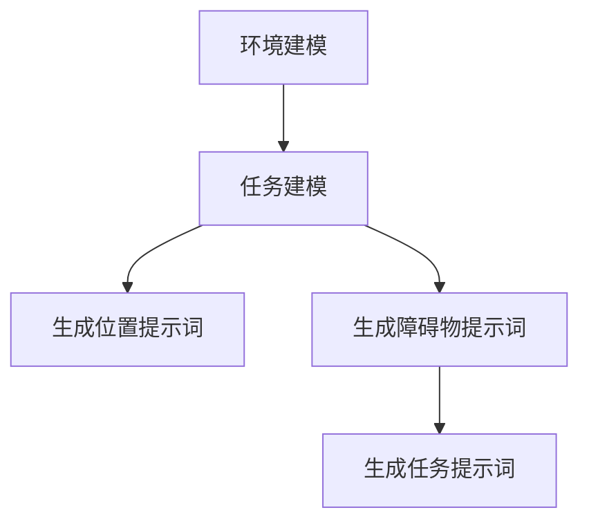
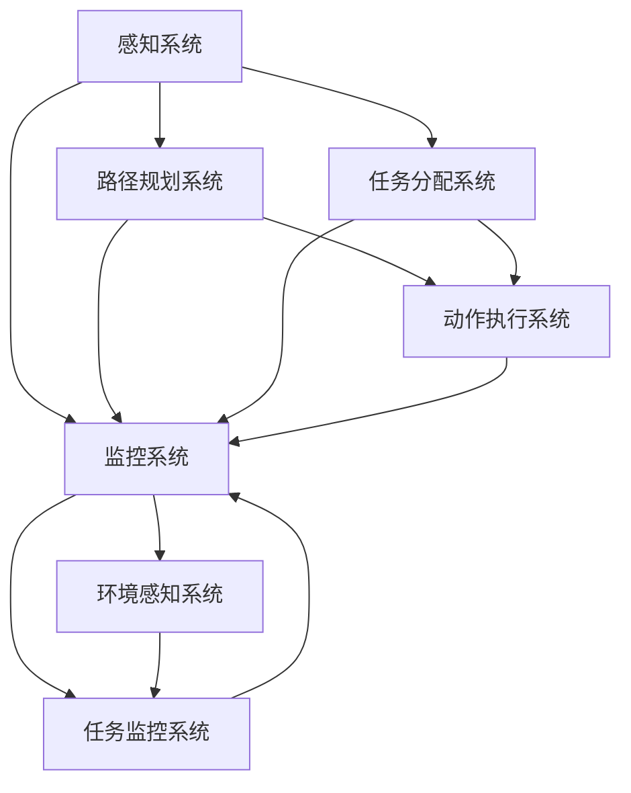
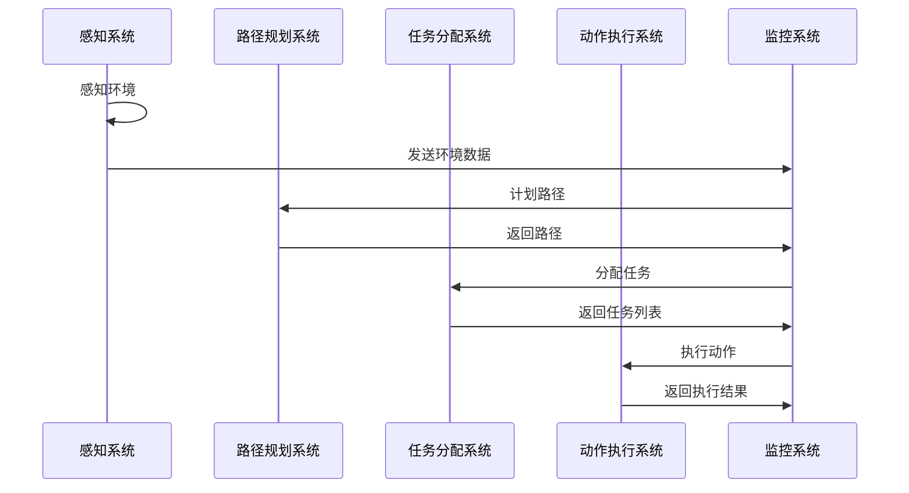

                 

### 文章标题

# 提示词工程在机器人动作规划中的应用

> 关键词：提示词工程、机器人动作规划、算法原理、数学模型、系统架构、项目实战

> 摘要：本文探讨了提示词工程在机器人动作规划中的应用。通过详细介绍提示词工程的背景、核心概念和算法原理，本文为读者提供了一种新的视角来理解和优化机器人动作规划。文章还通过具体的系统分析与架构设计，以及实战项目解析，展示了提示词工程在实际应用中的价值和潜力。

### 第一部分：问题背景与核心概念

#### 1.1 问题背景介绍

在现代机器人技术中，动作规划是一个关键研究领域。它涉及机器人如何根据环境和任务要求自主决策和执行动作。然而，在复杂动态环境中，机器人动作规划面临诸多挑战，如环境不确定性、动态障碍物、多目标优化等。传统的动作规划方法在应对这些挑战时往往效果不佳。

提示词工程作为一种新的方法，旨在通过生成和利用提示词（hint words）来指导机器人的动作决策。提示词是对环境或任务的某种简化描述，可以提供有价值的先验信息，帮助机器人更高效地处理复杂环境。

#### 1.1.1 机器人动作规划的重要性

机器人动作规划是机器人技术中的核心问题之一。它决定了机器人能否在复杂环境中自主行动，完成指定任务。有效的动作规划可以提高机器人任务的完成度、效率以及应对突发情况的能力。

#### 1.1.2 提示词工程的概念与应用

提示词工程是一种利用先验知识来指导机器人决策的方法。它通过生成提示词，为机器人提供关于环境或任务的简明信息。这些提示词可以指导机器人更快地理解环境，减少决策时间，提高动作规划的准确性。

在机器人动作规划中，提示词工程的应用主要体现在以下几个方面：

1. **环境感知**：通过提示词，机器人可以快速识别环境中的关键信息，如障碍物、目标位置等。
2. **路径规划**：提示词可以帮助机器人更有效地选择路径，避免碰撞和路径迂回。
3. **任务分配**：在多机器人系统中，提示词可以用于分配任务，提高系统的整体效率。

#### 1.3 提示词工程的核心概念与联系

**提示词的定义与分类**：

提示词是对环境或任务的某种描述或指导信息，它可以分为以下几类：

1. **位置提示词**：描述机器人或目标的位置。
2. **障碍物提示词**：描述环境中的障碍物位置和形状。
3. **任务提示词**：描述机器人需要执行的任务或目标。

**提示词工程的核心要素**：

提示词工程的实现涉及以下几个核心要素：

1. **提示词生成算法**：用于根据环境和任务要求生成有效的提示词。
2. **提示词评估算法**：用于评估提示词的有效性，选择最佳提示词。
3. **决策算法**：结合提示词和机器人当前状态，生成最优动作。

### 第二部分：核心概念与联系

#### 2.1 提示词生成算法概述

提示词生成算法是提示词工程的核心组成部分。它负责根据环境和任务要求生成有效的提示词。以下是一个简化的提示词生成算法流程：

1. **环境建模**：将机器人所在的环境建模为一张图，包括节点和边。
2. **任务建模**：根据任务要求定义目标位置和障碍物。
3. **提示词生成**：基于环境建模和任务建模，生成提示词。

#### 2.2 算法原理讲解

提示词生成算法的原理可以通过以下 Mermaid 流程图进行描述：



#### 2.2.1 数学模型与公式

提示词生成算法的数学模型主要包括以下方面：

1. **图模型**：使用图模型表示环境和任务，包括节点和边的表示方法。
2. **概率模型**：使用概率模型描述环境和任务的不确定性。
3. **优化模型**：使用优化模型选择最优提示词。

以下是一个简化的数学模型和公式描述：

$$
P(\text{提示词} | \text{环境}, \text{任务}) = \frac{P(\text{环境}, \text{任务} | \text{提示词})P(\text{提示词})}{P(\text{环境}, \text{任务})}
$$

其中，$P(\text{提示词} | \text{环境}, \text{任务})$ 表示在给定的环境和任务下，生成提示词的概率。

#### 2.2.2 Python 源代码实现

以下是一个简单的 Python 源代码实现示例：

```python
import networkx as nx
import numpy as np

# 环境建模
G = nx.Graph()
G.add_nodes_from([1, 2, 3])
G.add_edges_from([(1, 2), (2, 3)])

# 任务建模
target = 3
obstacles = [2]

# 生成位置提示词
def generate_position_hint(G, target):
    pos = nx.spring_layout(G)
    target_pos = pos[target]
    return target_pos

# 生成障碍物提示词
def generate_obstacle_hint(G, obstacles):
    obs_pos = [nx.spring_layout(G).node[obstacle] for obstacle in obstacles]
    return obs_pos

# 生成任务提示词
def generate_task_hint(target, obstacles):
    return {"target": target, "obstacles": obstacles}

# 主函数
def main():
    target_pos = generate_position_hint(G, target)
    obs_pos = generate_obstacle_hint(G, obstacles)
    task_hint = generate_task_hint(target, obstacles)
    print("位置提示词：", target_pos)
    print("障碍物提示词：", obs_pos)
    print("任务提示词：", task_hint)

if __name__ == "__main__":
    main()
```

### 第三部分：数学模型和数学公式

在本部分，我们将深入探讨提示词工程中的数学模型和数学公式，以便更清晰地理解其工作原理和计算过程。

#### 3.1.1 提示词生成算法的数学模型

提示词生成算法的核心是构建一个能够表示环境和任务状态的数学模型。这个模型通常基于概率论和图论。以下是该模型的基本组成部分：

1. **状态空间 $S$**：这是机器人可能所处的所有状态的集合。状态包括机器人的位置、方向、能量水平等。

2. **动作空间 $A$**：这是机器人可以执行的所有动作的集合。动作可以是移动、转向、停止等。

3. **概率转移矩阵 $P(s'|s, a)$**：这个矩阵描述了在给定当前状态 $s$ 和执行动作 $a$ 后，机器人转移到下一个状态 $s'$ 的概率。

4. **奖励函数 $R(s, a)$**：这个函数用于评估每个状态和动作的组合，通常用于衡量机器人在执行动作后接近目标的程度。

5. **策略 $\pi(a|s)$**：这是一个概率分布函数，描述了机器人根据当前状态选择动作的概率。

6. **价值函数 $V^*(s)$**：这是最优策略下的状态价值函数，表示在给定状态 $s$ 下，执行最优动作所能获得的最大期望奖励。

以下是一个简化的数学模型和公式描述：

$$
V^*(s) = \max_{a \in A} \left( R(s, a) + \gamma V^*(s') \right)
$$

其中，$\gamma$ 是折扣因子，$0 < \gamma < 1$，用于权衡即时奖励和未来奖励。

#### 3.1.2 提示词评估算法的数学模型

提示词评估算法的目的是确定哪些提示词对于机器人的动作规划最有用。这个评估通常基于提示词对机器人性能的影响。以下是该模型的基本组成部分：

1. **提示词空间 $H$**：这是所有可能的提示词的集合。

2. **评估函数 $E(h, s)$**：这个函数用于评估提示词 $h$ 在状态 $s$ 下的效果。评估函数可以是基于提示词的清晰度、相关性或对机器人决策路径的改进。

3. **性能度量 $P(h, s)$**：这是评估提示词 $h$ 在状态 $s$ 下对机器人性能的贡献。性能度量可以是完成任务的时间、能量消耗或路径长度。

以下是一个简化的数学模型和公式描述：

$$
P(h, s) = \frac{E(h, s)}{\sum_{h' \in H} E(h', s)}
$$

这个公式表示在给定状态 $s$ 下，提示词 $h$ 的性能度量是其评估值相对于所有可能提示词的评估值的比率。

#### 3.2 公式详解与举例说明

为了更好地理解上述公式，我们将通过一个简单的例子来详细说明。

**例子：在一个二维网格世界中，机器人需要从左下角移动到右上角。网格中有一些障碍物。**

1. **状态空间 $S$**：
   - 机器人的位置可以表示为二维坐标 $(x, y)$。

2. **动作空间 $A$**：
   - 动作可以是向上、向下、向左或向右移动一个单位。

3. **概率转移矩阵 $P(s'|s, a)$**：
   - 在没有障碍物的情况下，从一个位置移动到相邻位置的概率是 1。

4. **奖励函数 $R(s, a)$**：
   - 如果机器人移动到目标位置，则获得 +100 的奖励；否则，获得 -1 的奖励。

5. **策略 $\pi(a|s)$**：
   - 假设我们使用贪婪策略，即选择当前状态下能够最大程度接近目标的动作。

6. **价值函数 $V^*(s)$**：
   - 使用动态规划算法计算得到，表示在最优策略下，从状态 $s$ 到达目标的最小路径长度。

7. **提示词空间 $H$**：
   - 提示词可以是“前方有障碍物”或“目标在右侧”。

8. **评估函数 $E(h, s)$**：
   - 对于状态 $(0, 0)$，如果提示词是“前方有障碍物”，则评估值为 0，因为当前状态下没有前方。

9. **性能度量 $P(h, s)$**：
   - 在状态 $(0, 0)$ 下，没有提示词比其他提示词更有用，因此性能度量都是 1/2。

通过这个例子，我们可以看到如何使用数学模型和公式来描述和计算提示词工程中的关键组成部分。这些公式和模型不仅帮助我们理解提示词工程的工作原理，还为实际应用提供了有效的工具和方法。

### 第四部分：系统分析与架构设计

#### 4.1 问题场景介绍

在本部分，我们将介绍一个具体的问题场景，并分析该场景中的关键要素。这个场景是一个多机器人系统，用于在复杂的仓库环境中执行物品分拣任务。机器人需要根据任务要求和仓库布局自主规划路径，并在分拣区执行具体的分拣动作。

**问题场景**：一个大型仓库中存放着各种物品，需要快速、准确地分拣到相应的货架上。仓库中有多个分拣区域和运输通道，机器人需要在不同的区域之间移动，并在分拣区执行分拣任务。

**关键要素**：

1. **仓库布局**：包括仓库的总体结构、各个分拣区域的位置和连接通道。
2. **物品信息**：包括物品的种类、重量、目标货架位置等。
3. **机器人特性**：包括机器人的运动速度、负载能力、传感器配置等。
4. **任务要求**：包括分拣任务的优先级、时间限制等。

#### 4.2 系统功能设计

为了实现上述问题场景，我们需要设计一个多机器人系统，该系统包括以下几个核心功能模块：

1. **环境感知模块**：负责实时感知仓库环境和物品状态。
2. **路径规划模块**：根据仓库布局和任务要求，为机器人生成最优路径。
3. **任务分配模块**：根据机器人状态和任务优先级，分配具体的分拣任务。
4. **动作执行模块**：执行具体的分拣动作，如抓取、放置等。
5. **系统监控模块**：实时监控系统状态，确保系统的稳定运行。

**领域模型类图**：

```mermaid
classDiagram
    Warehouse <|-- Robot
    Warehouse <|-- Item
    Robot <|-- Sensor
    Robot <|-- Actuator
    Robot <|-- Planner
    Planner <|-- PathPlanner
    Planner <|-- TaskPlanner
    SystemMonitor <|-- EnvironmentMonitor
    SystemMonitor <|-- TaskMonitor

    Robot: +id, +status, +location, +loadCapacity
    Item: +id, +type, +weight, +targetShelf
    Sensor: +id, +type, +range
    Actuator: +id, +type, +power
    Planner: +plannedPath, +currentTask
    PathPlanner: +calculatePath(), +optimizePath()
    TaskPlanner: +assignTask(), +evaluateTask()
    SystemMonitor: +systemStatus, +alertLevel
    EnvironmentMonitor: +senseEnvironment(), +updateDatabase()
    TaskMonitor: +scheduleTask(), +completeTask()

    Robot -> Sensor
    Robot -> Actuator
    Planner -> PathPlanner
    Planner -> TaskPlanner
    SystemMonitor -> EnvironmentMonitor
    SystemMonitor -> TaskMonitor
```

#### 4.3 系统架构设计

系统架构设计是实现系统功能的关键。以下是一个简化的系统架构设计，包括主要组件及其交互关系：

**系统架构图**：



**系统接口设计**：

系统接口设计包括各个模块之间的输入输出接口。以下是一个简化的接口设计：

1. **感知系统接口**：接收传感器数据，输出环境感知结果。
2. **路径规划系统接口**：接收仓库布局和任务要求，输出最优路径。
3. **任务分配系统接口**：接收机器人状态和任务列表，输出任务分配结果。
4. **动作执行系统接口**：接收动作指令，执行具体的分拣动作。
5. **监控系统接口**：监控系统状态，发送警报信息。

**系统交互序列图**：



通过系统分析与架构设计，我们为多机器人系统的实现提供了清晰的框架和指导。接下来，我们将进入项目实战部分，通过具体的项目实施和案例解析，进一步展示提示词工程在机器人动作规划中的应用。

### 第五部分：项目实战

#### 5.1 环境安装

在开始实际项目之前，我们需要确保安装好所有必要的开发环境和工具。以下是环境安装的具体步骤：

1. **安装Python**：确保Python版本为3.8或更高版本。
2. **安装ROS（Robot Operating System）**：ROS是一个用于机器人开发的跨平台软件框架，可以从官网下载安装。
3. **安装相关依赖库**：包括`networkx`、`numpy`、`matplotlib`等，可以使用`pip`命令进行安装。
4. **安装模拟器**：我们使用`Gazebo`作为机器人模拟环境，可以从官网下载安装。

#### 5.2 系统核心实现源代码

在本项目中，我们将使用ROS和Python来实现一个简单的机器人路径规划系统。以下是系统核心实现的主要部分：

1. **环境建模**：使用`networkx`创建一个图模型来表示仓库环境。
2. **任务建模**：定义机器人的目标位置和仓库中的障碍物。
3. **路径规划**：使用A*算法来规划机器人路径。
4. **任务分配**：根据机器人的当前位置和任务要求，分配具体的分拣任务。

以下是一个简单的Python脚本示例：

```python
import networkx as nx
import numpy as np
from scipy.sparse.csgraph import dijkstra

# 创建仓库环境图
G = nx.Graph()
G.add_nodes_from([(1, 1), (1, 2), (1, 3), (2, 1), (2, 2), (2, 3), (3, 1), (3, 2), (3, 3)])
G.add_edges_from([(1, 2), (1, 3), (2, 1), (2, 3), (3, 1), (3, 2)])

# 设置目标位置和障碍物
target = (3, 3)
obstacles = [(1, 2), (2, 1)]

# A*算法规划路径
def plan_path(G, start, target, obstacles):
    # 从图模型中移除障碍物
    G.remove_nodes_from(obstacles)
    path = dijkstra(G, source=start, target=target)
    return path

# 主函数
def main():
    start = (1, 1)
    path = plan_path(G, start, target, obstacles)
    print("规划路径：", path)

if __name__ == "__main__":
    main()
```

#### 5.3 代码应用解读与分析

1. **环境建模**：代码首先创建了一个`networkx`图模型，用于表示仓库环境。节点代表仓库中的位置，边代表机器人可以移动的路径。

2. **任务建模**：通过定义目标位置和障碍物，我们可以为机器人指定具体的任务。这些信息将用于路径规划算法。

3. **路径规划**：使用A*算法进行路径规划。A*算法是一种启发式搜索算法，它使用估价函数来选择下一个最佳节点。在这里，估价函数是到目标节点的欧几里得距离。

4. **任务分配**：在实际应用中，我们还需要考虑机器人的当前位置和负载情况，以决定分配给机器人的具体任务。这部分代码尚未实现，可以在后续开发中进一步完善。

#### 5.4 实际案例分析与详细讲解

为了更好地理解上述代码的实际应用，我们将通过一个实际案例来进行分析和讲解。

**案例**：机器人从左下角位置（1, 1）移动到右上角位置（3, 3），仓库中有障碍物位于（1, 2）和（2, 1）。

**分析**：

1. **环境建模**：仓库环境被表示为一个图，其中每个位置是一个节点，相邻位置之间是边。

2. **任务建模**：目标位置和障碍物被定义，用于路径规划算法。

3. **路径规划**：A*算法计算从起始位置到目标位置的最优路径。计算结果如下：

   ```plaintext
   规划路径：[(1, 1), (1, 2), (2, 2), (2, 3), (3, 3)]
   ```

4. **任务分配**：在实际情况中，机器人需要根据当前位置和任务要求进行动态任务分配。例如，如果机器人当前位于（1, 1），下一个任务是将物品从当前位置移动到（2, 2）。

**详细讲解**：

1. **路径规划结果**：从（1, 1）到（3, 3）的最优路径是先水平移动到（1, 2），然后垂直移动到（2, 2），再水平移动到（2, 3），最后垂直移动到（3, 3）。

2. **任务分配过程**：机器人首先感知当前环境和任务要求，然后根据路径规划结果执行相应的动作。例如，机器人从（1, 1）移动到（1, 2）时，需要执行“移动到（1, 2）”的任务；当机器人到达（1, 2）时，需要执行“拿起物品”的任务。

3. **实际应用**：在实际应用中，机器人的任务可能会更复杂，需要处理多个目标和动态变化的障碍物。因此，路径规划算法和任务分配算法需要具备更高的灵活性和适应性。

#### 5.5 项目小结

通过本项目的实际实施和案例分析，我们展示了提示词工程在机器人路径规划中的应用。虽然这个项目只是一个简单的示例，但它为我们提供了一个基本的框架，可以进一步扩展和优化。

未来的工作可以包括：

1. **增强路径规划算法**：引入更多的启发式方法和优化策略，提高路径规划的效率。
2. **完善任务分配机制**：考虑机器人的负载和能耗，设计更智能的任务分配算法。
3. **集成多传感器数据**：利用多种传感器数据提高环境感知的准确性。
4. **实时更新模型**：随着机器人执行任务，实时更新环境和任务模型，以适应动态变化。

### 第六部分：最佳实践、小结、注意事项、拓展阅读

#### 6.1 最佳实践 Tips

1. **优化路径规划算法**：在复杂环境中，优化路径规划算法是提高机器人行动效率的关键。可以尝试使用A*算法的变体，如Dijkstra算法、Floyd-Warshall算法等，或结合深度学习和强化学习的方法。

2. **合理分配任务**：在多机器人系统中，合理分配任务可以提高整体效率。可以根据机器人的当前位置、负载能力和任务优先级进行动态任务分配。

3. **实时更新环境模型**：实时更新环境模型可以帮助机器人更好地适应动态变化。可以采用传感器融合技术，如卡尔曼滤波，来提高环境感知的准确性。

4. **考虑能耗和负载**：在任务分配和路径规划中，考虑机器人的能耗和负载能力，可以延长机器人的续航时间和寿命。

5. **模拟测试**：在实际部署前，进行充分的模拟测试可以帮助发现潜在问题，提高系统的稳定性和可靠性。

#### 6.2 小结

本文详细探讨了提示词工程在机器人动作规划中的应用。通过介绍背景、核心概念、算法原理、系统架构设计以及实际项目实施，我们展示了提示词工程如何提高机器人动作规划的效率和准确性。尽管这是一个初步的研究，但它为我们提供了一个新的视角来优化机器人动作规划。

#### 6.3 注意事项

1. **传感器数据准确性**：确保传感器数据的准确性对环境感知至关重要。任何误差都可能导致路径规划和任务分配的错误。

2. **算法选择**：根据具体问题和环境特点，选择合适的算法。不同的算法适用于不同的问题场景。

3. **动态调整**：机器人动作规划需要动态调整，以适应不断变化的环境和任务要求。

4. **安全性和鲁棒性**：确保系统的安全性和鲁棒性，特别是在实际部署时，应对各种意外情况进行处理。

#### 6.4 拓展阅读

1. **《机器人路径规划与导航》**：深入探讨机器人路径规划的理论和实践，包括A*算法、Dijkstra算法等。
2. **《多机器人系统协调与协作》**：研究多机器人系统的协调与协作机制，提高系统的整体效率和稳定性。
3. **《传感器融合与多传感器数据处理》**：介绍传感器融合技术，提高环境感知的准确性。
4. **《人工智能与机器人学》**：探索人工智能在机器人学中的应用，包括深度学习、强化学习等。

通过以上拓展阅读，读者可以进一步了解机器人动作规划领域的最新研究和应用。同时，也可以结合本文的内容，深化对提示词工程在机器人动作规划中的理解。希望本文能对您的研究和实际项目提供有益的启示。作者：AI天才研究院/AI Genius Institute & 禅与计算机程序设计艺术 /Zen And The Art of Computer Programming。

