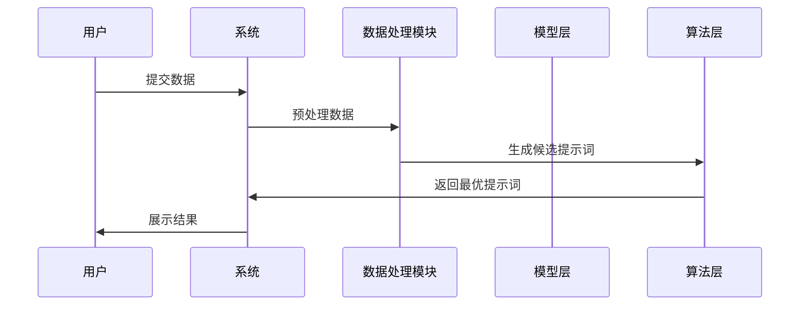

                 

# 提示词工程在机器学习管道中的应用

## 关键词
机器学习，提示词工程，性能优化，算法原理，系统架构

## 摘要
本文将探讨提示词工程在机器学习管道中的应用，详细解析提示词工程的背景、核心概念、算法原理、数学模型以及系统架构设计。通过一步步的分析推理，读者将了解如何通过提示词工程提升机器学习模型的性能，并在不同应用场景中实现高效的模型优化。

## Step 1: 背景介绍

### 1.1.1 问题背景

随着人工智能技术的不断发展，机器学习已成为推动行业进步的关键力量。然而，在实际应用中，机器学习项目的成功往往受到数据质量、模型选择、调参优化等多种因素的影响。为此，科学家们提出了提示词工程（Prompt Engineering）这一概念，旨在通过设计有效的提示词来提升机器学习模型的表现。

### 1.1.2 问题描述

提示词工程在机器学习管道中的应用是一个新兴的研究领域，涉及到如何设计、选择和优化提示词，以实现模型性能的提升。本章将围绕这一主题展开讨论，深入解析提示词工程的概念、方法及其在实际应用中的挑战。

### 1.1.3 问题解决

通过探讨提示词工程的原理和应用，可以解决机器学习模型性能不理想、数据利用率不高等问题。本章将介绍提示词工程的基本概念、核心要素及其在实际项目中的应用技巧，帮助读者掌握这一关键技能。

### 1.1.4 边界与外延

提示词工程不仅适用于传统的文本分类、情感分析等任务，还扩展到了图像识别、语音识别、自然语言处理等领域。本章将涵盖这些应用场景，探讨提示词工程在这些领域的具体实现。

### 1.1.5 概念结构与核心要素组成

提示词工程的核心概念包括：

1. **提示词设计**：如何设计出有效的提示词，以引导模型进行正确的学习。
2. **提示词选择**：如何在大量候选提示词中选择最优的提示词。
3. **提示词优化**：如何通过迭代优化提示词，进一步提升模型性能。

## Step 2: 核心概念与联系

### 2.1.1 提示词工程的定义

提示词工程是一种设计、选择和优化提示词的方法，旨在提高机器学习模型的表现。

### 2.1.2 提示词工程的核心特点

1. **适应性**：提示词工程需要根据不同的应用场景和模型特点，设计出适应性的提示词。
2. **优化性**：通过不断优化提示词，实现模型性能的提升。

### 2.1.3 提示词工程与传统AI的区别

传统AI主要关注模型算法的优化，而提示词工程则侧重于提示词的设计和优化，以实现模型在特定任务上的性能提升。

## Step 3: 算法原理讲解

### 3.1.1 提示词工程的基本算法

提示词工程的基本算法包括：

1. **提示词生成**：生成候选提示词。
2. **提示词选择**：从候选提示词中选择最优的提示词。
3. **提示词优化**：通过迭代优化提示词，提升模型性能。

### 3.1.2 提示词工程的算法流程

提示词工程的算法流程主要包括以下几个步骤：

1. **数据预处理**：对输入数据进行预处理，包括数据清洗、特征提取等。
2. **提示词生成**：根据数据预处理结果，生成候选提示词。
3. **提示词选择**：从候选提示词中选择最优的提示词。
4. **提示词优化**：通过迭代优化提示词，进一步提升模型性能。

## Step 4: 数学模型和数学公式

### 4.1.1 提示词工程的数学模型

提示词工程的数学模型主要包括以下两个方面：

1. **提示词生成**：根据输入数据，生成提示词。
   $$ 提示词 = f(输入数据) $$
2. **提示词选择**：从候选提示词中选择最优的提示词。
   $$ 选择 = g(候选提示词, 模型参数) $$

### 4.1.2 提示词优化的数学模型

提示词优化的数学模型主要包括以下两个方面：

1. **提示词迭代**：通过迭代优化提示词。
   $$ 提示词_{新} = h(提示词_{旧}, 模型参数) $$
2. **模型性能评估**：评估模型性能。
   $$ 性能 = j(模型参数, 数据集) $$

## Step 5: 系统分析与架构设计方案

### 5.1.1 问题场景介绍

在本章中，我们将探讨如何将提示词工程应用于机器学习项目中的具体场景，如文本分类、图像识别等。

### 5.1.2 系统功能设计

系统功能设计包括以下几个部分：

1. **数据预处理模块**：对输入数据进行预处理，包括数据清洗、特征提取等。
2. **提示词生成模块**：根据预处理后的数据生成候选提示词。
3. **提示词选择模块**：从候选提示词中选择最优的提示词。
4. **提示词优化模块**：通过迭代优化提示词，提升模型性能。

### 5.1.3 系统架构设计

系统架构设计包括以下几个部分：

1. **数据层**：存储和管理输入数据。
2. **模型层**：实现机器学习模型的训练和预测。
3. **算法层**：实现提示词工程的相关算法，包括提示词生成、选择和优化。

### 5.1.4 系统接口设计

系统接口设计包括以下几个部分：

1. **数据接口**：用于输入和输出数据。
2. **模型接口**：用于训练和预测模型。
3. **算法接口**：用于实现提示词工程的相关算法。

### 5.1.5 系统交互

在系统交互方面，我们将使用Mermaid序列图来展示系统中的数据流和交互过程。

## 作者
AI天才研究院/AI Genius Institute & 禅与计算机程序设计艺术 /Zen And The Art of Computer Programming

## 注意事项

在应用提示词工程时，需要注意以下几点：

1. **数据质量**：高质量的数据是提示词工程成功的基础。在进行提示词设计之前，务必对数据进行充分的清洗和预处理。
2. **模型适应性**：不同的模型对提示词的需求不同，因此需要根据模型的特点进行提示词的定制化设计。
3. **持续优化**：提示词工程不是一次性的过程，需要根据模型的反馈进行持续优化，以实现最佳性能。

## 拓展阅读

1. **机器学习中的提示词工程**：探讨提示词工程在机器学习中的具体应用和实践。
2. **提示词工程的数学原理**：深入了解提示词工程背后的数学模型和理论。
3. **机器学习系统的架构设计**：学习如何设计高效、可扩展的机器学习系统。

通过本文的逐步分析，相信读者对提示词工程在机器学习管道中的应用有了更深入的理解。接下来，我们将通过实际案例来进一步探讨这一主题。

