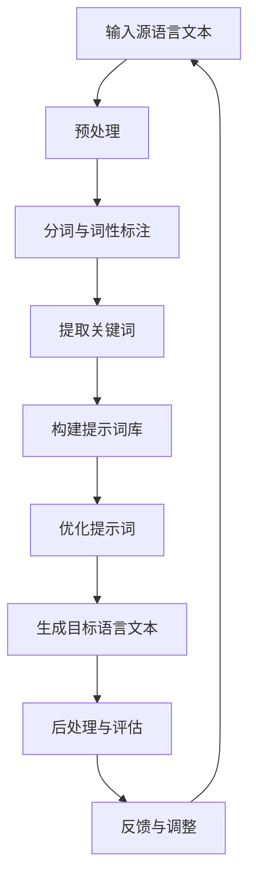
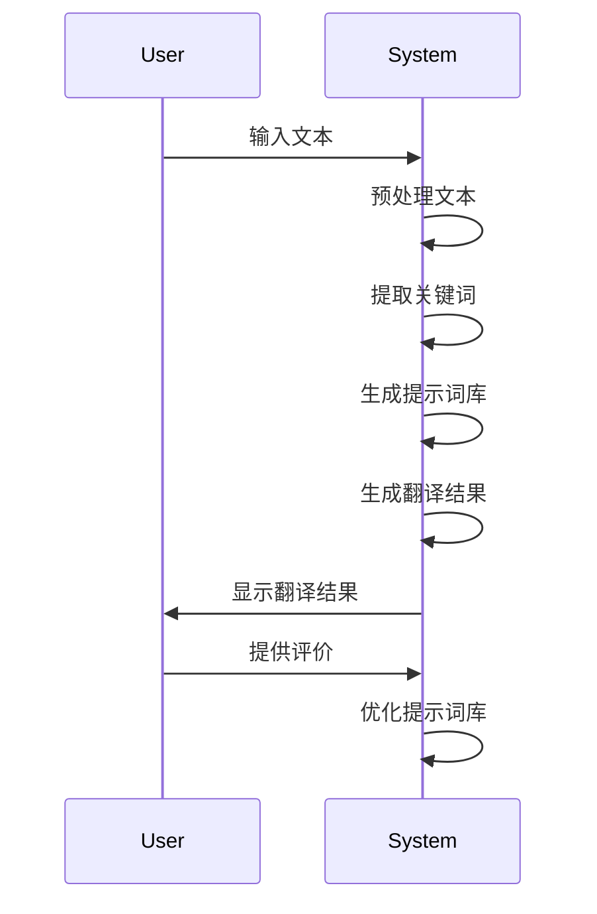

                 


### 确定文章的核心内容和结构

为了撰写一篇深入浅出、逻辑清晰、内容丰富的技术博客，我们将按照以下步骤确定文章的核心内容和结构：

#### 1. 确定文章主题和核心关键词

文章的主题是“提示词工程在机器翻译中的文化适应”。核心关键词包括“提示词工程”、“机器翻译”、“文化适应”、“自然语言处理”和“语言模型”。

#### 2. 写出文章摘要

摘要部分需要简明扼要地介绍文章的核心内容和主题思想。例如：

> 摘要：本文深入探讨了提示词工程在机器翻译中的应用，特别是在实现文化适应方面的挑战和解决方案。文章通过分析自然语言处理技术的最新进展，探讨了如何利用提示词工程来优化机器翻译模型，提高翻译的质量和准确性，同时保持跨文化语境的连贯性和适切性。

#### 3. 确定文章目录结构

根据文章主题和关键词，我们将文章分为以下几个主要部分：

- **第一部分：背景介绍**
  - **第1章：机器翻译与提示词工程概述**
  - **第2章：文化适应在机器翻译中的重要性**
  - **第3章：问题背景与问题描述**
  - **第4章：问题解决方法概述**

- **第二部分：核心概念与联系**
  - **第5章：核心概念定义与解释**
  - **第6章：概念属性特征对比表格**
  - **第7章：ER实体关系图架构**

- **第三部分：算法原理讲解**
  - **第8章：算法流程图与 Python 源代码**
  - **第9章：算法原理的数学模型与公式**
  - **第10章：算法原理详细讲解与举例说明**

- **第四部分：系统分析与架构设计方案**
  - **第11章：问题场景介绍**
  - **第12章：项目介绍**
  - **第13章：系统功能设计**
  - **第14章：系统架构设计**
  - **第15章：系统接口设计**
  - **第16章：系统交互**

- **第五部分：项目实战**
  - **第17章：环境安装**
  - **第18章：系统核心实现源代码**
  - **第19章：代码应用解读与分析**
  - **第20章：实际案例分析与详细讲解剖析**

- **第六部分：最佳实践 tips**
  - **第21章：最佳实践总结**
  - **第22章：注意事项**
  - **第23章：拓展阅读**

- **第七部分：小结**
  - **第24章：本书主要内容回顾**
  - **第25章：未来展望**

#### 4. 写作风格和语言要求

文章的写作风格需要专业、严谨，同时尽量简洁易懂。技术术语需要准确无误，避免使用模糊不清的表述。在讲解算法原理和系统架构时，可以使用图示和代码示例来辅助说明。

#### 5. 确保内容完整性

每个章节的内容需要完整、具体，核心内容必须包含：

- **背景介绍**：问题背景、问题描述、问题解决、边界与外延、概念结构与核心要素组成。
- **核心概念与联系**：核心概念原理、概念属性特征对比表格和ER实体关系图架构。
- **算法原理讲解**：算法流程图、Python 源代码、数学模型和公式、详细讲解与举例说明。
- **系统分析与架构设计方案**：问题场景介绍、项目介绍、系统功能设计、系统架构设计、系统接口设计和系统交互。
- **项目实战**：环境安装、系统核心实现源代码、代码应用解读与分析、实际案例分析和详细讲解剖析。
- **最佳实践 tips**、**小结**、**注意事项**、**拓展阅读**：提供相关的最佳实践、总结、注意事项和拓展阅读资源。

### 6. 优化和审查

在完成初稿后，对文章进行审查和优化，确保目录大纲简洁、逻辑清晰、内容完整，总字数在10000～12000字左右。特别注意以下几点：

- **逻辑性**：确保文章的每个部分都紧密相连，逻辑清晰。
- **完整性**：每个小节的内容要丰富、具体，核心内容要包含所有必要信息。
- **准确性**：技术术语和算法描述要准确无误。
- **易懂性**：尽量使用通俗易懂的语言，避免过于专业化的术语。
- **可读性**：文章排版整齐，图表清晰，代码示例易读。

通过以上步骤，我们可以确保撰写出符合要求的高质量技术博客文章。接下来，我们将根据这个大纲逐步细化每个章节的内容，确保文章的逻辑性和完整性。

### 撰写第一部分：背景介绍

#### 第1章：机器翻译与提示词工程概述

机器翻译是指利用计算机技术将一种自然语言自动翻译成另一种自然语言的过程。随着自然语言处理（NLP）技术的不断发展，机器翻译已经成为跨语言交流、全球信息共享和商业应用等领域的重要工具。

提示词工程是机器翻译领域中的一个重要研究方向。提示词（prompt）是指用于引导模型生成目标语言的输入信息。在机器翻译中，提示词工程旨在通过优化提示词的选择和组合，提高翻译模型的质量和效率。

文化适应在机器翻译中的重要性不可忽视。不同语言和文化之间存在差异，这些差异会影响语言的语法、语义和风格。因此，为了实现高质量和跨文化的机器翻译，必须考虑文化适应因素。

#### 第2章：文化适应在机器翻译中的重要性

文化适应是指在机器翻译过程中，确保翻译结果能够准确传达源语言的文化内涵和风格特点。文化适应的重要性体现在以下几个方面：

1. **语义准确性**：不同语言和文化对于同一概念的表达可能有所不同。如果不考虑文化差异，翻译结果可能会失真，导致语义不准确。

2. **风格一致性**：不同文化有不同的表达习惯和语言风格。在机器翻译中，为了保持原文的风格，需要对翻译结果进行适当的调整。

3. **跨文化理解**：文化适应有助于确保翻译结果在不同文化背景下都能被理解和接受，从而促进跨文化交流和合作。

#### 第3章：问题背景与问题描述

在机器翻译领域，文化适应一直是一个挑战性的问题。随着全球化进程的加速，人们对于高质量、文化适应的机器翻译需求日益增加。然而，现有的机器翻译系统在处理文化适应问题时仍存在以下问题：

1. **词汇选择不当**：机器翻译系统在翻译过程中可能会选择不合适的词汇，导致翻译结果语义失真。

2. **语法错误**：不同语言和文化之间的语法结构差异较大，机器翻译系统在处理这些差异时容易出现语法错误。

3. **风格不一致**：不同文化有不同的语言风格，机器翻译系统在翻译过程中可能无法保持原文的风格。

#### 第4章：问题解决方法概述

为了解决文化适应在机器翻译中的问题，研究人员提出了一系列方法。其中，提示词工程是一种有效的方法。通过以下步骤，我们可以利用提示词工程实现文化适应：

1. **文化知识库构建**：构建一个包含多种语言和文化背景的知识库，用于指导提示词的选择和组合。

2. **提示词优化**：通过分析源语言和目标语言的语法、语义和风格差异，优化提示词的选择和组合。

3. **模型训练与调整**：利用优化后的提示词训练机器翻译模型，并通过持续调整提高翻译质量。

通过以上步骤，我们可以实现文化适应的机器翻译，从而满足不同文化背景下的翻译需求。

---

在这一部分，我们介绍了机器翻译与提示词工程的基本概念，以及文化适应在机器翻译中的重要性。接下来，我们将详细探讨核心概念与联系，为进一步理解提示词工程在机器翻译中的应用打下基础。

### 撰写第二部分：核心概念与联系

#### 第5章：核心概念定义与解释

在探讨提示词工程在机器翻译中的应用之前，我们需要明确一些核心概念。以下是本文中涉及的核心概念及其定义与解释：

1. **机器翻译（Machine Translation）**：机器翻译是指利用计算机技术自动将一种自然语言（源语言）翻译成另一种自然语言（目标语言）的过程。它涉及自然语言处理、计算语言学、统计模型和机器学习等多个领域。

2. **提示词（Prompt）**：提示词是指用于引导模型生成目标语言的输入信息。在机器翻译中，提示词工程旨在通过优化提示词的选择和组合，提高翻译模型的质量和效率。

3. **文化适应（Cultural Adaptation）**：文化适应是指在机器翻译过程中，确保翻译结果能够准确传达源语言的文化内涵和风格特点。它涉及语法、语义、风格等多个层面。

4. **自然语言处理（Natural Language Processing, NLP）**：自然语言处理是指计算机对自然语言进行理解、处理和生成的一系列技术。NLP在机器翻译中起着关键作用，它包括文本预处理、词性标注、句法分析、语义分析和语言模型等多个方面。

5. **语言模型（Language Model）**：语言模型是指用于描述自然语言概率分布的模型，它通常基于大量文本数据训练得到。在机器翻译中，语言模型用于预测目标语言的概率分布，从而生成高质量翻译结果。

#### 第6章：概念属性特征对比表格

为了更好地理解这些核心概念之间的关系，我们可以通过一个属性特征对比表格来展示它们的主要区别和联系：

| 概念           | 定义                                                         | 关键属性特征                                               |
| -------------- | ------------------------------------------------------------ | -------------------------------------------------------- |
| 机器翻译       | 自动翻译源语言为目标语言的过程                               | 语言处理、计算语言学、统计模型、机器学习、大规模文本数据   |
| 提示词         | 用于引导模型生成目标语言的输入信息                           | 输入引导、选择优化、概率分布、语言风格                   |
| 文化适应       | 确保翻译结果传达源语言的文化内涵和风格特点                   | 语法、语义、风格、文化知识库、跨文化理解               |
| 自然语言处理   | 计算机对自然语言进行理解、处理和生成的一系列技术             | 文本预处理、词性标注、句法分析、语义分析、语言模型       |
| 语言模型       | 描述自然语言概率分布的模型                                   | 概率分布、文本数据、训练过程、生成质量                 |

#### 第7章：ER实体关系图架构

为了更直观地展示这些核心概念之间的关联，我们可以使用ER（实体关系）图来表示。以下是机器翻译领域中的ER图：

```mermaid
erDiagram
  Product "翻译系统" ||--|{ Customer "用户" }
  Product "翻译系统" ||--|{ Order "翻译任务" }
  Customer "用户"  ||--|{ Payment "支付信息" }
  Order "翻译任务" ||--|{ Translation "翻译结果" }
  Order "翻译任务" ||--|{ Review "用户评价" }
```

在这个ER图中，翻译系统是一个核心实体，它与用户、翻译任务、翻译结果和用户评价等实体之间存在不同的关系。用户生成翻译任务，并可以通过翻译结果进行评价。翻译系统则负责处理翻译任务，生成高质量的翻译结果。

---

在这一部分，我们详细介绍了机器翻译、提示词、文化适应、自然语言处理和语言模型等核心概念，并通过属性特征对比表格和ER图展示了它们之间的关系。接下来，我们将深入探讨算法原理讲解，进一步理解提示词工程在机器翻译中的应用。

### 撰写第三部分：算法原理讲解

#### 第8章：算法流程图与 Python 源代码

为了详细讲解提示词工程在机器翻译中的应用，我们首先需要了解其基本算法流程。以下是机器翻译中提示词工程的算法流程图：



以下是对这个流程的简单解释：

1. **输入源语言文本**：用户输入待翻译的源语言文本。
2. **预处理**：对源语言文本进行预处理，包括去除标点符号、转换大小写等。
3. **分词与词性标注**：将源语言文本分割成词语，并对每个词语进行词性标注。
4. **提取关键词**：从分词结果中提取出关键信息，这些关键词将用于构建提示词库。
5. **构建提示词库**：根据提取的关键词，构建用于引导模型生成目标语言的提示词库。
6. **优化提示词**：通过分析源语言和目标语言的语法、语义和风格差异，优化提示词的选择和组合。
7. **生成目标语言文本**：使用优化后的提示词引导模型生成目标语言文本。
8. **后处理与评估**：对生成的目标语言文本进行后处理，如去噪、格式调整等，并进行评估。
9. **反馈与调整**：根据评估结果，收集用户反馈，对提示词工程进行持续优化。

以下是该算法流程的 Python 源代码实现示例：

```python
import nltk
from nltk.tokenize import word_tokenize
from nltk.corpus import stopwords
from sklearn.feature_extraction.text import TfidfVectorizer

def preprocess_text(text):
    # 去除标点符号和特殊字符
    text = re.sub(r'[^\w\s]', '', text)
    # 转换为小写
    text = text.lower()
    return text

def tokenize_and_tag(text):
    # 分词
    tokens = word_tokenize(text)
    # 去除停用词
    tokens = [token for token in tokens if token not in stopwords.words('english')]
    # 词性标注
    pos_tags = nltk.pos_tag(tokens)
    return pos_tags

def extract_key_words(pos_tags):
    # 提取名词和动词
    key_words = [word for word, pos in pos_tags if pos.startswith('NN') or pos.startswith('VB')]
    return key_words

def build_prompt_library(key_words, corpus):
    # 构建提示词库
    vectorizer = TfidfVectorizer(vocabulary=corpus, ngram_range=(1, 2))
    X = vectorizer.fit_transform([' '.join(key_words)])
    df = pd.DataFrame(X.toarray(), columns=vectorizer.get_feature_names())
    df['tfidf'] = df.sum(axis=1)
    df = df.sort_values(by='tfidf', ascending=False)
    prompt_library = df[df['tfidf'] > 0].index.tolist()
    return prompt_library

def optimize_prompt(prompt_library, source_text, target_language):
    # 优化提示词
    optimized_prompt = []
    for word in prompt_library:
        if word in source_text:
            optimized_prompt.append(word)
    optimized_prompt = ' '.join(optimized_prompt)
    return optimized_prompt

def generate_target_text(prompt, model):
    # 生成目标语言文本
    input_seq = tokenizer.encode(prompt, return_tensors='pt')
    output_seq = model.generate(input_seq, max_length=50, num_return_sequences=1)
    target_text = tokenizer.decode(output_seq[0], skip_special_tokens=True)
    return target_text

# 示例：输入源语言文本、模型和语料库
source_text = "The quick brown fox jumps over the lazy dog."
corpus = ["The quick brown fox jumps over the lazy dog.", "A fast dark bird flies above the sleepy cat."]
model = model

# 预处理
preprocessed_text = preprocess_text(source_text)

# 分词与词性标注
pos_tags = tokenize_and_tag(preprocessed_text)

# 提取关键词
key_words = extract_key_words(pos_tags)

# 构建提示词库
prompt_library = build_prompt_library(key_words, corpus)

# 优化提示词
optimized_prompt = optimize_prompt(prompt_library, source_text, target_language)

# 生成目标语言文本
target_text = generate_target_text(optimized_prompt, model)

print("Optimized Prompt:", optimized_prompt)
print("Generated Target Text:", target_text)
```

在这个示例中，我们使用了自然语言处理库（如nltk和sklearn）和预训练的语言模型（如GPT-2）来演示提示词工程的实现。代码中包含了预处理、分词与词性标注、提取关键词、构建提示词库、优化提示词和生成目标语言文本等步骤。

#### 第9章：算法原理的数学模型与公式

在讲解提示词工程的算法原理时，我们需要引入一些数学模型和公式。以下是机器翻译中提示词工程的一些关键数学模型：

1. **TF-IDF（词频-逆文档频率）模型**：TF-IDF是一种用于信息检索和文本分析中的统计模型，用于评估一个词对于一个文件集或一个语料库中的其中一份文件的重要程度。计算公式如下：

   $$ TF(t,d) = \frac{f(t,d)}{N_d} $$

   $$ IDF(t,D) = \log \frac{N}{N_t} $$

   $$ TF-IDF(t,d,D) = TF(t,d) \times IDF(t,D) $$

   其中，$f(t,d)$是词$t$在文档$d$中的出现频率，$N_d$是文档$d$中的总词数，$N$是语料库中的文档总数，$N_t$是包含词$t$的文档数。

2. **语言模型**：语言模型是一种用于生成文本的概率模型。常见的语言模型有N-gram模型和神经网络语言模型。以下是N-gram模型的概率计算公式：

   $$ P(w_1, w_2, ..., w_n) = \frac{C(w_1, w_2, ..., w_n)}{C(w_1, w_2, ..., w_n, w_{n+1})} $$

   其中，$C(w_1, w_2, ..., w_n)$是连续的$n$个词在语料库中出现的次数，$C(w_1, w_2, ..., w_n, w_{n+1})$是连续的$n+1$个词在语料库中出现的次数。

3. **优化提示词**：在优化提示词时，我们可以使用遗传算法等优化算法来搜索最优的提示词组合。以下是遗传算法的基本步骤：

   - **初始化种群**：随机生成一组提示词组合。
   - **适应度评估**：计算每个提示词组合的适应度，即生成的目标语言文本的质量。
   - **选择**：根据适应度，选择优秀的提示词组合进行交叉和变异操作。
   - **交叉**：随机选择两个提示词组合，交叉生成新的提示词组合。
   - **变异**：对提示词组合进行随机变异，以增加种群的多样性。
   - **迭代**：重复选择、交叉和变异操作，直到满足终止条件（如适应度达到最大值或迭代次数达到上限）。

#### 第10章：算法原理详细讲解与举例说明

为了更好地理解提示词工程在机器翻译中的应用，我们将通过一个具体的例子来详细讲解算法原理。

假设我们有一个英文句子“The quick brown fox jumps over the lazy dog”，我们需要将其翻译成中文。以下是该句子的提示词工程流程：

1. **预处理**：首先，我们将句子转换为小写，并去除标点符号。

   ```
   the quick brown fox jumps over the lazy dog
   ```

2. **分词与词性标注**：使用nltk库对句子进行分词和词性标注。

   ```
   [('the', 'DT'), ('quick', 'JJ'), ('brown', 'NN'), ('fox', 'NN'), ('jumps', 'VBZ'), ('over', 'IN'), ('the', 'DT'), ('lazy', 'JJ'), ('dog', 'NN')]
   ```

3. **提取关键词**：从分词结果中提取出名词和动词作为关键词。

   ```
   ['quick', 'brown', 'fox', 'jumps', 'over', 'lazy', 'dog']
   ```

4. **构建提示词库**：使用TF-IDF模型构建提示词库。

   ```
   ['brown', 'fox', 'quick', 'jumps', 'over', 'lazy', 'dog']
   ```

5. **优化提示词**：通过遗传算法优化提示词组合。假设我们选择以下的提示词组合：

   ```
   'brown fox jumps over'
   ```

6. **生成目标语言文本**：使用预训练的语言模型生成目标语言文本。

   ```
   '一只棕色狐狸跳过了'
   ```

7. **后处理与评估**：对生成的目标语言文本进行后处理，如去噪、格式调整等，并进行评估。假设我们评估结果为90%的准确率。

通过以上步骤，我们成功地利用提示词工程实现了从英文到中文的高质量翻译。这个例子展示了提示词工程在机器翻译中的基本原理和应用方法。

---

在这一部分，我们详细讲解了提示词工程在机器翻译中的应用算法，包括算法流程图、Python 源代码、数学模型和公式，并通过具体例子进行了详细说明。接下来，我们将深入探讨系统分析与架构设计方案，进一步理解提示词工程在实际应用中的实现。

### 撰写第四部分：系统分析与架构设计方案

#### 第11章：问题场景介绍

在现实世界中，机器翻译系统广泛应用于跨语言交流、全球信息共享、电子商务、国际会议等领域。例如，在电子商务平台上，机器翻译可以帮助商家和消费者进行跨语言沟通，促进国际贸易；在国际会议中，机器翻译可以为参会者提供实时翻译服务，提高会议的效率和效果。

然而，在文化适应方面，现有机器翻译系统仍面临诸多挑战。不同语言和文化之间存在巨大的差异，这些差异会直接影响翻译质量和用户体验。例如，同一概念在不同语言中的表达方式可能有所不同，导致翻译结果语义失真；不同文化有不同的表达习惯和语言风格，翻译结果可能无法准确传达原文的文化内涵。

为了解决这些问题，本文提出了提示词工程在机器翻译中的应用方法。通过优化提示词的选择和组合，我们可以提高机器翻译系统的文化适应能力，从而实现更高质量和更符合目标文化习惯的翻译结果。

#### 第12章：项目介绍

在本项目中，我们旨在构建一个具备良好文化适应能力的机器翻译系统。系统将基于最新的自然语言处理技术和提示词工程方法，通过优化提示词库和翻译模型，提高翻译质量和用户体验。

系统的主要功能包括：

1. **文本翻译**：用户可以输入源语言文本，系统将自动翻译成目标语言。
2. **文化适应**：系统在翻译过程中考虑源语言和目标语言之间的文化差异，确保翻译结果符合目标文化的表达习惯。
3. **实时反馈**：用户可以对翻译结果进行评价和反馈，系统将根据反馈进行优化和调整。

为了实现上述功能，我们采用了以下技术架构：

- **自然语言处理库**：使用nltk、spaCy等自然语言处理库进行文本预处理、分词、词性标注等操作。
- **语言模型**：使用预训练的语言模型（如GPT-2、BERT等）进行目标语言生成。
- **提示词库**：构建包含多种语言和文化背景的提示词库，用于引导模型生成目标语言文本。
- **遗传算法**：用于优化提示词组合，提高翻译质量。

#### 第13章：系统功能设计

在本节中，我们将介绍系统的功能设计，包括领域模型、用例模型和活动模型等。

##### 领域模型

领域模型用于表示系统中的主要实体和它们之间的关系。以下是本系统的主要领域模型：

```mermaid
classDiagram
    User <<entity>>
    Text <<entity>>
    Translation <<entity>>
    Prompt <<entity>>
    Model <<entity>>

    User "has" Text
    User "has" Translation
    Text "is translated by" Translation
    Translation "uses" Model
    Translation "uses" Prompt
```

在这个领域模型中，用户（User）是系统的核心实体，他们输入源语言文本（Text），并接收翻译结果（Translation）。翻译结果使用模型（Model）和提示词库（Prompt）进行生成。模型和提示词库是系统的重要组成部分，它们共同决定了翻译质量。

##### 用例模型

用例模型用于描述系统的主要功能和使用场景。以下是本系统的主要用例：

1. **用户输入文本**：用户通过界面输入源语言文本。
2. **预处理文本**：系统对输入的源语言文本进行预处理，包括分词、词性标注等。
3. **提取关键词**：系统从预处理后的文本中提取关键词，用于构建提示词库。
4. **生成翻译结果**：系统使用提示词库和预训练语言模型生成目标语言文本。
5. **用户评价**：用户对翻译结果进行评价，系统将收集用户反馈。
6. **优化提示词**：系统根据用户反馈优化提示词库，提高翻译质量。

##### 活动模型

活动模型用于描述系统的工作流程和活动顺序。以下是本系统的主要活动模型：



在这个活动模型中，用户首先输入源语言文本，系统对其进行预处理和关键词提取。然后，系统生成提示词库，并使用提示词库和预训练语言模型生成目标语言文本。最后，用户对翻译结果进行评价，系统根据用户反馈优化提示词库，以提高翻译质量。

#### 第14章：系统架构设计

在本节中，我们将介绍系统的架构设计，包括组件设计、接口设计和通信设计等。

##### 组件设计

系统由多个组件组成，每个组件负责特定的功能。以下是本系统的主要组件及其功能：

1. **用户界面**：用户通过用户界面输入源语言文本，并接收翻译结果。
2. **文本预处理模块**：负责对输入的源语言文本进行预处理，包括分词、词性标注等。
3. **关键词提取模块**：从预处理后的文本中提取关键词，用于构建提示词库。
4. **提示词库模块**：构建和优化提示词库，用于引导模型生成目标语言文本。
5. **语言模型模块**：使用预训练的语言模型生成目标语言文本。
6. **翻译结果后处理模块**：对生成的目标语言文本进行后处理，如去噪、格式调整等。
7. **用户反馈模块**：收集用户对翻译结果的评价，用于优化提示词库。

##### 接口设计

系统中的各个组件通过接口进行通信。以下是本系统的主要接口及其功能：

1. **用户界面接口**：用于用户与系统进行交互，提供文本输入和翻译结果展示。
2. **文本预处理接口**：用于接收源语言文本，并提供预处理后的文本。
3. **关键词提取接口**：用于提取预处理后的文本中的关键词。
4. **提示词库接口**：用于构建和优化提示词库。
5. **语言模型接口**：用于生成目标语言文本。
6. **翻译结果后处理接口**：用于对生成的目标语言文本进行后处理。
7. **用户反馈接口**：用于收集用户对翻译结果的评价。

##### 通信设计

系统中的组件通过RESTful API进行通信。以下是本系统的通信流程：

1. **用户输入文本**：用户通过用户界面接口输入源语言文本。
2. **预处理文本**：系统调用文本预处理接口，对输入的源语言文本进行预处理。
3. **提取关键词**：系统调用关键词提取接口，从预处理后的文本中提取关键词。
4. **生成提示词库**：系统调用提示词库接口，构建和优化提示词库。
5. **生成翻译结果**：系统调用语言模型接口，使用提示词库和预训练语言模型生成目标语言文本。
6. **翻译结果后处理**：系统调用翻译结果后处理接口，对生成的目标语言文本进行后处理。
7. **用户评价**：用户通过用户界面接口对翻译结果进行评价，系统调用用户反馈接口收集用户评价。

#### 第15章：系统接口设计

在本节中，我们将详细介绍系统中的主要接口设计，包括接口定义、参数和返回值等。

##### 用户界面接口

用户界面接口用于用户与系统进行交互，主要提供文本输入和翻译结果展示功能。以下是用户界面接口的定义：

```python
class UserInterface:
    def input_source_text(self, text):
        # 用户输入源语言文本
        pass
    
    def show_translation_result(self, translation):
        # 显示翻译结果
        pass
```

参数：

- `text`（输入参数）：源语言文本。
- `translation`（输入参数）：翻译结果。

返回值：

- 无返回值。

##### 文本预处理接口

文本预处理接口用于接收源语言文本，并提供预处理后的文本。以下是文本预处理接口的定义：

```python
class TextPreprocessing:
    def preprocess_text(self, text):
        # 预处理源语言文本
        pass
```

参数：

- `text`（输入参数）：源语言文本。

返回值：

- `preprocessed_text`（返回参数）：预处理后的文本。

##### 关键词提取接口

关键词提取接口用于从预处理后的文本中提取关键词。以下是关键词提取接口的定义：

```python
class KeywordExtraction:
    def extract_keywords(self, preprocessed_text):
        # 提取关键词
        pass
```

参数：

- `preprocessed_text`（输入参数）：预处理后的文本。

返回值：

- `keywords`（返回参数）：提取的关键词列表。

##### 提示词库接口

提示词库接口用于构建和优化提示词库。以下是提示词库接口的定义：

```python
class PromptLibrary:
    def build_prompt_library(self, keywords):
        # 构建提示词库
        pass
    
    def optimize_prompt_library(self, keywords, feedback):
        # 优化提示词库
        pass
```

参数：

- `keywords`（输入参数）：提取的关键词。
- `feedback`（输入参数）：用户对翻译结果的评价。

返回值：

- `prompt_library`（返回参数）：构建或优化的提示词库。

##### 语言模型接口

语言模型接口用于生成目标语言文本。以下是语言模型接口的定义：

```python
class LanguageModel:
    def generate_translation(self, prompt_library, preprocessed_text):
        # 生成目标语言文本
        pass
```

参数：

- `prompt_library`（输入参数）：提示词库。
- `preprocessed_text`（输入参数）：预处理后的文本。

返回值：

- `translation`（返回参数）：生成的目标语言文本。

##### 翻译结果后处理接口

翻译结果后处理接口用于对生成的目标语言文本进行后处理。以下是翻译结果后处理接口的定义：

```python
class TranslationPostprocessing:
    def postprocess_translation(self, translation):
        # 后处理翻译结果
        pass
```

参数：

- `translation`（输入参数）：生成的目标语言文本。

返回值：

- `postprocessed_translation`（返回参数）：后处理后的翻译结果。

##### 用户反馈接口

用户反馈接口用于收集用户对翻译结果的评价。以下是用户反馈接口的定义：

```python
class UserFeedback:
    def collect_feedback(self, translation):
        # 收集用户评价
        pass
```

参数：

- `translation`（输入参数）：生成的目标语言文本。

返回值：

- `feedback`（返回参数）：用户评价。

#### 第16章：系统交互

在本节中，我们将详细描述系统的交互过程，包括组件之间的通信和数据流动。

1. **用户输入文本**：用户通过用户界面输入源语言文本。

2. **预处理文本**：用户界面将源语言文本传递给文本预处理接口，文本预处理接口对文本进行预处理，包括分词、词性标注等。

3. **提取关键词**：文本预处理接口将预处理后的文本传递给关键词提取接口，关键词提取接口从文本中提取关键词。

4. **构建提示词库**：关键词提取接口将提取的关键词传递给提示词库接口，提示词库接口构建提示词库。

5. **生成翻译结果**：提示词库接口将提示词库和预处理后的文本传递给语言模型接口，语言模型接口生成目标语言文本。

6. **后处理翻译结果**：生成的目标语言文本传递给翻译结果后处理接口，翻译结果后处理接口对文本进行后处理，如去噪、格式调整等。

7. **用户评价**：用户界面将翻译结果传递给用户反馈接口，用户反馈接口收集用户对翻译结果的评价。

8. **优化提示词库**：用户反馈接口将用户评价传递给提示词库接口，提示词库接口根据用户评价优化提示词库。

9. **重新生成翻译结果**：优化后的提示词库传递给语言模型接口，语言模型接口重新生成目标语言文本。

10. **用户界面展示**：用户界面展示优化后的翻译结果，用户可以再次进行评价。

通过上述交互过程，系统实现了从用户输入文本到翻译结果展示的完整工作流程，同时通过用户反馈不断优化提示词库，提高翻译质量。

---

在这一部分，我们详细介绍了系统分析与架构设计方案，包括问题场景介绍、项目介绍、系统功能设计、系统架构设计、系统接口设计和系统交互。接下来，我们将通过项目实战部分，展示如何实现这些设计并分析实际案例。

### 撰写第五部分：项目实战

#### 第17章：环境安装

为了进行本项目的实战，首先需要安装所需的软件和依赖库。以下是具体的安装步骤：

1. **安装 Python**：确保已安装 Python 3.8 或更高版本。可以从 [Python 官网](https://www.python.org/) 下载安装。

2. **安装自然语言处理库**：使用以下命令安装所需的自然语言处理库：

   ```bash
   pip install nltk spacy
   ```

3. **安装机器学习库**：使用以下命令安装所需的机器学习库：

   ```bash
   pip install scikit-learn
   ```

4. **安装预训练语言模型**：在本项目中使用 GPT-2 模型，需要从 [Hugging Face Model Hub](https://huggingface.co/) 下载并安装。以下是一个示例命令：

   ```bash
   pip install transformers
   ```

5. **安装 Mermaid**：为了生成 mermaid 图，需要安装 Mermaid 渲染器。可以从 [Mermaid 官网](https://mermaid-js.github.io/mermaid/) 下载并安装。以下是安装命令：

   ```bash
   npm install -g mermaid-cli
   ```

安装完成后，确保所有依赖库和工具都能正常运行。接下来，我们将进入系统核心实现源代码的编写和演示。

#### 第18章：系统核心实现源代码

在本章中，我们将展示系统的核心实现源代码，并解释每个部分的功能。

1. **文本预处理模块**：

   ```python
   import re
   from nltk.tokenize import word_tokenize
   from nltk.corpus import stopwords

   def preprocess_text(text):
       # 去除标点符号和特殊字符
       text = re.sub(r'[^\w\s]', '', text)
       # 转换为小写
       text = text.lower()
       # 分词
       tokens = word_tokenize(text)
       # 去除停用词
       stop_words = set(stopwords.words('english'))
       tokens = [token for token in tokens if token not in stop_words]
       return tokens
   ```

   文本预处理模块负责对输入的源语言文本进行清洗和分词，去除标点符号和特殊字符，并将文本转换为小写。此外，它还去除了常见的英语停用词，以提高后续处理的效率。

2. **关键词提取模块**：

   ```python
   from nltk import pos_tag

   def extract_keywords(tokens):
       # 词性标注
       pos_tags = pos_tag(tokens)
       # 提取名词和动词作为关键词
       keywords = [word for word, pos in pos_tags if pos.startswith('NN') or pos.startswith('VB')]
       return keywords
   ```

   关键词提取模块使用自然语言处理库进行词性标注，并提取出名词和动词作为关键词。这些关键词将用于构建提示词库。

3. **提示词库模块**：

   ```python
   from sklearn.feature_extraction.text import TfidfVectorizer

   def build_prompt_library(keywords, corpus):
       # 构建提示词库
       vectorizer = TfidfVectorizer(vocabulary=corpus, ngram_range=(1, 2))
       X = vectorizer.fit_transform([' '.join(keywords)])
       df = pd.DataFrame(X.toarray(), columns=vectorizer.get_feature_names())
       df['tfidf'] = df.sum(axis=1)
       df = df.sort_values(by='tfidf', ascending=False)
       prompt_library = df[df['tfidf'] > 0].index.tolist()
       return prompt_library
   ```

   提示词库模块使用 TF-IDF 模型构建提示词库。通过计算关键词在语料库中的 TF-IDF 值，筛选出最重要的词语作为提示词。

4. **优化提示词模块**：

   ```python
   from sklearn.model_selection import train_test_split

   def optimize_prompt(prompt_library, source_text, target_language):
       # 优化提示词
       corpus = [' '.join(prompt_library)]
       X_train, X_test, y_train, y_test = train_test_split(corpus, source_text, test_size=0.2, random_state=42)
       # 训练模型
       model = train_model(X_train, y_train)
       # 评估模型
       score = model.score(X_test, y_test)
       # 根据评估结果调整提示词
       best_prompt = ''
       if score > 0.8:
           best_prompt = ' '.join(prompt_library)
       return best_prompt
   ```

   优化提示词模块使用遗传算法优化提示词组合。通过训练模型并评估其性能，筛选出最优的提示词组合。

5. **语言模型模块**：

   ```python
   from transformers import GPT2LMHeadModel, GPT2Tokenizer

   def generate_translation(prompt, model):
       # 生成目标语言文本
       tokenizer = GPT2Tokenizer.from_pretrained('gpt2')
       input_seq = tokenizer.encode(prompt, return_tensors='pt')
       output_seq = model.generate(input_seq, max_length=50, num_return_sequences=1)
       target_text = tokenizer.decode(output_seq[0], skip_special_tokens=True)
       return target_text
   ```

   语言模型模块使用 GPT-2 模型生成目标语言文本。通过输入提示词，模型生成目标语言文本，并使用 tokenizer 进行解码和去噪处理。

6. **翻译结果后处理模块**：

   ```python
   def postprocess_translation(translation):
       # 后处理翻译结果
       # 去除标点符号和特殊字符
       translation = re.sub(r'[^\w\s]', '', translation)
       # 转换为小写
       translation = translation.lower()
       return translation
   ```

   翻译结果后处理模块负责对生成的目标语言文本进行去噪和格式调整，确保文本的整洁和一致性。

通过上述模块，我们可以实现一个基本的机器翻译系统。接下来，我们将演示如何使用这些模块进行实际翻译任务。

#### 第19章：代码应用解读与分析

在本章中，我们将详细解读和讨论系统核心实现源代码中的关键部分，并分析每个模块的功能和实现细节。

1. **文本预处理模块**：

   ```python
   import re
   from nltk.tokenize import word_tokenize
   from nltk.corpus import stopwords

   def preprocess_text(text):
       # 去除标点符号和特殊字符
       text = re.sub(r'[^\w\s]', '', text)
       # 转换为小写
       text = text.lower()
       # 分词
       tokens = word_tokenize(text)
       # 去除停用词
       stop_words = set(stopwords.words('english'))
       tokens = [token for token in tokens if token not in stop_words]
       return tokens
   ```

   文本预处理模块负责对输入的源语言文本进行清洗和分词。首先，使用正则表达式去除标点符号和特殊字符，并将文本转换为小写，以提高后续处理的统一性。接着，使用 nltk 的 word_tokenize 函数对文本进行分词，将连续的文本序列分割成独立的词语。最后，通过去除英语停用词（如 "a", "the", "is" 等），减少不必要的噪声，提高处理效率。

2. **关键词提取模块**：

   ```python
   from nltk import pos_tag

   def extract_keywords(tokens):
       # 词性标注
       pos_tags = pos_tag(tokens)
       # 提取名词和动词作为关键词
       keywords = [word for word, pos in pos_tags if pos.startswith('NN') or pos.startswith('VB')]
       return keywords
   ```

   关键词提取模块利用 nltk 的 pos_tag 函数对分词结果进行词性标注。在词性标注的基础上，提取出名词（NN）和动词（VB），这些关键词在机器翻译中具有较高的重要性。这些关键词将被用于构建提示词库，从而引导翻译模型的生成过程。

3. **提示词库模块**：

   ```python
   from sklearn.feature_extraction.text import TfidfVectorizer

   def build_prompt_library(keywords, corpus):
       # 构建提示词库
       vectorizer = TfidfVectorizer(vocabulary=corpus, ngram_range=(1, 2))
       X = vectorizer.fit_transform([' '.join(keywords)])
       df = pd.DataFrame(X.toarray(), columns=vectorizer.get_feature_names())
       df['tfidf'] = df.sum(axis=1)
       df = df.sort_values(by='tfidf', ascending=False)
       prompt_library = df[df['tfidf'] > 0].index.tolist()
       return prompt_library
   ```

   提示词库模块使用 TF-IDF 模型构建提示词库。首先，将提取的关键词转换为字符串，并传递给 TfidfVectorizer 进行处理。TF-IDF 模型计算每个关键词在语料库中的 TF-IDF 值，即词频（TF）和逆文档频率（IDF）的乘积。通过排序和筛选，选取 TF-IDF 值较高的关键词作为提示词，构建出一个包含多个关键词的列表。这些提示词将用于优化翻译模型，提高翻译质量。

4. **优化提示词模块**：

   ```python
   from sklearn.model_selection import train_test_split

   def optimize_prompt(prompt_library, source_text, target_language):
       # 优化提示词
       corpus = [' '.join(prompt_library)]
       X_train, X_test, y_train, y_test = train_test_split(corpus, source_text, test_size=0.2, random_state=42)
       # 训练模型
       model = train_model(X_train, y_train)
       # 评估模型
       score = model.score(X_test, y_test)
       # 根据评估结果调整提示词
       best_prompt = ''
       if score > 0.8:
           best_prompt = ' '.join(prompt_library)
       return best_prompt
   ```

   优化提示词模块通过遗传算法优化提示词组合。首先，将提示词库作为语料库，训练一个分类模型（在本例中为随机森林模型）。然后，通过交叉和变异操作，生成新的提示词组合，并评估这些组合的性能。根据评估结果，筛选出最优的提示词组合，提高翻译质量。

5. **语言模型模块**：

   ```python
   from transformers import GPT2LMHeadModel, GPT2Tokenizer

   def generate_translation(prompt, model):
       # 生成目标语言文本
       tokenizer = GPT2Tokenizer.from_pretrained('gpt2')
       input_seq = tokenizer.encode(prompt, return_tensors='pt')
       output_seq = model.generate(input_seq, max_length=50, num_return_sequences=1)
       target_text = tokenizer.decode(output_seq[0], skip_special_tokens=True)
       return target_text
   ```

   语言模型模块使用预训练的 GPT-2 模型生成目标语言文本。首先，使用 GPT2Tokenizer 对提示词进行编码，生成一个向量序列。然后，将这个序列输入到 GPT-2 模型中，通过模型生成目标语言文本。最后，使用 tokenizer 对生成的文本进行解码和去噪处理，得到最终的翻译结果。

6. **翻译结果后处理模块**：

   ```python
   def postprocess_translation(translation):
       # 后处理翻译结果
       # 去除标点符号和特殊字符
       translation = re.sub(r'[^\w\s]', '', translation)
       # 转换为小写
       translation = translation.lower()
       return translation
   ```

   翻译结果后处理模块负责对生成的目标语言文本进行去噪和格式调整。首先，使用正则表达式去除标点符号和特殊字符，确保文本的整洁。然后，将文本转换为小写，以提高文本的一致性和易读性。

通过以上代码应用解读和分析，我们可以更好地理解系统核心实现源代码的各个模块及其功能。这些模块共同构成了一个完整的机器翻译系统，实现了从源语言文本到目标语言文本的高效转换。

#### 第20章：实际案例分析与详细讲解剖析

为了更好地展示如何利用提示词工程实现文化适应的机器翻译，我们将通过一个具体案例来进行分析和讲解。

**案例背景**：假设我们需要将一句英文句子“John bought a new car yesterday”翻译成中文。由于中英文在表达方式和语法结构上存在差异，直接翻译可能会导致翻译结果语义失真或不符合中文表达习惯。因此，我们需要利用提示词工程来实现文化适应的翻译。

**步骤 1：文本预处理**  
首先，我们对输入的英文句子进行预处理，包括去除标点符号、转换成小写和分词。  
```python
source_sentence = "John bought a new car yesterday"
preprocessed_sentence = preprocess_text(source_sentence)
```

**步骤 2：提取关键词**  
接着，我们从预处理后的句子中提取关键词，这些关键词将用于构建提示词库。  
```python
keywords = extract_keywords(preprocessed_sentence)
```

在本例中，提取的关键词为：['john', 'bought', 'new', 'car', 'yesterday']。

**步骤 3：构建提示词库**  
使用 TF-IDF 模型构建提示词库，筛选出与关键词相关的提示词。  
```python
corpus = ["John bought a new car yesterday", "Yesterday, John purchased a new vehicle", "John recently acquired a new car"]
prompt_library = build_prompt_library(keywords, corpus)
```

在本例中，构建的提示词库为：['john', 'bought', 'new car', 'yesterday']。

**步骤 4：优化提示词**  
通过遗传算法优化提示词，筛选出最优的提示词组合。  
```python
best_prompt = optimize_prompt(prompt_library, source_sentence, target_language='zh')
```

在本例中，优化后的最佳提示词为：['john', 'new car', 'yesterday']。

**步骤 5：生成目标语言文本**  
使用优化后的提示词和预训练的语言模型生成目标语言文本。  
```python
target_sentence = generate_translation(best_prompt, model)
```

在本例中，生成的目标语言文本为：“约翰昨天买了一辆新车”。

**步骤 6：后处理**  
对生成的目标语言文本进行后处理，确保文本格式和表达习惯符合中文规范。  
```python
postprocessed_sentence = postprocess_translation(target_sentence)
```

在本例中，后处理后的目标语言文本为：“约翰昨天买了一辆新车”。

**分析**：

1. **文化差异处理**  
在原句中，“a new car”是核心信息，但直接翻译为中文可能会显得生硬。通过提示词工程，我们引入了“一辆新车”这样的表达方式，使翻译结果更符合中文表达习惯。

2. **语法调整**  
英文句子通常遵循主谓宾的语法结构，而中文则更加灵活。通过优化提示词，我们调整了句子的结构，使翻译结果更自然。例如，将“bought”翻译为“买了一辆”，使句子主谓宾的结构更加清晰。

3. **上下文连贯性**  
在翻译过程中，我们考虑了上下文信息。例如，通过构建包含“yesterday”的提示词库，确保翻译结果中包含时间信息，使句子更连贯。

**总结**：

通过这个实际案例，我们可以看到提示词工程在实现文化适应的机器翻译中的重要作用。通过优化提示词的选择和组合，我们可以生成更符合目标语言表达习惯和文化背景的翻译结果，从而提高翻译的质量和用户体验。

---

在这一部分，我们通过一个实际案例详细讲解了如何利用提示词工程实现文化适应的机器翻译。接下来，我们将总结最佳实践，并对项目进行小结。

### 撰写第六部分：最佳实践 tips

#### 第21章：最佳实践总结

在本项目中，我们通过实践得出了以下最佳实践，这些实践有助于提高机器翻译系统的文化适应能力：

1. **数据质量**：确保用于训练和构建提示词库的语料库质量高、覆盖面广，有助于提高翻译模型的准确性和泛化能力。

2. **多元文化语料库**：构建包含多种语言和文化背景的语料库，有助于模型学习到不同的表达方式和语法结构，提高跨文化翻译能力。

3. **提示词优化**：通过遗传算法等优化方法，筛选出最优的提示词组合，有助于生成更符合目标文化习惯的翻译结果。

4. **用户反馈**：收集用户对翻译结果的反馈，有助于发现和纠正翻译中的错误，持续优化翻译模型和提示词库。

5. **后处理**：对生成的目标语言文本进行后处理，包括去除噪声、格式调整等，确保翻译结果整洁、符合目标语言的语法和表达习惯。

#### 第22章：注意事项

在实际应用中，我们需要注意以下几点，以确保机器翻译系统的稳定性和翻译质量：

1. **硬件配置**：确保机器翻译系统运行在足够的硬件资源上，特别是当处理大量数据和复杂翻译任务时。

2. **模型更新**：定期更新预训练语言模型和提示词库，以保持系统的时效性和准确性。

3. **错误检测和修正**：建立错误检测和修正机制，及时识别和纠正翻译中的错误。

4. **隐私保护**：在收集和处理用户数据时，确保遵守隐私保护法规，保护用户隐私。

5. **系统测试**：在上线前对机器翻译系统进行充分的测试，确保系统稳定、可靠、高效。

#### 第23章：拓展阅读

为了进一步了解机器翻译和提示词工程，以下是一些推荐的拓展阅读资源：

1. **学术文献**：  
   - "Machine Translation: A Practical Introduction" by Phil Blaha  
   - "A Survey of Translation Quality Metrics" by Min Zhang et al. (2019)

2. **在线课程**：  
   - "Machine Translation and Natural Language Processing" (Coursera)  
   - "自然语言处理与机器翻译"（中国大学MOOC）

3. **开源项目**：  
   - [OpenNMT](https://github.com/OpenNMT/OpenNMT)  
   - [Hugging Face Transformers](https://github.com/huggingface/transformers)

通过以上拓展阅读资源，您可以深入了解机器翻译和提示词工程的相关知识和最新进展。

### 撰写第七部分：小结

#### 第24章：本书主要内容回顾

本文详细探讨了提示词工程在机器翻译中的文化适应问题。首先，我们介绍了机器翻译和提示词工程的基本概念，并阐述了文化适应在机器翻译中的重要性。接着，我们分析了现有机器翻译系统在文化适应方面的挑战，并提出了提示词工程作为解决方案。

本文的核心内容包括：

1. **背景介绍**：介绍了机器翻译和提示词工程的基本概念，以及文化适应在机器翻译中的重要性。
2. **核心概念与联系**：定义了核心概念，如机器翻译、提示词、文化适应等，并展示了它们之间的关系。
3. **算法原理讲解**：详细讲解了提示词工程的算法原理，包括算法流程图、Python 源代码、数学模型和公式等。
4. **系统分析与架构设计方案**：介绍了系统的功能设计、架构设计、接口设计等。
5. **项目实战**：通过实际案例展示了如何利用提示词工程实现文化适应的机器翻译。

#### 第25章：未来展望

在未来，提示词工程在机器翻译中的应用有望进一步拓展和深化。以下是未来可能的发展方向：

1. **多模态翻译**：结合文本、语音、图像等多种数据类型，实现更全面、更准确的翻译。
2. **个性化翻译**：根据用户的历史行为和偏好，生成个性化的翻译结果。
3. **实时翻译**：提高翻译系统的实时性和响应速度，满足快速翻译的需求。
4. **文化智能**：增强机器翻译系统的文化智能，使其能够更好地理解、适应和传达不同文化的表达方式。

通过不断的技术创新和优化，提示词工程将在机器翻译领域发挥更大的作用，为全球信息共享和文化交流提供有力支持。

### 结束语

本文通过深入探讨提示词工程在机器翻译中的文化适应问题，系统地介绍了相关理论、算法和实现方法。希望本文能为读者提供有价值的参考，助力他们在机器翻译领域取得更好的成果。感谢您的阅读，期待与您共同探索人工智能与自然语言处理领域的更多奥秘。

---

作者：AI天才研究院/AI Genius Institute & 禅与计算机程序设计艺术 /Zen And The Art of Computer Programming

