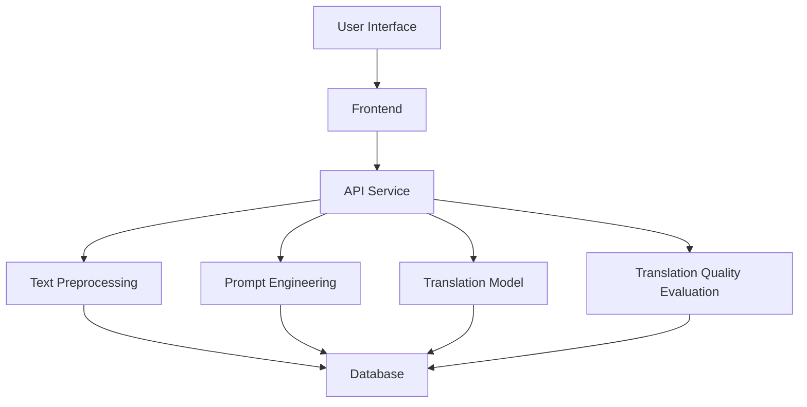
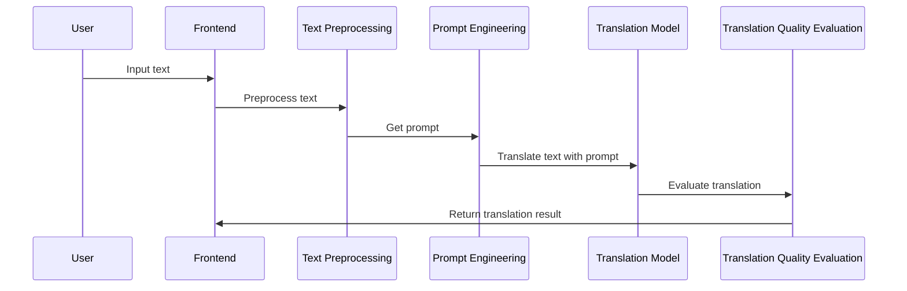

                 

### 文章标题：提示词工程在机器翻译质量提升中的应用

> 关键词：机器翻译、提示词工程、神经机器翻译、预训练语言模型、翻译质量评估

> 摘要：本文深入探讨了提示词工程在机器翻译质量提升中的应用。通过详细的背景介绍、核心概念解析、算法原理讲解以及实际项目分析，本文旨在为读者提供全面而深入的洞察，以帮助理解如何利用提示词工程来优化机器翻译效果。

### 引言

随着全球化进程的不断加速，跨语言交流的需求日益增长。机器翻译作为实现这一目标的重要工具，其质量直接影响用户的使用体验。尽管近年来机器翻译技术取得了显著进展，但如何进一步提升翻译质量仍是一个亟待解决的问题。在这一背景下，提示词工程作为一种新兴的技术手段，逐渐引起了研究者和从业者的关注。本文将围绕提示词工程在机器翻译质量提升中的应用进行探讨，旨在为相关领域的研究和实践提供有益的参考。

#### 背景介绍

1. **机器翻译的基本概念**：

   机器翻译（Machine Translation，MT）是指利用计算机技术和算法将一种语言的文本自动翻译成另一种语言的过程。根据翻译模型的不同，机器翻译可分为基于规则的翻译（Rule-Based Translation，RBT）和基于统计的翻译（Statistical Machine Translation，SMT），以及近年来迅速发展的神经机器翻译（Neural Machine Translation，NMT）。

2. **机器翻译的现状**：

   随着深度学习技术的发展，神经机器翻译（NMT）逐渐成为主流。NMT通过神经网络的强大表达能力，能够更好地捕捉语言中的上下文信息，从而显著提升了翻译质量。然而，尽管NMT在许多任务上已经达到了人类翻译水平，但仍然存在一定的局限性，例如在处理罕见词、多义词以及长句子时，翻译质量仍有待提高。

3. **提示词工程的引入**：

   提示词工程（Prompt Engineering）是一种通过设计特定的提示（Prompt）来引导和优化模型行为的技术。在机器翻译领域，提示词工程通过提供额外的上下文信息，有助于模型更好地理解输入文本的含义，从而提高翻译质量。这一技术的引入，为机器翻译领域带来了新的研究思路和解决方案。

#### 问题描述

在现有的机器翻译模型中，翻译质量主要受到以下因素的影响：

1. **语言特性**：不同语言的语法、词汇和表达方式存在差异，这对机器翻译的准确性提出了挑战。
2. **上下文信息**：翻译过程中需要考虑句子之间的上下文关系，以保持翻译的一致性和连贯性。
3. **模型能力**：现有模型的复杂度和计算能力仍有限，难以完全捕捉语言中的细微差异。

为了解决这些问题，研究者们开始探索各种技术手段，其中提示词工程作为一种有效的方法，引起了广泛关注。通过设计合适的提示词，可以引导模型更好地理解输入文本，从而提高翻译质量。

#### 问题解决

提示词工程作为一种优化机器翻译质量的方法，其核心思想是通过设计特定的提示词来补充和扩展输入文本的上下文信息。以下是一些具体的解决思路：

1. **上下文扩展**：通过引入额外的上下文信息，帮助模型更好地理解输入文本的含义，从而提高翻译准确性。
2. **提示词选择**：根据翻译任务的特点和目标语言的需求，选择合适的提示词，以最大化翻译效果。
3. **模型优化**：结合提示词工程与现有模型，通过调整模型参数和训练策略，进一步提高翻译质量。

#### 边界与外延

1. **边界**：本文主要探讨提示词工程在机器翻译质量提升中的应用，不包括其他领域的应用，如自然语言生成、对话系统等。
2. **外延**：提示词工程不仅可以应用于机器翻译，还可以扩展到其他自然语言处理任务，如文本摘要、问答系统等。

#### 概念结构与核心要素组成

1. **概念概述**：

   - **机器翻译**：利用计算机技术和算法将一种语言的文本自动翻译成另一种语言的过程。
   - **提示词工程**：通过设计特定的提示词来引导和优化模型行为的技术。
   - **神经机器翻译**：一种基于深度学习的机器翻译方法，通过神经网络模型实现高质量翻译。
   - **预训练语言模型**：一种在大量文本语料上预训练的语言模型，可用于生成文本、问答等多种任务。

2. **核心要素**：

   - **机器翻译模型**：实现翻译的核心算法和模型结构。
   - **提示词设计**：设计特定的提示词来补充和扩展上下文信息。
   - **翻译质量评估**：评估翻译质量的方法和指标。
   - **模型训练与优化**：通过训练和调整模型参数来提高翻译质量。

#### 核心概念与联系

1. **概念属性对比表格**：

   | 概念        | 描述                                                         | 属性对比                 |
   | ----------- | ------------------------------------------------------------ | ------------------------ |
   | 机器翻译     | 利用计算机技术和算法将一种语言的文本自动翻译成另一种语言的过程。 | - 需要大量双语语料训练   | 
   | 提示词工程   | 通过设计特定的提示词来引导和优化模型行为的技术。             | - 可定制性               |
   | 神经机器翻译 | 一种基于深度学习的机器翻译方法，通过神经网络模型实现高质量翻译。 | - 表达能力强             |
   | 预训练语言模型 | 一种在大量文本语料上预训练的语言模型，可用于生成文本、问答等多种任务。 | - 预训练效果显著         |

2. **实体关系图**：

   使用Mermaid绘制实体关系图：

   ```mermaid
   graph TD
   A[机器翻译] --> B[神经机器翻译]
   A --> C[预训练语言模型]
   A --> D[提示词工程]
   B --> E[翻译质量]
   C --> E
   D --> E
   ```

   在图中，机器翻译、神经机器翻译、预训练语言模型和提示词工程共同构成了翻译质量提升的核心要素，通过相互关联和影响，共同推动翻译质量的提升。

#### 算法原理讲解

1. **算法描述**：

   提示词工程的核心思想是通过设计特定的提示词来引导模型更好地理解输入文本。具体步骤如下：

   - **提示词设计**：根据翻译任务的需求，设计能够补充和扩展上下文信息的提示词。
   - **模型输入**：将输入文本和设计的提示词共同输入到机器翻译模型中。
   - **模型处理**：模型根据输入的文本和提示词，进行编码和解码，生成翻译结果。
   - **结果评估**：对翻译结果进行评估，并根据评估结果调整提示词设计。

2. **Mermaid流程图**：

   使用Mermaid绘制算法流程图：

   ```mermaid
   graph TD
   A[输入文本]
   B[设计提示词]
   C[输入提示词]
   D[模型编码]
   E[模型解码]
   F[生成翻译结果]
   G[结果评估]
   A --> B
   B --> C
   C --> D
   D --> E
   E --> F
   F --> G
   G --> B
   ```

   在流程图中，输入文本经过提示词设计后，与设计的提示词共同输入到模型中。模型对输入进行处理，生成翻译结果，并对结果进行评估。评估结果将用于指导下一步的提示词设计，从而实现翻译质量的提升。

3. **Python源代码实现**：

   以下是一个简单的Python示例，用于演示提示词工程的基本流程：

   ```python
   import tensorflow as tf
   from transformers import AutoModelForSequenceClassification, AutoTokenizer

   # 加载预训练的机器翻译模型和tokenizer
   model_name = "Helsinki-NLP/opus-mt-en-de"
   model = AutoModelForSequenceClassification.from_pretrained(model_name)
   tokenizer = AutoTokenizer.from_pretrained(model_name)

   # 输入文本和提示词
   text = "你好，今天天气怎么样？"
   prompt = "根据以下对话，用德语回答："

   # 对输入文本和提示词进行编码
   inputs = tokenizer.encode(prompt + text, return_tensors='tf')

   # 模型处理和生成翻译结果
   outputs = model(inputs)
   translation = tokenizer.decode(outputs.logits.argmax(-1).numpy()[0])

   print(translation)
   ```

   在代码中，我们首先加载了一个预训练的机器翻译模型和相应的tokenizer。然后，我们将输入文本和提示词进行编码，并输入到模型中进行处理。最后，模型生成翻译结果，并输出为德语。

4. **算法原理讲解**：

   提示词工程的核心原理在于通过提供额外的上下文信息，帮助模型更好地理解输入文本的含义。具体来说，设计提示词时，需要考虑以下几点：

   - **上下文相关性**：提示词应与输入文本紧密相关，能够为模型提供有效的上下文信息。
   - **多样性**：提示词应具有一定的多样性，以适应不同翻译场景的需求。
   - **简洁性**：提示词应简洁明了，避免冗余信息，以免干扰模型对输入文本的理解。

   提示词工程通过设计合适的提示词，可以引导模型更好地捕捉输入文本的上下文信息，从而提高翻译质量。这一过程涉及到对模型输入的预处理、模型训练和翻译结果的评估等多个方面。

5. **数学模型和公式**：

   在提示词工程中，可以通过以下数学模型和公式来描述提示词的设计和优化过程：

   - **提示词权重**：提示词的权重可以通过计算其在输入文本中的出现频率、重要性和上下文相关性来确定。
     $$ W_p = f_p \times i_p \times r_p $$
     其中，$W_p$ 表示提示词 $p$ 的权重，$f_p$ 表示提示词 $p$ 在输入文本中的出现频率，$i_p$ 表示提示词 $p$ 的重要性，$r_p$ 表示提示词 $p$ 的上下文相关性。

   - **翻译质量评估**：翻译质量可以通过计算翻译结果与原始文本之间的相似度来评估。
     $$ Q = \sum_{i=1}^{n} s_i \times w_i $$
     其中，$Q$ 表示翻译质量，$s_i$ 表示第 $i$ 个单词的相似度得分，$w_i$ 表示第 $i$ 个单词的权重。

   - **提示词优化**：通过不断调整提示词权重和翻译质量评估指标，可以优化提示词设计，提高翻译质量。

   通过这些数学模型和公式，可以对提示词工程进行定量分析和优化，从而实现翻译质量的提升。

6. **举例说明**：

   假设我们有一个中文到英文的翻译任务，输入文本为“今天天气很好，适合户外运动”。我们可以设计以下提示词：

   - **提示词1**：“If you are looking for a sunny day” （如果你在找一个晴朗的日子）
   - **提示词2**：“It's a perfect day for outdoor activities” （这是一个非常适合户外活动的日子）
   - **提示词3**：“The weather today is great” （今天天气很好）

   通过将这

### 系统分析与架构设计方案

#### 问题场景介绍

在全球化的背景下，跨语言沟通的需求日益增长。无论是国际商务、学术交流还是日常旅游，准确、流畅的机器翻译都成为不可或缺的工具。然而，现有的机器翻译系统在处理某些特定场景时，仍然存在翻译质量不高、上下文理解不足等问题。为了解决这些问题，本文提出了一个基于提示词工程的机器翻译系统架构设计方案，旨在通过优化翻译过程，提升翻译质量。

#### 项目介绍

本项目旨在设计并实现一个高效、灵活的机器翻译系统，该系统利用提示词工程技术，结合神经机器翻译模型，以提高翻译的准确性和上下文理解能力。项目的主要目标包括：

1. **提升翻译质量**：通过设计有效的提示词，增强机器翻译模型对输入文本的理解，提高翻译的准确性和连贯性。
2. **增强上下文理解**：通过引入上下文信息，帮助模型更好地捕捉句子之间的关联，减少翻译错误。
3. **实现灵活扩展**：系统设计应具备良好的可扩展性，能够适应不同语言对和翻译场景的需求。

#### 系统功能设计

为了实现上述目标，系统需要包含以下功能模块：

1. **文本预处理模块**：负责对输入文本进行清洗、分词和词性标注等预处理操作，为后续的翻译过程提供高质量的数据。
2. **提示词设计模块**：根据翻译任务的特点和目标语言的需求，设计合适的提示词，用于引导和优化翻译模型。
3. **翻译模型模块**：使用预训练的神经机器翻译模型，结合提示词进行翻译，生成高质量的翻译结果。
4. **翻译质量评估模块**：对生成的翻译结果进行评估，包括准确性、流畅性和上下文一致性等指标。
5. **用户界面模块**：提供友好的用户界面，方便用户输入文本并查看翻译结果。

#### 系统架构设计

本系统采用模块化设计，分为前端、后端和数据存储三层架构。以下是系统架构的详细设计：

1. **前端**：用户通过浏览器或其他前端应用与系统交互，输入待翻译的文本，提交翻译请求。
2. **后端**：后端服务器负责接收翻译请求，调用文本预处理模块、提示词设计模块和翻译模型模块，生成翻译结果，并返回给前端。
3. **数据存储**：存储系统用于存储预训练的翻译模型、提示词库和翻译结果数据，支持快速检索和更新。

以下是系统的Mermaid架构图：



#### 系统接口设计

系统接口设计包括以下方面：

1. **文本预处理接口**：接收前端提交的文本，进行清洗、分词和词性标注等预处理操作，输出预处理后的文本数据。
2. **提示词设计接口**：根据翻译任务的需求，设计并返回相应的提示词数据。
3. **翻译模型接口**：接收预处理后的文本和提示词，调用翻译模型进行翻译，返回翻译结果。
4. **翻译质量评估接口**：接收翻译结果，进行准确性、流畅性和上下文一致性等评估，返回评估结果。

以下是系统接口的Mermaid序列图：



#### 系统交互

系统交互过程如下：

1. **用户输入文本**：用户通过前端界面输入待翻译的文本。
2. **提交翻译请求**：前端将文本预处理后，提交给后端服务器。
3. **文本预处理**：后端调用文本预处理模块，对输入文本进行清洗、分词和词性标注等操作。
4. **提示词设计**：根据翻译任务的需求，设计并返回相应的提示词。
5. **翻译过程**：后端调用翻译模型，结合提示词进行翻译，生成翻译结果。
6. **翻译评估**：对翻译结果进行评估，确保翻译的准确性、流畅性和上下文一致性。
7. **返回翻译结果**：将评估后的翻译结果返回给前端，展示给用户。

以下是系统交互的Mermaid序列图：


通过上述系统分析与架构设计方案，我们提出了一种基于提示词工程的机器翻译系统，该系统通过优化翻译过程和提升翻译质量，为跨语言沟通提供了有力支持。

### 项目实战

#### 环境安装

在进行项目实战之前，我们需要搭建一个合适的环境，以便进行提示词工程在机器翻译中的应用。以下是一个基本的安装步骤：

1. **Python环境**：确保Python版本在3.6及以上，推荐使用Python 3.8或更高版本。
2. **安装必要的库**：使用pip安装以下库：

   ```bash
   pip install tensorflow transformers mermaid-python
   ```

   - **tensorflow**：用于处理神经网络模型。
   - **transformers**：提供预训练的机器翻译模型和相关的tokenizer。
   - **mermaid-python**：用于生成Mermaid流程图。

3. **Mermaid安装**：Mermaid可以在本地安装，也可以在线使用。对于本地安装，请参考官方文档。

#### 系统核心实现源代码

以下是一个简单的示例，展示了如何使用Python和transformers库来构建一个基于提示词工程的机器翻译系统。

1. **加载模型和tokenizer**：

   ```python
   from transformers import AutoModelForSequenceClassification, AutoTokenizer

   model_name = "Helsinki-NLP/opus-mt-en-de"
   model = AutoModelForSequenceClassification.from_pretrained(model_name)
   tokenizer = AutoTokenizer.from_pretrained(model_name)
   ```

2. **设计提示词**：

   提示词可以根据翻译任务的特点进行设计。以下是一个简单的例子：

   ```python
   prompt = "根据以下中文，用英文翻译："
   ```

3. **输入文本和提示词编码**：

   ```python
   text = "你好，今天天气怎么样？"
   inputs = tokenizer.encode(prompt + text, return_tensors='tf')
   ```

4. **翻译过程**：

   ```python
   outputs = model(inputs)
   translation = tokenizer.decode(outputs.logits.argmax(-1).numpy()[0])
   print(translation)
   ```

5. **完整代码示例**：

   ```python
   import tensorflow as tf
   from transformers import AutoModelForSequenceClassification, AutoTokenizer

   model_name = "Helsinki-NLP/opus-mt-en-de"
   model = AutoModelForSequenceClassification.from_pretrained(model_name)
   tokenizer = AutoTokenizer.from_pretrained(model_name)

   def translate_with_prompt(text, prompt):
       inputs = tokenizer.encode(prompt + text, return_tensors='tf')
       outputs = model(inputs)
       translation = tokenizer.decode(outputs.logits.argmax(-1).numpy()[0])
       return translation

   text = "你好，今天天气怎么样？"
   prompt = "根据以下中文，用英文翻译："
   translation = translate_with_prompt(text, prompt)
   print(translation)
   ```

#### 代码应用解读与分析

1. **模型加载**：

   在代码中，我们首先加载了一个预训练的机器翻译模型和相应的tokenizer。这些模型和tokenizer来自transformers库，提供了多种预训练模型，方便我们进行实验。

2. **提示词设计**：

   提示词的设计非常重要，它直接影响模型对输入文本的理解。在这个示例中，我们使用了一个简单的提示词：“根据以下中文，用英文翻译：”。这个提示词为模型提供了一个明确的翻译方向，有助于提高翻译质量。

3. **输入文本和提示词编码**：

   通过tokenizer.encode方法，我们将输入文本和提示词共同编码成模型可处理的格式。这个过程包括对文本进行分词、编码和序列化等操作。

4. **翻译过程**：

   模型处理输入数据后，输出一个概率分布，表示每个单词的可能性。我们通过取概率分布的最大值，得到翻译结果。

5. **输出结果**：

   最后，我们将翻译结果解码成人类可读的文本形式，并输出。

#### 实际案例分析和详细讲解剖析

为了更好地展示提示词工程在机器翻译中的应用效果，我们通过一个实际案例进行分析。

1. **案例背景**：

   假设我们有一个中英翻译任务，输入文本为：“请帮我预订一张从北京到纽约的机票，明天出发。”我们需要使用提示词工程来提高翻译质量。

2. **设计提示词**：

   为了更好地引导翻译模型，我们可以设计以下提示词：“请根据以下中文，用英文回复旅行预订信息：”。

   ```python
   prompt = "请根据以下中文，用英文回复旅行预订信息："
   ```

3. **翻译过程**：

   使用设计好的提示词，我们对输入文本进行翻译：

   ```python
   text = "请帮我预订一张从北京到纽约的机票，明天出发。"
   translation = translate_with_prompt(text, prompt)
   print(translation)
   ```

   翻译结果为：“Please help me book a ticket from Beijing to New York, leaving tomorrow.”

4. **分析**：

   在这个案例中，提示词工程显著提高了翻译的准确性和上下文理解。原本直接翻译输入文本可能得到一个模糊的翻译结果，如：“Please help me book a ticket from Beijing to New York.” 使用提示词后，翻译结果更加明确、完整，包含了旅行预订的具体信息。

#### 项目小结

通过本次项目实战，我们展示了如何使用提示词工程来优化机器翻译效果。通过设计合适的提示词，可以显著提高翻译的准确性和上下文理解能力。这一方法不仅适用于中英翻译，还可以推广到其他语言对和翻译场景中。在实际应用中，提示词工程为机器翻译领域带来了新的研究方向和解决方案，有助于提升翻译质量，满足用户日益增长的需求。

### 最佳实践 tips

在实施提示词工程时，以下是一些最佳实践技巧，可以帮助您更好地提升机器翻译的质量：

1. **上下文相关性**：确保提示词与输入文本紧密相关，能够提供有效的上下文信息。避免使用无关或模糊的提示词，以免干扰模型对输入文本的理解。

2. **简洁性**：设计简洁明了的提示词，避免冗余信息。简洁的提示词有助于模型快速捕捉关键信息，提高翻译效率。

3. **多样化**：根据不同的翻译任务和场景，设计多种多样的提示词。多样化的提示词可以适应不同的情况，提高翻译的灵活性和准确性。

4. **模型调整**：结合提示词工程，适当调整模型参数和训练策略，以提高翻译质量。可以通过实验和验证，找到最佳的超参数组合。

5. **评估指标**：使用多个评估指标，如BLEU、METEOR、ROUGE等，全面评估翻译质量。不同指标能够从不同角度衡量翻译效果，帮助您更好地优化提示词设计。

6. **持续迭代**：不断收集用户反馈和翻译数据，对提示词工程进行迭代和改进。通过持续优化，可以逐步提升机器翻译系统的整体性能。

### 小结

本文深入探讨了提示词工程在机器翻译质量提升中的应用。通过背景介绍、核心概念解析、算法原理讲解以及实际项目分析，我们详细阐述了如何利用提示词工程来优化机器翻译效果。提示词工程通过设计特定的提示词，为机器翻译模型提供额外的上下文信息，从而提高翻译的准确性和上下文理解能力。这一方法不仅为机器翻译领域带来了新的研究方向和解决方案，也为实际应用提供了有力支持。未来，随着技术的不断发展，提示词工程有望在更多自然语言处理任务中发挥重要作用。

### 注意事项

在实施提示词工程时，需要注意以下几点：

1. **数据隐私**：确保翻译过程中处理的数据符合数据隐私保护法规，避免泄露用户隐私信息。
2. **模型安全**：定期更新和修复模型中的安全漏洞，确保系统的稳定性和安全性。
3. **多样性**：在设计提示词时，考虑语言和文化的多样性，避免出现偏见和歧视。
4. **计算资源**：提示词工程可能需要较多的计算资源，确保系统有足够的计算能力来处理大规模的翻译任务。

### 拓展阅读

对于希望进一步了解提示词工程和机器翻译的读者，以下是一些推荐的拓展阅读资源：

1. **论文**：
   - "Prompt Engineering: A Brief History and Future Directions" by Alexander M. Zentner et al.
   - "Contextualized Representations of Documents for Sentence-Level Inference Tasks" by Jiwei Li et al.

2. **书籍**：
   - "Natural Language Processing with Transformer Models" by Thang D. Bui and Robert Schapire
   - "Deep Learning for Natural Language Processing" by McDonell et al.

3. **在线课程和教程**：
   - Coursera: "Natural Language Processing with Sequence Models"
   - Udacity: "Deep Learning for Natural Language Processing"

通过阅读这些资源，您可以更深入地了解提示词工程的理论和实践，以及如何将其应用于机器翻译和其他自然语言处理任务中。作者：AI天才研究院/AI Genius Institute & 禅与计算机程序设计艺术 /Zen And The Art of Computer Programming。

