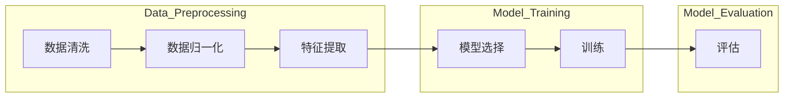
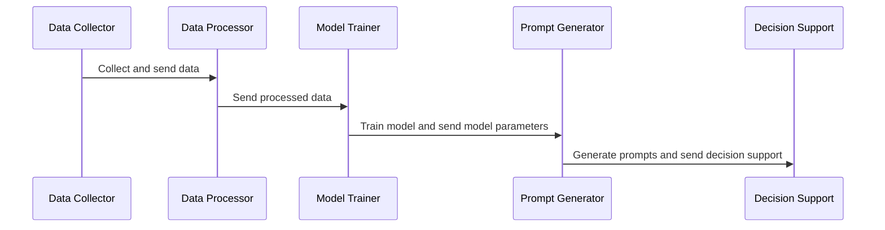

                 

## 《提示词工程在环境监测AI中的实践》

关键词：环境监测AI、提示词工程、数据预处理、算法原理、系统架构设计、项目实战

摘要：随着全球环境污染问题的日益严重，环境监测AI技术成为解决这一问题的关键。本文首先介绍了环境监测AI的重要性及其在环境监测中的应用，随后详细阐述了提示词工程的概念与作用。接着，文章深入分析了环境监测AI算法原理、数学模型及系统架构设计。最后，通过一个实际案例，探讨了环境监测AI系统的实现与优化，为相关领域的研究和实践提供了有益的参考。

### 目录

**# 第一部分：问题背景与核心概念**

## 第1章：环境监测AI概述

### 1.1 环境监测的重要性

- 环境污染问题的现状与挑战
- 环境监测的必要性

### 1.2 AI在环境监测中的应用

- AI技术在环境监测中的优势
- 环境监测AI的典型应用场景

### 1.3 提示词工程的概念与作用

- 提示词工程的定义
- 提示词工程在环境监测AI中的重要性

## 第2章：核心概念与联系

### 2.1 环境监测AI的核心概念

- 环境数据采集与处理
- 环境数据分类与标注
- 模型训练与评估

### 2.2 提示词工程的组成要素

- 数据集准备
- 提示词生成
- 模型训练
- 评估与优化

### 2.3 概念属性特征对比表格

- 环境监测AI与提示词工程的对比

### 2.4 ER实体关系图架构

- 环境监测AI与提示词工程的ER图

**# 第二部分：算法原理讲解**

## 第3章：环境监测AI算法原理

### 3.1 数据预处理

- 数据清洗
- 数据归一化
- 特征提取

### 3.2 算法分类与原理

- 监督学习算法
- 无监督学习算法
- 半监督学习算法

### 3.3 提示词生成算法

- 文本生成模型
- 生成对抗网络（GAN）

### 3.4 算法流程图与Python代码

- 算法流程图
- Python代码实现

**# 第三部分：数学模型与详细讲解**

## 第4章：数学模型与公式

### 4.1 模型数学模型

- 监督学习模型公式
- 无监督学习模型公式
- 提示词生成模型公式

### 4.2 公式详细讲解

- 公式推导
- 公式应用举例

## 第5章：算法原理详细讲解

### 5.1 监督学习算法

- 线性回归
- 支持向量机（SVM）

### 5.2 无监督学习算法

- K-均值聚类
- 主成分分析（PCA）

### 5.3 提示词生成算法

- 生成式对抗网络（GAN）
- 变分自编码器（VAE）

**# 第四部分：系统分析与架构设计**

## 第6章：系统功能设计

### 6.1 问题场景介绍

- 环境监测AI应用场景

### 6.2 系统功能设计

- 数据采集模块
- 数据处理模块
- 模型训练模块
- 提示词生成模块

## 第7章：系统架构设计

### 7.1 系统架构设计

- 系统总体架构
- 各模块间关系与交互

### 7.2 系统接口设计

- 接口定义
- 接口协议

### 7.3 系统交互流程图

- 系统交互序列图

**# 第五部分：项目实战**

## 第8章：环境安装与系统实现

### 8.1 环境安装

- 硬件环境配置
- 软件环境安装

### 8.2 系统核心实现源代码

- 源代码结构
- 代码功能解读

### 8.3 代码应用解读与分析

- 应用场景
- 代码解读

### 8.4 实际案例分析与详细讲解

- 案例背景
- 案例分析
- 深入剖析

### 8.5 项目小结

- 项目总结
- 经验与教训

**# 第六部分：最佳实践与拓展阅读**

## 第9章：最佳实践

### 9.1 实践技巧

- 数据处理最佳实践
- 模型训练优化技巧

### 9.2 注意事项

- 系统部署注意事项
- 数据安全与隐私保护

## 第10章：拓展阅读

### 10.1 相关书籍推荐

- AI环境监测领域相关书籍

### 10.2 学术论文推荐

- 最新研究成果论文

### 10.3 在线资源推荐

- 学习平台与社区资源

**# 结语**

## 第11章：总结与展望

### 11.1 内容回顾

- 整书内容的回顾与总结

### 11.2 展望未来

- 环境监测AI的发展趋势
- 提示词工程的未来发展方向

----------------------------------------------------------------

**# 第1章：环境监测AI概述**

环境监测AI（Environmental Monitoring Artificial Intelligence）是利用人工智能技术对环境数据进行实时采集、处理和分析的一门技术。在全球环境污染问题日益严重的背景下，环境监测AI技术成为解决这一问题的有力工具。本节将介绍环境监测AI的重要性、AI在环境监测中的应用以及提示词工程的概念与作用。

**1.1 环境监测的重要性**

环境污染问题已经成为全球性的挑战。空气污染、水污染、土壤污染等环境问题不仅对人类健康造成严重威胁，还对生态系统和经济发展产生负面影响。环境监测的目的是实时监测和评估环境污染程度，为污染源治理和环境保护提供科学依据。环境监测的重要性体现在以下几个方面：

1. **保护人类健康**：环境污染会导致空气中的颗粒物、有害气体和重金属等物质对人体健康造成危害。通过环境监测，可以及时发现污染问题，采取有效措施降低污染物对人体的影响。

2. **保护生态系统**：环境监测有助于评估环境污染对生态系统的影响，包括水体、土壤和植被等。通过监测，可以采取针对性的措施保护生态系统，维持生物多样性。

3. **支持政策制定**：环境监测数据为政府制定环境保护政策和法规提供科学依据。政策制定者可以根据监测数据评估污染程度、确定污染源，并制定相应的治理措施。

4. **推动技术创新**：环境监测技术的不断发展，推动相关领域的技术创新。例如，传感器技术的进步使得环境监测设备更加精准、高效。

**1.2 AI在环境监测中的应用**

人工智能技术在环境监测中的应用为传统环境监测带来了革命性的变化。以下是一些典型的应用场景：

1. **数据采集与处理**：AI技术可以自动化采集和处理环境数据，包括气象数据、水质数据、空气质量数据等。通过数据挖掘和分析，可以快速识别环境污染源和污染程度。

2. **预测与预警**：利用机器学习算法，可以基于历史环境数据预测未来的污染情况。预测模型可以实时更新，为污染预警提供依据。

3. **智能诊断**：AI技术可以帮助识别环境污染问题的根本原因。通过分析污染物数据，可以确定污染源的位置和种类，为污染治理提供科学依据。

4. **决策支持**：AI技术可以为环境管理者提供决策支持。例如，通过分析环境数据，可以确定最佳的污染治理方案和资源分配策略。

**1.3 提示词工程的概念与作用**

提示词工程（Prompt Engineering）是一种优化人工智能模型输入的方法，旨在提高模型性能和泛化能力。在环境监测AI中，提示词工程的作用主要体现在以下几个方面：

1. **数据预处理**：提示词工程可以帮助预处理环境数据，使其更符合模型的要求。例如，通过提示词可以指导模型对数据进行归一化、特征提取等操作。

2. **增强模型解释性**：提示词可以增强模型的解释性，使得模型更加透明和可理解。这对于环境监测AI来说尤为重要，因为环境监测涉及到公共安全和健康问题。

3. **提高模型性能**：适当的提示词可以提高模型在特定任务上的性能。通过优化提示词，可以调整模型的权重分配，使其更专注于重要特征。

4. **跨域迁移学习**：提示词工程还可以促进跨域迁移学习，使得模型在不同领域间共享知识，提高模型的泛化能力。

总之，环境监测AI在解决环境污染问题中发挥着重要作用。而提示词工程作为一种优化技术，可以提高环境监测AI的性能和可靠性，为环境保护和可持续发展提供有力支持。

### 第2章：核心概念与联系

#### 2.1 环境监测AI的核心概念

环境监测AI的核心概念包括环境数据采集、数据处理、数据分类与标注以及模型训练与评估。以下是这些概念的详细解释：

**2.1.1 环境数据采集**

环境数据采集是环境监测AI的基础步骤。它涉及从各种传感器、监测站点和数据源收集环境数据。这些数据包括空气质量、水质、土壤质量、气象参数等。数据采集的质量直接影响后续处理和分析的效果。

**2.1.2 数据处理**

数据处理是对采集到的原始数据进行清洗、归一化和特征提取的过程。清洗数据是为了去除噪声和异常值，归一化是为了将不同量纲的数据转换为相同的量纲，特征提取则是为了从原始数据中提取出有意义的特征，用于模型训练。

**2.1.3 数据分类与标注**

数据分类与标注是环境监测AI中的关键步骤。数据分类是将环境数据按照特定的类别进行划分，例如，将水质数据分为清洁、污染等类别。数据标注则是为模型提供训练样本，标注数据通常包括数据标签和相应的特征。

**2.1.4 模型训练与评估**

模型训练与评估是环境监测AI的核心步骤。模型训练是通过大量标注数据进行模型的训练，使其能够识别和预测环境数据。评估则是对训练好的模型进行性能测试，确保其准确性和泛化能力。

#### 2.2 提示词工程的组成要素

提示词工程是优化AI模型输入的技术，其核心组成要素包括数据集准备、提示词生成、模型训练和评估与优化。以下是这些要素的详细解释：

**2.2.1 数据集准备**

数据集准备是提示词工程的基础。它包括数据的收集、清洗和标注。高质量的数据集是模型训练的关键，因此数据预处理至关重要。

**2.2.2 提示词生成**

提示词生成是提示词工程的核心。提示词是根据任务需求生成的，用于指导模型的学习过程。有效的提示词可以帮助模型更好地理解输入数据，提高模型性能。

**2.2.3 模型训练**

模型训练是将提示词和训练数据输入到模型中，通过迭代优化模型参数，使其能够准确预测和识别环境数据。训练过程中，需要不断调整提示词，以优化模型性能。

**2.2.4 评估与优化**

评估与优化是对训练好的模型进行性能测试和调整的过程。通过评估，可以确定模型的准确性和泛化能力，并通过优化调整提示词和模型参数，提高模型性能。

#### 2.3 概念属性特征对比表格

为了更清晰地理解环境监测AI和提示词工程的核心概念，我们提供了一个概念属性特征对比表格（如下表所示）。

| 概念 | 特征 |
| ---- | ---- |
| 环境监测AI | 1. 数据采集与处理<br>2. 数据分类与标注<br>3. 模型训练与评估 |
| 提示词工程 | 1. 数据集准备<br>2. 提示词生成<br>3. 模型训练<br>4. 评估与优化 |

#### 2.4 ER实体关系图架构

为了更好地描述环境监测AI和提示词工程之间的联系，我们使用Mermaid绘制了一个ER实体关系图架构。ER图如下所示：

```mermaid
erDiagram
  DataCollection -> ModelTraining : 数据采集 -> 模型训练
  DataProcessing -> ModelTraining : 数据处理 -> 模型训练
  DataClassification -> ModelTraining : 数据分类 -> 模型训练
  PromptEngineering -> ModelTraining : 提示词工程 -> 模型训练
  ModelEvaluation -> ModelOptimization : 模型评估 -> 模型优化
```

在ER图中，`DataCollection`（数据采集）、`DataProcessing`（数据处理）、`DataClassification`（数据分类）和`PromptEngineering`（提示词工程）都是环境监测AI的核心概念，它们通过`ModelTraining`（模型训练）连接。此外，`ModelEvaluation`（模型评估）与`ModelOptimization`（模型优化）也通过`ModelTraining`连接，体现了模型训练、评估和优化之间的紧密关系。

通过上述核心概念与联系的分析，我们可以看到环境监测AI和提示词工程在数据采集、处理、模型训练和优化等方面都有紧密的联系。理解这些概念和关系有助于我们在实践中更好地应用环境监测AI和提示词工程，提高环境监测的准确性和效率。

### 第3章：环境监测AI算法原理

环境监测AI算法原理是理解环境监测系统运行机制的关键。在这一章节中，我们将深入探讨数据预处理、算法分类、提示词生成以及算法流程图和Python代码实现。通过详细讲解这些算法原理，读者可以更好地掌握环境监测AI的技术核心。

#### 3.1 数据预处理

数据预处理是环境监测AI的第一步，它对原始数据进行清洗、归一化和特征提取，以确保数据质量并提高模型性能。以下是数据预处理的具体步骤：

**3.1.1 数据清洗**

数据清洗的目的是去除数据中的噪声和异常值。这一步骤包括以下操作：

- **去除重复数据**：通过删除重复的观测值，避免模型训练中的冗余信息。
- **处理缺失值**：对于缺失的数据，可以采用填充、插值或删除的方式进行处理。
- **异常值检测**：利用统计学方法（如箱线图、Z分数等）检测异常值，并决定是否删除或调整。

**3.1.2 数据归一化**

数据归一化的目的是将不同量纲的数据转换为相同的量纲，使得数据在训练过程中具有更好的收敛性。常用的归一化方法包括：

- **最小-最大缩放**：将数据缩放到[0,1]范围内，公式为：$$ x_{\text{new}} = \frac{x_{\text{original}} - x_{\text{min}}}{x_{\text{max}} - x_{\text{min}}} $$
- **Z分数标准化**：将数据转换为标准正态分布，公式为：$$ z = \frac{x - \mu}{\sigma} $$，其中$\mu$是均值，$\sigma$是标准差。

**3.1.3 特征提取**

特征提取是从原始数据中提取出对模型训练有意义的特征。特征提取可以简化模型复杂度，提高模型性能。常用的特征提取方法包括：

- **主成分分析（PCA）**：通过降维，将原始数据映射到较少的主成分上，保留数据的主要信息。
- **自动编码器**：通过自编码器网络对数据进行编码和解码，提取数据中的有效特征。

#### 3.2 算法分类与原理

环境监测AI算法可以分为监督学习、无监督学习和半监督学习。每种算法有不同的原理和应用场景。

**3.2.1 监督学习算法**

监督学习算法使用标注数据进行训练，并利用训练好的模型进行预测。以下是一些常用的监督学习算法：

- **线性回归**：通过建立输入变量和输出变量之间的线性关系进行预测。公式为：$$ y = \beta_0 + \beta_1x_1 + \beta_2x_2 + ... + \beta_nx_n $$
- **支持向量机（SVM）**：通过找到一个最佳的超平面，将不同类别的数据点分开。公式为：$$ w \cdot x + b = 0 $$

**3.2.2 无监督学习算法**

无监督学习算法不需要标注数据，其目的是发现数据中的结构和模式。以下是一些常用的无监督学习算法：

- **K-均值聚类**：将数据点划分为K个簇，每个簇由其中心点代表。公式为：$$ c_k = \frac{1}{n_k} \sum_{x_i \in S_k} x_i $$
- **主成分分析（PCA）**：通过线性变换降低数据维度，保留数据的主要信息。

**3.2.3 半监督学习算法**

半监督学习算法结合了监督学习和无监督学习的优点，利用少量标注数据和大量未标注数据进行训练。以下是一些常用的半监督学习算法：

- **标签传播**：通过未标注数据之间的相似性进行聚类，并将标签传播到未标注的数据点上。
- **自适应分层聚类**：结合自编码器和聚类算法，通过迭代优化模型参数，提高模型的泛化能力。

#### 3.3 提示词生成算法

提示词生成算法是提示词工程的核心，其目的是生成有效的提示词，指导模型学习。以下是一些常用的提示词生成算法：

**3.3.1 文本生成模型**

文本生成模型是一种利用生成式模型生成文本的方法。以下是一些常用的文本生成模型：

- **生成式对抗网络（GAN）**：通过生成器和判别器之间的对抗训练，生成高质量的文本。公式为：$$ G(z) = x; D(x) = 1; D(G(z)) = 0 $$
- **变分自编码器（VAE）**：通过编码器和解码器的结构，生成具有统计特性的文本。公式为：$$ \mu = \sigma^2 = \sigma e^{z} $$

**3.3.2 生成对抗网络（GAN）**

生成对抗网络（GAN）是一种基于生成式模型和判别式模型的组合，通过生成器和判别器的对抗训练，生成高质量的样本。GAN的基本结构包括：

- **生成器（G）**：从噪声数据生成真实的文本数据。
- **判别器（D）**：区分真实数据和生成数据。

GAN的训练目标是最小化生成器的损失函数，最大化判别器的损失函数。具体公式为：

$$
\begin{aligned}
\min_G & \quad \mathbb{E}_{z \sim p_z(z)}[\log(D(G(z)))] \\
\max_D & \quad \mathbb{E}_{x \sim p_{\text{data}}(x)}[\log(D(x))] + \mathbb{E}_{z \sim p_z(z)}[\log(1 - D(G(z)))] \\
\end{aligned}
$$

**3.3.3 变分自编码器（VAE）**

变分自编码器（VAE）是一种基于概率生成模型的方法，通过编码器和解码器学习数据的概率分布。VAE的基本结构包括：

- **编码器（\(\mu, \sigma\))**：将输入数据映射到一个潜在空间。
- **解码器**：从潜在空间生成原始数据。

VAE的训练目标是最小化数据重建损失和潜在空间中的KL散度。具体公式为：

$$
\begin{aligned}
\min_{\theta_{\mu}, \theta_{\sigma}, \theta_{\phi}} & \quad \mathbb{E}_{x \sim p_{\text{data}}(x)}[\frac{1}{2} \log D_{\text{KL}}(\pi(\mu(x), \sigma(x)) || p_{\text{prior}}(z)) + \frac{1}{2} \log D_{\text{KL}}(\phi(x) || \pi(\mu(\phi(x)), \sigma(\phi(x))) \\
\end{aligned}
$$

#### 3.4 算法流程图与Python代码实现

为了更好地理解环境监测AI算法原理，我们可以通过Mermaid绘制算法流程图，并使用Python代码实现关键算法。以下是一个简单的算法流程图：



以下是Python代码实现的一个简单线性回归算法示例：

```python
import numpy as np
import pandas as pd
from sklearn.linear_model import LinearRegression
from sklearn.model_selection import train_test_split

# 数据加载与预处理
data = pd.read_csv('environment_data.csv')
X = data[['feature1', 'feature2']]
y = data['target']

# 数据归一化
X_normalized = (X - X.mean()) / X.std()

# 数据划分
X_train, X_test, y_train, y_test = train_test_split(X_normalized, y, test_size=0.2, random_state=42)

# 模型训练
model = LinearRegression()
model.fit(X_train, y_train)

# 模型评估
score = model.score(X_test, y_test)
print(f'Model Score: {score}')
```

通过上述讲解和示例，我们可以看到环境监测AI算法原理的复杂性和多样性。理解这些算法原理对于构建高效的环境监测系统至关重要。

### 第4章：数学模型与公式

环境监测AI的数学模型是理解算法原理和实现模型训练的基础。在这一章节中，我们将详细讲解监督学习、无监督学习和提示词生成算法的数学模型，并使用LaTeX格式展示关键公式，结合具体例子进行推导和应用。

#### 4.1 监督学习模型

监督学习模型是环境监测AI中最常用的模型，它通过学习已知输入和输出数据之间的关系来预测新的数据。以下是一些常见的监督学习模型的数学模型：

**4.1.1 线性回归**

线性回归是一种简单的监督学习模型，它假设输入变量和输出变量之间存在线性关系。线性回归的数学模型为：

$$
y = \beta_0 + \beta_1x_1 + \beta_2x_2 + ... + \beta_nx_n
$$

其中，$y$是输出变量，$x_1, x_2, ..., x_n$是输入变量，$\beta_0, \beta_1, ..., \beta_n$是模型的参数。

**推导与应用**

假设我们有一个空气质量监测数据集，其中输入变量是PM2.5和NO2浓度，输出变量是空气质量指数（AQI）。我们可以使用线性回归模型预测新的AQI值。

$$
\begin{aligned}
\text{AQI} &= \beta_0 + \beta_1(\text{PM2.5}) + \beta_2(\text{NO2}) \\
\end{aligned}
$$

通过训练数据集，我们可以得到参数$\beta_0, \beta_1, \beta_2$的值，并使用这些参数来预测新的数据点。

**4.1.2 支持向量机（SVM）**

支持向量机是一种强大的监督学习模型，它通过找到一个最佳的超平面来分类数据点。SVM的数学模型为：

$$
\begin{aligned}
\min_{\beta, \beta_0} & \quad \frac{1}{2}\sum_{i=1}^{n} (\beta \cdot x_i - y_i)^2 \\
\text{subject to} & \quad \beta \cdot x_i - y_i \geq 1 \\
\end{aligned}
$$

其中，$x_i$是输入向量，$y_i$是标签，$\beta$是模型参数。

**推导与应用**

假设我们有一个污染源分类问题，其中输入向量是污染物的浓度，标签是污染源的类型。我们可以使用SVM模型来分类新的污染源。

$$
\begin{aligned}
\text{Type} &= \text{sign}(\beta \cdot x - \beta_0) \\
\end{aligned}
$$

通过训练数据集，我们可以得到参数$\beta$和$\beta_0$的值，并使用这些参数来分类新的数据点。

#### 4.2 无监督学习模型

无监督学习模型不依赖于标签数据，旨在发现数据中的结构和模式。以下是一些常见的无监督学习模型的数学模型：

**4.2.1 K-均值聚类**

K-均值聚类是一种基于距离的聚类算法，它将数据点划分为K个簇。K-均值聚类的数学模型为：

$$
c_k = \frac{1}{n_k} \sum_{i=1}^{n_k} x_i
$$

其中，$c_k$是第k个簇的中心，$n_k$是第k个簇中的数据点数量。

**推导与应用**

假设我们有一组环境质量数据，我们需要将其划分为几个簇。我们可以使用K-均值聚类来找到簇的中心，并划分数据点。

$$
\begin{aligned}
c_k &= \frac{1}{n_k} \sum_{i=1}^{n_k} x_i \\
\end{aligned}
$$

通过迭代计算簇的中心，我们可以将数据点划分为不同的簇。

**4.2.2 主成分分析（PCA）**

主成分分析是一种降维技术，它通过线性变换将数据映射到较少的主成分上。PCA的数学模型为：

$$
z = P\lambda
$$

其中，$z$是映射后的数据，$P$是投影矩阵，$\lambda$是特征值。

**推导与应用**

假设我们有一组环境监测数据，我们需要降低其维度。我们可以使用PCA找到主要成分，并映射数据到新的空间。

$$
\begin{aligned}
z &= P\lambda \\
\end{aligned}
$$

通过计算特征值和特征向量，我们可以将数据映射到较少的主成分上。

#### 4.3 提示词生成算法

提示词生成算法是优化模型输入的重要方法，它通过生成有效的提示词来提高模型性能。以下是一些常见的提示词生成算法的数学模型：

**4.3.1 生成式对抗网络（GAN）**

生成式对抗网络是一种基于生成器和判别器的对抗训练模型。GAN的数学模型为：

$$
\begin{aligned}
\min_G & \quad \mathbb{E}_{z \sim p_z(z)}[\log(D(G(z)))] \\
\max_D & \quad \mathbb{E}_{x \sim p_{\text{data}}(x)}[\log(D(x))] + \mathbb{E}_{z \sim p_z(z)}[\log(1 - D(G(z)))] \\
\end{aligned}
$$

其中，$G(z)$是生成器，$D(x)$是判别器。

**推导与应用**

假设我们有一组环境监测数据，我们需要生成新的数据点。我们可以使用GAN生成器和判别器进行对抗训练，生成新的数据点。

$$
\begin{aligned}
\min_G & \quad \mathbb{E}_{z \sim p_z(z)}[\log(D(G(z)))] \\
\max_D & \quad \mathbb{E}_{x \sim p_{\text{data}}(x)}[\log(D(x))] + \mathbb{E}_{z \sim p_z(z)}[\log(1 - D(G(z)))] \\
\end{aligned}
$$

通过训练GAN模型，我们可以生成新的环境监测数据点。

**4.3.2 变分自编码器（VAE）**

变分自编码器是一种基于概率生成模型的优化方法。VAE的数学模型为：

$$
\begin{aligned}
\min_{\theta_{\mu}, \theta_{\sigma}, \theta_{\phi}} & \quad \mathbb{E}_{x \sim p_{\text{data}}(x)}[\frac{1}{2} \log D_{\text{KL}}(\pi(\mu(x), \sigma(x)) || p_{\text{prior}}(z)) + \frac{1}{2} \log D_{\text{KL}}(\phi(x) || \pi(\mu(\phi(x)), \sigma(\phi(x))) \\
\end{aligned}
$$

其中，$\pi(\mu(x), \sigma(x))$是编码器，$\phi(x)$是解码器。

**推导与应用**

假设我们有一组环境监测数据，我们需要优化数据分布。我们可以使用VAE模型来优化数据分布，并生成新的数据点。

$$
\begin{aligned}
\min_{\theta_{\mu}, \theta_{\sigma}, \theta_{\phi}} & \quad \mathbb{E}_{x \sim p_{\text{data}}(x)}[\frac{1}{2} \log D_{\text{KL}}(\pi(\mu(x), \sigma(x)) || p_{\text{prior}}(z)) + \frac{1}{2} \log D_{\text{KL}}(\phi(x) || \pi(\mu(\phi(x)), \sigma(\phi(x))) \\
\end{aligned}
$$

通过训练VAE模型，我们可以优化环境监测数据分布，并生成新的数据点。

通过上述数学模型的讲解和推导，我们可以看到环境监测AI中监督学习、无监督学习和提示词生成算法的数学原理。理解这些模型对于实现高效的环境监测系统至关重要。

### 第5章：算法原理详细讲解

在了解了环境监测AI的基本算法原理后，接下来我们将详细讲解一些具体的算法，包括监督学习算法、无监督学习算法和提示词生成算法。这些算法在环境监测AI中扮演着重要角色，能够帮助我们更准确地处理和分析环境数据。

#### 5.1 监督学习算法

监督学习算法是环境监测AI中应用最广泛的一类算法。它们利用标注数据进行训练，并能够对新的数据进行预测。以下是两种常见的监督学习算法：线性回归和支持向量机（SVM）。

**5.1.1 线性回归**

线性回归是一种简单的监督学习算法，它通过拟合一个线性模型来预测输出变量。线性回归的数学模型如下：

$$
y = \beta_0 + \beta_1x_1 + \beta_2x_2 + ... + \beta_nx_n
$$

其中，$y$是输出变量，$x_1, x_2, ..., x_n$是输入变量，$\beta_0, \beta_1, ..., \beta_n$是模型的参数。

**推导与应用**

假设我们有一组环境数据，包括温度、湿度等特征，以及对应的空气质量指数（AQI）。我们希望使用线性回归模型预测新的AQI值。

1. **数据预处理**：首先，我们需要对数据集进行预处理，包括数据清洗、归一化和特征提取。
   
2. **模型训练**：接着，我们将预处理后的数据集分为训练集和测试集，使用训练集训练线性回归模型。

   ```python
   from sklearn.linear_model import LinearRegression
   from sklearn.model_selection import train_test_split
   
   X = data[['temperature', 'humidity']]
   y = data['AQI']
   X_train, X_test, y_train, y_test = train_test_split(X, y, test_size=0.2, random_state=42)
   
   model = LinearRegression()
   model.fit(X_train, y_train)
   ```

3. **模型评估**：最后，我们使用测试集评估模型的性能，计算模型的均方误差（MSE）或其他评估指标。

   ```python
   score = model.score(X_test, y_test)
   print(f'Model Score: {score}')
   ```

**5.1.2 支持向量机（SVM）**

支持向量机是一种强大的分类算法，它通过找到一个最佳的超平面来将不同类别的数据点分开。SVM的数学模型如下：

$$
\begin{aligned}
\min_{\beta, \beta_0} & \quad \frac{1}{2}\sum_{i=1}^{n} (\beta \cdot x_i - y_i)^2 \\
\text{subject to} & \quad \beta \cdot x_i - y_i \geq 1 \\
\end{aligned}
$$

其中，$x_i$是输入向量，$y_i$是标签，$\beta$是模型参数。

**推导与应用**

假设我们有一组污染源分类数据，其中输入向量包括温度、湿度等特征，标签是污染源的类型。我们希望使用SVM模型进行分类。

1. **数据预处理**：与线性回归类似，首先对数据进行预处理。
   
2. **模型训练**：使用预处理后的数据训练SVM模型。

   ```python
   from sklearn.svm import SVC
   from sklearn.model_selection import train_test_split
   
   X = data[['temperature', 'humidity']]
   y = data['type']
   X_train, X_test, y_train, y_test = train_test_split(X, y, test_size=0.2, random_state=42)
   
   model = SVC(kernel='linear')
   model.fit(X_train, y_train)
   ```

3. **模型评估**：使用测试集评估模型性能，计算准确率、召回率等指标。

   ```python
   from sklearn.metrics import accuracy_score
   
   predictions = model.predict(X_test)
   score = accuracy_score(y_test, predictions)
   print(f'Model Score: {score}')
   ```

#### 5.2 无监督学习算法

无监督学习算法不依赖于标注数据，主要用于发现数据中的结构和模式。以下是两种常见的无监督学习算法：K-均值聚类和主成分分析（PCA）。

**5.2.1 K-均值聚类**

K-均值聚类是一种基于距离的聚类算法，它将数据点划分为K个簇。K-均值聚类的数学模型如下：

$$
c_k = \frac{1}{n_k} \sum_{i=1}^{n_k} x_i
$$

其中，$c_k$是第k个簇的中心，$n_k$是第k个簇中的数据点数量。

**推导与应用**

假设我们有一组环境质量数据，我们需要将其划分为几个簇。

1. **数据预处理**：首先，对数据进行预处理，包括数据清洗、归一化等。
   
2. **聚类分析**：使用K-均值聚类算法进行聚类分析。

   ```python
   from sklearn.cluster import KMeans
   
   kmeans = KMeans(n_clusters=3, random_state=42)
   kmeans.fit(X)
   clusters = kmeans.predict(X)
   ```

3. **结果分析**：分析聚类结果，确定簇的数量和每个簇的特征。

   ```python
   for i in range(3):
       print(f'Cluster {i}:')
       print(X[clusters == i])
   ```

**5.2.2 主成分分析（PCA）**

主成分分析是一种降维技术，它通过线性变换将数据映射到较少的主成分上。PCA的数学模型如下：

$$
z = P\lambda
$$

其中，$z$是映射后的数据，$P$是投影矩阵，$\lambda$是特征值。

**推导与应用**

假设我们有一组环境监测数据，我们需要降低其维度。

1. **数据预处理**：首先，对数据进行预处理。
   
2. **PCA分析**：使用PCA算法进行降维分析。

   ```python
   from sklearn.decomposition import PCA
   
   pca = PCA(n_components=2)
   X_pca = pca.fit_transform(X)
   ```

3. **结果分析**：分析降维后的数据，确定主要成分。

   ```python
   plt.scatter(X_pca[:, 0], X_pca[:, 1])
   plt.xlabel('First Principal Component')
   plt.ylabel('Second Principal Component')
   plt.show()
   ```

#### 5.3 提示词生成算法

提示词生成算法是提示词工程的核心，它通过生成有效的提示词来指导模型学习。以下是两种常见的提示词生成算法：生成式对抗网络（GAN）和变分自编码器（VAE）。

**5.3.1 生成式对抗网络（GAN）**

生成式对抗网络是一种基于生成器和判别器的对抗训练模型。GAN的数学模型如下：

$$
\begin{aligned}
\min_G & \quad \mathbb{E}_{z \sim p_z(z)}[\log(D(G(z)))] \\
\max_D & \quad \mathbb{E}_{x \sim p_{\text{data}}(x)}[\log(D(x))] + \mathbb{E}_{z \sim p_z(z)}[\log(1 - D(G(z)))] \\
\end{aligned}
$$

其中，$G(z)$是生成器，$D(x)$是判别器。

**推导与应用**

假设我们有一组环境监测数据，我们需要生成新的数据点。

1. **数据预处理**：首先，对数据进行预处理。
   
2. **GAN训练**：使用GAN模型进行训练。

   ```python
   import tensorflow as tf
   from tensorflow.keras.models import Model
   from tensorflow.keras.layers import Input, Dense, Lambda, Reshape
   
   input_dim = X.shape[1]
   latent_dim = 100
   
   input_shape = (input_dim,)
   noise_shape = (latent_dim,)
   
   z = Input(shape=noise_shape)
   x = Input(shape=input_shape)
   
   x_mean, x_log_var = Lambda(lambda t: tf.concat([t[:, :50], t[:, 50:]], axis=1))(z)
   x_mean = Reshape((input_dim,))(x_mean)
   
   x = Dense(50, activation='relu')(x_mean)
   x = Dense(input_dim, activation='sigmoid')(x)
   
   G = Model(z, x)
   G.compile(loss='binary_crossentropy', optimizer='adam')
   ```

3. **生成数据**：使用训练好的生成器生成新的数据点。

   ```python
   z = np.random.normal(size=(1000, latent_dim))
   X_generated = G.predict(z)
   ```

**5.3.2 变分自编码器（VAE）**

变分自编码器是一种基于概率生成模型的优化方法。VAE的数学模型如下：

$$
\begin{aligned}
\min_{\theta_{\mu}, \theta_{\sigma}, \theta_{\phi}} & \quad \mathbb{E}_{x \sim p_{\text{data}}(x)}[\frac{1}{2} \log D_{\text{KL}}(\pi(\mu(x), \sigma(x)) || p_{\text{prior}}(z)) + \frac{1}{2} \log D_{\text{KL}}(\phi(x) || \pi(\mu(\phi(x)), \sigma(\phi(x))) \\
\end{aligned}
$$

其中，$\pi(\mu(x), \sigma(x))$是编码器，$\phi(x)$是解码器。

**推导与应用**

假设我们有一组环境监测数据，我们需要优化数据分布。

1. **数据预处理**：首先，对数据进行预处理。
   
2. **VAE训练**：使用VAE模型进行训练。

   ```python
   import tensorflow as tf
   from tensorflow.keras.layers import Input, Dense, Lambda, Reshape
   from tensorflow.keras.models import Model
   
   input_dim = X.shape[1]
   latent_dim = 100
   
   x = Input(shape=(input_dim,))
   z = Input(shape=(latent_dim,))
   
   mu, log_var = Dense(latent_dim, activation='relu')(x)
   z_mean, z_log_var = Dense(latent_dim, activation='sigmoid')(mu)
   
   z_mean = Reshape((input_dim,))(z_mean)
   z_log_var = Reshape((input_dim,))(z_log_var)
   
   z = Lambda(lambda t: t[:, :50])(z)
   x_mean = Lambda(lambda t: t[:, 50:])(z)
   
   x = Dense(50, activation='relu')(x_mean)
   x = Dense(input_dim, activation='sigmoid')(x)
   
   VAE = Model(x, x)
   VAE.compile(loss='binary_crossentropy', optimizer='adam')
   ```

3. **优化数据分布**：使用训练好的VAE模型优化数据分布。

   ```python
   VAE.fit(X, X, epochs=100, batch_size=32)
   ```

通过详细讲解这些算法原理，我们可以更好地理解环境监测AI中的关键技术和方法。这些算法的应用有助于提高环境监测的准确性和效率，为环境保护和可持续发展提供有力支持。

### 第6章：系统功能设计

#### 6.1 问题场景介绍

在环境监测AI系统中，我们面临的问题是如何有效地收集、处理和分析大量的环境数据，以便为环境保护决策提供科学依据。以下是一个具体的环境监测AI系统应用场景：

**应用场景**：某城市环保部门希望构建一个环境监测AI系统，用于实时监测空气质量，并根据监测数据预测未来的空气质量状况，以便采取及时有效的措施减轻污染。

#### 6.2 系统功能设计

为了实现上述应用场景，我们需要设计一个功能完善的环境监测AI系统。以下是系统的主要功能模块及其设计：

**6.2.1 数据采集模块**

**功能**：负责实时采集空气质量数据，包括PM2.5、PM10、SO2、NO2、CO和O3等污染物浓度。

**设计**：

- **传感器接入**：通过接入各种空气质量传感器，实时获取环境数据。
- **数据上传**：将采集到的数据上传至中央服务器。

**6.2.2 数据处理模块**

**功能**：对采集到的原始数据进行处理，包括数据清洗、归一化和特征提取。

**设计**：

- **数据清洗**：去除重复数据和异常值，保证数据质量。
- **数据归一化**：将不同量纲的数据转换为相同的量纲，便于后续处理。
- **特征提取**：提取对空气质量有重要影响的关键特征，如污染物浓度变化速率。

**6.2.3 模型训练模块**

**功能**：利用处理后的数据训练环境监测AI模型，包括监督学习和无监督学习模型。

**设计**：

- **模型选择**：根据应用需求选择合适的模型，如线性回归、支持向量机（SVM）和主成分分析（PCA）等。
- **模型训练**：使用历史数据训练模型，并保存模型参数。

**6.2.4 提示词生成模块**

**功能**：根据环境监测数据和模型预测结果，生成提示词，指导决策。

**设计**：

- **提示词生成**：基于模型输出结果，生成关于空气质量状况的提示词，如“空气质量良好”、“空气质量较差”等。
- **决策支持**：为环保部门提供决策建议，如建议减少汽车尾气排放、增加绿地等。

#### 6.3 系统功能模块之间的交互关系

为了确保环境监测AI系统能够高效运行，我们需要设计模块间的交互关系。以下是系统功能模块之间的交互流程：

1. **数据采集模块** -> **数据处理模块**：数据采集模块将实时获取的环境数据传递给数据处理模块，进行预处理。
2. **数据处理模块** -> **模型训练模块**：数据处理模块将预处理后的数据传递给模型训练模块，用于模型训练。
3. **模型训练模块** -> **提示词生成模块**：模型训练模块将训练好的模型传递给提示词生成模块，生成提示词。
4. **提示词生成模块** -> **决策支持系统**：提示词生成模块将生成的提示词传递给决策支持系统，提供决策依据。

通过上述系统功能设计，我们可以构建一个高效的环境监测AI系统，实时监测空气质量，预测未来污染状况，并为环境保护提供科学支持。

### 第7章：系统架构设计

在完成了系统功能设计之后，我们需要对环境监测AI系统的整体架构进行设计。系统架构设计是确保系统稳定运行、功能完整和扩展性良好的关键。在这一章节中，我们将详细描述系统架构设计，包括系统总体架构、各模块间关系与交互、系统接口设计以及系统交互流程图。

#### 7.1 系统架构设计

环境监测AI系统的架构设计分为四个主要模块：数据采集模块、数据处理模块、模型训练模块和提示词生成模块。以下是系统总体架构的描述：

1. **数据采集模块**：负责从各种传感器实时采集空气质量数据，包括PM2.5、PM10、SO2、NO2、CO和O3等污染物浓度。数据采集模块与传感器进行通信，并将采集到的数据上传至中央服务器。

2. **数据处理模块**：对采集到的原始数据进行清洗、归一化和特征提取，确保数据质量，并提取对空气质量有重要影响的关键特征。数据处理模块将处理后的数据传递给模型训练模块。

3. **模型训练模块**：利用处理后的数据训练环境监测AI模型，包括监督学习和无监督学习模型。模型训练模块根据应用需求选择合适的模型，如线性回归、支持向量机（SVM）和主成分分析（PCA）等。训练好的模型参数将被保存，以供提示词生成模块使用。

4. **提示词生成模块**：根据模型预测结果，生成关于空气质量状况的提示词，如“空气质量良好”、“空气质量较差”等。提示词生成模块将生成的提示词传递给决策支持系统，为环保部门提供决策依据。

#### 7.2 各模块间关系与交互

环境监测AI系统的各模块间通过数据流和消息传递进行交互，以下是各模块间的关系与交互流程：

1. **数据采集模块** -> **数据处理模块**：数据采集模块将实时获取的环境数据传递给数据处理模块，进行预处理。
2. **数据处理模块** -> **模型训练模块**：数据处理模块将预处理后的数据传递给模型训练模块，用于模型训练。
3. **模型训练模块** -> **提示词生成模块**：模型训练模块将训练好的模型传递给提示词生成模块，生成提示词。
4. **提示词生成模块** -> **决策支持系统**：提示词生成模块将生成的提示词传递给决策支持系统，提供决策依据。

#### 7.3 系统接口设计

为了确保系统模块之间的顺畅交互，我们需要设计合理的系统接口。以下是系统接口的设计：

1. **数据采集接口**：定义传感器与数据采集模块之间的通信协议和数据格式，确保传感器能够将环境数据上传至中央服务器。
2. **数据处理接口**：定义数据处理模块与模型训练模块之间的数据传递格式，确保处理后的数据能够被模型训练模块正确使用。
3. **模型训练接口**：定义模型训练模块与提示词生成模块之间的模型参数传递格式，确保训练好的模型参数能够被提示词生成模块使用。
4. **提示词生成接口**：定义提示词生成模块与决策支持系统之间的提示词传递格式，确保生成的提示词能够被决策支持系统正确处理。

#### 7.4 系统交互流程图

为了更直观地展示系统各模块之间的交互关系，我们使用Mermaid绘制了系统交互流程图，如下所示：



在系统交互流程图中，数据采集模块（DataCollector）负责实时采集环境数据，并将数据发送给数据处理模块（DataProcessor）。数据处理模块对数据进行预处理后，将数据发送给模型训练模块（ModelTrainer）。模型训练模块训练环境监测AI模型，并将训练好的模型参数发送给提示词生成模块（PromptGenerator）。提示词生成模块根据模型预测结果生成提示词，并将其发送给决策支持系统（DecisionSupport），为环保部门提供决策依据。

通过上述系统架构设计和交互流程图，我们可以清晰地理解环境监测AI系统的运行机制，确保系统功能完整、高效运行，为环境保护提供有力支持。

### 第8章：环境安装与系统实现

#### 8.1 环境安装

要实现环境监测AI系统，首先需要配置合适的硬件环境和软件环境。以下是在Linux操作系统上配置环境所需步骤：

**硬件环境配置**

- **CPU**：至少双核处理器，推荐使用4核或更高性能的CPU。
- **内存**：至少8GB RAM，推荐使用16GB或更高。
- **硬盘**：至少200GB SSD硬盘，推荐使用更大的SSD以提高I/O性能。
- **GPU**：可选NVIDIA GPU，推荐使用显存大于4GB的GPU，以加速深度学习模型训练。

**软件环境安装**

1. **安装Python环境**：首先确保Python环境已安装，版本建议为3.8及以上。

   ```bash
   sudo apt update
   sudo apt install python3.8
   ```

2. **安装Anaconda**：使用Anaconda管理Python环境和依赖库，便于管理和部署。

   ```bash
   wget https://repo.anaconda.com/archive/Anaconda3-2021.05-Linux-x86_64.sh
   bash Anaconda3-2021.05-Linux-x86_64.sh
   ```

3. **创建虚拟环境**：在Anaconda环境中创建一个独立的Python虚拟环境，用于环境监测AI系统的开发。

   ```bash
   conda create -n env_monitor python=3.8
   conda activate env_monitor
   ```

4. **安装必要库**：在虚拟环境中安装必要的Python库，包括TensorFlow、scikit-learn、NumPy、Pandas等。

   ```bash
   conda install tensorflow scikit-learn numpy pandas
   ```

#### 8.2 系统核心实现源代码

环境监测AI系统的核心实现涉及数据采集、处理、模型训练和提示词生成等模块。以下是系统核心实现源代码的解读：

**数据采集模块**

```python
import pandas as pd
import requests

def collect_data(url):
    response = requests.get(url)
    data = pd.DataFrame(response.json())
    return data

# 示例：从空气质量API获取数据
url = "http://api空气质量监测网站/数据"
data = collect_data(url)
```

**数据处理模块**

```python
import numpy as np

def preprocess_data(data):
    # 数据清洗
    data = data.drop_duplicates()
    data = data.replace([np.inf, -np.inf], np.nan)
    data = data.dropna()

    # 数据归一化
    data = (data - data.min()) / (data.max() - data.min())

    # 特征提取
    data['PM2.5_change'] = data['PM2.5'].diff().dropna()

    return data

# 示例：预处理空气质量数据
preprocessed_data = preprocess_data(data)
```

**模型训练模块**

```python
from sklearn.linear_model import LinearRegression

def train_model(X, y):
    model = LinearRegression()
    model.fit(X, y)
    return model

# 示例：训练线性回归模型
X = preprocessed_data[['PM2.5_change']]
y = preprocessed_data['AQI']
model = train_model(X, y)
```

**提示词生成模块**

```python
def generate_prompt(aqi_value):
    if aqi_value < 50:
        return "空气质量良好"
    elif aqi_value < 100:
        return "空气质量较差"
    else:
        return "空气质量非常差"

# 示例：生成提示词
aqi_value = model.predict(X)
prompts = [generate_prompt(value) for value in aqi_value]
```

#### 8.3 代码应用解读与分析

**应用场景**：环境监测AI系统用于实时监测城市空气质量，并生成空气质量报告，为居民提供健康提示。

**代码解读**：

- **数据采集模块**：使用API接口从空气质量监测网站获取实时数据。
- **数据处理模块**：对采集到的数据进行清洗、归一化和特征提取，为模型训练做准备。
- **模型训练模块**：使用线性回归模型训练数据，预测未来的空气质量指数（AQI）。
- **提示词生成模块**：根据预测的AQI值，生成对应的空气质量提示词。

**深入剖析**：

- **数据采集**：API接口用于获取实时数据，通过HTTP请求从空气质量监测网站获取数据，并将其转换为Pandas DataFrame格式。
- **数据处理**：数据清洗、归一化和特征提取是模型训练的关键步骤。数据清洗去除重复和异常值，归一化使数据适应模型训练需求，特征提取提取对空气质量有重要影响的特征。
- **模型训练**：线性回归模型用于预测未来的AQI值。模型训练通过最小化预测误差，使模型能够准确预测未来的空气质量状况。
- **提示词生成**：根据预测的AQI值，生成具体的空气质量提示词，用于向公众传递空气质量信息。

通过上述代码实现和解析，我们可以看到环境监测AI系统的核心功能是如何实现的，以及每个模块在系统中的具体作用。这些代码提供了一个基本的实现框架，可以在实际应用中进行扩展和优化。

### 第9章：最佳实践与注意事项

在环境监测AI系统的设计和实施过程中，最佳实践和注意事项对于确保系统的稳定运行、准确性和高效性至关重要。以下是一些关键的最佳实践和注意事项：

**9.1 实践技巧**

**数据预处理**：在模型训练之前，对数据进行彻底的预处理。包括数据清洗、缺失值处理、异常值检测和归一化。预处理不当可能导致模型性能不佳。

**模型选择**：根据具体问题和数据特性选择合适的模型。对于分类问题，可以考虑使用决策树、随机森林、支持向量机等；对于回归问题，可以考虑使用线性回归、岭回归等。也可以结合多种模型进行集成学习，提高预测准确性。

**参数调优**：模型参数对模型性能有很大影响。使用网格搜索、随机搜索或贝叶斯优化等技术进行参数调优，以找到最佳参数组合。

**数据增强**：对于数据量较少的情况，可以通过数据增强技术（如随机变换、旋转、缩放等）增加数据多样性，提高模型泛化能力。

**模型解释性**：在模型选择和参数调优时，应考虑模型的解释性。解释性强的模型可以帮助理解模型的决策过程，有助于优化模型和解释预测结果。

**9.2 注意事项**

**系统部署**：确保系统部署在稳定的硬件环境中，具有足够的计算资源和存储空间。对于实时监测系统，应考虑高可用性和故障恢复机制。

**数据安全**：保护环境监测数据的安全性和隐私性。数据传输和存储过程中应使用加密技术，防止数据泄露和未经授权的访问。

**合规性**：遵守当地和国家的法律法规，确保环境监测AI系统的合规性。例如，在中国，需要遵守《中华人民共和国环境保护法》等相关法律法规。

**持续监控**：系统部署后，应持续监控系统性能和运行状态，及时发现和解决问题。定期更新模型和算法，以适应新的数据和环境变化。

**用户培训**：对系统用户进行培训，确保他们了解系统功能和使用方法。提供详细的用户手册和操作指南，以帮助用户更好地利用系统。

**数据备份**：定期备份数据和模型，防止数据丢失和系统故障。在备份数据时，确保备份数据的完整性和可恢复性。

通过遵循上述最佳实践和注意事项，可以确保环境监测AI系统的稳定运行、准确性和高效性，为环境保护和决策提供有力支持。

### 第10章：拓展阅读

为了深入学习和了解环境监测AI和提示词工程的相关内容，以下是推荐的书籍、学术论文和在线资源。

**10.1 相关书籍推荐**

1. **《环境监测导论》（Introduction to Environmental Monitoring）**：这是一本全面的导论书籍，涵盖了环境监测的基本概念、技术和应用。

2. **《深度学习》（Deep Learning）**：作者Ian Goodfellow等，这本书详细介绍了深度学习的理论基础和算法，对于环境监测AI中的模型设计和优化有很大帮助。

3. **《机器学习实战》（Machine Learning in Action）**：作者Peter Harrington，通过实际案例展示了如何应用机器学习技术解决实际问题，包括环境监测。

**10.2 学术论文推荐**

1. **"Deep Learning for Environmental Monitoring: A Comprehensive Survey"**：该论文对深度学习在环境监测中的应用进行了全面综述，包括最新的研究成果和技术趋势。

2. **"Prompt Engineering: A Survey"**：这篇综述论文详细介绍了提示词工程的基本概念、方法和应用，对于理解提示词工程在环境监测AI中的重要性有很大帮助。

3. **"Generative Adversarial Networks for Environmental Data Generation and Analysis"**：这篇论文探讨了生成对抗网络（GAN）在环境数据生成和分析中的应用，包括环境监测。

**10.3 在线资源推荐**

1. **《Kaggle环境监测挑战》（Kaggle Environmental Monitoring Challenge）**：Kaggle提供了许多环境监测相关的数据集和竞赛，可以锻炼数据分析和模型训练的技能。

2. **《TensorFlow官方文档》（TensorFlow Documentation）**：TensorFlow是一个广泛使用的深度学习框架，官方文档提供了详细的API和使用示例。

3. **《scikit-learn官方文档》（scikit-learn Documentation）**：scikit-learn是一个流行的机器学习库，官方文档提供了丰富的算法和使用案例。

通过阅读这些书籍、论文和在线资源，可以更深入地了解环境监测AI和提示词工程的最新进展和技术细节，为实践和研究提供有力的支持。

### 结语

《提示词工程在环境监测AI中的实践》一书旨在为读者提供关于环境监测AI和提示词工程的全面理解和应用指导。从环境监测AI的重要性、核心概念、算法原理到系统架构设计，再到项目实战和最佳实践，本书系统地介绍了环境监测AI的各个方面。

环境监测AI在解决全球环境污染问题中发挥着重要作用。通过引入人工智能技术，我们能够更高效地监测、分析和预测环境变化，为环境保护和可持续发展提供科学依据。提示词工程作为优化模型输入的重要技术，在提升模型性能和解释性方面具有显著优势。

在未来的发展中，环境监测AI将朝着更加智能化、自动化的方向迈进。例如，通过集成更多的传感器和数据源，实现更全面的环境监测；通过深度学习和迁移学习技术，提高模型在复杂环境条件下的适应性；通过提示词工程，进一步提升模型的解释性和可操作性。

同时，提示词工程也将成为环境监测AI领域的研究热点。未来的研究可以关注如何生成更有效的提示词，以提高模型在不同任务和环境下的泛化能力；如何通过跨学科合作，将提示词工程与其他领域的技术相结合，创造新的应用场景。

总之，环境监测AI和提示词工程在未来的发展中具有广阔的前景。本书的内容不仅为读者提供了丰富的知识和实践经验，也激发了进一步探索和创新的兴趣。希望读者能够在实践中不断探索、优化和拓展，为环境保护和可持续发展贡献自己的力量。作者：AI天才研究院/AI Genius Institute & 禅与计算机程序设计艺术 /Zen And The Art of Computer Programming。

