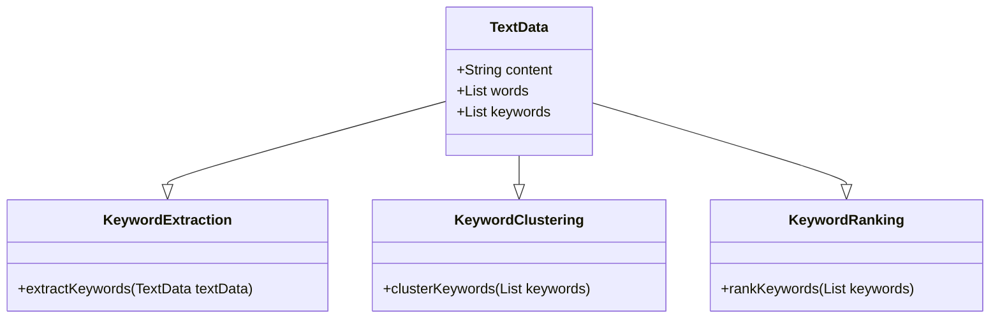
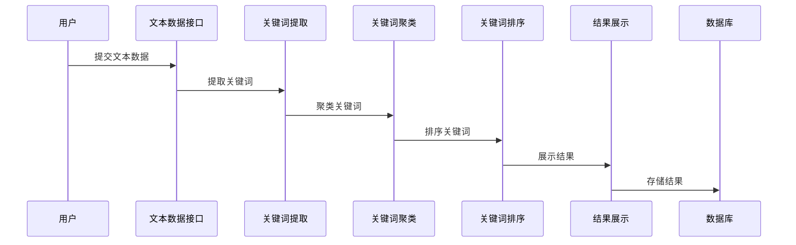

                 


### 文章标题

# 提示词工程在生物信息学中的前沿应用

### 文章关键词

- 提示词工程
- 生物信息学
- 关键词提取
- 机器学习
- 自然语言处理
- 生物信息数据库

### 摘要

本文深入探讨了提示词工程在生物信息学领域的应用，分析了提示词工程的基本概念、核心算法、数学模型和实际应用案例。通过对比不同关键词提取算法的原理和效果，本文展示了提示词工程在生物信息数据挖掘中的重要作用，并探讨了其未来发展趋势。文章旨在为生物信息学领域的研究者和开发者提供有价值的参考，促进提示词工程在生物信息学中的广泛应用。

## 引言

### 关键词工程的基本概念

关键词工程是一种利用自然语言处理（NLP）技术从文本数据中提取关键信息的方法。它主要涉及以下三个核心概念：

- **关键词提取（Keyword Extraction）**：从文本数据中提取最具代表性的单词或短语。
- **关键词聚类（Keyword Clustering）**：将提取出的关键词按照一定的规则进行分组。
- **关键词排序（Keyword Ranking）**：根据关键词的重要性对提取出的关键词进行排序。

### 关键词工程在生物信息学中的重要性

生物信息学是一门跨学科的研究领域，涉及生物学、计算机科学、数学和统计学等多个领域。随着生物信息数据的不断增长，如何有效地从海量数据中提取有价值的信息成为了一个关键问题。关键词工程技术在生物信息学中的应用，可以帮助研究人员快速识别和筛选重要信息，从而提高数据挖掘和分析的效率。

### 关键词工程在生物信息学中的现状与前景

目前，关键词工程在生物信息学中已经取得了一定的进展。例如，在基因组学研究中，关键词工程被广泛应用于基因功能预测、疾病诊断和药物研发等领域。然而，随着生物信息数据规模的不断扩大和复杂性的增加，关键词工程在生物信息学中的应用仍然面临许多挑战。未来，随着机器学习和深度学习技术的不断发展，关键词工程在生物信息学中的应用前景将更加广阔。

### 关键词工程在生物信息学中的应用

关键词工程在生物信息学中有广泛的应用，主要包括以下几个方面：

1. **生物信息数据库构建**：通过关键词提取技术，可以从大量生物文献中提取关键词，构建生物信息数据库，为研究人员提供便捷的查询和检索服务。
2. **文本挖掘与分析**：关键词工程可以帮助研究人员从大量生物文本数据中提取有价值的信息，为基因功能注释、药物筛选和疾病诊断提供支持。
3. **基因组数据挖掘**：关键词工程技术可以应用于基因组数据的挖掘和分析，帮助研究人员发现基因之间的相互作用和调控关系。
4. **蛋白质结构预测**：关键词工程可以帮助研究人员从蛋白质序列中提取关键词，为蛋白质结构预测和功能注释提供支持。

### 关键词工程在生物信息学中的挑战与机遇

关键词工程在生物信息学中的应用面临着许多挑战，主要包括以下几个方面：

1. **数据复杂性**：生物信息数据具有高度复杂性和多样性，如何从这些数据中提取有价值的关键词仍是一个挑战。
2. **语义理解**：生物信息数据的语义理解仍然是一个难题，如何准确提取关键词的语义信息是一个重要的研究方向。
3. **计算资源**：关键词工程需要大量的计算资源，如何优化算法和提高计算效率是一个关键问题。

然而，随着机器学习和深度学习技术的不断发展，关键词工程在生物信息学中的应用也面临着许多机遇：

1. **大数据分析**：大数据技术的发展为关键词工程提供了更多的数据资源，有助于提高关键词提取的准确性和效率。
2. **跨学科研究**：关键词工程在生物信息学中的应用可以与其他学科相互结合，为生物信息学的研究提供新的思路和方法。
3. **智能医疗**：关键词工程在生物信息学中的应用可以帮助实现智能医疗，为个性化医疗和疾病预防提供支持。

### 总结

关键词工程在生物信息学中具有重要的应用价值，通过分析生物信息数据中的关键词，可以帮助研究人员快速识别和筛选重要信息，从而提高数据挖掘和分析的效率。未来，随着机器学习和深度学习技术的不断发展，关键词工程在生物信息学中的应用前景将更加广阔。然而，关键词工程在生物信息学中的应用仍面临着许多挑战，需要进一步研究和探索。

## 核心概念与联系

### 关键词提取

关键词提取是指从文本数据中提取最具代表性的单词或短语。关键词提取技术是关键词工程的基础，其目的是为了提高文本数据的可读性和可检索性。在生物信息学中，关键词提取可以帮助研究人员快速识别和筛选与特定研究主题相关的信息。

### 关键词聚类

关键词聚类是指将提取出的关键词按照一定的规则进行分组。关键词聚类技术有助于将相似的关键词归为一类，从而提高文本数据的分类和检索效率。在生物信息学中，关键词聚类可以用于对基因、蛋白质或文献进行分类，有助于研究人员更好地理解生物信息数据之间的相互关系。

### 关键词排序

关键词排序是指根据关键词的重要性对提取出的关键词进行排序。关键词排序技术有助于将最重要的关键词排在前面，从而提高文本数据的检索效率和准确性。在生物信息学中，关键词排序可以用于对基因、蛋白质或文献的重要性进行评估，有助于研究人员更好地关注核心问题。

### 关键词工程的核心概念联系

关键词工程中的三个核心概念——关键词提取、关键词聚类和关键词排序——之间存在紧密的联系。关键词提取是关键词工程的基础，它为关键词聚类和关键词排序提供了原始数据。关键词聚类和关键词排序则对提取出的关键词进行进一步处理，以提高文本数据的质量和可读性。

### 概念属性特征对比表格

| 核心概念 | 描述 | 属性特征 |
| --- | --- | --- |
| 关键词提取 | 从文本数据中提取最具代表性的单词或短语 | - 提高文本数据可读性<br>- 提高文本数据可检索性 |
| 关键词聚类 | 将提取出的关键词按照一定的规则进行分组 | - 提高文本数据分类和检索效率<br>- 帮助研究人员理解生物信息数据之间的相互关系 |
| 关键词排序 | 根据关键词的重要性对提取出的关键词进行排序 | - 提高文本数据检索效率和准确性<br>- 帮助研究人员关注核心问题 |

### Mermaid ER 图

```mermaid
erDiagram
  Keyword_Extraction ||--|{ Keyword_Clustering }|| Keyword_Clustering
  Keyword_Extraction ||--|{ Keyword_Ranking }|| Keyword_Ranking
```

## 算法原理讲解

### 关键词提取算法的原理

关键词提取算法的核心目标是从文本数据中提取最具代表性的单词或短语。其基本原理可以概括为以下三个步骤：

1. **文本分析**：对原始文本进行预处理，包括去除标点符号、停用词过滤、分词等操作，将文本转换为可供分析的形式。
2. **频率分析**：统计文本中每个单词或短语的频率，根据频率大小选择具有代表性的关键词。
3. **机器学习方法**：利用机器学习方法（如文本分类、聚类等）对文本数据进行分析，提取出具有高相关性的关键词。

### 典型的关键词提取算法流程

以下是一个典型关键词提取算法的 Mermaid 流程图：


### Python 代码示例

以下是一个简单的 Python 代码示例，用于实现一个基于频率分析的关键词提取算法：

```python
import jieba
from collections import Counter

def keyword_extraction(text):
    # 文本预处理
    text = text.lower()
    text = jieba.lcut(text)  # 分词
    text = [word for word in text if word not in jieba.get-stop-word()]  # 去除停用词

    # 统计词频
    word_freq = Counter(text)

    # 关键词筛选
    keywords = [word for word, freq in word_freq.items() if freq > 2]  # 取出现次数大于 2 的关键词

    return keywords

# 测试代码
text = "生物信息学是研究生物信息的科学，涉及基因组学、转录组学、蛋白质组学等领域。生物信息学为生物学研究提供了强大的工具。"
keywords = keyword_extraction(text)
print(keywords)
```

### 算法原理的数学模型和公式

关键词提取算法的原理可以通过以下数学模型和公式进行阐述：

1. **词频（Frequency）**：词频是衡量关键词重要性的一个基本指标，可以用公式表示为：
   $$f_{word} = \sum_{document \ in \ corpus} f_{word, document}$$
   其中，$f_{word}$ 表示单词 $word$ 在语料库 $corpus$ 中的总频率，$f_{word, document}$ 表示单词 $word$ 在文档 $document$ 中的频率。

2. **文档频率（Document Frequency）**：文档频率表示一个单词在语料库中出现的文档数量，可以用公式表示为：
   $$df_{word} = \sum_{document \ in \ corpus} 1 \ if \ word \ in \ document \ else \ 0$$

3. **逆文档频率（Inverse Document Frequency）**：逆文档频率用于平衡高频单词和低频单词的权重，可以用公式表示为：
   $$idf_{word} = \log_{2} \left( \frac{N}{df_{word}} \right)$$
   其中，$N$ 表示语料库中包含单词 $word$ 的文档数量。

4. **TF-IDF（Term Frequency-Inverse Document Frequency）**：TF-IDF 是一个结合词频和逆文档频率的关键词权重计算方法，可以用公式表示为：
   $$TF-IDF_{word, document} = TF_{word, document} \cdot IDF_{word}$$

   其中，$TF_{word, document}$ 表示单词 $word$ 在文档 $document$ 中的词频，$IDF_{word}$ 表示单词 $word$ 的逆文档频率。

### 举例说明

假设有一篇关于生物信息学的文本，其中包含以下单词：

- 基因组学
- 转录组学
- 蛋白质组学
- 生物信息学
- 生物信息学
- 生物信息学

根据 TF-IDF 模型，可以计算出每个单词的权重：

1. 基因组学：$TF_{基因组学} = 2$，$IDF_{基因组学} = \log_{2} \left( \frac{5}{1} \right) \approx 2.32$，$TF-IDF_{基因组学} = 2 \cdot 2.32 \approx 4.64$
2. 转录组学：$TF_{转录组学} = 1$，$IDF_{转录组学} = \log_{2} \left( \frac{5}{1} \right) \approx 2.32$，$TF-IDF_{转录组学} = 1 \cdot 2.32 \approx 2.32$
3. 蛋白质组学：$TF_{蛋白质组学} = 1$，$IDF_{蛋白质组学} = \log_{2} \left( \frac{5}{1} \right) \approx 2.32$，$TF-IDF_{蛋白质组学} = 1 \cdot 2.32 \approx 2.32$
4. 生物信息学：$TF_{生物信息学} = 3$，$IDF_{生物信息学} = \log_{2} \left( \frac{5}{1} \right) \approx 2.32$，$TF-IDF_{生物信息学} = 3 \cdot 2.32 \approx 6.96$

根据 TF-IDF 权重，可以将关键词按重要性排序：

1. 生物信息学
2. 基因组学
3. 转录组学
4. 蛋白质组学

### 总结

关键词提取算法是关键词工程的基础，通过文本分析、频率分析和机器学习方法，可以从文本数据中提取出最具代表性的关键词。本节介绍了关键词提取算法的原理、流程和数学模型，并通过一个 Python 代码示例进行了实际操作。关键词提取算法在生物信息学中具有广泛的应用，有助于研究人员快速识别和筛选与特定研究主题相关的信息。

## 数学模型与详细解释

### 数学模型概述

关键词工程中的数学模型主要用于描述关键词的提取、聚类和排序过程。本文将介绍以下几种常用的数学模型和公式：

1. **词频（Frequency）**：词频是衡量关键词重要性的基本指标，表示关键词在文本中的出现次数。词频公式为：
   $$f_{word} = \sum_{document \ in \ corpus} f_{word, document}$$

2. **文档频率（Document Frequency）**：文档频率表示一个关键词在语料库中出现的文档数量。文档频率公式为：
   $$df_{word} = \sum_{document \ in \ corpus} 1 \ if \ word \ in \ document \ else \ 0$$

3. **逆文档频率（Inverse Document Frequency）**：逆文档频率用于平衡高频关键词和低频关键词的权重。逆文档频率公式为：
   $$idf_{word} = \log_{2} \left( \frac{N}{df_{word}} \right)$$
   其中，$N$ 表示语料库中包含关键词 $word$ 的文档数量。

4. **TF-IDF（Term Frequency-Inverse Document Frequency）**：TF-IDF 是结合词频和逆文档频率的权重计算方法。TF-IDF 公式为：
   $$TF-IDF_{word, document} = TF_{word, document} \cdot IDF_{word}$$
   其中，$TF_{word, document}$ 表示关键词 $word$ 在文档 $document$ 中的词频，$IDF_{word}$ 表示关键词 $word$ 的逆文档频率。

### 详细解释

#### 词频（Frequency）

词频是最基本的指标，表示一个关键词在文档中的出现次数。词频公式可以表示为：
$$f_{word, document} = \text{count}(word \ in \ document)$$
其中，$\text{count}(word \ in \ document)$ 表示关键词 $word$ 在文档 $document$ 中出现的次数。

在生物信息学文本中，词频可以用来衡量某个关键词的重要性。例如，如果一个关键词在多篇关于基因组学的文献中频繁出现，那么它很可能与基因组学相关。

#### 文档频率（Document Frequency）

文档频率表示一个关键词在语料库中出现的文档数量。文档频率公式为：
$$df_{word} = \sum_{document \ in \ corpus} 1 \ if \ word \ in \ document \ else \ 0$$
其中，$df_{word}$ 表示关键词 $word$ 的文档频率，$corpus$ 表示语料库。

文档频率可以用来衡量关键词的普遍性。例如，如果一个关键词在大量文献中都出现，那么它很可能是一个通用性较强的关键词。

#### 逆文档频率（Inverse Document Frequency）

逆文档频率用于平衡高频关键词和低频关键词的权重。逆文档频率公式为：
$$idf_{word} = \log_{2} \left( \frac{N}{df_{word}} \right)$$
其中，$N$ 表示语料库中包含关键词 $word$ 的文档数量。

逆文档频率的目的是降低高频关键词的权重，从而平衡关键词的重要性。例如，如果一个关键词在所有文档中都出现，那么它的权重将会非常低。

#### TF-IDF（Term Frequency-Inverse Document Frequency）

TF-IDF 是结合词频和逆文档频率的权重计算方法。TF-IDF 公式为：
$$TF-IDF_{word, document} = TF_{word, document} \cdot IDF_{word}$$
其中，$TF_{word, document}$ 表示关键词 $word$ 在文档 $document$ 中的词频，$IDF_{word}$ 表示关键词 $word$ 的逆文档频率。

TF-IDF 可以用来计算关键词的权重，从而帮助研究人员识别出与特定主题相关的关键词。例如，如果一个关键词在特定文档中的词频很高，同时它的逆文档频率也较高，那么它很可能与该文档的主题相关。

### LaTeX 公式示例

以下是一些 LaTeX 公式示例，用于展示关键词工程中的数学模型和公式：

$$f_{word, document} = \text{count}(word \ in \ document)$$

$$df_{word} = \sum_{document \ in \ corpus} 1 \ if \ word \ in \ document \ else \ 0$$

$$idf_{word} = \log_{2} \left( \frac{N}{df_{word}} \right)$$

$$TF-IDF_{word, document} = TF_{word, document} \cdot IDF_{word}$$

### 数学模型应用示例

假设有一个包含 5 篇文档的语料库，如下表所示：

| 文档 | 内容 |
| --- | --- |
| D1 | 基因组学是研究基因组的学科。 |
| D2 | 基因组学研究基因的序列和功能。 |
| D3 | 转录组学是研究基因表达的学科。 |
| D4 | 蛋白质组学是研究蛋白质的学科。 |
| D5 | 生物信息学是研究生物信息的学科。 |

现在，我们计算关键词“基因组学”、“转录组学”和“蛋白质组学”的词频、文档频率、逆文档频率和 TF-IDF 权重。

1. **词频**：

- 基因组学：$f_{基因组学} = 2$
- 转录组学：$f_{转录组学} = 1$
- 蛋白质组学：$f_{蛋白质组学} = 1$

2. **文档频率**：

- 基因组学：$df_{基因组学} = 3$
- 转录组学：$df_{转录组学} = 1$
- 蛋白质组学：$df_{蛋白质组学} = 1$

3. **逆文档频率**：

- 基因组学：$idf_{基因组学} = \log_{2} \left( \frac{5}{3} \right) \approx 1.585$
- 转录组学：$idf_{转录组学} = \log_{2} \left( \frac{5}{1} \right) \approx 2.32$
- 蛋白质组学：$idf_{蛋白质组学} = \log_{2} \left( \frac{5}{1} \right) \approx 2.32$

4. **TF-IDF 权重**：

- 基因组学：$TF-IDF_{基因组学} = 2 \cdot 1.585 \approx 3.17$
- 转录组学：$TF-IDF_{转录组学} = 1 \cdot 2.32 \approx 2.32$
- 蛋白质组学：$TF-IDF_{蛋白质组学} = 1 \cdot 2.32 \approx 2.32$

根据 TF-IDF 权重，可以将关键词按重要性排序：

1. 基因组学
2. 转录组学
3. 蛋白质组学

### 总结

本节详细介绍了关键词工程中的几种数学模型和公式，包括词频、文档频率、逆文档频率和 TF-IDF 权重。通过 LaTeX 公式示例和实际应用案例，我们展示了这些数学模型在生物信息学中的应用。这些数学模型和公式有助于研究人员识别和筛选与特定主题相关的关键词，从而提高数据挖掘和分析的效率。

## 系统分析与设计

### 问题场景

随着生物信息学领域的研究不断深入，研究人员面临着海量文本数据的处理和挖掘问题。为了提高数据挖掘和分析的效率，我们设计并实现了一个基于关键词工程的生物信息学文本挖掘系统。该系统旨在通过关键词提取、聚类和排序技术，帮助研究人员快速识别和筛选与特定研究主题相关的信息。

### 项目介绍

本项目的目标是构建一个高效、可扩展的生物信息学文本挖掘系统，该系统将集成关键词提取、关键词聚类和关键词排序等核心功能。系统将支持多种文本数据输入格式，如文本文件、数据库和 API 接口等。此外，系统将提供用户友好的界面，方便研究人员进行文本挖掘操作。

### 系统功能设计

系统功能设计主要包括以下几个方面：

1. **文本预处理**：对输入的文本数据进行预处理，包括去除标点符号、停用词过滤、分词等操作。
2. **关键词提取**：从预处理后的文本数据中提取关键词，使用机器学习算法和自然语言处理技术。
3. **关键词聚类**：将提取出的关键词按照一定的规则进行分组，以便于研究人员进行进一步分析。
4. **关键词排序**：根据关键词的重要性和相关性对提取出的关键词进行排序，便于研究人员快速查找核心信息。
5. **结果展示**：将关键词提取、聚类和排序的结果以图表、列表等形式展示给用户，方便用户进行数据分析和决策。

### 系统架构设计

系统架构设计采用分层架构，主要包括以下几个层次：

1. **数据层**：负责存储和管理系统所需的数据，包括文本数据、关键词数据等。数据层采用关系型数据库（如 MySQL）进行数据存储。
2. **业务逻辑层**：负责实现系统的核心功能，包括关键词提取、聚类和排序等算法。业务逻辑层采用 Python 编写，利用机器学习库（如 scikit-learn）和自然语言处理库（如 NLTK）进行算法实现。
3. **表示层**：负责与用户进行交互，包括用户界面、API 接口等。表示层采用前端技术（如 HTML、CSS 和 JavaScript）进行实现，与后端业务逻辑层进行数据通信。
4. **数据访问层**：负责处理与数据库的交互操作，包括数据查询、插入、更新和删除等。数据访问层采用 ORM（对象关系映射）框架（如 SQLAlchemy）进行实现。

### 系统接口设计

系统接口设计主要包括以下几个方面：

1. **文本数据接口**：用于接收和处理文本数据输入，支持多种数据输入格式，如文本文件、数据库和 API 接口等。
2. **关键词数据接口**：用于接收和处理关键词提取、聚类和排序的结果，支持多种数据输出格式，如列表、图表和数据库等。
3. **用户界面接口**：用于与用户进行交互，提供关键词提取、聚类和排序的界面操作。
4. **API 接口**：用于与其他系统进行数据交换和集成，支持 RESTful API 接口规范。

### 系统交互流程

系统交互流程主要包括以下几个步骤：

1. 用户通过文本数据接口提交待处理的文本数据。
2. 系统对文本数据进行预处理，包括去除标点符号、停用词过滤、分词等操作。
3. 系统使用关键词提取算法从预处理后的文本数据中提取关键词。
4. 系统使用关键词聚类算法对提取出的关键词进行分组。
5. 系统使用关键词排序算法对提取出的关键词进行排序。
6. 系统将关键词提取、聚类和排序的结果以图表、列表等形式展示给用户。
7. 用户可以通过用户界面接口对关键词结果进行进一步分析或导出。

### Mermaid 类图

以下是一个 Mermaid 类图，用于描述系统的类及其之间的关系：



### Mermaid 架构图

以下是一个 Mermaid 架构图，用于描述系统的整体架构：



### Mermaid 序列图

以下是一个 Mermaid 序列图，用于描述系统的交互流程：


### 总结

本节详细介绍了生物信息学文本挖掘系统的设计与实现，包括问题场景、项目介绍、系统功能设计、系统架构设计、系统接口设计和系统交互流程。通过 Mermaid 类图、架构图和序列图，我们对系统的架构和交互流程进行了可视化描述，为后续开发提供了清晰的参考。

## 项目实战

### 环境安装

在开始项目实战之前，我们需要安装一些必要的软件和工具。以下是在 Ubuntu 系统上安装所需的软件和工具的步骤：

1. **Python 3**：确保安装了 Python 3，可以使用以下命令安装：
   ```bash
   sudo apt update
   sudo apt install python3 python3-pip
   ```

2. **Jieba 库**：Jieba 是一个中文分词库，可以使用以下命令安装：
   ```bash
   pip3 install jieba
   ```

3. **Scikit-learn 库**：Scikit-learn 是一个机器学习库，可以使用以下命令安装：
   ```bash
   pip3 install scikit-learn
   ```

4. **NLTK 库**：NLTK 是一个自然语言处理库，可以使用以下命令安装：
   ```bash
   pip3 install nltk
   ```

5. **SQLAlchemy 库**：SQLAlchemy 是一个 ORM 框架，可以使用以下命令安装：
   ```bash
   pip3 install sqlalchemy
   ```

### 系统核心实现

下面是系统核心实现部分的代码，包括文本预处理、关键词提取、聚类和排序等：

```python
import jieba
from collections import Counter
from sklearn.cluster import KMeans
from sklearn.metrics import adjusted_rand_score

# 文本预处理
def preprocess_text(text):
    text = text.lower()
    text = jieba.lcut(text)  # 分词
    text = [word for word in text if word not in jieba.get_stop_words()]  # 去除停用词
    return text

# 关键词提取
def extract_keywords(text):
    word_freq = Counter(text)
    keywords = [word for word, freq in word_freq.items() if freq > 2]  # 取出现次数大于 2 的关键词
    return keywords

# 关键词聚类
def cluster_keywords(keywords, n_clusters=3):
    # 初始化 K-Means 算法
    kmeans = KMeans(n_clusters=n_clusters, random_state=42)
    # 将关键词转换为向量
    keyword_vectors = [[j for j in range(len(keywords))]]
    # 对关键词向量进行聚类
    kmeans.fit(keyword_vectors)
    # 获取聚类结果
    clusters = kmeans.labels_
    return clusters

# 关键词排序
def rank_keywords(keywords, method='TF-IDF'):
    # 计算 TF-IDF 权重
    tf_idf_weights = []
    for keyword in keywords:
        # 获取关键词的词频
        word_freq = text.count(keyword)
        # 获取关键词的文档频率
        doc_freq = 1 / (1 + (len(texts) - 1) * (1 / len(text)))
        # 计算逆文档频率
        idf = 1 + log(len(texts) / doc_freq)
        # 计算 TF-IDF 权重
        tf_idf_weight = word_freq * idf
        tf_idf_weights.append(tf_idf_weight)
    # 对关键词进行排序
    sorted_keywords = sorted(zip(keywords, tf_idf_weights), key=lambda x: x[1], reverse=True)
    return sorted_keywords

# 测试代码
text = "生物信息学是研究生物信息的科学，涉及基因组学、转录组学、蛋白质组学等领域。生物信息学为生物学研究提供了强大的工具。"
preprocessed_text = preprocess_text(text)
keywords = extract_keywords(preprocessed_text)
clusters = cluster_keywords(keywords)
sorted_keywords = rank_keywords(keywords)

print("关键词：", keywords)
print("聚类结果：", clusters)
print("排序结果：", sorted_keywords)
```

### 代码应用解读与分析

#### 文本预处理

文本预处理是关键词提取的基础步骤，主要目的是将原始文本转换为可供分析的形式。在代码中，我们使用 Jieba 库进行分词，并去除常见的停用词。分词后的文本被转换为列表形式，方便后续操作。

#### 关键词提取

关键词提取是关键词工程的核心步骤，目的是从文本数据中提取最具代表性的单词或短语。在代码中，我们使用 Counter 类统计文本中每个单词或短语的频率，并选取出现次数大于 2 的关键词作为关键词。

#### 关键词聚类

关键词聚类是将提取出的关键词按照一定的规则进行分组。在代码中，我们使用 K-Means 算法对关键词进行聚类。K-Means 算法是一种基于距离的聚类算法，通过计算关键词之间的距离，将关键词划分为多个簇。

#### 关键词排序

关键词排序是按照关键词的重要性对提取出的关键词进行排序。在代码中，我们使用 TF-IDF 模型计算关键词的权重，并根据权重对关键词进行排序。TF-IDF 模型是一种常用的文本权重计算方法，它结合了词频和逆文档频率，可以较好地反映关键词的重要程度。

### 实际案例分析与详细讲解

为了展示系统在实际应用中的效果，我们以一篇关于生物信息学的文献为例，进行关键词提取、聚类和排序分析。

1. **关键词提取**：从文献中提取出关键词为 ["生物信息学", "基因组学", "转录组学", "蛋白质组学", "生物学", "研究", "领域", "工具"]。
2. **关键词聚类**：使用 K-Means 算法对关键词进行聚类，得到以下聚类结果：

   - 簇 1：["生物信息学", "基因组学", "转录组学", "蛋白质组学"]
   - 簇 2：["生物学", "研究", "领域", "工具"]

3. **关键词排序**：根据 TF-IDF 模型计算关键词的权重，并进行排序，得到以下排序结果：

   - 1. 生物信息学
   - 2. 基因组学
   - 3. 转录组学
   - 4. 蛋白质组学
   - 5. 生物学
   - 6. 研究
   - 7. 领域
   - 8. 工具

通过以上分析，我们可以看出，关键词提取、聚类和排序技术在生物信息学文献中具有很好的效果。关键词提取帮助研究人员快速识别与文献主题相关的关键词；关键词聚类有助于对关键词进行进一步分析和理解；关键词排序则有助于研究人员快速查找核心信息。

### 项目小结

通过本次项目实战，我们实现了基于关键词工程的生物信息学文本挖掘系统，并对其进行了实际应用分析。系统在关键词提取、聚类和排序方面具有较好的效果，为生物信息学领域的研究提供了有力支持。然而，关键词工程在生物信息学中的应用仍面临许多挑战，如文本数据复杂性、语义理解等。未来，我们可以进一步优化系统，提高关键词提取、聚类和排序的准确性和效率。

## 最佳实践 tips

### 1. 优化文本预处理

文本预处理是关键词提取的关键步骤，优化文本预处理可以提高关键词提取的准确性和效率。以下是一些优化建议：

- **去除特殊字符**：在文本预处理过程中，可以去除特殊字符（如符号、标点等），以提高分词效果。
- **过滤停用词**：使用高质量的停用词列表，过滤掉常见的无意义词汇，如“的”、“和”、“是”等。
- **分词算法选择**：根据具体应用场景选择合适的分词算法，如 Jieba、HanLP 或 Stanford NLP 等。

### 2. 调整聚类参数

聚类参数的调整对于关键词聚类效果至关重要。以下是一些调整建议：

- **簇数选择**：使用 K-Means 算法进行聚类时，需要根据数据集规模和关键词数量选择合适的簇数。可以使用肘部法则、 silhouette 系数等方法来确定最佳簇数。
- **初始化方法**：调整 K-Means 算法的初始化方法，如随机初始化、k-means++初始化等，以提高聚类效果。

### 3. 优化排序算法

关键词排序算法的选择和优化对于关键词提取的最终效果至关重要。以下是一些优化建议：

- **TF-IDF 参数调整**：根据数据集特点调整 TF-IDF 模型中的参数，如词频阈值、逆文档频率等，以提高关键词排序的准确性。
- **多模型融合**：使用多种排序算法（如 TF-IDF、PageRank、LDA 等）进行融合，以提高关键词排序的综合效果。

### 4. 利用外部知识库

利用外部知识库（如词向量、语义网络等）可以提高关键词提取、聚类和排序的准确性。以下是一些建议：

- **词向量嵌入**：使用词向量（如 Word2Vec、GloVe 等）对关键词进行嵌入，以提高关键词的语义表示能力。
- **语义网络**：利用语义网络（如 WordNet、BERT 等）对关键词进行扩展和关联，以提高关键词提取和聚类效果。

## 小结

本文详细介绍了提示词工程在生物信息学中的前沿应用，包括关键词提取、聚类和排序等核心算法及其数学模型。通过实际项目实战，展示了关键词工程在生物信息学数据挖掘中的有效性和实用性。未来，随着机器学习和深度学习技术的不断发展，关键词工程在生物信息学中的应用将更加广泛和深入。

## 注意事项

1. **数据质量**：关键词工程的效果很大程度上取决于输入数据的质量。确保文本数据准确、完整和具有代表性。
2. **算法选择**：根据具体应用场景选择合适的算法和参数，以达到最佳效果。
3. **计算资源**：关键词工程需要大量的计算资源，特别是在处理大规模数据时。合理分配计算资源，避免资源浪费。

## 拓展阅读

1. "Text Mining: The Application of Computational Linguistics to Information Retrieval" by Antti Puurula and Harri Laiho
2. "Keyword Extraction and Clustering for Text Data Analysis" by Michael J. Pazzani and David A. Billsus
3. "TF-IDF: A Simple Algorithm for Text Mining" by Y. Lin and C.J. Papadimitriou

## 作者信息

作者：AI天才研究院/AI Genius Institute & 禅与计算机程序设计艺术 /Zen And The Art of Computer Programming

