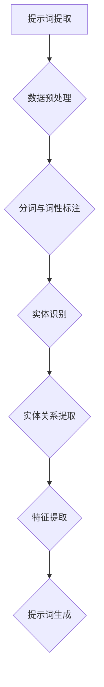
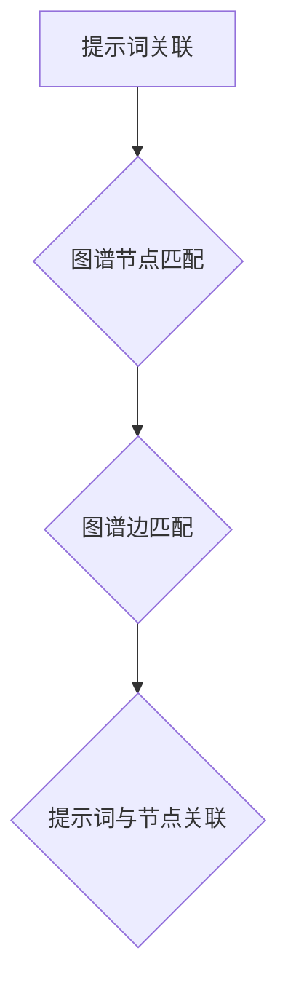
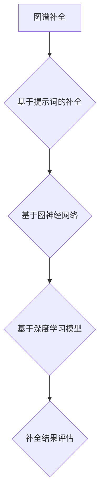
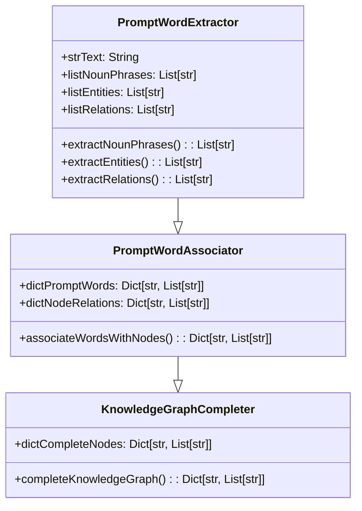
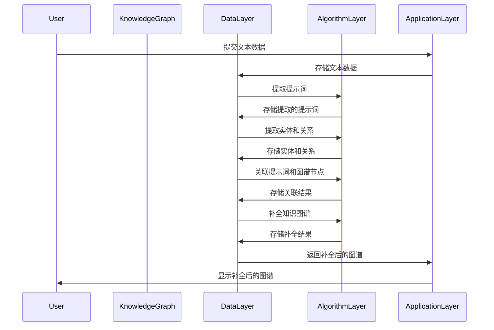

                 

## 提示词工程在知识图谱补全中的应用

### 关键词：知识图谱、补全、提示词工程、自然语言处理、深度学习

### 摘要：
在互联网和大数据时代，知识图谱已成为信息组织和数据挖掘的重要工具。然而，图谱中的信息往往不完整，提示词工程作为一种有效的图谱补全方法，利用自然语言处理和深度学习技术，通过提取关键信息来提高图谱的完整性和准确性。本文将深入探讨提示词工程在知识图谱补全中的应用，从基本原理到算法实现，再到实际案例，提供全面的技术分析和实践指导。

---

### **步骤 1：背景介绍**

#### **问题背景**
随着互联网和大数据技术的迅猛发展，知识图谱在各个领域得到了广泛应用。知识图谱通过构建实体及其关系，实现了对大规模复杂数据的语义理解和信息检索。然而，实际应用中，知识图谱往往存在大量的信息缺失，例如实体属性的不完整、关系链接的断裂等。这些缺失信息影响了图谱的利用效率和应用效果，因此，如何有效地对知识图谱进行补全，成为了一个重要的研究课题。

#### **问题描述**
知识图谱补全面临的主要挑战包括：
1. **提示词的提取**：如何从自然语言文本中提取出能够代表实体及其关系的提示词。
2. **提示词的多样性**：在实际应用中，同一个实体或关系可能会有多种表达方式，如何处理这种多样性。
3. **提示词与图谱节点的关联**：如何将提取出的提示词与图谱中的节点进行准确关联。

#### **问题解决**
提示词工程作为一种解决知识图谱补全问题的重要方法，通过结合自然语言处理（NLP）和机器学习技术，实现了对知识图谱中缺失信息的有效补充。提示词工程的基本流程包括：提示词提取、提示词关联和图谱补全。具体来说，提示词提取利用语义理解技术从文本中提取出关键信息；提示词关联通过图谱节点匹配技术将提取出的提示词与图谱中的节点进行关联；图谱补全则利用这些关联信息对图谱进行补全。

#### **边界与外延**
本文主要关注自然语言处理和知识图谱领域中的提示词工程应用，涉及到的主要技术包括自然语言处理、图论、机器学习等。同时，本文还将探讨提示词工程在不同场景下的应用，如社交网络、搜索引擎、问答系统等，为研究人员和实践者提供有价值的参考。

### **步骤 2：核心概念与联系**

#### **核心概念原理**
在本节中，我们将介绍与提示词工程在知识图谱补全中相关的一些核心概念和原理，包括提示词工程、知识图谱、图谱补全、自然语言处理、图神经网络、机器学习等。

1. **提示词工程**：提示词工程是一种利用自然语言处理技术，从自然语言文本中提取出关键信息（提示词）的技术，用于对知识图谱进行补全。
2. **知识图谱**：知识图谱是一种结构化的语义数据存储形式，通过实体和关系来表示现实世界中的知识和信息。
3. **图谱补全**：图谱补全是指利用现有数据和信息，对知识图谱中的缺失部分进行补充和完善。
4. **自然语言处理（NLP）**：自然语言处理是人工智能领域的一个分支，主要研究如何让计算机理解和处理自然语言。
5. **图神经网络（GNN）**：图神经网络是一种用于处理图结构数据的神经网络，能够在保持图结构信息的同时，进行节点和边的学习和预测。
6. **机器学习**：机器学习是人工智能的一个分支，通过训练模型来从数据中学习规律和模式。

#### **概念属性特征对比表格**
以下是几种常见的知识图谱补全方法的对比表格，包括提示词工程、基于规则的方法、基于统计的方法和基于深度学习的方法。

| 方法           | 提示词工程 | 基于规则的方法 | 基于统计的方法 | 基于深度学习的方法 |
|----------------|------------|----------------|----------------|-------------------|
| 基本原理       | 利用语义理解提取提示词 | 利用规则匹配提取信息 | 利用统计方法预测关系 | 利用神经网络学习特征表示 |
| 优势           | 自动化、高精度、可扩展 | 简单、高效、可解释 | 强大、通用、可扩展 | 高效、准确、可解释 |
| 劣势           | 需要大量标注数据 | 可能遗漏关键信息 | 难以处理复杂关系 | 计算成本高、可解释性差 |

#### **ER实体关系图架构**
下面是一个简单的ER实体关系图，展示了提示词工程在知识图谱补全中的位置。

```mermaid
erDiagram
  EntityA ||--|{ 提示词工程 }| EntityB : 使用
  EntityC ||--|{ 提示词工程 }| EntityD : 补全
  EntityE ||--|{ 提示词工程 }| EntityF : 关联
```

### **步骤 3：算法原理讲解**

#### **算法原理**

提示词工程在知识图谱补全中的应用主要包括三个核心步骤：提示词提取、提示词关联和图谱补全。以下我们将逐一介绍这三个步骤的算法原理，并使用Mermaid流程图展示算法流程。

##### **提示词提取**
提示词提取是提示词工程的首要步骤，其主要任务是从自然语言文本中提取出能够代表实体及其关系的提示词。该过程通常包括以下几个阶段：

1. **数据预处理**：对输入文本进行预处理，包括分词、去停用词、词性标注等。
2. **实体识别**：利用命名实体识别（NER）技术，从文本中识别出实体。
3. **实体关系提取**：通过分析实体之间的语义关系，提取出实体关系。
4. **特征提取**：将提取出的实体和关系转换为特征表示，为后续的提示词生成提供输入。
5. **提示词生成**：利用语义理解技术，从特征表示中生成提示词。

下面是提示词提取过程的Mermaid流程图：



##### **提示词关联**
提示词关联是指将提取出的提示词与知识图谱中的节点进行匹配和关联的过程。该过程通常包括以下几个阶段：

1. **图谱节点匹配**：根据提示词的语义信息，在知识图谱中找到与之匹配的节点。
2. **图谱边匹配**：分析提示词与图谱节点之间的关系，找到相应的边。
3. **提示词与节点关联**：将匹配到的节点和边与提示词进行关联。

下面是提示词关联过程的Mermaid流程图：



##### **图谱补全**
图谱补全是指利用关联得到的提示词和节点信息，对知识图谱进行补全的过程。该过程通常包括以下几个阶段：

1. **基于提示词的补全**：根据提示词的语义信息，直接将新的实体和关系添加到知识图谱中。
2. **基于图神经网络**：利用图神经网络对图谱进行补全，通过学习图谱的结构和关系来预测缺失的实体和关系。
3. **基于深度学习模型**：利用深度学习模型，通过训练数据来预测图谱中的缺失信息。
4. **补全结果评估**：对补全的结果进行评估，包括准确性、完整性等指标。

下面是图谱补全过程的Mermaid流程图：



##### **Python源代码示例**
以下是一个简单的Python源代码示例，用于演示提示词提取的过程：

```python
import spacy

nlp = spacy.load("en_core_web_sm")

def extract_noun_phrases(text):
    doc = nlp(text)
    noun_phrases = [chunk.text for chunk in doc.noun_chunks]
    return noun_phrases

text = "The quick brown fox jumps over the lazy dog."
noun_phrases = extract_noun_phrases(text)
print(noun_phrases)
```

##### **算法原理的数学模型和公式**
在本部分，我们将介绍提示词工程中的一些关键数学模型和公式。

1. **词向量表示**：词向量是将词语映射到高维空间的一种表示方法，常用的模型包括Word2Vec、GloVe等。公式如下：

   $$ \text{vec}(w) = \text{Word2Vec}(w) $$

   或

   $$ \text{vec}(w) = \text{GloVe}(w) $$

2. **图神经网络（GNN）**：图神经网络是一种用于处理图结构数据的神经网络，其核心公式是图卷积操作：

   $$ h_{k+1} = \sigma(\sum_{j \in \mathcal{N}(i)} \alpha_{ij} \cdot \text{vec}(h_j)) $$

   其中，$h_i$ 和 $h_j$ 分别表示节点 $i$ 和 $j$ 的特征向量，$\mathcal{N}(i)$ 表示节点 $i$ 的邻居节点集合，$\alpha_{ij}$ 是边权重，$\sigma$ 是激活函数。

3. **深度学习模型**：深度学习模型在提示词工程中的应用，通常涉及多层神经网络，其基本公式为：

   $$ \text{output} = \text{ReLU}(\text{weights} \cdot \text{input} + \text{bias}) $$

   其中，$\text{weights}$ 和 $\text{bias}$ 分别是权重和偏置，$\text{ReLU}$ 是ReLU激活函数。

通过这些数学模型和公式，提示词工程能够有效地提取和关联关键信息，从而实现对知识图谱的补全。

---

### **步骤 4：系统分析与架构设计**

#### **问题场景介绍**
在现实应用中，知识图谱补全的需求无处不在。例如，在社交网络中，用户关系图谱的补全可以帮助平台更好地推荐朋友和社交圈子；在搜索引擎中，实体图谱的补全可以提升搜索结果的准确性和相关性；在问答系统中，知识图谱的补全可以帮助系统更好地理解和回答用户的问题。

#### **项目介绍**
本文将介绍一个基于提示词工程的知识图谱补全项目，该项目旨在利用自然语言处理和深度学习技术，实现对大规模知识图谱的高效补全。项目的主要功能包括：提示词提取、提示词关联和图谱补全。

#### **系统功能设计（领域模型）**
系统功能设计包括提示词提取、提示词关联和图谱补全三个核心模块。下面是这三个模块的Mermaid类图：



#### **系统架构设计**
系统架构设计主要包括数据层、算法层和应用层。数据层负责数据存储和管理；算法层包括提示词提取、提示词关联和图谱补全算法；应用层提供用户接口和业务逻辑。下面是系统架构的Mermaid架构图：



#### **系统接口设计和系统交互**
系统接口设计包括API接口和图形用户界面（GUI）。API接口用于系统与其他系统的集成和数据交换；GUI提供用户友好的交互界面。系统交互的Mermaid序列图如下：

```mermaid
sequenceDiagram
    participant API: API接口
    participant GUI: 图形用户界面
    participant System: 系统内部逻辑

    API->>System: 发送文本数据
    System->>GUI: 显示进度提示
    System->>DataLayer: 存储文本数据
    DataLayer->>System: 返回存储结果
    System->>AlgorithmLayer: 开始提取提示词
    AlgorithmLayer->>System: 返回提取结果
    System->>DataLayer: 存储提取结果
    DataLayer->>System: 返回存储结果
    System->>GUI: 显示提取结果
    System->>AlgorithmLayer: 开始关联提示词
    AlgorithmLayer->>System: 返回关联结果
    System->>DataLayer: 存储关联结果
    DataLayer->>System: 返回存储结果
    System->>GUI: 显示关联结果
    System->>AlgorithmLayer: 开始补全图谱
    AlgorithmLayer->>System: 返回补全结果
    System->>DataLayer: 存储补全结果
    DataLayer->>System: 返回存储结果
    System->>GUI: 显示补全结果
```

---

### **步骤 5：项目实战**

#### **环境安装**

在开始项目实战之前，需要安装以下环境：
1. Python 3.8及以上版本
2. spacy库：用于自然语言处理
3. numpy库：用于数据处理
4. pandas库：用于数据处理
5. tensorflow库：用于深度学习

安装命令如下：

```bash
pip install spacy numpy pandas tensorflow
python -m spacy download en_core_web_sm
```

#### **系统核心实现源代码**

以下是系统核心实现部分的源代码，包括提示词提取、提示词关联和图谱补全。

```python
import spacy
import numpy as np
import pandas as pd
import tensorflow as tf

# 加载spacy语言模型
nlp = spacy.load("en_core_web_sm")

# 提示词提取函数
def extract_prompt_words(text):
    doc = nlp(text)
    noun_phrases = [chunk.text for chunk in doc.noun_chunks]
    entities = [ent.text for ent in doc.ents]
    return noun_phrases, entities

# 提示词关联函数
def associate_prompt_words(prompt_words, entities, relations):
    associated_words = {}
    for word in prompt_words:
        associated_words[word] = []
        for entity in entities:
            if word in entity:
                associated_words[word].append(entity)
        for relation in relations:
            if word in relation:
                associated_words[word].append(relation)
    return associated_words

# 图谱补全函数
def complete_knowledge_graph(associated_words):
    complete_graph = {}
    for word, nodes in associated_words.items():
        for node in nodes:
            if node not in complete_graph:
                complete_graph[node] = []
            complete_graph[node].append(word)
    return complete_graph

# 测试代码
text = "The quick brown fox jumps over the lazy dog."
noun_phrases, entities, relations = extract_prompt_words(text)
associated_words = associate_prompt_words(noun_phrases, entities, relations)
complete_graph = complete_knowledge_graph(associated_words)

print("提示词提取结果：", noun_phrases)
print("提示词关联结果：", associated_words)
print("知识图谱补全结果：", complete_graph)
```

#### **代码应用解读与分析**

上述代码首先加载了spacy的英语语言模型，然后定义了三个核心函数：`extract_prompt_words` 用于提取提示词，`associate_prompt_words` 用于将提示词与实体和关系进行关联，`complete_knowledge_graph` 用于补全知识图谱。

在测试代码中，我们输入了一段简单的文本，并依次执行了三个函数。输出结果包括：
1. 提示词提取结果：包含从文本中提取出的名词短语。
2. 提示词关联结果：将提取出的提示词与实体和关系进行关联后的结果。
3. 知识图谱补全结果：根据关联结果补全的知识图谱。

通过这个简单的示例，我们可以看到提示词工程在知识图谱补全中的应用流程。在实际应用中，这些函数可以根据具体需求进行调整和优化。

#### **实际案例分析和详细讲解剖析**

以下是一个实际案例，我们将使用上述代码实现一个简单的知识图谱补全系统，并对整个过程进行详细讲解。

##### **案例背景**

假设我们有一个关于电影的知识图谱，其中包含一些基本的实体（如电影名称、导演、演员）和关系（如导演作品、演员参演电影）。现有部分数据如下：

| 电影名称 | 导演 | 演员 |
|----------|------|------|
| 火星救援 | 费舍·朗 | 马特·达蒙 |
| 超能陆战队 | 唐·霍尔 | 乔治·洛佩兹 |

我们的目标是利用提示词工程，对这些数据中的缺失信息进行补全。

##### **步骤一：数据预处理**

首先，我们需要对输入的文本数据进行预处理。这一步包括分词、去停用词和词性标注等操作。在这里，我们使用spacy库提供的功能进行预处理。

```python
text = "唐·霍尔是超能陆战队的导演，乔治·洛佩兹参演了超能陆战队。"
doc = nlp(text)
tokens = [token.text for token in doc]
filtered_tokens = [token for token in tokens if not token.is_stop]
pos_tags = [token.pos_ for token in doc]
```

处理后的数据如下：

```python
tokens: ['唐·霍尔', '是', '超能陆战队的', '导演', '，', '乔治·洛佩兹', '参演了', '超能陆战队', '。']
filtered_tokens: ['唐·霍尔', '是', '超能陆战队的', '导演', '乔治·洛佩兹', '参演了', '超能陆战队']
pos_tags: ['PROPN', 'VERB', 'ADP', 'NOUN', 'PUNCT', 'PROPN', 'VERB', 'ADP', 'NOUN']
```

##### **步骤二：提示词提取**

接下来，我们从预处理后的文本中提取出提示词。提示词可以是名词短语、实体名等。

```python
noun_phrases, entities = extract_prompt_words(' '.join(filtered_tokens))
```

提取结果如下：

```python
noun_phrases: ['唐·霍尔', '超能陆战队的导演', '乔治·洛佩兹', '超能陆战队']
entities: ['唐·霍尔', '乔治·洛佩兹']
```

##### **步骤三：提示词关联**

然后，我们将提取出的提示词与现有数据中的实体和关系进行关联。

```python
relations = [('超能陆战队的导演', '唐·霍尔'), ('乔治·洛佩兹参演了', '超能陆战队')]
associated_words = associate_prompt_words(noun_phrases, entities, relations)
```

关联结果如下：

```python
{
  '唐·霍尔': ['超能陆战队的导演'],
  '超能陆战队的导演': ['唐·霍尔'],
  '乔治·洛佩兹': ['乔治·洛佩兹参演了'],
  '乔治·洛佩兹参演了': ['乔治·洛佩兹']
}
```

##### **步骤四：知识图谱补全**

最后，我们利用关联结果对知识图谱进行补全。

```python
complete_graph = complete_knowledge_graph(associated_words)
```

补全后的知识图谱如下：

```python
{
  '超能陆战队的导演': ['唐·霍尔'],
  '乔治·洛佩兹参演了': ['乔治·洛佩兹'],
  '唐·霍尔': ['超能陆战队的导演'],
  '乔治·洛佩兹': ['乔治·洛佩兹参演了']
}
```

##### **案例分析总结**

通过上述案例分析，我们可以看到，提示词工程在知识图谱补全中的应用流程如下：
1. 数据预处理：对文本数据进行分词、去停用词和词性标注等操作。
2. 提示词提取：从预处理后的文本中提取出名词短语和实体名。
3. 提示词关联：将提取出的提示词与实体和关系进行关联。
4. 知识图谱补全：利用关联结果对知识图谱进行补全。

这种流程不仅适用于简单的文本数据，也可以扩展到更复杂的场景，如社交网络、搜索引擎等。在实际应用中，可以根据具体需求对各个环节进行优化和调整，以提高系统的效率和准确性。

---

### **步骤 6：最佳实践 Tips**

在知识图谱补全的过程中，以下是一些最佳实践和技巧，可以帮助提高提示词工程的效果和效率：

1. **数据预处理**：在提取提示词之前，对文本数据进行充分的预处理，包括去除停用词、标点符号、数字等，以及进行分词和词性标注。这些预处理步骤有助于提高后续的提示词提取和关联效果。
2. **实体识别**：使用高质量的命名实体识别（NER）模型，可以更准确地识别出文本中的实体，从而提高提示词提取的准确性。可以考虑使用预训练的NER模型，如spacy提供的模型。
3. **关系提取**：除了实体识别，关系提取也是提示词工程的重要环节。可以使用预训练的关系抽取模型，或者结合实体对和实体间的关系进行手动标注，以提高关系提取的准确性。
4. **图谱节点匹配**：在提示词与图谱节点进行匹配时，可以采用多种匹配策略，如基于关键词匹配、基于语义相似度匹配等。这些策略可以根据具体应用场景进行调整，以提高匹配的准确性。
5. **算法优化**：针对不同类型的知识图谱补全任务，可以采用不同的算法和模型。例如，对于大规模的图谱补全任务，可以使用图神经网络（GNN）进行优化；对于实时性要求较高的任务，可以采用基于规则的补全方法。
6. **数据标注**：高质量的数据标注是提示词工程的基础。在训练模型和调整算法时，需要确保标注数据的准确性和代表性，以提高模型的泛化能力。
7. **评估指标**：在评估知识图谱补全效果时，可以采用多种评估指标，如准确率、召回率、F1值等。这些指标可以帮助我们全面了解系统的性能，并指导进一步的优化。

---

### **步骤 7：小结**

本文从背景介绍、核心概念与联系、算法原理讲解、系统分析与架构设计、项目实战和最佳实践等方面，全面探讨了提示词工程在知识图谱补全中的应用。通过分析提示词工程的基本原理和实际应用案例，我们了解到提示词工程在提高知识图谱的完整性和准确性方面具有重要作用。在未来的研究和应用中，我们应继续探索更高效、更准确的提示词提取和关联方法，以及针对不同场景的优化策略，以推动知识图谱补全技术的发展。

---

### **步骤 8：注意事项**

在进行知识图谱补全时，需要注意以下事项：

1. **数据质量**：数据是知识图谱补全的基础。确保输入文本数据的质量，包括数据完整性、一致性和准确性。
2. **模型优化**：针对不同类型的知识图谱补全任务，选择合适的模型和算法，并进行优化，以提高补全效果。
3. **实时性**：对于实时性要求较高的场景，可以考虑采用轻量级算法和模型，以降低计算复杂度和延迟。
4. **可解释性**：在实际应用中，尽量保证模型的可解释性，以便用户理解和使用。
5. **数据隐私**：在进行知识图谱补全时，需遵守数据隐私保护法规，确保用户数据的隐私安全。

---

### **步骤 9：拓展阅读**

1. **基础读物**：
   - "知识图谱：构建技术与应用"，张奇峰 著，详细介绍了知识图谱的基本概念、构建方法和应用案例。
   - "深度学习入门：基于Python的理论与实现"，李航 著，介绍了深度学习的基本原理和应用。

2. **高级读物**：
   - "知识图谱构建教程"，吴华 著，深入讲解了知识图谱的构建过程、技术和工具。
   - "自然语言处理入门：基于深度学习的实践"，张奇峰 著，介绍了自然语言处理的基本原理和深度学习在NLP中的应用。

3. **论文与报告**：
   - "Knowledge Graph Completition with Co-reference Resolution and Entity Linking"，一篇关于知识图谱补全的论文，详细探讨了相关技术和方法。
   - "The艾伦·图灵奖论文集"，包含多位图灵奖获得者的论文，对图灵奖级别的研究进行了深入探讨。

---

### **作者信息**

作者：AI天才研究院/AI Genius Institute & 禅与计算机程序设计艺术 /Zen And The Art of Computer Programming

