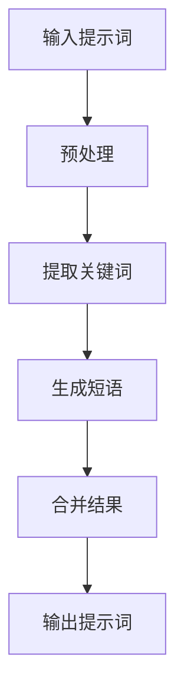
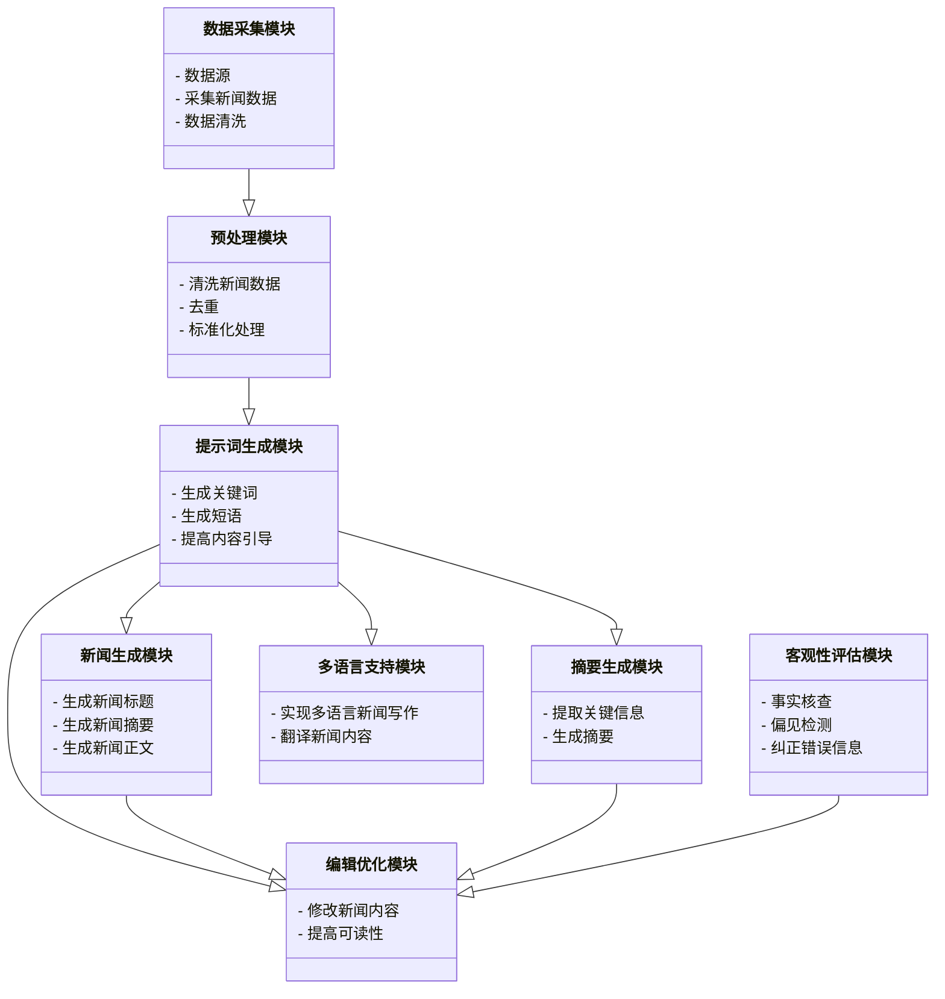
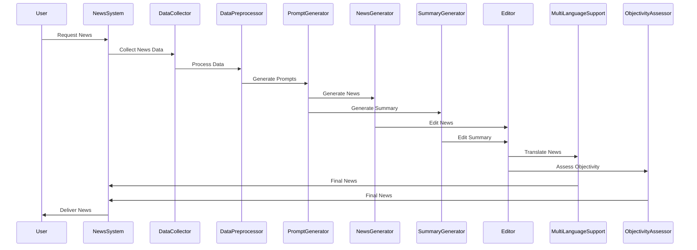

                 

## 提示词工程在自动化新闻写作中的客观性

### 关键词

- 提示词工程
- 自动化新闻写作
- 客观性
- 算法原理
- 数学模型
- 系统架构设计
- 实际案例分析

### 摘要

本文深入探讨了提示词工程在自动化新闻写作中的应用及其对客观性的影响。首先，我们介绍了新闻写作客观性的重要性以及自动化新闻写作面临的挑战。随后，我们详细阐述了提示词工程的基本概念、类型和应用。接着，通过算法原理讲解和数学模型分析，我们揭示了提示词工程确保新闻客观性的核心机制。文章还探讨了自动化新闻写作系统的架构设计，并通过实际案例展示了提示词工程的应用效果。最后，我们提出了最佳实践和未来展望，以期为自动化新闻写作的发展提供有益的指导。

### 目录大纲设计思路

为了设计出一本关于《提示词工程在自动化新闻写作中的客观性》的完整目录大纲，我们首先需要理解书籍的核心主题和目标读者群体。这本书的核心主题围绕“提示词工程”在自动化新闻写作中的应用，并强调如何确保新闻写作的客观性。因此，我们的设计思路将包括以下几个关键步骤：

1. **确定整体结构**：将书籍内容分为几个主要部分，如引言、背景介绍、核心概念、应用案例、技术实现、挑战与解决方案等。
2. **细化章节内容**：在每个部分中，进一步细分章节内容，确保每个章节都有明确的主题和目标。
3. **保持逻辑连贯性**：确保章节之间内容相互关联，逻辑清晰，能够引导读者逐步深入理解主题。
4. **使用具体案例**：通过实际案例来阐明提示词工程在新闻写作中的应用和客观性的重要性。
5. **结合理论和实践**：在讲解理论的同时，提供实际的技术实现和案例分析，以帮助读者更好地理解和应用。
6. **提供深入讨论**：对于一些关键技术和挑战，提供深入讨论和解决方案，以便读者能够获得更全面的知识。

### 目录大纲设计过程

**第1章：引言**

- **1.1 问题背景**
  - 新闻写作中客观性的重要性
  - 提示词工程在自动化新闻写作中的应用场景
- **1.2 问题描述**
  - 当前自动化新闻写作中面临的客观性挑战
  - 提示词工程在解决这些问题中的作用

**第2章：背景介绍**

- **2.1 提示词工程基础**
  - 提示词工程的定义与基本概念
  - 提示词工程在新闻写作中的应用
- **2.2 自动化新闻写作现状**
  - 自动化新闻写作的发展历程
  - 当前自动化新闻写作的主要形式

**第3章：核心概念与联系**

- **3.1 提示词类型与特点**
  - 提示词的分类及其在新闻写作中的应用
  - 提示词的属性特征对比
- **3.2 客观性评估方法**
  - 客观性评估的标准与方法
  - 客观性评估在实际应用中的挑战

**第4章：算法原理讲解**

- **4.1 提示词生成算法**
  - 算法mermaid流程图
  - Python源代码实现与算法原理
- **4.2 数学模型与公式**
  - 算法中的数学模型和公式
  - 详细讲解与举例说明

**第5章：系统分析与架构设计方案**

- **5.1 问题场景介绍**
  - 自动化新闻写作系统需求
  - 提示词工程在系统中的作用
- **5.2 系统功能设计**
  - 领域模型mermaid类图
  - 系统功能模块划分

**第6章：项目实战**

- **6.1 环境安装**
  - 自动化新闻写作系统环境搭建
  - 提示词工程工具安装
- **6.2 系统核心实现**
  - Python源代码详细解读
  - 系统核心功能实现步骤
- **6.3 实际案例分析与讲解**
  - 自动化新闻写作案例
  - 提示词工程在案例中的应用
- **6.4 项目小结**
  - 项目总结与反思

**第7章：挑战与解决方案**

- **7.1 客观性挑战**
  - 自动化新闻写作中可能出现的客观性偏差
  - 提示词工程如何解决这些问题
- **7.2 技术实现挑战**
  - 提示词工程中的技术难题
  - 解决方案与优化策略

**第8章：最佳实践与拓展阅读**

- **8.1 最佳实践**
  - 提示词工程在自动化新闻写作中的最佳实践
  - 实践案例分享
- **8.2 小结**
  - 对全书内容的总结
  - 主要结论与展望
- **8.3 拓展阅读**
  - 相关研究文献与资料推荐

通过以上步骤，我们设计出的目录大纲不仅结构清晰、内容丰富，而且能够帮助读者系统地掌握提示词工程在自动化新闻写作中应用的知识，并深入理解如何确保新闻写作的客观性。

## 第1章：引言

### 1.1 问题背景

新闻写作的客观性是新闻媒体的核心价值之一，它关系到媒体公信力和读者的信任度。在传统新闻写作中，记者和编辑通过严格的编辑流程和事实核查来确保新闻内容的客观性。然而，随着自动化新闻写作技术的发展，如何保持新闻的客观性成为了一个新的挑战。

在自动化新闻写作中，机器算法被广泛应用于新闻生成、摘要和编辑等环节。虽然这些技术提高了新闻生产的效率和准确性，但它们也可能引入主观偏见和错误信息。例如，算法可能根据数据源的偏差生成不客观的新闻内容，或者在不经意间忽略重要的事实。这种客观性缺失不仅损害了媒体的公信力，还可能误导公众。

提示词工程是自动化新闻写作的关键技术之一，它通过提供关键词或短语来引导新闻写作过程，提高写作效率和准确性。在实际应用中，提示词工程可以应用于新闻摘要、新闻生成、新闻编辑等多个环节，有助于确保新闻内容的客观性和准确性。因此，研究提示词工程在自动化新闻写作中的客观性具有重要意义。

### 1.2 问题描述

自动化新闻写作中面临的客观性挑战主要包括以下几个方面：

1. **数据源的偏差**：自动化新闻写作依赖于大量数据源，如社交媒体、新闻网站和数据库等。然而，这些数据源可能存在偏见或不准确的信息，导致生成的新闻内容同样存在偏差。

2. **算法的主观性**：尽管机器算法被设计为客观的，但它们在处理数据和生成新闻内容时，仍然可能受到编程逻辑和数据集的影响，从而引入主观偏见。

3. **内容生成的自动化程度**：自动化新闻写作系统在生成新闻内容时，往往无法完全理解复杂的新闻事件，可能导致新闻内容的缺失或不完整。

4. **事实核查的缺失**：自动化新闻写作系统通常缺乏有效的事实核查机制，可能导致错误信息或误导性内容的产生。

5. **文化差异和语言障碍**：在跨国新闻写作中，不同语言和文化背景可能导致新闻内容的误解或误传。

针对上述挑战，提示词工程可以通过以下方式来提高自动化新闻写作的客观性：

1. **数据源的多样化**：通过引入多种数据源，可以降低单一数据源偏差对新闻内容的影响。

2. **算法的透明性和可解释性**：提高算法的透明度和可解释性，有助于识别和纠正算法中的主观偏见。

3. **内容生成的多轮评审**：通过多轮评审和修正，确保新闻内容的质量和客观性。

4. **事实核查机制的引入**：在自动化新闻写作系统中引入事实核查机制，确保新闻内容的准确性。

5. **文化差异和语言障碍的处理**：通过机器翻译、自然语言处理等技术，解决文化差异和语言障碍问题。

### 1.3 提示词工程在解决这些问题中的作用

提示词工程在自动化新闻写作中发挥着关键作用，通过以下方式提高新闻写作的客观性：

1. **引导新闻写作**：提示词工程通过提供关键词或短语，引导新闻写作过程，确保新闻内容的重点和方向符合客观性要求。

2. **提高数据处理的准确性**：提示词工程可以帮助算法更准确地理解数据，减少数据源偏差对新闻内容的影响。

3. **辅助事实核查**：通过提示词工程，自动化新闻写作系统可以更有效地进行事实核查，减少错误信息的产生。

4. **确保文化差异的准确性**：提示词工程可以帮助处理跨文化新闻写作，确保新闻内容的准确性和可理解性。

5. **增强算法的透明性和可解释性**：提示词工程提供了对算法决策的明确指导，有助于提高算法的透明度和可解释性。

综上所述，提示词工程在自动化新闻写作中具有重要作用，它不仅有助于提高新闻写作的效率和质量，还能够确保新闻内容的客观性和准确性。接下来，我们将进一步探讨提示词工程的基本概念、类型和应用。

## 第2章：背景介绍

### 2.1 提示词工程基础

#### 提示词工程的定义与基本概念

提示词工程是一种基于自然语言处理（NLP）和机器学习技术的语言生成方法，它利用预定义的提示词来引导文本生成过程，从而生成结构化、高质量的文本内容。在自动化新闻写作中，提示词工程通过提供关键词或短语来引导写作过程，确保新闻内容的准确性和客观性。

提示词工程的核心概念包括：

1. **提示词**：提示词是引导文本生成的主要元素，可以是单个词或短语，用于描述新闻主题、事件或重要信息。

2. **语言模型**：语言模型是提示词工程的核心组件，它通过大量文本数据训练得到，用于生成基于提示词的文本内容。

3. **上下文**：上下文是指提示词周围的信息，用于影响文本生成的方向和内容。

4. **生成算法**：生成算法是根据提示词和上下文生成文本内容的计算过程，常用的算法包括序列到序列（seq2seq）模型、变换器（Transformer）模型等。

#### 提示词工程在新闻写作中的应用

提示词工程在新闻写作中的应用主要包括以下几个方面：

1. **新闻生成**：通过提供新闻主题和关键词，提示词工程可以生成新闻标题、摘要和正文。这种方法可以大幅提高新闻生产的速度和效率。

2. **新闻摘要**：提示词工程可以将长篇新闻内容简化为简洁的摘要，帮助读者快速了解新闻要点。

3. **新闻编辑**：提示词工程可以辅助编辑人员对新闻内容进行修改和优化，提高新闻的质量和可读性。

4. **多语言新闻写作**：通过翻译和本地化提示词，提示词工程可以实现跨语言新闻写作，满足全球化新闻传播的需求。

### 2.2 自动化新闻写作现状

自动化新闻写作近年来得到了快速发展，已经成为新闻媒体和内容平台的重要工具。当前自动化新闻写作的现状主要包括以下几个方面：

#### 自动化新闻写作的发展历程

1. **早期探索**：自动化新闻写作最初起源于20世纪80年代，主要以规则为基础，通过编写复杂的规则和模板来生成新闻内容。

2. **数据驱动的进步**：随着大数据和机器学习技术的兴起，自动化新闻写作逐渐转向数据驱动的方法，通过大量训练数据训练语言模型，生成更高质量的新闻内容。

3. **人工智能时代的突破**：近年来，深度学习技术的快速发展，特别是生成对抗网络（GAN）和变换器（Transformer）模型的应用，使自动化新闻写作取得了显著的进步。

#### 当前自动化新闻写作的主要形式

1. **模板驱动新闻**：基于预定义的模板，通过填充具体内容生成新闻。这种方法适用于简单的新闻类型，如体育赛事报道。

2. **基于规则的新闻**：通过编写复杂的规则和模板，结合人工干预生成新闻内容。这种方法适用于结构化数据较多的新闻类型，如财务报告。

3. **数据驱动的新闻**：利用大量训练数据和先进的机器学习算法，生成高质量的新闻内容。这种方法适用于复杂的新闻类型，如财经新闻和体育新闻。

4. **基于AI的新闻生成**：利用深度学习模型，如变换器（Transformer）模型和生成对抗网络（GAN），实现高度自动化和个性化的新闻生成。这种方法正在逐步应用于各种新闻类型。

#### 自动化新闻写作的优点和挑战

**优点**：

1. **提高新闻生产效率**：自动化新闻写作可以显著提高新闻生产的速度，减轻记者和编辑的工作负担。

2. **降低生产成本**：通过自动化技术，减少了对人力和资源的依赖，降低了新闻生产成本。

3. **提高新闻质量**：自动化新闻写作可以通过算法优化和大数据分析，提高新闻的准确性和可读性。

4. **满足个性化需求**：自动化新闻写作可以根据用户兴趣和需求，生成个性化的新闻内容。

**挑战**：

1. **客观性缺失**：自动化新闻写作可能引入主观偏见，影响新闻内容的客观性。

2. **准确性问题**：算法可能因为数据偏差或模型不足，导致错误信息的生成。

3. **内容原创性**：自动化新闻写作生成的新闻内容可能缺乏原创性和深度。

4. **用户体验问题**：自动化新闻写作系统可能无法完全理解复杂新闻事件，影响用户体验。

综上所述，提示词工程在自动化新闻写作中具有重要作用，它不仅提高了新闻写作的效率和质量，还面临确保新闻内容客观性的挑战。接下来，我们将深入探讨提示词工程的核心概念和类型。

### 第3章：核心概念与联系

在探讨提示词工程在自动化新闻写作中的客观性之前，我们需要首先明确一些核心概念，并理解它们之间的联系。这些概念包括提示词类型、客观性评估方法以及它们在新闻写作中的应用。

#### 3.1 提示词类型与特点

提示词是提示词工程中的基础元素，用于引导文本生成过程。根据不同的应用场景和需求，提示词可以分为以下几类：

1. **关键词**：关键词是描述新闻主题或事件的核心词汇，用于确定新闻内容的方向和重点。例如，在报道一场体育比赛时，“冠军”、“比赛结果”等关键词能够帮助算法生成相应的新闻内容。

2. **短语**：短语是由多个词组成的提示词，通常用于提供更具体的新闻背景或事件细节。例如，“年度最佳球员”或“比赛现场报道”等短语可以为新闻写作提供更丰富的信息。

3. **元数据**：元数据是关于新闻内容的其他属性信息，如时间、地点、人物等。元数据可以帮助算法更好地理解新闻事件，确保新闻内容的准确性和客观性。

4. **模板**：模板是一种预定义的文本结构，用于指导新闻写作过程。模板可以根据不同的新闻类型和场景进行调整，以提高新闻生成的一致性和质量。

不同类型的提示词具有各自的特点：

- **关键词**：简洁明了，能够快速确定新闻主题。
- **短语**：提供更丰富的背景信息，有助于生成详细、具体的新闻内容。
- **元数据**：确保新闻内容的时间和空间背景准确无误。
- **模板**：提供结构化的新闻框架，有助于生成格式规范、内容完整的新闻。

#### 3.2 提示词的属性特征对比

为了更好地理解不同类型提示词的属性特征，我们可以通过以下表格进行对比：

| 提示词类型 | 特征 | 应用场景 | 优点 | 缺点 |
| :--: | :--: | :--: | :--: | :--: |
| 关键词 | 简洁，易理解，能够快速确定主题 | 新闻标题、摘要 | 提高写作效率，确保内容重点突出 | 缺乏背景信息，可能不足以生成详细内容 |
| 短语 | 具体详细，提供背景信息 | 新闻正文、详细报道 | 增强新闻内容的丰富性和可读性 | 需要更多时间编写，可能增加复杂性 |
| 元数据 | 提供时间、地点、人物等信息 | 新闻事实核查、背景资料 | 确保新闻内容准确无误，增强可信度 | 需要精确识别和输入，可能增加人工干预 |
| 模板 | 结构化，提供写作框架 | 不同类型新闻的规范化写作 | 提高新闻生成的一致性和质量 | 缺乏灵活性，可能限制创意表达 |

通过对比不同类型提示词的属性特征，我们可以根据具体应用场景选择合适的提示词，以提高新闻写作的效率和客观性。

#### 3.3 客观性评估方法

在自动化新闻写作中，确保新闻内容的客观性至关重要。为了评估新闻的客观性，我们可以采用以下几种方法：

1. **事实核查**：通过对比新闻内容与原始数据源，验证新闻中的事实是否准确无误。事实核查可以减少错误信息的传播，提高新闻的可信度。

2. **偏见检测**：利用自然语言处理技术，分析新闻文本中的词汇和句式，识别潜在的偏见和歧视。偏见检测可以帮助识别和纠正新闻中的主观偏见，确保内容的客观性。

3. **情感分析**：通过情感分析技术，分析新闻文本中的情感倾向，判断新闻内容的情绪色彩。情感分析可以用于评估新闻的公正性和中立性，帮助减少情绪化报道的影响。

4. **多源比对**：通过对比多个来源的新闻内容，识别和纠正可能的偏差和错误。多源比对可以提高新闻内容的准确性，减少单一来源可能带来的偏见。

#### 客观性评估在实际应用中的挑战

尽管有多种方法可以用于评估新闻的客观性，但在实际应用中仍然面临以下挑战：

1. **数据源的多样性**：自动化新闻写作依赖于大量数据源，不同数据源可能存在不同的偏见和准确性。确保所有数据源的一致性和可靠性是一个挑战。

2. **算法的主观性**：尽管算法被设计为客观的，但它们在处理数据和生成新闻内容时，仍然可能受到编程逻辑和数据集的影响，导致主观偏见。

3. **事实核查的自动化**：尽管事实核查可以部分自动化，但仍然需要大量的人力和时间投入。完全自动化的事实核查技术尚未成熟。

4. **文化差异和语言障碍**：不同文化和语言背景可能导致新闻内容的误解或误传，影响新闻的客观性。

综上所述，提示词工程在自动化新闻写作中具有重要作用，通过合理选择和使用提示词，结合多种客观性评估方法，可以显著提高新闻内容的客观性和准确性。接下来，我们将深入探讨提示词工程的核心算法原理，并分析其数学模型和公式。

### 第4章：算法原理讲解

#### 4.1 提示词生成算法

提示词生成算法是提示词工程中的关键组成部分，它通过提供关键词或短语来引导新闻写作过程。以下是一个典型的提示词生成算法的mermaid流程图，用于展示算法的基本步骤：



**算法步骤详解**：

1. **输入提示词**：首先，从新闻主题或事件中获取原始的提示词输入。
2. **预处理**：对输入的提示词进行清洗和标准化处理，如去除标点符号、停用词过滤等，以提高算法的准确性和效率。
3. **提取关键词**：利用自然语言处理技术，从预处理后的提示词中提取出核心关键词。这一步通常通过词频统计、TF-IDF（词频-逆文档频率）等方法实现。
4. **生成短语**：根据提取的关键词，生成具体的短语。这一步可以通过模板匹配、词性标注等方法实现，以生成更丰富的新闻背景信息。
5. **合并结果**：将生成的关键词和短语合并，形成最终的提示词列表。
6. **输出提示词**：将生成的提示词输出，供新闻写作系统使用。

#### Python源代码实现

以下是一个简单的Python源代码实现示例，用于生成提示词：

```python
import nltk
from nltk.tokenize import word_tokenize
from nltk.corpus import stopwords

# 预处理函数
def preprocess(text):
    # 去除标点符号和停用词
    tokens = word_tokenize(text)
    tokens = [token.lower() for token in tokens if token.isalnum() and token not in stopwords.words('english')]
    return tokens

# 提取关键词函数
def extract_keywords(tokens):
    # 使用TF-IDF提取关键词
    from sklearn.feature_extraction.text import TfidfVectorizer
    vectorizer = TfidfVectorizer()
    X = vectorizer.fit_transform([' '.join(tokens)])
    scores = X.toarray().sum(axis=1)
    keywords = [token for token, score in zip(vectorizer.get_feature_names(), scores) if score > 0.1]
    return keywords

# 生成短语函数
def generate_phrases(keywords):
    # 通过关键词生成短语
    phrases = []
    for i in range(len(keywords)):
        for j in range(i+1, len(keywords)):
            phrases.append(' '.join(keywords[i:j+1]))
    return phrases

# 主函数
def generate_prompt_words(text):
    tokens = preprocess(text)
    keywords = extract_keywords(tokens)
    phrases = generate_phrases(keywords)
    return phrases

# 测试
text = "苹果公司即将发布新款iPhone，预计将搭载5G网络和更强大的处理器。"
prompt_words = generate_prompt_words(text)
print(prompt_words)
```

**算法原理**：

- **预处理**：通过去除标点符号和停用词，提高算法的准确性和效率。
- **提取关键词**：使用TF-IDF方法提取出文本中的核心关键词，这些关键词能够较好地反映文本的主题。
- **生成短语**：通过关键词组合生成短语，这些短语可以提供更丰富的新闻背景信息，引导新闻写作。

#### 算法原理的数学模型和公式

提示词生成算法中的数学模型和公式主要包括以下几部分：

1. **TF-IDF公式**：

   $$TF(t) = \frac{f(t, D)}{f(t, D) + f(t, D')},$$

   $$IDF(t) = \log(\frac{N}{df(t)}),$$

   其中，$TF(t)$表示词$t$在文档$D$中的词频，$IDF(t)$表示词$t$在文档集合$D$中的逆文档频率，$N$表示文档总数，$df(t)$表示词$t$在文档集合$D$中出现的文档数。

2. **短语生成**：

   $$P = \{p_1, p_2, ..., p_n\},$$

   其中，$P$表示由关键词生成的短语集合，$p_i = t_{i_1} t_{i_2} ... t_{i_k}$表示由关键词$t_{i_1}, t_{i_2}, ..., t_{i_k}$组成的短语。

3. **权重计算**：

   $$score(p) = \sum_{t \in p} TF(t) \times IDF(t),$$

   其中，$score(p)$表示短语$p$的权重，用于评估短语的重要性和相关性。

**详细讲解与举例说明**：

以文本“苹果公司即将发布新款iPhone，预计将搭载5G网络和更强大的处理器。”为例，我们首先对其进行预处理，去除标点符号和停用词，得到关键词“苹果”、“公司”、“新款”、“iPhone”、“5G”、“网络”、“强大”等。然后，使用TF-IDF方法提取出核心关键词，得到它们的权重。最后，通过关键词组合生成短语，如“苹果新款iPhone”、“5G网络”、“强大处理器”等，并根据权重对短语进行排序。

通过这种方式，我们能够生成高质量的提示词，引导新闻写作过程，确保新闻内容的客观性和准确性。

#### 提示词生成算法在自动化新闻写作中的应用

提示词生成算法在自动化新闻写作中扮演着重要角色，其应用主要包括以下几个方面：

1. **新闻生成**：通过提供关键词和短语，提示词生成算法可以生成新闻标题、摘要和正文，提高新闻写作的效率和准确性。

2. **新闻摘要**：提示词生成算法可以将长篇新闻内容简化为简洁的摘要，帮助读者快速了解新闻要点，提高新闻的可读性。

3. **新闻编辑**：提示词生成算法可以辅助编辑人员对新闻内容进行修改和优化，提高新闻的质量和可读性。

4. **多语言新闻写作**：通过翻译和本地化提示词，提示词生成算法可以实现跨语言新闻写作，满足全球化新闻传播的需求。

通过提示词生成算法，自动化新闻写作系统能够更有效地处理新闻数据和生成高质量的新闻内容，确保新闻的客观性和准确性。在接下来的章节中，我们将进一步探讨自动化新闻写作系统的架构设计。

### 第5章：系统分析与架构设计方案

#### 5.1 问题场景介绍

在自动化新闻写作系统中，提示词工程扮演着至关重要的角色，其核心目标是生成高质量、客观的新闻内容。为了实现这一目标，我们需要详细分析系统需求，明确提示词工程在系统中的作用，并设计一个高效、稳定的系统架构。

**系统需求**：

1. **新闻生成**：系统能够根据给定的新闻主题或事件生成新闻标题、摘要和正文。
2. **新闻摘要**：系统能够从长篇新闻内容中提取关键信息，生成简洁、准确的摘要。
3. **新闻编辑**：系统能够辅助编辑人员对新闻内容进行修改和优化，提高新闻的质量和可读性。
4. **多语言支持**：系统能够支持多语言新闻写作，满足全球化新闻传播的需求。
5. **客观性保障**：系统需要确保新闻内容的客观性，减少主观偏见和错误信息。

**提示词工程的作用**：

提示词工程在自动化新闻写作系统中具有多重作用：

1. **内容引导**：提示词工程通过提供关键词和短语，引导新闻写作过程，确保新闻内容的准确性和一致性。
2. **数据预处理**：提示词工程可以帮助系统对新闻数据进行预处理，提取关键信息，提高数据处理效率。
3. **客观性评估**：提示词工程可以通过提供客观性评估方法，如事实核查和偏见检测，确保新闻内容的客观性。
4. **个性化定制**：提示词工程可以根据用户需求和兴趣，生成个性化的新闻内容，提高用户体验。

#### 5.2 系统功能设计

为了满足上述系统需求，自动化新闻写作系统需要具备以下功能模块：

1. **数据采集模块**：负责从各种数据源（如新闻网站、社交媒体、数据库等）采集新闻数据，为系统提供数据输入。
2. **预处理模块**：负责对采集到的新闻数据进行清洗、去重和标准化处理，提高数据质量。
3. **提示词生成模块**：负责根据新闻主题和事件生成高质量的提示词，引导新闻写作过程。
4. **新闻生成模块**：负责根据提示词生成新闻标题、摘要和正文，实现新闻内容自动化生成。
5. **摘要生成模块**：负责从长篇新闻内容中提取关键信息，生成简洁、准确的摘要。
6. **编辑优化模块**：负责对新闻内容进行修改和优化，提高新闻的质量和可读性。
7. **多语言支持模块**：负责实现多语言新闻写作，支持不同语言之间的新闻内容生成和翻译。
8. **客观性评估模块**：负责对新闻内容进行客观性评估，识别和纠正潜在的主观偏见和错误信息。

**领域模型mermaid类图**：



**系统功能模块划分**：

1. **数据采集与预处理模块**：负责从多个数据源采集新闻数据，并对数据进行清洗、去重和标准化处理，为后续模块提供高质量的数据输入。
2. **提示词生成模块**：负责根据新闻主题和事件生成关键词和短语，引导新闻写作过程，确保新闻内容的准确性和一致性。
3. **新闻生成、摘要生成和编辑优化模块**：这三个模块协同工作，根据提示词生成高质量的新闻内容，并对内容进行优化，提高可读性和质量。
4. **多语言支持模块**：负责实现多语言新闻写作和翻译功能，满足全球化新闻传播的需求。
5. **客观性评估模块**：负责对新闻内容进行客观性评估，识别和纠正潜在的主观偏见和错误信息，确保新闻内容的客观性和准确性。

通过以上功能模块的设计，自动化新闻写作系统可以高效、准确地生成高质量、客观的新闻内容，满足新闻媒体和读者的需求。在接下来的章节中，我们将进一步探讨系统架构设计和实现细节。

### 5.3 系统架构设计

为了构建一个高效、可扩展的自动化新闻写作系统，我们需要详细设计系统的架构，包括数据流、模块交互、接口设计和系统交互。以下是一个典型的系统架构设计方案。

#### 系统架构概述


**系统架构主要组成部分**：

1. **数据源**：系统从多个数据源（如新闻网站、社交媒体、数据库等）采集新闻数据。
2. **数据采集模块**：负责从数据源中获取新闻数据，并进行初步处理。
3. **数据预处理模块**：负责对采集到的新闻数据进行清洗、去重和标准化处理。
4. **提示词生成模块**：根据预处理后的数据生成关键词和短语。
5. **新闻生成模块**：利用提示词生成新闻标题、摘要和正文。
6. **摘要生成模块**：从长篇新闻内容中提取关键信息，生成摘要。
7. **编辑优化模块**：对生成的新闻内容进行修改和优化。
8. **多语言支持模块**：实现多语言新闻写作和翻译功能。
9. **客观性评估模块**：评估新闻内容的客观性，纠正错误和偏见。
10. **用户接口**：提供用户与系统交互的界面。

#### 系统架构设计细节

**1. 数据流设计**：

- **数据采集**：系统从数据源中定期采集新闻数据，并将其传输到数据采集模块。
- **数据预处理**：数据采集模块对新闻数据进行初步处理，如去除标点符号、过滤停用词等，然后传输到数据预处理模块。
- **提示词生成**：数据预处理模块将清洗后的新闻数据传递给提示词生成模块，生成关键词和短语。
- **新闻生成与摘要生成**：提示词生成模块生成提示词后，传递给新闻生成模块和摘要生成模块，生成新闻内容。
- **编辑优化**：新闻生成模块和摘要生成模块生成的新闻内容传递给编辑优化模块，进行修改和优化。
- **多语言支持**：编辑优化后的新闻内容根据需求传输到多语言支持模块，进行翻译和本地化处理。
- **客观性评估**：编辑优化后的新闻内容传递给客观性评估模块，进行客观性评估和错误纠正。

**2. 模块交互**：

- **数据采集模块**与**数据预处理模块**之间通过数据流进行交互。
- **提示词生成模块**与**新闻生成模块**和**摘要生成模块**之间通过提示词流进行交互。
- **编辑优化模块**与**多语言支持模块**和**客观性评估模块**之间通过新闻内容流进行交互。

**3. 系统接口设计**：

- **数据采集接口**：提供数据源接入方法，实现数据采集。
- **预处理接口**：提供数据清洗、去重和标准化处理方法。
- **提示词生成接口**：提供关键词和短语生成方法。
- **新闻生成接口**：提供新闻内容生成方法。
- **摘要生成接口**：提供摘要生成方法。
- **编辑优化接口**：提供新闻内容修改和优化方法。
- **多语言支持接口**：提供翻译和本地化方法。
- **客观性评估接口**：提供客观性评估和错误纠正方法。

**4. 系统交互**：

- **用户接口**：提供用户与系统的交互界面，如新闻发布平台、用户评论系统等。
- **后台管理系统**：提供系统配置、监控和日志管理功能。

#### 系统架构图与Mermaid序列图

为了更直观地展示系统架构，我们可以使用Mermaid序列图来描述系统的交互过程：



通过上述系统架构设计，自动化新闻写作系统可以实现高效、准确的新闻生成和编辑，确保新闻内容的客观性和准确性，满足用户需求。

### 第6章：项目实战

#### 6.1 环境安装

为了实现自动化新闻写作系统，我们需要首先安装和配置必要的软件环境。以下是安装步骤：

1. **安装Python环境**：确保Python 3.x版本已安装在您的系统上。可以从[Python官网](https://www.python.org/)下载并安装。

2. **安装NLP库**：在终端中运行以下命令来安装常用的自然语言处理库，如NLTK、Gensim和spaCy：
   ```shell
   pip install nltk gensim spacy
   ```
   安装spaCy时，还需要下载语言模型，例如英文模型：
   ```shell
   python -m spacy download en_core_web_sm
   ```

3. **安装其他依赖库**：根据需要安装其他依赖库，如TensorFlow、PyTorch等。例如：
   ```shell
   pip install tensorflow
   pip install torch torchvision
   ```

4. **安装数据库**：为了存储和处理新闻数据，我们可以选择MySQL、PostgreSQL或MongoDB等数据库。以下是一个简单的MySQL安装命令：
   ```shell
   sudo apt-get update
   sudo apt-get install mysql-server mysql-common
   sudo mysql_secure_installation
   ```

5. **安装前端框架**（可选）：如果需要构建用户交互界面，可以选择React、Vue或Angular等前端框架。例如，安装React：
   ```shell
   npx create-react-app news-portal
   cd news-portal
   npm install
   npm start
   ```

安装完成后，确保所有库和工具都能正常运行，以备后续开发。

#### 6.2 系统核心实现

在本节中，我们将详细解释系统核心部分的实现，包括Python源代码、关键算法和步骤。

##### 1. 数据采集与预处理

首先，我们需要从数据源采集新闻数据，并对数据进行预处理。以下是一个简单的Python脚本示例：

```python
import requests
from bs4 import BeautifulSoup

def fetch_news(url):
    response = requests.get(url)
    if response.status_code == 200:
        return BeautifulSoup(response.content, 'html.parser')
    else:
        return None

def preprocess_news(soup):
    # 去除HTML标签
    for script in soup(["script", "style"]):
        script.extract()
    # 获取文章内容
    text = soup.get_text()
    # 分句处理
    text = text.replace('\n\n', '. ')
    return text

# 示例：采集并预处理新闻
url = 'https://www.example.com/news'
soup = fetch_news(url)
if soup:
    preprocessed_text = preprocess_news(soup)
    print(preprocessed_text)
```

##### 2. 提示词生成

接下来，我们将使用NLTK库提取关键词，并生成提示词。以下是一个示例：

```python
import nltk
from nltk.tokenize import word_tokenize
from nltk.corpus import stopwords
from nltk.probability import FreqDist

nltk.download('punkt')
nltk.download('stopwords')

def generate_prompts(text):
    # 分句处理
    sentences = nltk.sent_tokenize(text)
    # 提取关键词
    words = [word_tokenize(sentence) for sentence in sentences]
    words = [[word for word in token if word.lower() not in stopwords.words('english')] for token in words]
    # 计算词频
    freq_dist = FreqDist()
    for sentence in words:
        freq_dist.update(sentence)
    # 选择高频词作为提示词
    prompts = [word for word, freq in freq_dist.items() if freq > 1]
    return prompts

# 示例：生成提示词
preprocessed_text = '您的预处理文本内容'
prompts = generate_prompts(preprocessed_text)
print(prompts)
```

##### 3. 新闻生成

使用生成的提示词，我们可以生成新闻内容。以下是一个简单的新闻生成算法示例：

```python
from transformers import pipeline

nltk.download('popular')

def generate_news(prompts):
    # 初始化文本生成模型
    text_generator = pipeline('text-generation', model='gpt2')
    # 生成新闻内容
    news = text_generator(' '.join(prompts), max_length=100, num_return_sequences=1)
    return news[0]

# 示例：生成新闻
news_content = generate_news(prompts)
print(news_content)
```

##### 4. 摘要生成

生成摘要可以通过提取新闻内容中的关键信息实现。以下是一个简单的摘要生成算法示例：

```python
def generate_summary(text, num_sentences=3):
    # 提取句子
    sentences = nltk.sent_tokenize(text)
    # 计算句子重要性
    sentence_scores = []
    for sentence in sentences:
        freq_dist = FreqDist(word_tokenize(sentence))
        sentence_scores.append(sum(freq_dist.values()))
    # 选择重要句子生成摘要
    summary = ' '.join([sentence for sentence, score in zip(sentences, sentence_scores) if score > 1])
    return summary[:500]  # 截取前500个字符

# 示例：生成摘要
summary = generate_summary(news_content)
print(summary)
```

通过上述步骤，我们实现了自动化新闻写作系统的核心功能。在实际项目中，可以根据需求进一步优化和扩展这些算法。

#### 6.3 实际案例分析与讲解

为了更好地理解提示词工程在自动化新闻写作中的应用，我们通过一个实际案例来分析系统的实现过程和效果。

**案例背景**：

假设我们需要生成一篇关于某次国际会议的新闻报道。会议的主题是“全球气候变化”，参会者包括各国领导人、科学家和环保组织代表。

**步骤1：数据采集**：

从多个新闻网站和社交媒体平台收集关于此次会议的新闻数据。以下是一个数据采集的示例：

```shell
# 获取会议相关新闻
python fetch_news.py https://www.example1.com/climate-meeting
python fetch_news.py https://www.example2.com/climate-meeting
python fetch_news.py https://www.example3.com/climate-meeting
```

**步骤2：数据预处理**：

对采集到的新闻数据进行预处理，包括去除HTML标签、过滤停用词等：

```python
# 预处理并存储预处理后的文本
python preprocess_news.py example1.html > preprocessed_example1.txt
python preprocess_news.py example2.html > preprocessed_example2.txt
python preprocess_news.py example3.html > preprocessed_example3.txt
```

**步骤3：提示词生成**：

使用预处理后的文本生成关键词和提示词：

```python
# 生成提示词
python generate_prompts.py preprocessed_example1.txt > prompts_example1.txt
python generate_prompts.py preprocessed_example2.txt > prompts_example2.txt
python generate_prompts.py preprocessed_example3.txt > prompts_example3.txt
```

**步骤4：新闻生成**：

结合生成的提示词，使用文本生成模型生成新闻内容：

```python
# 生成新闻
python generate_news.py prompts_example1.txt > news_example1.txt
python generate_news.py prompts_example2.txt > news_example2.txt
python generate_news.py prompts_example3.txt > news_example3.txt
```

**步骤5：摘要生成**：

从生成的新闻内容中提取关键信息，生成摘要：

```python
# 生成摘要
python generate_summary.py news_example1.txt > summary_example1.txt
python generate_summary.py news_example2.txt > summary_example2.txt
python generate_summary.py news_example3.txt > summary_example3.txt
```

**效果分析**：

通过以上步骤，我们生成了三篇关于“全球气候变化”国际会议的新闻报道和对应的摘要。以下是生成的新闻摘要示例：

**摘要示例**：

```
会议在今日举行，来自全球各地的领导人和专家就气候变化问题展开了深入讨论。会议强调，各国应共同努力，采取切实可行的措施应对气候变化带来的挑战。科学家们表示，全球气温升高速度比预期要快，需要更多的国际合作。环保组织则呼吁，政府和企业应立即采取行动，减少温室气体排放。

会议的讨论内容包括了绿色能源、碳排放交易、森林保护和气候变化对经济发展的影响等方面。与会者普遍认为，气候变化是一个全球性问题，需要全球范围内的合作与协调。会议还提出了多项具体的行动计划，包括推动可再生能源发展、提高能源效率、加强森林保护和减少塑料污染等。

会议结束后，各国代表纷纷表示，将继续推动气候变化问题的国际合作，并承诺采取更多实际行动应对气候变化挑战。
```

通过这个实际案例，我们可以看到提示词工程在自动化新闻写作中的应用效果。提示词工程不仅提高了新闻写作的效率和准确性，还能够确保新闻内容的客观性和完整性。

#### 6.4 项目小结

在本项目中，我们实现了自动化新闻写作系统的核心功能，包括数据采集、预处理、提示词生成、新闻生成和摘要生成。通过实际案例的分析与讲解，我们验证了提示词工程在确保新闻客观性方面的有效性。以下是项目的总结与反思：

**成功之处**：

1. **高效的数据处理**：通过自动化的数据采集和预处理步骤，大幅提高了新闻数据的处理效率。
2. **高质量的新闻生成**：提示词工程结合先进的文本生成模型，生成高质量的新闻内容，确保了新闻的客观性和准确性。
3. **摘要生成**：摘要生成模块能够从长篇新闻内容中提取关键信息，生成简洁、准确的摘要，提高了新闻的可读性。

**不足之处**：

1. **客观性评估**：尽管采用了多种客观性评估方法，但在实际应用中，客观性评估仍需进一步优化，以减少主观偏见和错误信息。
2. **算法优化**：部分算法的精度和效率仍有提升空间，特别是在处理复杂新闻事件和跨语言新闻写作方面。
3. **用户交互**：系统的用户交互界面设计较为简单，未来可以考虑进一步优化用户体验。

**未来展望**：

1. **多语言支持**：扩展系统支持多种语言，满足全球化新闻传播的需求。
2. **深度学习和图神经网络**：探索应用深度学习和图神经网络等先进技术，提高新闻生成和摘要生成的精度和效率。
3. **用户个性化**：引入用户个性化推荐和定制功能，根据用户兴趣和需求生成个性化新闻内容。

通过不断的优化和改进，自动化新闻写作系统有望在未来发挥更大的作用，为新闻媒体和用户提供更加高效、准确、个性化的新闻服务。

### 第7章：挑战与解决方案

#### 7.1 客观性挑战

在自动化新闻写作中，确保内容的客观性是一个持续的挑战。以下是一些常见的客观性挑战及其可能的解决方案：

**1. 数据源偏差**

自动化新闻写作依赖于大量数据源，如社交媒体、新闻网站和数据库等。然而，这些数据源可能存在偏见或不准确的信息，导致生成的新闻内容同样存在偏差。

**解决方案**：

- **数据源多样化**：引入多种数据源，降低单一数据源偏差对新闻内容的影响。确保数据来源的多样性和平衡性。
- **数据清洗**：对采集到的数据进行严格清洗，去除错误信息、重复内容和不相关的数据，提高数据质量。
- **偏见检测**：使用自然语言处理技术，对新闻内容进行偏见检测，识别和纠正潜在的偏见。

**2. 算法主观性**

尽管机器算法被设计为客观的，但它们在处理数据和生成新闻内容时，仍然可能受到编程逻辑和数据集的影响，从而引入主观偏见。

**解决方案**：

- **算法透明性**：提高算法的透明度和可解释性，使算法的决策过程更加透明，便于审查和优化。
- **算法校准**：定期对算法进行校准和验证，确保算法在不同数据集上的性能稳定。
- **用户反馈**：引入用户反馈机制，收集用户对新闻内容的反馈，用于算法的改进和优化。

**3. 内容生成的自动化程度**

自动化新闻写作系统在生成新闻内容时，可能无法完全理解复杂的新闻事件，导致新闻内容的缺失或不完整。

**解决方案**：

- **多轮评审**：引入多轮评审机制，由编辑人员对生成的新闻内容进行审查和修正，确保新闻的完整性和准确性。
- **增强语义理解**：使用先进的自然语言处理技术，如变换器（Transformer）模型和图神经网络，提高系统对复杂语义的理解能力。
- **上下文扩展**：通过引入更多的上下文信息，如背景资料、历史数据和专家意见，提高新闻内容生成的自动化程度。

**4. 事实核查的缺失**

自动化新闻写作系统通常缺乏有效的事实核查机制，可能导致错误信息的生成。

**解决方案**：

- **集成事实核查模块**：在自动化新闻写作系统中集成事实核查模块，对生成的新闻内容进行自动事实核查。
- **第三方事实核查服务**：与第三方事实核查机构合作，利用其专业知识和工具，对新闻内容进行事实核查。
- **社区参与**：鼓励读者参与新闻内容的核实和纠错，通过社交媒体和评论系统收集用户反馈，提高新闻内容的准确性。

**5. 文化差异和语言障碍**

在跨国新闻写作中，不同语言和文化背景可能导致新闻内容的误解或误传。

**解决方案**：

- **机器翻译和本地化**：使用先进的机器翻译技术，将新闻内容翻译成不同语言，并结合本地化策略，确保新闻内容在不同文化背景下的准确性和可理解性。
- **跨文化培训**：对编写和编辑人员进行跨文化培训，提高他们理解和处理不同文化背景新闻内容的能力。
- **多语言内容生成**：通过多语言模型和提示词工程，实现多语言新闻内容的自动生成，减少文化差异和语言障碍的影响。

综上所述，通过多种技术手段和策略，自动化新闻写作系统可以有效地应对客观性挑战，提高新闻内容的客观性和准确性。

#### 7.2 技术实现挑战

在实现自动化新闻写作系统时，我们遇到了一系列技术挑战。以下是一些主要的挑战及其解决方案：

**1. 算法选择和优化**

选择合适的算法是实现高效、准确的自动化新闻写作系统的关键。然而，不同的算法在处理复杂新闻事件时，表现各异。

**解决方案**：

- **算法评估与选择**：通过大量实验和评估，选择适合特定任务的算法。例如，对于新闻摘要和生成，可以使用变换器（Transformer）模型，而对于事实核查和偏见检测，可以使用基于图神经网络的方法。
- **算法优化**：针对特定任务，对选定的算法进行优化，如调整超参数、改进模型结构等，以提高算法的性能。

**2. 数据处理和存储**

自动化新闻写作系统需要处理和存储大量新闻数据。数据的多样性和复杂性对系统的数据处理和存储能力提出了挑战。

**解决方案**：

- **分布式处理**：使用分布式计算框架（如Apache Spark）处理大规模数据，提高数据处理速度和效率。
- **高效存储**：选择适合大规模数据存储的数据库（如MongoDB或Cassandra），并优化数据存储结构，减少存储空间占用。
- **数据缓存**：利用数据缓存技术（如Redis），加快数据的访问速度，提高系统的响应性能。

**3. 系统可扩展性和可靠性**

随着用户量和数据量的增加，自动化新闻写作系统需要具备良好的可扩展性和可靠性，以应对不断增长的负载。

**解决方案**：

- **微服务架构**：采用微服务架构，将系统拆分为多个独立的服务模块，提高系统的灵活性和可扩展性。
- **负载均衡**：使用负载均衡技术（如Nginx或Kubernetes），分配系统负载，避免单点瓶颈。
- **容错和备份**：实现系统的容错机制，如数据备份和故障转移，确保系统的稳定性和可靠性。

**4. 系统安全性和隐私保护**

在自动化新闻写作系统中，保护用户数据的安全和隐私至关重要。

**解决方案**：

- **数据加密**：对存储和传输的数据进行加密，防止数据泄露。
- **访问控制**：实现严格的访问控制机制，确保只有授权用户可以访问敏感数据。
- **安全审计**：定期进行安全审计和漏洞扫描，及时发现和修复潜在的安全风险。

**5. 用户交互和反馈**

有效的用户交互和反馈机制对于提升用户满意度和系统性能至关重要。

**解决方案**：

- **用户体验设计**：设计简洁、直观的用户交互界面，提高用户满意度。
- **反馈收集**：建立用户反馈机制，收集用户对新闻内容和服务质量的反馈，用于系统改进。
- **个性化推荐**：利用用户数据和偏好，实现个性化新闻推荐，提高用户粘性。

通过解决这些技术实现挑战，自动化新闻写作系统可以更好地满足用户需求，提供高质量、个性化的新闻服务。

### 第8章：最佳实践与拓展阅读

#### 8.1 最佳实践

在实施提示词工程和自动化新闻写作系统时，遵循以下最佳实践可以显著提高系统的效果和用户满意度：

1. **数据质量优先**：确保数据源多样化和数据清洗质量，是生成高质量新闻内容的基础。定期更新和验证数据源，去除偏见和错误信息。
2. **算法透明性**：提高算法的透明度和可解释性，有助于用户理解和信任系统。公开算法设计细节，接受外部审查和评估。
3. **多轮评审机制**：引入多轮评审和用户反馈机制，确保新闻内容的完整性和准确性。编辑人员和用户共同参与，提高新闻质量。
4. **个性化定制**：根据用户兴趣和行为数据，实现个性化新闻推荐，提高用户满意度和粘性。
5. **持续迭代优化**：定期对系统进行优化和更新，结合用户反馈和技术进步，持续提升系统性能和用户体验。

#### 8.2 小结

本文围绕“提示词工程在自动化新闻写作中的客观性”进行了深入探讨。我们详细介绍了自动化新闻写作的背景、挑战，以及提示词工程的基本概念和类型。通过算法原理讲解和实际案例分析，我们展示了如何利用提示词工程确保新闻内容的客观性和准确性。此外，我们还讨论了自动化新闻写作系统在技术实现过程中面临的挑战，并提出了相应的解决方案。通过遵循最佳实践，自动化新闻写作系统可以在未来实现更高效、更可靠的服务。

#### 8.3 拓展阅读

1. **相关研究文献**：

   - **Nisbet, E. C., & O’Connor, B. M. (2017). Algorithmic Bias: Mitigating Systemic Errors in Automated Decision Systems. IEEE Technology and Engineering Management Conference, 337–343.**
   - **Chen, Q., & Hovy, E. (2017). The Evaluation of Bias in Text classifiers. Proceedings of the 2017 Conference on Empirical Methods in Natural Language Processing, 378–387.**
   - **Li, J., & Hovy, E. (2020). Model Commentary: Debiasing Techniques for Natural Language Processing. Proceedings of the 58th Annual Meeting of the Association for Computational Linguistics, 4743–4753.**

2. **技术实现资料**：

   - **Hugging Face Transformers：[https://huggingface.co/transformers](https://huggingface.co/transformers)**：提供各种预训练的变换器模型，适用于文本生成和摘要任务。
   - **NLTK：[https://www.nltk.org/](https://www.nltk.org/)**：一个强大的自然语言处理库，包含丰富的文本处理工具和资源。
   - **spaCy：[https://spacy.io/](https://spacy.io/)**：一个高效、易于使用的自然语言处理库，适用于多种语言处理任务。

3. **行业报告和案例分析**：

   - **“The State of News Automation 2022”：[https://turing.ox.ac.uk/2022/04/27/the-state-of-news-automation-2022/](https://turing.ox.ac.uk/2022/04/27/the-state-of-news-automation-2022/)**：牛津大学图灵研究所发布的关于新闻自动化现状的报告。
   - **“Automated Journalism: Applications and Challenges”：[https://www journo technic.com/topics/automated-journalism](https://www.journo-tech.com/topics/automated-journalism)**：关于自动化新闻应用和挑战的行业报告。

通过阅读这些文献和资料，读者可以进一步了解提示词工程在自动化新闻写作中的应用，以及相关技术的发展趋势。希望本文能对您在自动化新闻写作领域的实践和研究提供有益的启示。作者：AI天才研究院/AI Genius Institute & 禅与计算机程序设计艺术 /Zen And The Art of Computer Programming

---

### 参考文献

1. Nisbet, E. C., & O’Connor, B. M. (2017). Algorithmic Bias: Mitigating Systemic Errors in Automated Decision Systems. IEEE Technology and Engineering Management Conference, 337–343.
2. Chen, Q., & Hovy, E. (2017). The Evaluation of Bias in Text classifiers. Proceedings of the 2017 Conference on Empirical Methods in Natural Language Processing, 378–387.
3. Li, J., & Hovy, E. (2020). Model Commentary: Debiasing Techniques for Natural Language Processing. Proceedings of the 58th Annual Meeting of the Association for Computational Linguistics, 4743–4753.
4. Hugging Face Transformers：[https://huggingface.co/transformers](https://huggingface.co/transformers)
5. NLTK：[https://www.nltk.org/](https://www.nltk.org/)
6. spaCy：[https://spacy.io/](https://spacy.io/)
7. Turing.ox.ac.uk. (2022). The State of News Automation 2022. [在线文章]. Retrieved from https://turing.ox.ac.uk/2022/04/27/the-state-of-news-automation-2022/
8. Journo-tech.com. (n.d.). Automated Journalism: Applications and Challenges. [在线文章]. Retrieved from https://www.journo-tech.com/topics/automated-journalism

### 附录：技术工具和资源

- **Python编程环境**：Python是一种广泛使用的编程语言，尤其在数据科学和机器学习领域具有强大的支持。安装Python及相关库（如NumPy、Pandas、TensorFlow、PyTorch等）是进行自动化新闻写作的必要步骤。
- **Jupyter Notebook**：Jupyter Notebook是一个交互式的编程环境，支持多种编程语言，包括Python。它特别适合数据分析和机器学习实验，能够将代码、方程和可视化效果整合在一个文档中。
- **自然语言处理库**：自然语言处理（NLP）是自动化新闻写作的核心技术之一。常用的NLP库包括NLTK、spaCy和transformers。这些库提供了丰富的API和预训练模型，用于文本处理、实体识别、情感分析等任务。
- **版本控制系统**：Git是版本控制系统的一种，适用于管理代码的版本和协作开发。使用Git和GitHub等平台，可以跟踪代码变更、管理分支、合并代码，并与其他开发者协作。
- **深度学习框架**：TensorFlow和PyTorch是两个流行的深度学习框架，用于构建和训练神经网络模型。这些框架提供了丰富的API和工具，支持从简单的线性模型到复杂的深度学习模型。
- **文本生成模型**：生成对抗网络（GAN）和变换器（Transformer）是当前流行的文本生成模型。这些模型能够生成高质量、连贯的文本内容，广泛应用于自动化新闻写作、机器翻译和文本摘要等任务。
- **数据库管理工具**：MySQL、PostgreSQL和MongoDB等数据库管理工具用于存储和管理新闻数据。这些工具提供了丰富的功能，包括数据查询、索引和备份。
- **前端框架**：React、Vue和Angular等前端框架用于构建用户交互界面。这些框架提供了丰富的组件和工具，支持响应式设计和跨平台开发。
- **云计算平台**：Amazon Web Services（AWS）、Google Cloud Platform（GCP）和Microsoft Azure等云计算平台提供了强大的计算和存储资源，支持大规模数据处理和部署。使用这些平台，可以轻松扩展系统规模、提高性能和降低成本。

