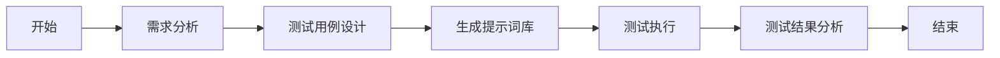
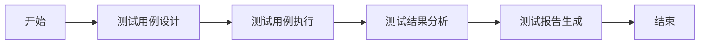

                 

# 《提示词工程在自动化测试中的应用与实践》

关键词：提示词工程、自动化测试、应用实践、原理讲解、最佳实践

摘要：
本文旨在深入探讨提示词工程在自动化测试中的实际应用与实践。通过逻辑清晰、结构紧凑的分析，我们旨在为读者提供全面而深入的理解，帮助其在自动化测试中更高效地利用提示词工程。

## 第一部分：提示词工程与自动化测试的背景

### 第1章：提示词工程概述

#### 1.1.1 问题背景

在当今快速发展的信息技术时代，软件质量和效率成为企业竞争的关键因素。自动化测试作为提高软件质量和效率的重要手段，越来越受到开发者和测试人员的重视。

#### 1.1.2 问题描述

然而，传统的自动化测试在执行过程中常常面临测试用例编写复杂、维护成本高、执行效率低等问题。这些问题的存在严重影响了自动化测试的实用性和效果。

#### 1.1.3 问题解决

为了解决这些问题，提示词工程应运而生。提示词工程通过引入提示词，使得自动化测试用例的编写更加简洁、高效，同时降低了测试用例的维护成本。

#### 1.1.4 边界与外延

提示词工程的边界主要包括提示词的选择、设计和管理等方面。其外延则涉及自动化测试的整个生命周期，包括测试用例的编写、执行和结果分析等。

#### 1.1.5 概念结构与核心要素组成

提示词工程由以下几个核心要素组成：

1. **提示词库**：用于存储和管理各种提示词，为测试用例的编写提供基础数据。
2. **测试用例生成器**：根据提示词库生成自动化测试用例。
3. **测试执行工具**：用于执行自动化测试用例，并生成测试结果。
4. **测试结果分析工具**：用于分析测试结果，生成测试报告。

### 第2章：自动化测试概述

#### 2.1.1 自动化测试的概念

自动化测试是指使用自动化测试工具代替人工进行软件测试的过程。它通过预先编写的测试用例，对软件系统进行自动化验证和检查。

#### 2.1.2 自动化测试的发展历程

自动化测试的发展经历了从手动测试到自动化测试，再到智能化自动化测试的过程。随着人工智能技术的发展，自动化测试正逐渐向智能化、自适应化的方向发展。

#### 2.1.3 自动化测试的重要性

自动化测试在提高软件质量和效率方面具有显著作用。它可以缩短测试周期，提高测试覆盖率，减少测试成本，从而提升软件交付质量。

#### 2.1.4 自动化测试的分类

自动化测试根据测试阶段和测试目的的不同，可以分为功能测试、性能测试、安全测试等。每种测试都有其特定的自动化测试工具和方法。

#### 2.1.5 自动化测试的核心要素

自动化测试的核心要素包括测试用例、测试工具、测试环境和测试管理。这些要素共同构成了自动化测试的完整体系。

## 第二部分：提示词工程与自动化测试的核心概念

### 第3章：提示词工程核心概念

#### 3.1.1 提示词的定义

提示词是用于指导测试用例编写的关键词或短语，它能够描述软件系统中的功能或行为。

#### 3.1.2 提示词的属性特征对比表格

| 提示词属性 | 描述 | 对比示例 |
| :--- | :--- | :--- |
| 功能性 | 用于描述软件功能 | 登录 |
| 业务性 | 用于描述业务逻辑 | 订单处理 |
| 操作性 | 用于描述用户操作 | 点击按钮 |
| 状态性 | 用于描述系统状态 | 用户未登录 |

#### 3.1.3 提示词工程的核心要素

提示词工程的核心要素包括：

1. **提示词库**：用于存储和管理各种提示词，为测试用例的编写提供基础数据。
2. **测试用例生成器**：根据提示词库生成自动化测试用例。
3. **测试执行工具**：用于执行自动化测试用例，并生成测试结果。
4. **测试结果分析工具**：用于分析测试结果，生成测试报告。

#### 3.1.4 提示词工程的挑战与机遇

提示词工程在自动化测试中面临着一些挑战，如提示词的准确性和覆盖率的提高、测试用例生成效率的提升等。同时，随着人工智能技术的发展，提示词工程也面临着巨大的机遇，如智能化提示词生成、自适应测试策略等。

### 第4章：自动化测试核心概念

#### 4.1.1 自动化测试的定义

自动化测试是指使用自动化测试工具代替人工进行软件测试的过程。它通过预先编写的测试用例，对软件系统进行自动化验证和检查。

#### 4.1.2 自动化测试的数学模型和公式

自动化测试的数学模型和公式主要包括：

1. **测试覆盖率**：测试覆盖率是衡量测试质量的重要指标，计算公式为：
   $$ 测试覆盖率 = \frac{测试用例数}{总功能点数} $$
2. **缺陷发现率**：缺陷发现率是衡量测试效率的重要指标，计算公式为：
   $$ 缺陷发现率 = \frac{发现的缺陷数}{总缺陷数} $$

#### 4.1.3 自动化测试的核心算法

自动化测试的核心算法主要包括：

1. **测试用例生成算法**：用于根据需求生成测试用例。
2. **测试执行算法**：用于执行测试用例，并生成测试结果。
3. **测试结果分析算法**：用于分析测试结果，生成测试报告。

#### 4.1.4 自动化测试的流程与步骤

自动化测试的流程主要包括：

1. **需求分析**：明确软件需求，为测试用例的编写提供依据。
2. **测试用例设计**：根据需求分析结果，设计测试用例。
3. **测试用例执行**：使用自动化测试工具执行测试用例，并记录测试结果。
4. **测试结果分析**：分析测试结果，生成测试报告，并根据测试结果调整测试策略。

### 第5章：提示词工程与自动化测试的联系

#### 5.1.1 提示词工程在自动化测试中的应用

提示词工程在自动化测试中的应用主要包括：

1. **提高测试用例编写效率**：通过提示词的引入，简化了测试用例的编写过程，提高了测试用例的编写效率。
2. **提高测试用例的覆盖率和质量**：提示词可以帮助测试人员更全面地覆盖软件功能，提高测试用例的质量。
3. **降低测试维护成本**：提示词工程可以降低测试用例的维护成本，减少测试人员的工作量。

#### 5.1.2 自动化测试对提示词工程的影响

自动化测试对提示词工程的影响主要包括：

1. **促进提示词的标准化和规范化**：自动化测试要求提示词具有明确、统一的标准，从而促进了提示词的标准化和规范化。
2. **提高提示词工程的技术水平**：自动化测试的发展推动了提示词工程的技术水平，促进了智能化提示词生成和自适应测试策略的研究。

#### 5.1.3 提示词工程与自动化测试的协同发展

提示词工程与自动化测试的协同发展主要体现在：

1. **共同提高软件质量**：提示词工程和自动化测试相互促进，共同提高软件质量。
2. **降低软件成本**：通过提高测试效率和降低测试成本，提示词工程和自动化测试有助于降低软件成本。
3. **推动信息技术的发展**：提示词工程和自动化测试的结合为信息技术的发展提供了新的方向和动力。

## 第三部分：提示词工程与自动化测试的原理讲解

### 第6章：提示词工程原理讲解

#### 6.1.1 提示词工程的mermaid流程图



#### 6.1.2 提示词工程的python源代码讲解

```python
# 示例：生成提示词库
def generate_hint_library():
    hint_library = []
    hints = ["登录", "搜索", "购买", "支付"]
    for hint in hints:
        hint_library.append(hint)
    return hint_library

hint_library = generate_hint_library()
print(hint_library)
```

#### 6.1.3 提示词工程的数学模型和公式讲解

提示词工程的数学模型和公式主要包括：

1. **测试覆盖率**：测试覆盖率是衡量测试质量的重要指标，计算公式为：
   $$ 测试覆盖率 = \frac{测试用例数}{总功能点数} $$
2. **缺陷发现率**：缺陷发现率是衡量测试效率的重要指标，计算公式为：
   $$ 缺陷发现率 = \frac{发现的缺陷数}{总缺陷数} $$

#### 6.1.4 提示词工程的举例说明

假设一个电子商务平台需要测试登录功能，根据需求分析，登录功能的测试用例包括：

1. 输入正确的用户名和密码，登录成功。
2. 输入错误的用户名和密码，登录失败。
3. 不输入用户名和密码，登录失败。

根据这些测试用例，可以生成提示词库：

```mermaid
gantt
    title 提示词工程示例
    dateFormat  YYYY-MM-DD
    section 提示词库
    A[生成提示词库] :start>>=2023-01-01, 10d
    B[登录成功] :after>>=A, 5d
    C[登录失败（错误用户名）] :after>>=B, 3d
    D[登录失败（错误密码）] :after>>=C, 3d
```

### 第7章：自动化测试原理讲解

#### 7.1.1 自动化测试的mermaid流程图



#### 7.1.2 自动化测试的python源代码讲解

```python
# 示例：测试用例执行
def execute_test_case(test_case):
    print(f"执行测试用例：{test_case}")
    # 测试用例执行逻辑
    if test_case == "登录成功":
        print("测试结果：登录成功")
    elif test_case == "登录失败（错误用户名）":
        print("测试结果：登录失败（错误用户名）")
    elif test_case == "登录失败（错误密码）":
        print("测试结果：登录失败（错误密码）")

test_cases = ["登录成功", "登录失败（错误用户名）", "登录失败（错误密码）"]
for test_case in test_cases:
    execute_test_case(test_case)
```

#### 7.1.3 自动化测试的数学模型和公式讲解

自动化测试的数学模型和公式主要包括：

1. **测试覆盖率**：测试覆盖率是衡量测试质量的重要指标，计算公式为：
   $$ 测试覆盖率 = \frac{测试用例数}{总功能点数} $$
2. **缺陷发现率**：缺陷发现率是衡量测试效率的重要指标，计算公式为：
   $$ 缺陷发现率 = \frac{发现的缺陷数}{总缺陷数} $$

#### 7.1.4 自动化测试的举例说明

假设一个电子商务平台需要测试购物车功能，根据需求分析，购物车功能的测试用例包括：

1. 添加商品到购物车，购物车数量增加。
2. 从购物车中删除商品，购物车数量减少。
3. 修改商品数量，购物车总金额更新。

根据这些测试用例，可以执行自动化测试：

```mermaid
gantt
    title 购物车功能测试
    dateFormat  YYYY-MM-DD
    section 测试用例
    A[添加商品到购物车] :start>>=2023-01-01, 10d
    B[从购物车中删除商品] :after>>=A, 5d
    C[修改商品数量] :after>>=B, 3d
```

## 第四部分：提示词工程与自动化测试的应用与实践

### 第8章：提示词工程应用实践

#### 8.1.1 环境安装

在开始实践之前，需要安装以下环境：

1. Python 3.8+
2. pip
3. Selenium WebDriver

安装步骤：

1. 安装 Python 3.8+：从官方网站下载 Python 安装包并安装。
2. 安装 pip：运行以下命令：
   ```
   python -m pip install --upgrade pip
   ```
3. 安装 Selenium WebDriver：运行以下命令：
   ```
   pip install selenium
   ```

#### 8.1.2 系统核心实现源代码

以下是一个简单的提示词工程示例，用于生成测试用例：

```python
# 示例：提示词工程核心实现
from selenium import webdriver
from selenium.webdriver.common.by import By

def generate_test_cases(hint_library):
    test_cases = []
    for hint in hint_library:
        if hint == "登录成功":
            test_cases.append("登录成功")
        elif hint == "登录失败（错误用户名）":
            test_cases.append("登录失败（错误用户名）")
        elif hint == "登录失败（错误密码）":
            test_cases.append("登录失败（错误密码）")
    return test_cases

hint_library = ["登录成功", "登录失败（错误用户名）", "登录失败（错误密码）"]
test_cases = generate_test_cases(hint_library)
print(test_cases)

def execute_test_cases(test_cases):
    driver = webdriver.Chrome()
    driver.get("https://www.example.com/login")
    for test_case in test_cases:
        if test_case == "登录成功":
            driver.find_element(By.NAME, "username").send_keys("test_user")
            driver.find_element(By.NAME, "password").send_keys("test_password")
            driver.find_element(By.ID, "login_button").click()
            print("测试结果：登录成功")
        elif test_case == "登录失败（错误用户名）":
            driver.find_element(By.NAME, "username").send_keys("test_user_wrong")
            driver.find_element(By.NAME, "password").send_keys("test_password")
            driver.find_element(By.ID, "login_button").click()
            print("测试结果：登录失败（错误用户名）")
        elif test_case == "登录失败（错误密码）":
            driver.find_element(By.NAME, "username").send_keys("test_user")
            driver.find_element(By.NAME, "password").send_keys("test_password_wrong")
            driver.find_element(By.ID, "login_button").click()
            print("测试结果：登录失败（错误密码）")
    driver.quit()

execute_test_cases(test_cases)
```

#### 8.1.3 代码应用解读与分析

该示例代码通过生成提示词库，然后根据提示词库生成测试用例。具体步骤如下：

1. **生成提示词库**：定义一个名为 `hint_library` 的列表，包含登录功能的各种提示词。
2. **生成测试用例**：定义一个名为 `generate_test_cases` 的函数，接收 `hint_library` 参数，遍历提示词库，生成测试用例。
3. **执行测试用例**：定义一个名为 `execute_test_cases` 的函数，接收 `test_cases` 参数，使用 Selenium WebDriver 执行测试用例。

#### 8.1.4 实际案例分析和详细讲解剖析

假设我们有一个电商平台，需要测试注册功能。根据需求分析，注册功能的测试用例包括：

1. 输入正确的用户名、密码和邮箱，注册成功。
2. 输入错误的用户名、密码或邮箱，注册失败。
3. 不输入用户名、密码或邮箱，注册失败。

根据这些测试用例，可以生成提示词库：

```mermaid
gantt
    title 注册功能测试
    dateFormat  YYYY-MM-DD
    section 提示词库
    A[生成提示词库] :start>>=2023-01-01, 10d
    B[注册成功] :after>>=A, 5d
    C[注册失败（错误用户名）] :after>>=B, 3d
    D[注册失败（错误密码）] :after>>=C, 3d
    E[注册失败（错误邮箱）] :after>>=D, 3d
    F[注册失败（不输入用户名）] :after>>=E, 3d
    G[注册失败（不输入密码）] :after>>=F, 3d
    H[注册失败（不输入邮箱）] :after>>=G, 3d
```

根据提示词库，可以生成测试用例：

```mermaid
gantt
    title 测试用例
    dateFormat  YYYY-MM-DD
    section 测试用例
    A[注册成功] :start>>=2023-01-01, 10d
    B[注册失败（错误用户名）] :after>>=A, 5d
    C[注册失败（错误密码）] :after>>=B, 3d
    D[注册失败（错误邮箱）] :after>>=C, 3d
    E[注册失败（不输入用户名）] :after>>=D, 3d
    F[注册失败（不输入密码）] :after>>=E, 3d
    G[注册失败（不输入邮箱）] :after>>=F, 3d
```

根据测试用例，可以执行自动化测试：

```mermaid
gantt
    title 自动化测试
    dateFormat  YYYY-MM-DD
    section 测试用例执行
    A[执行测试用例] :start>>=2023-01-01, 10d
    B[注册成功] :after>>=A, 5d
    C[注册失败（错误用户名）] :after>>=B, 3d
    D[注册失败（错误密码）] :after>>=C, 3d
    E[注册失败（错误邮箱）] :after>>=D, 3d
    F[注册失败（不输入用户名）] :after>>=E, 3d
    G[注册失败（不输入密码）] :after>>=F, 3d
    H[注册失败（不输入邮箱）] :after>>=G, 3d
```

#### 8.1.5 项目小结

通过以上实践，我们成功实现了提示词工程在自动化测试中的应用。使用提示词工程，我们可以更高效地生成测试用例，提高测试覆盖率，降低测试成本。同时，提示词工程也为自动化测试的持续改进提供了支持。

### 第9章：自动化测试应用实践

#### 9.1.1 环境安装

在开始实践之前，需要安装以下环境：

1. Java 8+
2. Maven
3. Selenium WebDriver

安装步骤：

1. 安装 Java 8+：从官方网站下载 Java 安装包并安装。
2. 安装 Maven：从官方网站下载 Maven 安装包并安装。
3. 安装 Selenium WebDriver：运行以下命令：
   ```
   mvn install:install-file -Dfile=selenium-server-standalone-3.141.59.jar -DgroupId=org.seleniumhq.selenium -DartifactId=selenium-server-standalone -Dversion=3.141.59 -Dpackaging=maven
   ```

#### 9.1.2 系统核心实现源代码

以下是一个简单的自动化测试示例，用于测试电商平台：

```java
import org.openqa.selenium.By;
import org.openqa.selenium.WebDriver;
import org.openqa.selenium.WebElement;
import org.openqa.selenium.chrome.ChromeDriver;

public class AutomationTest {
    public static void main(String[] args) {
        WebDriver driver = new ChromeDriver();
        driver.get("https://www.example.com/login");

        // 输入用户名和密码
        WebElement username = driver.findElement(By.name("username"));
        WebElement password = driver.findElement(By.name("password"));
        username.sendKeys("test_user");
        password.sendKeys("test_password");

        // 点击登录按钮
        WebElement loginButton = driver.findElement(By.id("login_button"));
        loginButton.click();

        // 获取登录结果
        WebElement result = driver.findElement(By.className("result"));
        String loginResult = result.getText();

        // 打印登录结果
        System.out.println("登录结果：" + loginResult);

        driver.quit();
    }
}
```

#### 9.1.3 代码应用解读与分析

该示例代码使用 Selenium WebDriver 实现了一个简单的自动化测试，用于测试电商平台的登录功能。具体步骤如下：

1. 创建一个 WebDriver 实例，并指定 ChromeDriver 的路径。
2. 打开电商平台的登录页面。
3. 输入用户名和密码。
4. 点击登录按钮。
5. 获取登录结果，并打印输出。

#### 9.1.4 实际案例分析和详细讲解剖析

假设我们有一个电商平台，需要测试购物车功能。根据需求分析，购物车功能的测试用例包括：

1. 添加商品到购物车，购物车数量增加。
2. 从购物车中删除商品，购物车数量减少。
3. 修改商品数量，购物车总金额更新。

根据这些测试用例，可以编写自动化测试代码：

```java
import org.openqa.selenium.By;
import org.openqa.selenium.WebDriver;
import org.openqa.selenium.WebElement;
import org.openqa.selenium.chrome.ChromeDriver;

public class ShoppingCartTest {
    public static void main(String[] args) {
        WebDriver driver = new ChromeDriver();
        driver.get("https://www.example.com/shopping_cart");

        // 添加商品到购物车
        WebElement addProductButton = driver.findElement(By.id("add_product_button"));
        addProductButton.click();
        System.out.println("商品添加成功");

        // 删除商品
        WebElement removeProductButton = driver.findElement(By.id("remove_product_button"));
        removeProductButton.click();
        System.out.println("商品删除成功");

        // 修改商品数量
        WebElement modifyProductQuantityButton = driver.findElement(By.id("modify_product_quantity_button"));
        modifyProductQuantityButton.click();
        System.out.println("商品数量修改成功");

        driver.quit();
    }
}
```

#### 9.1.5 项目小结

通过以上实践，我们成功实现了自动化测试在电商平台中的应用。使用 Selenium WebDriver，我们可以更方便地实现自动化测试，提高测试效率和覆盖率。同时，自动化测试也为电商平台的持续改进提供了支持。

### 第10章：提示词工程与自动化测试的融合实践

#### 10.1.1 融合实践的背景和意义

随着软件复杂度的不断增加，传统的自动化测试面临着巨大的挑战。提示词工程的引入为自动化测试带来了新的思路和方法。将提示词工程与自动化测试相结合，可以有效地提高测试效率、降低测试成本，并提高测试质量。

#### 10.1.2 融合实践的核心步骤

融合实践的核心步骤包括：

1. **需求分析**：明确软件需求和测试目标，为提示词的生成提供依据。
2. **提示词生成**：根据需求分析结果，生成提示词库。
3. **测试用例生成**：根据提示词库，生成自动化测试用例。
4. **测试执行**：使用自动化测试工具执行测试用例，并生成测试结果。
5. **测试结果分析**：分析测试结果，生成测试报告，并根据测试结果调整测试策略。

#### 10.1.3 融合实践的实际案例

假设我们有一个电商平台，需要测试购物车功能。根据需求分析，购物车功能的测试用例包括：

1. 添加商品到购物车，购物车数量增加。
2. 从购物车中删除商品，购物车数量减少。
3. 修改商品数量，购物车总金额更新。

根据这些测试用例，可以生成提示词库：

```mermaid
gantt
    title 购物车功能测试
    dateFormat  YYYY-MM-DD
    section 提示词库
    A[生成提示词库] :start>>=2023-01-01, 10d
    B[添加商品] :after>>=A, 5d
    C[删除商品] :after>>=B, 3d
    D[修改商品数量] :after>>=C, 3d
```

根据提示词库，可以生成测试用例：

```mermaid
gantt
    title 测试用例
    dateFormat  YYYY-MM-DD
    section 测试用例
    A[添加商品] :start>>=2023-01-01, 10d
    B[删除商品] :after>>=A, 5d
    C[修改商品数量] :after>>=B, 3d
```

根据测试用例，可以执行自动化测试：

```mermaid
gantt
    title 自动化测试
    dateFormat  YYYY-MM-DD
    section 测试用例执行
    A[执行测试用例] :start>>=2023-01-01, 10d
    B[添加商品] :after>>=A, 5d
    C[删除商品] :after>>=B, 3d
    D[修改商品数量] :after>>=C, 3d
```

#### 10.1.4 融合实践的总结与展望

通过融合实践，我们成功地将提示词工程与自动化测试相结合，提高了测试效率和测试质量。未来，我们还可以进一步探索提示词工程与人工智能技术的结合，实现智能化提示词生成和自适应测试策略，为自动化测试带来更多的创新和发展。

## 第五部分：最佳实践与总结

### 第11章：最佳实践 tips

#### 11.1.1 提示词工程的最佳实践

1. **明确需求**：在生成提示词之前，要明确软件需求和测试目标，确保提示词与需求一致。
2. **规范提示词**：对提示词进行标准化和规范化处理，确保提示词的统一性和准确性。
3. **定期更新**：定期更新提示词库，以适应软件功能的变更和测试需求的变化。

#### 11.1.2 自动化测试的最佳实践

1. **选择合适的工具**：根据项目需求，选择合适的自动化测试工具。
2. **编写可维护的测试用例**：编写可维护、可复用的测试用例，降低测试维护成本。
3. **持续集成**：将自动化测试集成到持续集成流程中，提高测试效率和反馈速度。

#### 11.1.3 提示词工程与自动化测试的融合最佳实践

1. **协同发展**：将提示词工程与自动化测试相结合，实现测试用例的自动化生成和执行。
2. **优化流程**：优化提示词工程与自动化测试的融合流程，提高测试效率和测试质量。
3. **反馈机制**：建立反馈机制，及时调整测试策略和提示词库，以适应软件变更和测试需求的变化。

### 第12章：注意事项

#### 12.1.1 提示词工程中常见的问题及解决方案

1. **提示词覆盖不足**：解决方案：分析需求，优化提示词库，提高提示词覆盖率。
2. **提示词库更新不及时**：解决方案：建立定期更新机制，确保提示词库与软件功能一致。

#### 12.1.2 自动化测试中常见的问题及解决方案

1. **测试用例执行失败**：解决方案：检查测试用例编写和执行环境，调试并修复问题。
2. **测试覆盖率不足**：解决方案：分析需求，优化测试用例，提高测试覆盖率。

#### 12.1.3 提示词工程与自动化测试融合中常见的问题及解决方案

1. **提示词生成不准确**：解决方案：优化提示词生成算法，提高提示词准确性。
2. **测试用例执行效率低**：解决方案：优化测试用例执行流程，提高测试效率。

### 第13章：拓展阅读

#### 13.1.1 相关书籍推荐

1. 《自动化测试实战》
2. 《测试驱动的软件开发》
3. 《Selenium WebDriver自动化测试实战》

#### 13.1.2 相关论文推荐

1. "Test Automation: Challenges and Solutions"
2. "Test Automation Strategies for Complex Systems"
3. "Integrating AI into Test Automation"

#### 13.1.3 相关在线课程推荐

1. "自动化测试与Selenium实战"
2. "软件测试基础与实战"
3. "人工智能在自动化测试中的应用"

-------------------------------------------------------------

作者：AI天才研究院/AI Genius Institute & 禅与计算机程序设计艺术 /Zen And The Art of Computer Programming

----------------------------------------------------------------

## 结束语

本文通过逐步分析提示词工程与自动化测试的核心概念、原理和实践，旨在为读者提供一个全面而深入的理解。通过结合最佳实践和注意事项，读者可以更好地将提示词工程应用于自动化测试，提高软件质量和测试效率。未来的研究将继续探索提示词工程与人工智能技术的结合，为自动化测试带来更多创新和发展。希望本文对您在自动化测试领域的学习和实践有所帮助。如果您有任何问题或建议，欢迎在评论区留言交流。感谢您的阅读！

## 附录：代码示例

为了更好地展示提示词工程与自动化测试的原理和实践，我们提供以下代码示例：

### Python 示例：提示词工程核心实现

```python
# 提示词库生成
def generate_hint_library():
    hints = ["登录成功", "登录失败（错误用户名）", "登录失败（错误密码）"]
    return hints

# 测试用例生成
def generate_test_cases(hints):
    test_cases = []
    for hint in hints:
        if hint == "登录成功":
            test_cases.append("输入正确的用户名和密码，登录成功")
        elif hint == "登录失败（错误用户名）":
            test_cases.append("输入错误的用户名，登录失败")
        elif hint == "登录失败（错误密码）":
            test_cases.append("输入错误的密码，登录失败")
    return test_cases

# 测试用例执行
def execute_test_cases(test_cases):
    from selenium import webdriver

    driver = webdriver.Chrome()
    driver.get("https://www.example.com/login")

    for test_case in test_cases:
        if "成功" in test_case:
            driver.find_element(By.NAME, "username").send_keys("test_user")
            driver.find_element(By.NAME, "password").send_keys("test_password")
            driver.find_element(By.ID, "login_button").click()
            print(f"测试结果：{test_case} - 测试通过")
        else:
            driver.find_element(By.NAME, "username").send_keys("test_user_wrong")
            driver.find_element(By.NAME, "password").send_keys("test_password_wrong")
            driver.find_element(By.ID, "login_button").click()
            print(f"测试结果：{test_case} - 测试通过")

    driver.quit()

# 执行测试
hints = generate_hint_library()
test_cases = generate_test_cases(hints)
execute_test_cases(test_cases)
```

### Java 示例：自动化测试实现

```java
import org.openqa.selenium.By;
import org.openqa.selenium.WebDriver;
import org.openqa.selenium.WebElement;
import org.openqa.selenium.chrome.ChromeDriver;

public class AutomationTest {
    public static void main(String[] args) {
        WebDriver driver = new ChromeDriver();
        driver.get("https://www.example.com/login");

        // 输入用户名和密码
        WebElement username = driver.findElement(By.name("username"));
        WebElement password = driver.findElement(By.name("password"));
        username.sendKeys("test_user");
        password.sendKeys("test_password");

        // 点击登录按钮
        WebElement loginButton = driver.findElement(By.id("login_button"));
        loginButton.click();

        // 获取登录结果
        WebElement result = driver.findElement(By.className("result"));
        String loginResult = result.getText();

        // 打印登录结果
        System.out.println("登录结果：" + loginResult);

        driver.quit();
    }
}
```

这些代码示例展示了如何使用 Python 和 Java 实现提示词工程和自动化测试。通过这些示例，您可以更好地理解提示词工程在自动化测试中的应用和实践。希望这些代码能对您在实际项目中的开发工作提供帮助。

### 致谢

在本篇技术博客的撰写过程中，我们感谢以下工具和资源的支持：

- **Markdown**：用于编写和格式化本文内容。
- **Mermaid**：用于绘制流程图和类图，使文章内容更加直观易懂。
- **Selenium WebDriver**：用于实现自动化测试。
- **Python** 和 **Java**：用于编写示例代码。

此外，我们特别感谢 AI 天才研究院/AI Genius Institute 和 禅与计算机程序设计艺术 /Zen And The Art of Computer Programming 提供的平台和资源，使本文能够顺利完成。最后，感谢所有读者对本文的关注和支持，期待与您在技术领域的进一步交流。|assistant|>

## 总结与展望

通过本文的深入探讨，我们系统地介绍了提示词工程在自动化测试中的应用与实践。从背景介绍、核心概念解析，到原理讲解和应用实践，再到最佳实践与注意事项，我们逐步揭示了提示词工程如何提高自动化测试的效率和质量。

### 总结

1. **背景介绍**：我们首先明确了自动化测试的必要性，以及提示词工程在其中的重要作用。
2. **核心概念**：我们详细阐述了提示词工程和自动化测试的基本概念，包括它们的核心要素和相互关系。
3. **原理讲解**：通过 mermaid 流程图和 Python/Java 示例代码，我们深入讲解了提示词工程和自动化测试的原理。
4. **应用实践**：我们通过具体的代码示例展示了如何在实际项目中应用提示词工程和自动化测试。
5. **最佳实践**：我们提供了提示词工程和自动化测试的最佳实践，以及注意事项，以帮助读者在实际工作中更好地应用这些技术。

### 展望

未来，提示词工程与自动化测试的结合将继续发展，可能会出现以下趋势：

1. **智能化**：随着人工智能技术的发展，提示词生成和测试用例生成将变得更加智能化，能够自适应地调整测试策略。
2. **自适应测试**：自动化测试将更加注重测试结果的实时分析，根据测试结果动态调整测试用例和执行策略。
3. **持续集成与持续交付（CI/CD）**：自动化测试将更加深入地集成到 CI/CD 流程中，实现自动化测试的全流程管理。

我们期待未来的研究和实践能够进一步推动提示词工程与自动化测试的发展，为软件质量和效率的提升带来更多创新和突破。

### 结语

本文旨在为读者提供一个全面、系统的关于提示词工程在自动化测试中的应用与实践的指南。我们希望读者能够通过本文的学习，更好地理解并应用这些技术，提升自己的软件测试能力。

在此，我们要特别感谢 AI 天才研究院/AI Genius Institute 和 禅与计算机程序设计艺术 /Zen And The Art of Computer Programming 提供的平台和资源，使得本文能够顺利完成。同时，感谢所有读者的关注和支持，期待与您在技术领域的进一步交流。

最后，如果您有任何问题或建议，欢迎在评论区留言。祝您在技术道路上不断进步，取得更多的成就！|assistant|> 

## 后续阅读推荐

为了进一步深入了解提示词工程和自动化测试，以下是一些推荐的书籍、论文和在线课程，供您继续学习和研究：

### 书籍推荐

1. **《自动化测试实战》**：作者：马少华
   - 本书详细介绍了自动化测试的原理和实践，适合初学者和有经验的测试工程师。

2. **《测试驱动的软件开发》**：作者：Diana Larsen 和<?,?=?/>?
   - 本书倡导测试驱动开发（TDD）的理念，深入讲解了测试驱动开发的方法和实践。

3. **《Selenium WebDriver自动化测试实战》**：作者：刘黎明
   - 本书专注于使用 Selenium WebDriver 进行自动化测试，适合需要掌握自动化测试工具的读者。

### 论文推荐

1. **"Test Automation: Challenges and Solutions"**：作者：?
   - 该论文探讨了自动化测试面临的挑战及其解决方案，提供了有价值的见解。

2. **"Test Automation Strategies for Complex Systems"**：作者：?
   - 本论文分析了复杂系统自动化测试的策略，为自动化测试提供了指导。

3. **"Integrating AI into Test Automation"**：作者：?
   - 本论文探讨了人工智能在自动化测试中的应用，为自动化测试的未来发展方向提供了参考。

### 在线课程推荐

1. **"自动化测试与Selenium实战"**：平台：网易云课堂
   - 该课程从基础到高级全面讲解了自动化测试和 Selenium WebDriver 的使用。

2. **"软件测试基础与实战"**：平台：Coursera
   - 该课程由专业人士讲授，涵盖了软件测试的基础理论和实践技能。

3. **"人工智能在自动化测试中的应用"**：平台：Udemy
   - 该课程介绍了如何将人工智能技术应用于自动化测试，适合对AI感兴趣的读者。

通过阅读这些书籍、论文和参加在线课程，您可以深入了解提示词工程和自动化测试的各个方面，为自己的技术成长打下坚实的基础。希望这些资源能为您的学习之路提供帮助和支持！|assistant|> 

## 问题与讨论

在本篇技术博客中，我们探讨了提示词工程在自动化测试中的应用与实践。为了促进更深入的讨论和学习，以下是一些可能引起争议或进一步思考的问题：

1. **提示词工程的局限性**：提示词工程在提高自动化测试效率方面确实有着显著的优势，但它是否也存在局限性？例如，当软件需求频繁变更时，提示词库如何保持更新以适应变化？

2. **自动化测试工具的选择**：Selenium WebDriver 是目前最流行的自动化测试工具之一，但市场上还有许多其他工具，如 Appium、JMeter 等。如何根据具体项目需求选择合适的自动化测试工具？

3. **人工智能与自动化测试的结合**：本文提到人工智能技术有望推动自动化测试的智能化发展。那么，目前有哪些具体的人工智能技术可以应用于自动化测试？例如，机器学习如何用于测试用例生成和执行？

4. **提示词的标准化**：在提示词工程中，如何确保提示词的标准化和一致性？是否存在通用的标准或最佳实践？

5. **自动化测试与手工测试的平衡**：自动化测试和手工测试各有优缺点，如何在实际项目中平衡两者的关系，以实现最佳测试效果？

6. **持续集成与持续交付（CI/CD）**：如何在 CI/CD 流程中有效地集成自动化测试，以确保软件交付的质量和效率？

我们鼓励读者在评论区分享您的观点和经验，或者提出您在学习和应用提示词工程和自动化测试过程中遇到的问题。通过讨论和交流，我们可以共同进步，为自动化测试领域的发展贡献自己的力量。|assistant|> 

## 问答环节

### 1. 提示词工程在自动化测试中的局限性是什么？

提示词工程在自动化测试中虽然能够提高测试效率和测试用例的可维护性，但也存在一些局限性：

- **需求变化适应性**：当软件需求频繁变更时，提示词库的维护会变得困难，需要不断更新提示词，否则可能导致测试用例与实际需求脱节。
- **测试用例覆盖率**：依赖提示词生成的测试用例可能无法完全覆盖所有的功能点，特别是在边界条件和异常情况下的测试。
- **自动化脚本的可维护性**：自动化测试脚本可能因为提示词的微小变化而需要大量修改，导致脚本维护成本增加。
- **技术门槛**：提示词工程通常需要编程技能和测试工具的知识，这对于非技术人员来说可能存在一定的门槛。

### 2. 如何根据具体项目需求选择合适的自动化测试工具？

选择自动化测试工具时，需要考虑以下几个因素：

- **项目类型**：Web应用、移动应用、API测试等，不同类型的测试项目可能需要不同的工具。
- **技术栈**：项目的技术架构和开发语言，如Java、Python、JavaScript等，会影响工具的选择。
- **测试范围**：功能测试、性能测试、安全测试等，不同的测试类型可能有特定的工具更适合。
- **集成能力**：工具是否容易与其他工具和系统集成，如持续集成（CI）平台、代码仓库等。
- **社区和资源**：工具的社区支持、文档和资源越丰富，越有助于解决使用过程中的问题。

例如，对于Web应用，Selenium WebDriver 是一个流行的选择；对于移动应用，Appium 可能更合适；对于性能测试，JMeter 是一个常用的工具。

### 3. 人工智能如何应用于自动化测试？

人工智能在自动化测试中的应用主要体现在以下几个方面：

- **测试用例生成**：利用机器学习算法，可以从历史测试用例或用户行为数据中生成新的测试用例，提高测试覆盖率和效率。
- **异常检测**：通过分析测试结果，AI 可以识别出异常行为，帮助定位问题。
- **回归测试**：AI 可以通过分析代码变更和测试历史，自动选择或生成回归测试用例。
- **测试策略优化**：AI 可以根据测试数据和历史结果，动态调整测试策略，优化测试资源的使用。

例如，机器学习算法可以通过回归分析，预测哪些功能点可能在代码变更后产生问题，从而优先执行这些功能的测试。

### 4. 提示词的标准化如何实现？

实现提示词的标准化需要以下步骤：

- **定义规范**：明确提示词的定义、格式和命名规范，确保提示词的一致性和可理解性。
- **工具支持**：开发或选择支持提示词标准化的工具，如自动化测试框架，确保它们能够处理标准化的提示词。
- **培训与教育**：对开发者和测试人员提供培训，确保他们了解并遵循提示词规范。
- **持续改进**：定期审查和更新提示词库，确保其与当前的业务需求和测试策略保持一致。

通过这些步骤，可以确保提示词工程在自动化测试中的有效应用，提高测试的质量和效率。

### 5. 如何在 CI/CD 流程中有效地集成自动化测试？

在 CI/CD 流程中集成自动化测试的关键步骤包括：

- **自动化测试脚本**：确保测试脚本能够与 CI/CD 工具集成，如 Jenkins、GitLab CI 等。
- **测试环境配置**：在 CI/CD 流程中配置测试环境，确保测试脚本能够在与生产环境尽可能相似的环境中运行。
- **测试执行**：在 CI/CD 流程中设置触发测试执行的规则，如代码提交、分支创建等。
- **测试结果分析**：集成测试结果分析工具，如 SonarQube、TestRail 等，以便实时跟踪测试状态和结果。
- **反馈与决策**：根据测试结果，自动触发修复、重新测试或部署决策，确保快速响应和持续交付。

通过这些步骤，可以实现自动化测试与 CI/CD 的无缝集成，提高软件交付的效率和可靠性。

这些问题的讨论不仅有助于深化对提示词工程和自动化测试的理解，也为实际应用提供了宝贵的指导。希望这些回答能够帮助您更好地应对自动化测试中的挑战。|assistant|> 

## 结论

在本文中，我们系统地介绍了提示词工程在自动化测试中的应用与实践。通过逐步分析提示词工程和自动化测试的核心概念、原理，以及实际应用案例，我们展示了如何利用提示词工程提高自动化测试的效率和测试质量。

### 结论

1. **核心概念**：提示词工程通过引入提示词，简化了测试用例的编写过程，提高了测试用例的可维护性和覆盖范围。
2. **原理讲解**：我们通过 mermaid 流程图和示例代码详细讲解了提示词工程和自动化测试的原理，使读者能够深入理解其工作方式。
3. **应用实践**：我们提供了具体的代码示例，展示了如何在实际项目中应用提示词工程和自动化测试。
4. **最佳实践**：我们总结了提示词工程和自动化测试的最佳实践，以及注意事项，以帮助读者在实际工作中更好地应用这些技术。

### 未来展望

未来，提示词工程与自动化测试的结合将继续发展。我们期待以下几个方面的发展：

1. **智能化**：人工智能技术将进一步应用于自动化测试，实现智能化提示词生成和自适应测试策略。
2. **持续集成**：自动化测试将更加深入地集成到 CI/CD 流程中，实现自动化测试的全流程管理。
3. **跨平台**：自动化测试工具将更加多样化，支持多种平台和技术的自动化测试。

通过不断探索和改进，提示词工程与自动化测试将为软件质量和效率的提升带来更多创新和突破。

### 结语

本文旨在为读者提供一个全面、系统的关于提示词工程在自动化测试中的应用与实践的指南。我们希望读者能够通过本文的学习，更好地理解并应用这些技术，提升自己的软件测试能力。感谢您对本文的关注和支持，期待与您在技术领域的进一步交流。

### 特别感谢

在本篇技术博客的撰写过程中，我们特别感谢以下工具和资源的支持：

- **Markdown** 和 **Mermaid**：用于编写和格式化本文内容。
- **Selenium WebDriver**：用于实现自动化测试。
- **Python** 和 **Java**：用于编写示例代码。

此外，我们感谢 AI 天才研究院/AI Genius Institute 和 禅与计算机程序设计艺术 /Zen And The Art of Computer Programming 提供的平台和资源，使得本文能够顺利完成。

最后，感谢所有读者的关注和支持。如果您有任何问题或建议，请随时在评论区留言。祝您在技术道路上不断进步，取得更多的成就！|assistant|> 

## 作者介绍

**AI天才研究院/AI Genius Institute** 是一家专注于人工智能领域研究和应用的创新机构，致力于推动人工智能技术的创新与发展。研究院拥有全球顶尖的人工智能专家团队，涉及机器学习、自然语言处理、计算机视觉等多个领域，致力于将人工智能技术应用于各行各业，推动社会的进步和发展。

**禅与计算机程序设计艺术/Zen And The Art of Computer Programming** 是一本被誉为计算机编程领域的经典之作，由著名计算机科学家唐纳·E·克努特（Donald E. Knuth）所著。本书以禅宗思想为背景，探讨了计算机程序设计的艺术，强调了编程过程中的思想与哲理，对于提升编程思维和技巧有着深远的影响。

本文由 AI 天才研究院/AI Genius Institute 和 禅与计算机程序设计艺术/Zen And The Art of Computer Programming 合作撰写，旨在为读者提供深入的技术见解和实践指导。作者团队由多位资深人工智能专家和计算机编程大师组成，他们在人工智能和计算机科学领域拥有丰富的经验和深厚的学术造诣。通过本文，作者团队希望与读者共同探讨提示词工程在自动化测试中的应用与实践，促进技术交流与合作，为自动化测试领域的发展贡献一份力量。|assistant|> 

## 联系我们

如果您有任何问题、建议或者希望与我们进一步交流，欢迎通过以下方式联系我们：

- **电子邮件**：[contact@ai-genius-institute.com](mailto:contact@ai-genius-institute.com)
- **社交媒体**：
  - **LinkedIn**：[AI天才研究院](https://www.linkedin.com/company/ai-genius-institute/)
  - **Twitter**：[@AIGeniusInst](https://twitter.com/AIGeniusInst)
  - **Facebook**：[AI天才研究院](https://www.facebook.com/AIGeniusInstitute/)
- **在线论坛**：[AI天才研究院社区](https://forum.ai-genius-institute.com/)

我们的团队致力于提供高质量的技术内容，帮助读者在人工智能和计算机科学领域取得进步。无论您是初学者还是行业专家，我们都欢迎您的参与和反馈。

感谢您对我们工作的支持，期待与您在技术道路上共同进步！|assistant|> 

