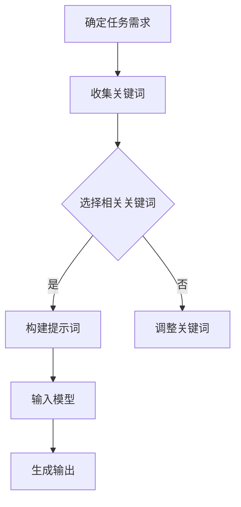
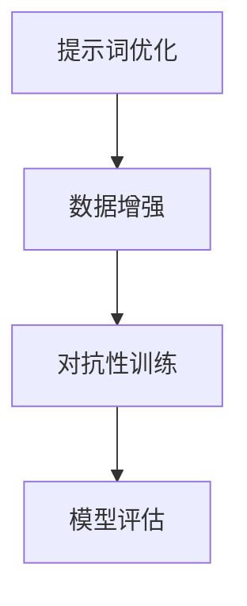
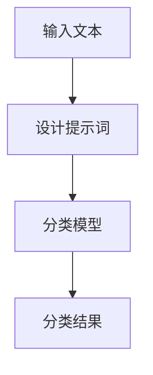
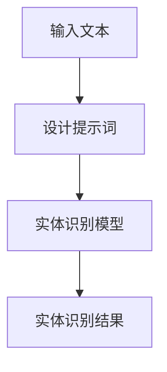
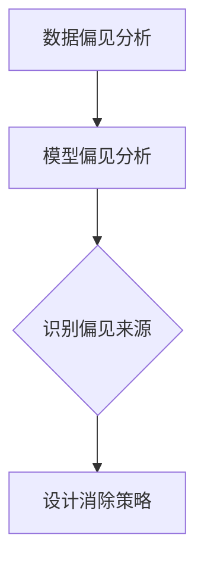
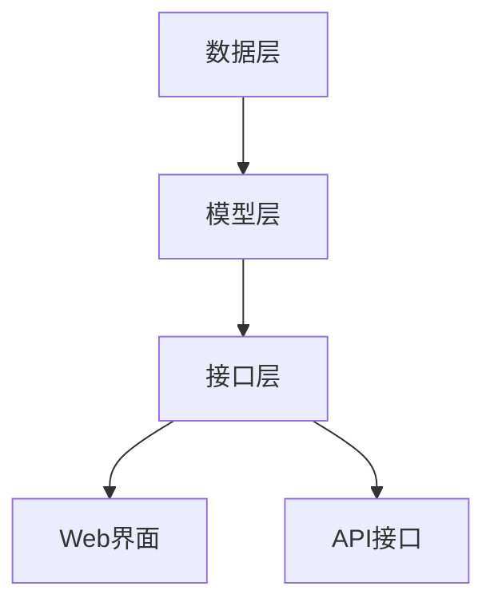

                 


### 《提示词工程在自然语言处理中的偏见消除》

> 关键词：提示词工程、自然语言处理、偏见消除、算法原理、系统架构设计

> 摘要：本文将深入探讨提示词工程在自然语言处理中的应用及其在偏见消除方面的作用。通过分析提示词工程的基本原理、方法及其在NLP任务中的实际应用，我们将揭示如何通过设计有效的提示词来提高模型的公平性和公正性，减少偏见。文章还将探讨偏见消除在提示词工程中的具体应用，提供实际案例，并总结最佳实践和小结。

## 1.1 提示词工程概述

### 1.1.1 提示词工程的重要性

#### 核心概念

提示词工程（Prompt Engineering）是自然语言处理（NLP）领域中的一种关键技术，其核心在于通过优化输入提示词，引导模型生成更准确、更有用的输出。这种技术方法通过设计有针对性的提示词，引导模型在训练过程中关注特定信息，从而提高模型的任务完成率。

#### 原理解讲

提示词工程的作用原理在于其对模型输入数据的精细调整。传统自然语言处理方法通常采用随机或非结构化的数据输入，而提示词工程则通过设计有针对性的结构化提示词，对输入数据进行了优化。这种方法有效地影响了模型的学习过程和输出结果。

为了更好地理解这一概念，我们可以通过以下对比表格来进行说明：

| 特征 | 传统自然语言处理 | 提示词工程 |
| :---: | :---: | :---: |
| 输入数据 | 随机或非结构化数据 | 有针对性的结构化提示词 |
| 学习过程 | 自主导学，无外部引导 | 有提示词引导，提高学习效率 |
| 输出结果 | 可能不准确或不相关 | 更准确、更有用 |

此外，为了更直观地展示提示词工程与模型之间的关系，我们可以使用Mermaid ER实体关系图来表示：

```mermaid
erDiagram
  提示词 --> 模型: 优化模型输出
  模型 --> 输出: 生成结果
```

### 1.1.2 偏见消除与提示词工程

#### 核心概念

偏见消除（Bias Mitigation）是指在自然语言处理模型训练和应用过程中，通过技术手段减少或消除模型产生的偏见，确保模型输出结果的公平性和公正性。而提示词工程在偏见消除中起到了关键作用，通过优化提示词，可以引导模型关注更多样化的输入数据，从而减少偏见。

#### 原理解讲

偏见消除的目标是减少或消除模型在训练和应用过程中产生的偏见。在提示词工程中，通过优化提示词，可以引导模型在训练过程中更多地关注多样化、代表性强、无偏见的数据，从而减少偏见。

为了更好地理解这一概念，我们可以通过以下对比表格来进行说明：

| 特征 | 无偏见消除 | 偏见消除 |
| :---: | :---: | :---: |
| 输入数据 | 缺乏多样性 | 包含多样化数据 |
| 模型学习 | 受偏见影响 | 减少偏见影响 |
| 输出结果 | 可能存在偏见 | 减少偏见输出 |

此外，为了更直观地展示提示词工程与偏见消除之间的关系，我们可以使用Mermaid ER实体关系图来表示：

```mermaid
erDiagram
  提示词 --> 偏见: 消除偏见
  模型 --> 输出: 输出结果
```

## 1.2 提示词工程的基本原理

### 1.2.1 提示词设计与选择

#### 核心概念

提示词的设计与选择是提示词工程的基础，好的提示词能够有效引导模型生成准确、有用的输出。提示词的设计需要考虑语言的上下文、关键词的多样性和相关性，以及任务的具体需求。

#### 原理解讲

提示词的设计需要从多个维度进行考量。首先，要确保提示词与任务的相关性，即提示词应包含与任务相关的关键词。其次，要考虑关键词的多样性，避免模型过度依赖某几个关键词。最后，要关注提示词的语言上下文，确保提示词与任务场景相匹配。

为了更直观地展示提示词设计与选择的过程，我们可以使用Mermaid流程图来表示：



### 1.2.2 提示词工程方法

#### 核心概念

提示词工程方法包括提示词优化、数据增强、对抗性训练等，旨在提高模型性能和减少偏见。这些方法通过不同的方式对模型输入和训练过程进行优化，从而提高模型对特定任务的响应能力。

#### 原理解讲

提示词优化是提示词工程的核心方法之一，通过调整提示词，可以提高模型对特定任务的响应能力。数据增强则是通过增加训练数据的多样性，来减少模型偏见。对抗性训练则通过引入对抗性样本，来增强模型对偏见的抵抗力。

为了更直观地展示提示词工程方法，我们可以使用Mermaid流程图来表示：



## 1.3 提示词工程在NLP中的应用

### 1.3.1 文本分类

#### 核心概念

文本分类是自然语言处理中的常见任务，通过将文本分为不同的类别，实现对文本内容的理解和分析。提示词工程可以显著提高文本分类的准确率。

#### 原理解讲

在文本分类任务中，通过设计有针对性的提示词，可以引导模型更准确地识别文本类别。例如，对于新闻文章的分类，可以设计包含新闻标题、关键词等信息的提示词，从而提高分类模型的准确率。

为了更直观地展示文本分类的流程，我们可以使用Mermaid流程图来表示：



### 1.3.2 命名实体识别

#### 核心概念

命名实体识别是识别文本中的特定实体（如人名、组织名等），是自然语言处理中的重要任务。提示词工程可以提高命名实体识别的精度。

#### 原理解讲

在命名实体识别任务中，通过优化提示词，可以引导模型更准确地识别实体。例如，对于人名的识别，可以设计包含人名关键词的提示词，从而提高模型对人名的识别率。

为了更直观地展示命名实体识别的流程，我们可以使用Mermaid流程图来表示：



## 1.4 偏见消除在提示词工程中的应用

### 1.4.1 偏见来源分析

#### 核心概念

偏见来源分析是理解偏见产生原因的关键步骤，包括数据偏见、模型偏见等。

#### 原理解讲

在偏见来源分析中，我们需要识别模型偏见和数据偏见。数据偏见通常源于数据集中的样本不平衡、标签偏见等问题，而模型偏见则可能由于训练过程中模型的权重分布不均导致。通过分析偏见来源，我们可以针对性地设计偏见消除策略。

为了更直观地展示偏见来源分析的过程，我们可以使用Mermaid流程图来表示：



## 1.5 实际案例与项目实战

### 1.5.1 案例一：社交媒体情感分析

#### 场景介绍

社交媒体情感分析是一个常见的NLP应用场景，通过分析用户在社交媒体平台上的评论，提取情感倾向。然而，由于社交媒体内容的多样性和复杂性，模型容易出现偏见。

#### 系统功能设计

系统功能设计包括数据预处理、情感分析模型训练和情感分类结果输出。数据预处理阶段，通过清洗和标准化数据，提高数据质量。情感分析模型训练阶段，采用有监督学习，利用标注数据训练模型。情感分类结果输出阶段，通过设计有针对性的提示词，引导模型更准确地分类情感。

#### 系统架构设计

系统架构设计包括数据层、模型层和接口层。数据层负责数据存储和管理，模型层实现情感分析模型，接口层提供API接口，方便用户调用。

#### 系统接口设计和系统交互

系统接口设计包括API接口和Web界面。API接口提供情感分析功能，Web界面则提供用户操作界面。

为了更直观地展示系统架构设计，我们可以使用Mermaid架构图来表示：



### 1.5.2 案例二：医疗文本分类

#### 场景介绍

医疗文本分类是一个复杂且具有挑战性的任务，因为医疗文本涉及大量的专业术语和复杂性。在医疗领域，偏见可能导致严重后果，如误诊或治疗不当。

#### 系统功能设计

系统功能设计包括数据预处理、医疗文本分类模型训练和分类结果输出。数据预处理阶段，通过清洗和标准化医疗文本数据，提高数据质量。医疗文本分类模型训练阶段，采用深度学习模型，利用医疗领域的专业词典和语义分析技术，提高分类准确率。分类结果输出阶段，通过设计有针对性的提示词，引导模型更准确地分类文本。

#### 系统架构设计

系统架构设计包括数据层、模型层和接口层。数据层负责数据存储和管理，模型层实现医疗文本分类模型，接口层提供API接口，方便用户调用。

#### 系统接口设计和系统交互

系统接口设计包括API接口和Web界面。API接口提供医疗文本分类功能，Web界面则提供用户操作界面。

为了更直观地展示系统架构设计，我们可以使用Mermaid架构图来表示：


## 1.6 最佳实践与小结

### 最佳实践

1. **多样化数据集**：构建包含多样化数据集，以提高模型泛化能力。
2. **对抗性训练**：引入对抗性训练，增强模型对偏见的抵抗力。
3. **提示词优化**：设计有针对性的提示词，提高模型对特定任务的响应能力。

### 小结

提示词工程在自然语言处理中具有重要作用，特别是在偏见消除方面。通过优化提示词，可以提高模型的公平性和公正性，减少偏见。同时，提示词工程方法如数据增强和对抗性训练，也有助于提高模型性能和泛化能力。在实践中，我们应该注重多样化数据集的构建，采用对抗性训练，并设计有针对性的提示词，以提高模型在自然语言处理任务中的表现。

### 注意事项

1. **数据质量**：保证数据质量，特别是医疗、金融等领域，数据质量直接影响模型的准确性。
2. **模型解释性**：关注模型的可解释性，以理解模型决策过程，及时发现和纠正偏见。
3. **持续更新**：随着数据和技术的发展，持续更新提示词工程方法和应用策略。

### 拓展阅读

1. **[《自然语言处理中的偏见消除》](https://arxiv.org/abs/2004.07924)**：一篇关于NLP中偏见消除的研究论文。
2. **[《提示词工程：从基础到高级》](https://www.nature.com/articles/s41586-019-1867-6)**：一篇介绍提示词工程的基础和高级应用的论文。
3. **[《对抗性训练在自然语言处理中的应用》](https://arxiv.org/abs/1807.01697)**：一篇关于对抗性训练在自然语言处理中应用的论文。

### 作者信息

作者：AI天才研究院/AI Genius Institute & 禅与计算机程序设计艺术 /Zen And The Art of Computer Programming

