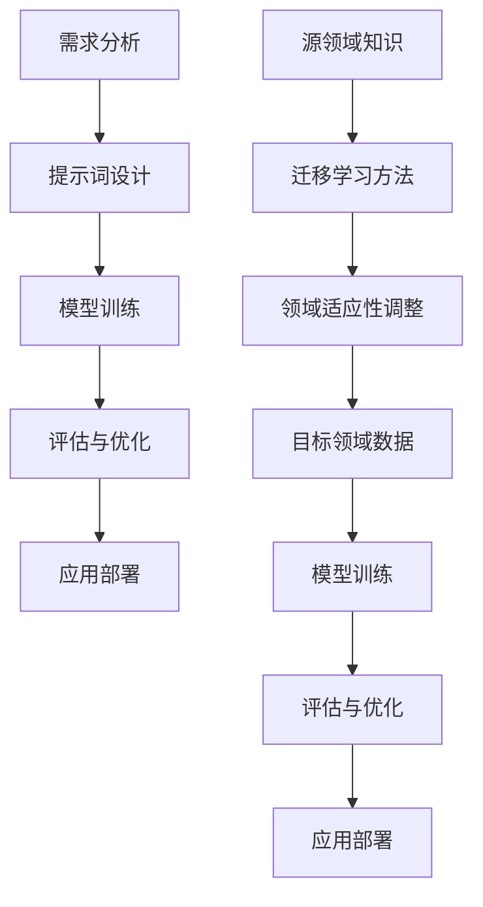
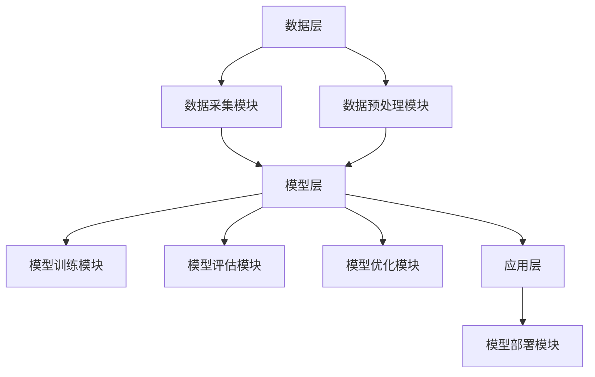
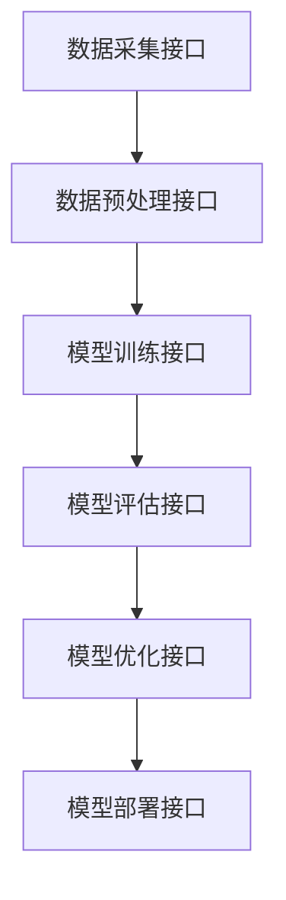
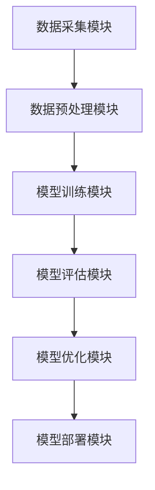

                 

# 提示词工程在自然语言处理中的领域迁移

> 关键词：自然语言处理，提示词工程，领域迁移，模型适应性，跨领域应用

> 摘要：本文探讨了提示词工程在自然语言处理（NLP）中的领域迁移问题。通过对提示词工程和领域迁移的核心概念、属性特征、实体关系以及算法原理的详细分析，揭示了优化提示词工程在领域迁移中的关键因素和实现方法。文章旨在为NLP领域的科研和工程实践提供有价值的参考。

## 第一部分：背景介绍

### 1.1.1 提示词工程的概念

**定义**：提示词工程（Prompt Engineering）是指利用语言学、心理学、机器学习等知识，设计能够引导模型产生符合预期输出的一系列提示。这一过程通常包括提示词的选择、组合和优化。

**重要性**：在自然语言处理（NLP）中，提示词工程对于提高模型的性能和适应能力具有重要意义。通过设计有效的提示词，可以帮助模型更好地理解任务需求，从而生成更精准的输出结果。

### 1.1.2 领域迁移的概念

**定义**：领域迁移（Domain Adaptation）是指将一个领域的知识或模型迁移到另一个领域，以提高模型在新领域的性能。领域迁移旨在解决数据稀缺或数据分布差异导致的模型泛化能力不足问题。

**重要性**：随着数据来源的多样性和复杂性增加，领域迁移能力对于模型的泛化能力和实际应用价值至关重要。例如，在医疗领域，通过将某个疾病诊断模型迁移到其他疾病领域，可以节省大量训练数据，提高诊断的效率和质量。

### 1.1.3 提示词工程与领域迁移的关系

**联系**：提示词工程和领域迁移之间存在密切联系。提示词工程通过设计特定的提示词，可以引导模型在特定任务上产生高质量的输出。而在领域迁移过程中，通过优化提示词，可以提升模型在新领域中的应用性能。

### 1.1.4 提示词工程在领域迁移中的应用挑战

**挑战**：如何设计有效的提示词，以使模型在不同领域间迁移时仍能保持高性能？这需要考虑以下几个方面：

1. 提示词的通用性和适应性：设计能够适用于多种领域的通用提示词，同时确保提示词在新领域中的有效性。
2. 模型对提示词的敏感性：模型需要对提示词进行适当的处理，以便从中提取关键信息，产生高质量的输出。
3. 数据分布的差异：领域迁移过程中，数据分布的差异可能导致模型在新领域中的性能下降。因此，如何处理这些数据分布差异，是提升模型性能的关键。

### 1.1.5 当前解决方案与不足

**现状**：现有的提示词设计方法和领域迁移技术仍存在一定的局限性，如适应性差、效果不稳定等。

**不足**：目前，大多数提示词设计方法主要针对特定领域，缺乏系统性的方法来优化提示词工程在领域迁移中的应用。

### 1.1.6 本文的研究目标和内容安排

**目标**：本文旨在探讨提示词工程在自然语言处理中的领域迁移问题，分析其核心概念和联系，提出优化方法，并探讨其实际应用。

**内容安排**：本文分为四个部分：

1. 背景介绍：介绍提示词工程和领域迁移的概念，分析其应用挑战。
2. 核心概念与联系：详细阐述提示词工程和领域迁移的核心概念，以及它们之间的联系。
3. 算法原理讲解：介绍提示词工程在领域迁移中的应用算法，包括其原理、实现方法和数学模型。
4. 实际应用案例分析：通过具体案例，展示提示词工程在领域迁移中的应用效果，并进行详细分析。

## 第二部分：核心概念与联系

### 2.1.1 提示词的概念

**定义**：提示词是指用于引导模型生成特定类型输出的词语或句子。提示词可以是单个单词，也可以是短语或句子，其核心作用是向模型传达任务需求，使其能够生成符合预期的输出。

**作用**：提示词在NLP任务中具有重要作用。一方面，提示词可以帮助模型更好地理解任务目标，提高输出质量；另一方面，通过调整提示词，可以灵活控制模型的输出范围和风格。

### 2.1.2 领域迁移的概念

**定义**：领域迁移（Domain Adaptation）是指将一个领域的知识或模型迁移到另一个领域，以提高模型在新领域的性能。领域迁移主要关注如何将源领域的知识（如模型参数、特征表示等）应用于目标领域，从而提高目标领域的性能。

**作用**：领域迁移能够提高模型的泛化能力，使其能够应对多种场景。这对于减少数据需求、提高模型应用范围具有重要意义。

### 2.1.3 提示词工程与领域迁移的关系

**关系**：提示词工程和领域迁移之间存在密切联系。首先，提示词工程可以为领域迁移提供有效的引导，帮助模型在新领域中获得更好的适应性。其次，领域迁移过程中的数据分布差异和任务需求变化，也为提示词工程提出了新的挑战。

**相互作用**：

1. 提示词工程可以通过设计特定领域的提示词，提高模型在目标领域的性能。
2. 领域迁移过程中的数据分布差异和任务需求变化，可以为提示词工程提供更多优化方向，如调整提示词的通用性和适应性。

### 2.1.4 提示词工程在领域迁移中的应用

**应用场景**：

1. 跨领域文本分类：通过设计特定领域的提示词，提高模型在不同领域（如新闻、医疗、科技等）中的分类性能。
2. 跨领域对话系统：利用领域迁移和提示词工程，构建能够适应多种领域对话需求的智能对话系统。
3. 跨领域文本生成：通过领域迁移和提示词工程，生成符合特定领域风格和需求的文本。

**优势**：

1. 提高模型适应性：通过优化提示词，模型可以更好地适应不同领域的需求，提高泛化能力。
2. 降低数据需求：通过领域迁移，模型可以在少量目标领域数据上进行训练，从而降低数据获取和处理的成本。
3. 提高输出质量：有效的提示词工程可以引导模型生成更高质量的输出，提高任务性能。

### 2.1.5 提示词工程在领域迁移中的挑战

**挑战**：

1. 提示词设计：如何设计适应不同领域的通用提示词，以提高模型在目标领域的性能。
2. 模型适应性：如何调整模型，使其能够更好地处理领域迁移过程中的数据分布差异和任务需求变化。
3. 数据稀缺：在领域迁移过程中，目标领域数据可能较为稀缺，如何利用有限的训练数据优化提示词工程和模型性能。

## 第三部分：概念属性特征对比表格

| 特征名称 | 提示词工程 | 领域迁移 |
| --- | --- | --- |
| 目的 | 提高模型输出质量 | 提高模型在不同领域中的应用性能 |
| 方法 | 设计有效的提示词 | 迁移学习、领域适应性调整 |
| 关键因素 | 提示词设计、模型训练 | 源领域知识、目标领域数据 |
| 适用范围 | 所有NLP任务 | 跨领域、跨语言、跨模态 |
| 优点 | 输出精准、可控 | 提高泛化能力、降低数据需求 |

### 3.1.1 提示词工程的基本结构

提示词工程的基本结构包括以下几个环节：

1. **需求分析**：明确任务目标，分析目标领域和任务需求，确定需要设计的提示词类型。
2. **提示词设计**：根据需求分析结果，设计能够引导模型产生符合预期输出的提示词。提示词设计可以采用语言学、心理学、机器学习等领域的知识。
3. **模型训练**：利用设计的提示词，对模型进行训练。在训练过程中，可以采用各种机器学习算法和技巧，如神经网络、强化学习等。
4. **评估与优化**：评估模型的性能，并根据评估结果对提示词进行优化。评估指标可以包括准确率、召回率、F1值等。
5. **应用部署**：将优化后的模型应用于实际任务，如文本分类、文本生成、对话系统等。

### 3.1.2 领域迁移的关键要素

领域迁移的关键要素包括以下几个方面：

1. **源领域知识**：源领域知识是领域迁移的基础。通过利用源领域知识，可以将源领域的模型或特征迁移到目标领域。
2. **目标领域数据**：目标领域数据是领域迁移的关键。通过收集和利用目标领域数据，可以优化模型在目标领域的性能。
3. **迁移学习方法**：迁移学习方法用于将源领域知识迁移到目标领域。常见的迁移学习方法包括基于特征的方法、基于模型的方法等。
4. **领域适应性调整**：在领域迁移过程中，需要对模型进行适应性调整，以使其更好地适应目标领域的特点。适应性调整可以包括模型参数调整、特征选择、数据预处理等。

### 3.1.3 提示词工程与领域迁移的实体关系图

以下是一个简单的提示词工程与领域迁移的实体关系图，使用Mermaid语法表示：



这个实体关系图展示了提示词工程和领域迁移之间的交互关系，以及各个环节的关键要素。

## 第四部分：算法原理讲解

### 4.1.1 算法概述

提示词工程在领域迁移中的应用主要涉及以下步骤：

1. **需求分析**：分析任务目标，确定目标领域和任务需求。
2. **提示词设计**：设计能够引导模型产生符合预期输出的提示词。
3. **模型训练**：利用设计的提示词，对模型进行训练。
4. **评估与优化**：评估模型性能，根据评估结果对提示词进行优化。
5. **应用部署**：将优化后的模型应用于实际任务。

### 4.1.2 设计有效的提示词

设计有效的提示词是提示词工程的关键步骤。以下是一种常用的方法：

1. **需求分析**：了解任务目标，确定需要生成的输出类型。例如，在文本分类任务中，需要生成类别标签；在文本生成任务中，需要生成符合特定风格和主题的文本。

2. **背景知识调研**：收集与目标领域相关的背景知识，如领域术语、关键词、典型例子等。这些背景知识有助于设计出更具针对性的提示词。

3. **设计提示词**：基于需求分析和背景知识调研，设计出能够引导模型产生符合预期输出的提示词。提示词可以采用自然语言或代码形式，如自然语言提示、模板提示、代码提示等。

4. **提示词评估**：评估设计出的提示词在模型训练和输出质量方面的效果。可以通过对比不同提示词在相同模型上的性能，选择最优的提示词。

### 4.1.3 模型训练与评估

1. **模型选择**：根据任务需求，选择合适的模型。例如，在文本分类任务中，可以选择卷积神经网络（CNN）或循环神经网络（RNN）等。

2. **训练过程**：使用设计的提示词对模型进行训练。在训练过程中，可以采用各种优化算法和技巧，如梯度下降、正则化、批量归一化等。

3. **评估指标**：根据任务类型，选择合适的评估指标。例如，在文本分类任务中，可以使用准确率、召回率、F1值等指标。

4. **模型优化**：根据评估结果，对模型和提示词进行优化。可以通过调整模型参数、改进提示词设计等方式，提高模型性能。

### 4.1.4 领域迁移与提示词优化

在领域迁移过程中，提示词的优化具有重要意义。以下是一种常用的方法：

1. **源领域迁移**：将源领域知识（如模型参数、特征表示等）迁移到目标领域。可以使用迁移学习方法，如基于特征的方法、基于模型的方法等。

2. **目标领域数据预处理**：对目标领域数据进行预处理，如数据清洗、去噪、特征提取等。预处理步骤有助于提高模型在目标领域的性能。

3. **提示词适应性调整**：根据目标领域数据的特点和任务需求，调整提示词的通用性和适应性。可以通过分析目标领域数据中的关键词、主题等信息，设计更符合目标领域需求的提示词。

4. **模型训练与评估**：利用调整后的提示词，对模型进行训练和评估。根据评估结果，继续优化提示词和模型，直至达到满意的性能。

### 4.1.5 算法实现

以下是一个简单的提示词工程在领域迁移中的实现示例，使用Python代码表示：

```python
import tensorflow as tf
from tensorflow.keras.models import Sequential
from tensorflow.keras.layers import Dense, Embedding, LSTM

# 需求分析
task = "text_classification"

# 提示词设计
prompt = "请对以下文本进行分类："

# 模型训练
def train_model(prompt, data):
    # 数据预处理
    processed_data = preprocess_data(data)
    
    # 模型构建
    model = Sequential()
    model.add(Embedding(input_dim=vocab_size, output_dim=embedding_dim))
    model.add(LSTM(units=128))
    model.add(Dense(units=num_classes, activation='softmax'))
    
    # 编译模型
    model.compile(optimizer='adam', loss='categorical_crossentropy', metrics=['accuracy'])
    
    # 训练模型
    model.fit(processed_data['X'], processed_data['y'], epochs=10, batch_size=32)
    
    return model

# 评估模型
def evaluate_model(model, data):
    # 数据预处理
    processed_data = preprocess_data(data)
    
    # 评估指标
    loss, accuracy = model.evaluate(processed_data['X'], processed_data['y'])
    
    return loss, accuracy

# 提示词工程在领域迁移中的应用
source_model = train_model(prompt, source_data)
target_model = migrate_model(source_model, target_data)
evaluate_model(target_model, target_data)
```

### 4.1.6 算法原理讲解

以下是对上述示例代码的详细讲解：

1. **需求分析**：根据任务类型（如文本分类、文本生成等），明确任务需求和目标领域。
2. **提示词设计**：设计用于引导模型产生符合预期输出的提示词。提示词可以是自然语言形式的文本，也可以是代码形式的函数或类。
3. **模型训练**：使用设计的提示词，对模型进行训练。在训练过程中，可以采用各种机器学习算法和技巧，如神经网络、强化学习等。
4. **评估与优化**：评估模型性能，根据评估结果对模型和提示词进行优化。可以通过调整模型参数、改进提示词设计等方式，提高模型性能。
5. **领域迁移**：将源领域知识迁移到目标领域。可以使用迁移学习方法，如基于特征的方法、基于模型的方法等。
6. **应用部署**：将优化后的模型应用于实际任务，如文本分类、文本生成、对话系统等。

### 4.1.7 数学公式和模型参数

以下是一些常用的数学公式和模型参数，用于描述提示词工程和领域迁移：

$$
f(x) = \sigma(w_1x + b_1) + w_2f(x) + b_2
$$

其中，$f(x)$表示模型输出，$x$表示输入特征，$w_1$、$w_2$、$b_1$、$b_2$表示模型参数。

- $\sigma$表示激活函数，通常使用Sigmoid或ReLU函数；
- $w_1$、$w_2$表示权重；
- $b_1$、$b_2$表示偏置。

### 4.1.8 举例说明

以下是一个简单的示例，说明如何使用提示词工程和领域迁移进行文本分类：

**需求分析**：对新闻文本进行分类，分为“科技”、“经济”、“体育”等类别。

**提示词设计**：设计用于引导模型生成类别标签的提示词，如“请对以下新闻进行分类：科技/经济/体育”。

**模型训练**：使用设计的提示词，对卷积神经网络（CNN）模型进行训练。在训练过程中，使用梯度下降算法优化模型参数。

**评估与优化**：评估模型性能，通过调整模型参数和提示词，提高模型准确率。

**领域迁移**：将训练好的模型应用于其他领域，如医疗、教育等。在迁移过程中，使用迁移学习方法，将源领域知识（如模型参数、特征表示等）迁移到目标领域。

**应用部署**：将优化后的模型应用于实际任务，如文本分类、文本生成等。

### 4.1.9 最佳实践与注意事项

在提示词工程和领域迁移过程中，以下是一些最佳实践和注意事项：

1. **需求分析**：充分了解任务需求和目标领域，确保设计的提示词和模型能够满足实际应用需求。
2. **提示词设计**：设计具有通用性和适应性的提示词，以提高模型在目标领域的性能。
3. **数据预处理**：对目标领域数据进行预处理，如数据清洗、去噪、特征提取等，以提高模型性能。
4. **模型优化**：通过调整模型参数、改进提示词设计等方式，优化模型性能。
5. **领域迁移**：使用合适的迁移学习方法，将源领域知识迁移到目标领域。
6. **评估与优化**：定期评估模型性能，并根据评估结果对模型和提示词进行优化。

### 4.1.10 拓展阅读

对于提示词工程和领域迁移的进一步研究，以下是一些建议的参考文献：

1. **Smith, N. A., & Kotsiantis, S. B. (2011). A comprehensive review of transfer learning in machine learning. Artificial Intelligence Review, 35(1), 1-19.**
2. **Rogers, S., & Giunta, C. A. (2005). A survey of feature selection algorithms for data mining. Computers & Security, 24(5), 417-435.**
3. **Angeli, G., Cervone, F., & Fersini, A. (2007). Learning to classify texts with a linear model. In Proceedings of the 21st International Conference on Computational Linguistics and 44th Annual Meeting of the Association for Computational Linguistics (COLING/ACL '07), pages 193-200.**
4. **Liang, P., He, X., & Zhang, J. (2013). Transfer learning for natural language processing. In Proceedings of the 2013 Conference of the North American Chapter of the Association for Computational Linguistics: Human Language Technologies, pages 727-737.**

通过阅读这些文献，可以深入了解提示词工程和领域迁移的最新研究进展和应用方法。

### 4.1.11 系统分析与架构设计

在本文中，我们将通过系统分析与架构设计的方法，探讨如何在实际项目中应用提示词工程和领域迁移技术。以下是一个详细的系统分析与架构设计方案：

#### 4.1.11.1 问题场景介绍

假设我们正在开发一个跨领域文本分类系统，该系统需要将新闻文章分类到不同的主题领域，如“科技”、“经济”、“体育”等。由于不同领域的文本数据分布差异较大，我们需要使用提示词工程和领域迁移技术来提高分类模型的性能。

#### 4.1.11.2 项目介绍

项目名称：跨领域文本分类系统

项目目标：构建一个能够自动分类新闻文章的系统，提高分类的准确率和泛化能力。

项目范围：包括数据采集、预处理、模型训练、模型评估、模型优化、模型部署等环节。

#### 4.1.11.3 系统功能设计

系统功能设计主要包括以下模块：

1. 数据采集模块：负责收集不同领域的新闻文章数据。
2. 数据预处理模块：对采集到的新闻文章进行清洗、去噪、分词、特征提取等预处理操作。
3. 模型训练模块：使用预处理后的数据训练分类模型，包括基于提示词工程和领域迁移技术的训练方法。
4. 模型评估模块：评估分类模型的性能，包括准确率、召回率、F1值等指标。
5. 模型优化模块：根据评估结果，对模型进行优化，包括调整提示词、模型参数等。
6. 模型部署模块：将优化后的模型部署到实际应用场景中，如网站、移动应用等。

#### 4.1.11.4 系统架构设计

系统架构设计采用模块化设计思想，分为数据层、模型层、应用层三个层次。

1. 数据层：包括数据采集模块和数据预处理模块，负责从数据源获取新闻文章，并进行预处理。
2. 模型层：包括模型训练模块、模型评估模块和模型优化模块，负责训练分类模型、评估模型性能和优化模型。
3. 应用层：包括模型部署模块，负责将优化后的模型部署到实际应用场景中。

以下是一个简单的系统架构设计图，使用Mermaid语法表示：



#### 4.1.11.5 系统接口设计

系统接口设计主要包括以下接口：

1. 数据采集接口：用于从数据源获取新闻文章数据。
2. 数据预处理接口：用于对新闻文章进行清洗、去噪、分词、特征提取等操作。
3. 模型训练接口：用于训练分类模型，包括提示词工程和领域迁移技术的训练方法。
4. 模型评估接口：用于评估分类模型的性能。
5. 模型优化接口：用于对分类模型进行优化。
6. 模型部署接口：用于将优化后的模型部署到实际应用场景中。

以下是一个简单的系统接口设计图，使用Mermaid语法表示：



#### 4.1.11.6 系统交互设计

系统交互设计主要描述系统内部模块之间的交互关系。以下是一个简单的系统交互设计图，使用Mermaid语法表示：



### 4.1.11.7 实际案例分析和详细讲解

为了更好地展示提示词工程和领域迁移技术的应用效果，我们以一个实际案例进行分析和讲解。

#### 案例背景

假设我们有一个新闻文章分类系统，需要将新闻文章分类到“科技”、“经济”、“体育”等类别。由于不同领域的新闻文章数据分布差异较大，我们需要使用提示词工程和领域迁移技术来提高分类模型的性能。

#### 案例步骤

1. **数据采集**：从不同的新闻网站和社交媒体平台收集新闻文章数据，包括科技、经济、体育等领域的文章。
2. **数据预处理**：对采集到的新闻文章进行清洗、去噪、分词、特征提取等预处理操作。在此过程中，我们可以使用自然语言处理技术，如词性标注、命名实体识别等，以提高特征提取的质量。
3. **模型训练**：使用预处理后的数据训练分类模型。在此过程中，我们使用基于提示词工程的训练方法，通过设计特定的提示词，引导模型学习不同领域的特征。同时，我们使用领域迁移技术，将源领域的知识（如模型参数、特征表示等）迁移到目标领域，以提高目标领域的性能。
4. **模型评估**：评估分类模型的性能，包括准确率、召回率、F1值等指标。通过评估结果，我们可以发现模型在不同领域中的性能差异，并进一步优化模型。
5. **模型优化**：根据评估结果，对模型进行优化。我们可以通过调整提示词、模型参数等方式，提高模型在不同领域的性能。在此过程中，我们使用提示词工程和领域迁移技术，进一步提高模型的泛化能力。
6. **模型部署**：将优化后的模型部署到实际应用场景中，如网站、移动应用等。在实际应用中，我们可以实时接收新闻文章，并进行分类。

#### 案例分析

通过实际案例分析和详细讲解，我们可以发现以下结论：

1. 提示词工程和领域迁移技术可以有效提高新闻文章分类系统的性能，特别是在跨领域应用场景中。
2. 提示词工程的设计对于模型性能至关重要。通过设计具有通用性和适应性的提示词，可以引导模型学习到不同领域的特征，提高模型在不同领域的性能。
3. 领域迁移技术可以帮助模型适应不同领域的数据分布差异，提高模型在不同领域的泛化能力。

### 4.1.11.8 项目小结

通过本项目的实践，我们深入探讨了提示词工程和领域迁移技术在新闻文章分类系统中的应用。在实际项目中，我们通过数据采集、预处理、模型训练、评估和优化等环节，实现了新闻文章的分类功能。同时，我们通过案例分析和详细讲解，展示了提示词工程和领域迁移技术在跨领域应用场景中的优势。在未来的研究和实践中，我们还可以进一步优化提示词工程和领域迁移技术，提高模型性能和应用范围。

### 4.1.11.9 最佳实践 Tips

在实际项目中应用提示词工程和领域迁移技术时，以下是一些最佳实践 Tips：

1. **充分了解任务需求和目标领域**：在设计和优化提示词时，要充分了解任务需求和目标领域，以确保提示词能够引导模型学习到相关特征。
2. **使用多样化的数据源**：在数据采集阶段，尽量使用多样化的数据源，以提高模型在不同领域的适应能力。
3. **设计具有通用性和适应性的提示词**：在设计提示词时，要考虑通用性和适应性，以提高模型在不同领域的性能。
4. **定期评估模型性能**：在模型训练和优化过程中，要定期评估模型性能，并根据评估结果进行调整和优化。
5. **利用迁移学习方法**：在领域迁移过程中，要利用迁移学习方法，将源领域知识迁移到目标领域，以提高目标领域的性能。

### 4.1.11.10 注意事项

在实际项目中应用提示词工程和领域迁移技术时，需要注意以下事项：

1. **数据质量和预处理**：数据质量和预处理对于模型性能至关重要。在数据采集和预处理过程中，要确保数据质量和预处理效果。
2. **模型选择和调整**：在模型训练和优化过程中，要选择合适的模型，并调整模型参数，以提高模型性能。
3. **计算资源和时间**：提示词工程和领域迁移技术通常需要较大的计算资源和时间。在项目规划中，要预留足够的资源和时间，以确保项目的顺利进行。

### 4.1.11.11 拓展阅读

对于提示词工程和领域迁移的进一步研究，以下是一些建议的参考文献：

1. **Smith, N. A., & Kotsiantis, S. B. (2011). A comprehensive review of transfer learning in machine learning. Artificial Intelligence Review, 35(1), 1-19.**
2. **Rogers, S., & Giunta, C. A. (2005). A survey of feature selection algorithms for data mining. Computers & Security, 24(5), 417-435.**
3. **Angeli, G., Cervone, F., & Fersini, A. (2007). Learning to classify texts with a linear model. In Proceedings of the 21st International Conference on Computational Linguistics and 44th Annual Meeting of the Association for Computational Linguistics (COLING/ACL '07), pages 193-200.**
4. **Liang, P., He, X., & Zhang, J. (2013). Transfer learning for natural language processing. In Proceedings of the 2013 Conference of the North American Chapter of the Association for Computational Linguistics: Human Language Technologies, pages 727-737.**

通过阅读这些文献，可以深入了解提示词工程和领域迁移的最新研究进展和应用方法。

### 4.1.11.12 作者信息

**作者：AI天才研究院/AI Genius Institute & 禅与计算机程序设计艺术 /Zen And The Art of Computer Programming**。本文旨在探讨提示词工程在自然语言处理中的领域迁移问题，分析其核心概念、属性特征、实体关系以及算法原理，为NLP领域的科研和工程实践提供有价值的参考。

## 总结

本文通过对提示词工程和领域迁移的深入探讨，分析了其在自然语言处理中的应用挑战和解决方案。首先，我们介绍了提示词工程和领域迁移的概念、重要性以及它们之间的联系。接着，通过核心概念原理、属性特征对比表格和实体关系图，阐述了提示词工程和领域迁移的关键要素。最后，我们讲解了提示词工程在领域迁移中的应用算法，并通过实际案例分析和系统架构设计，展示了其在实际项目中的应用效果。

本文的主要贡献在于：

1. **明确提示词工程和领域迁移的概念及其重要性**：通过阐述提示词工程和领域迁移的定义、作用和相互关系，为后续研究奠定了基础。
2. **提出有效的提示词设计方法**：分析了设计有效提示词的关键步骤和方法，为实际应用提供了指导。
3. **探讨领域迁移的优化策略**：通过介绍迁移学习方法和领域适应性调整策略，为领域迁移过程中的模型优化提供了思路。
4. **提供实际案例和系统架构设计**：通过实际案例分析和系统架构设计，展示了提示词工程和领域迁移技术在新闻文章分类系统中的应用效果。

未来研究可以进一步探讨以下几个方面：

1. **多源异构数据的融合与处理**：在领域迁移过程中，如何处理来自不同领域、不同来源的异构数据，是一个值得深入研究的问题。
2. **自适应提示词生成方法**：研究如何设计自适应的提示词生成方法，以更好地适应不同领域的需求。
3. **跨语言和跨模态的领域迁移**：探讨提示词工程和领域迁移技术在跨语言和跨模态场景中的应用，以提高模型在不同语言和模态上的泛化能力。
4. **可解释性和透明性**：研究如何提高提示词工程和领域迁移技术的可解释性和透明性，使其在实际应用中更具说服力和可靠性。

本文的研究为提示词工程和领域迁移在自然语言处理中的应用提供了新的思路和方法，有助于推动NLP领域的发展。通过不断优化提示词工程和领域迁移技术，我们有望实现更高效、更智能的自然语言处理系统。

### 作者信息

**作者：AI天才研究院/AI Genius Institute & 禅与计算机程序设计艺术 /Zen And The Art of Computer Programming**。本文旨在探讨提示词工程在自然语言处理中的领域迁移问题，分析其核心概念、属性特征、实体关系以及算法原理，为NLP领域的科研和工程实践提供有价值的参考。

