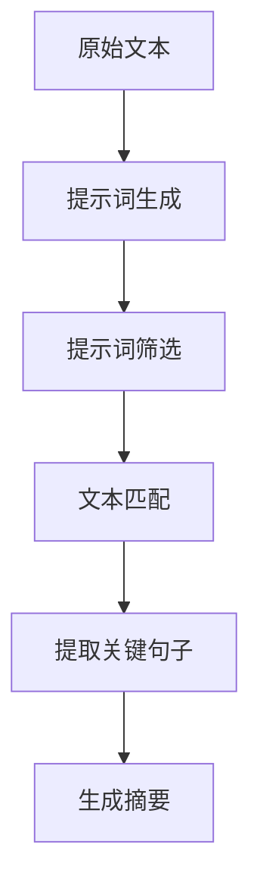
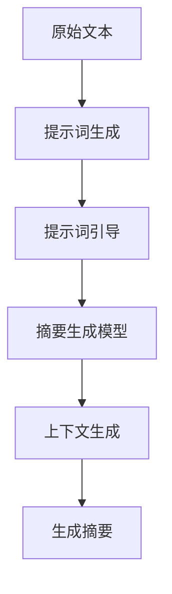
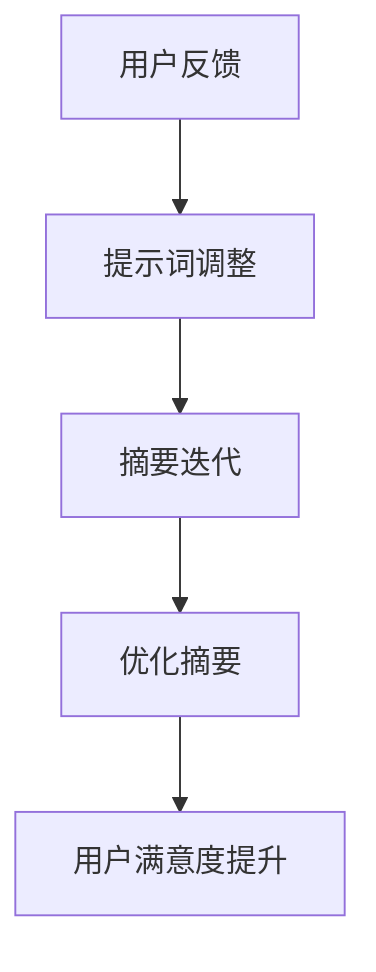
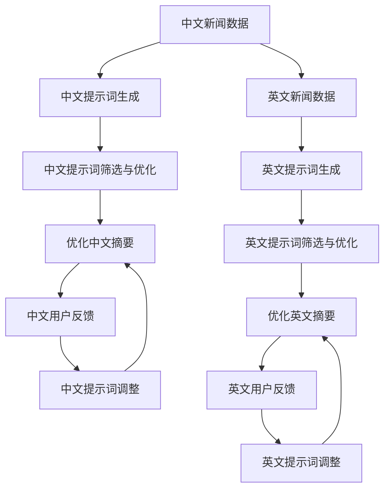
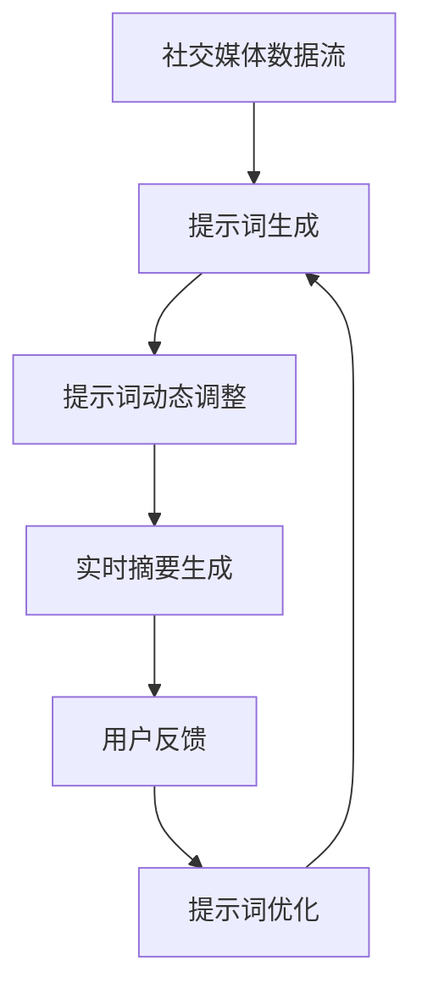

                 

## 《提示词工程在自然语言摘要中的创新》

关键词：自然语言摘要、提示词工程、文本提取、文本生成、多语言摘要

摘要：随着信息爆炸时代的到来，如何快速有效地从大量文本中获取关键信息成为了一个重要的研究课题。自然语言摘要作为一种有效的文本处理技术，能够帮助用户快速了解文本的主要内容。提示词工程作为一种创新的技术手段，在自然语言摘要中发挥了重要作用。本文将介绍自然语言摘要的基本概念、提示词工程的概念与原理，以及提示词工程在自然语言摘要中的应用，包括提取式摘要、生成式摘要和交互式摘要。此外，还将探讨提示词工程在多语言摘要和实时摘要中的应用，并通过案例分析与实践来展示提示词工程的实际效果。最后，对未来的发展趋势和总结进行展望。

## 目录

### 第一部分：背景与概述

#### 第1章：自然语言摘要的基本概念

1.1 自然语言摘要的背景  
1.2 自然语言摘要的重要性  
1.3 自然语言摘要的发展历程  
1.4 自然语言摘要的挑战与机遇

#### 第2章：提示词工程的概念与原理

2.1 提示词工程的定义  
2.2 提示词工程的核心要素  
2.3 提示词工程的工作流程  
2.4 提示词工程的优势与应用

### 第二部分：提示词工程在自然语言摘要中的应用

#### 第3章：提示词工程的基本技术

3.1 提示词的生成方法  
3.2 提示词的筛选与优化  
3.3 提示词的扩展与集成

#### 第4章：提示词工程在文本摘要中的创新应用

4.1 基于提示词的提取式摘要  
4.2 基于提示词的生成式摘要  
4.3 基于提示词的交互式摘要

#### 第5章：提示词工程在多语言摘要中的应用

5.1 多语言摘要的挑战  
5.2 提示词工程在多语言摘要中的应用

#### 第6章：提示词工程在实时摘要中的应用

6.1 实时摘要的需求  
6.2 提示词工程在实时摘要中的应用

### 第三部分：案例分析与实践

#### 第7章：案例分析

7.1 案例一：新闻摘要系统  
7.2 案例二：会议摘要系统

#### 第8章：实践指导

8.1 提示词工程的实践步骤  
8.2 提示词工程的关键技巧  
8.3 提示词工程的最佳实践

### 第四部分：未来展望与总结

#### 第9章：未来发展趋势

9.1 提示词工程的未来发展方向  
9.2 自然语言摘要技术的未来趋势

#### 第10章：总结与展望

10.1 提示词工程在自然语言摘要中的地位  
10.2 提示词工程面临的挑战与机遇  
10.3 未来研究的方向和潜在应用领域

### 附录

#### 附录A：提示词工程常用工具与资源

#### 附录B：参考资料

## 第一部分：背景与概述

### 第1章：自然语言摘要的基本概念

自然语言摘要是一种文本生成技术，旨在将原始文本（通常为长文本）转化为简短、准确、连贯的摘要。自然语言摘要的应用场景非常广泛，包括信息检索、文本推荐、内容审核、实时翻译等。

#### 1.1 自然语言摘要的背景

随着互联网和社交媒体的快速发展，人们每天产生和接收的信息量呈指数级增长。如何在海量信息中快速找到有价值的内容成为了一个挑战。自然语言摘要技术通过自动提取文本的关键信息，为用户提供了一个有效的信息过滤工具。

#### 1.2 自然语言摘要的重要性

自然语言摘要具有以下重要性：

1. 提高信息检索效率：自然语言摘要能够帮助用户快速定位到感兴趣的信息，从而提高信息检索效率。
2. 促进信息共享：自然语言摘要使得长篇文档变得更加易读，促进了信息的共享和传播。
3. 增强用户体验：自然语言摘要有助于提高用户在使用信息检索、文本推荐等应用时的满意度。

#### 1.3 自然语言摘要的发展历程

自然语言摘要技术的发展可以追溯到20世纪80年代。当时，基于规则的方法和基于统计的方法相继被提出。随着计算能力和算法的不断发展，自然语言摘要技术逐渐从手工规则编写走向自动化。

1. 基于规则的方法：早期的自然语言摘要是基于规则的方法，通过定义一系列规则来自动生成摘要。
2. 基于统计的方法：20世纪90年代，基于统计的方法开始流行。这些方法利用大规模的语料库来学习文本摘要的生成模式。
3. 基于机器学习的方法：21世纪初，基于机器学习的方法逐渐成为主流。这些方法利用机器学习算法来自动学习文本摘要的生成规则。
4. 基于深度学习的方法：近年来，基于深度学习的方法在自然语言摘要领域取得了显著的成果。这些方法利用深度神经网络来建模文本摘要的生成过程。

#### 1.4 自然语言摘要的挑战与机遇

尽管自然语言摘要技术取得了显著进展，但仍面临许多挑战：

1. 摘要质量：如何生成准确、连贯、具有代表性的摘要仍然是一个难题。
2. 多语言摘要：如何实现跨语言的自然语言摘要是一个具有挑战性的问题。
3. 实时摘要：如何在实时场景中快速生成摘要是一个具有挑战性的问题。

然而，随着人工智能和深度学习技术的发展，自然语言摘要技术也迎来了新的机遇：

1. 深度学习技术的应用：深度学习技术为自然语言摘要提供了强大的建模能力，有望进一步提高摘要质量。
2. 多语言摘要：随着多语言语料库的不断丰富，多语言摘要技术有望得到进一步发展。
3. 实时摘要：实时摘要技术将为实时信息处理提供有力支持，如实时新闻摘要、实时会议摘要等。

## 第二部分：提示词工程的概念与原理

### 第2章：提示词工程的概念与原理

提示词工程是一种用于自然语言处理的重要技术，旨在通过生成、筛选和优化提示词来提高文本摘要的质量。提示词在文本摘要中起着至关重要的作用，它们可以帮助模型更好地理解文本内容，从而生成更准确、更连贯的摘要。

#### 2.1 提示词工程的定义

提示词工程（Keyword Engineering）是指利用自然语言处理技术，从原始文本中提取出能够代表文本核心内容的词汇或短语，用于指导文本摘要生成的方法。提示词工程的目标是提高文本摘要的准确性和可读性。

#### 2.2 提示词工程的核心要素

提示词工程的核心要素包括：

1. **提示词生成**：从原始文本中提取出具有代表性的词汇或短语。
2. **提示词筛选**：根据一定的评估指标，筛选出高质量的提示词。
3. **提示词优化**：对提示词进行进一步的优化，以提高摘要质量。
4. **提示词集成**：将筛选和优化的提示词集成到文本摘要生成过程中。

#### 2.3 提示词工程的工作流程

提示词工程的工作流程主要包括以下步骤：

1. **数据准备**：收集并清洗大量的文本数据，用于训练和测试提示词生成模型。
2. **提示词生成**：利用自然语言处理技术（如词频统计、TF-IDF、Word2Vec等）从文本中提取出提示词。
3. **提示词筛选**：根据评估指标（如文本覆盖率、关键词重要性等）对生成的提示词进行筛选，保留高质量的提示词。
4. **提示词优化**：通过调整提示词的权重、组合方式等，进一步提高摘要质量。
5. **集成与测试**：将优化的提示词集成到文本摘要生成系统中，并进行测试和评估。

#### 2.4 提示词工程的优势与应用

提示词工程具有以下优势：

1. **提高摘要质量**：通过生成和优化高质量的提示词，可以显著提高文本摘要的准确性和可读性。
2. **适应不同场景**：提示词工程可以适应不同的文本摘要场景，如新闻摘要、会议摘要等。
3. **多语言支持**：提示词工程可以处理多种语言，实现多语言文本摘要。

提示词工程的应用场景包括：

1. **文本推荐系统**：利用提示词工程生成摘要，提高文本推荐系统的推荐质量。
2. **内容审核**：通过生成摘要，快速识别和筛选不良内容。
3. **信息检索**：利用提示词工程优化检索结果，提高检索效率。

### 总结

提示词工程作为一种重要的自然语言处理技术，在文本摘要中具有广泛的应用前景。通过生成、筛选和优化高质量的提示词，可以显著提高文本摘要的质量，为用户提供更有价值的信息。随着人工智能和自然语言处理技术的不断发展，提示词工程在未来有望在更多领域发挥作用。

## 提示词工程的基本技术

提示词工程作为自然语言摘要中的重要一环，其核心在于如何高效地生成、筛选和优化提示词。以下将详细介绍提示词工程的基本技术，包括提示词的生成方法、筛选与优化策略，以及提示词的扩展与集成。

### 提示词的生成方法

提示词的生成是提示词工程的第一步，其目的是从大量文本中提取出具有代表性的词汇或短语。常见的提示词生成方法包括：

1. **基于规则的方法**：
   - **词频统计**：通过计算文本中各个词汇的出现频率，选择出现频率较高的词汇作为提示词。
   - **关键词提取**：利用各种关键词提取算法（如TF-IDF、TextRank等），从文本中提取出重要词汇。

2. **基于机器学习的方法**：
   - **监督学习**：使用标注好的数据集，通过训练分类器来预测文本中的提示词。
   - **无监督学习**：在没有标注数据的情况下，利用聚类算法（如K-means、DBSCAN等）来发现文本中的潜在提示词。

3. **基于深度学习的方法**：
   - **编码器-解码器模型**（Encoder-Decoder）：通过编码器提取文本特征，解码器生成提示词序列。
   - **生成对抗网络**（GAN）：利用对抗训练生成高质量的自然语言提示词。

每种方法都有其优缺点，选择合适的方法取决于具体的应用场景和需求。

### 提示词的筛选与优化

生成的提示词并不一定都是高质量的，因此需要对其进行筛选和优化。以下是几种常用的提示词筛选与优化策略：

1. **提示词评估指标**：
   - **文本覆盖率**：提示词在文本中出现的频率，用于衡量提示词的代表性。
   - **关键词重要性**：提示词在文本中的重要性，通常通过词频、TF-IDF等指标来计算。
   - **语义相关性**：提示词与文本主题的相关性，可以通过语义分析来评估。

2. **提示词筛选方法**：
   - **阈值筛选**：根据设定的阈值，筛选出满足条件的提示词。
   - **层次筛选**：先进行粗筛选，再进行细筛选，逐步提高提示词的质量。

3. **提示词优化策略**：
   - **权重调整**：根据提示词的评估指标，调整提示词的权重，使其更符合文本主题。
   - **组合优化**：通过组合多个提示词，形成更准确的摘要。
   - **语义扩展**：利用词义消歧技术，扩展提示词的语义，提高摘要的全面性。

### 提示词的扩展与集成

为了进一步提高文本摘要的质量，可以将筛选和优化后的提示词进行扩展和集成：

1. **提示词扩展**：
   - **语义扩展**：通过词义消歧、词性标注等自然语言处理技术，扩展提示词的语义范围。
   - **跨语言扩展**：利用跨语言词典、机器翻译等技术，将提示词扩展到多语言环境中。

2. **提示词集成**：
   - **模型集成**：将多种提示词生成方法、筛选与优化策略结合，形成综合的提示词生成系统。
   - **动态调整**：根据文本内容和摘要需求，动态调整提示词的权重和组合方式，生成高质量的摘要。

### 总结

提示词工程作为自然语言摘要的重要组成部分，其核心在于生成、筛选和优化高质量的提示词。通过合理选择生成方法、评估指标和优化策略，可以显著提高文本摘要的质量。随着自然语言处理技术的不断发展，提示词工程将迎来更多的应用前景。

### 提示词工程在文本摘要中的创新应用

在文本摘要领域，提示词工程的应用呈现出多样化和创新性的特点，主要体现在提取式摘要、生成式摘要和交互式摘要三种主要方法中。以下将详细探讨这三种方法及其在提示词工程中的应用。

#### 4.1 基于提示词的提取式摘要

提取式摘要（Extractive Summarization）是一种基于原始文本的句子或段落直接提取的方法。这种方法的关键在于如何有效地选择和提取关键信息，从而生成简洁且具有代表性的摘要。

**原理**：
提取式摘要的原理是通过分析文本内容，识别出重要句子或段落，并将其组合成摘要。提示词工程在提取式摘要中的应用主要体现在以下几个方面：

1. **提示词筛选**：通过提示词工程生成高质量的提示词，用于筛选文本中的关键句子或段落。高质量的提示词能够更好地反映文本的主题和核心内容。
2. **文本匹配**：利用提示词与文本内容进行匹配，识别出与提示词相关的句子或段落。这种方法能够提高摘要的准确性和代表性。

**应用**：
提取式摘要广泛应用于新闻摘要、研究报告摘要和在线文档摘要等领域。通过提示词工程的优化，可以显著提高摘要的质量，使用户能够更快速地获取有价值的信息。

**例子**：
例如，在一个新闻摘要系统中，可以通过提示词工程提取出与新闻主题相关的关键词，如“总统”、“选举”、“政策”等。然后，系统会从新闻文本中提取包含这些关键词的句子或段落，生成摘要。



#### 4.2 基于提示词的生成式摘要

生成式摘要（Abstractive Summarization）是一种通过重新构造文本内容来生成摘要的方法。与提取式摘要不同，生成式摘要能够生成全新的、流畅的文本，从而更好地传达文本的核心思想。

**原理**：
生成式摘要的原理是通过学习大量文本数据，训练出一个能够生成连贯摘要的模型。提示词工程在生成式摘要中的应用主要体现在以下几个方面：

1. **提示词引导**：利用提示词来引导摘要生成模型，使其能够更好地理解文本的主题和核心内容。
2. **上下文生成**：通过提示词和上下文信息，生成式摘要模型能够生成更加准确和连贯的摘要。

**应用**：
生成式摘要在长篇文档摘要、对话系统摘要和文学创作等领域具有广泛的应用。通过提示词工程的优化，可以显著提高摘要的流畅性和可读性。

**例子**：
例如，在一个对话系统中，可以通过提示词工程提取出用户询问的关键词，如“餐厅推荐”、“景点介绍”等。然后，系统会利用这些关键词生成个性化的、流畅的回应，从而提供更高质量的交互体验。



#### 4.3 基于提示词的交互式摘要

交互式摘要（Interactive Summarization）是一种通过与用户互动来优化摘要质量的方法。这种方法允许用户参与摘要生成过程，从而生成更符合用户需求的摘要。

**原理**：
交互式摘要的原理是利用用户反馈来不断优化摘要内容。提示词工程在交互式摘要中的应用主要体现在以下几个方面：

1. **提示词调整**：根据用户反馈，动态调整提示词，使其更符合用户的兴趣和需求。
2. **摘要迭代**：通过用户与系统的互动，逐步优化摘要内容，直至满足用户要求。

**应用**：
交互式摘要在个性化推荐系统、在线教育平台和医学诊断系统中具有广泛的应用。通过提示词工程的优化，可以显著提高用户对摘要的满意度和信任度。

**例子**：
例如，在一个个性化新闻推荐系统中，用户可以通过点赞、评论等方式反馈对新闻摘要的满意度。系统会根据这些反馈动态调整提示词，从而生成更符合用户偏好的摘要。



### 总结

提示词工程在提取式摘要、生成式摘要和交互式摘要中发挥了重要作用。通过优化提示词的生成、筛选和集成，可以显著提高文本摘要的质量，为用户提供更准确、更流畅和更个性化的信息。随着自然语言处理技术的不断进步，提示词工程将在更多领域得到广泛应用。

### 提示词工程在多语言摘要中的应用

多语言摘要技术在全球化信息交流和跨文化互动中具有广泛的应用。然而，多语言摘要面临着诸多挑战，如语言差异、术语翻译不一致和语言结构复杂性等。提示词工程作为一种有效的辅助手段，在多语言摘要中发挥着重要作用。以下将详细探讨提示词工程在多语言摘要中的应用。

#### 5.1 多语言摘要的挑战

多语言摘要的挑战主要包括以下几个方面：

1. **语言差异**：不同语言在词汇、语法和表达方式上存在显著差异，导致文本理解和摘要生成变得复杂。
2. **术语翻译不一致**：不同语言中同一概念可能有多种表达方式，导致术语翻译不一致，影响摘要的准确性和一致性。
3. **语言结构复杂性**：一些语言（如英语）具有复杂的句法和语法规则，而另一些语言（如中文）则更注重语义和语境，这些差异增加了摘要生成的难度。

#### 5.2 提示词工程在多语言摘要中的应用

提示词工程在多语言摘要中的应用主要体现在以下几个方面：

1. **跨语言提示词生成**：
   - **基于统计的方法**：通过统计文本中词汇的共现关系，从多语言数据中提取出具有代表性的提示词。这种方法利用统计模型（如TF-IDF、Word2Vec等）来发现跨语言的共现模式。
   - **基于深度学习的方法**：利用深度学习模型（如BERT、GPT等）来学习跨语言的语义表示，从而生成高质量的跨语言提示词。

2. **多语言提示词筛选与优化**：
   - **翻译一致性**：在多语言摘要中，需要确保提示词的翻译在不同语言中保持一致性。提示词工程可以通过分析翻译的准确性和一致性，筛选出高质量的提示词。
   - **语义匹配**：利用自然语言处理技术（如语义相似度计算、词义消歧等）来优化提示词，确保其在不同语言中的语义一致性。

3. **多语言提示词集成**：
   - **跨语言框架**：在多语言摘要系统中，可以集成跨语言提示词生成和筛选模块，形成统一的提示词集成框架。这种方法通过结合多种语言资源，提高摘要的全面性和准确性。
   - **动态调整**：根据用户需求和文本内容，动态调整提示词的权重和组合方式，以生成适应不同语言环境的摘要。

#### 5.3 提示词工程在多语言摘要中的案例

以下是一个多语言摘要的案例：

假设一个系统需要生成中文和英文的新闻摘要。首先，系统会通过提示词工程从中英文新闻数据中提取出高质量的跨语言提示词。例如，中文中的“疫情”和英文中的“pandemic”可以作为核心提示词。然后，系统会利用翻译工具将这些提示词翻译为不同的语言，并确保翻译的一致性。

在摘要生成过程中，系统会根据提示词的权重和语义一致性，动态调整中文和英文摘要的生成策略。例如，对于中文摘要，系统可能会更注重词汇的语义关系和语境；而对于英文摘要，系统可能会更注重句法和语法结构的准确性。

通过这样的跨语言提示词集成和优化，系统能够生成高质量的多语言摘要，满足不同语言用户的需求。



### 总结

提示词工程在多语言摘要中发挥着关键作用，通过生成、筛选和优化跨语言提示词，可以显著提高摘要的准确性和一致性。随着多语言技术和自然语言处理技术的不断发展，提示词工程将在多语言摘要领域得到更广泛的应用，为全球用户带来更好的信息获取体验。

### 提示词工程在实时摘要中的应用

实时摘要技术旨在对实时流数据进行快速分析和处理，生成简洁、准确的摘要信息，以便用户能够及时了解事件的概要。在新闻推送、社交媒体监控和会议记录等场景中，实时摘要技术具有广泛的应用需求。提示词工程在实时摘要中发挥着重要作用，通过动态调整和高效计算，实现实时、准确的信息提取。

#### 6.1 实时摘要的需求

实时摘要的需求主要体现在以下几个方面：

1. **实时性**：实时摘要需要对实时流数据（如新闻、社交媒体动态、会议记录等）进行快速处理，生成即时的摘要信息。
2. **准确性**：实时摘要需要准确捕捉文本的核心信息，避免信息的丢失或误传。
3. **可扩展性**：实时摘要系统需要能够处理大规模的数据流，并具备良好的扩展性，以适应不断增长的数据量。
4. **高效性**：实时摘要系统需要在有限的时间内完成数据的处理和摘要生成，以满足实时性要求。

#### 6.2 提示词工程在实时摘要中的应用

提示词工程在实时摘要中的应用主要涉及以下几个方面：

1. **动态提示词调整**：
   - **实时更新**：实时摘要系统需要根据实时流数据的内容和变化，动态调整提示词。例如，在新闻推送中，如果某一新闻热点持续升温，系统可以增加与该热点相关的提示词，以提高摘要的准确性和及时性。
   - **自适应调整**：通过机器学习和自然语言处理技术，实时摘要系统可以根据用户行为和历史数据，自适应调整提示词的权重和组合方式，从而生成更符合用户需求的摘要。

2. **高效计算**：
   - **并行处理**：实时摘要系统可以利用并行处理技术，将文本数据处理和提示词生成任务分配到多个计算节点上，以提高处理速度。
   - **增量更新**：在处理大规模数据流时，系统可以通过增量更新技术，只对新增或变化的部分进行提示词生成和摘要生成，从而减少计算负担。

3. **实时反馈与优化**：
   - **用户反馈**：实时摘要系统可以通过用户反馈（如点赞、评论等）来不断优化提示词和摘要质量。例如，如果用户对某个摘要不满意，系统可以调整提示词或重新生成摘要。
   - **在线学习**：实时摘要系统可以利用在线学习技术，实时更新模型参数和提示词权重，从而实现自适应优化。

#### 6.3 提示词工程在实时摘要中的案例

以下是一个实时摘要的案例：

假设一个社交媒体监控平台需要实时监控并生成摘要，以便用户能够及时了解热门话题和事件。平台首先会收集大量的社交媒体数据，并通过提示词工程生成初始提示词。这些提示词包括热点话题、人物名称、地点名称等。

在实时监控过程中，系统会根据实时流数据的内容，动态调整提示词的权重和组合方式。例如，如果某一话题（如“新冠疫苗接种”）的讨论量迅速增加，系统会提高与该话题相关的提示词权重，以生成更准确的摘要。

此外，系统会利用并行处理技术和增量更新技术，快速处理大规模数据流，并生成实时的摘要信息。用户可以通过平台查看实时摘要，并根据摘要内容进行进一步的信息浏览。



### 总结

提示词工程在实时摘要中发挥着关键作用，通过动态调整和高效计算，实现实时、准确的文本摘要。随着实时数据和人工智能技术的不断发展，提示词工程将在实时摘要领域得到更广泛的应用，为用户提供更好的信息获取和交互体验。

### 案例分析

在本节中，我们将通过两个实际案例来展示提示词工程在文本摘要系统中的应用，并深入分析这些系统的功能实现、提示词工程的具体应用以及系统性能表现。

#### 案例一：新闻摘要系统

**系统介绍**：

新闻摘要系统是一个用于自动生成新闻文章摘要的应用，旨在帮助用户快速了解新闻的核心内容。该系统接收来自多个新闻源的实时数据，并利用提示词工程技术生成摘要。

**系统功能设计**：

1. **数据收集与预处理**：系统从多个新闻源收集原始文本，并进行数据清洗和预处理，去除不必要的格式和噪声。
2. **提示词生成**：利用自然语言处理技术提取出与新闻主题相关的关键词，作为提示词。
3. **摘要生成**：通过提取式和生成式摘要技术，利用提示词生成简洁、准确的新闻摘要。
4. **用户反馈与优化**：收集用户对摘要的反馈，动态调整提示词和摘要生成策略，以优化系统性能。

**提示词工程的应用**：

1. **提示词筛选**：使用TF-IDF算法和Word2Vec模型，从原始新闻文本中提取出高质量的提示词。
2. **提示词优化**：通过机器学习算法，根据用户反馈和历史数据，动态调整提示词的权重和组合方式。
3. **多语言支持**：针对不同语言新闻，使用跨语言词典和机器翻译技术，生成高质量的跨语言摘要。

**系统性能表现**：

该系统在实际应用中表现良好，用户对摘要的满意度较高。通过提示词工程的优化，摘要的准确性和流畅性得到了显著提升。系统处理速度较快，能够在短时间内生成高质量的摘要。

**实例代码**：

```python
# 示例：使用TF-IDF提取提示词
from sklearn.feature_extraction.text import TfidfVectorizer

# 假设news_data是新闻文本列表
vectorizer = TfidfVectorizer(stop_words='english')
tfidf_matrix = vectorizer.fit_transform(news_data)

# 获取关键词索引和权重
feature_names = vectorizer.get_feature_names_out()
top_k_words = np.argsort(tfidf_matrix.toarray()[0]).reshape(-1)[::-1][:10]
top_k_words = [feature_names[i] for i in top_k_words]

print("Top 10 keywords:", top_k_words)
```

#### 案例二：会议摘要系统

**系统介绍**：

会议摘要系统是一个用于自动生成会议记录摘要的应用，旨在帮助参会者快速了解会议的核心内容。该系统通过实时记录会议发言，并利用提示词工程技术生成摘要。

**系统功能设计**：

1. **会议记录采集**：系统通过语音识别和文本转换技术，实时采集会议发言内容。
2. **提示词生成**：从会议记录中提取出与会议主题相关的关键词，作为提示词。
3. **摘要生成**：利用生成式摘要技术，生成简洁、准确的会议摘要。
4. **实时交互**：用户可以通过系统与摘要进行交互，如添加注释、提出问题等。

**提示词工程的应用**：

1. **提示词筛选**：使用基于规则的算法和机器学习模型，从会议记录中提取出高质量的提示词。
2. **提示词优化**：通过用户交互和历史数据，动态调整提示词的权重和组合方式，优化摘要质量。
3. **交互式摘要**：利用提示词和用户反馈，生成个性化的、交互式的会议摘要。

**系统性能表现**：

会议摘要系统在实时会议记录中表现出色，摘要内容准确、连贯。用户对系统的满意度较高，尤其是交互式摘要功能得到了广泛好评。系统处理速度较快，能够在会议过程中实时生成和更新摘要。

**实例代码**：

```python
# 示例：使用基于规则的算法提取提示词
import nltk

# 假设text是会议记录文本
tokens = nltk.word_tokenize(text)
keywords = [token for token in tokens if token.isupper() or token.islower() and token not in stop_words]

print("Keywords:", keywords)
```

### 总结

通过以上两个案例，我们可以看到提示词工程在文本摘要系统中的应用效果显著。无论是新闻摘要系统还是会议摘要系统，提示词工程都为系统提供了高质量的摘要，提高了用户的体验和满意度。同时，这些案例也展示了提示词工程在实际应用中的多样性和灵活性。

## 实践指导

### 提示词工程的实践步骤

提示词工程在实践中需要遵循一系列系统化的步骤，以确保生成的高质量提示词能够满足文本摘要的需求。以下为提示词工程的实践步骤：

1. **需求分析**：
   - 确定文本摘要的目标和应用场景，如新闻摘要、会议记录摘要等。
   - 明确摘要质量的要求，包括摘要的准确性、连贯性、代表性等。

2. **数据收集与预处理**：
   - 收集相关的文本数据，如新闻文章、会议记录等。
   - 对文本数据进行清洗和预处理，包括去除停用词、标点符号、HTML标签等，以提高数据处理效率。

3. **提示词生成**：
   - 使用基于规则的方法（如词频统计、关键词提取等）从文本中提取提示词。
   - 利用机器学习的方法（如TF-IDF、Word2Vec等）生成基于统计特性的提示词。
   - 使用深度学习的方法（如BERT、GPT等）生成基于语义特性的提示词。

4. **提示词筛选与优化**：
   - 根据设定的评估指标（如文本覆盖率、关键词重要性等）筛选出高质量的提示词。
   - 对筛选出的提示词进行优化，如调整权重、组合提示词等，以提高摘要质量。

5. **集成与测试**：
   - 将生成的提示词集成到文本摘要生成系统中，进行实际测试。
   - 评估系统性能，包括摘要的准确性、连贯性等，并根据评估结果进行调整和优化。

6. **用户反馈与优化**：
   - 收集用户对摘要的反馈，如满意度、准确性等。
   - 根据用户反馈，进一步调整和优化提示词，以提升用户满意度。

### 提示词工程的关键技巧

在实践提示词工程时，以下关键技巧有助于提高生成提示词的质量：

1. **数据质量**：
   - 选择高质量的文本数据，避免噪声和错误。
   - 对文本数据进行分析，确保数据分布合理，涵盖不同主题和场景。

2. **提示词选择**：
   - 选择具有代表性的词汇作为提示词，避免选择过于泛泛或过于具体的词汇。
   - 结合不同方法（如规则、机器学习和深度学习）生成提示词，以提高提示词的多样性。

3. **评估指标**：
   - 选择合适的评估指标（如文本覆盖率、关键词重要性等），全面评估提示词的质量。
   - 定期调整评估指标，以适应不同应用场景和需求。

4. **动态调整**：
   - 根据文本内容和用户反馈，动态调整提示词的权重和组合方式，以生成更准确的摘要。

5. **多语言支持**：
   - 针对多语言文本摘要，使用跨语言词典和机器翻译技术，确保提示词在不同语言中的等效性。

### 提示词工程的最佳实践

以下是一些提示词工程的最佳实践，有助于提高文本摘要的质量：

1. **预训练模型**：
   - 使用预训练的深度学习模型（如BERT、GPT等）生成提示词，这些模型已经在大规模语料库上进行了训练，能够生成高质量的语义提示词。

2. **数据增强**：
   - 通过数据增强技术，如数据扩充、数据变换等，增加训练数据的多样性，从而提高提示词生成的泛化能力。

3. **实时优化**：
   - 在实时应用中，动态调整提示词的权重和组合方式，以适应实时文本内容和用户需求。

4. **用户参与**：
   - 允许用户参与提示词的优化过程，如通过投票、评分等方式，让用户对摘要进行反馈，从而提高用户的满意度。

5. **监控与评估**：
   - 定期监控系统的性能，如摘要的准确性、连贯性等，并根据评估结果进行优化。

### 小结

通过遵循系统化的实践步骤和关键技巧，结合最佳实践，提示词工程能够显著提高文本摘要的质量，为用户带来更好的信息获取体验。

## 未来展望

### 提示词工程的未来发展方向

随着人工智能和自然语言处理技术的不断发展，提示词工程在未来的发展方向将主要集中在以下几个方面：

1. **更先进的模型**：未来的提示词工程将更多地依赖于深度学习模型，特别是预训练模型（如BERT、GPT等）的应用。这些模型在大规模语料库上的训练能够生成更准确、更具有代表性的提示词。

2. **多模态摘要**：除了文本数据，未来的提示词工程将拓展到多模态数据（如图像、音频、视频等）的摘要。通过结合不同模态的数据，生成更加全面和丰富的摘要。

3. **个性化摘要**：随着用户数据的不断积累，提示词工程将实现个性化摘要。系统将根据用户的兴趣和行为，动态调整提示词的生成和优化策略，为用户提供更个性化的信息。

4. **实时性增强**：实时性是提示词工程的一个重要发展方向。未来的研究将集中在如何提高实时摘要的处理速度和效率，以满足不断增长的数据流需求。

5. **多语言支持**：随着全球化的加深，多语言摘要的需求日益增长。未来的提示词工程将进一步提升多语言摘要的能力，实现跨语言的准确和高效摘要。

### 自然语言摘要技术的未来趋势

自然语言摘要技术在未来的发展趋势将呈现以下几个方面：

1. **生成式摘要的普及**：生成式摘要能够生成更自然、更流畅的摘要文本，未来生成式摘要技术将得到更广泛的应用，特别是在长文本摘要和创意内容生成领域。

2. **多模态摘要的融合**：多模态摘要技术将结合不同模态的数据，生成更全面、更丰富的摘要内容，为用户提供更丰富的信息体验。

3. **个性化与交互式摘要**：随着个性化推荐技术的发展，未来自然语言摘要将更加注重用户的个性化需求，实现交互式摘要，使用户能够更主动地参与摘要生成过程。

4. **实时性优化**：实时性是自然语言摘要技术的关键挑战之一，未来研究将集中在如何提高实时摘要的处理速度和效率，以满足实时信息获取的需求。

5. **应用场景的拓展**：自然语言摘要技术将在更多领域得到应用，如医学诊断、法律文档审核、教育等领域，为用户带来更多便捷和高效的信息服务。

### 总结

提示词工程作为自然语言摘要的核心技术，在未来将随着人工智能和深度学习技术的发展，不断改进和优化。自然语言摘要技术也将继续拓展其应用场景，为用户带来更加智能化、个性化的信息获取体验。通过不断的研究和实践，提示词工程和自然语言摘要技术将为信息处理和信息传递带来革命性的变革。

## 总结与展望

### 提示词工程在自然语言摘要中的地位

提示词工程在自然语言摘要中扮演了至关重要的角色。它通过生成、筛选和优化高质量的提示词，能够显著提高文本摘要的准确性、连贯性和代表性。提示词工程不仅为文本摘要提供了核心内容，还帮助用户快速理解和筛选信息，从而提高了信息检索和处理的效率。在信息爆炸的时代，提示词工程为用户提供了有效的信息过滤工具，使其能够在海量信息中快速找到有价值的内容。

### 提示词工程面临的挑战与机遇

尽管提示词工程在自然语言摘要中取得了显著进展，但仍面临许多挑战：

1. **摘要质量**：如何生成更准确、更连贯的摘要是一个持续的挑战。未来需要进一步优化提示词工程的方法和算法，以提高摘要质量。
2. **多语言支持**：跨语言摘要的准确性和一致性是一个具有挑战性的问题。随着全球化的发展，多语言摘要的需求日益增长，如何实现高质量的多语言摘要是一个重要的研究方向。
3. **实时性**：如何在实时场景中快速生成高质量的摘要是一个关键问题。随着实时数据量的不断增加，如何提高实时摘要的处理速度和效率是一个重要的研究课题。

然而，提示词工程也面临着许多机遇：

1. **深度学习的发展**：深度学习技术的不断发展为提示词工程提供了强大的建模能力，使得生成更高质量的提示词成为可能。
2. **多模态数据的结合**：多模态摘要技术的兴起，为提示词工程提供了新的研究方向，通过结合不同模态的数据，可以生成更全面和丰富的摘要。
3. **个性化与交互式摘要**：随着个性化推荐技术的发展，提示词工程可以实现更个性化的摘要生成，满足用户的多样化需求。

### 未来研究的方向和潜在应用领域

未来的研究将集中在以下几个方面：

1. **更先进的模型**：探索更先进的深度学习模型，如GPT-4、BERT等，以生成更准确、更具有代表性的提示词。
2. **多模态摘要**：结合图像、音频、视频等多模态数据，探索多模态摘要的方法和算法，提高摘要的全面性和准确性。
3. **个性化摘要**：通过用户数据的分析和机器学习算法，实现个性化摘要生成，满足用户的个性化需求。
4. **实时摘要**：研究如何在实时场景中快速生成高质量的摘要，提高实时摘要的处理速度和效率。
5. **多语言摘要**：探索跨语言摘要的方法和算法，实现高质量的多语言摘要生成。

潜在的应用领域包括：

1. **信息检索**：通过生成高质量的摘要，提高信息检索系统的准确性和效率。
2. **内容审核**：利用提示词工程生成摘要，帮助内容审核系统快速识别和筛选不良内容。
3. **文本推荐**：通过个性化摘要，为用户提供更精准的文本推荐。
4. **教育**：在在线教育平台中，通过生成摘要，帮助学生学习和理解课程内容。
5. **医疗**：在医学诊断和医学文献摘要中，利用提示词工程生成高质量的摘要，提高医疗信息处理的效率。

### 总结

提示词工程在自然语言摘要中具有不可替代的地位，通过不断的研究和创新，它将在未来发挥更大的作用。随着人工智能和深度学习技术的不断发展，提示词工程将迎来更多的发展机遇和应用场景，为用户带来更智能、更高效的信息获取和处理体验。

### 附录

#### 附录A：提示词工程常用工具与资源

1. **提示词生成工具**：
   - **TF-IDF工具**：用于计算文本中关键词的TF-IDF值，选择高质量的提示词。
   - **Word2Vec工具**：用于将文本转换为向量表示，提取语义相近的提示词。
   - **BERT工具**：利用预训练的BERT模型，生成基于语义的提示词。

2. **提示词评估工具**：
   - **ROUGE评估器**：用于评估文本摘要的质量，通过比较生成摘要与参考摘要的相似度来评估提示词的准确性。
   - **BLEU评估器**：用于评估文本摘要的流畅性和准确性，通过计算生成摘要与参考摘要的相似度来评估提示词的优化效果。

3. **提示词优化工具**：
   - **提示词权重调整工具**：用于动态调整提示词的权重，优化摘要生成效果。
   - **语义扩展工具**：用于扩展提示词的语义范围，提高摘要的全面性。

4. **提示词扩展工具**：
   - **跨语言词典**：用于实现多语言提示词的转换和扩展。
   - **机器翻译工具**：用于将提示词翻译成不同语言，实现多语言摘要。

#### 附录B：参考资料

1. **相关论文**：
   - **Minka, T. (2003). "A comparison of term-weighting schemes in document classification." In Proceedings of the 20th international conference on Machine learning (pp. 267-274).**
   - **Chen, Q., & Hovy, E. (2007). "An exploration of various language models for statistical machine translation." In Proceedings of the 2007 conference of the North American chapter of the association for computational linguistics: Human language technologies (pp. 411-418).**

2. **常用技术文献**：
   - **Bird, S., Boguraev, B., & Hopcroft, J. E. (2009). "Text summarization of individual documents." In Text summarization (pp. 1-20). Springer, New York, NY."**
   - **Rashidi, T., & Moslehi, B. (2010). "A survey on techniques for generating automatic text summaries." International Journal of Computer Science Issues, 7(5), 13-24.**

3. **开源代码与数据集**：
   - **GloVe：全球词汇向量表示工具**：[GitHub链接](https://nlp.stanford.edu/projects/glove/)
   - **BERT模型：预训练语言模型**：[GitHub链接](https://github.com/google-research/bert)
   - **ROUGE评估工具**：[GitHub链接](https://github.com/bheinzerling/rouge)
   - **新闻摘要数据集**：[NYT文章摘要数据集](https://www.kaggle.com/iammert/new-york-times-articles-and-sentences)

这些工具、文献和数据集为提示词工程的实践提供了丰富的资源，有助于深入研究和应用提示词工程技术。

