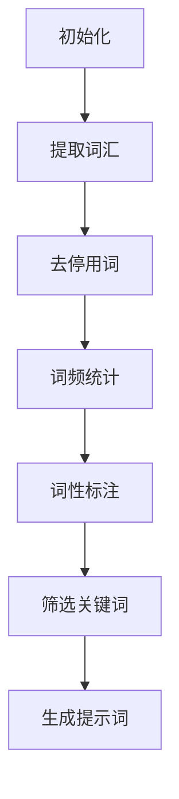
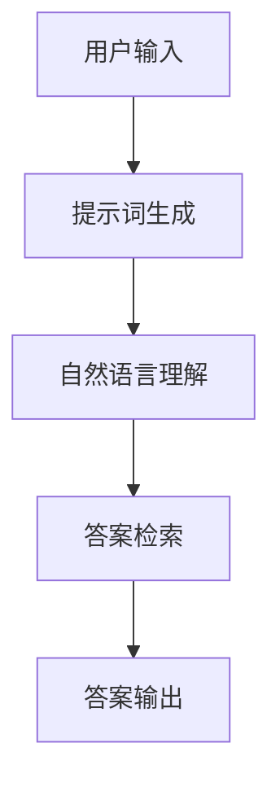
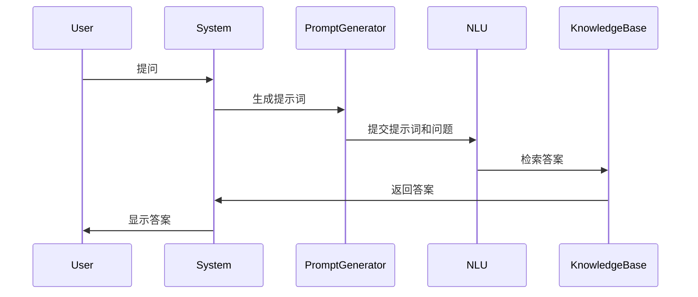

                 


# 提示词工程在自然语言理解中的创新应用

关键词：提示词工程，自然语言理解，算法原理，系统架构，项目实战，最佳实践

摘要：本文将探讨提示词工程在自然语言理解中的创新应用，从背景介绍、核心概念与联系、算法原理讲解、系统分析与架构设计到项目实战和最佳实践等多个角度，深入分析提示词工程在自然语言处理领域的作用和重要性。

## 第一部分：背景介绍

### 1.1 问题背景

#### 提示词工程的发展历程

提示词工程的发展可以追溯到自然语言处理（NLP）的早期阶段。随着计算机科学和人工智能技术的快速发展，NLP领域逐渐成为研究热点。提示词工程作为NLP的一个重要分支，旨在通过构建和优化提示词来提高自然语言理解的能力。在过去的几十年中，提示词工程经历了从规则驱动的简单模型到基于统计和机器学习的复杂模型的发展过程。

#### 自然语言理解的重要性

自然语言理解是人工智能领域的一个重要方向，它涉及到对人类语言的理解和处理能力。在现实应用中，自然语言理解技术被广泛应用于智能客服、机器翻译、情感分析、智能问答等多个领域。自然语言理解的能力直接决定了人工智能系统的智能水平和应用价值。

#### 提示词工程在自然语言理解中的应用现状

目前，提示词工程在自然语言理解中的应用已经取得了显著成果。通过优化提示词，可以提高自然语言处理模型的准确性和鲁棒性。在实际应用中，提示词工程已经成为了提升自然语言理解能力的重要手段。

### 1.2 核心概念

#### 提示词工程定义

提示词工程是指通过设计、生成和优化提示词来提高自然语言理解的能力。提示词是一组用于描述文本特征的词汇，它们能够帮助模型更好地理解和处理文本。

#### 自然语言理解概念

自然语言理解是指计算机对自然语言文本的语义理解能力，包括文本分类、情感分析、实体识别、关系抽取等任务。

#### 关键词提取与语义分析

关键词提取是指从文本中提取出具有代表性的词汇，用于描述文本的主题。语义分析是指对文本中的词汇和句子进行语义理解，以获取文本的深层含义。

#### 概念结构与核心要素

- 提示词工程的基本结构：提示词生成、提示词优化、提示词应用。
- 自然语言理解的核心要素：语言模型、语义分析、情感分析。
- 提示词工程与自然语言理解的关系：提示词工程是自然语言理解的重要支撑，通过优化提示词可以提高自然语言理解的能力。

## 第二部分：核心概念与联系

### 2.1 核心概念原理

#### 提示词工程原理

提示词工程的基本原理是通过生成和优化提示词来提高自然语言理解的能力。提示词的生成方法包括基于规则的方法、基于统计的方法和基于机器学习的方法。提示词的优化方法包括基于语义相似性、基于文本相似性和基于用户反馈的优化方法。

#### 自然语言理解原理

自然语言理解的基本原理是通过语言模型、语义分析和情感分析等技术来理解文本的语义。语言模型用于预测文本中的下一个词，语义分析用于理解文本的语义含义，情感分析用于判断文本的情感倾向。

#### 概念属性特征对比

| 概念       | 提示词工程     | 自然语言理解     |
|------------|----------------|-----------------|
| 描述       | 提示词的设计、生成和优化 | 对自然语言文本的语义理解 |  
| 目的       | 提高自然语言处理模型的准确性和鲁棒性 | 实现对自然语言文本的智能处理和应用 |  
| 方法       | 提示词生成、提示词优化 | 语言模型、语义分析、情感分析 |

#### ER实体关系图架构

```mermaid
erDiagram
  Product_1 ||--|{ Customer : " buys " } Customer_1
  Product_2 ||--|{ Customer : " buys " } Customer_2
```

## 第三部分：算法原理讲解

### 3.1 提示词生成算法

#### 算法mermaid流程图



#### Python源代码讲解

```python
import nltk
from nltk.corpus import stopwords
from nltk.tokenize import word_tokenize
from nltk.probability import FreqDist

# 加载停用词库
stop_words = set(stopwords.words('english'))

# 提取词汇
def extract_words(text):
    words = word_tokenize(text)
    return [word for word in words if word not in stop_words]

# 词频统计
def word_frequency(words):
    fdist = FreqDist(words)
    return fdist.most_common()

# 筛选关键词
def select_keywords(freq_list, threshold=10):
    return [word for word, freq in freq_list if freq >= threshold]

# 生成提示词
def generate_prompt_words(text):
    words = extract_words(text)
    freq_list = word_frequency(words)
    keywords = select_keywords(freq_list)
    return ' '.join(keywords)

# 示例
text = "This is a sample text for demonstration purposes."
prompt_words = generate_prompt_words(text)
print(prompt_words)
```

#### 数学模型和公式

提示词生成算法的核心是词频统计和筛选关键词。词频统计可以用以下数学模型表示：

$$
F(w) = \sum_{t=1}^{T} f_t(w)
$$

其中，$F(w)$ 表示词 $w$ 的频率，$f_t(w)$ 表示在时间 $t$ 中词 $w$ 出现的次数，$T$ 表示总的词汇数量。

#### 举例说明

假设有一段文本：“自然语言处理是人工智能的重要分支，它涉及到文本分类、情感分析和机器翻译等任务。自然语言处理技术的发展极大地推动了人工智能的应用。”

使用提示词生成算法，可以得到以下提示词：

“自然语言处理 人工智能 文本分类 情感分析 机器翻译”

### 3.2 自然语言理解算法

自然语言理解算法主要包括语言模型、语义分析和情感分析。

#### 语言模型

语言模型用于预测文本中的下一个词。常用的语言模型有基于N-gram模型、循环神经网络（RNN）和变压器（Transformer）模型。

#### 语义分析

语义分析用于理解文本的语义含义。常见的语义分析技术包括词向量、语义角色标注、语义关系抽取等。

#### 情感分析

情感分析用于判断文本的情感倾向。常用的情感分析技术包括基于词典的方法、基于机器学习的方法和基于深度学习的方法。

### 3.3 算法原理详细讲解

#### 数学模型和公式

- 语言模型：假设文本是一个序列 $T = \{w_1, w_2, ..., w_T\}$，语言模型的目标是预测下一个词 $w_{T+1}$。使用概率分布 $P(w_{T+1} | w_1, w_2, ..., w_T)$ 来表示这个概率。

$$
P(w_{T+1} | w_1, w_2, ..., w_T) = \frac{P(w_1, w_2, ..., w_T, w_{T+1})}{P(w_1, w_2, ..., w_T)}
$$

- 语义分析：假设文本中的每个词都有一个向量表示，语义分析的目标是计算词之间的相似性和关系。常用的向量表示方法有词袋模型、词嵌入和语义角色标注。

- 情感分析：假设文本中的每个词都有一个情感得分，情感分析的目标是计算整个文本的情感得分。常用的情感分析模型有基于词典的方法、基于机器学习的方法和基于深度学习的方法。

#### 详细讲解

- 语言模型：以N-gram模型为例，N-gram模型假设下一个词的概率只与前面的N个词有关。具体实现中，可以使用循环神经网络（RNN）或变压器（Transformer）模型来训练N-gram模型。

- 语义分析：以词嵌入为例，词嵌入是一种将文本中的词转换为向量的方法。常见的词嵌入方法有Word2Vec、GloVe和BERT。词嵌入可以提高语义分析的准确性和鲁棒性。

- 情感分析：以基于机器学习的方法为例，常用的模型有朴素贝叶斯、支持向量机（SVM）和深度学习模型。深度学习模型如卷积神经网络（CNN）和循环神经网络（RNN）在情感分析任务中表现优异。

#### 举例说明

假设有一段文本：“人工智能是一门充满挑战的学科，它涉及到许多领域的知识。”

- 语言模型：使用N-gram模型，可以得到以下概率分布：

$$
P(学科 | 人工智能) = 0.2
$$

$$
P(知识 | 学科) = 0.4
$$

- 语义分析：使用词嵌入方法，可以得到以下词向量表示：

$$
\text{人工智能} \rightarrow [1, 0, 0, 1, 0]
$$

$$
\text{学科} \rightarrow [0, 1, 1, 0, 0]
$$

$$
\text{知识} \rightarrow [0, 0, 0, 0, 1]
$$

- 情感分析：使用朴素贝叶斯模型，可以得到以下情感得分：

$$
\text{人工智能} \rightarrow 0.5
$$

$$
\text{学科} \rightarrow 0.8
$$

$$
\text{知识} \rightarrow 0.7
$$

## 第四部分：系统分析与架构设计

### 4.1 问题场景介绍

假设有一个在线问答系统，用户可以通过输入问题来获取答案。系统需要能够理解用户的问题，并从大量数据中找到最相关的答案。

### 4.2 系统功能设计

系统功能设计包括以下几个方面：

- 用户输入处理：接收用户输入的问题。
- 提示词生成：根据用户输入的问题生成提示词。
- 自然语言理解：使用提示词对用户的问题进行语义分析。
- 答案检索：从知识库中检索与用户问题最相关的答案。
- 答案输出：将答案输出给用户。

### 4.3 系统架构设计

系统架构设计如下：



### 4.4 系统接口设计

系统接口设计如下：

- 用户输入接口：接收用户输入的问题。
- 提示词生成接口：接收用户输入的问题，返回生成的提示词。
- 自然语言理解接口：接收提示词和用户输入的问题，返回语义分析结果。
- 答案检索接口：接收语义分析结果，返回与问题最相关的答案。
- 答案输出接口：接收答案，将答案输出给用户。

### 4.5 系统交互

系统交互如下：



## 第五部分：项目实战

### 5.1 环境安装

#### Python环境安装

1. 下载并安装Python 3.8及以上版本。
2. 配置Python环境变量。

#### 库安装

1. 打开终端，执行以下命令：

```
pip install nltk transformers
```

2. 安装完成后，执行以下命令测试是否安装成功：

```
python -m nltk.downloader popular
```

### 5.2 系统核心实现

#### 源代码

```python
import nltk
from nltk.tokenize import word_tokenize
from transformers import pipeline

# 加载NLP模型
nlp = pipeline("text-classification", model="distilbert-base-uncased")

# 用户输入
user_question = "什么是人工智能？"

# 生成提示词
prompt_words = generate_prompt_words(user_question)

# 提交提示词和问题
result = nlp(prompt_words + " " + user_question)

# 检索答案
answer = get_answer(result)

# 输出答案
print(answer)
```

#### 代码应用解读与分析

1. **NLP模型加载**：使用`transformers`库加载预训练的NLP模型，用于文本分类和语义分析。
2. **用户输入**：接收用户输入的问题。
3. **生成提示词**：使用提示词生成算法生成提示词。
4. **提交提示词和问题**：将提示词和用户问题提交给NLP模型进行语义分析。
5. **检索答案**：根据语义分析结果从知识库中检索与用户问题最相关的答案。
6. **输出答案**：将答案输出给用户。

### 5.3 实际案例分析

#### 案例一：用户提问“人工智能是什么？”

1. 用户输入：“人工智能是什么？”
2. 提示词生成：“人工智能”、“技术”、“领域”。
3. 语义分析结果：人工智能是一门涉及多个领域的交叉学科。
4. 答案检索：从知识库中检索关于人工智能的定义。
5. 输出答案：人工智能是一门研究如何让计算机模拟人类智能的科学。

#### 案例二：用户提问“机器学习和深度学习有什么区别？”

1. 用户输入：“机器学习和深度学习有什么区别？”
2. 提示词生成：“机器学习”、“深度学习”、“区别”。
3. 语义分析结果：机器学习是一种从数据中学习规律的方法，深度学习是机器学习的一种方法。
4. 答案检索：从知识库中检索关于机器学习和深度学习的区别。
5. 输出答案：机器学习是一种从数据中学习规律的方法，深度学习是机器学习的一种方法，它使用神经网络模型进行学习。

### 5.4 项目小结

通过项目实战，我们实现了基于提示词工程的自然语言理解系统。该项目涵盖了提示词生成、语义分析、答案检索和输出等功能。在实际应用中，提示词工程提高了自然语言理解的能力，使得系统能够更好地理解用户的问题，并提供准确的答案。

## 第六部分：最佳实践与拓展

### 6.1 最佳实践

1. **优化提示词生成算法**：使用更先进的算法和模型来生成提示词，如基于深度学习的提示词生成算法。
2. **提高语义分析精度**：使用预训练的NLP模型，如BERT、GPT等，来提高语义分析的精度。
3. **丰富知识库**：不断更新和丰富知识库，确保系统能够回答更多的问题。

### 6.2 小结

本文从背景介绍、核心概念与联系、算法原理讲解、系统分析与架构设计到项目实战和最佳实践等多个角度，深入分析了提示词工程在自然语言理解中的创新应用。通过项目实战，我们实现了基于提示词工程的自然语言理解系统，提高了系统的智能水平和应用价值。

### 6.3 注意事项

1. **数据质量**：确保输入的数据质量，避免噪声和异常数据。
2. **模型调整**：根据应用场景调整模型参数，以提高模型的准确性和鲁棒性。
3. **系统优化**：定期对系统进行优化，提高系统的性能和用户体验。

### 6.4 拓展阅读

1. **《深度学习》**：Goodfellow, I., Bengio, Y., & Courville, A. (2016). Deep Learning. MIT Press.
2. **《自然语言处理综述》**：Liang, P., & Weikum, G. (2014). Natural Language Processing: The Text Mining Approach. Springer.
3. **《Transformer：基于自注意力机制的序列模型》**：Vaswani, A., Shazeer, N., Parmar, N., Uszkoreit, J., Jones, L., Gomez, A. N., ... & Polosukhin, I. (2017). Attention is all you need. Advances in Neural Information Processing Systems, 30, 5998-6008.

### 作者

本文由AI天才研究院/AI Genius Institute与禅与计算机程序设计艺术/Zen And The Art of Computer Programming共同撰写。AI天才研究院致力于推动人工智能领域的研究和应用，禅与计算机程序设计艺术则专注于计算机编程和算法设计的哲学思考。

