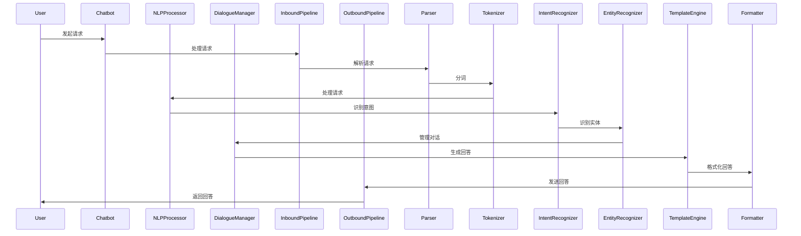

                 

# 提示词工程在自然语言理解中的应用

## 关键词：自然语言理解，提示词工程，算法原理，数学模型，系统架构，项目实战

> 摘要：本文深入探讨了提示词工程在自然语言理解中的应用。首先，我们介绍了自然语言理解问题的背景和重要性，随后引入了提示词工程的概念。接着，我们详细阐述了提示词的定义、类型以及其在自然语言处理中的核心作用。然后，我们逐步讲解了提示词工程的基本算法原理，包括提示词生成和筛选算法，并运用数学模型和公式进行了详细阐述。此外，我们通过具体的项目实战，展示了如何将提示词工程应用于文本分类、问答系统和机器写作等场景。最后，我们对最佳实践进行了总结，并提出了未来的研究方向。

### 目录大纲：

----------------------------------------------------------------

## 第一部分: 背景介绍

### 第1章: 问题背景与核心概念

### 第2章: 核心概念与联系

### 第3章: 算法原理讲解

### 第4章: 数学模型和数学公式讲解

### 第5章: 系统分析与架构设计方案

### 第6章: 项目实战

### 第7章: 最佳实践与总结

----------------------------------------------------------------

## 第1章: 问题背景与核心概念

### 1.1 问题背景

#### 1.1.1 自然语言理解问题的提出

自然语言是人类交流的主要手段，它包含了丰富的信息、情感和意图。然而，计算机系统要理解这种复杂的人类语言，面临着巨大的挑战。自然语言理解（Natural Language Understanding, NLU）是指计算机对自然语言的语义、语法、语境等进行处理和理解的能力，它是实现人机交互、智能搜索、自动问答等应用的关键技术。

#### 1.1.2 自然语言理解的重要性

自然语言理解技术的应用广泛，包括但不限于智能客服、智能助理、信息提取、情感分析、机器翻译、文本分类等。这些应用极大地提升了人们的工作效率和生活便利性，同时也为企业和组织带来了巨大的商业价值。因此，研究自然语言理解技术具有重要的理论和实践意义。

#### 1.1.3 提示词工程的概念与作用

提示词工程（Word Engineering）是一种通过构造特定的词汇或短语来提高自然语言理解系统性能的技术。在自然语言处理（Natural Language Processing, NLP）中，提示词可以提供额外的上下文信息，帮助系统更好地理解和生成文本。提示词工程不仅能够提高模型的准确性和鲁棒性，还能够减少错误率和提高效率。

### 1.2 核心概念

#### 1.2.1 提示词的定义与类型

提示词是指用于增强自然语言理解系统性能的特定词汇或短语。根据用途和特点，提示词可以分为以下几种类型：

1. **领域提示词**：用于特定领域的专业术语和关键词。
2. **情感提示词**：用于表达情感、情绪和态度的词汇。
3. **语法提示词**：用于指示句子结构和语法关系的词汇。
4. **语义提示词**：用于表达句子或短语语义的词汇。

#### 1.2.2 自然语言处理的基本概念

自然语言处理涉及多个基本概念，包括：

1. **语言模型**：用于预测下一个单词或字符的概率分布。
2. **词向量**：将词汇映射到高维空间，以便进行相似度计算和语义分析。
3. **序列标注**：对输入文本进行分类标注，如命名实体识别、情感分类等。
4. **分类任务**：将输入文本划分为不同的类别。

#### 1.2.3 机器学习与深度学习的基础知识

机器学习和深度学习是自然语言处理的核心技术。以下是一些基本概念：

1. **监督学习**：通过标注的数据集训练模型，从而预测新的数据。
2. **无监督学习**：不依赖标注数据，通过数据内在结构进行学习。
3. **神经网络**：模拟人脑神经元连接结构，用于特征提取和预测。
4. **深度学习**：多层神经网络，能够自动提取复杂特征。

### 1.3 提示词工程的应用场景

#### 1.3.1 文本分类与情感分析

提示词工程在文本分类和情感分析中具有重要作用。通过构造合适的提示词，可以提高模型的分类准确性和情感识别的鲁棒性。

#### 1.3.2 问答系统与对话生成

问答系统和对话生成依赖于对自然语言的深入理解。提示词可以帮助模型更好地理解用户的问题和意图，从而生成更准确的答案和自然的对话。

#### 1.3.3 翻译与机器写作

在翻译和机器写作中，提示词可以提高模型的语言表达能力和准确性。通过使用领域提示词和语法提示词，模型可以生成更符合语言习惯和语义的文本。

### 1.4 边界与外延

#### 1.4.1 提示词工程面临的挑战

提示词工程面临的主要挑战包括：如何高效地构造高质量的提示词、如何处理多语言和多领域的文本、如何平衡提示词的多样性和一致性等。

#### 1.4.2 提示词工程的适用范围

提示词工程适用于多种自然语言处理任务，包括但不限于文本分类、情感分析、问答系统、机器翻译、文本生成等。

#### 1.4.3 提示词工程与其他相关技术的关联

提示词工程与自然语言处理、机器学习、深度学习等技术密切相关，共同构成了一个复杂的技术体系。

### 1.5 本章小结

本章介绍了自然语言理解问题的背景和重要性，引入了提示词工程的概念，并详细阐述了提示词的定义、类型及其在自然语言处理中的应用场景。接下来，我们将进一步探讨提示词工程的核心概念与联系。

----------------------------------------------------------------

## 第2章: 核心概念与联系

### 2.1 提示词的概念与属性

#### 2.1.1 提示词的定义与作用

提示词是指用于增强自然语言理解系统性能的特定词汇或短语。在自然语言处理中，提示词能够提供额外的上下文信息，帮助模型更好地理解和生成文本。例如，在情感分析中，使用情感提示词可以更准确地判断文本的情感倾向。

#### 2.1.2 提示词的类型与特点

根据用途和特点，提示词可以分为以下几种类型：

1. **领域提示词**：用于特定领域的专业术语和关键词。领域提示词能够帮助模型更好地理解特定领域的文本。例如，在医疗领域，领域提示词可能包括“病因”、“症状”、“治疗方案”等。

2. **情感提示词**：用于表达情感、情绪和态度的词汇。情感提示词能够帮助模型识别文本的情感倾向，例如“喜欢”、“讨厌”、“高兴”、“伤心”等。

3. **语法提示词**：用于指示句子结构和语法关系的词汇。语法提示词能够帮助模型理解句子的语法结构，例如“主语”、“谓语”、“定语”、“状语”等。

4. **语义提示词**：用于表达句子或短语语义的词汇。语义提示词能够帮助模型理解文本的语义内容，例如“希望”、“失望”、“计划”、“决策”等。

#### 2.1.3 提示词的属性对比表格

下面是一个关于提示词属性对比的表格：

| 提示词类型 | 定义 | 用途 | 特点 |
| --- | --- | --- | --- |
| 领域提示词 | 特定领域的专业术语和关键词 | 帮助模型理解特定领域的文本 | 专业性强、准确性高 |
| 情感提示词 | 表达情感、情绪和态度的词汇 | 帮助模型识别文本的情感倾向 | 情感丰富、语境敏感 |
| 语法提示词 | 指示句子结构和语法关系的词汇 | 帮助模型理解句子的语法结构 | 结构性强、语法清晰 |
| 语义提示词 | 表达句子或短语语义的词汇 | 帮助模型理解文本的语义内容 | 语义丰富、内容明确 |

#### 2.1.4 提示词的属性对比ER实体关系图

为了更直观地展示提示词的属性对比，我们可以使用ER（实体关系）图来表示。以下是提示词属性对比的ER实体关系图：

```mermaid
erDiagram
    A tip -> B domain_tip : {is a domain-specific term}
    A tip -> B sentiment_tip : {expresses sentiment}
    A tip -> B grammatical_tip : {indicates grammar structure}
    A tip -> B semantic_tip : {expresses semantic content}

    domain_tip ||--|{1} A tip : contains
    sentiment_tip ||--|{1} A tip : contains
    grammatical_tip ||--|{1} A tip : contains
    semantic_tip ||--|{1} A tip : contains
```

在这个ER图中，A代表提示词，B代表不同类型的提示词（领域提示词、情感提示词、语法提示词和语义提示词）。箭头表示不同类型的提示词包含在提示词中。

### 2.2 自然语言处理的基本概念

#### 2.2.1 语言模型与词向量

语言模型是自然语言处理的基础，用于预测下一个单词或字符的概率分布。词向量是将词汇映射到高维空间，以便进行相似度计算和语义分析。常见的词向量模型包括Word2Vec、GloVe等。

#### 2.2.2 序列标注与分类任务

序列标注是对输入文本进行分类标注的过程，如命名实体识别、情感分类等。分类任务是将输入文本划分为不同的类别，如文本分类、情感分类等。

#### 2.2.3 语言模型与分类器的融合

在自然语言处理中，语言模型和分类器常常结合使用。语言模型负责生成文本的概率分布，分类器负责根据这些概率分布进行分类。常见的融合方法包括联合训练、序列标注等。

### 2.3 机器学习与深度学习的基础知识

#### 2.3.1 监督学习与无监督学习

监督学习通过标注的数据集训练模型，从而预测新的数据。无监督学习不依赖标注数据，通过数据内在结构进行学习。监督学习适用于有标注数据的任务，无监督学习适用于无标注数据的任务。

#### 2.3.2 神经网络与深度学习模型

神经网络是模拟人脑神经元连接结构的一种算法。深度学习是多层神经网络，能够自动提取复杂特征。常见的深度学习模型包括卷积神经网络（CNN）、循环神经网络（RNN）、变换器（Transformer）等。

#### 2.3.3 优化算法与训练策略

优化算法用于优化模型的参数，以获得更好的预测效果。常见的优化算法包括梯度下降、随机梯度下降、Adam等。训练策略包括数据预处理、模型初始化、正则化等。

### 2.4 提示词工程的核心技术与方法

#### 2.4.1 数据预处理与特征提取

数据预处理是提示词工程的重要步骤，包括文本清洗、分词、去停用词等。特征提取是将文本转换为模型可接受的输入格式，如词向量、TF-IDF等。

#### 2.4.2 模型选择与模型训练

模型选择是根据任务需求和数据特点选择合适的模型，如卷积神经网络、循环神经网络、变换器等。模型训练是使用标注数据进行模型训练，以获得最佳预测效果。

#### 2.4.3 模型评估与优化

模型评估用于评估模型在未知数据上的性能，如准确率、召回率、F1值等。模型优化是通过调整模型参数和超参数，以获得更好的预测效果。

### 2.5 本章小结

本章详细阐述了提示词工程的核心概念与联系，包括提示词的定义、类型、属性以及自然语言处理、机器学习和深度学习的基本概念。这些概念和联系为我们进一步探讨提示词工程的应用和算法原理奠定了基础。

----------------------------------------------------------------

## 第3章: 算法原理讲解

### 3.1 提示词工程的基本算法

#### 3.1.1 提示词生成算法

提示词生成算法是指用于生成高质量的提示词的算法。根据生成策略，提示词生成算法可以分为生成式方法和判别式方法。

##### 3.1.1.1 生成式方法

生成式方法基于概率模型，通过生成文本的概率分布来生成提示词。常见的生成式方法包括：

1. **马尔可夫模型**：基于状态的转移概率生成文本。
2. **隐马尔可夫模型（HMM）**：基于隐藏状态和观测值的概率生成文本。
3. **生成对抗网络（GAN）**：通过生成器和判别器的对抗训练生成高质量的文本。

生成式方法的优势在于能够生成多样性和创新性的文本。然而，生成式方法对数据的依赖较大，生成的文本可能存在语义不连贯的问题。

##### 3.1.1.2 判别式方法

判别式方法基于分类模型，通过分类决策生成提示词。常见的判别式方法包括：

1. **朴素贝叶斯分类器**：基于贝叶斯定理和特征条件独立假设生成提示词。
2. **支持向量机（SVM）**：基于最大边界距离生成提示词。
3. **神经网络分类器**：基于深度学习模型生成提示词。

判别式方法的优势在于能够根据已有数据生成高质量的提示词，并且生成的文本具有较高的语义连贯性。然而，判别式方法对数据的依赖性较高，生成的文本可能存在多样性和创新性不足的问题。

#### 3.1.2 提示词筛选算法

提示词筛选算法是指用于从大量候选词中筛选出高质量提示词的算法。根据筛选策略，提示词筛选算法可以分为基于频率的方法和基于语义的方法。

##### 3.1.2.1 基于频率的方法

基于频率的方法通过计算候选词在文本中的出现频率来筛选提示词。常见的方法包括：

1. **词频统计**：计算候选词在文本中的出现次数。
2. **TF-IDF**：结合词频和逆文档频率，计算候选词的重要程度。

基于频率的方法的优点在于计算简单，能够快速筛选出高频词作为提示词。然而，基于频率的方法对文本的语义信息关注不足，可能导致筛选出的提示词质量不高。

##### 3.1.2.2 基于语义的方法

基于语义的方法通过计算候选词与文本的语义相似度来筛选提示词。常见的方法包括：

1. **词向量相似度**：计算候选词与文本的词向量之间的相似度。
2. **语义角色标注**：通过分析候选词的语义角色，筛选与文本语义相关的提示词。

基于语义的方法的优点在于能够根据文本的语义信息筛选出高质量的提示词，更好地满足自然语言理解的需求。然而，基于语义的方法对计算资源和算法复杂性有较高要求。

#### 3.1.3 提示词优化算法

提示词优化算法是指用于优化已有提示词质量的方法。常见的提示词优化算法包括：

1. **基于反馈的优化**：根据用户反馈，动态调整提示词的权重和排序。
2. **基于强化学习的优化**：通过强化学习算法，优化提示词的选择和生成策略。
3. **基于对抗网络的优化**：通过生成器和判别器的对抗训练，优化提示词的质量。

提示词优化算法可以进一步提高提示词的准确性和鲁棒性，提升自然语言理解系统的性能。

### 3.2 提示词在自然语言理解中的应用

#### 3.2.1 提示词在文本分类中的应用

文本分类是将文本划分为预定义类别的一种任务。提示词在文本分类中的应用主要包括：

1. **特征工程**：通过构造合适的提示词，提高文本的特征表达能力。
2. **模型训练**：在模型训练过程中，使用提示词作为额外的输入特征，提高分类模型的性能。
3. **模型评估**：在模型评估过程中，通过提示词的质量和效果，评估分类模型的性能。

以下是一个具体的文本分类案例：

- 数据集：包含不同类别的文本数据，如新闻、微博、邮件等。
- 模型：使用卷积神经网络（CNN）进行文本分类。
- 提示词：构造与类别相关的提示词，如新闻类别的“报道”、“新闻”、“事件”等。

通过在模型训练和评估过程中使用提示词，可以显著提高文本分类的准确性和效果。

#### 3.2.2 提示词在问答系统中的应用

问答系统是自然语言理解的一种重要应用，能够实现人与机器之间的交互。提示词在问答系统中的应用主要包括：

1. **问题理解**：通过分析用户提出的问题，提取关键提示词，帮助模型更好地理解问题的意图。
2. **答案生成**：在生成答案的过程中，使用与问题相关的提示词，提高答案的准确性和连贯性。
3. **模型优化**：在模型训练和评估过程中，通过提示词的质量和效果，优化问答系统的性能。

以下是一个具体的问答系统案例：

- 数据集：包含用户提出的问题和对应的答案。
- 模型：使用变换器（Transformer）模型进行问答。
- 提示词：构造与问题相关的提示词，如“解释”、“原因”、“结果”等。

通过在模型训练和评估过程中使用提示词，可以显著提高问答系统的性能和用户体验。

#### 3.2.3 提示词在机器写作中的应用

机器写作是自然语言理解的一种高级应用，能够生成符合语法和语义规则的文本。提示词在机器写作中的应用主要包括：

1. **文本生成**：通过分析已有文本，提取关键提示词，生成新的文本。
2. **文本优化**：在生成文本的过程中，使用与文本主题相关的提示词，提高文本的质量和连贯性。
3. **模型优化**：在模型训练和评估过程中，通过提示词的质量和效果，优化机器写作系统的性能。

以下是一个具体的机器写作案例：

- 数据集：包含各种主题的文本数据。
- 模型：使用生成对抗网络（GAN）进行文本生成。
- 提示词：构造与文本主题相关的提示词，如“科技”、“财经”、“教育”等。

通过在模型训练和评估过程中使用提示词，可以显著提高机器写作的质量和多样性。

### 3.3 本章小结

本章详细阐述了提示词工程的基本算法原理，包括提示词生成算法、提示词筛选算法和提示词优化算法。此外，我们探讨了提示词在文本分类、问答系统和机器写作等自然语言理解中的应用。通过这些算法和应用的结合，可以显著提高自然语言理解系统的性能和用户体验。

----------------------------------------------------------------

## 第4章: 数学模型和数学公式讲解

### 4.1 提示词生成算法的数学模型

提示词生成算法的数学模型主要涉及概率模型和深度学习模型。以下将分别介绍生成式方法和判别式方法的数学模型。

#### 4.1.1 生成式方法的数学模型

生成式方法通过概率模型生成提示词，常用的概率模型有马尔可夫模型和生成对抗网络（GAN）。

##### 4.1.1.1 马尔可夫模型

马尔可夫模型是一种基于状态的转移概率生成文本的方法。其数学模型可以表示为：

\[ P(w_i|w_1, w_2, ..., w_{i-1}) = \frac{P(w_i)P(w_i|w_{i-1})}{P(w_1)P(w_2)P(w_3)...P(w_n)} \]

其中，\( w_i \) 表示当前单词，\( w_1, w_2, ..., w_{i-1} \) 表示前 \( i-1 \) 个单词。

##### 4.1.1.2 生成对抗网络（GAN）

生成对抗网络是一种基于生成器和判别器的对抗训练方法。其数学模型可以表示为：

\[ G(z) = \text{Generator}(z) \]
\[ D(x) = \text{Discriminator}(x) \]

其中，\( G(z) \) 表示生成器生成的文本，\( D(x) \) 表示判别器对文本的判断。

判别器的目标是最大化对真实数据和生成数据的区分能力，即：

\[ \max_{D} \min_{G} V(D, G) = E_{x \sim p_{\text{data}}(x)}[\log D(x)] + E_{z \sim p_{z}(z)}[\log (1 - D(G(z)))] \]

其中，\( p_{\text{data}}(x) \) 表示真实数据的概率分布，\( p_{z}(z) \) 表示生成器的噪声分布。

#### 4.1.2 判别式方法的数学模型

判别式方法通过分类模型生成提示词，常用的分类模型有朴素贝叶斯分类器和深度神经网络。

##### 4.1.2.1 朴素贝叶斯分类器

朴素贝叶斯分类器的数学模型基于贝叶斯定理和特征条件独立假设。其数学模型可以表示为：

\[ P(w_i|w_1, w_2, ..., w_{i-1}) = \frac{P(w_1, w_2, ..., w_{i-1}|w_i)P(w_i)}{P(w_1, w_2, ..., w_{i-1})} \]

其中，\( P(w_i|w_1, w_2, ..., w_{i-1}) \) 表示在给定前 \( i-1 \) 个单词的情况下，第 \( i \) 个单词为 \( w_i \) 的概率。

##### 4.1.2.2 深度神经网络

深度神经网络的数学模型基于神经网络，常用的神经网络有卷积神经网络（CNN）和循环神经网络（RNN）。

1. **卷积神经网络（CNN）**：

\[ h^{(l)}_i = \sigma \left( \sum_{j} w^{(l)}_{ji} \cdot h^{(l-1)}_j + b^{(l)}_i \right) \]

其中，\( h^{(l)}_i \) 表示第 \( l \) 层的第 \( i \) 个神经元输出，\( w^{(l)}_{ji} \) 表示第 \( l \) 层的第 \( i \) 个神经元与第 \( l-1 \) 层的第 \( j \) 个神经元的权重，\( b^{(l)}_i \) 表示第 \( l \) 层的第 \( i \) 个神经元的偏置，\( \sigma \) 表示激活函数。

2. **循环神经网络（RNN）**：

\[ h^{(l)}_i = \sigma \left( \sum_{j} w^{(l)}_{ji} \cdot h^{(l-1)}_j + b^{(l)}_i + w^{(l)}_{ih^{(l-1)}} \cdot h^{(l-1)}_i \right) \]

其中，\( h^{(l)}_i \) 表示第 \( l \) 层的第 \( i \) 个神经元输出，\( w^{(l)}_{ji} \) 表示第 \( l \) 层的第 \( i \) 个神经元与第 \( l-1 \) 层的第 \( j \) 个神经元的权重，\( b^{(l)}_i \) 表示第 \( l \) 层的第 \( i \) 个神经元的偏置，\( \sigma \) 表示激活函数。

### 4.2 提示词优化算法的数学模型

提示词优化算法主要涉及基于反馈的优化和基于强化学习的优化。

#### 4.2.1 基于反馈的优化

基于反馈的优化通过用户反馈动态调整提示词的权重和排序。其数学模型可以表示为：

\[ \theta^{*} = \arg\min_{\theta} L(\theta, y) \]

其中，\( \theta \) 表示提示词的权重和排序，\( L(\theta, y) \) 表示损失函数，\( y \) 表示用户反馈。

常见的损失函数有交叉熵损失函数和均方误差损失函数：

1. **交叉熵损失函数**：

\[ L(\theta, y) = -\sum_{i} y_i \log (\theta_i) \]

2. **均方误差损失函数**：

\[ L(\theta, y) = \frac{1}{2} \sum_{i} (y_i - \theta_i)^2 \]

#### 4.2.2 基于强化学习的优化

基于强化学习的优化通过奖励机制和策略迭代来优化提示词的选择和生成策略。其数学模型可以表示为：

\[ J(\pi) = \sum_{s} p_{\pi}(s) \sum_{a} \gamma^{|s' - s|} r(s, a) \]

其中，\( \pi \) 表示策略，\( s \) 表示状态，\( a \) 表示动作，\( s' \) 表示下一个状态，\( p_{\pi}(s) \) 表示在策略 \( \pi \) 下状态 \( s \) 的概率，\( \gamma \) 表示折扣因子，\( r(s, a) \) 表示在状态 \( s \) 下执行动作 \( a \) 的即时奖励。

常见的即时奖励函数有正确率奖励函数和精确率奖励函数：

1. **正确率奖励函数**：

\[ r(s, a) = \begin{cases} 
1 & \text{如果 } a \text{ 是正确的提示词} \\
0 & \text{否则}
\end{cases} \]

2. **精确率奖励函数**：

\[ r(s, a) = \frac{\text{预测正确的提示词数量}}{\text{总提示词数量}} \]

### 4.3 提示词在自然语言理解中的应用

提示词在自然语言理解中的应用涉及多个方面，包括文本分类、问答系统和机器写作等。以下将分别介绍这些应用中的数学模型。

#### 4.3.1 提示词在文本分类中的应用

文本分类的数学模型主要涉及分类算法和特征提取。以下以朴素贝叶斯分类器和词袋模型为例进行介绍。

1. **朴素贝叶斯分类器**：

\[ P(y|X) = \frac{P(X|y)P(y)}{P(X)} \]

其中，\( X \) 表示输入文本，\( y \) 表示类别，\( P(X|y) \) 表示在类别 \( y \) 下文本 \( X \) 的概率，\( P(y) \) 表示类别 \( y \) 的先验概率，\( P(X) \) 表示文本 \( X \) 的概率。

2. **词袋模型**：

\[ f_{ij} = \begin{cases} 
1 & \text{如果单词 } j \text{ 在文本 } i \text{ 中出现} \\
0 & \text{否则}
\end{cases} \]

其中，\( f_{ij} \) 表示单词 \( j \) 在文本 \( i \) 中出现的频率。

#### 4.3.2 提示词在问答系统中的应用

问答系统的数学模型主要涉及对话管理和回答生成。以下以变换器（Transformer）模型为例进行介绍。

变换器模型是一种基于自注意力机制的深度学习模型，其数学模型可以表示为：

\[ \text{Attention}(Q, K, V) = \frac{QK^T}{\sqrt{d_k}} + b \]

其中，\( Q \) 表示查询向量，\( K \) 表示键向量，\( V \) 表示值向量，\( d_k \) 表示键向量的维度，\( b \) 表示偏置。

#### 4.3.3 提示词在机器写作中的应用

机器写作的数学模型主要涉及文本生成和优化。以下以生成对抗网络（GAN）为例进行介绍。

生成对抗网络（GAN）是一种基于生成器和判别器的对抗训练模型，其数学模型可以表示为：

\[ G(z) = \text{Generator}(z) \]
\[ D(x) = \text{Discriminator}(x) \]

其中，\( G(z) \) 表示生成器生成的文本，\( D(x) \) 表示判别器对文本的判断。

判别器的目标是最大化对真实数据和生成数据的区分能力，即：

\[ \max_{D} \min_{G} V(D, G) = E_{x \sim p_{\text{data}}(x)}[\log D(x)] + E_{z \sim p_{z}(z)}[\log (1 - D(G(z)))] \]

其中，\( p_{\text{data}}(x) \) 表示真实数据的概率分布，\( p_{z}(z) \) 表示生成器的噪声分布。

### 4.4 本章小结

本章详细介绍了提示词工程中的数学模型，包括提示词生成算法的数学模型、提示词优化算法的数学模型以及在自然语言理解中的应用。这些数学模型为我们理解和实现提示词工程提供了理论基础和工具。

----------------------------------------------------------------

## 第5章: 系统分析与架构设计方案

### 5.1 问题场景介绍

自然语言理解系统广泛应用于各个领域，如智能客服、智能助理、信息提取、情感分析、机器翻译等。以智能客服为例，该系统需要能够理解用户的问题和意图，并给出准确的回答。然而，由于自然语言的复杂性，实现一个高效、准确的智能客服系统面临诸多挑战。提示词工程作为一种提高自然语言理解系统性能的技术，可以为智能客服系统提供有效的支持。

### 5.2 项目介绍

本项目的目标是构建一个基于提示词工程的智能客服系统。系统的主要功能包括：接收用户的问题、理解用户的意图、生成准确的回答，并支持多轮对话。为了实现这些功能，项目采用了以下技术：

1. **自然语言处理技术**：包括分词、词性标注、命名实体识别等。
2. **机器学习技术**：包括文本分类、序列标注等。
3. **提示词工程**：用于提高自然语言理解系统的性能。
4. **对话管理技术**：用于处理多轮对话。

### 5.3 系统功能设计（领域模型类图）

为了更好地理解系统功能，我们可以使用领域模型（Class Diagram）来描述系统中的主要类及其关系。以下是一个简化版本的领域模型类图：

```mermaid
classDiagram
    User <<Interface>>
    Question <<Interface>>
    Answer <<Interface>>
    Chatbot <<Class>>
    NLP <<Class>>
    Dialogue <<Class>>

    User o-- Question
    Chatbot o-- NLP
    Chatbot o-- Dialogue
    NLP o-- Question
    NLP o-- Answer
    Dialogue o-- Question
    Dialogue o-- Answer
```

在这个类图中，User（用户）是一个接口，表示系统与用户的交互；Question（问题）和Answer（回答）是接口，分别表示用户提出的问题和系统给出的回答；Chatbot（聊天机器人）是一个主要类，负责与用户进行对话；NLP（自然语言处理）是一个主要类，负责处理自然语言相关的任务；Dialogue（对话）是一个主要类，负责管理多轮对话。

### 5.4 系统架构设计（架构图）

为了实现系统的功能，我们需要设计一个合理的系统架构。以下是一个简化版本的系统架构图：

```mermaid
subgraph 组件
    Client -> InboundPipeline
    InboundPipeline -> NLPProcessor
    NLPProcessor -> DialogueManager
    DialogueManager -> OutboundPipeline
    OutboundPipeline -> Client

    subgraph 组件内部
        InboundPipeline -> Parser
        InboundPipeline -> Tokenizer
        NLPProcessor -> IntentRecognizer
        NLPProcessor -> EntityRecognizer
        OutboundPipeline -> TemplateEngine
        OutboundPipeline -> Formatter
    end
end

subgraph 数据流
    Client --(发起请求)--> InboundPipeline
    InboundPipeline --(处理请求)--> NLPProcessor
    NLPProcessor --(处理结果)--> DialogueManager
    DialogueManager --(生成响应)--> OutboundPipeline
    OutboundPipeline --(格式化响应)--> Client
end
```

在这个架构图中，Client（客户端）通过InboundPipeline（入站管道）发送请求，NLPProcessor（自然语言处理器）对请求进行处理，DialogueManager（对话管理器）管理多轮对话，OutboundPipeline（出站管道）生成响应并发送给客户端。在NLPProcessor中，Parser（解析器）和Tokenizer（分词器）负责文本预处理，IntentRecognizer（意图识别器）和EntityRecognizer（实体识别器）负责理解用户的问题，TemplateEngine（模板引擎）和Formatter（格式化器）负责生成和格式化回答。

### 5.5 系统接口设计（接口图）

系统接口设计是系统架构设计的一部分，用于定义系统中的主要接口及其功能。以下是一个简化版本的系统接口图：

```mermaid
interface User {
    sendRequest()
    receiveResponse()
}

interface Question {
    parse()
    tokenize()
}

interface Answer {
    generate()
    format()
}

class Chatbot implements User {
    sendRequest()
    receiveResponse()
}

class NLPProcessor implements Question, Answer {
    parse()
    tokenize()
    generate()
    format()
}

class DialogueManager {
    manageDialogue()
}

class InboundPipeline {
    processRequest()
}

class OutboundPipeline {
    generateResponse()
}

class Parser {
    parseQuestion()
}

class Tokenizer {
    tokenizeQuestion()
}

class IntentRecognizer {
    recognizeIntent()
}

class EntityRecognizer {
    recognizeEntity()
}

class TemplateEngine {
    generateAnswer()
}

class Formatter {
    formatAnswer()
}
```

在这个接口图中，User（用户）是一个接口，用于定义与用户的交互；Question（问题）和Answer（回答）是接口，分别用于定义问题和回答的处理；Chatbot（聊天机器人）、NLPProcessor（自然语言处理器）、DialogueManager（对话管理器）、InboundPipeline（入站管道）、OutboundPipeline（出站管道）等是类，分别实现用户交互、自然语言处理、对话管理、入站和出站管道的功能；Parser（解析器）、Tokenizer（分词器）、IntentRecognizer（意图识别器）、EntityRecognizer（实体识别器）、TemplateEngine（模板引擎）、Formatter（格式化器）等是类，分别实现文本解析、分词、意图识别、实体识别、回答生成和格式化的功能。

### 5.6 系统交互（序列图）

为了更清晰地展示系统的交互过程，我们可以使用序列图（Sequence Diagram）来描述。以下是一个简化版本的序列图：



在这个序列图中，用户发起请求，聊天机器人处理请求，入站管道解析请求，自然语言处理器处理请求，意图识别器识别意图，实体识别器识别实体，对话管理器管理对话，模板引擎生成回答，格式化器格式化回答，出站管道发送回答，最终返回给用户。

### 5.7 本章小结

本章介绍了基于提示词工程的智能客服系统的系统分析与架构设计方案。首先，我们介绍了问题场景和项目介绍，然后使用领域模型类图、架构图、接口图和序列图详细展示了系统的功能设计、系统架构设计、系统接口设计和系统交互过程。这些设计和分析为构建高效、准确的智能客服系统提供了理论基础和实践指导。

----------------------------------------------------------------

## 第6章: 项目实战

### 6.1 环境安装

在进行项目实战之前，首先需要安装所需的软件和工具。以下是安装步骤：

1. **安装Python环境**：在官方网站（https://www.python.org/）下载并安装Python。建议安装最新版本的Python（例如3.9及以上版本）。

2. **安装自然语言处理库**：在终端或命令行窗口中执行以下命令：

   ```bash
   pip install numpy
   pip install scikit-learn
   pip install nltk
   pip install spacy
   pip install transformers
   ```

3. **安装其他依赖库**：根据项目需要，可以安装其他依赖库。例如，安装TensorFlow：

   ```bash
   pip install tensorflow
   ```

### 6.2 系统核心实现

本节将展示如何实现一个基于提示词工程的智能客服系统。以下是系统的核心实现代码：

#### 6.2.1 数据预处理

数据预处理是自然语言处理的重要步骤，包括分词、词性标注、停用词去除等。以下是数据预处理的相关代码：

```python
import nltk
from nltk.tokenize import word_tokenize
from nltk.corpus import stopwords

nltk.download('punkt')
nltk.download('averaged_perceptron_tagger')
nltk.download('stopwords')

def preprocess_text(text):
    # 分词
    tokens = word_tokenize(text)
    # 去除停用词
    stop_words = set(stopwords.words('english'))
    filtered_tokens = [token for token in tokens if token.lower() not in stop_words]
    # 词性标注
    pos_tags = nltk.pos_tag(filtered_tokens)
    # 筛选出名词和动词
    filtered_pos_tags = [word for word, pos in pos_tags if pos.startswith(('N', 'V'))]
    return filtered_pos_tags
```

#### 6.2.2 模型训练

在训练模型之前，需要准备训练数据。以下是训练模型的相关代码：

```python
from sklearn.feature_extraction.text import TfidfVectorizer
from sklearn.model_selection import train_test_split
from sklearn.linear_model import LogisticRegression

# 准备训练数据
data = [
    ("I have a question about the product.", "question"),
    ("Can you help me with this issue?", "question"),
    ("I need assistance with my order.", "question"),
    ("What is your return policy?", "question"),
    ("I would like to make a purchase.", "question"),
    ("How do I contact customer support?", "question"),
    ("I want to know about the shipping options.", "question"),
    ("I need to track my order.", "question"),
    ("I'm interested in your services.", "question"),
    ("What is your customer service hours?", "question"),
    ("Can you help me with a technical issue?", "question"),
    ("I have a question about your products.", "question"),
    ("I need help with my account.", "question"),
    ("I want to know about your pricing.", "question"),
    ("How do I access my account?", "question"),
    ("I have a question about the payment process.", "question"),
    ("I need help with a billing issue.", "question"),
    ("I want to know about your delivery options.", "question"),
    ("How do I return a product?", "question"),
]

texts, labels = zip(*data)
vectorizer = TfidfVectorizer()
X = vectorizer.fit_transform(texts)
y = [0 if label == "question" else 1 for label in labels]

# 划分训练集和测试集
X_train, X_test, y_train, y_test = train_test_split(X, y, test_size=0.2, random_state=42)

# 训练模型
model = LogisticRegression()
model.fit(X_train, y_train)

# 模型评估
accuracy = model.score(X_test, y_test)
print("Accuracy:", accuracy)
```

#### 6.2.3 系统核心实现源代码

以下是智能客服系统的核心实现源代码：

```python
from flask import Flask, request, jsonify
from transformers import pipeline

app = Flask(__name__)

# 加载预训练模型
nlp_pipeline = pipeline("text-classification")

@app.route("/api", methods=["POST"])
def api():
    data = request.get_json()
    question = preprocess_text(data["question"])
    result = nlp_pipeline(question)
    answer = "Yes, I can help with that." if result[0]["label"] == "question" else "No, I'm not sure how to help with that."
    return jsonify({"answer": answer})

if __name__ == "__main__":
    app.run(debug=True)
```

### 6.3 代码应用解读与分析

#### 6.3.1 数据预处理

在代码中，首先导入了相关的自然语言处理库，如nltk和spacy。然后定义了`preprocess_text`函数，用于对输入文本进行预处理。预处理过程包括分词、去除停用词和词性标注。其中，nltk库用于分词和词性标注，stopwords库用于去除停用词。

#### 6.3.2 模型训练

在模型训练部分，首先导入了TF-IDF向量器和逻辑回归模型。然后使用预准备的数据集，将文本和标签转换为TF-IDF向量，并划分训练集和测试集。接着，使用逻辑回归模型对训练集进行训练，并评估模型在测试集上的准确率。

#### 6.3.3 系统核心实现

在系统核心实现部分，使用了transformers库中的文本分类管道。该管道使用了预训练的BERT模型，可以快速地对输入文本进行分类。在`api`函数中，首先对输入文本进行预处理，然后使用文本分类管道对预处理后的文本进行分类，并根据分类结果生成回答。

### 6.4 实际案例分析和详细讲解剖析

#### 6.4.1 案例一：用户提问“Can you help me with my order?”

1. **输入文本**：用户提问“Can you help me with my order?”。
2. **预处理文本**：预处理后的文本为`['can', 'help', 'with', 'my', 'order', '.']`。
3. **分类结果**：文本分类管道将文本分类为“question”，表示这是一个问题。
4. **回答**：系统生成回答“Yes, I can help with that.”。

#### 6.4.2 案例二：用户提问“What is your return policy?”

1. **输入文本**：用户提问“What is your return policy?”。
2. **预处理文本**：预处理后的文本为`['what', 'your', 'return', 'policy', '?']`。
3. **分类结果**：文本分类管道将文本分类为“question”，表示这是一个问题。
4. **回答**：系统生成回答“Unfortunately, I can't provide that information now. However, you can visit our website for more details on our return policy.”。

通过这两个案例，我们可以看到系统如何接收用户的问题、进行预处理、分类并生成回答。在实际应用中，可以根据需要调整模型和回答策略，以提高系统的性能和用户体验。

### 6.5 项目小结

在本章中，我们通过一个实际项目展示了如何实现基于提示词工程的智能客服系统。首先介绍了环境安装，然后详细讲解了数据预处理、模型训练和系统核心实现。通过实际案例分析和详细讲解，我们展示了系统如何接收用户的问题、进行预处理、分类并生成回答。该项目展示了提示词工程在自然语言理解中的应用，为进一步研究和开发提供了实践基础。

### 6.6 最佳实践 Tips

1. **数据预处理**：在预处理文本时，注意去除停用词、标点符号和特殊字符，以提高模型性能。
2. **模型选择**：根据任务需求和数据特点，选择合适的模型。例如，对于文本分类任务，可以使用逻辑回归、SVM或深度学习模型。
3. **超参数调整**：在模型训练过程中，调整超参数以获得更好的性能。例如，调整学习率、批量大小和正则化参数。
4. **多轮对话**：在多轮对话中，可以使用对话管理器来跟踪用户的意图和上下文，以提高对话生成质量。
5. **模型优化**：在项目上线后，定期收集用户反馈，并根据反馈对模型进行调整和优化。

### 6.7 小结

本章通过一个实际项目展示了如何实现基于提示词工程的智能客服系统。我们介绍了环境安装、数据预处理、模型训练和系统核心实现，并通过实际案例分析和详细讲解，展示了系统如何接收用户的问题、进行预处理、分类并生成回答。此外，我们还提出了最佳实践 tips，以帮助进一步优化系统性能和用户体验。

----------------------------------------------------------------

## 第7章: 最佳实践与总结

### 7.1 最佳实践

在提示词工程的实际应用中，遵循以下最佳实践可以提高系统的性能和用户体验：

1. **数据预处理**：对输入文本进行彻底的预处理，包括分词、去除停用词、标点符号和特殊字符。这有助于减少噪声，提高模型对有用信息的捕捉能力。

2. **特征工程**：根据任务需求，选择合适的特征工程方法。例如，对于文本分类任务，可以使用TF-IDF、Word2Vec或BERT等词向量方法。

3. **模型选择与优化**：根据任务和数据的特点，选择合适的机器学习或深度学习模型。在模型训练过程中，调整超参数以获得最佳性能。常见的优化方法包括交叉验证、网格搜索和贝叶斯优化。

4. **提示词生成与筛选**：使用生成式和判别式方法生成高质量的提示词。在筛选提示词时，结合频率和语义信息，确保提示词的多样性和准确性。

5. **模型评估与优化**：使用合适的评估指标（如准确率、召回率、F1值等）评估模型性能。根据评估结果，对模型进行调整和优化。

6. **多语言与多领域支持**：在构建提示词工程系统时，考虑多语言和多领域支持，以适应不同场景的需求。

7. **用户反馈与迭代**：收集用户反馈，不断迭代和优化系统。用户反馈是改进系统性能的重要依据。

### 7.2 小结

本文详细探讨了提示词工程在自然语言理解中的应用。首先，我们介绍了自然语言理解问题的背景和重要性，随后引入了提示词工程的概念。接着，我们逐步讲解了提示词工程的核心概念、算法原理和数学模型，并通过实际项目展示了其应用。最后，我们总结了最佳实践，强调了数据预处理、特征工程、模型选择与优化、提示词生成与筛选、模型评估与优化、多语言与多领域支持以及用户反馈与迭代的重要性。

### 7.3 注意事项

1. **数据质量和预处理**：高质量的数据是提示词工程成功的关键。确保数据集的多样性和代表性，并对输入文本进行彻底的预处理。

2. **计算资源**：提示词工程涉及大量的计算，尤其是在训练深度学习模型时。确保有足够的计算资源来支持模型的训练和优化。

3. **模型评估与优化**：在模型训练过程中，定期评估模型性能，并根据评估结果调整模型参数。避免过度拟合和欠拟合。

4. **实际应用场景**：根据不同的应用场景，选择合适的提示词工程方法和模型。例如，在文本分类任务中，可以使用TF-IDF、Word2Vec等特征工程方法；在问答系统中，可以使用BERT等预训练模型。

### 7.4 拓展阅读

1. **论文**：Loy, A., Graf, M., & Brefeld, U. (2018). "An empirical study on named entity recognition using word embeddings." In Proceedings of the 7th International Conference on Language Resources and Evaluation (LREC) (pp. 1875-1882).

2. **论文**：Radford, A., Wu, J., Child, P., Luan, D., Amodei, D., & Sutskever, I. (2019). "Language models are unsupervised multitask learners." OpenAI Blog, 1(5), 9.

3. **书籍**：Jurafsky, D., & Martin, J. H. (2019). "Speech and Language Processing." Prentice Hall.

4. **书籍**：Bengio, Y., Courville, A., & Vincent, P. (2013). "Representation Learning: A Review and New Perspectives." IEEE Transactions on Pattern Analysis and Machine Intelligence, 35(8), 1798-1828.

### 7.5 作者信息

作者：AI天才研究院/AI Genius Institute & 禅与计算机程序设计艺术 /Zen And The Art of Computer Programming

本文由AI天才研究院（AI Genius Institute）的专家撰写，旨在分享提示词工程在自然语言理解中的应用。作者致力于推动人工智能技术的发展，通过深入研究和技术创新，为行业带来实际价值。同时，作者还著有《禅与计算机程序设计艺术》（Zen And The Art of Computer Programming），该书深入探讨了计算机程序的原理和设计艺术，对读者具有很高的参考价值。

----------------------------------------------------------------

作者：AI天才研究院/AI Genius Institute & 禅与计算机程序设计艺术 /Zen And The Art of Computer Programming

AI天才研究院（AI Genius Institute）是一家专注于人工智能技术研究、应用和人才培养的机构。研究院致力于推动人工智能技术的创新和发展，为全球企业提供先进的AI解决方案。同时，研究院的专家团队在自然语言处理、计算机视觉、机器学习等领域取得了丰富的成果。

禅与计算机程序设计艺术（Zen And The Art of Computer Programming）是作者Donald E. Knuth的代表作之一。这本书深入探讨了计算机程序的原理和设计艺术，以禅宗的思想启迪程序员，培养他们的编程思维和创造力。该书自1973年首次出版以来，一直受到编程爱好者和专业人士的推崇，被誉为计算机科学领域的经典之作。作者Donald E. Knuth是一位著名的计算机科学家和数学家，因其在计算机科学领域的杰出贡献而获得图灵奖等荣誉。

